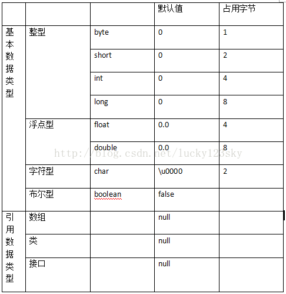

#### <span id="JumpToTop">摘要</span>

> 包括C C++ JAVA 学习总结。

<!-- more -->

## C

- （指向）数组（的）**指针**和（存储）指针（的）**数组**：
  - p++
  - 优先级：() > [] > *

```c++
// 数组指针声明
int (*p)[5];
(int  *)[5] p;	//类型是(int  *)[5]

// 指针数组声明
(int *)a[3];
(int *)(a[3]);
int *a[3] = {1, 2, 3};//?
```

## 保留关键字

#### static 静态变量

1. 静态存储区
2. 默认初始化为0
3. 作用域：函数体内的static局部变量，内存只分配一次，持久驻内存，下次调用保存原值
4. 作用域：static全局变量和函数，隐藏在本文件内，extern
5. 作用域：类中的static成员变量，属于类，所有实例共用
6. 作用域：在类中的static成员函数，不接受this指针，只能访问类的static成员函数

#### const 常变量

1. 常变量
2. 常指针
3. 常函数
4. 函数中输入变量
5. 类的常成员函数，不能修改成员变量

## C++ 和 C 的区别

## 虚函数

- [虚函数](<https://blog.csdn.net/ly_ysys629/article/details/76904129>)
  - virtual 允许子类重写（重新定义）的成员函数
  - 是多态的实现
  - 编写的时候不能确定被调用的是基类还是派生类的函数，所以虚
  - 父类指针指向子类对象
- 纯虚函数
  - 在基类中声明的函数
- 抽象类
  - 有纯虚函数的类
  - 组织继承层次，为派生类提供公共根
- final 说明符禁用类派生（继承）、虚函数重载（override）
- Lambda 表达式
- 指针 引用 区别
- struct class 区别

## 编程

##### Tips

没有好办法就暴力，没有好办法就模拟。

#### 数组初始化

##### int 数组

```
int a[10];		// 推荐 fill_n
fill(a,a+10,20);//三个参数，前面两个是起始地址，最后一个是填充值
fill_n(a,5,-3);	//三个参数，第一个是首地址，第二个是个数，最后一个是填充值
memset(a, 0, sizeof(a)); 	//
```

##### bool 数组

```
// 1、初始化器
bool boolArray[ARRAY_SIZE] = { 0 };		// 只可以初始化 0/-1
// 2、函数
#include <cstring>
memset(boolArray, 0, sizeof(Array)); 
```

#### **一、数学库函数**

数学库函数声明在 math.h 中，C++是cmath。

| 符号                      | 含义                      |
| ------------------------- | ------------------------- |
| abs(x)                    | 求整型数x 的绝对值         |
| cabs(struct complex znum) | 返回复数znum的绝对值       |
| cos(x)                    | x(弧度)的余弦              |
| fabs(x)                   | 求浮点数x 的绝对值         |
| labs(long n)              | 返回长整型参数n的绝对值    |
| ceil(x)                   | 求不小于x 的最小整数       |
| floor(x)                  | 求不大于x 的最小整数       |
| exp(double x)             | 返回指数函数e^x的值        |
| log(x)                    | 求x 的自然对数             |
| log10(x)                  | 求x 的对数(底为10)         |
| pow(x, y)                 | 求x 的y 次方               |
| sin(x)                    | 求x(弧度)的正弦            |
| sqrt(x)                   | 求x 的平方根               |
| srand(unsigned seed)      | 初始化随机数发生器         |
| int rand()                | 产生一个随机数并返回这个数 |

#### **二、字符串处理函数** 

字符串处理函数在 ctype.h/ctype 中声明。

| 符号                | 含义                                   |
| ------------------- | -------------------------------------- |
| int isdigit(int c)  | 判断c 是否是数字字符                    |
| int isalpha(int c)  | 判断c 是否是一个字母                    |
| int isalnum(int c)  | 判断c 是否是一个数字或字母              |
| int islower(int c)  | 判断 c 是否是一个小写字母               |
| int islower(int c)  | 判断 c 是否是一个小写字母               |
| int isupper(int c)  | 判断 c 是否是一个大写字母               |
| int toupper(int c)  | 如果 c 是一个小写字母，则返回其大写字母  |
| int tolower (int c) | 如果 c 是一个大写字母，则返回其小写字母  |

#### **三、字符串和内存操作函数** 

字符串和内存操作函数声明在 string.h/string中，在调用这些函数时，可以用字符串常量或字符数组名，以及char * 类型的变量，作为其 char * 类型的参数。

| 函数格式                                                     | 含义                                                         |
| ------------------------------------------------------------ | ------------------------------------------------------------ |
| char * strchr(char * s, int c)                               | 如果s 中包含字符c, 则返回一个指向s 第一次出现的该字符的指针, 否则返回NULL |
| char * strstr(char * s1, char * s2)                          | 如果s2 是s1 的一个子串，则返回一个指向s1 中首次出现s2 的位置的指针，否则返回NULL |
| char * strlwr(char * s)                                      | 将s 中的字母都变成小写                                       |
| char * strupr( char * s)                                     | 将s 中的字母都变成大写                                       |
| char * strcpy( char * s1, char * s2)                         | 将字符串s2 的内容拷贝到s1 中去                               |
| char * strncpy( char * s1, char * s2, int n)                 | 将字符串s2 的内容拷贝到s1 中去，但是最多拷贝n 个字节。如果拷贝字节数达到n，那么就不会往s1 中写入结尾的’\0’ |
| char * strcat( char * s1, char * s2)                         | 将字符串s2 添加到s2 末尾                                     |
| int strcmp( char * s1, char * s2)                            | 比较两个字符串，大小写相关。如果返回值小于0，则说明s1 按字典顺序在s2 前面；返回值等于0，则说明两个字符串一样；返回值大于0，则说明s1 按字典顺序在s2 后面。 |
| int stricmp( char * s1, char * s2)                           | 比较两个字符串，大小写无关。其他和strcmp 同。                |
| int strlen(const char *string)                               | 计算字符串的长度                                             |
| char * strncat(char *strDestination, const char *strSource, size_t count) | 将字符串strSource 中的前count 个字符添加到字符串strDestination 的末尾 |
| int strncmp(const char *string1, const char *string2, size_t count) | 分别取两个字符串的前count 个字符作为子字符串，比较它们的大小 |
| char * strrev(char *string)                                  | 将字符串string 前后颠倒。                                    |
| void * memcpy( void * s1, void * s2, int n)                  | 将内存地址s2处的n 字节内容拷贝到内存地址s1                   |
| void * memset( void * s, int c, int n)                       | 将内存地址s 开始的n 个字节全部置为c                          |

#### 参考

- [C++ 标准库常用函数一览](https://blog.csdn.net/candyliuxj/article/details/6313191)

- [C/C++ 中的标准库函数总结]( C/C++中的标准库函数总结)
<<<<<<< HEAD:source/_drafts/201905- C C++ 笔记.md
=======

##  JAVA

### 数据类型



### 静态变量

1. 静态存储区
2. 默认初始化为0
3. 作用域：函数体内的static局部变量，内存只分配一次，持久驻内存，下次调用保存原值
4. 作用域：static全局变量和函数，隐藏在本文件内，extern
5. 作用域：类中的static成员变量，属于类，所有实例共用
6. 作用域：在类中的static成员函数，不接受this指针，只能访问类的static成员函数

-  [201809-考研牛人的规律作息时间和健康饮食清单.md](201809-考研牛人的规律作息时间和健康饮食清单.md) 静态变量/方法：用static修饰，系统分配给一个静态变量，由类的所有实例共用
- 和非静态变量的区别：
  1. 内存分配/生存周期：
  2. 调用方式：REST接口WebResponse Message，
  3. 访问方式：
>>>>>>> 139cb9467e8066f0f60d6701f97d75e543d968a8:source/_drafts/201905- C C++ JAVA笔记.md
