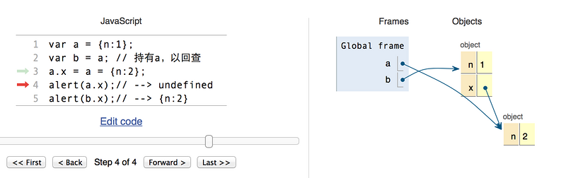

title: 前端笔记-201905
categories:
  - null
tags:
  - 2019
location:
  - null
abbrlink: c669f64b
date: 2019-05-05 18:57:20
updated: 2019-05-05 18:57:20

## 摘要

>

<!-- more -->

## 前端知识结构

HTML：视图层 内容

CSS：表现层 布局

JavaScript：~~内容层~~ 行为

JQuery：

## 计算机网络

### 网络层次划分

- 网络协议：通信规则
- OSI/RM七层模型
- **TCP/IP 五层模型**：
- TCP/IP 四层模型：
- **应用层**面向用户，**传输层**负责数据传送。


### 物理层

- 物理媒体
- 中继器和集线器

### 数据链路层

- 帧
- 网桥和交换机

### 网络层

- 路由器：路由选择
- **IP 因特网互联协议**
    - IP 数据报
    - **网关地址**：路由器的地址
    - **网络地址**：主机位全为0，网段的第一个地址
      - ==0.0.0.0== ：寻找自己的 IP 地址
    - **广播地址**：主机位全为1的，网络的最后一个地址
      - ==255.255.255.255== ：受限的广播地址，只能用于本地网络
    - 回送（~~环回~~）地址：127.0.0.0/8，表示本机地址
    - ABC类私有地址
    - 子网掩码：网络位+主机位
      1. 减少 IP 地址浪费
      2. 计算：通过 IP 地址与子网掩码**按位与**区分网络位和主机位
      3. 将一个大的 IP 地址划分为若干子网络
      4. 检测两个 IP 地址是否属于同一子网

| 地址 | 开头 |                        | 地址 | 网络号 |
| :--: | ---- | ---------------------- | ------------------------------ | ---- |
| A 类 | 0    | 0            | 0.0.0.0 ~ **127**.255.255.255  | 255.0.0.0 |
| B 类 | 10   | 2^7^ =128 | 128.0.0.0 ~ **128+63**.255.255.255 | 255.255.0.0 |
| C 类 | 110  | 2^7^ +2^6^ =192 | 192.0.0.0 ~ **193+31**.255.255.255 | 255.255.255.0 |
| D 类 | 1110 | 2^7^+2^6^+2^5^ =224 | 224.0.0.0 ~ **224+15**.255.255.255 | 组播地址（一对多的通信） |
| E 类 | 1111 | 2^7^+2^6^+2^5^+2^4^=240 | 240.0.0.0 ~ **240+15**.255.255.255 | 保留地址 |

| 1111 1111.1111 1111 | 0000 0000.0000 0000                 |
| ------------------- | ----------------------------------- |
| 网络位              | 主机位                              |
| B类地址 + 子网个数  | 主机个数+网关地址+网络地址+广播地址 |

- ICMP 因特网控制报文协议
- ARP 地址解析协议
  - 根据 IP 地址获取物理地址
- RARP 逆地址解析协议

### 传输层

- 网关

- TCP 和 UDP
  - 主要区别：UDP 不能保证提供**可靠**（完整、有序）的数据传输

  - TCP 的面向连接是**传输层**的，而 HTTP 的无连接则是**应用层**

| 区别           | TCP                        | UDP            |
| -------------- | -------------------------- | -------------- |
| 全称           | 传输控制协议               | 用户数据报协议 |
| 是否连接       | 面向连接                   | 面向非连接     |
| **传输可靠性** | 可靠的                     | 不可靠的       |
| 应用场合       | 传输大量的数据             | 少量数据       |
| 速度           | 慢                         | 快             |
|                | 负载较高，采用虚电路       | 采用无连接     |
|                | 三次握手、窗口技术和流控制 |                |

- TCP/IP 三次握手四次挥手
  - B（(SYN=1, seq=x)） S（SYN=1, ACK=1, seq=y） B（ACK=1）
  - S（FIN=1，seq=x） B（ACK=1） B（FIN=1，seq=y） S（(ACK=1）

### 应用层

- 报文
- FTP 文件传输协议
- Telnet 远程登录协议
- DNS 域名解析协议
- SMPT 邮件传送协议
- POP3 邮局协议
- HTTP 超文本传输协议

### 浏览器访问网页的过程

1. 获取网页
   1. 输入网址
   2. **DNS 解析**得到**服务器地址**
   3. 浏览器向服务器发起 **HTTP 请求**（请求消息），TCP/IP 三次握手确认连接
   4. 服务器给浏览器响应一个301永久重定向
   5. 浏览器跟踪重定向地址，发现缓存中有，304，直接去缓存中拿（最快）
   6. 服务器处理请求，将网页内容返回给浏览器（响应消息）

2. 解析网页
   1. DOM 构造
      1. HTML 解析器 -> DOM 树
      2. CSS 解析器 -> **样式表规则**
   2. 布局：**广度？优先**读取 DOM 树结点，送入**文档流**
   3. 渲染（~~绘制~~）页面

### HTTP

三点注意事项：

1. **无连接**：每次连接只处理一个请求

   HTTP 1.1 默认开启 Keep-Alive，一定时间内保持连接

2. **无状态**：协议对事务处理没有记忆能力；后续处理需要前面的信息时必须重传；服务器不知道客户端是什么状态

3. 媒体独立：可以发送任何数据类型，

4. **MIME-type 类型**：text/html， application/json, image, video, audio

#### 消息结构

##### 客户端请求消息

1. 请求行：8种请求方法类型
   1. HTTP1.0：GET POST HEAD
   2. HTTP1.1：PUT DELETE CONNECT OPTIONS TRACE
2. 请求头部
   1. Accept
   2. Cache-Control
3. 请求数据

##### 服务端响应消息

1. 状态行

```
// 协议 状态码 英文名称
HTTP1.1 200 OK
```

2. 消息报头：响应头信息
3. 响应正文

#### 状态码

- 浏览器接受并显示网页前
- 在**服务器响应消息**的**状态行**中

| 状态码  | 英文名称   |                                |
| ------- | ---------- | ------------------------------ |
| ==1**== | 信息       | 服务器收到请求，请继续执行操作 |
| ==2**== | 成功       | 操作并成功接受并处理           |
| 200     | OK         | 请求成功，一般用于 GET 或 POST |
| ==3**== | 重定向     | 需要进一步的操作以完成请求     |
| 301     |            | 网页被转到其它 URL             |
| ==4**== | 客户端错误 |                                |
| 404     |            | 请求的资源不存在               |
| ==5**== | 服务端错误 |                                |
| 501     |            | 内部服务器错误                 |

## HTML

- HTML 是一种**标记语言**（不是编程语言） 是一套**标记标签**
- HTML 文档由**嵌套的 HTML 元素**构成
- 元素 = 开始标签（属性、样式等）+ 内嵌内容 + 结束标签  <br/>
- 大多数元素有属性
- 版本：HTML4.0.1（1999） HTML5（2014）
- ==HTML Data- 属性==

### 兼容

- `<br>` `<br/>` `<br />`
  - 因为HTML5兼容XHTML写法，所以三种都可以使用，没有区别。
  - `<br>` 是**HTML**写法。因为HTML是**SGML**的子集，允许没有结束标签，而换行符元素正好不需要**内嵌内容**。
  - `<br/>`  是**XHTML1.1**的写法，也是**XML**写法。因为XHTML是XML的子集，在XML中，标签必须要有结束标签，必须写成`<br></br>`（HTML解析中被理解为2个`<br>`）或简写成`<br/>`。
  - - [x] `<br />` 是**XHTML**为兼容**HTML**的写法，也是**XML**写法。
      - 较少的代码量：在HTML解析中会理解成有"/"的属性的`<br>`标签
      - 规范严谨：在XML解析中会理解成`<br></br>`的简写

### 元素和标签

- `<!DOCTYPE > ` 告知浏览器文档类型

  - `<head>`
    - `<meta>` 元数据

      - `http-equiv`属性 ：用于模拟一个 http 响应头

        1. content-type：字符编码

        2. default-style：预定义样式表（ content 属性的值必须匹配同一文档中的一个 link 元素上的 title 属性的值，或者必须匹配同一文档中的一个 style 元素上的 title 属性的值）

        3. Set-Cookie：设定 cookie 有效时间。

        4. Pragma（cache模式）：禁止浏览器从本地计算机的缓存中访问页面内容。

        5. Expires：缓存过期时间

        6. X-UA-Compatible：指定网页的兼容性设置

        7. viewpoint：针对移动网页优化页面

           ```html
           <meta name="viewport" content="width=device-width, initial-scale=1, maximum-scale=1">
           ```

        8. refresh：URL

        ```html
        <!-- 每30秒刷新一次 -->
        <meta http-equiv="refresh" content="30">
        ```

      - `charset` 属性：设置字符编码，H5

        ```html
        HTML4.01： <meta http-equiv="content-type" content="text/html; charset=gbk">
        HTML5： <meta charset="UTF-8">
        ```

      - `name` 属性（`keywords，description，author ` ）  SEO

      - `content` 辅助属性：定义与 http-equiv 或 name 属性相关的内容

      - `scheme` 辅助属性：定义 content 的格式

    - ` <title>, <style>, <link>, <script>, <noscript>, <base>`

    - `<link>` 

      - `<link rel="stylesheet" type="text/css" href="mystyle.css">`
      - `<link rel="shortcut icon" href="图片url">`
  - `<body>`

    - **块级元素**：元素在一块内从上到下**垂直排列**；元素独占一行，默认填满父元素的宽度；宽高的内外边距均可设置；主要做容器容纳其它元素。
      - `<div>`
        - 文档布局
        - 大的内容块设置样式
      - `<h1>, <p>, <ul>, <table>，<tr>, <form>， <hr>`
      - 元素样式的`display:block;` 
    - **行内（内联）元素**：元素在一行内水平排列；高度由元素的内容决定，宽高（`line-height` ）的上下内外边距不可设置；只能容纳**文本**或者其他内联元素。
      - `<a>, , <br />, <label>, <span>，<input>`
      - 文本/格式化标签
        - `<b>` `<strong>`
        - `<i>` `<em>`
        - `<abbr>` 定义缩写
      - 元素样式的`display : inline` 
      - 设置`float:left/right` 后，display属性会变为block，且拥有浮动特性。行内元素去除了之间的莫名空白。
      - `position:absolute` 与`position:fixed` 都会使行内元素变为块级元素。
    - 可通过修改`display`属性切换
      - none：不显示该元素
      - inline-block：转换为行内块级元素 `input`默认设置

- `<!DOCTYPE>`

  - **HTML4.0.1** 基于 SGML，所以引用 DTD （文档类型声明）。三种声明：Strict（`html:4s` ）、Transitional（`html:xt` 过渡型） 和 Frameset。
  - **HTML5** `!` `html:5`  `<!DOCTYPE html> ` 告知浏览器文档类型为 HTML5。

- 字符编码
  - ASCII：1位**传输奇偶控制**
  - HTML5：Unicode 标准（UTF-8 字符集）

- `<a>` 

  - 无法通过修改父级标签来改变子级标签特性

  - 用 CSS 改变样式点击后的样式

  - target="_blank" 属性 在新窗口打开

  - 始终将正斜杠添加到子文件夹：因为服务器会添加正斜杠到地址，然后创建一个新的请求，总共产生两次 HTTP 请求

### 布局

### 表单

### 事件

#### 用法

1. ~~触发 HTML 事件执行 JS~~

```html
<h1 id="myTitle">我是标题~</h1>
<button type="button" onclick=myFun()>标题变色</button>
<script>
	function myFun() {
        document.getElementById('myTitle').style.color='red';
	}
</script>
```

2. 通过 DOM 向 HTML 元素分配事件

``` HTML
<h1 id="myDate">日期显灵！</h1>
<button type="button" id="myBtn">显示日期</button>
<script>
    document.getElementById("myBtn").onclick = function() {
        document.getElementById("myDate").innerHTML = Date();
    }
</script>
```

#### 分类

- onload 和 unonload：浏览器信息，处理 cookie
- onchange：元素改变时，如输入字段验证
- onmouseover 和 onmouseout：鼠标移入
- ==onmousedown、onmouseup、onclick== 
- onkeydown：按下键盘
- ==onfocus：获取焦点== 

### 监听事件

- addEventListener()：向指定元素添加**事件句柄**

### SEO

- Search Engine Optimization（搜索引擎最佳化）
- 影响标签
  - `<title>`
  - `<meta>`
  - `<h1>`
  - ``

## HTML5
- 设计目的：为了在移动设备上支持多媒体。

### 新特性

1. canvas 元素：画布容器
2. 多媒体元素： video，audio 
3. 新的8个**语义元素**，都为块级元素，header, nav, section, article, aside,footer,  main,  figure；已移除标签（`<font>, <center>, <strike>`）和属性:（`color ， bgcolor`）
4. 新的表单输入控件，比如 color， calendar、date、time、email、url、search，range；datalist，keygen，output
5. 对**本地离线存储**的更好的支持
6. 缓存引用
7. 本地 SQL 数据
8. Web 应用
9. 完全支持 CSS3，新选择器
10. XHTMLHttpRequest 2

### 浏览器支持

- IE8及更早不支持：**shiv**注释，解决HTML5的新元素不被IE6-8识别的问题。

## CSS

### 插入方式

- 内联样式：在元素中使用 style 属性
- 内部样式表：在 head 中使用 style 标签
- 外部引用

### 属性

- font-family 字体：文泉驿微米黑
- text-align 居中对齐
- 颜色

- 选择器：`#`， `[标签名]`  +`.`
- ==盒模型==

## CSS3

### 新特性

- 新属性
- 动画
- 2D/3D 转换
- 圆角
- 阴影效果
- 可下载的字体

## DOM

- DOM 树

- DOM（Document  Object Model）（文档对象模型）， W3C 标准，描述**处理网页内容**（HTML）的方法和接口，将文档解析为**结点对象**组成的 DOM 树，用于改变文档内容

- BOM（浏览器对象模型），描述**与浏览器进行交互**的方法和接口

- 查找 HTML 元素

  1. Id
  2. TagName
  3. ClassName

- 修改 HTML 元素的内容和属性

  - innerHTML

- 修改 HTML 元素的样式

  ```
  document.getElementById("p2").style.color="blue";
  ```

- 增删 HTML 元素

## JavaScript

- 轻量级**解释型脚本语言** 逐行执行 用于交互
- ECMAScript，描述了该语言的语法和基本对象 ES6

### 数据类型

- 分为字面量和变量，狭义指变量数据类型
- **动态语言**：变量数据类型可变
- 变量均为对象，可用 new + 对象 声明变量类型

```js
// 注意没括号
var num = new Number;
```

- typeof

- undefined 与 null 区别
  1. 二者值相等， null == undefined
  2. 类型不同
  3. null为空对象引用 用于比较大的对象释放内存时，清空变量

- Date

  - ( new Date() ).getTime() 时间戳

- **强制类型转换**

  1. `Boolean(value)`——转换成Boolean型：至少有一个字符的字符串、非0数字或对象时，返回true。**空字符串、数字0、undefined或null**，返回false。
  2. `Number(value)`——转换成整数或浮点数；
  3. `String(value)`——转换成字符串。 
  4. (123).toString(); 
- <https://juejin.im/post/5b2b0a6051882574de4f3d96>

| 数据类型     | 存储方式                                  | 方法 | typeof    |
| ------------ | ----------------------------------------- | ---- | --------- |
| undefined    | 原始（基本）数据类型                      | 无   | undefined |
| null         | 基本数据类型                              | 无   | object    |
| boolean      | 基本数据类型                              | 有   | -         |
| number       | 基本数据类型                              | 有   | -         |
| string       | 基本数据类型                              | 有   | -         |
| Symbol       | 基本数据类型，ES6，静态不可更改，类似枚举 |      |           |
| object       | 引用数据类型，可变                        | 有   | object    |
| array        |                                           |      | object    |
| function     |                                           |      | function  |
| RexExp, Date |                                           |      | object    |

### 运算符

- 运算
  - +：加法和字符串连接 `3+"5"`-->`35` 
  - /：

- 比较
  - === 数据类型和值绝对相等
  - ！== 值和类型至少一个不等
- 逻辑
- 连等
  - a.x 的指针没有被创建，则声明并指向 null，此时指针地址已固定
  - a 的指针已被创建，找到它
  - 从右到左，以上两指针分别指向 { n : 2 }

```js
// 赋值结果
a => {n: 2}
b => {	n: 1, 
    	x: { n: 2 } 
     }   
```



### 作用域

- 作用域是**可访问变量**，对象，函数的集合
- 非严格模式下给未声明变量赋值创建的全局变量，是全局对象的可配置属性，可以删除。

``` js
// 没有用 var 声明，则为全局变量
// 自动作为 window 对象的属性，可删除
name = "Harry";
```

|                 | 局部变量                | 全局变量                                 |
| --------------- | ----------------------- | ---------------------------------------- |
| 声明            | 函数内，用 var let 声明 | 函数外，函数内不用 var 声明（如上）      |
| 作用域          | 局部作用域，本函数内    | 全局作用域，网页中所有脚本和函数都可使用 |
| 生存期/生命周期 | 函数执行完自动销毁      | 页面关闭后删除                           |
-   在 HTML 中, 全局变量是 window 对象: 所有数据变量都属于 window 对象。
-   全局变量或函数，可覆盖 window 对象的变量或函数。局部变量，包括 window 对象可覆盖全局变量和函数。

| 声明     | var                                                        | let                                                          | const                                                |
| -------- | ---------------------------------------------------------- | ------------------------------------------------------------ | ---------------------------------------------------- |
| 定义     |                                                            | 块级作用域，ES6，变量只在声明所在的块内有效，{} 外不能访问。如循环体的作用域 | 声明只读常量（常变量），必须初始化，指向值不可改     |
| 全局变量 | 属于 window 对象，可用 window.name 访问                    | 不属于 window 对象                                           |                                                      |
| 变量提升 | 只有 var 声明的变量会提升，初始化的不会                    | X                                                            | X                                                    |
| var      | 在相同的作用域中，只能用 **var** 来重置 **var** 声明的变量 | X                                                            |                                                      |
| let      | X                                                          | X                                                            |                                                      |
| const    |                                                            |                                                              | **const** 声明的变量，在不同作用域中可以重新声明赋值 |

- 严格模式：“use strict“
- 重新声明变量，值不丢失

```js
var carname="Volvo"; 
var carname;
```

### 语法

- 顺序
- 条件
- 循环
  - for/in 循环遍历**对象**的属性，会跳过未定义的元素；for 会输出 undefined
  - continue 只能用于循环
  - break 只能用于循环和 switch 中： 默认标签为当前代码块
  - break 通过 label 标签引用可跳出任何代码块，可用于多层循环时控制外层循环
- 输出
  1. window.alert(“”)
  2. innerHTML()  = 
  3. console.log(“”) 和 console.info(“”)
  4. document.write(“”)

### 数字

- 浮点数精度问题 
- 浮点数存储
  - 使用 64 位固定长度来表示，也就是标准的 double 双精度浮点数


- 浮点数四则运算 浮点数无法精确表示

  - [浮点数陷阱](<https://github.com/camsong/blog/issues/9>) Math.abs(left - right) < Number.EPSILON * Math.pow(2, 2);

- 大数危机

  - **[Number.MIN_SAFE_INTEGER, Number.MAX_SAFE_INTEGER]** 的整数都可以精确表示

- `toPrecision` 是处理精度，精度是从左至右第一个不为0的数开始数起。

- `toFixed` 是小数点后指定位数取整，从小数点开始数起。四舍五入结果不准确

### 对象

- JS 对象是变量（键值对）（对象属性和方法）的**容器**
- 类似 C 里的**哈希表** 和 PHP 里的**关联数组**

### 数组

- 不支持名字索引数组，可以索引对象
- 用名字索引数组会导致数组重定义为标准对象，数组的方法及属性都将失效

```javascript
// 初始化
var arr = [11, 22];

// 尾增
var len = arr.push(55);
// 尾删
var val = arr.pop();
// 首删
var val = arr.shift();

// 替换，可作删除用
Array array.splice( index, howmany, [item1, ....., itemX] );

// 按值查索引
var index = arr.indexOf(11);
// 按区间[startIndex, endIndex)查
Array array.slice( start, end);

// 长度
var len = arr.length;

// 排序
// 默认为按字母升序	
str.sort();
// 反序，可实现按字母降序
str.reverse();
// 按数字升序
arr.sort( function (a, b)(return a-b) );
```

### 字符串

- 转换为数字
  1. parseInt( ) 方法：字母标点截断，基模式，`010`默认八进制
  2. parseFloat( ) 方法：没有基模式，默认十进制
  3. Number( ) 强制类型转换
  4. 弱类型用运算符转换

```
+ '' // 等价于 String(X)
+X     // 等价于 Number(X),也可以写成 x-0
!!X    // 等价于 Boolean(X)

var str= '012.345 ';  
var x = str-0;  
x = x*1;
```


| 方法                                                    | 作用                                                   |
| ------------------------------------------------------- | ------------------------------------------------------ |
| myDate.constructor.toString().**indexOf**("Date") > -1; | 查找字符第一次出现的索引                               |
| subStrIndex = str.search( substr );                     | 用于检索子字符串或**正则表达式**，并返回子串起始下标。 |
| str.replace( /microsoft/i, substr );                    | 替换                                                   |

### 正则表达式

- 修饰符 表达式 元字符 量词
- 最常用的两个方法：
  - search()：
  - replace()：

```js
var str = "Visit Runoob!"; 
var n = str.search(/runoob/i);
// 下标 n = 6
var txt = str.replace(/Runoob/, "Replace！");
// 文本 txt = Visit Replace！
```

### 函数

- 函数提升：先调用后定义，实质是作用域的提升；用**表达式定义**的函数无法提升
- 对象方法：对象的构造方法

#### 函数定义

- 箭头函数
  - 默认绑定外层 this 的值，this 和外层的 this 相同
  - 不能提升
  - const 比 var 安全，因为函数表达式始终是一个常量 

```js
// 1.表达式定义
function f (a, b) {};
f(1, 2);

// 2.匿名函数：没有函数名
var x = function (a, b) { return a * b};
// 通过变量名调用匿名函数
var z = x(4, 3);

// 3.也可以自调用
(function () {
    var x = "Hello!!";
})();

// 4.Function() 构造函数
var f = new Function("a", "b", "return a * b");

// 5.箭头函数，ES6，f 作函数名
const f = (x, y) => x * y;
// 二者作用相同
const x = (x, y) => { return x * y };
```

#### 函数参数

- 显示参数和隐式参数，ES6可设置默认参数
- 内置 Arguments 对象：函数调用的参数数组
- 通过**值传递**参数：隐式参数的改变在函数外是不可见的。
- 通过**对象传递**参数：在函数内部修改对象的属性会修改其初始值。

#### 函数调用

- 函数有 4 种调用方式，不同在于 **this** 的初始化。一般而言，**this** 指向函数执行时当前对象。
  1. 作为函数调用：**this** 指向全局对象；
  2. 作为方法调用：**this** 绑定到所属对象；
  3. 用构造（器）函数调用，创建一个新对象，继承构造函数的属性和方法：**this** 指向新创建的实例；
  4. 作为函数方法调用，call() 和 apply()。this 显式函数绑定：call() 和 apply() 方法允许切换函数执行的上下文环境，可以将 this 指向任何对象。在严格模式下，this 是 undefined？
     - bind()
     - apply() `a.say.apply(b)`;传参数数组
     - call()：参数列表
  5. 在事件中，this 指向接收事件的元素。
  6. ==指向正在执行的函数本身==

#### 回调函数

- 回调陷阱

#### 计数器困境、内嵌函数、闭包

```
var add = (function () {
    var counter = 0;
    return function () {return counter += 1;}
})();
 
add();
add();
add();
 
// 受外层匿名自我调用函数的作用域保护，只能用 add() 修改
// 计数器 add.counter = 3
```

### 内存管理 垃圾回收机制

#### 深拷贝和浅拷贝的实现

### 性能优化

### JSON

- 存储和传输数据的格式
- 大括号保存对象
- 方括号保存数组
- 数组、对象可相互嵌套
- var obj = JSON.parse( jsonStringData );
- var jsonStringData  = JSON.stringify( obj );

### 表单

- 表单（自动）验证
- 数据验证
- H5 约束验证
  - HTML 输入属性
  - CSS 伪类选择器
  - DOM 属性和方法

### 错误和调试

```
try {
} catch(e) {
} throw {  
} finally {  
}
```

### ES6

- 类和模块化
- 箭头函数
- promise

## Node.js

- 运行在服务端的 JavaScript 事件驱动 I/O 基于 Google  的 V8 引擎

<https://www.runoob.com/nodejs/nodejs-tutorial.html>

## PHP

#### include() 和 require()

| 区别     | include()                                | require() ~ include_once()     |
| -------- | ---------------------------------------- | ------------------------------ |
| 性能     | 每次都读取一遍文件                       | 只处理一次（本质是替换）       |
| 效率     |                                          |                                |
| 加载失败 | warning 警告，但脚本继续执行（4.3.5 前） | fatal error 错误，脚本停止执行 |
| 位置     |                                          |                                |

## 经典面试问题

- 计算机网络
  1. 浏览器访问网页的过程
  2. http 与 https 的区别
- 介绍常用的排序算法
- JS
  1. 数据类型有哪些 undefined 与 null 区别
  2. 对原型链的了解
  3. 对跨域的了解
  4. call、apply、bind的区别
  5. 介绍闭包
  6. 深拷贝和浅拷贝的区别
  7. 使用let、var和const创建变量有什么区别 介绍变量提升
  8. cookie、localStorage、sessionStorage区别
- HTML
  1. 块级元素与内联元素的区别
  2.  ``的`title`和`alt`有什么区别
- CSS
  1. 水平垂直居中的几种方式
  2. 清除浮动的几种方式
  3. display:none、visibile:hidden 区别