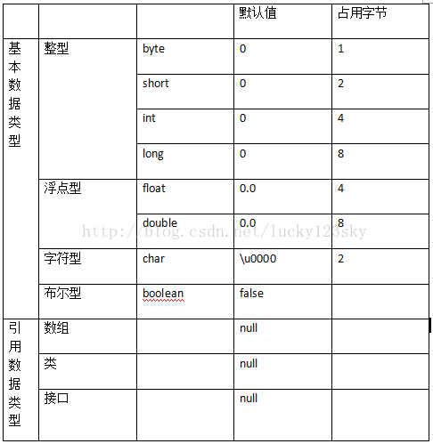

## 摘要

>

<!-- more -->

## JDK、JRE、JVM

- **SDK**（Software Development Kit）
  - JDK（JAVA Development Kit），是一种 JAVA SDK，用于程序开发者编译调试程序。
- **JRE**（JAVA Runtime Environment）
  - JVM（JAVA Virtual Machine）
    - 定义：JAVA虚拟机是一个可以执行**JAVA字节码**的**虚拟机进程**。
    - 作用：JAVA源文件被编译成字节码文件，能被JVM执行，==底层硬件平台的指令长度和其他特性==。所以JAVA可以运行在任意平台（**一次编译，到处运行**），而不需要每一个平台单独重写或重新编译。
  - 一些标准的**类别函数库**（Class Liberary）

## 数据类型



### 四小类八大类基本类型（primitive type）

- 布尔型
- 字符型
- 整型
- 浮点型

  - ==下转型==（down-casting，也称为窄化）会造成精度损失

  - ==不允许将float变量赋值给int变量==
  - 浮点数精度陷阱（判断大小时出错）：0.99999999f==1f //true 
- instanceof

### 三类引用类型（reference type）

- 数组

  - For-Each : JDK1.5+

  ```java
  for(double element: myList){
  	System.out.println( element );
  }
  ```

- 类
  - JAVA集合类
    - （1）List：ArrayList是动态数组；LinkedList是一个双向链表，Stack是一个对象栈，遵循先进后出的原则。
      （2）Set不包含重复元素。hashset原理和hashmap类似；treeset是一个自动排序的set，实现了SortedSet接口。
      （3）Map：TreeMap可以根据Key值进行自动排序。
      （4）Quene：阻塞式队列（ArrayBlockingQuene）和非阻塞式队列(PriorityQuene，内存允许，可以追加元素)。
- 接口
- 长度
  - 数组：array.length 
  - 字符串类：String.length()

- 数组、List、ArrayList

  - 数组：大小固定，查找快

  - List：是接口

  - ArrayList：是List的实现类，特性就是有序，以一定的顺序保存元素。List不能被构造：

    ```
    List list = new ArrayList();
    ```

    List中没有而ArrayList中有的方法将不能被list对象使用。这种用法属于Java的多态特性。

    当使用多态方式调用方法时，首先检查父类中是否有该方法，如果没有，则编译错误；如果有，再去调用子类的该同名方法。
    List接口继承自Collection接口：

    ```
    public interface List<E> extends Collection<E> {
    }
    ```

- ==枚举类型==（enumeration type）

- Interger 装箱拆箱
  
- JAVA是一个近乎纯洁的面向对象编程语言，但是为了编程的方便还是引入了基本数据类型，为了能将基本数据类型当成对象操作，引入了对应的包装类型（wrapper class），int的包装类就是Integer，char的包装类是**Character**。从JAVA 5开始引入了自动装箱/拆箱机制，使得二者可以相互转换。
  
- ==判断，基本数据类型和对象的区别

- 常量

  ```JAVA
   public static final int NAME = "John";
  ```

  - static保证它的空间效率：一个类中只有一份，而不会每个对象都只有一份。
  - final保证它不会被修改，从而编译器可以做某些优化，即相当于保证了时间效率。 

## 面向对象

### 面向对象的四大特征

- **[抽象]**：将**一类对象**的共同特征**提取**出来构造**类**，类是对象（实例）的抽象。包括数据抽象和行为抽象两方面。抽象只关注对象有哪些属性和行为，并不关注这些行为的细节是什么。
- **封装**：把数据和操作数据的方法绑定起来，只能通过已定义的接口访问数据。类是一种封装。数据结构：逻辑结构 + 物理结构 + 运算。
- **继承**：从已有类得到继承信息创建新类.
- **多态**：指允许不同子类型的对象对同一**消息**作出不同的响应。简单的说就是用同样的对象调用同样的方法但是做了不同的事情。
**方法重载（overload）**实现的是编译时的多态性（也称为前绑定），重载发生在一个类中，同名的方法有不同的参数类型或个数。
而**方法重写（override）**实现的是运行时的多态性（也称为后绑定）。子类**继承**父类并重写父类中已有的或抽象的方法，重写发生在子类与父类之间，重写要求有相同的返回类型，
构造器不能被继承，因此不能被重写，但可以被重载。
- 外部类 & 内部类
### 抽象类（abstract class）和接口（interface）有什么异同？

- 抽象类和接口都不能够实例化，但可以定义抽象类和接口类型的引用。
- 一个类如果继承了某个抽象类或者实现了某个接口都需要对其中的抽象方法全部进行实现，否则该类仍然需要被声明为抽象类。
- 接口比抽象类更加抽象，因为抽象类中可以定义构造器，可以有抽象方法和具体方法，而接口中不能定义构造器而且其中的方法全部都是抽象方法。
- 抽象类中的成员可以是private、默认、protected、public的，而接口中的成员全都是public的。
- 抽象类中可以定义成员变量，而接口中定义的成员变量实际上都是常量。
- 有抽象方法的类必须被声明为抽象类，而抽象类未必要有抽象方法。

### 静态变量

1. 静态存储区
2. 默认初始化为0
3. 作用域：函数体内的static局部变量，内存只分配一次，持久驻内存，下次调用保存原值
4. 作用域：static全局变量和函数，隐藏在本文件内，extern
5. 作用域：类中的static成员变量，属于类，所有实例共用
6. 作用域：在类中的static成员函数，不接受this指针，只能访问类的static成员函数

- 静态变量/方法：用static修饰，系统分配给一个静态变量，由类的所有实例共用
- 和非静态变量的区别：
  1. 内存分配/生存周期：
  2. 调用方式：REST接口WebResponse Message，
  3. 访问方式：

### 内存中的栈(stack)、堆(heap)和静态区(static area)的用法

  通常我们定义一个基本数据类型的变量，一个对象的引用，还有就是函数调用的现场保存都使用内存中的栈空间；
  而通过new关键字和构造器创建的对象放在堆空间；
  程序中的字面量（literal）如直接书写的100、"hello"和常量都是放在静态区中。
  栈空间操作起来最快但是栈很小，通常大量的对象都是放在堆空间，理论上整个内存没有被其他进程使用的空间甚至硬盘上的虚拟内存都可以被当成堆空间来使用。
  String str = new String("hello");
  变量str放在栈上，用new创建出来的字符串对象放在堆上，而"hello"这个字面量放在静态区。

## 并发

### 多任务
### 进程和线程
### 多进程
### 多线程

### IO多路并发

## 参考文献

1. [JDK - 维基百科](https://zh.wikipedia.org/wiki/JDK)
2. [JAVA面试笔试题大汇总(最全+详细答案)](https://yq.aliyun.com/articles/14318)