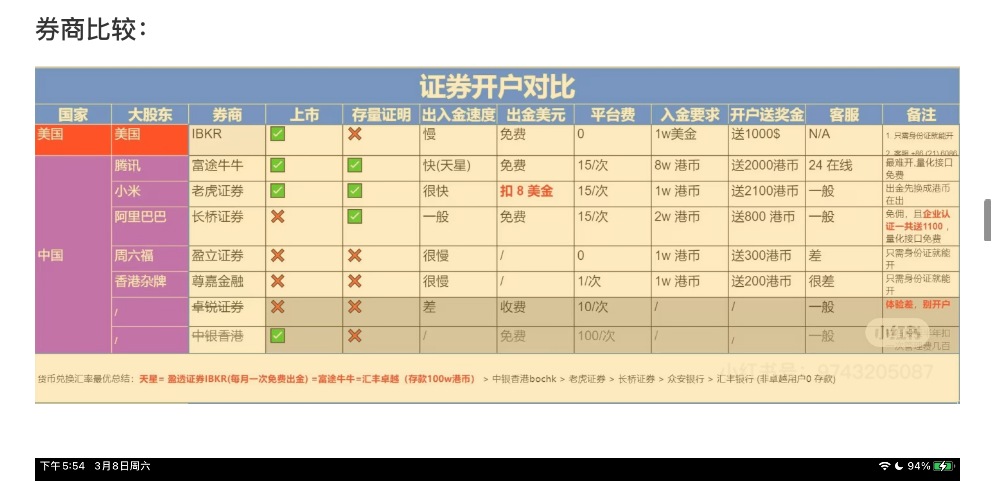
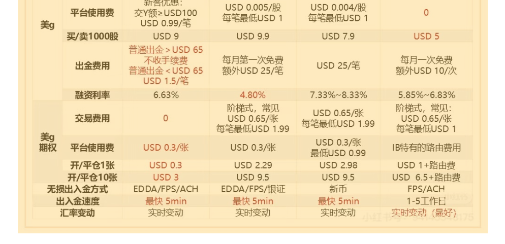
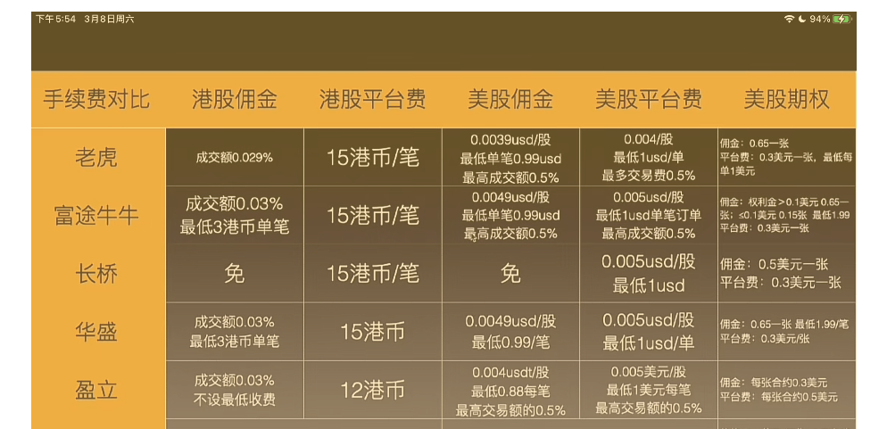

> 摘要：香港银行开户、港股美股券商开户总结。

<!-- more -->

## 简化版

~~整体开户思路~~

## 外汇出入境

境内需要开的银行卡，可以免电汇费、手续费的：

### 出境：内地—>香港

注意事项：

- 尽量在城市分行大网点开户，涉及外汇有些步骤需要人工审核，大网点权限高、方便
- 需要**一类卡**：才可以购汇，限额才能到1w以上
    - 柜面注册：手机自助注册的卡会限额2w。可到营业网点删除当前的手机银行，重新在柜台开立。网点自助服务机，有大堂柜员协助也可以。
- 境内的卡不能互转外汇
    - 据说可以柜台办理；
    - 或者先提现、再存入，但这样现汇就变为现钞，需要再转为现汇才能汇出，要看银行是否支持。
- 现汇、现钞
    - 现汇：可以直接汇到国外账户的外币。也可以再结汇成人民币。
    - 现钞：可以取现的外币，国内存入会有损耗。
    - 现汇转为现钞：一般来说现在没有手续费了。比如**中行**开户行异地取现汇有转换手续费，所以最好用本地开的银行卡购入现钞，或者无损转为现钞。
    - 现钞转现汇：一般和现汇有汇率差，转成现汇有几十手续费。
- 防止被风控：
    - 每年5w$ 便利购汇额度，购汇理由选**因私旅游**
    - 最好汇款对应货币不易被风控。比如向香港的银行卡转港币，这就多了一个港币转美元的汇损，约0.1-0.2%。
        - 美元去香港是高危行为，容易被风控。不过也用中行转过美元，后面都转港币了。
    - 大额少次汇款：比如一个月3次以内，再多容易被内地风控。

#### ❤️ 购汇 + 电汇

> 开港卡后用这个途径购汇出境，非实时到账。

境内需要开的银行卡（可以免电汇费、手续费的）：

1. ✅**中行**：和中银香港用**中银快汇**同名互转。感觉相对兴业来说限制少。
    - 账户拼音要完全一致，否则会收费，会被认为是两个人。
    - 港币转到港元储蓄账户，美元转到**外汇宝**账户。两个账户编号不一样，转错会有汇率损失。
    - 到账时限：工作日一天左右到账。
    - 中行跨境通visa、莫奈日出印象卡，atm取现
2. ✅**兴业寰宇人生**：购汇汇率好。可以用于取现随身带着、零钱比较全。
    1. 港币转到汇丰，免费 30笔/年。汇款开始收紧，有电话回访确认用途，可能会被要求提交签注、机票酒店预订单等证明（只提供签注也过了）。
    2. 港元0损转恒生，中转行填兴业香港支行代码FJIBHKHHXXX。
    3. 美元去香港是高危行为，容易被风控。
3. ✅**大湾区工银**：和工银亚洲互转免费。工银亚洲与其他港卡转美元会收费，建议作为**备选**。
    - 一类卡需要社保，某些分行可能也给开；骚操作：深圳开二类卡，回居住地升级成一类（）。
4. ❇️~~招商金葵花~~：存款50w以上可开金葵花，手续费每笔10hkd。汇率差。

##### 刷卡优惠：

- 银联权益u赏活动

- 中行有visa/mastercard借记卡可以当即拿到
- 信用卡境外刷卡返现：农行尊然白、全球支付卡，工行祥运运通卡等
- 运通卡返现：满足活动返现奖励规则的合格境外消费有机会享2%返现，单卡每自然月最高返现300元人民币。
- 招商visa信用卡叮叮车3-1，云闪付-1。一拍即付0.5$返现10%

#### ❤️ 跨境支付通

> 港币到账相当于**自动购汇 + 电汇**，省略了购汇的步骤。

- 优点：
    - 到账快，实时到账。类似香港的转数快
    - 可直接转账人民币到香港账户，变为离岸人民币。直接消费人民币的场景少了两次换汇的步骤，没有汇损。
    - 选港币到账少了购汇的步骤
- 缺点：
    - 一般来说，离岸人民币换汇港币、美元的汇率差，换到的外币变少
    - 有额度限制，据实测基本是单日1w/银行
- 应用场景：
    - 比如香港信用卡在内地刷卡，人民币入账、需要用人民币还款，如信银GBA
    - 需要及时到账，不在乎汇率
    - 离岸人民币存款利率还不如大陆

#### ❤️ 取现 + 人肉带现金

> 首次开卡可用现金存款。

- 应用场景：线下现金用的也比较多，支付宝微信有些地方也可以用，汇率不太好，不如购汇之后用纸币。
- 港币有三家发钞行，每家发钞行隔几年会更新纸币样式，所以港币的样式有好几十种。
    1. 一般国内取现面额多为1000、500、100，存款可以用1000的。
    2. 线下消费小店大多不收1000、500大额的，100 面额以下用的多，找零多用1、2、5、10元硬币。
    3. 100面额20张左右吧，丰俭由人。
    4. 10元面额的塑料纸币手感真的很好。

- 取现步骤：在天天汇率app查外汇现钞牌价，选一家银行，在汇率好时买入现钞，提前几天app**预约**取现外币。
    - 中行多为1000、500面额，比较新；兴业有小面额100的
- 海关限额：要求2w¥、5k$/**3w hkd**。
    - 建议带最大现金额度约3w hkd。
    - 有人说部分海关按照 2w人民币+5000 美元计算，也有人说二者总额不超过 5000 美元。
    - 其中**开户要求存入**的有：中银香港1000，汇丰100，招商永隆1w，工银亚洲1w等。开卡后用ATM存入。

#### ❤️ 境外ATM取现

> 用于临时取现，限额低、汇率差、手续费复杂

注意：

- 按银联汇率取港币。
- 每卡单次限额3k-6k，每天限额1w，每年10w。

手续费分两部分：

- ATM的跨行取现手续费：
    1. 汇丰、恒生相互免手续费，限额3000；
    2. 其他的银通阵营相互免手续费，如花旗、招商、交通、华侨均限额6k。
    3. 跨支付系统收费，恒生ATM取银联15¥。
- 免发卡行手续费的有：
    1. ✅**兴业寰宇人生**：免3笔/月。
    2. ❇️**光大中青旅出国金融联名卡**/出国+：免3笔/月。铂金会员服务、银联白金借记卡权益。银联刷卡汇率优惠。
    3. 中行长城环球旅行卡（停发）、长城冰雪借记卡/跨境通visa卡年费10¥。
    4. 上海银行·许愿卡。
    5. 中信运通免3笔/月，其他15¥。
    6. 东亚银联10¥、招商银行0.5%最低10¥。

#### ~~❤️ wise购汇到香港账户~~

> 用于虚拟币等交易

### 入境：香港—>内地

目前看资金回国限制多，大额可能需要**资金来源证明**，或许等缺外汇储备时会放宽吧。

#### ❤️ 电汇 + 结汇

1. 中行：据说超过等值5000美金（未考证），会要求补充材料，如银行卡开户单及港澳通行证，其余资料看当地银行要求。
2. 工行：单次超过1万美元，要求提供资料。可以一次汇5万港币，间隔尽量长点。
3. 招商收费。
4. 支付宝搜“跨境汇款”，常用的如熊猫速汇、Remitly、wise等，汇到支付宝或境内银行账户，手续费也不贵。

#### ❤️ 跨境支付通

> 

#### ❤️ 人肉带入现金

人民币2w，14天第二次出入境2k？

#### ❤️ 境内ATM取现人民币

1. 港卡开通**境外提款**功能、有银联（或Visa）标识的香港银行卡，取人民币，按实时汇率转换成港币扣除。有手续费，限额每天2w港币。
2. 汇丰蓝狮子万事达扣帐卡：汇丰直接换汇汇率差，最好是账户有离岸人民币，如入金盈透换汇成人民币，3个工作日才能出金到汇丰（每月一次免费）。
    - 汇丰ATM取现，最多单次取4000、1天2w。其他银行ATM每次50手续费。
    - 总时间大约一周，基本可以做到无损。境外取现封户风险❓

#### ❤️ 日常消费渠道

> 绑定线上线下消费。

##### 银联云闪付

注意：

- 线下支持主动、被动扫码，线上跳转到云闪付 APP。
- 线下银联POS机刷卡，银行卡带银联”标志，会收手续费，有限额。

银行卡：

1. 信银国际GBA信用卡：需要在申卡时留 +852 香港手机号，且无法与其它大陆卡绑定在同一账号
2. 红狮子？
3. 银联云闪付绑内地信用卡 ，用Apple pay还款，Apple Pay 绑定香港提款卡。流水太多容易导致信用卡被关。
    1. 平安信用卡：天星买离岸人民币，转到中行外汇宝，提款卡。✅
    2. 招行/浦发>2k：汇丰红狮子。
    3. 建行/华夏/上海/江苏银行信用卡：恒生/渣打提款卡。

##### 微信

微信绑定直接扫码消费：自动换算成港元，按实时汇率扣余额。目前仅支持5家：中国银行(香港)、中信银行(国际)、中国工商银行(亚洲)、大新银行和招商永隆银行。

1. 汇丰蓝狮子扣帐卡
2. 中银
3. 恒生万事达

##### 支付宝

##### Apple Pay

1. 中银香港银联提款卡
2. ZA Card、AirStar（白金）、WeLab：visa

##### 线下刷信用卡

- 信银国际motion信用卡

##### 其它渠道

- 银行APP
    - BOC Pay：常有大润发、哈根达斯优惠券
- 数字人民币钱包：此法需要有香港身份证（临时的也行）

## 香港银行开户

### 提前准备

#### 现金

- 港币：招商永隆1w、d2工银亚洲1w、中行香港1k/2.5k、汇丰1k、信银1k/3k信用卡5w、吃喝3k。酒店押金500-1000*2 
    - 现金：2.6w+4k，汇率约0.9360*1.8w，手续费18¥
    - atm：d1寰宇人生6000、d2 6000

#### 证明

各种**纸质彩印**证明，思路就是有姓名地址，最好人力盖红章，再不济彩印红章。

- 部分也接受 pdf，略复杂，香港打印也贵。
- 材料不退，每家银行打印一份。

纸质彩印证明：：

1. **投资证明**：开户原因需要为**投资**，用于证明开户目的（买港美股）。
    - 如近 3个月的股票流水，每个月买入、或卖出至少2笔。
    - 可以通过券商 APP（或者中国结算 APP 股票流水、余额）。
    - ~~支付宝理财资产证明和交易明细~~：部分不认
2. **地址证明**：最近3个月内的信用卡账单，最好带银行英文名。如最新的1个月的**招商银行**信用卡账单。
3. **三件套**：身份证、港澳通行证彩印、通关小票。

其它：

1. 近一年收入证明/工资流水
2. **近一年出入境记录**：通过移民局12367小程序下载，用于线上**申请虚拟银行卡**。有延迟，入境后几个小时才更新。
3. 存款证明：部分高端银行账户需要。有些需要指定有效期。收费10元左右，可以用高级账户豁免费用。如中行最多7笔定期存款开在同一张。
4. ~~在职证明：~~人力盖红章。
5. ~~1年纳税记录/证明~~：个人所得税下载，可能需要

#### 其它准备

1. 八达通充值
2. 流量香港漫游
3. 711买香港手机卡
    1.   hahasim 丰泽10/60¥、护照实名
    2. **clubsim** 711惠康便利店6/58¥、
    3. ~~CTM0 10/20¥、~~
    4. ~~电信蓝卡100¥。~~
4. 转换插头、充气U型枕
5. 银行卡信用卡限额设置（带芯片和闪付）

### 开户银行选择

> 按照重要程度排序

#### 分类及对应用途

##### 实体银行

> 主要用于接收外汇
>
> 注意：香港的定期存款如果提前支取需要大额手续费，基本等同不能提前支取。

1. ✅**中银香港**：中银提款卡、万事达扣帐卡。
2. ✅**汇丰 One**：
    1. 红狮子提款卡：线下开户能当场拿到
    2. 蓝狮子visa扣帐卡：在电脑版官网登录个人网上理财-更新中文通讯地址，EMS 3天到。
    3. red信用卡❌、
    4. pulse信用卡❌。
3. 工银亚洲：和大湾区大陆工行卡无损汇款，与其他港卡转美元会收费，建议作为**备选**。
    - 通过 APP 申请开户，要预约分行、时间
    - 能在 VTM 远程柜员机（罗湖、福田口岸，红磡自助中心、科学院分行）线上开户
4. ✅信银国际：提款卡、GBA大湾区信用卡、motion信用卡、多币储蓄卡。**羊毛多**、返现多。
5. 招商永隆：提款卡，汇率好、存款利率好、支持多家券商（哈富、华盛通等）银证互转，美元转账有手续费、需要留存 1w 免账户费。
6. 恒生
7. ~~OCBC 华侨~~
8. 建行亚洲：内地取款免费。
9. 民生银行：支持很多家券商（长桥、哈富、华盛通等）银证互转，但开户金额门框高

##### 虚拟银行

> Visa 实体卡能加入 Apple Pay。大多虚拟银行转美元到本地银行免费。

1. ✅众安 ZA Bank：方便，定期利率好、领2折券后汇率优于天星（如 ZAFX58），可申请 Visa 实体卡
    - 能提供带有CVV的卡，可在线支付。加密货币友好。
    - ZA Card实体卡：44xxx
    - 加息星期二，领加息券新资金。
    - 支持 Apple Pay 、 Google Pay 、Wechat Pay 电子银包和 Visa payWave 感应式付款。部分网站可直接输入卡信息交易。绑定WeChat Pay HK消费，以港币支付就没有货转。
    - ❌ 在支援 **Visa** Debit 卡的商户消费。交易前向商户查询外币汇率，以港元支付外币交易的费用可能高于外币交易手续费。跨境港币交易手续费1.95%（ Visa 收1%，众安银行收0.95% )。
    - ❌海外取现50hkd
2. ✅天星 AirStar：汇率好，Visa 白金实体卡（申请需要 58hkd），和富途银证互转
    - 港币转人民币汇率好，买美元汇率最好❗️
3. 汇立 WeLab（Visa 实体卡收费 35 hkd）、Livi、蚂蚁、富融、Mox：
    - 用于有风险的转账，关户也就关了
4. ~~Wise~~：申请实体卡，国际汇款、虚拟货币相关

##### 信用卡

港卡银联四钻

- 汇丰 Pulse、信银 GBA、东亚 UDC、工亚湾区钻

##### ~~其他银行~~

- 渣打银行：港陆互转免费，美元定存最高4.2%。金龙中心网点。需50w。
    - 渣打国泰Mastercard信用卡
- 交通银行：西九龙 ATM 可以取现、存现人民币
- 民生：同名15/60hkd
- 南洋商业：
- 香港华侨银行：
- 新加坡华侨：ocbc
- 南亚

~~有月管理费~~：

- 大新银行：
- ❌恒生：港币转人民币汇率好，福田、罗湖口岸ATM 可取现人民币。10w验资？分行联系方式。团队签证❌
- 东亚银行：银联
    - UDC银联双币钻石信用卡，50w？
- 花旗

#### 用途

##### 港卡存取人民币

支持通过香港 ATM + 港卡存取人民币：

1. 招商永隆
2. 建行亚洲
3. 恒生

##### 转账

- 转账时用户名用拼音全拼（即港澳通行证上的），+ 银行账户

###### 转数快

用于香港本地银行港币、人民币转账，免费、实时到账。

- 不同于银行账号，需要用手机号、邮箱注册。注册成功得到快速支付系统识别码
- **快速支付系统识别码**：也可以通过这个在香港本地银行相互转账
- 人民币存取：
    - ATM：招商永隆、

###### 美元

特快转账（RTGS/CHATS），T+1：美元转账免费：汇丰转招商永隆选sha？中银转众安，

均支持：

- 工银亚洲、建银亚洲转美元都收费……尽量用中银和汇丰
- 特快转账（RTGS/CHATS），T+1：
- 美元互转免费：
    - 汇丰↔️汇丰
    - 汇丰↔️众安
    - 汇丰➡️天星
    - 中银↔️众安
- 美元转出免费：
    - 汇丰转招商永隆选sha？永隆电脑网银开电子支票再入金hsbc免费
    - 汇丰➡️ocbc sg新币
- 美元转入免费
- 通过券商入金再出金：
    - 招商永隆银证转账<==>
        - 华盛通：港币、美元
        - 哈富：港币、美元、人民币

香港银行间美元转账名为CHATS，部分银行间互转美元不收手续费。

1虚拟银行系列

如众安 富融 蚂蚁 天星 livi（众安转出存在被收情况）

1.  发钞行及其集团公司中银，南洋商业汇丰，恒生
2.  部分外资行

花旗，集友

中银香港：

- ✅美元、欧罗特快转账免费，查詢、更改、取消、退回手續費每筆150hkd。
- 电汇汇出其他货币：65hkd+100hkd电报费，汇入60hkd。

汇丰：

- ✅港元、美元、人民币、欧罗转账免费，退回手续费275hkd（转数快不收）。收款银行不支持即时支付结算系统（RTGS）需付费。转天星工作时间免费
- 电汇转账其他货币：70hkd，电报费？，汇入？。

工银亚洲：

- ➡️外汇出入境

信银国际：

- 转账：美元即时结算系统免费chats，？

招商永隆：

- 特快转账：美元、欧元，转出50hkd、转入15hkd。
- 转账电汇汇出：
    - 经RTGS（CHATS）-汇出港元/ 美元/人民币/欧元：50hkd
    - 经SWIFT：100hkd
    - 汇出港元/美元往内地招商：80hkd❌
- 转账电汇汇入：				
    - 经RTGS (CHATS)：15hkd
    - 经SWIFT：50hkd
    - ✅经「汇款快线」由内地招商银行汇入：港元10、美元1.5usd

建行亚洲：

#### 中银香港

- 中银提款卡、万事达扣帐卡。

- 港币转到港元储蓄账户，美元转到**外汇宝**账户。两个账户编号不一样，转错会有汇率损失。
- 选**智盈理财**账户就行
- 【智盈理财】账号：
- 手机银行/网上银行/电话银行：
- **14位网上/电话银行号码：012-xxx**
- 港元储蓄账户/服务账号：012-xxx
- 外汇宝储蓄账户：012-xxx。 swift：BKCHHKHHXXX
- 银联提款卡：62xxx
- 万事达扣帐卡：53xxx。平邮投递部
- 港陆同名互转免费。美元3月定存3.8%。申请银联、万事达提款卡，需邮寄、改挂号信。
- 存1000hkd。
- 开通联动账户：刷卡消费能自动换汇，如刷人民币或美元可自动扣港币；未开通则需提前换汇，只能线下开通。
- 开通投资服务。证券服务如果使用了，半年收费150。不用不收费。
- 开美股账户，需英文的地址证明。去柜台交 W-8 表格
- 保安编码器❗️
- 汇款进度咨询邮件：sme_enquiries@bochk.com 主题：楊先生收，員工編號8860209。

#### 汇丰

汇丰 One：美元比较方便，部分可能会收费。用于券商免费出入金美元（如华盛通）

1. 红狮子提款卡：线下开户能当场拿到
2. 蓝狮子visa扣帐卡：在电脑版官网登录个人网上理财-更新中文通讯地址，EMS 3天到。
3. red信用卡❌、
4. pulse信用卡❌。

港卡开通**境外提款**功能

- 存1000hkd。银行卡限额调到最大、证券账户开通。电子账户，登录app确保能登录进去。要信用卡的话1w存一个月。
- 汇丰one：004-xxx，汇丰多个账户（港元储蓄账户、美元储蓄账户）用的是同一个账号
- 同名港转陆免费、陆转港54HKD，实时到账。汇率：较差。
- ~~港元往来帐户~~：历史遗留，基本不用
- 全称：The Hongkong and Shanghai Banking Corporation Limited
- 红狮子单币种银联提款卡：62xxx。
    - 只扣港币，刷外币转为港币扣。
    - ✅用于在香港汇丰和恒生ATM取现。只能ATM和柜台使用。 
    - 线上支付。绑定Apple Pay。
    - 只能线下刷卡消费，全国99%的机器都支持银联！
- 蓝狮子多币种万事达借记卡/扣帐卡：54xxx，用于出境时，通过master等国际通道消费，优先从外币账户扣。消费用的。
    - 所有外币交易均无1.95%手续费。
    - 无上限即时0.4%现金回赠，APP搜“cash rebate”。
    - ✅全球汇丰ATM取现无海外提款费。无年费。
    - 绑定微信/支付宝消费，单笔200元以内免手续费。
    - ✅Apple Pay钱包：
    - 在支持Mastercard的ATM和商户都能用，部分商超直接刷卡。
    - 单次限额4000元人民币，不占换汇额度。
    - ✅优先扣人民币，没有的话自动换汇，可先存离岸人民币。
- ❌❇️Red信用卡：卓越+20w？网购必备卡❗️每月首$12,500网购有4%回赠（本地超市签账有2%回赠）
- ❌Pulse信用卡：10w以上？
- 更新证件：去内地汇丰分行，办理加签业务。
- 开通美元账户、金融账户。美元定存3个月3.7%。
- 投资：bbox。配合美股Trade25服务，可以0佣金交易股票。
- 客服：[dfv.enquiry@hsbc.com.hk](mailto:dfv.enquiry@hsbc.com.hk)

##### 汇丰 Trade25

##### 证券开户

如果不在分行處理，需要分開兩個步驟：

1) 按投資＞向下拉＞上載地址證明＞查看指示

2) 郵寄以下文件：

\- 護照副本、銀行卡副本

\- 回覆便條

\- W-8BEN表格

\- 紐約證券交易所市場數據協議

下載網址：https://www.hsbc.com.hk/zh-hk/investments/forms/

郵寄地址：香港九龍大角咀深旺道1號滙豐中心第二座1樓信件部

填資料時，國籍／地址／簽署須與本行紀錄一致。

#### 工银亚洲

和大湾区大陆工行卡无损汇款，与其他港卡转美元会收费，建议作为**备选**。

- 通过 APP 申请开户，要预约分行、时间
- 能在 VTM 远程柜员机（罗湖、福田口岸，红磡自助中心、科学院分行）线上开户
- 工银亚洲、建银亚洲转美元都收费……尽量用中银和汇丰
- ❌工银亚洲：大湾区工行卡免费。atm取现结汇。申请提款卡、柜台要密码器，2.13 15:30 葵涌分行，备用葵芳分行。华商银行。工银亚洲大兴分行。
    - GBA粤港澳湾区银联双币钻石卡：开户6月+5w
    - 粤港澳湾区万事达世界卡：
    - 宇宙星座Visa Signature巨蟹座：
    - 微信预约网点线下办理。荔枝角，需要看流水，工作证明，存1万。申请电子密码器。半年后存5万余额可以申请信用卡。提款卡寄送住址。
    - 转老虎带银证转账

#### 信银国际

提款卡、GBA大湾区信用卡、motion信用卡、多币储蓄卡。**羊毛多**、返现多。

- 安卓网申+ 线下面签，香港电话注册可绑云闪付。工作证明/存款证明。绑香港微信。开户存2000hkd。开户后，在网页版开全币种账户（免费）。
- 💰新资金定期：比上月底最后营业日多出的。港币3m/3.4，美元3.9✅，人民币1.7
- 💰大富翁活期：港元3月后4.68✅
- 申信用卡至少5w/张信用卡，存3月定期，当时部分直接放活期了。
- 信用卡：+852-xxx，身份证填在其他，流动理财短信+86不填，+852-xxx。
- 【网上理财】基本账户编号：7xxx1
- 大富翁，综合货币结单储蓄户口：018xxx2
- 出粮plus
- 一户通：018xxx3，多币种、仅用于投资。
- 提款卡：62xxx。中信JETC 银通ATM查询去激活？
- ✅信银国际大湾区双币钻石信用卡/银联GBA：62xxx，RMB：88xxx。更多服务 -> 豁免信用卡年费服务。5w？
- ✅Motion万事达信用卡 ：53xxx。密码函
- 注入存款活动力度很大：1w2返现、5w1w外汇。
- 免费跨境客服：400 613 7975，客服邮箱direct_banking@cncb international.com。
- inmotion热线：+852-22876889
- 换汇操作2%回赠
- ✅3:00 准时王小姐，旺角分行。香港境内app申请、电话预约。备用屯门分行。旺角分行00 852 3603 5156✅预约，map +852 2287 6767。推荐码：1G4O2M6。
- 改手机号只能到分行，+852-xxx，查征信。通讯地址改拼音✅。

#### 招商永隆

提款卡，

- 汇率好
- 定期存款利率好：港币3、美元3.7、人民币1.8
- 支持多家券商（哈富、华盛通等）银证互转，
- ATM 可以存取人民币
- 缺点：美元转账有手续费、需要留存 1w 才免账户费。
    - 特快转账：美元、欧元收费，转出50hkd、转入15hkd。可以通过银证互转入金美元华盛通，再出金到汇丰实现免费汇款美元。
- 咨询：香港(852)23095555 3#2/内地(86)4008822388。
- 美元定存利率高。1w港币。招商香港一卡通，券商用富途。招商银行➡️招商永隆10HKD/笔，1.5$/笔。
- 在职证明、银行流水。
- 一卡通：60xxx
- 提款卡：62xxx
- 客服：(86)4008822388，(852)23095555
- ✅标准型❗️
- ✅开通海外ATM交易功能，可以在中国内地柜员机取人民币。每日限额是港币20,000元或等值外币。每次手续费港币25元。
- 可以在中国内地刷卡消费，每日限额港币50,000元或等值外币，没有费用。
- 内地分行人民币现金提款，当日现金提款累计低于RMB5万（含）不收费。
- wold master信用卡：非香港居民申請人必須已在金葵花理財服務、私人財富管理及／或私人銀行持有賬戶並於過往3個月維持HK$100,000或以上總結餘(資金須為無抵押的資金)。

#### 恒生

#### ~~OCBC 华侨~~

#### 建行亚洲

#### 民生银行

支持很多家券商（长桥、哈富、华盛通等）银证互转，但开户金额门框高

### 分行选择

- 现场柜员基本就是看心情决定是否开户。有难为大陆人的，也有很好说话的，加上在收紧给大陆id开户，所以选对分行很关键。
- 不用刻意去约那些特别网红的分行，而把行程弄得特别分散，因为去了也可能遇到不好的柜员，其他分行的某个柜员，也可能是人特别好说话的。
- 有些银行（如汇丰）可以线上申请，但取款卡得等邮寄，线下的好处是可以当场拿到取款卡。
- 建议选银行比较集中的地方预约，大不了这个分行不过再去下一个分行。比如稍远点的**葵芳**（不是葵涌！）附近有好几银行，人不多的时候可以去旺角附近银行也挺多，
- 可以去小红薯搜对应分行看开户难度。
- 需要了解一定分区，比如油尖旺区等。

以下是我去的分行：

#### 中银香港（青衣城分行）

看笔记说中银香港是最难申请的，结果我的中银香港是最轻松愉快下的，柜员小哥真的是人特别好，是因温柔又难为人。

- 可以提前一个月在微信**公众号**预约，应该是同一证件号，每天只能约一次，但是不同邮箱和手机可以约不同天的。输验证码要切换成英文输入法，区分大小写的。
- 在下卡之后记得在12:00前取消之后的预约，把机会留给别人。
- 备选：下葵涌分行、葵涌广场/葵昌/油尖旺— 旺角太子道西分行/长发村，始创中心、太古城、干诺道中

中银香港预约：

- 葵青区青衣地铁站分行
- 观塘分行
- 元朗青山、汇丰、中信
- 元朗恒发楼分行，1点仍可办❗️❌
- 教育路分行：部分说卡错
- 奥海城二期分行
- 🌟铜锣湾分行

- 中银长沙湾分行，无需预约当场领卡

成功银行：

- 葵涌广场分行

- 下葵涌分行

- 北帝街分行

- 荃湾分行

- 旺角太子道西分行

- 铜锣湾分行

#### 汇丰（青衣城分行）

在**公众号**提前一周预约，一天只能约一次。距离中银香港有点远，很小的分行连坐的地方都没有，在前台站了半个钟头。桂圆水然很不耐烦，但该办的基本上都给办了，只是没给办trade25，现在在用护照办特别麻烦。

- 备选：始创中心、荃湾/荃湾西、太古城，奥海城二期三楼（西九龙高铁站近）/中港城2楼

#### 信银国际（旺角分行）

**网页预约**留电话，过了几天分行打电话给我约的时间，只是回访预约电话等的比较久。李姓小姐姐桂圆真的是甜食，不小心填错资料，又填了一遍全程十分耐心。

- 信银GBA信用卡申请的时候还提醒我留香港+852的手机号，当时一起留了两个手机号，信用卡申请的时候默认还是用了 +86 的，应该只留+852的。
- 不能用云闪付真的是刷卡特别麻烦，大多数地方都不能用，真的是后悔死了。信用卡一定要留852的手机号。

#### ~~工银亚洲（葵涌分行）~~

在App填完信息之后选的分行，选完了还不能改是最坑的。要现在App审核通过才会给你打电话，一周之后才打电话。

- 本来想选葵芳分行，结果选错成葵涌分行，那个门口的男桂圆真的是刻薄的很，从语调里都能听出来的歧视。对比之下显得和信银国际旺角的桂圆真的是天使。

#### 招商永隆（铜锣湾分行）

App填完开户，资料审核通过后不用预约直接walkin，九点开门的时候进去两三个人吧。男桂园中规中矩吧，是验资的时候没有那么耐心，然后有一些嫌烦不给办、第二天又去柜台办的。

- 离天星码头近、周边景点挺多的。
- 听说这个分行撤店了。备选九龙地铁站分行、旺角分行。庄士敦道/上水/元朗支行。
- 可以通过招商永隆 app-开户-网点排队查看排队人数。

#### 恒生银行（又一城分行）

在微信公众号预约约当天。有一个被骗的分行，看很多笔记推荐这个分行就大老远跑过去，结果也是死板得很。比预约时间早到不行，即时前面没有人，只能当着柜员的面又从公众号与约了一个比之前走的时间。折腾半天告诉我，**旅游团签**不行只能个人签，完全没有变通的死板规定。

- 现在旅游签和个人签在出入境是完全一样的，也不用跟团。这个旅游前是在深圳自助机异地签注的，只能出团签。

#### 预约

1. 也有人选择 Walkin 开户，也就是现场拿号排队（不是很推荐）
2. 注意提前预约开户，香港银行效率极低。开户每个人耗时0.5 ~ 1.5h，小分行开1个窗口、大点的也就开2-3个窗口，一上午也就10来个号。
3. 周六上午也开门，所以这个时间段人特别多，预约得靠零点抢。
4. 注意守时，香港很看重这个，迟到了很多就不给你办业务了

### 现场问答

- 开户原因写**投资**
- 开户后：跟开户人员说银行卡限额调到最大、开通证券账户。改密码、登录app确保能进去。
- 流动保安编码密码
- 保安编码器：招商永隆
- 私人密码函

#### 账户

- 账户名、用户名、登录名：用于 APP、网上银行登录（提前准备好，有些要求有英文大小写 + 数字）
- 账户：与大陆用银行卡号不同，在香港银行账户才是唯一识别码。一次开户对应很多账户，比如中银香港有港元储蓄账户、外汇宝储蓄账户（人民币、美元等）。
    - 账户不同于银行卡号，提款卡、扣账卡有自己的单独卡号。
- 提款卡：
- 扣账卡：

#### 地址

通讯地址：银行卡、账单寄送地址，也可用身份证地址

地址栏有三栏，建议将手机号加入到最后，这样在收到平邮、英文地址时快递员能联系到

- 第一栏：山东省xx市xx区
- 第二栏：xx路xx号xx小区xx号楼
- 第三栏：x单元xx号手机+86 132**。

英文地址：拼音大写，或者提前翻译好。

- Shandong, 市, 区, 小区, 楼号, 单元, 房间 132xxxx 

- Room xxx, Unit x, Building xx, 小区全拼, No. xxx xxx Road, 区, 市, Shandong

### 羊毛返现

- 信银国际 GBA：每月线下刷2次3000¥+拿500¥，头2个月多拿新人10%共1000¥。6月后返现。买购物卡转卖实际共拿1000+500*4-180*4=2200hkd 左右
- 汇丰trade25：每周1笔交易返：100¥Apple礼品卡，共10周，每月花费25hkd。需要地址认证+护照
- ZA Bank：
    - 消费返现（如充值八达通）70+20+10hkd
    - 基金回赠券实际拿150+35+15hkd。
- 中银香港：BOC Pay 50hkd 等
- 汇丰蓝狮子：4%返现

银行开户羊毛：3800

- \3. 4. 信银国际GBA：每月线下刷2次3000¥+拿500¥，头2个月多拿新人10%共1000¥。6月后返现。买购物卡转卖实际共拿1000+500*4-180*4=2200hkd左右
    - 银座200，-8¥，96%，
    - 万象城总面额7300，出7130，-170¥，97.6%
    - 刷3049，2998，-51¥，98.3%
- 3.19 3.26 4.3汇丰trade25：每周1笔交易返100¥Apple礼品卡，共10周，每月花费25hkd。需要地址认证+护照或寄信W-8BEN表格。
- ZA Bank：
    - ✅消费返现（如充值八达通）70+20+10hkd
    - ✅基金回赠券实际拿150+35+15hkd。
- ✅中银香港：BoC Pay 50hkd等
- ❌汇丰蓝狮子：4%返现。
- 信银国际inmotion外币兑换2%返现：日元、欧罗、英镑、人民币，200*4-汇损380hkd=400hkd，6.30前返现。https://www.cncbinternational.com/personal/promotions/integrated-investment/sc/fx_ccysc.pdf
- 3.31-BOC智选基金组合100hkd

## 港美股券商开户

>❗️千万记住要通过邀请码**注册 APP**，再申请开户，否则一旦开户就没法领新客奖励。
>
>基本上是免佣券+每家能薅800hkd左右。

关键是手续费、出入金速度：

- 港股，长桥和盈立便宜；美股，盈透便宜，其次是长桥、盈立等。
- EDDA快捷入金：富途证券、华盛证券、盈立证券、华泰证券、尊嘉证券、辉立证券、荷兰金融
- （银行端绑定）银证转账：工亚、民生免费

### 券商选择

#### 推荐：

1. 富途牛牛：APP 最好、体量最大，佣金、平台费略高，推荐用来看盘。关键是需要需要hkid/**存量证明**才能开户。与**天星银行**银证互转。
2. ✅长桥：终身免佣，结合积分可免平台费。线上客服辣鸡，开户奖励不需留存。
    - 公共Wi-Fi方式二开户❌
    - 汇丰综合港元储蓄账户：转数快
    - 中银香港edda？
3. ✅华盛通：入金留存1个月。
    - 您当前佣金费率为：港股佣金0.03%，最低3港币/笔，平台费15港币/笔；美股佣金0.0049美元/股，最低0.99美元/笔，平台费0.005美元/股，最低1美元/笔；A股通佣金0.03%，最低3元/笔，平台费15元/笔

#### 可薅羊毛：

1. 老虎：需存量证明。
2. 盈立hk/sg：不需存量证明。
    - 香港盈立转新加坡盈立 ，出金到华侨银行，就不收钱。
3. IBKR盈透：美元汇率最好，但 APP 最难操作。可先存100$测试，一年内再存入10w$，可领1/100最高1000$。
    - 现金账户在股票交易时自动换汇无需手续费2$。
    - 建议港币出金。每月的第一次出金时，港币出金多少钱都不用手续费;
    - 美元出金要经过美国花旗和美国汇丰中转，超过999美元就算大额，要付手续费。换汇成离岸人民币出金至汇丰hk，并通过蓝狮子卡在境内取现或消费，避免汇丰汇率不好带来的损失。
    - bochk可以edda，大陆身份，hsbc不行
4. 哈富：180天免佣。
5. 卓锐：开户条件为在境外。
6. ~~BBAE~~：出入金难，需要美国银行账户

#### 未开户：

- ❌立桥：手续费贵。大陆卡/香港银行卡，澳门。

#### 券商详细比较



### 存量证明

一般要2023、2024之前就已经在港美股券商开户过的。

- 🍠港美股开户证明：
- 🍠港美股券商结单：
- 🍠开户成功的邮件

### 券商出入金

> 主要考虑时间、手续费

1. 银证互转：券商出入金最优解，最快、一般出入金港元、美元均无手续费
2. eDDA：适用于港元出入金，后续无审核
3. 转数快（FPS）：转账后需要提交转账证明等待审核，出入金慢
4. 电汇：用于美元，可能有手续费、到账慢

### 券商开户羊毛：6700

- ✅长桥：4*100+8*50+88hkd，港美股免佣，实际约800hkd
- ✅华盛通：600hkd+30$现金券+一股西方石油46$，手续费15¥，实际约1000hkd
- ✅老虎：300*3，渠道专属300实际约1100hkd
- ❎卓锐：400hkd
- ❎IBKR：250~1000$+，实际约1000-1800hkd以上
- ❎哈富：股票抵扣券8x100hkd，实际到手约680hkd
- ❎盈立：20*6，实际约10hkd
- ❎BBAE：40-150$（3k-1w$），到手约1000hkd

#### 注意事项

1. 多为单张返现券，即买入股票后一般次日返现。
2. 买入卖出均有佣金 + 平台费，最低约 1 + 1 $。所以可以买入同一支股票后一起卖出，这样的话卖出仅有一笔佣金 + 平台费。
3. 薅羊毛套现最好用美股，佣金少，支持单股、**碎股**，所以套现用的资金就少；
    - 港股1手100股起步，大多千元起，占用资金多。
4. 套现：最好用美股碎股，可以跟一股的手续费比较一下，具体券商具体分析
    - 长桥的券买agov
    - 老虎的券买碎股交易手续费才1%，
    - 哈富的券买微软套现一笔手续费1.03美元左右
    - 名创优品一股22usd左右，约等于100多港币
5. CRS 报税

### 🌈券商邀请码

1. 长桥：5ZM54V
2. 老虎：EPOWEO
3. 盈立hk：qdx2
4. 盈立sg：7z2g
5. BBAE：std3ysw8x
6. IBKR盈透：https://ibkr.com/referral/qingxu704
7. 哈富：[https://emisfed.hafoo.com.cn/page/Inmv4121itetlfridee28.html?investorid=221000015455322867&sid=221000015455130443&pkg=hafoo   ](https://emisfed.hafoo.com.cn/page/Inmv4121itetlfridee28.html?investorid=221000015455322867&sid=221000015455130443&pkg=hafoo)
8. 卓锐：[https://cam.zrsec.com/zhuorui_activity/hkla/login?channelId=2&inviteUserId=95637a36e1a340198a4782a3ba782fbb ](https://cam.zrsec.com/zhuorui_activity/hkla/login?channelId=2&inviteUserId=95637a36e1a340198a4782a3ba782fbb)

汇立银行：FPA9FV

### 资金留存

- ✅2.20-3.20华盛：入金1w，满1月送股。改预留手机号。 
    - 长桥出金1w，打新。蜜雪全卖掉2w。
- ✅2.24长桥：再转仓1500$，1w hkd。
- ✅2.20-4.20天天盈基金1345$ 哈富：入金1w60天，180天港美股免佣，5天发放，60天后7个工作日内发股票抵扣券8x100hkd，满2000用。
- ❌2.23 ZA美元外汇折扣2k 32hkd，定存3.8
    - ❌3.16 存3w5天送300
- 2.28-6.24卓锐：中银汇丰1w，首次单笔入金1w，1/2/3/4月未出金每月送100hkd。5w。每月交易一笔，30天港股行情券。美元入金只能转账建银亚洲65hkd，出金美元20$，美元汇率7.73差。转港币出金套出不再用。港股佣金低但操作难用
- ❌3.23 长桥25$期权券
- 3.31- 盈立：华盛1w期满出金，
    - ❌入金1w6月、转仓2w6月，
    - ❌入金2w，交易2笔领200*6
- 新加坡盈立：❌
- 2.28-4.28老虎：开户首次入金1w送900代金券，60天留存再送300代金券。
    - 渠道邀请码：❗️：084C4T❌
    - 老虎20笔交易激活券
    - 老虎再入金2w领大额卡券
- ❌富途牛牛：1w/8w 60天
- 3.25可支配51000hkd：哈富1345$ + 老虎1400$ + 卓锐10500hkd + 招商永隆1345$ /1400hkd + 信银11000hkd长桥30000hkd + ZA 基金7000hkd 
- 5.7 BBAE：老虎出金1w + 老虎2w + 哈富1w +za 28000hkd + 换汇1w？，1000-20$/3000-40$/1w-150$，留60天
- 信银国际5.19 5w，5.21 6w。
- 2026.2.18 IBKR：100-10w💲，1%1年

