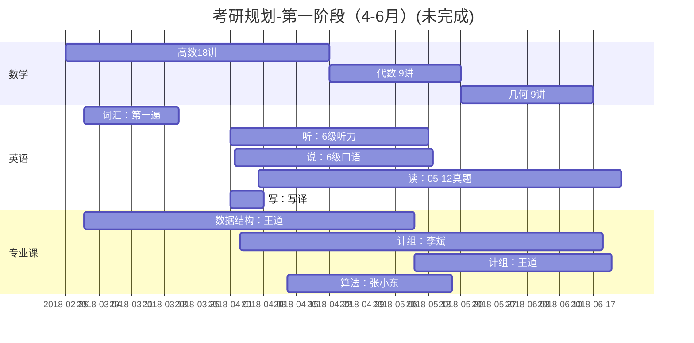

# 考研是一场孤独的旅行

---
## 规划笔记
##### 19 年考研英语全程规划 考虫@石雷鹏
1. 数学专业课 150
2.
##### 18考研上海交大经验分享 @av21309017
- 英语
1. 翻译@唐静 时间长
2. 淘宝批改作文
3. 阅读@唐迟
- 政治
1. 肖秀荣1000题、背肖四，有余力可以背肖八
2. 徐涛小黄书 视频
3. 9月跟老师上课，11月中旬开始背大题
4. 11月中旬背英语作文和政治大题
- 数学
1. 8月底做完 @张宇36讲 & 视频
2. 分阶习题 @李永乐 （推荐）
3. 关键在总结，错题原因
4. 10月开始做 660题 @李永乐 （推荐）
5. 1000题太难了，有点偏
6. 刷真题 03年开始 11月开始
7. 张宇八套卷、四套卷 （偏难）
##### 2019考研政治备考，如何听背练 @徐涛
1. 暑假前动手不算晚
2. 看视频：听重点、阐述、逻辑
3. 强化班听完做真题
4. 早看11中旬背，用心背，不用一模一样，逻辑一样即可 举一反三
##### 考研经验分享——尤其适用于普通二本和三本的童鞋 @av23177441
- 经验
    1. 本专业看重学历 or 经验
    2. 目标高->参考学长学姐
    3. 四六级要求
- 政治
    1. 精讲精练 + 1000题
    2. 理解、套路、按点答题、结合材料分析
    3. 真题 答案不是特别好
    4. 找老师 划重点、梳理知识点、答题规范
- 英语
    1. 没时间看书的话，刷真题
    2. 真题刷完可以考 45 分左右
    3. 认真刷完 2 遍 55+
    4. 全篇翻译阅读
    5. 作文勤写勤练，不要迷信模板
- 专业课
    1. 淘宝

##### 清华大学 考研经验分享 6个月复习模式 @av25707528
- 规划
专业课的刷书时间安排
考研真题
- 6个月复习模式
    1. 先复习专业课
    2. 8、9月复习政治
    3. 见缝插针复习英语（主要是单词、多刷真题、慎重选择模拟题）
总结：先看教材、看老师的论文（目标院校和业界权威教授）
细化时间表，便于后期执行，月周日做什么
- 政治
    1. 热门命题人练习册
    2. 主要是选择题
- 专业课
    电脑记笔记，大纲标题分级，便于修改
- 保持心态
    1. 后期心态取决于前面的复习状态，坚持到最后就是赢了
    2. 放松前一定问自己：前面真的认真学了吗？一定不要欺骗自己
    3. 后期肯定会有各种状况
- 复试口语
    英文自我介绍：流利不磕巴、为什么考这个学校、读研计划
- 选择导师
    可能需要提前跟导师做项目，否则导师不了解你是不会选你的
- 考研资料搜集
    1. 公众号、考研论坛、微博、知乎，有骗钱的
    2. 找学长学姐
    3. 不轻信网售专业课资料

##### 一个三跨考生的一点跨考经 @60510
- 政治
肖四（连续两年都很给力，任四还有起航的那些预测题如果有时间也可以做做，只做选择就好了，大题看看思路）。如果你没有报班，那么到时候可以在网上下到一些比较好的音频或者视频，张俊芳的马哲很赞，陆卫明的历史也很好
- 英语
范猛讲的真题、王江涛讲的作文和唐静的翻译都很给力），单词量不大的同学可以做一下张锦芯出的一本阅读，只要读文章就OK 了，题目就不用做了，浪费时间。（推荐这本书的原因是这本书文章中的单词基本上时大纲词汇，再就是单词重复度非常高，可以帮助我们有效地牢记单词）
- 数学
李永乐的《线代辅导讲义》、新华出版社的《概率辅导讲义》（这个已经两年没出版了，作者比较乱，估计是因为出现版权问题了）、高数我是配合李和陈的（主要是陈的，辅以李的部分章节）、李的真题
第一、如果你基础不好或者时间允许的话一定要把课本好好看一遍。
第二、以上推荐用书至少做并总结两遍（一定不要手高眼底，上面的书中例题占大部分，千万不要只看不做，例题一定要好好做，好好总结，实在没时间后面的课后习题可以放弃，我考了两年都没有做过）
第三、如果你时间允许的话可以做一下李的660题，和一些模拟题。但并非必做不可，主要还是好好研究上面的推荐用书。（660题中我只做了高数选择的一半，感觉还可以，但由于时间不允许就放弃了！）

##### 凡人逆袭考研英语内幕（内含阅读干货） @av22838835
- 田静
- 作文 潘赟

---
## 考研规划

##### 2. 7-12月
```mermaid
gantt
    title 第二阶段
    section 时间表
         初试      : PostGraduateEntranceExam, 2018-08-22, 122d
    section 政治

    section 英语
        《十天搞定考研词汇》           : Vocabulary, 2018-07-25, 10d
        《恋恋有词》高频              : LoveLoveVocabulary, 2018-08-18, 6w
        《长难句解密》知识结构         : LongSentence, 2018-07-26, 24d
        《何凯文阅读思路解析》解题方法  : Reading-Kevin, 2018-08-18, 4d
        真题阅读2005-2014             : Reading-05-14, after Reading-Kevin, 7w
        道长范文20篇                  : ModelEssay-Taoist, 2018-08-17, 7w
        《考研英语高分写作》           : HighScoreWriting, 2018-10-01, 4w
    section 数学
        高数 18 讲     : AdvancedMath, 2018-08-06, 6w
        代数 9 讲      : LinerAlgebra, after AdvancedMath, 1w
        概率论 9 讲    : Probability, after LinerAlgebra, 1w
        李永乐 660     : 660Question,
        1000 题 @高昆仑  : 1000Question, after AdvancedMath, 4w
        数学真题       : MathActualPaper, 2018-09-01, 12w
    section 专业课 854
        C 语言         : C, 2018-06-28, 4w
        C + +          : C++, after C, 4w
        数据结构        : DataStructure, 2018-08-03, 6w
        计算机组成原理  : ComputerOrganization,
    section 歪脖树
        部署 WebTree 并简单移植 zy : e0,
        重构 zy       : e1, 3d
        移植 reday    : 3d
    section 竞赛考试
        PAT           : PAT, 2018-08-18, 12w
        CSP 试题      : CSP, 2018-08-11, 5w
        数学竞赛      : MathContest, 2018-08-18, 10w
```

##### 第十届全国大学生数学竞赛
http://today.hitwh.edu.cn/2018/0528/c1024a93560/page.htm
- 初赛在2018年10月27日（星期六）上午9：00—11：30举行（威海校区设初赛考场）
- 决赛于2019年3月30日（周六）上午在哈尔滨工业大学举行，时间为8:30—11:30。

背 66 句长难句
大小作文各 10

英语计划：
-8.31 攻克词汇

1. 词汇《十天搞定考研词汇》《恋恋有词》
3. 阅读 A 《长难句解密》@何凯文 背66句长难句《》+ 写作《考研英语高分写作》@王江涛 背作文
4. 新题型 + 阅读 B
5. 完形 + 翻译（阅读 C）
9.1-11.31 精研真题
12.1- 适当模考

英语话题：
[火星发现液态水湖](http://www.qdaily.com/articles/55631.html)
[独身主义](http://www.qdaily.com/articles/55507.html)
[贵州超级高铁](http://www.qdaily.com/articles/55430.html)
[3D 彩色 X 光片](http://www.qdaily.com/articles/55356.html)


##### 1.  4-6月(未完成)


---
# 竞赛考试
## [第十届全国大学生数学竞赛](http://today.hitwh.edu.cn/news_show.asp?id=31634)

---
## 专业领域知识
### 1. [青年千人计划]()
### 2. [千人计划]()
### 3. [教育部长江学者奖励计划]()
### 4. [自然科学基金委国家杰出青年科学基金]()
### 5. [中科院百人计划]()
### 6. [国家重点项目学科带头人]()
### 7. [姚期智建立南京图灵人工智能研究院](https://zhuanlan.zhihu.com/p/35947032)
### 8. [姚期智](https://zh.wikipedia.org/wiki/%E5%A7%9A%E6%9C%9F%E6%99%BA)

## 专业名词
##### 深度学习
##### 自然语言处理
##### 人脸识别
- [x] 科大讯飞、云从科技、商汤科技、旷视科技(Face++)
上海交大
- [ ] Standard Operating Procedure
- 社会信用系统
##### 分布式图计算
- 社交网络拓扑结构
