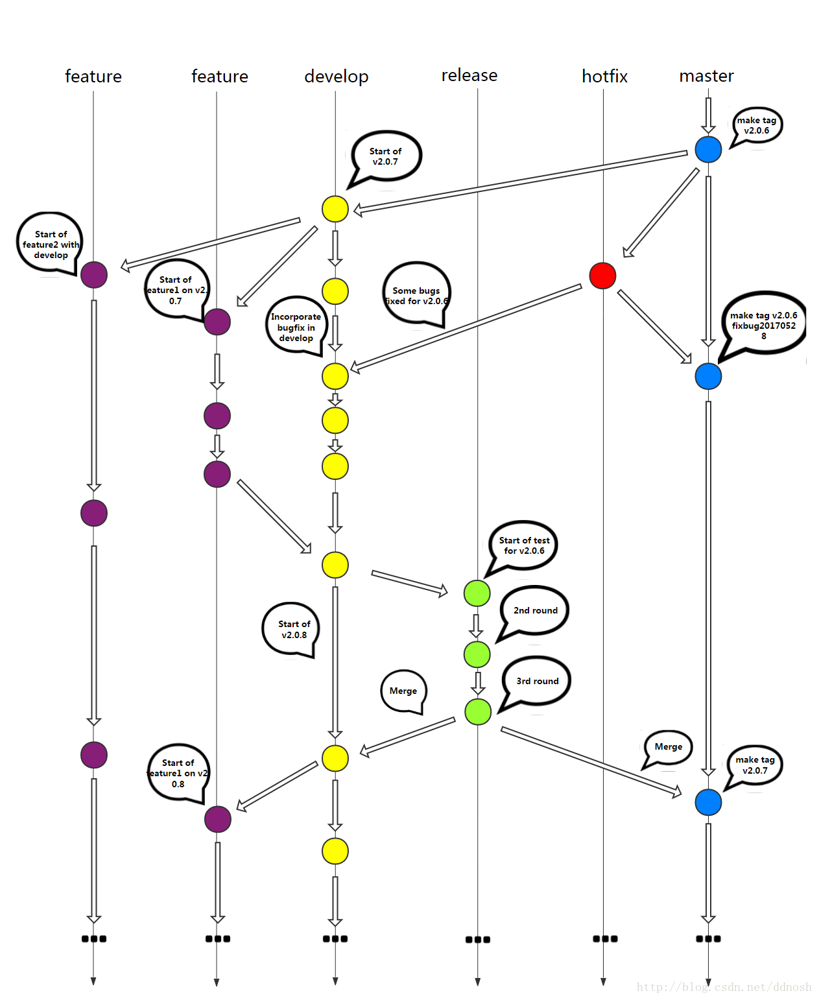

> 摘要：Git 是一款主流分布式版本管理系统，Github 是提供 Git 服务的一个主流网站，Github Desktop 是其客户端。

<!-- more -->

---
## TortoiseSVN

应用：微信查 ip 上传到 SAE，本地和云应用同步，检出、导入、导出。免费送200云豆，每天12颗。

1、curl模拟访问获取html页面 

2、解析html页面,用正则表达式将表格转换成数组;  

3、bootstrap 页面布局

## SVN 与 Git 区别

1. Git 是分布式的
2. 没有分支，回滚显得混乱，用全局版本号代替
3. SVN：简单； Git：功能齐全

## Git 入门知识

1. [廖雪峰--史上最浅显易懂的Git教程](https://www.liaoxuefeng.com/wiki/0013739516305929606dd18361248578c67b8067c8c017b000)
2. ~~[Git入门指南使用资料汇总及文章推荐](https://github.com/xirong/my-git/blob/master/ixirong.com.md)~~

> 版本控制的主要功能有备份、回滚、分支管理。

## Git 命令

```
# 在 Master 分支上创建并切换到 dev 分支
git branch dev master

# 切换到 master 分支
git checkout master

# 在 Master 分支上创建并切换到 dev 分支
git checkout -b dev master

# 合并 dev 到当前分支
# --no-ff 参数表示不执行快进式合并，不在当前分支留有 dev 的演进过程
git merge --no-ff dev

# 删除分支
git branch -d fixbug-0.1
```

### ~~通过 Git  Bash](https://blog.csdn.net/neuldp/article/details/51883528)版本回退~~

  当不小心向远程仓库比如github做了一次错误的提交，想使本地和仓库回到某一个历史版本

##### 1. [ 可选 ] 找到想要回到的 commit id （版本号）

```
1. 在 GitHub Desktop 中根据 History->右键->Copy SHA 复制
2. GitHub 网站
3. Git Bash 命令行
```

##### 2. [ 可选 ] 进入本地仓库

```
1. 在本地仓库文件夹右键-> Git Bash Here
2. Git Bash 客户端通过 cd 命令
3. 在 GitHub Desktop 中 `Ctrl + \` ` 在命令提示符中
```

##### 3. 回退

```
# 回退所有内容到上一个版本，省略文件名表示回退所有
git reset HEAD^ `文件名`

# 向前回退到第3个版本
git reset –soft HEAD~3

# 将本地的状态回退到和远程的一样
# 这里origin是项目持有者的别称
git reset --hard origin/master(easy way)
git rebase FETCH_HEAD

# 回退到某个版本
git reset --hard `版本号`

# 模式：git reset --<mode> [<commit>]
# mode：
#   --soft  退到某个版本，只回退了 commit 的信息，不会恢复到 index file 一级。如果还要提交，直接commit即可
#   --mixed 此为默认方式，回退到某个版本，只保留源码，回退 commit 和 index 信息
#   --hard  彻底回退到某个版本，本地的源码也会变为上一个版本的内容
```

##### 4. 提交到远程仓库

```
git push --force
```

## Git 分支管理策略

1. [Git分支管理策略](http://www.ruanyifeng.com/blog/2012/07/git.html)
2. [Git 开发部署流程](https://blog.csdn.net/cs958903980/article/details/53896411)
3. [Git 版本管理规范 ](https://blog.csdn.net/ddnosh/article/details/78996628)
4. [介绍一个成功的 Git 分支模型](https://www.oschina.net/translate/a-successful-git-branching-model)
5. [使用 git 和 github 管理自己的项目---真实开发环境的策略](https://segmentfault.com/a/1190000003739324)

|      |    分支    |                         命名                         | 创建自  |      合并入       | 功能                                                         |
| :--: | :--------: | :--------------------------------------------------: | :-----: | :---------------: | :----------------------------------------------------------- |
| 常设 |   主分支   |                        master                        |    /    |         /         | 用于正式发布，是稳定可用的版本，发布后需打上 tag             |
| 常设 |  开发分支  |                       develop                        | master  |      master       | 用于日常开发，是功能最新的分支。                             |
| 常设 |  功能分支  |                       feature                        | develop |         /         | ==定制版、OEM版，==开发周期长，一般与develop分支处于并行关系 |
| 临时 |  功能分支  | feature/weixin_recharge 按照功能点（而不是需求）命名 | develop | 本地仓库的develop | 新功能，==预发布成功后== 删除此分支                          |
| 临时 |  修补分支  |  ~~fixbug~~ hotfix/#1 通过平台生成的问题编号来 命名  | master  | master & develop  | 生产环境紧急bug修复                                          |
| 临时 | 预发布分支 |                     release/#1.2                     | develop | master & develop  | 待发布版本的提测及修复 bug，提交到 master 时需打 tag         |

> release 分支 merge 到 master 分支后，需要打 tag，以便将来引用这个版本
>
> 临时分支使用完应删除



## Github Desktop 客户端

1. [Github 的 SSH 配置](https://blog.csdn.net/chenliguan/article/details/51072809)
2. [GitHub for Windows 客户端的使用教程](https://blog.csdn.net/qq_25269835/article/details/70177314)

> 使用迅雷下载 https://desktop.github.com/ 会快点

### 项目初始化

> 项目最好存储在纯英文路径下

#### 创建项目

> 一般在某一文件夹，如使用 IDE 创建项目文件夹之后，将此项目文件夹创建为 Git 项目。

#### 添加本地项目

> 此时项目中应有 /.git 文件夹，表示这是一个 git 项目，操作是将其添加入本地仓库。

#### 从 Github 服务器克隆项目

> fork 指将别人的项目拷贝到自己的账户中。
>
> clone 指将在 Github 网站上的项目克隆到本地计算机的仓库中，默认是自己的项目，可以通过 URL 克隆其他用户的项目。
>
> 克隆时本地文件夹可重命名。

### remove 项目

> 默认只是将项目移出本地仓库，勾选之后才删除项目到回收站。

### 更改本地项目存储位置

> 将本地项目移动到其它路径下

1. ~~通过设置 Options-clone 里面的路径，v1.6.5 中没有发现这个功能~~
2. 直接将项目文件夹移动到目标位置，打开 Github Desktop 项目时会提示重新定位（locate）。或手动将项目重新添加到本地仓库即可

###  [通过 GitHub Desktop 版本回退](https://www.cnblogs.com/lqcdsns/p/5265665.html)

##### 1. 在本地仓库 commit to master 未 push 到远程仓库

    undo
##### 2. 已 push 到远程仓库

    History->右键->Reserve this commit
    commit to master
    push

## 错误处理

[使用git时出现：warning: LF will be replaced by CRLF](https://www.jianshu.com/p/0acf732eab68)

### 提交失败

- [Github 提交失败 fatal: unable to access](https://segmentfault.com/q/1010000004014275/a-1020000004044485)

- 代理错误：[Git push时报错：Failed connect to github.com:443; No error和The remote end hung up unexpectedly](https://blog.csdn.net/qq_27093465/article/details/71210203)

  ```
  git config --global http.proxy "localhost:1080"
  git config --global https.proxy "localhost:1080"
  ```