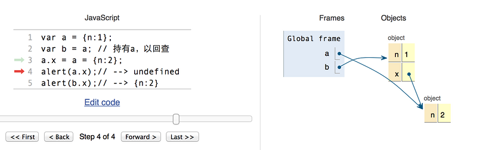

> 摘要：前端基础，包括HTML、CSS、JavaScript等。

<!-- more -->

## 前端知识结构

HTML：视图层 内容

CSS：表现层 布局

JavaScript：~~内容层~~ 行为

JQuery：


## HTML

- HTML 是一种**标记语言**（不是编程语言） 是一套**标记标签**
- HTML 文档由**嵌套的 HTML 元素**构成
- 元素 = 开始标签（属性、样式等）+ 内嵌内容 + 结束标签  <br/>
- 版本：HTML4.0.1（1999） HTML5（2014）
- ==HTML Data- 属性==

### 兼容

- `<br>` `<br/>` `<br />`
  - HTML5兼容XHTML写法，三种等价。
  - `<br>` 是**HTML**写法。因为HTML是**SGML**的子集，允许没有结束标签，而换行符元素正好不需要**内嵌内容**。
  - `<br/>`  是**XHTML1.1**的写法，也是**XML**写法。因为XHTML是XML的子集，在XML中，标签必须要有结束标签，必须写成`<br></br>`（HTML解析中被理解为2个`<br>`）或简写成`<br/>`。
  - - [x] `<br />` 是**XHTML**为兼容**HTML**的写法，也是**XML**写法。
      - 较少的代码量：在HTML解析中会理解成有"/"的属性的`<br>`标签
      - 规范严谨：在XML解析中会理解成`<br></br>`的简写

### 元素和标签

- `<!DOCTYPE > ` 告知浏览器文档类型

  - `<head>`
    - `<meta>` 元数据

      - `http-equiv`属性 ：用于模拟一个 http 响应头

        1. content-type：字符编码
        2. default-style：预定义样式表（ content 属性的值必须匹配同一文档中的一个 link 元素上的 title 属性的值，或者必须匹配同一文档中的一个 style 元素上的 title 属性的值）
        3. Set-Cookie：设定 cookie 有效时间。
        4. Pragma（cache模式）：禁止浏览器从本地计算机的缓存中访问页面内容。
        5. Expires：缓存过期时间
        6. X-UA-Compatible：指定网页的兼容性设置
        7. viewpoint：针对移动网页优化页面
           ```html
           <meta name="viewport" content="width=device-width, initial-scale=1, maximum-scale=1">
           ```
        8. refresh：URL

        ```html
        <!-- 每30秒刷新一次 -->
        <meta http-equiv="refresh" content="30">
        ```

      - `charset` 属性：设置字符编码，H5
        ```html
        HTML4.01： <meta http-equiv="content-type" content="text/html; charset=gbk">
        HTML5： <meta charset="UTF-8">
        ```
      - `name` 属性（`keywords，description，author ` ）  SEO
      - `content` 辅助属性：定义与 http-equiv 或 name 属性相关的内容
      - `scheme` 辅助属性：定义 content 的格式
    - ` <title>, <style>, <link>, <script>, <noscript>, <base>`
    - `<link>` 
      - `<link rel="stylesheet" type="text/css" href="mystyle.css">`
      - `<link rel="shortcut icon" href="图片url">`
  - `<body>`
    - **块级元素**：元素在一块内从上到下**垂直排列**；元素独占一行，默认填满父元素的宽度；宽高的内外边距均可设置；主要做容器容纳其它元素。
      - `<div>`
        - 文档布局
        - 大的内容块设置样式
      - `<h1>, <p>, <ul>, <table>，<tr>, <form>， <hr>`
      - 元素样式的`display:block;` 
    - **行内（内联）元素**：元素在一行内水平排列；高度由元素的内容决定，宽高（`line-height` ）的上下内外边距不可设置；只能容纳**文本**或者其他内联元素。
      - `<a>, , <br />, <label>, <span>，<input>`
      - 文本/格式化标签
        - `<b>` `<strong>`
        - `<i>` `<em>`
        - `<abbr>` 定义缩写
      - 元素样式的`display : inline` 
      - 设置`float:left/right` 后，display属性会变为block，且拥有浮动特性。行内元素去除了之间的莫名空白。
      - `position:absolute` 与`position:fixed` 都会使行内元素变为块级元素。
    - 可通过修改`display`属性切换
      - none：不显示该元素
      - inline-block：转换为行内块级元素 `input`默认设置

- `<!DOCTYPE>`

  - **HTML4.0.1** 基于 SGML，所以引用 DTD （文档类型声明）。三种声明：Strict（`html:4s` ）、Transitional（`html:xt` 过渡型） 和 Frameset。
  - **HTML5** `!` `html:5`  `<!DOCTYPE html> ` 告知浏览器文档类型为 HTML5。

- 字符编码
  - ASCII：1位**传输奇偶控制**
  - HTML5：Unicode 标准（UTF-8 字符集）

- `<a>` 
  - 无法通过修改父级标签来改变子级标签特性
  - 用 CSS 改变样式点击后的样式
  - target="_blank" 属性 在新窗口打开
  - 始终将正斜杠添加到子文件夹：因为服务器会添加正斜杠到地址，然后创建一个新的请求，总共产生两次 HTTP 请求

### 布局

### 表单

### 事件

#### 用法

1. ~~触发 HTML 事件执行 JS~~

```html
<h1 id="myTitle">我是标题~</h1>
<button type="button" onclick=myFun()>标题变色</button>
<script>
	function myFun() {
        document.getElementById('myTitle').style.color='red';
	}
</script>
```

2. 通过 DOM 向 HTML 元素分配事件

``` HTML
<h1 id="myDate">日期显灵！</h1>
<button type="button" id="myBtn">显示日期</button>
<script>
    document.getElementById("myBtn").onclick = function() {
        document.getElementById("myDate").innerHTML = Date();
    }
</script>
```

#### 分类

- onload 和 unonload：浏览器信息，处理 cookie
- onchange：元素改变时，如输入字段验证
- onmouseover 和 onmouseout：鼠标移入
- ==onmousedown、onmouseup、onclick== 
- onkeydown：按下键盘
- ==onfocus：获取焦点== 

### 监听事件

- addEventListener()：向指定元素添加**事件句柄**

### SEO

- Search Engine Optimization（搜索引擎最佳化）
- 影响标签
  - `<title>`
  - `<meta>`
  - `<h1>`
  - ``

## HTML5
- 设计目的：为了在移动设备上支持多媒体。

### 新特性

1. canvas 元素：画布容器
2. 多媒体元素： video，audio 
3. 新的8个**语义元素**，都为块级元素，header, nav, section, article, aside,footer,  main,  figure；已移除标签（`<font>, <center>, <strike>`）和属性:（`color ， bgcolor`）
4. 新的表单输入控件，比如 color， calendar、date、time、email、url、search，range；datalist，keygen，output
5. 对**本地离线存储**的更好的支持
6. 缓存引用
7. 本地 SQL 数据
8. Web 应用
9. 完全支持 CSS3，新选择器
10. XHTMLHttpRequest 2

### 浏览器支持

- IE8及更早不支持：**shiv**注释，解决HTML5的新元素不被IE6-8识别的问题。


## CSS

### 插入方式

- 内联样式：在元素中使用 style 属性
- 内部样式表：在 head 中使用 style 标签
- 外部引用

### 属性

- font-family 字体：文泉驿微米黑
- text-align 居中对齐
- 颜色

- 选择器：`#`， `[标签名]`  +`.`
- ==盒模型==

## CSS3

### 新特性

- 新属性
- 动画
- 2D/3D 转换
- 圆角
- 阴影效果
- 可下载的字体

## DOM

- DOM 树

- DOM（Document  Object Model）（文档对象模型）， W3C 标准，描述**处理网页内容**（HTML）的方法和接口，将文档解析为**结点对象**组成的 DOM 树，用于改变文档内容

- BOM（浏览器对象模型），描述**与浏览器进行交互**的方法和接口

- 查找 HTML 元素

  1. Id
  2. TagName
  3. ClassName

- 修改 HTML 元素的内容和属性

  - innerHTML

- 修改 HTML 元素的样式

  ```
  document.getElementById("p2").style.color="blue";
  ```

- 增删 HTML 元素

## JavaScript

- 轻量级**解释型脚本语言** 逐行执行 用于交互
- ECMAScript，描述了该语言的语法和基本对象 ES6

### 数据类型

- 分为字面量和变量，狭义指变量数据类型
- **动态语言**：变量数据类型可变
- 变量均为对象，可用 new + 对象 声明变量类型

```js
// 注意没括号
var num = new Number;
```

- typeof

- undefined 与 null 区别
  1. 二者值相等， null == undefined
  2. 类型不同
  3. null为空对象引用 用于比较大的对象释放内存时，清空变量

- Date

  - ( new Date() ).getTime() 时间戳

- **强制类型转换**

  1. `Boolean(value)`----转换成Boolean型：至少有一个字符的字符串、非0数字或对象时，返回true。**空字符串、数字0、undefined或null**，返回false。
  2. `Number(value)`----转换成整数或浮点数；
  3. `String(value)`----转换成字符串。 
  4. (123).toString(); 
- <https://juejin.im/post/5b2b0a6051882574de4f3d96>


### 运算符

- 运算
  - +：加法和字符串连接 `3+"5"`-->`35` 
  - /：

- 比较
  - === 数据类型和值绝对相等
  - ！== 值和类型至少一个不等
- 逻辑
- 连等
  - a.x 的指针没有被创建，则声明并指向 null，此时指针地址已固定
  - a 的指针已被创建，找到它
  - 从右到左，以上两指针分别指向 { n : 2 }

```js
// 赋值结果
a => {n: 2}
b => {	n: 1, 
    	x: { n: 2 } 
     }   
```



### 作用域

- 作用域是**可访问变量**，对象，函数的集合
- 非严格模式下给未声明变量赋值创建的全局变量，是全局对象的可配置属性，可以删除。

``` js
// 没有用 var 声明，则为全局变量
// 自动作为 window 对象的属性，可删除
name = "Harry";
```
- 严格模式："use strict"
- 重新声明变量，值不丢失

```js
var carname="Volvo"; 
var carname;
```

### 语法

- 顺序
- 条件
- 循环
  - for/in 循环遍历**对象**的属性，会跳过未定义的元素；for 会输出 undefined
  - continue 只能用于循环
  - break 只能用于循环和 switch 中： 默认标签为当前代码块
  - break 通过 label 标签引用可跳出任何代码块，可用于多层循环时控制外层循环
- 输出
  1. window.alert("")
  2. innerHTML()  = 
  3. console.log("") 和 console.info("")
  4. document.write("")

### 数字

- 浮点数精度问题 
- 浮点数存储
  - 使用 64 位固定长度来表示，也就是标准的 double 双精度浮点数


- 浮点数四则运算 浮点数无法精确表示

  - [浮点数陷阱](<https://github.com/camsong/blog/issues/9>) Math.abs(left - right) < Number.EPSILON * Math.pow(2, 2);

- 大数危机

  - **[Number.MIN_SAFE_INTEGER, Number.MAX_SAFE_INTEGER]** 的整数都可以精确表示

- `toPrecision` 是处理精度，精度是从左至右第一个不为0的数开始数起。

- `toFixed` 是小数点后指定位数取整，从小数点开始数起。四舍五入结果不准确

### 对象

- JS 对象是变量（键值对）（对象属性和方法）的**容器**
- 类似 C 里的**哈希表** 和 PHP 里的**关联数组**

### 数组

- 不支持名字索引数组，可以索引对象
- 用名字索引数组会导致数组重定义为标准对象，数组的方法及属性都将失效

```javascript
// 初始化
var arr = [11, 22];

// 尾增
var len = arr.push(55);
// 尾删
var val = arr.pop();
// 首删
var val = arr.shift();

// 替换，可作删除用
Array array.splice( index, howmany, [item1, ....., itemX] );

// 按值查索引
var index = arr.indexOf(11);
// 按区间[startIndex, endIndex)查
Array array.slice( start, end);

// 长度
var len = arr.length;

// 排序
// 默认为按字母升序	
str.sort();
// 反序，可实现按字母降序
str.reverse();
// 按数字升序
arr.sort( function (a, b)(return a-b) );
```

### 字符串

- 转换为数字
  1. parseInt( ) 方法：字母标点截断，基模式，`010`默认八进制
  2. parseFloat( ) 方法：没有基模式，默认十进制
  3. Number( ) 强制类型转换
  4. 弱类型用运算符转换

```
+ '' // 等价于 String(X)
+X     // 等价于 Number(X),也可以写成 x-0
!!X    // 等价于 Boolean(X)

var str= '012.345 ';  
var x = str-0;  
x = x*1;
```

### 正则表达式

- 修饰符 表达式 元字符 量词
- 最常用的两个方法：
  - search()：
  - replace()：

```js
var str = "Visit Runoob!"; 
var n = str.search(/runoob/i);
// 下标 n = 6
var txt = str.replace(/Runoob/, "Replace！");
// 文本 txt = Visit Replace！
```

### 函数

- 函数提升：先调用后定义，实质是作用域的提升；用**表达式定义**的函数无法提升
- 对象方法：对象的构造方法

#### 函数定义

- 箭头函数
  - 默认绑定外层 this 的值，this 和外层的 this 相同
  - 不能提升
  - const 比 var 安全，因为函数表达式始终是一个常量 

```js
// 1.表达式定义
function f (a, b) {};
f(1, 2);

// 2.匿名函数：没有函数名
var x = function (a, b) { return a * b};
// 通过变量名调用匿名函数
var z = x(4, 3);

// 3.也可以自调用
(function () {
    var x = "Hello!!";
})();

// 4.Function() 构造函数
var f = new Function("a", "b", "return a * b");

// 5.箭头函数，ES6，f 作函数名
const f = (x, y) => x * y;
// 二者作用相同
const x = (x, y) => { return x * y };
```

#### 函数参数

- 显示参数和隐式参数，ES6可设置默认参数
- 内置 Arguments 对象：函数调用的参数数组
- 通过**值传递**参数：隐式参数的改变在函数外是不可见的。
- 通过**对象传递**参数：在函数内部修改对象的属性会修改其初始值。

#### 函数调用

- 函数有 4 种调用方式，不同在于 **this** 的初始化。一般而言，**this** 指向函数执行时当前对象。
  1. 作为函数调用：**this** 指向全局对象；
  2. 作为方法调用：**this** 绑定到所属对象；
  3. 用构造（器）函数调用，创建一个新对象，继承构造函数的属性和方法：**this** 指向新创建的实例；
  4. 作为函数方法调用，call() 和 apply()。this 显式函数绑定：call() 和 apply() 方法允许切换函数执行的上下文环境，可以将 this 指向任何对象。在严格模式下，this 是 undefined？
     - bind()
     - apply() `a.say.apply(b)`;传参数数组
     - call()：参数列表
  5. 在事件中，this 指向接收事件的元素。
  6. ==指向正在执行的函数本身==

#### 回调函数

- 回调陷阱

#### 计数器困境、内嵌函数、闭包

```
var add = (function () {
    var counter = 0;
    return function () {return counter += 1;}
})();
 
add();
add();
add();
 
// 受外层匿名自我调用函数的作用域保护，只能用 add() 修改
// 计数器 add.counter = 3
```

### 内存管理 垃圾回收机制

#### 深拷贝和浅拷贝的实现

### 性能优化

### JSON

- 存储和传输数据的格式
- 大括号保存对象
- 方括号保存数组
- 数组、对象可相互嵌套
- var obj = JSON.parse( jsonStringData );
- var jsonStringData  = JSON.stringify( obj );

### 表单

- 表单（自动）验证
- 数据验证
- H5 约束验证
  - HTML 输入属性
  - CSS 伪类选择器
  - DOM 属性和方法

### 错误和调试

```
try {
} catch(e) {
} throw {  
} finally {  
}
```

### ES6

- 类和模块化
- 箭头函数
- promise

## Node.js

- 运行在服务端的 JavaScript 事件驱动 I/O 基于 Google  的 V8 引擎

<https://www.runoob.com/nodejs/nodejs-tutorial.html>

## PHP

#### include() 和 require()

| 区别     | include()                                | require() ~ include_once()     |
| -------- | ---------------------------------------- | ------------------------------ |
| 性能     | 每次都读取一遍文件                       | 只处理一次（本质是替换）       |
| 效率     |                                          |                                |
| 加载失败 | warning 警告，但脚本继续执行（4.3.5 前） | fatal error 错误，脚本停止执行 |
| 位置     |                                          |                                |

## 经典面试问题

- JS
  1. 数据类型有哪些 undefined 与 null 区别
  2. 对原型链的了解
  3. 对跨域的了解
  4. call、apply、bind的区别
  5. 介绍闭包
  6. 深拷贝和浅拷贝的区别
  7. 使用let、var和const创建变量有什么区别 介绍变量提升
  8. cookie、localStorage、sessionStorage区别
- HTML
  1. 块级元素与内联元素的区别
  2.  ``的`title`和`alt`有什么区别
- CSS
  1. 水平垂直居中的几种方式
  2. 清除浮动的几种方式
  3. display:none、visibile:hidden 区别
