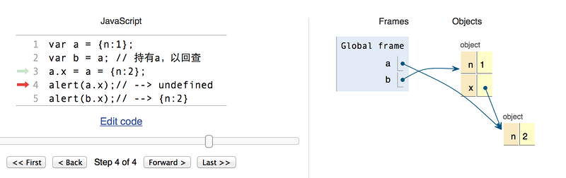

> 摘要：前端基础，包括HTML、CSS、JavaScript等。

<!-- more -->

## 目录

[TOC]

## 前端知识结构

- 基础三大件
  1. HTML：视图层 内容

  2. JavaScript：~~内容层~~ 行为
  3. CSS：表现层 布局

- 基础库
  - jQuary
  - Ajax/JSON

- 模板框架
  - ~~JSP/JSTL~~
  - **Thymeleaf**
  - FreeMarker
  - BootStrap？
- 组件化框架
  - Node
  - **Vue**
      - Axios：前端 HTTP 框架，网络请求定义，路由接口代理、跨域请求
      - Element-UI：前端 UI 框架
      - vue-router：路由框架
      - V-charts：基于 Echarts 的图表框架
      - vue-element-admin：项目脚手架
  - React
  - Angular

## HTML

- HTML 是一种超文本标记语言**（不是编程语言） 是一套**标记标签**
- HTML 文档由**嵌套的 HTML 元素**构成
- 元素 = 开始标签（属性、样式等）+ 内嵌内容 + 结束标签  `<br/>`
- 版本：HTML4.0.1（1999） HTML5（2014）
- ==HTML Data - 属性==

### 兼容

- `<br>`、`<br/>`、`<br />`：HTML5 兼容 XHTML 写法，三种等价。
  1. `<br>` 是**HTML**写法。因为HTML是**SGML**的子集，允许没有结束标签，而换行符元素正好不需要**内嵌内容**。
  2. `<br/>`  是**XHTML1.1**的写法，也是**XML**写法。因为XHTML是XML的子集，在XML中，标签必须要有结束标签，必须写成`<br></br>`（HTML解析中被理解为2个`<br>`）或简写成`<br/>`。
  3. `<br />` 是**XHTML**为兼容**HTML**的写法，也是**XML**写法。
    - 较少的代码量：在HTML解析中会理解成有"/"的属性的`<br>`标签
    - 规范严谨：在XML解析中会理解成`<br></br>`的简写

### 元素和标签

- `<!DOCTYPE > ` 告知浏览器文档类型


#### `<head>`

- `<meta>` 元数据

  - `http-equiv`属性 ：用于模拟一个 http 响应头

    1. content-type：字符编码
    2. default-style：预定义样式表（ content 属性的值必须匹配同一文档中的一个 link 元素上的 title 属性的值，或者必须匹配同一文档中的一个 style 元素上的 title 属性的值）
    3. Set-Cookie：设定 cookie 有效时间。
    4. Pragma（cache模式）：禁止浏览器从本地计算机的缓存中访问页面内容。
    5. Expires：缓存过期时间
    6. X-UA-Compatible：指定网页的兼容性设置
    7. viewpoint：针对移动网页优化页面
       ```html
       <meta name="viewport" content="width=device-width, initial-scale=1, maximum-scale=1">
       ```
    8. refresh：URL

       ```html
       <!-- 每30秒刷新一次 -->
       <meta http-equiv="refresh" content="30">
       ```

  - `charset` 属性：设置字符编码，H5
  
    ```html
    HTML4.01： <meta http-equiv="content-type" content="text/html; charset=gbk">
    HTML5： <meta charset="UTF-8">
    ```
  - `name` 属性（`keywords, description, author ` ）  SEO
  - `content` 辅助属性：定义与 http-equiv 或 name 属性相关的内容
  - `scheme` 辅助属性：定义 content 的格式
- ` <title>, <style>, <script>, <noscript>, <base>`
- `<link>` 
  
  - `<link rel="stylesheet" type="text/css" href="mystyle.css">`
  - `<link rel="shortcut icon" href="图片url">`
#### `<body>`

- **块级元素**：元素在一块内从上到下**垂直排列**；元素独占一行，默认填满父元素的宽度；宽高的内外边距均可设置；主要做容器容纳其它元素。
  - `<div>`
    - 文档布局
    - 大的内容块设置样式
  - `<h1>, <p>, <ul>, <table>，<tr>, <form>， <hr>`
  - 元素样式的 `display:block;` 
- **行内（内联）元素**：元素在一行内水平排列；高度由元素的内容决定，宽高（`line-height` ）的上下内外边距不可设置；只能容纳**文本**或者其他内联元素。
  - `<a>, , <br />, <label>, <span>，<input>`：
  - 文本/格式化标签
    - `<b>` `<strong>`
    - `<i>` `<em>`
    - `<abbr>` 定义缩写
  - 元素样式的 `display : inline` 
  - 设置 `float:left/right` 后，display属性会变为block，且拥有浮动特性。行内元素去除了之间的莫名空白。
  - `position:absolute` 与 `position:fixed` 都会使行内元素变为块级元素。
- 可通过修改`display`属性切换
  - **style="display: none"**：不显示该元素，标签占位置；
  - **style="visibility: hidden"**：不显示该元素，标签不占位置；
- inline-block：转换为行内块级元素 `input`默认设置
  
- `<!DOCTYPE>`

  - **HTML4.0.1** 基于 SGML，所以引用 DTD （文档类型声明）。三种声明：Strict（`html:4s` ）、Transitional（`html:xt` 过渡型） 和 Frameset。
  - **HTML5** `!`、`html:5`  `<!DOCTYPE html> ` 告知浏览器文档类型为 HTML5。

- 字符编码
  - ASCII：1位**传输奇偶控制**
  - HTML5：Unicode 标准（UTF-8 字符集）


#### `<a>` 

- 无法通过修改父级标签来改变子级标签特性
- 用 CSS 改变样式点击后的样式
- target="_blank" 属性 在新窗口打开
- 始终将正斜杠添加到子文件夹：因为服务器会添加正斜杠到地址，然后创建一个新的请求，总共产生两次 HTTP 请求

#### href="#" 与 href="javascript:void(0)" 的区别

- **#** 包含了一个位置信息，默认的锚是**#top** 也就是网页的上端。
- 而javascript:void(0), 仅仅表示一个死链接。

### 布局

### 表单

### 事件

用法:

1. ~~触发 HTML 事件执行 JS~~

```html
<h1 id="myTitle">我是标题~</h1>
<button type="button" onclick=myFun()>标题变色</button>
<script>
	function myFun() {
        document.getElementById('myTitle').style.color='red';
	}
</script>
```

2. 通过 DOM 向 HTML 元素分配事件

``` HTML
<h1 id="myDate">日期显灵！</h1>
<button type="button" id="myBtn">显示日期</button>
<script>
    document.getElementById("myBtn").onclick = function() {
        document.getElementById("myDate").innerHTML = Date();
    }
</script>
```

分类：

1. onload 和 unonload：浏览器信息，处理 cookie
2. onchange：元素改变时，如输入字段验证
3. onmouseover 和 onmouseout：鼠标移入
4. ==onmousedown、onmouseup、onclick== 
5. onkeydown：按下键盘
6. ==onfocus：获取焦点== 

监听事件：

- addEventListener()：向指定元素添加**事件句柄**

### SEO

- Search Engine Optimization（搜索引擎最佳化）
- 影响标签
  - `<title>`
  - `<meta>`
  - `<h1>`
  - ``

### HTML5 新特性

设计目的：为了在移动设备上支持多媒体。

1. canvas 元素：画布容器
2. 多媒体元素： video，audio 
3. 新的8个**语义元素**，都为块级元素，`header, nav, section, article, aside, footer, main,  figure`；已移除标签（`<font>, <center>, <strike>`）和属性:（`color ， bgcolor`）
4. 新的表单输入控件，比如 `color， calendar、date、time、email、url、search，range；datalist，keygen，output`
5. 对**本地离线存储**的更好的支持
6. 缓存引用
7. 本地 SQL 数据
8. Web 应用
9. 完全支持 CSS3，新选择器
10. XHTMLHttpRequest 2

浏览器支持：IE8及更早不支持：**shiv**注释，解决HTML5的新元素不被IE6-8识别的问题。

### DOM

- DOM 树

- DOM（Document  Object Model）（文档对象模型）， W3C 标准，描述**处理网页内容**（HTML）的方法和接口，将文档解析为**结点对象**组成的 DOM 树，用于改变文档内容

    - BOM（浏览器对象模型），描述**与浏览器进行交互**的方法和接口

- 查找 HTML 元素

  1. ById
  2. ByTagName
  3. ByClassName

- 修改 HTML 元素的内容和属性

  - innerHTML

- 修改 HTML 元素的样式

  ```
  document.getElementById("p2").style.color="blue";
  ```

- 增删 HTML 元素

## CSS

### 插入方式

- 内联样式：在元素中使用 style 属性
- 内部样式表：在 head 中使用 style 标签
- 外部引用

### 属性

- font-family 字体：文泉驿微米黑
- text-align 居中对齐
- 颜色

- 选择器：`#`， `[标签名]`  + `.`
- ==盒模型==

### CSS3 新特性

- 新属性
- 动画
- 2D/3D 转换
- 圆角
- 阴影效果
- 可下载的字体

### Bootstrap5

### Element-UI

## JavaScript

- 轻量级**解释型脚本语言** 逐行执行 用于交互
- ECMAScript，描述了该语言的语法和基本对象 ES6

### 数据类型

- 分为字面量和变量，狭义指变量数据类型
- **动态语言**：变量数据类型可变
- 变量均为对象，可用 new + 对象 声明变量类型

```js
// 注意没括号
var num = new Number;
```

- typeof：‘object’
- **强制类型转换**

  1. `Boolean(value)`----转换成Boolean型：至少有一个字符的字符串、非0数字或对象时，返回true。**空字符串、数字0、undefined或null**，返回false。
  2. `Number(value)`----转换成整数或浮点数；
  3. `String(value)`----转换成字符串。 
  4. (123).toString(); 
- <https://juejin.im/post/5b2b0a6051882574de4f3d96>

#### 数据类型有哪些

1. 6 种不同的数据类型：
    1. **string**：表示文本内容，例如 `"Hello"`。
    2. **number**：表示数值，例如 `123`， `NaN`。`Number("99 88")  // 返回 NaN`
    3. **boolean**：表示真或假的值，例如 `true `或 `false`。
    4. **object**：表示复杂的数据结构，例如 `{ x: 1, y: 2 }, Array, Date, null`。
    5. **function**：表示可执行的代码块，例如 `function() { ... }`。
    6. **symbol**：表示唯一的标识符，例如 `Symbol("foo")`。
2. 3 种对象类型：
    1. Object
    2. Date：( new Date() ).getTime() 时间戳
    3. Array
3. 2 个不包含任何值的数据类型：

    - null：
    - **undefined**：表示未定义或者未赋值的变量或者属性，例如 `var x`;。

#### undefined 与 null 区别

  1. 二者值相等， 类型不同；

      ```
      typeof undefined             // undefined
      typeof null                  // object
      null === undefined           // false
      null == undefined            // true
      ```

  2. `null `是一个只有一个值的特殊类型，表示一个空对象引用，可以设置为 null 来清空对象；

  3. `undefined `：是所有没有赋值变量的默认值，所有数据类型的变量都可以通过设置值为 **undefined** 来清空。

  4. 垃圾回收站：总有一个对象不再被任何变量引用时，才释放。

#### var、let 和 const

1. **作用域**：var 声明是**全局作用域**（属于 window 对象）或函数作用域，而 let 和 const 是**块级作用域**，是ES6 新增的。 

    - 块是由 `{}` 界定的代码块。一个块存在于花括号中。花括号内的任何内容都是一个块。

2. **重新声明**：

    1. var 变量可以（在其作用域内）更新和重新声明；
    2. let 变量可以更新但**不能重新声明** / 重置； 因此， `let` （声明的）变量只在（当前）所在的代码块 **{}** 内有效。

    3. const 变量既不能更新也不能重新声明。

3. 变量提升：var 存在**变量提升**，let 和 cosnt 不存在。

4. **初始值**：var 和 let 可以不设置，const 必须设置初始值，不能改变指针指向。用 `const` 声明的变量保持**恒定值**。常量对象。

        var greeter = "hey hi";
        var greeter = "say Hello instead"; // 重新声明var不报错
        var times = 4;
        
        function newFunction() {
            var hello = "hello";
        }
        console.log(hello); // 超出函数作用域，error: hello is not defined
        
        if (times > 3) {
            var greeter = "say Hello instead"; 
        }
        //全局作用域和函数中同名
        console.log(greeter) // "say Hello instead"
        
           // let 用法
           let greeting = "say Hi";
           let times = 4;
        
           if (times > 3) {
                let hello = "say Hello instead";
                console.log(hello);// "say Hello instead"
            }
           console.log(hello) // hello is not defined

#### 变量提升（hoisting）

- 变量提升：变量能在声明之前使用。暂时性死区。

- 函数及变量的声明都将被提升到函数的最顶部。变量可以先使用再声明。

- 声明的变量部分会提升，初始化部分不会。

    ```
    var x = 5; // 初始化 x
    
    elem = document.getElementById("demo"); // 查找元素
    elem.innerHTML = x + " " + y;           // 显示 x 和 y, y 输出了 undefined，因为变量声明 (var y) 提升了，但是初始化(y = 7) 并不会提升，所以 y 变量是一个未定义的变量。
    
    var y = 7; // 初始化 y
    ```

#### 严格模式

```
"use strict";
myFunction();

function myFunction() {
    y = 3.14;   // 报错 (y 未定义)
}
```

#### 数字

- 浮点数精度问题 

    - 浮点数存储：使用 64 位固定长度来表示，也就是标准的 double 双精度浮点数
      
    ```
        var x = 0.1;
        var y = 0.2;
        var z = x + y   // z 的结果为 0.30000000000000004
        if (z == 0.3)   // 返回 false
    ```

- 浮点数四则运算 浮点数无法精确表示

    - [浮点数陷阱](<https://github.com/camsong/blog/issues/9>) Math.abs(left - right) < Number.EPSILON * Math.pow(2, 2);

- 大数危机

    - **[Number.MIN_SAFE_INTEGER, Number.MAX_SAFE_INTEGER]** 的整数都可以精确表示

- `toPrecision` 是处理精度，精度是从左至右第一个不为0的数开始数起。

- `toFixed` 是小数点后指定位数取整，从小数点开始数起。四舍五入结果不准确

```
var x = 10;
var y = "10";
if (x == y) // 返回 true，在常规的比较中，数据类型是被忽略的
```

#### 对象

- JS 对象是变量（键值对）（对象属性和方法）的**容器**
- 类似 C 里的**哈希表** 和 PHP 里的**关联数组**

#### this 关键字

this 不是固定不变的，会随着执行环境的改变而改变。

- 在方法中，this 表示该方法所属的对象。
- 如果单独使用，this 表示全局对象。
- 在函数中，this 表示全局对象。在严格模式下，this 是未定义的 (undefined)。
- 在事件中，this 表示接收事件的元素。
- 类似 call() 和 apply() 方法可以将 this 引用到任何对象。

#### call() 和 apply() 方法

- 两个方法都使用了对象本身作为第一个参数。
-  两者的区别在于第二个参数：
    - apply传入的是一个参数数组，也就是将多个参数组合成为一个数组传入，
    - 而call则作为call的参数传入（从第二个参数开始）。

```
function myFunction(a, b) {
    return a * b;
}
myArray = [10, 2];
myObject = myFunction.apply(myObject, myArray);  // 返回 20
```

#### 数组

- 不支持名字索引数组，可以索引对象
- 用名字索引数组会导致数组重定义为标准对象，数组的方法及属性都将失效

```javascript
// 初始化
var arr = [11, 22];

// 尾增
var len = arr.push(55);
// 尾删
var val = arr.pop();
// 首删
var val = arr.shift();

// 替换，可作删除用
Array array.splice( index, howmany, [item1, ....., itemX] );

// 按值查索引
var index = arr.indexOf(11);
// 按区间[startIndex, endIndex)查
Array array.slice( start, end);

// 长度
var len = arr.length;

// 排序
// 默认为按字母升序	
str.sort();
// 反序，可实现按字母降序
str.reverse();
// 按数字升序
arr.sort( function (a, b)(return a-b) );
```

#### 字符串

- 转换为数字
    1. parseInt( ) 方法：字母标点截断，基模式，`010`默认八进制
    2. parseFloat( ) 方法：没有基模式，默认十进制
    3. Number( ) 强制类型转换
    4. 弱类型用运算符转换

```
+ '' // 等价于 String(X)
+X     // 等价于 Number(X),也可以写成 x-0
!!X    // 等价于 Boolean(X)

var str= '012.345 ';  
var x = str-0;  
x = x*1;
```

#### 正则表达式

- 修饰符 表达式 元字符 量词
- 最常用的两个方法：
    - search()：
    - replace()：

```js
var str = "Visit Runoob!"; 
var n = str.search(/runoob/i);
// 下标 n = 6
var txt = str.replace(/Runoob/, "Replace！");
// 文本 txt = Visit Replace！
```

### 运算符

- 运算
  - +：加法和字符串连接 `3+"5"`-->`35` 
  - /：

- 比较
  - === 数据类型和值绝对相等
  - ！== 值和类型至少一个不等
- 逻辑
- 连等
  - a.x 的指针没有被创建，则声明并指向 null，此时指针地址已固定
  - a 的指针已被创建，找到它
  - 从右到左，以上两指针分别指向 { n : 2 }

```js
// 赋值结果
a => {n: 2}
b => {	n: 1, 
    	x: { n: 2 } 
     }   
```



### 作用域

- 作用域是**可访问变量**，对象，函数的集合
- 非严格模式下给未声明变量赋值创建的全局变量，是全局对象的可配置属性，可以删除。

``` js
// 没有用 var 声明，则为全局变量
// 自动作为 window 对象的属性，可删除
name = "Harry";
```
- 严格模式："use strict"
- 重新声明变量，值不丢失

```js
var carname="Volvo"; 
var carname;
```

### 语法

- 顺序
- 条件
- 循环
  - for/in 循环遍历**对象**的属性，会跳过未定义的元素；for 会输出 undefined
  - continue 只能用于循环
  - break 只能用于循环和 switch 中： 默认标签为当前代码块
  - break 通过 label 标签引用可跳出任何代码块，可用于多层循环时控制外层循环
- `export/inport`：导出到入值。模块是独立的文件，该文件内部的所有的变量外部都无法获取。如果希望获取某个变量，必须通过export输出，或者用更好的方式：用大括号指定要输出的一组变量。
    - `export` 关键字标记了可以从**当前模块外部**访问的变量和函数。
    - `import` 关键字允许**从其他模块导入**功能。
- **输出：**
  1. window.alert("")
  2. innerHTML()  = 
  3. console.log("") 和 console.info("")
  4. document.write("")

### 函数

- 函数提升：先调用后定义，实质是作用域的提升；用**表达式定义**的函数无法提升
- 对象方法：对象的构造方法

#### 函数定义

- 箭头函数
  - 默认绑定外层 this 的值，this 和外层的 this 相同
  - 不能提升
  - const 比 var 安全，因为函数表达式始终是一个常量 

```js
// 1.表达式定义
function f (a, b) {};
f(1, 2);

// 2.匿名函数：没有函数名
var x = function (a, b) { return a * b};
// 通过变量名调用匿名函数
var z = x(4, 3);

// 3.也可以自调用
(function () {
    var x = "Hello!!";
})();

// 4.Function() 构造函数
var f = new Function("a", "b", "return a * b");

// 5.箭头函数，ES6，f 作函数名
const f = (x, y) => x * y;
// 二者作用相同
const x = (x, y) => { return x * y };
```

#### 函数参数

- 显示参数和隐式参数，ES6可设置默认参数
- 内置 Arguments 对象：函数调用的参数数组
- 通过**值传递**参数：隐式参数的改变在函数外是不可见的。
- 通过**对象传递**参数：在函数内部修改对象的属性会修改其初始值。

#### 函数调用 this

- 函数有 4 种调用方式，不同在于 **this** 的初始化。一般而言，**this** 指向函数执行时当前对象。
  1. 作为函数调用：**this** 指向全局对象；
  2. 作为方法调用：**this** 绑定到所属对象；
  3. 用构造（器）函数调用，创建一个新对象，继承构造函数的属性和方法：**this** 指向新创建的实例；
  4. 作为函数方法调用，`call()` 和 `apply()`。this 显式函数绑定：call() 和 apply() 方法允许切换函数执行的上下文环境，可以将 this 指向任何对象。在严格模式下，this 是 undefined？
     - bind()
     - apply() `a.say.apply(b)`;传参数数组
     - call()：参数列表
  5. 在事件中，this 指向接收事件的元素。
  6. **指向正在执行的函数本身**

#### 回调函数

- 回调陷阱

#### 计数器困境、内嵌函数、闭包

```
var add = (function () {
    var counter = 0;
    return function () {return counter += 1;}
})();
 
add();
add();
add();
 
// 受外层匿名自我调用函数的作用域保护，只能用 add() 修改
// 计数器 add.counter = 3
```

### prototype（原型对象）

为对象提供了继承和共享属性的机制。每个 JavaScript 对象都有一个与之关联的原型对象，通过原型对象，可以实现属性和方法的共享，从而减少内存占用。

所有的 JavaScript 对象都会从一个 prototype（原型对象）中继承属性和方法。

- **原型**是一个对象，它是其他对象的模板或蓝图。
- 当一个对象试图访问一个属性或方法时，如果在该对象自身没有找到，JavaScript 会沿着**原型链**向上查找，直到找到对应的属性或方法，或者达到原型链的顶端 `null` 为止。

**原型链**：在 JavaScript 中，对象通过原型链（prototype chain）来实现继承。

1. 当一个对象尝试访问一个属性或方法时，JavaScript 会首先检查该对象自身是否有这个属性或方法。
2. 如果没有，它会沿着原型链向上查找。

```
let obj = {};
console.log(obj.toString()); // 输出: [object Object]
// 这个 `toString` 方法实际上是从 `Object.prototype` 继承过来的
```

**prototype 继承**：

所有的 JavaScript 对象都会从一个 prototype（原型对象）中继承属性和方法：

- `Date` 对象从 `Date.prototype` 继承。
- `Array` 对象从 `Array.prototype` 继承。
- `Person` 对象从 `Person.prototype` 继承。

所有 JavaScript 中的对象都是位于原型链顶端的 Object 的实例。

### window 对象


### Cookie

当浏览器从服务器上请求 web 页面时， 属于该页面的 cookie 会被添加到该请求中。服务端通过这种方式来获取用户的信息。

- `document.cookie`：设置或返回与当前文档有关的所有 cookie。

### 内存管理 垃圾回收机制

#### 深拷贝和浅拷贝的实现

略

### 性能优化

略

### JSON

- **J**ava**S**cript **O**bject **N**otation，是一种轻量级的数据交换格式，用于存储和传输数据。JSON 是 JavaScript 对象的字符串表示法。

- 大括号保存对象，方括号保存数组；数组、对象可相互嵌套。

    ```
    {"sites":[
        {"name":"Runoob", "url":"www.runoob.com"}, 
        {"name":"Google", "url":"www.google.com"},
        {"name":"Taobao", "url":"www.taobao.com"}
    ]}
    
    var obj = JSON.parse( jsonStringData ); // 将字符串转换为 JavaScript 对象
    var jsonStringData  = JSON.stringify( obj ); // 将 JavaScript 值转换为 JSON 字符串。
    ```

- parse()
- stringify()

### 表单

- 表单（自动）验证
- 数据验证
- H5 约束验证
  - HTML 输入属性
  - CSS 伪类选择器
  - DOM 属性和方法

### 错误和调试

```
try {
} catch(e) {
} throw {  
} finally {  
}
```

### ES6

- 类和模块化
- 箭头函数
- promise

## JavaScript 基础库

### jQuery

#### $(document).ready() 入口函数

jQuery 入口函数:

```
$(document).ready(function(){
    // 执行代码
});
或者
$(function(){
    // 执行代码
});
```

JavaScript 入口函数:

```
window.onload = function () {
    // 执行代码
}
```

jQuery 入口函数与 JavaScript 入口函数的区别：

-  jQuery 的入口函数是在 **html 所有标签（DOM）**都加载之后，就会去执行。
-  JavaScript 的 window.onload 事件是等到**所有内容**（包括外部图片之类的文件）加载完后，才会执行。


#### prop() 和 attr()

**prop()函数的结果:**

   1.如果有相应的属性，返回指定属性值。

   2.如果没有相应的属性，返回值是**空字符串**。

**attr()函数的结果:**

   1.如果有相应的属性，返回指定属性值。

   2.如果没有相应的属性，返回值是 undefined。

对于HTML元素本身就带有的固有属性，在处理时，使用prop方法。

对于HTML元素我们自己自定义的DOM属性，在处理时，使用 attr 方法。

#### append() 和 prepend()

```
function appendText(){
    var txt1="<p>文本-1。</p>";              // 使用 text/HTML 标签创建文本
    var txt2=$("<p></p>").text("文本-2。");  // 使用 jQuery 创建文本
    var txt3=document.createElement("p");
    txt3.innerHTML="文本-3。";               // 使用 JavaScript/DOM 创建文本
    $("body").append(txt1,txt2,txt3);        // 追加新元素
}
```

#### jQuery 尺寸

 

#### 选择器

[选择器](https://www.runoob.com/jquery/jquery-ref-selectors.html)：

1. 基本选择器
2. 层次选择器
3. 过滤选择器(重点)
    1. 内容过滤选择器
    2. 可见性过滤选择器
    3. 属性过滤选择器
    4. 状态过滤选择器
4. 表单选择器

### AJAX

- [jQuery AJAX 方法](https://www.runoob.com/jquery/jquery-ref-ajax.html)

#### AJAX 工作原理

1. **事件触发**（如点击按钮或页面加载）。
2. **AJAX 请求**：通过 JavaScript 创建一个 `XMLHttpRequest` 对象，向服务器发送请求。
3. **服务器处理请求**：服务器（通常使用 PHP、Node.js 等）接收请求，处理并返回响应数据（JSON、XML、HTML等）。
4. **AJAX 响应处理**：浏览器接收响应，使用 JavaScript 在页面上更新内容，而无需重新加载整个页面。

#### HTTP GET 和 POST 方法的区别：

**1、发送的数据数量**

在 GET 中，只能发送有限数量的数据，因为数据是在 URL 中发送的。

在 POST 中，可以发送大量的数据，因为数据是在正文主体中发送的。

**2、安全性**

GET 方法发送的数据不受保护，因为数据在 URL 栏中公开，这增加了漏洞和黑客攻击的风险。

POST 方法发送的数据是安全的，因为数据未在 URL 栏中公开，还可以在其中使用多种编码技术，这使其具有弹性。

**3、加入书签中**

GET 查询的结果可以加入书签中，因为它以 URL 的形式存在；而 POST 查询的结果无法加入书签中。

**4、编码**

在表单中使用 GET 方法时，数据类型中只接受 ASCII 字符。

在表单提交时，POST 方法不绑定表单数据类型，并允许二进制和 ASCII 字符。

**5、可变大小**

GET 方法中的可变大小约为 2000 个字符。

POST 方法最多允许 8 Mb 的可变大小。

**6、缓存**

GET 方法的数据是可缓存的，而 POST 方法的数据是无法缓存的。

**7、主要作用**

GET 方法主要用于获取信息。而 POST 方法主要用于更新数据。

#### XMLHttpRequest

## BOM

Browser 对象包括：

1. Window 对象：表示浏览器中打开的窗口。
    1. Document 对象
2. Navigator 对象
3. Screen 对象
4. History 对象
5. Location 对象

window 对象表示**浏览器窗口**。在浏览器中的页面对象是浏览器窗口。

- 如果 new 了，函数内的 this 会指向当前这个 person 并且就算函数内部不 return 也会返回一个对象。
- 如果不 new 的话，函数内的 this 指向的是 window。

所有 JavaScript **全局对象**、函数以及变量均自动成为 window 对象的成员。

- 全局变量是 window 对象的属性。

- 全局函数是 window 对象的方法。

- 甚至 HTML DOM 的 `document `也是 window 对象的属性之一：

```
window.document.getElementById("header");
```

#### 存储对象

localStorage 和 sessionStorage 属性允许在浏览器中存储 `key/value` 对的数据。

- `localStorage `（本地存储）：用于长久保存整个网站的数据，保存的数据没有过期时间，直到手动去除。 属性是只读的。
- `sessionStorage` （会话存储）：用于临时保存同一窗口（或标签页）的数据，在关闭窗口或标签页之后将会删除这些数据。

## DOM

### Document 对象

当 HTML 文档加载到 **Web 浏览器**中时，它就变成了一个**文档对象**。

文档对象是窗口对象的属性，是 HTML 文档的根节点。使我们可以从脚本中对 HTML 页面中的所有元素进行访问。

通过以下方式访问：

```
window.document 或仅用 document
```

- [文档对象属性和方法列表](https://www.w3school.com.cn/jsref/dom_obj_document.asp)

## Node.js

### 工作机制

Node.js 是一个基于 **Chrome V8 引擎**的 JavaScript 运行时环境，它让开发者能够使用 JavaScript 编写服务器端代码。它使得 JavaScript 可以脱离浏览器运行在服务器端。

与传统的服务器端技术不同，Node.js 采用了**事件驱动**和**非阻塞 I/O**模型，这使得它特别适合**处理高并发**的网络应用。

核心特点：

1. **单线程**：Node.js 使用单线程处理请求；
2. **事件循环**：通过事件驱动机制处理并发；
3. **非阻塞 I/O**：I/O 操作不会阻塞主线程；
    - 异步 I/O 模型，特别适合处理高并发的网络应用；
4. **跨平台**：可以在 Windows、Linux、macOS 等系统上运行；
5. **丰富的生态系统**：npm（Node Package Manager）拥有数百万个开源包，活跃的开发者社区；

### Node.js 应用

Node.js 应用是由哪几部分组成的：

1. **require 指令**：在 Node.js 中，使用 require 指令来加载和引入模块，可以是内置模块、第三方模块或自定义模块。
2. **创建服务器：**服务器可以监听客户端的请求，类似于 Apache 、Nginx 等 HTTP 服务器。
3. **接收请求与响应请求**：服务器很容易创建，客户端可以使用浏览器或终端发送 HTTP 请求，服务器接收请求后返回响应数据。

### 异步编程

1. **回调函数**：是 Node.js 中最基础的异步处理方式。通过将一个函数作为参数传递给另一个函数，在操作完成后调用这个函数。

    - 我们可以一边读取文件，一边执行其他命令，**在文件读取完成后**，将文件内容作为回调函数的参数返回。这样在执行代码时就没有阻塞或等待文件 I/O 操作。这就大大提高了 Node.js 的性能，可以处理大量的并发请求。

    ```
    // 阻塞代码实例
    var fs = require("fs");
    var data = fs.readFileSync('input.txt');
    console.log(data.toString());
    console.log("程序执行结束!");
    
    // 非阻塞代码实例
    var fs = require("fs");
    fs.readFile('input.txt', function (err, data) {
        if (err) return console.error(err);
        console.log(data.toString());
    });
    console.log("程序执行结束!");
    
    // 第一个实例在文件读取完后才执行程序。
    // 第二个实例不需要等待文件读取完，这样就可以在读取文件时同时执行接下来的代码，大大提高了程序的性能。
    ```

2. **Promise**：是 ES6 引入的异步编程解决方案，表示一个异步操作的最终完成或失败及其结果值。可以**链式调用** then 方法，避免**嵌套回调**。

    

3. `async/await`：是 ES8 引入的语法糖，基于 Promise，使异步代码看起来像同步代码，避免**回调地狱**。

4. **事件驱动编程**：Node.js 也支持事件驱动编程，通过监听和触发事件来处理异步操作。

    - **事件**：在程序中发生的动作或状态改变，如一个文件读取完成或一个 HTTP 请求到达。

    

### 模块系统

exports 和 module.exports 的使用：

- 如果要对外暴露属性或方法，就用 **exports** 就行，
- 要暴露对象（类似class，包含了很多属性和方法），就用 **module.exports**。
    - 如用 **module.exports = Hello** 代替了 **exports.world = function(){}**。 在外部引用该模块时，其接口对象就是要输出的 Hello 对象本身，而不是原先的 exports。

### 路由

```
// 1.route.js 文件
// router.js 处理路由逻辑，定义并导出 route 函数，用于在服务器收到请求时处理不同路径。
function route(pathname) {
  console.log("About to route a request for " + pathname);
}
 
// 导出了 route 函数
exports.route = route;

// 2.server.js 文件
// server.js 定义了服务器的启动逻辑，并在接收到请求时调用路由函数。
const http = require("http"); // 引入 Node.js 的 http 模块，用于创建服务器
const { URL } = require("url"); // 从 url 模块引入 URL 构造函数
 
// 定义并导出 start 函数，用于启动服务器
function start(route) {
  // 定义 onRequest 函数，处理每个请求
  function onRequest(request, response) {
    // 使用 URL 构造函数解析请求路径
    const pathname = new URL(request.url, `http://${request.headers.host}`).pathname;
    console.log(`Request for ${pathname} received.`); // 打印请求路径
 
    route(pathname); // 调用路由函数处理路径
 
    // 设置响应头和响应内容
    response.writeHead(200, { "Content-Type": "text/plain" });
    response.write("Hello World");
    response.end();
  }
 
  // 创建服务器并监听指定端口
  http.createServer(onRequest).listen(8888);
  console.log("Server has started.");
}
 
// 导出 start 函数供其他模块使用
module.exports.start = start;

// 3.index.js 文件
// index.js 是程序的入口文件，负责启动服务器并将路由模块传入服务器模块中。
var server = require("./server");
var router = require("./router");
 
server.start(router.route);

//cmd
$ node index.js
```

### 内置模块

- [内置模块](https://www.runoob.com/nodejs/nodejs-buildin-modules.html)

### ES 模块

ES模块是 ECMAScript 官方标准的一部分，它使用<code>import</code>和<code>export</code>语句来导入和导出模块。已被现代浏览器和 JavaScript 运行时（如<span class="words-blog hl-git-1" data-tit="Node.js" data-pretit="node.js">Node.js</span>）所支持。

### Axios

Axios 是一个基于 promise 的 HTTP 库，可以用在浏览器和 node.js 中。

- [Axios 简单用法](http://axios-js.com/zh-cn/docs/index.html)

#### 特性

1. 从浏览器中创建 [XMLHttpRequests](https://developer.mozilla.org/en-US/docs/Web/API/XMLHttpRequest)
2. 从 node.js 创建 [http](http://nodejs.org/api/http.html) 请求
3. 支持 [Promise](https://developer.mozilla.org/en-US/docs/Web/JavaScript/Reference/Global_Objects/Promise) API
4. 拦截请求和响应
5. 转换请求数据和响应数据

#### axios API

`axios(config)`

```
// 发送 POST 请求
axios({
  method: 'post',
  url: '/user/12345',
  data: {
    firstName: 'Fred',
    lastName: 'Flintstone'
  }
});
```

#### 请求配置选项

```
{
   // `url` 是用于请求的服务器 URL
  url: '/user',

  // `method` 是创建请求时使用的方法
  method: 'get', // default

  // `baseURL` 将自动加在 `url` 前面，除非 `url` 是一个绝对 URL。
  // 它可以通过设置一个 `baseURL` 便于为 axios 实例的方法传递相对 URL
  baseURL: 'https://some-domain.com/api/',

  // `headers` 是即将被发送的自定义请求头
  headers: {'X-Requested-With': 'XMLHttpRequest'},

  // `params` 是即将与请求一起发送的 URL 参数
  // 必须是一个无格式对象(plain object)或 URLSearchParams 对象
  params: {
    ID: 12345
  },

  // `data` 是作为请求主体被发送的数据
  // 只适用于这些请求方法 'PUT', 'POST', 和 'PATCH'
  // 在没有设置 `transformRequest` 时，必须是以下类型之一：
  // - string, plain object, ArrayBuffer, ArrayBufferView, URLSearchParams
  // - 浏览器专属：FormData, File, Blob
  // - Node 专属： Stream
  data: {
    firstName: 'Fred'
  },

  // `timeout` 指定请求超时的毫秒数(0 表示无超时时间)
  // 如果请求话费了超过 `timeout` 的时间，请求将被中断
  timeout: 1000,

 // `auth` 表示应该使用 HTTP 基础验证，并提供凭据
  // 这将设置一个 `Authorization` 头，覆写掉现有的任意使用 `headers` 设置的自定义 `Authorization`头
  auth: {
    username: 'janedoe',
    password: 's00pers3cret'
  },

   // `responseType` 表示服务器响应的数据类型，可以是 'arraybuffer', 'blob', 'document', 'json', 'text', 'stream'
  responseType: 'json', // default

}
```


#### 拦截器

在请求或响应被 then 或 catch 处理前拦截它们。

```
// 添加请求拦截器
axios.interceptors.request.use(function (config) {
    // 在发送请求之前做些什么
    return config;
  }, function (error) {
    // 对请求错误做些什么
    return Promise.reject(error);
  });

// 添加响应拦截器
axios.interceptors.response.use(function (response) {
    // 对响应数据做点什么
    return response;
  }, function (error) {
    // 对响应错误做点什么
    return Promise.reject(error);
  });
```


## Vue

### Vue 项目实例

1. `src/view/ums/admin/index.vue`，获取模型并双向绑定到 `<template>` 中的 element-ui `:data="list"`；
2.  `src/api/login.js` api接口 request url；
3. `src/utils/request.js` Axios接口拦截器拦截 request 请求；

```
// 1. src/view/ums/admin/index.vue
<template>
  <div class="app-container">
      <div class="table-container">
          <el-table ref="adminTable"
                    :data="list"
                    style="width: 100%;"
                    v-loading="listLoading" border>
            <el-table-column label="编号" width="100" align="center">
              <template slot-scope="scope">{{scope.row.id}}</template>
            </el-table-column>
       </div>
       <el-dialog
      :title="isEdit?'编辑用户':'添加用户'"
      :visible.sync="dialogVisible">
      <el-form :model="admin"
               ref="adminForm">
        <el-form-item label="帐号：">
          <el-input v-model="admin.username" style="width: 250px"></el-input>
        </el-form-item>

      </el-form>
      <span slot="footer" class="dialog-footer">
        <el-button @click="dialogVisible = false" size="small">取 消</el-button>
        <el-button type="primary" @click="handleDialogConfirm()" size="small">确 定</el-button>
      </span>
    </el-dialog>
   ...
</template>

<script>
export default {
    name: 'adminList',
    data() {
      return {
        listQuery: Object.assign({}, defaultListQuery),
        list: null,
        total: null,
        dialogVisible: false,
        admin: Object.assign({}, defaultAdmin),
        isEdit: false,
      }
    },
   methods: {
     getList() {
        this.listLoading = true;
        fetchList(this.listQuery).then(response => {
          this.listLoading = false;
          this.list = response.data.list;
          this.total = response.data.total;
        });
      }
   }
}
</script>
```


```
// 2. src/api/login.js api接口
export function fetchList(params) {
  return request({
    url: '/admin/list',
    method: 'get',
    params: params
  })
}

// 3. src/utils/request.js Axios接口拦截器拦截请求
// 创建axios实例
const service = axios.create({
  baseURL: process.env.BASE_API, // api的base_url
  timeout: 15000 // 请求超时时间
})

// request拦截器
service.interceptors.request.use(config => {
  if (store.getters.token) {
    config.headers['Authorization'] = getToken() // 让每个请求携带自定义token 请根据实际情况自行修改
  }
  return config
}, error => {
  // Do something with request error
  console.log(error) // for debug
  Promise.reject(error)
})

// respone拦截器
service.interceptors.response.use(
  response => {
    const res = response.data
    if (res.code !== 200) {
      Message({
        message: res.message,
        type: 'error',
        duration: 3 * 1000
      })
      return Promise.reject('error')
    } else {
      return response.data
    }
  },
  error => {
    console.log('err' + error)// for debug
    Message({
      message: error.message,
      type: 'error',
      duration: 3 * 1000
    })
    return Promise.reject(error)
  }
)
```


### 项目结构

- Vue 3 项目由多个文件和文件夹组成，核心文件包括 `index.html`、`main.js` 和 `App.vue`。
- Vue 组件是应用的基本构建块，使用单文件组件（`.vue` 文件）定义。
- Vue Router 用于管理路由，Vuex 用于状态管理。

```
my-vue-app/
├── node_modules/       # 项目依赖的第三方库
├── public/             # 静态资源文件夹
│   ├── index.html      # 应用的 HTML 模板
│   └── ...             # 其他静态资源（如图片、字体等）
├── src/                # 项目源代码
│   ├── assets/         # 静态资源（如图片、字体等）
│   ├── components/     # 可复用的 Vue 组件
│   ├── views/          # 页面级组件，存放视图组件，通常对应路由，每个视图都是一个独立的 .vue 文件。
│   ├── App.vue         # 根组件，整个应用的入口组件。
│   ├── main.js         # 项目/应用的入口文件，负责创建 Vue 实例并挂载到 DOM 上。
│   ├── router.js       # 路由配置
│   ├── store.js        # Vuex 状态管理配置
│   └── ...             # 其他配置和资源
├── package.json        # 项目配置和依赖管理
├── package-lock.json   # 依赖的精确版本锁定文件
└── README.md           # 项目说明文档
```

### Vue 组件的基本结构

Vue 组件是 Vue 应用的核心构建块，每个组件都是一个独立的 `.vue` 文件。

通常包含以下部分：

1. 模板（`<template>`）：
    - 使用 HTML 和 Vue 模板语法定义组件的 UI。
    - 支持**插值**（`{{ }}`）、**指令**（如 `v-if`、`v-for`）和**事件绑定**（如 `@click`）。
2. 脚本（`<script>`）：
    - 定义组件的逻辑，包括数据、方法、生命周期钩子等。
    - 使用 `export default` 导出组件选项。
3. 样式（`<style>`）：
    - 定义组件的样式。
    - 使用 `scoped` 属性可以将样式限制在当前组件内。

### Vite 构建工具

Webpack 传统构建工具

### 模板语法

Vue.js 为两个最为常用的指令提供了特别的缩写：

- v-bind 缩写：指定HTML 属性中的值。
- v-on 缩写：用于监听 **DOM 事件**。
    - 修饰符是以半角句号 **.** 指明的特殊后缀，用于指出一个指令应该以特殊方式绑定。
    - 如果事件是可取消的，则` preventDefault()` 方法会取消该事件，这意味着属于该事件的默认操作将不会发生。举例，在以下情况下有用：
        - 单击“提交”按钮，阻止其提交表单；
        - 单击链接，防止链接跟随 URL。

```
<!-- 完整语法 -->
<a v-bind:href="url"></a>
<!-- 缩写 -->
<a :href="url"></a>

<!-- 完整语法 -->
<a v-on:click="doSomething"></a>
<!-- 缩写 -->
<a @click="doSomething"></a>

<!-- 与 :id="id" 相同 -->
<div :id></div>

<!-- 这也同样有效 -->
<div v-bind:id></div>

<!-- 例如，.prevent 修饰符告诉 v-on 指令对于触发的事件调用 event.preventDefault() -->
<form v-on:submit.prevent="onSubmit"></form>
```

### 声明响应式状态

Vue 在组件实例上暴露的内置 API 使用 `$` 作为前缀。它同时也为内部属性保留 `_` 前缀。

### Vue Router

将组件 (components) 映射到路由 (routes)，然后告诉 Vue Router 在哪里渲染它们。

- [Vue Router 手册](https://v3.router.vuejs.org/zh/guide/#html)

## Element-UI


## React

React 是一个用于构建用户界面的 JAVASCRIPT 库。

React 主要用于构建 UI，很多人认为 React 是 MVC 中的 V（视图）。


## PHP

#### include() 和 require()

| 区别     | include()                                | require() ~ include_once()     |
| -------- | ---------------------------------------- | ------------------------------ |
| 性能     | 每次都读取一遍文件                       | 只处理一次（本质是替换）       |
| 效率     |                                          |                                |
| 加载失败 | warning 警告，但脚本继续执行（4.3.5 前） | fatal error 错误，脚本停止执行 |
| 位置     |                                          |                                |

## 经典面试问题

#### JS

1. 数据类型有哪些？undefined 与 null 区别
2. var、let 和 const：
3. 对原型链的了解
4. 对跨域的了解
5. call、apply、bind的区别
6. 介绍闭包
7. 深拷贝和浅拷贝的区别
8. cookie、localStorage、sessionStorage区别
9. window.onload 和 document.onload 区别
10. console.info(0.7 + 0.1)

#### HTML
  1. 块级元素与内联元素的区别
  2.  ``的`title`和`alt`有什么区别

#### CSS
  1. 水平垂直居中的几种方式
  2. 清除浮动的几种方式
  3. display:none、visibile:hidden 区别

#### 岗位要求：

  2. 精通HTML、CSS、JS，熟悉页面架构和布局，熟悉HTML5/CSS3等常用技术；
  3. 熟悉常用UI框架（如bootstrap/pure/kendo等);
  4. 精通JavaScript、AJAX、DOM、jQuery等技术；

        - [ ] jQuery
          - [ ] 直接操作节点的渲染方式优点
          - [ ] 性能优化

  5. 熟悉NodeJS，熟练使用Grunt、Gulp、Webpack等构建工具；

        - [ ] Node.js
          - [ ] 原型链
          - [ ] 继承对象
          - [ ] 去重
          - [ ] 构造函数
          - [ ] `prototype` 和`_proto_`区别
          - [ ] 如何解析post请求
          - [ ] stream 和 buffer
          - [ ] 实现一个 Node 中的 on，submit，off事件，需要考虑多种错误情况的处理
        - [ ] draft.js定制问题
          - [ ] draftJS与其它富文本编辑器的区别 优势
          - [ ] 用什么存数据库（JSON格式）
        - [ ] Webpack
          - [ ] 配置
          - [ ] 和 loader 的区别
          - [ ] webpack3升级到4为什么会提升速度？
          - [ ] webpack优化有哪些？

  6. 具备MVVM框架开发经验，如**React**、**VueJS**、AngularJS等；

        - [ ] MVVM 框架
        - [ ] React（问得细）
          - [ ] 实现双向绑定
          - [ ] 重要的东西为什么用React又用jQuery 
          - [ ] hooks
          - [ ] setInterval
          - [ ] Reat 写组件有挑战的东西：关键词标记颜色
          - [ ] composite
            - [ ] 重绘和重排之后会发生什么
          - [ ] 其它方式React的生命周期：
            - [ ] componentWillRecieveProps
          - [ ] React 间组件通信的方式
          - [ ] 兄弟组件间的通信方式
          - [ ] mobx和redux有没有了解过
          - [ ] React 有没有了解过
          - [ ] requestHeaderReact 的virtual
        - [ ] Vue.js（问得细）
          - [ ] 原理
          - [ ] 需要注意什么 可以优化的地方
          - [ ] computed 的实现原理
          - [ ] setter 和 getter 相关知识
          - [ ] Angulat.js
          - [ ] 是否实现敏感字符过滤，可以用哪个标签变为未过滤
          - [ ] 双向数据绑定 和依赖收集
          - [ ] vuex是做什么的？缺点？
          - [ ] 数组方法的监听
          - [ ] 如何监听属性变化 原生js如何监听属性变化
          - [ ] vue-router的实现方式 如果前端hash值变了 如何通知数据层
          - [ ] vue 源码
          - [ ] 观察者模式
