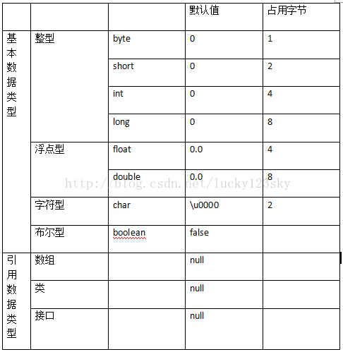

> 摘要：Java语法。

<!-- more -->

## Java VS C++

1. 纯面向对象的语言，封装、继承、多态->低耦合的系统，易维护、复用、扩展；C++兼容C，效率高但有面向过程。
2. JVM：跨平台/平台无关，一次编译到处运行（很好的可移植性），字节码运行机制，既有编译又有**解释**；C++为编译型语言，C++11 数组，Windows VS Linux。
3. JVM：自动内存管理，内存更安全；C++要手动释放内存，指针易导致内存泄漏。
4. 多线程：支持多线程；C++ 没有内置的多线程机制，必须调用OS的多线程功能。
5. 继承：Java类单继承，接口多继承；C++类支持多重继承；
6. 重载：Java 只支持方法重载；C++同时支持方法重载和操作符重载
7. 支持网络通信编程且很方便，支持Web应用开发


## JDK、JRE、JVM 对比

- JDK（Java Development Kit），是一种功能齐全的Java SDK，用于程序开发者创建、编译程序。
 - Java 开发组件：javac编译器、jar打包工具、javadoc文档生成器、jdb调试工具、javap -c反汇编
 - **JRE**（JAVA Runtime Environment）：包含普通用户运行 Java 程序所需的全部内容
  - JVM（JAVA Virtual Machine）：是一个用于执行**JAVA字节码**的**虚拟机进程，实现**一次编译，到处运行**
  - 用于产品环境的 Java 类库


## 常量和变量

### （非 static）成员变量 VS 局部变量

1. 定义（本质）：成员变量属于（类/）对象；局部变量是在代码块/方法中定义的变量/方法的参数
2. 修饰符：成员变量都可以；局部变量不能被**访问控制修饰符**及 static 修饰，只能被 final 修饰。
3. 存储位置：static 成员变量属于类，存于方法区，（非 static ）成员变量属于对象，存于堆内存；局部变量存于VM栈中的局部变量表。
4. 默认值（JVM类加载和字节码执行）：成员变量有默认值，会自动初始化（如未赋初值则取默认值）（例外：被 final 修饰的必须显式地赋值）；而局部变量必须显式地初始化。在字节码执行时才会运行方法中的（局部变量）代码。
5. 生命周期：成员变量与类/对象一致；局部变量与方法一致。

```
public class DataClass {
    int age; // 成员变量/全局成员变量/实例变量
    static String URL = "hello"; // 静态成员变量
    static final String website = "C"; // 静态常量
}
```

### final 关键字

final 核心思想：最终的、不可修改的；表示变量值不可变、方法不可覆盖、类不可继承。

1. 修饰类：不可被继承（没有子类），所有成员方法被隐式指定为final，（但成员变量不会变）；

所有包装类都是final类；如String类，Java编译器可把字符串常量（包含在双引号中的内容）直接转成String对象，同时对运算符"+"的操作直接优化成新常量<-因为final修饰保证了不会有子类对拼接操作返回不同的值。

2. 修饰方法：方法不可**重写**，可重载=>出于安全考虑防止子类覆盖父类方法；早期版本中final方法被转为内嵌，提高效率；

类中所有 private 方法都被隐式指定为 (final) private；final也可修饰private，但无意义。

3. 修饰变量：实质上是常量，值不可变。使用前必须有且仅有一次初始化，否则将抛出编译时错误（Compiler Error: cannot assign a value to final variable）。

从变量类型分类：
- 1. 修饰基本类型变量：初始化后值不可变，第二次赋值将报错；若编译时知道其或final String类型的确切值，则会当做**编译期常量**（直接宏替换）。
- 2. 修饰引用类型变量：初始化后**引用**不可变（即不能指向另一个对象），但**引用变量指向的对象的内容**可变。即final数组/集合可添加/删除元素。

```
String a = "hello2"; 

final String b = "hello";
String d = "hello";

String c = b + 2; 
String e = d + 2;
System.out.println((a == c));//true
System.out.println((a == e));//false
```

从变量位置分类：
- 1. 修饰静态成员变量（修饰类变量、常量=const）：只可在静态初始化块中/声明时赋初值；
- 2. 修饰（实例）成员变量：只可在非静态初始化块中/声明时/**每个构造器中**赋初始值；
- 3. 修饰局部变量：使用前赋值，不允许二次赋值。

```Java
HelloWorld.PI; // 静态常量，作用域是全局，不用创建对象，用类名直接访问

public class HelloWorld {
    // 修饰静态常量
    public static final double PI = 3.14;
    // 修饰成员常量
    final int Y = 10;
    public static void main(String[] args) {
        // 修饰局部常量
        final double X = 3.3;
    }
}
```

- 在foreach语句中可用final声明存储循环元素的变量

- 局部内部类和匿名内部类只能访问局部finial常量：
（因为外部类运行后局部变量会被回收，内部类延长局部变量copy的生命周期用finial保证二者一致。JDK1.8后默认加finial）

- abstract和finial互斥，二者不能同时存在

### static关键字

static 修饰的成员属于类，可被类的所有对象共享，加 static 不影响作用域。只保存一份拷贝，建议用类名调用。

1. 修饰成员方法（=>静态方法、类方法）：
不依赖任何对象，在类加载时（在方法区）分配内存，可通过类名直接访问；非 static 成员在对象实例化前不存在，不能被 static 方法调用
==>只能访问类的静态成员；
==>方法中不能以任何方式引用this和super；但反之在非静态方法中可通过this访问静态成员；

方便在没有创建对象的情况下调用方法/变量，如Collections类中的一些方法、单例模式的getInstance方法、工厂模式的create/build方法、util工具类中的方法。如：Arrays 类，Character 类，String 类等

构造器不是静态方法：
- 定义：不是方法，只负责初始化；
- this：可使用this（指向当前对象），而静态方法不依赖任何对象；
- 调用：只能通过new（或别的构造器）调用，不能通过方法调用。

2. 修饰成员变量（=>静态变量/类变量）：实质上就是全局变量；
- 内存分配：由类的所有对象共享，持久驻内存，下次调用保留原值
- 存储位置：static变量位于方法区；普通成员变量位于vm栈的局部变量表
- 调用方式：（推荐）用类名调用
- 生命周期：类被 GC 彻底回收时才被销毁

目的：作为共享变量使用；减少对象的创建；保留唯一副本

3. 静态代码块：定义在类中方法外，用于初始化静态变量；
执行顺序：静态代码块-->非静态代码块-->构造器。 

不管创建多少对象，静态代码块都只执行一次；对于定义在它之后的静态变量，可赋值，但不能访问。如单例模式、定义枚举类

非静态代码块与构造函数的区别是：非静态代码块是对所有对象进行统一初始化，而构造函数是给对应的对象初始化

4. 静态类（只能修饰内部类）：非静态内部类在编译完成后会隐含地保存一个引用，指向创建它的外部类，但静态内部类却没有。意味着：
- 它的创建不依赖外部类的创建。
- 它不能使用任何外部类的非 static 成员变量/方法。

5. 静态导入包：1.5 后的新特性， 格式为：import static，可导入某个类中的指定静态资源，且不需用类名调用类中静态成员，可直接用类中静态成员变量/方法。

- static 全局变量和函数，隐藏在本文件内，extern？

final VS static变量：

```
class MyClass {
    public final double i = Math.random();
    public static double j = Math.random();
}

MyClass cls1 = new MyClass();
MyClass cls2 = new MyClass();

cls1.i;
cls1.j;

cls2.i;//两个i值是不同的
cls2.j;//两个j值都一样的
```


## 数据类型

### 四大类八小类基本数据类型（primitive type）


[Title](http://localhost:52009/_drafts/assets/20170208114016745.png)

1. 布尔型 bool，布尔类型的值不能转换成任何数据类型，true != 1，占用大小根据实现JVM不同有所差异
2. 字符型 char
3. 整型 byte short(32767) int(2^32-1=2,147,483,647) long
4. 浮点型 float double

基本类型	位数	字节	默认值
boolean	1		false
char	16	2	'u0000'
byte	8	1	0
short	16	2	0
int	    32	4	0
long	64	8	0L
float	32	4	0f
double	64	8	0d

```
long price = 12.2L
float price = 12.2f; 
double price = 12.254d;
double price = 12.254;//or
```

### 包装类（wrapper class，箱子）

包装类都是final修饰，无法继承

对应包装类和进入常量池的取值：
- **Boolean** TRUE/FALSE
- **Character** [0,127]
- Byte Short **Integer** Long [-128,127]
- Float Double 不会进入常量池
- String类型的所有字面量都会进入常量池

包装类在常量池的值会复用已有对象的缓存数据，可直接用==判断；其它范围的值，必须全部用 equals()比较；

区别：
- 默认值：基本数据类型有默认值（int = 0）且不是null；包装类型若不赋值为null
- 存储位置：基本数据类型直接存放在VM栈的局部变量表中，占用空间小；而包装类对象存在堆中。

从JAVA SE5开始引入自动装箱/拆箱机制->将基本数据类型当成对象操作，使二者可相互转换：

自动拆箱的时机：
1.将包装类型变量直接赋值给对应基本数据类型时；
2.当要访问对象的真实数据值时，如要输出对象的值；
3.当要对包装类的实际值进行数学运算时，如比较大小。

```Java
Integer i1 = new Integer(66); // 手动装箱，基本数据类型 => 堆内存中的包装类对象
Integer i2 = 66; // 自动装箱，调用了 **Integer.valueOf(66)**，i2指向常量池中的对象；Double、Float的valueOf()的实现是类似的。
i1 == i2? // false，不同对象的地址不同
i1.equals(i2)? // true，不同对象的值相等

int d3 = i2.intValue(); // 手动拆箱，包装类对象 => 基本数据类型
int d3 = i2; // 自动拆箱，调用了 **i4.intValue()**/xxxValue()
```

与字符串间的转换（继承自Object类的方法）：

```
Integer i3 = Integer.valueOf(str); // 字符串 => 包装类对象
String str = i1.toString(); // 包装类对象 => 字符串

int i3 = Integer.valueOf(str); // （推荐，经典代码）字符串 => 包装类对象 => （自动拆箱）基本数据类型
int i4 = Integer.parserInt(str); // 字符串 => 基本数据类型
```

### 数据类型转换

自动类型转换：

a.          char -> int -> long -> float -> double
b. byte -> short -> int -> long -> float -> double


- ==下转型==（down-casting，也称为窄化）会造成精度损失
- 将float变量赋值给int变量需要用强制类型转换 

- instanceof 关键字：
若对象为类（或接口、抽象类、父类）的实例，则返回true

### 运算符 == VS equals

==比较的是引用，即：
1. 用于基本数据类型，直接比较其（vm栈中）存储的值是否相等；
2. 用于引用类型，比较两个引用是否指向同一块内存（堆内存中的对象地址）/同一个对象；
- 除非是同一个new出来的对象才为true，否则为false。因为每new一次，都会重新开辟堆内存空间。
- null == null //返回true，null既不是对象也不是一种类型，仅是一种特殊的值
3. 表达式（包含算术运算）== 包装类（触发自动拆箱==>基本数据类型）：比较的是数值

不能用 == 比较的有：

- 基本类型的变量、值 == 引用类型的变量、值；
- boolean 类型的变量、值 == 其他任意类型的变量、值；
- 没有继承关系的两个引用类型；
- 浮点数 == 浮点数：
由于计算机内存放的实数与实际的实数存在误差，导致浮点数精度陷阱。改用BigInteger/BigDecimal类，如：0.99999999f==1f //返回true

```
float a = 1.0f - 0.9f;// 0.100000024，存储
float b = 0.9f - 0.8f;// 0.099999964
a == b？// false

BigDecimal a = new BigDecimal("1.0");
BigDecimal b = new BigDecimal("0.9");
BigDecimal c = new BigDecimal("0.8");

BigDecimal x = a.subtract(b); // 0.1 
BigDecimal y = b.subtract(c); // 0.1
Objects.equals(x, y)?// true
```

equals()用来比较两个对象（内存中）的内容是否相同，即对象是否相等。
因equals()继承自Object类，故每个对象都有equals()。

1. 不能用来比较基本数据类型的变量；
2. 对于引用类型：
- 若没重写equals()<==>直接调用==，对比地址是否相等；
- 多数情况下，重写equals()==>比较对象存储的内容是否相等。需保证equals()相同对应的对象hashCode也相同。如String类、包装类、Date类等；

```
String s1 = "ab"; // 将字面量"ab"放到常量池中，并将引用 s1 指向对象；推荐
String s2 = "ab"; // 在常量池查找到"ab"的地址，并赋给s2
s1 == s2? // true，s1和s2地址相同
s1.equal(s2)? // true，比较字符串的内容

String str1 = new String("ab"); // 在堆内存创建一个新对象，a 引用指向新对象
String str2 = new String("ab"); // 在堆内存创建另一个新对象，b 引用指向新对象
str1 == str2? // false，非同一对象
str1.equals(str2)? // true，对象的内容一样

s1 != str1 // s是常量池中的对象的引用，str是堆内存中的对象的引用，二者地址不同
s1.equal(str1) // true，内容相同，重写hashCode()

String str3 = str2; // 引用传递，指向堆内存中的同一对象
str3 == str2? // true
str3 == s1? // false
str3.equal(s1) // true

Objects.equals(null,"hello");// 避免空指针异常

42 == 42.0? // true
```

### 三类引用数据类型（reference type）

作为方法的参数类型和返回类型

1. 数组
2. 类
3. 接口

### 数组

#### 用法

1. 声明;
2. 分配空间；
3. 初始化；
4. 使用。

声明数组只得到一个存放数组的变量，并没有为数组元素分配内存空间，可用 new 关键字分配空间

```
int[] arr = new int[5]; // 声明 + 动态初始化
int[] num = new int[]{1, 2, 3, 5, 8};  // 一般不用
int[] num = {1,2,3,5,8}; // 声明和静态初始化
arr.length; // 长度

List list = new ArrayList();
```

当指定的下标值超出数组的总长度时，会拋出 ArrayIndexOutOfBoundsException（数组越界异常）。

因为 Java 类与类间支持继承，可能产生一个数组里可存放多种数据类型的假象。如一个水果数组，元素可是苹果或香蕉（都继承了水果），但元素类型还是水果。

#### 数组、List接口、ArrayList类

- 数组：大小固定，查找快
- List：是接口
- ArrayList：是List的实现类，有序，以一定的顺序保存元素。

#### Arrays 工具类

java.util.Arrays

数组由此抽象基类派生，Arrays 类包含了数组操作的很多方法，均为 static 修饰的方法（可直接通过类名调用）。


## 类和面向对象

### 类

- 按需加载类，且只加载一次
- static成员变量初始化
- 执行static语句块
- static成员变量和static语句块的执行顺序同代码中的顺序一致
- 初始化对象的成员变量，类中的变量在任何方法（包括构造器）调用前初始化
- 执行构造器
- 生成对象

### 对象（Object Oriented）

根据JVM规范："对象是动态分配的类实例或数组"。实例是内存中的对象。

抽象：指将一类对象的共同特征提取出来构造类，**类是对象（实例）的抽象**。一切皆对象。

```
Student stu1 = new Student("小刘",22); // 显式创建对象

String str1 = "Hello"; // 隐含创建对象
String str2 = str1 + "Java";

new Person("张三", 30).tell(); // 匿名对象，对象只用一次，在实际开发中基本作参数，区别于单例模式
```

### this super 关键字

this代表当前类的对象的引用，指向本对象；super 代表对父类对象的引用，指向父类对象。

1. 在构造器中，this用于区分同名成员变量与局部变量；this 调用本类中的其他构造方法/super() 调用父类中的其他构造方法时，必须处于构造器的首行，否则编译器会报错。
2. 在 static 方法中，this、super不可用。

### 封装

定义：把数据和操作方法绑定，用于控制对外隐藏和暴露哪些数据。封装的基本单位是类。javabean get/set；orm框架。

### 继承

继承：指子类可使用父类的所有属性和方法。子类 is a 父类

继承的特点：
- 单继承（不支持多重继承）：程序结构更清晰便于维护。多重继承会使类型转换、构造方法的调用顺序变复杂，影响性能。
若支持多重继承，类C继承自类A和类B,如果类A和B都有自定义的成员方法f(),则调用类C.f()会产生二义性。
**通过实现多个接口间接支持多重继承**，接口由于只包含方法定义，不能有方法的实现，类C不能直接调用方法，需实现具体的f()才能调用，不会产生二义性。

- 多层继承
- 子类**拥有**父类所有的属性和方法（包括私有属性和私有方法），但子类无法访问父类中的私有属性和方法，仅拥有。
- 子类可重写父类的方法
- 继承后变量和方法的访问顺序：就近原则
- 对于父类的包访问权限成员变量/方法，如果子类和父类在同一个包下，则子类能够继承；否则，子类不能够继承；
- 子类不能继承父类的构造器

super主要用法：

1. super.成员变量/super.成员方法;//用于在子类中调用父类的同名成员变量或方法；

2. super(param1,...)
　//用于在子类构造器的第一行显式地调用父类构造器；
　//若父类有无参构造器，系统会自动调用super()；
　//若父类的构造器都带参，则必须用super(param1,...)显式调用一次

### 方法重载（overload） VS 方法重写（override）

- 重载：是同一个类中多个同名方法根据不同的传参来执行不同的逻辑处理；
- 重写/覆盖：是子类**继承**父类已有的方法，并重新实现其内部逻辑功能

0. 方法名都相同
1. 发生范围：重载在同一个类；重写在子类中
2. 参数列表（类型、个数、顺序）：重载至少一个不同；重写一定相同
3. 返回值类型、异常：重载可不同（只有返回值不同不算重载）；重写子类的返回值类型、异常范围（RunTimeException）<=父类（Exception）
4. 访问修饰符：子类访问权限（public，而非private）>=父类（protected），即子类修饰符不能做更严格的限制->父类方法修饰符为 private/final/static或构造器（都不能被继承）则子类不能重写，但被 static 修饰的方法能被再次声明；
5. 发生阶段：重载实现的是**编译时**的多态性（即前绑定）；重写实现的是**运行时**的多态性（即后绑定）。

### 多态

多态：即**一个接口，多个方法**。指多个子类继承并重写父类的同一属性或方法，或子类实现接口并覆盖接口中的同一方法，并将父类引用指向子类对象。

```
//指存在继承关系的对象类型转换
Animal animal = new Dog();    // 引用的自动类型转换，向上转型，把Dog类型转换为Animal类型
Dog dog = (Dog) animal; // 引用的强制类型转换，编译正常，运行可能报错ClassCastException类型转换异常，建议在强转前判断对象的真实类型；向下转型，把Animal类型转换为Dog类型
animal.run();

Animal animal = new Cat();
if (animal instanceof Cat) {
    Cat cat = (Cat) animal; // 向下转型
    ...
}

Animal taidi = new Dog();
taidi.run();
```

实现多态有 3 个必要条件：
1. 子类继承父类/实现接口
2. 方法重写
3. 父类引用指向子类对象（向上转型）或接口的引用变量指向其实现类的实例对象

分类：
1. 编译时多态：是静态的，主要指**方法重载**。编译后变成不同的方法
2. 运行时多态：是动态的，即通常所说的多态性，指继承父类和实现接口时，可用父类引用指向子类对象。

特征：
1. 对于方法的调用：编译看左边，运行看右边？
2. 对于变量：编译、运行都看左边

优势：
1. 便于类与类间解耦，右边对象可以组件化切换，改变业务
2. 父类作为方法的形参（入参）用来传递对象

劣势：
1. 编译看左边，不能调子类独有的方法

### 抽象类 VS 接口

抽象类的意义（代码复用）：
1. 为了被子类单继承
2. 模板设计模式（部分实现，部分抽象）

抽象方法只有声明，没有具体的实现。
包含抽象方法的类称为抽象类，不能用来创建对象。

- 有抽象方法的类必须被声明为抽象类，而抽象类未必要有抽象方法。
- 类继承抽象类或实现接口，要实现所有抽象方法，否则仍需被声明为抽象类。

抽象类（abstract class） VS 接口（interface）

同：
- 都不能例化，但可定义抽象类和接口类型的引用？
- 接口的实现类或抽象类的子类需实现相应的方法才能被实例化。

异：
1. 抽象类可有普通成员方法的具体实现；接口只有public abstract方法定义，不能有方法的具体实现
2. 抽象类可有各种成员变量；接口中的成员变量（JDK1.8 前）只能是public static finial变量（JDK1.8 后为默认为default？）
3. 抽象类可有构造器、静态方法、静态代码块；接口中不能有
4. 一个类只能继承（extends）一个抽象类；但可实现（implements）多个接口

### 深拷贝 vs 浅拷贝

浅拷贝：对基本数据类型进行值传递，对引用数据类型，进行引用传递般的拷贝。
深拷贝：对基本数据类型进行值传递，对引用数据类型，创建一个新对象并复制其内容。

### 接口

- 类与类单继承
- 类与接口的多实现
- 接口与接口的多继承

implements实现类
接口是用来被实现的，接口没有构造器

JDK1.8前只有：
1. 默认为抽象方法 public abstract
2. 常量

JDK1.8后新增三个方法：
1. 默认方法：用 default 修饰，即实例方法
2. 静态方法：只能用接口名本身调用，不能用子接口/实现类调用
3. 私有方法：被私有方法/默认方法调用，只能在本接口中访问

### 内部类

1. 静态内部类：类似静态成员变量。public static，只加载一次，特点与外部类一样，寄生和宿主的关系；只能访问外部类的静态成员，不能直接访问外部类的实例成员

2. 成员内部类（实例内部类）：作为成员对象的内部类。可访问private及以上外部类的属性和方法。外部类想访问内部类属性或方法时，必须创建一个内部类对象，然后通过该对象访问内部类的属性或方法。外部类也可访问private修饰的内部类属性。**实例内部类属于外部对象，实例内部类对象是外部对象实例化的成员变量**；没有静态区，不能定义静态成员，能定义常量；Outter.Inner o = new Outter().new Inner();能访问外部类的静态成员和实例成员。

3. 局部内部类：几乎不用，只能定义实例成员，不能定义静态成员。存在于方法中的内部类。访问权限类似局部变量，只能访问外部类的final变量。

4. **匿名内部类**：没有类名的局部内部类，只能用一次，只能访问外部类的final变量。子类在new时重写父类的抽象方法可以省略子类定义，立即返回匿名内部类对象；用于对象回调；用于创建接口对象来简化代码？

### Lamada表达式

只能简化函数式接口的匿名内部类写法
1. 接口
2. 接口中只有一个抽象方法


## 泛型

泛型：即参数化类型，就是一个标签：<数据类型>，解决不确定对象具体类型的问题。

可在编译阶段约束**引用**数据类型，从而不出现类型转换异常

操作的数据类型被指定为一个参数，在类中称为泛型类、接口中称为泛型接口、方法中称为泛型方法。建议用E，T，K，V，？代表

-> 通用技术框架/C++模板

```
ArrayList<String> lists = new ArrayList<>();

public interface Data<E> {
}// 泛型接口，在实现接口时传入真实数据类型

public StudentData implements Data<Student> {
}

public static void run(ArrayList<? extends Car>) {
}

public static void run(ArrayList<? super Car>) {
}
```
通配符：？
泛型没有继承关系：虽然BMW和BENZ都继承了Car，但是ArraryList<BMW>和ArraryList<BENZ>与ArraryList<Car>无关

泛型的上下限：？ extend Car


## 注解

用于为 Java 代码提供元数据。不直接影响代码执行，但也有一些实际上可以。

用于提供信息给编译器，在编译阶段时给软件提供信息进行相关的处理，在运行时处理写相应代码，做对应操作。

## IO

序列化： 将Java对象转换成二进制字节流/序列？的过程，用于解决在对对象流进行读写操作时所引发的问题。通过网络对象进行传输

具体实现：实现Serializable接口，或实现Externalizable接口中的writeExternal()与readExternal()方法。

Stream流

```java
  import java.util.Scanner;
  
  Scanner myScan = new Scanner(System.in);
  String name = myScan.next();
  int n1 = myScan.nextInt();
  double d1 = myScan.nextDouble();
  
  for(double element: myList){
  	System.out.println( element );
  }
```

## 网络编程

## 反射机制

每一个类都有一个Class对象，其包含了与该类有关的信息。

获取Class对象的方法：
- Class.forName("类的全限定名")
- 实例对象.getClass()
- 类名.class

反射机制：指在程序的运行过程中可构造任意一个类的对象、获取任意一个类的成员变量和成员方法、获取任意一个对象所属的类信息、调用任意一个对象的属性和方法。可通过以下类调用反射API：

Class类：可获得类属性方法
Field类：获得类的成员变量
Method类：获取类的方法信息
Construct类：获取类的构造方法等信息

优点 ：让代码更灵活、为各种框架提供开箱即用的功能提供便利，动态代理的实现依赖反射；注解的实现也用到反射

缺点 ：不安全。如可无视泛型参数的安全检查（泛型参数的安全检查发生在编译时）；性能稍差

## 异常

http://c.biancheng.net/view/6635.html

拋出异常（throw Exception）：生成异常对象，并提交给JVM的过程。

捕获（catch）异常：JVM在方法栈中查找能够处理该类型异常的对象的过程。

顶级父类 Throwable：

- Error：程序无法处理（无法通过 catch 捕获，只能尽量避免）的错误。发生时JVM会终止线程。如
- - Java Virtual MachineError
- - OutOfMemoryError
- - StackOverFlowError
- - 类定义错误（NoClassDefFoundError）等。

- Exception：程序本身可处理（通过 try-catch 捕获）的异常。如
- - **RunTimeException**运行时异常，可不处理
- - 非运行时异常，必须处理

- ArrayIndexOutOfBoundsException
- NullPointerException
- ClassCastException类型转换异常
- ArithmeticException
- NumberFormateException

将异常层层抛给顶层，统一处理

finially：用于回收资源，遇错也一定执行，在return前执行；表示附带的语句块最终一定被执行，常被用于释放资源。
finally代码块遇到下面情况不会执行，直接结束：
- 当程序在进入try语句块前就出现异常时。
- 当程序在try块中强制退出时，如使用System.exit(0)。

其它情况下，在try/catch/finally语句执行的时候，try块先执行，
- 当有异常发生，catch和finally进行处理后程序就结束了，
- 当没有异常发生，在执行完finally中的代码后，后面代码会继续执行。

值得注意的是，当try/catch语句块中有return时，finally语句块中的代码会在return前执行。如果try/catch/finally块中都有return语句，finally块中的return语句会覆盖try/catch模块中的return语句。

### throws VS throw

throws：一般用在方法声明上，代表可能会抛出的异常列表。

throw：一般用在方法内部（出现异常的地方），由开发者定义，当程序语句出现问题后，创建异常对象并立即主动抛出一个异常。

```
try{
} catch(FileNotFoundException e) {
  e.printStackTrace();
}catch(Exception e) {
  e.printStackTrace();
}
```


## 常用类

常用类：

- Arrays
- System
- String / StringBuffer / StringBuilder
- Math
- BigInteger/BigDecimal
- Date/Calendear/LocalDate

### Object 类

如果定义类时并未显式指定父类，则默认继承 java.lang.Object 类

toString()方法
默认返回类带包的全名@当前对象在堆内存的地址，通常重写返回对象的内容

equals()方法
默认比较对象的地址是否相同，等价于==；通常为了被子类重写便于制定比较规则

```
//方法一：无判空
@Override
public boolean equals(Object obj) {
  if(obj instanceof Student) {
  Student stu = (Student) obj;
  return this.name.equals(stu.name);
} else {
  return false;
}
//方法二：IDEA自动生成

```

当垃圾回收器准备好释放对象占用空间时，首先会调用finalize()，并在下一次垃圾回收动作发生时真正回收对象占用的内存。


### Objects 类

```
Objects.equals(o1, o2); // 推荐使用
```

### String 类

~~String类有11种构造方法：~~ 
1. 字符数组
...

1. String 用finial修饰的字符数组保存，每次都创建新对象（多了会导致性能降低）。一旦创建，其值不可改变，适用于**不常改变长度**的字符串，String.length()；

StringBuffer、StringBuilder对原对象操作

2. StringBuffer 用无final修饰的字符数组保存。线程安全（多线程、共享变量、结果不受影响），方法都是synchronized，推荐多线程使用共享变量的情景。对象创建后，仍可修改值。

3. StringBuilder 用无final修饰的字符数组保存。性能最好? 非线程安全

Object 类有一个 toString() 方法。在调用该类对象时，将自动返回一个字符串，
可用"System.out.println(对象名)"打印出来。

### Math类

abs()
ceil()
floor()
pow(2, 3)
round(4.9999)

### Date类

```
import java.util.Data;

Data d = new Date();
long ts =  d.getTime(); // 时间戳

SimpleDataFormate sdf = newSimpleDateFormate("yyyy-MM-dd HH:mm:ss EEE a");

String rs = sdf.format(d);
String rs2 = sdf.format(ts);

sdf.parse("2019-09-11 ");


Calendar rightNow = Calendar.getInstance();
rightNow.add(Calendar.YEAR, 71); // after 71 year
```

### System

exit()
cuurentTimeMilis()
copyArray()基本不用

### BigDecimal

用来做精度运算

```
BigDecimal bd = BigDecimal.valueOf(0.3333);
bd.add(0.111);
bd.doubleValue();
```

### 枚举类
用于信息标志和信息分类
元素为常量对象
多例模式
继承Enum类

```
Sex s = Sex.BOY;
s.ordinal();// index
Sex.values();//all values
```

### 正则表达式 Pattern类

适合做校验

```
"hello".matches("\\d{4,}");
"he2kele4we".splite("\\d+");
"he2kele4we".replaceAll("\\d+", "/");

Pattern pt = Pattern.compile("\\d+");
Matcher mt = pt.matcher("hjeiji@jhj@".);
while(matcher.find()) {
  matcher.group();
}
```