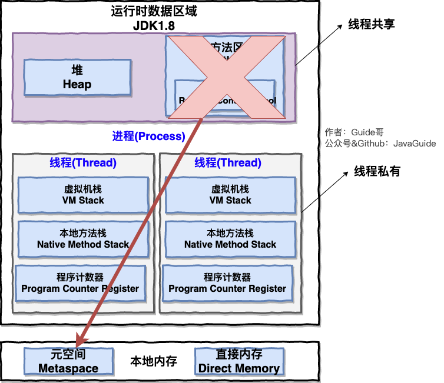

> 摘要：Java高级之JVM虚拟机，包括类加载机制，创建对象，内存分配机制，GC 垃圾回收，JVM 调优等。

<!-- more -->

### 目录

[TOC]

### main() 方法的执行步骤

```
Student stu = new Student("Tom");
stu.sayName();
```


1）**【字节码执行机制】**：编译 `Application.java` 得到 `Applciation.class` 字节码文件。

2）**【类加载机制】**：

1. **加载 Application 类**：系统启动一个 **JVM 进程**，从 **classpath 路径**中查找 `Application.class`，将 Application 的类信息加载到方法区；
2. 找到 Application 类中的主程序入口 **main() 方法**，并执行 ；
3. 检查是否已**加载 Student 类**：（在常量池中）定位**类的符号引用**；
4. 若无则加载 Student 类。

3）【new **创建 student 对象**】：（简化版）

1. 在（VM 栈的）局部变量表中创建变量 `stu`，字面量`"Tom"`放在字符串常量池中（~~方法区~~）；
2. **【内存分配机制】（GC）**：在（堆中）为 Student 对象分配内存，并将**对象引用**赋给变量 stu；
3. 构造器**初始化** Student 对象，（有指向方法区中 Student 类的类型信息的引用）；

4) 执行方法：根据 stu 引用找到 Student 对象，获取 `sayName()` 的字节码地址并执行。

### new 对象的流程

new 一个对象的流程（详细版）：加载并初始化类、创建对象。

1. **类加载**：检查当前类是否已被加载？
    1. 若已被加载、则直接返回**类的符号引用**；
    2. 否则尝试用 ClassLoader 加载 .class 字节码文件到内存；
    3. 初始化**静态成员变量**。
2. 执行 new，**申请一片内存空间**；（为新对象在堆中）**分配内存**，若内存不够则先执行[GC](#回收策略)；
    - 不包括任何静态变量；
3. **初始化为零值（默认值）**；
    1. JVM 将分配到的内存空间都初始化为零值（不包括对象头），
    2. ~~保证了对象的实例字段在 Java 代码中可以不赋初始值就直接使用，程序能访问到这些字段的**数据类型所对应的零值**。~~
4. **设置对象头**：比如这个对象是**哪个类的实例**、如何才能找到类的元数据信息、对象的**哈希码**、对象的 GC **分代年龄**等信息。 
5. **执行 init 方法**：（按照程序员的意愿）**初始化对象**；
    - 初始化顺序：是先初始化**父类**再初始化子类，先执行实例代码块、然后是构造方法（初始化成员变量？）；
6. 如果赋值给变量 `Student stu = new Student("Tom");`，则：
    1. 在（VM 栈中的）**局部变量表**创建变量 `stu`，字面量`"Tom"`放在~~方法区~~；
    2. 把堆内对象的首地址（引用）**赋值**给（vm 栈中的）变量 `stu`；

##### 执行顺序

> 类的实例化/创建对象的顺序：
>
> - 先静态、先父后子；
> - 按在代码中出现的顺序依次执行。

执行顺序：（优先级从高到低）静态代码块 > 构造代码块 > 构造方法 > 普通方法。 

- 其中静态代码块只执行一次。构造代码块在每次创建对象是都会执行。

类加载时？执行静态代码块和静态初始化语句：

1. 初始化父类静态成员变量、静态初始化块/静态代码块（只执行一次）：static 成员变量和 static 语句块的执行顺序同代码中的顺序一致；
2. 子类静态成员、静态初始化块；

创建对象执行顺序：

1. 初始化对象父类的实例成员变量，执行实例初始化块；
2. **父类构造器**、构造方法；
3. 初始化子类实例成员变量，执行实例初始化块；
4. **子类构造器**；
5. 普通代码块；

##### 对象在堆内存的存储布局

1. **对象头**：
    - MarkWord：存储哈希码、分代年龄、（锁状态标志位、）线程持有的（轻/重量级）锁、偏向锁线程ID等信息。
    - 存储类型指针：指向类的元数据指针，确定对象是属于哪个类的实例。数组长度。
2. 实例数据：存储代码中所定义的各种类型的字段信息。

3. 对齐填充：起占位作用。HotSpot 要求对象的起始地址必须是8的整数倍。。

```
String str = new String("hello");
// 变量str放在VM栈上的局部变量表中
// 用new创建出来的String对象放在堆中
// 而"hello"这个字面量放在方法区的运行时常量池
```

### 字节码执行机制

字节码：JVM 可理解的代码（即扩展名为 `.class` 的文件）。

##### 编译与解释共存

1. 既有编译型语言的特征，也有**解释型语言**的特征：先编译生成字节码文件，编译后不直接运行，而是通过**解释**运行。
2. **JIT**（just-in-time compilation）**即时编译器**：属于运行时编译。完成第一次编译后，将（热点代码的）字节码对应的机器码保存下来，下次可直接用。

##### JVM VS 传统解释型语言

1. 保留优点：可移植；
2. 一定程度上解决缺点：执行效率低。


##### Java 程序运行过程

1. -> 源文件(`.java`）
2. **编译**：-> 通过 Javac 编译器 ==> Java 字节码文件（`.class`）；
3. -> 通过 JVM ==> 转为（特定系统可执行的二进制）**机器码**：
    1. -> `Class Loader` 加载字节码文件；
    2. **解释**：-> `Execution Engine` 通过**解释器**逐行解释执行，执行速度相对较慢；
    3. -> `Runtime Data Area`（**运行时数据区**，即常说的 JVM 内存）。

##### .class 字节码文件

> 包含类的版本、字段、方法、接口等描述信息外，
>
> 还有**静态常量池**：用于存放编译器生成的各种**字面量**(Literal)和**符号引用**。

（根据 `jclasslib Bytecode viewer` 反编译插件解析的）.class 字节码文件包括：

1. 一般信息：
    1. 魔数：字节码文件的标志，确定此文件能否被虚拟机接收，是一个固定值 `0XCAFEBABE`；
    2. 主版本号（如表示 JDK1.8）和次版本号；
    3. **访问标志（修饰符）**：用于识别类或接口层次的访问信息，包括：是类还是接口，是否为 `public` 或 `abstract` 类型，是否声明为 `final` 等；
    4. 本类索引、父类索引：用于确定当前类和父类的全限定名；指向常量池。
2. **静态常量池**（表）、.class 文件常量池 => 加载到**运行时常量池**；主要存放两类常量：
    - **字面量**：
        - 文本字符串 `"hello"` => 加载进**字符串常量池**；JDK1.7 字符串常量池和静态变量被从方法区拿到了堆中；
        - `final` 常量值、基本数据类型的值15等；
    - 和（类的）**符号引用**：1. 类和接口的全限定名、2. 字段名和描述符、3. 方法名和描述符。
        - 类加载时，部分符号引用会替换为直接引用，如类的静态方法、私有方法，构造方法，父类方法（因为这些方法不能被重写），而其他方法在第一次调用时才转变。
3. **接口**（索引集合）：用来描述类实现的接口；指向常量池。
4. **字段**（表集合）：（接口或类中声明的）**静态变量**和实例变量（方法内声明的参数和局部变量在局部变量表中）。=> JDK1.7 字符串常量池和静态变量被从方法区拿到了堆中。
5. **方法**（表集合）：描述方法的定义部分，包括访问修饰符、返回类型、方法名等。
6. **属性**（表集合）：方法的代码实现 => `JIT` 即时编译器编译后的代码（缓存）。

### 类加载机制

ClassLoader：用来加载 Class，负责将 Class 的字节码形式转换成**内存形式**的 Class 对象。

##### 类加载步骤

根据（常量池中的）**动态链接**定位**类的符号引用**，检查当前类是否已被加载：

1. 已被加载的类直接返回；
2. 否则**尝试**（用类加载器、通过双亲委派机制）加载类。

速记：**加莲 厌准姐 初**


1. 加载：根据类名查找 **.class 文件**，并加载到内存；
    2. 将静态存储结构转换成（方法区中的）**运行时数据结构**；
    3. 在（堆）内存中生成类的 **Class 类对象**，作为方法区数据的访问入口。
    
2. 连接：
    1. 验证：确保文件格式、字节码结构等符合 **JVM 安全规范**；
    2. 准备：为 **static 变量**（在堆中）分配内存，并设置 0 值；
    3. 解析：将（常量池内的）**符号引用**替换为直接引用。

3. 初始化：执行**构造器**，初始化实例成员变量和真正初始化 static 成员变量。

    ```
    public static int i =3 ;
    // 第一次初始化后i的值为0，
    // 第二次初始化后值才为3.
    ```

4. 使用：一旦某个类的 Class 对象被载入内存，.class文件就被用来创建这个类的所有（实例）对象。

5. **卸载**：GC 将无用类从内存中卸载。

##### 双亲委派机制

> 用于加载类？

工作过程：**类加载器**收到类加载请求后，

1. 首先判断当前类是否被加载过，已被加载的类会直接返回；
2. 若未被加载（加载未知类时）：
    - **自底向上委派**：首先委派给父类加载器，（递归执行步骤1），判断当前类是否被父类加载器加载过，已加载的类直接返回；未加载的类继续向上委派；
    - **自顶向下查找**：当父类加载器无法处理时，才由自己来处理。

3. 如果**都没有加载**此类，则抛出 `ClassNotFoundException` 异常。

##### Tomcat 与双亲委派模型

- 不能用默认的类加载机制：
    1. 一个web容器可能**部署两个应用程序**，可能会依赖**同一个第三方类库**的不同版本；默认的 ClassLoader 无法加载相同类库的不同版本。
    2. 同一个web容器中相同的类库相同的版本可共享；符合双亲委派。
    3. web容器自己依赖的类库（tomcat lib目录下），不能与应用程序的类库混淆；同第一条。
    4. ~~web容器要支持jsp文件的热加载。~~
- Tomcat **未完全违反**双亲委派机制，核心的 Java 加载仍遵从双亲委派：
    - Tomcat 中各个web应用自己的类加载器（WebAppClassLoader）会优先加载，打破了双亲委派机制，加载不到时再交给 commonClassLoader 走双亲委托 。
- Tomcat **独特的**类加载机制：（加载优先级）
    1. **webapp 应用类加载器**：每个应用在部署后，都会创建一个唯一的类加载器。加载 `WEB-INF/classes`下应用自定义的的类和 `WEB-INF/lib`下的jar应用依赖包中的类。
    2. **Common 通用类加载器**：加载 **Tomcat 依赖包、应用通用**的一些类，在 `CATALINA_HOME/lib` 下，如：servlet-api.jar。
    3. **System 系统类加载器**：加载 **Tomcat 启动**的类，如 bootstrap.jar，~~通常在 catalina.bat 或catalina.sh中指定。位于 `CATALINA_HOME/bin` 下~~。
    4. **Bootstrap 引导类加载器**：加载 **JVM 启动**所需的类，以及标准扩展类（位于jre/lib/ext下）；


详解：[Tomcat - 都说Tomcat违背了双亲委派机制，到底对不对？](https://cloud.tencent.com/developer/article/1862861)、~~[图解Tomcat类加载机制(阿里面试题)](https://www.cnblogs.com/aspirant/p/8991830.html)~~

##### 常用类加载器

**ClassLoader**：用来动态加载（按需加载）`.class` 字节码文件到 JVM 内存（=> 内存形式的 Class 对象）。

不同层次的**类加载器**检查顺序、**优先级**：

1. **UserDefinedClassLoader**：`CustomClassLoader`。
2. **Application ClassLoader**：面向用户的加载器，负责加载**当前 classpath 路径**下的 jar 包和类。
3. **Extension ClassLoader**：负责加载 **JVM 扩展类库**（ `%JRE_HOME%/lib/ext` 目录下的 jar 包和类，通常以 javax 开头）；
4. **Bootstrap ClassLoader**：**最顶层**的启动类加载器，由 C++ 实现，随 JVM 启动，负责加载 **JDK 中的核心类库**（`%JAVA_HOME%/lib`目录下的 jar 包和类）、构造其它 ClassLoader。

不同层次的类加载器有不同优先级的好处：

1. => 可避免重复加载类；
2. => 保证核心 API 不被修改。

(JVM 搜索类时)判断两个class是相同的，要同时满足：

1. 两个类名相同（表示同一份class字节码）；
2. 由同一个类加载器加载。

> 对于`equals()、instanceof()`等方法来判断对象相等或所属关系都需基于**同一个 ClassLoader**。

### JVM 内存分配机制

> 注意与 Java 内存模型不同，JMM 是**多线程**中并发、线程同步相关的概念

 

自动内存管理：最核心的是**堆内存**中对象的分配与回收。

#### 运行时数据区

**每个进程**分配一块 JVM 运行时数据区（RunTime Data Area）/ 内存空间，分为两种类型：

1. **线程私有**：生命周期与线程相同，依赖**用户线程**（而创建/销毁）；包括程序计数器、虚拟机栈、本地方法栈；
2. **所有线程共享**（进程中）：生命周期与 **JVM** 相同，随 JVM 的启动而创建、JVM关闭而销毁；包括堆、方法区。

> 栈负责**执行方法**（运行代码），存放局部变量；堆负责**存储数据**（对象等）。

##### 程序计数器

PC Register：表示当前线程（所执行字节码）的**行号指示器**，由字节码执行引擎负责修改。字节码解释器通过改变程序计数器来依次读取指令，从而实现**代码的流程控制**：

- Java 方法中：存储的是（下一条）**字节码指令**（在方法区）的地址。记录当前线程执行的位置，保证**线程切换回来后**能恢复到正确的执行位置。
- native 方法中：undefined。

> 唯一没有 `OOM`（内存溢出）和 `StackOverFlowError` 的内存区域。

##### Java 虚拟机栈

JVM Stack：是描述 **Java 方法执行**的内存模型。每个 Java 方法在执行时会创建一个**栈帧**，方法从开始调用到执行完成，就是栈帧从入栈到出栈的过程。用于存储：

1. **局部变量表**：存放编译期可知的数据类型（如方法参数和局部变量）：
    - 对于基本数据类型的变量，直接存值；
    - 对于引用类型的变量，存的是**指向对象的引用**。
2. **操作数栈**：压栈和出栈操作，弹出数据、执行运算、结果压栈；
3. **动态链接**：指向**运行时常量池中**（当前）方法的引用；部分方法在编译期无法确定，只能在程序运行期间将调用方法的**符号引用**转换为直接引用。
4. **方法出口**：返回地址等。

> 易出的错误：
>
> - `StackOverFlowError`（若 VM 栈的**内存大小**不允许动态扩展）：栈帧中的局部变量过多时，常出现在递归、循环调用中 => 线程请求栈的深度 `>` 当前VM 栈的最大深度；
> - `OutOfMemoryError`（若 VM 栈的内存大小允许动态扩展）：堆中没有空闲内存，且 GC 也无法提供更多内存 => **无法申请到内存**时抛出；

##### 本地方法栈

Native Method Stack：为VM用到的 Native 方法服务，其它与VM栈一致。在 HotSpot VM 中和 Java 虚拟机栈合二为一。

##### 堆

Heap：存储**对象本身**（由 new 和构造器创建）及**数组本身**，但引用在VM栈的**局部变量表**中。

是 JVM 所管理的内存中**最大的一块**，在 JVM 中只有一个堆，**GC 主要管理的对象**。

- 内存空间/物理上可不连续，但逻辑上应连续；

分为：

1. 新生代：`Eden` 伊甸区、`Surviveor From（S0）`、`Surviveor To（S1）`；
2. 老年代
3. JDK1.7 **字符串常量池**和**静态变量**被从方法区拿到了堆中；
    - **字符串常量池**：存放的是字符串常量的**引用值**（String 对象实例本身、字面量存在**class 常量池**），在每个 VM 中只有一份。
    - **静态变量、静态常量**：Class 类对象所有。
    - （实例）常量：

JDK1.8 前，HotSopt 虚拟机的方法区又被称为**永久代**；


> 易出的错误：
>
> - `OutOfMemoryError: GC Overhead Limit Exceeded`：GC上限超出，GC 时间长，但只回收了很少的堆内存；
> - `OutOfMemoryError: Java heap space`：堆内存不足以存放新创建的对象；

#### 本地内存

（JDK1.7 及以前）HotSpot 把 GC 分代收集扩展至方法区，即用堆的**永久代**（PermGen）实现方法区，习惯上把方法区称为永久代。

JDK1.8：取消永久代，用 Metaspace 元空间实现方法区；实际位于**本地内存**中。


##### 方法区/元空间

> 对方法区**内存回收**的主要目标是：对常量池的回收和对类的卸载。

方法区（**Method Area**）/永久代/静态存储区：用于存储已被虚拟机加载的**字节码文件**：

1. 类信息；
2. JIT（即时编译器编译后的）代码缓存等。
3. **~~class 文件静态常量池~~**：
    1. **字面量**：
        - 文本**字符串** `"hello"` => 加载进（堆中的）**字符串常量池**；JDK1.7 字符串常量池和静态变量被从方法区拿到了堆中；
        - `final` **常量**值、基本数据类型的**值**15等；（变量名存在局部变量表中？）
    2. 和（类的）**符号引用**：1. 类和接口的全限定名、2. 字段名和描述符、3. 方法名和描述符。
        - 类加载时，部分符号引用会替换为直接引用，如类的静态方法、私有方法，构造方法，父类方法（因为这些方法不能被重写），而其他方法在第一次调用时才转变。
4. **运行时常量池**：加载 **.class 文件常量池**，也是每个类都有一个。
    1. JVM 在加载某个类的时候，必须经过加载、连接、初始化，而连接又包括验证、准备、解析（resolve）三个阶段。
    2. 而当类加载到内存中后，JVM 就会将 **class 文件常量池**中的内容存放到**运行时常量池**中，由此可知，运行时常量池也是每个类都有一个。
    3. class 常量池中存的是**字面量和符号引用**，也就是说它们存的并不是对象的实例，而是**对象的符号引用值**。
    4. 而经过解析之后，也就是把符号引用替换为直接引用，解析的过程会去查询**字符串常量池**，以保证运行时常量池所引用的字符串与字符串常量池中所引用的是一致的。

> 易出的错误：
>
> - `OutOfMemoryError`

##### 直接内存/堆外内存

由OS管理；JDK 1.4 引入的 **NIO** 提供了基于 `Channel` 与 `Buffer` 的 `IO` 方式，可用 Native 函数库直接分配堆外内存, 用 DirectByteBuffer 对象作为这块内存的引用进行操作, 避免了在 Java堆和 Native 堆中来回复制数据。

### GC 垃圾回收

#### 强引用、弱引用、软引用、虚引用

用于判断对象**可被回收**的时机。

- `Java`执行`GC`（回收方法）判断**对象是否存活**有两种方式、其中一种是**引用计数**。

从`JDK 1.2`版本开始，对象的引用被划分为`4`种级别，从而使程序能更加灵活地**控制对象的生命周期**。

引用类型/级别由高到低依次为：

1. **强引用**：当内存不足时，JVM 宁可出现 **OOM 内存溢出**也不回收，只有和 **GC Roots 断绝关系时**才回收（如显式地将引用置为 `null`、或让其超出对象的作用域、生命周期范围）。常用于普通的对象引用关系，如声明一个 `String str = new String("Const")`。
2. **软引用**：当**内存不足时**回收，~~如果回收后仍内存不足，抛出内存溢出异常~~；用于维护一些可有可无的对象，常用于实现（内存敏感的）**高速缓存**，如浏览器的后退按钮。由 **`SoftReference` 类**创建。
    - 按后退时，这时显示的网页内容是重新进行请求、还是从缓存中取出？
        1. 如果网页在**浏览结束时**就进行内容的回收，则需要重新进行请求；
        2. 如果将浏览过的网页存储到缓存中，会造成**内存**的大量浪费，甚至会造成内存溢出。这时候就可以使用软引用。
3. 弱引用：与**软引用**的区别在于，只具有弱引用的对象拥有**更短**的生命周期。（即使内存充足），也会在**下一次GC时**回收。由 `WeakReference` 类创建。
    - 在**垃圾回收器线程**扫描它所管辖的内存区域的过程中，一旦发现了只具有弱引用的对象，不管当前**内存空间是否足够**，都会回收它的内存。
4. 虚引用：跟没有一样，**形同虚设**。虚引用并不会决定对象的**生命周期**。主要用来**跟踪对象**被垃圾回收器回收的活动。
    - 与软引用和弱引用的一个区别在于：虚引用必须和**引用队列**（ReferenceQueue）联合使用。当垃圾回收器准备回收一个对象时，如果发现它还有虚引用，就会在回收对象的内存之前，把这个虚引用加入到与之关联的引用队列中。

```
// 强引用
String str = new String("abc");

// 软引用
SoftReference<String> softReference = new SoftReference<String>(str);

// 弱引用转强引用
WeakReference<String> weakReference = new WeakReference<>(str);
String strongReference = weakReference.get();

// 创建虚引用，要求必须与一个引用队列关联
ReferenceQueue queue = new ReferenceQueue();
PhantomReference pr = new PhantomReference(str, queue);
```

#### 判断可被回收时机

对象死了就立刻会被回收吗？

- 并不是。只有触发了 GC 才会被回收。

对象死了一定会被回收吗？

- 并不是，有些语言设计了复活机制，那么它可以在被回收之前，重新活过来（也就是又有了新的引用指向它）。比如说 Java。

回收时机：

1. **废弃常量**（被运行时常量池回收）：在没有被任何对象**引用**时。

2. **无用类**（被方法区卸载/回收）：需同时满足
    1. 类的所有实例都已被回收；
    2. 加载类的 `ClassLoader` 已被回收；
    3. 类对应的 Class 对象没有**任何引用**，无法通过**反射**访问该类的方法。

3. **已死亡对象**（被堆回收）：
    1. 没被引用的/超过作用域的对象；
    2. （强）引用被置为null（变为弱引用），在下一次GC回收。

#### 回收算法

> 如何判断一个对象存活？

回收方法有两大类：

- ~~**引用计数**器法~~：在对象里面维护一个计数，标记有多少对象使用到了该对象。如果计数为0，就表明该对象可以被回收了。在一个对象**没有任何关联引用**时回收。
    - 优点：实现简单，GC过程很快。整体开销被平摊到了整个应用生命周期内，对**并发 GC** 支持比较好.
    - 缺点：
        1. 无法解决**对象循环引用**；Swift 的垃圾回收就是采用了引用计数（赫赫有名的ARC）。
        2. 整个开销和引用变更次数成正比。
- 可达性分析法：目前主流是采用三色标记法。~~将 `GC Roots` 对象作为起始的**存活对象集**，向下**搜索**走过的路径（**引用链**/可达路径），~~
    1. ~~把能被该集合引用的对象**递归**加入到集合中（移动到S0）；~~
    2. ~~不能被引用（即对象到 `GC Roots` 没有任何引用链），表示该对象是**不可达的**；二次标记后还没成功逃脱，只能被回收。~~
    3. 优点：只和存活对象数量有关，开销较小。并且容易解决循环引用的问题。
    4. 缺点：会在 GC 过程中引入 **STW**，难以实现，并发 GC 的实现特别困难。

用可达性标记：在GC开始的时候，会从 **GC root 出发**标记，沿着对象的**引用链**，**标记存活的对象**。在标记完成之后，再执行回收算法。

1. 堆内存不规整 => **标记-清除**算法（`Mark-Sweep`）：维护**空闲列表**，记录可用内存，标记结束后统一回收。比如说 CMS 就采用了空闲链表来管理空闲内存。
    - 优点是，清扫的过程比复制和整理要快很多。
    - 缺点：易产生**内存碎片**。
2. 堆内存规整（没有内存碎片） => **标记-整理**算法（`Mark-Compact`）：**指针碰撞**，将**存活对象**都向一端移动，清除边界外的。如，采用这个算法的有 Serial Old 和 Parallel Old。
    - 优点：整理复制会保证能够得到一块连续的内存，可以采用高效率的指针碰撞技术来分配内存。
    - 缺点：整理过程非常耗时，涉及到了大量对象移动。比如 CMS 在启用压缩之后，这个过程是 STW 的，导致 GC 停顿时间特别长。
3. **复制**算法（`Copying`）：将可用内存**按容量划分**为大小相等的两块，当一块内存用完后，将存活的对象移动到另一块，并交换指针，清理已用内存。如，Serial New, Parallel New 和 G1。
    - 优点：保证能够得到一块连续的内存，可以采用高效率的内存分配方案。
    - 缺点：内存利用率不高，极端情况下，可用**内存减为原来的一半**；如果存活对象很多，效率会降低。
4. 分代回收算法

##### 可作为 `GC Roots` 的对象：

> 按 JVM 内存分配区域的顺序。

GC root：指在GC启动的时候必然存活的一组对象。一般来说，GC root 包含：

1. **虚拟机栈**（局部变量表）中引用的对象，如方法参数、局部变量、临时变量等；
2. **本地方法栈**中 `JNI` 引用的对象；
3. 全局对象：
    1. （堆中）类的**静态变量**引用的对象；
    2. （方法区中）[运行时常量池](#方法区)引用的对象。
4. **JVM 内部**的引用，如基本数据类型的 Class 对象、系统类加载器等。

##### 如何解决循环引用问题

> 引用计数中的

循环引用：指多个对象之间互相引用，最终行成一个环，因此它们的计数永远都不会为0。

一般是有三种策略：

1. 采用特殊引用。例如使用**弱引用**。这一类的做法是用户需要自己显式管理自己的引用，在出现循环引用的地方，将一部分引用修改为 weak reference，从而所谓的 strong reference 就不再组成环；
2. 采用后备的追踪式收集器。一般来说，是把可能出现环的对象单独处理，用追踪式的收集器标记一遍，这些就是存活对象。（Python就是这种策略，不了解算法细节）
3. 采用试探删除策略。类似于图里面去除环的算法，尝试把某些引用删掉。如果删掉之后别的对象的计数变为0，那么说明这些对象只有环内的引用，因此是可回收对象。

##### 三色标记法

三色标记法：指在标记过程中将对象标记为黑色、灰色或者白色。黑色代表存活对象，灰色代表正在标记中，白色表示死亡对象；

1. 最开始的时候，所有的对象都是白色的；
2. 而后从GC root 出发，首先将对象标记为灰色，其次将其引用对象标记为灰色，再把自己从灰色变为黑色；


误标记：这个标记过程可以和应用线程并发运行，不过可能存在一个问题，

- 就是可能一个对象被标记为黑色（即存活），但是随后应用线程更新了指向它的引用，它变成了死对象。

- 这个时候，标记结束之后，该对象依旧会被认为还存活着（活死人，假阴性）。

如何解决循环引用：使用三色标记法能够天然解决循环引用的问题。

- 因为循环引用的一端，必然会被先染成了黑色，这时候就直接跳过，而不会重复染色，导致循环。

#### 分代回收算法

核心思想是根据**对象存活的生命周期**将内存划分为若干个区域。JDK1.8 后：


Minor GC 是指年轻代的垃圾回收，Major GC 是指 Full GC。

1. 新生代：**复制**算法，分为一块较大的 Eden 伊甸空间和两块较小的 `From Survivor0` 和 `To Survivor1` 空间（比例为 8：1：1）；
    - 对象优先分配在 Eden 空间；
    - Eden 满，触发一次 `Minor/Young GC`，将**存活对象**移动到 `S0`，年龄默认为1；
    - S0 满，触发第二次`Minor/Young GC`，将存活对象移动到 `S1`，年龄+1；
2. 老年代：**标记-清除或标记-整理**算法
    - **长期存活的对象**（`S1`中年龄增加到一定阈值如 15）或 `S1` 被填满，会被移动到老年代；
    - （需大量连续存储空间的）**大对象**（最常见的如大数组）直接分配到老年代；
    - **老年代满**触发`Full GC` ，清理新生代、老年代、方法区，仍无法存储对象则抛出OOM。
        - 一般 Full GC 等价于  `Major/Old 老年代 GC`，对老年代 GC。
3. 元空间（永久代）不在GC范围内。

##### 为什么要分代？

> 分代，核心就是为了提高 GC 效率。

- 分代是基于分代假说，即新对象很容易死，老对象不容易死。
- 因此如果我们采用分代，依据存活时间来将对象放到不同的内存区域，那么在回收的时候，就可以只回收年轻代，或者一起回收。这样一来，回收效率高：
    1. 一方面是停顿时间短（也可以说是资源消耗低）
    2. 一方面是能够回收更多的内存。
- 但是并不是所有的 GC 实现都是分代的，例如Java 的 ZGC。
- 绝大部分情况下，分代都要比不分代效率高，但是分代带来的了额外的问题：
    1. 实现难度高，分代 GC 的实现难度，要比非分代高一个量级；
    2. 较难配置和优化，所有的分代 GC 都面临一个问题，就是各个分代的大小该如何确定；

#### 常见的垃圾回收器

0. [4 种回收算法](#回收算法)

1. **Serial** 串行（xing）收集器、回收器：单线程，工作时必须暂停其他所有的工作线程，直到它收集结束。新生代用**复制**算法，老年代用标记-整理算法。简单高效。
    - **ParNew** 收集器：Serial 收集器的多线程版本。采用**复制算法**进行垃圾回收，默认开启的线程数与CPU数量相同。
3. **Parallel Scavenge** 并行收集器：注重吞吐量（高效率的利用 CPU）。
3. **CMS**（`Concurrent Mark Sweep`）**并发标记清除**收集器：并发，注重**用户线程的停顿时间**，以获取**最短回收停顿时间**为目标。**标记-清除**算法实现的。
4. **G1** 垃圾收集器：面向**多CPU**及大容量内存的**服务器**。基于**标记-整理**算法，不产生内存碎片。
5. **ZGC** 收集器：与 CMS 中的 ParNew 和 G1 类似，ZGC 也采用**标记-复制**算法，不过 ZGC 对该算法做了重大改进

##### 并发和并行 GC

算法又有并发和并行之分。

这里提到的并发和并行，在GC这个特定的语义下，含义稍微有点区别。

- 这里说的**并发**：其实是指 GC 线程和应用线程，一起运行。就是一边GC，一边对外服务。典型的并发 GC：HotSpot 实现的 CMS，G1，ZGC。
- **并行**则是指多个GC线程一起干活。典型的并行 GC：HotSpot 带 Parallel 关键字的，Old Parallel, Parallel New 。

多核 CPU 之下，**并发**往往意味着**并行**。即，GC 线程和应用线程、GC线程和GC线程、应用线程和应用线程都是**并行**的。

但是**并行**不一定意味着**并发**。例如 Java 里面的 Parallel New，就是GC线程并行收集，这个就不是并发的，因为没有应用线程此时也在运转。

优缺点：

> 为什么使用并发 GC？

- 并发 GC：
    - 优点：是应用线程不停，停顿时间短。即在整个回收过程中，大部分情况下，应用依旧可以对外服务，仅仅需要在特定的时间节点上 STW，整体停顿时间很多。
    - 缺点：不过一般实现复杂，而且吞吐量不如并行 GC。
- 并行 GC 则专注在**吞吐量**，停顿时间会比并发GC长。原因：
    - 主要在于，并发 GC需要引入额外的数据结构和步骤来处理并发过程中，应用线程修改过的对象。
    - 例如回收过程中，应用创建了新的对象，修改了原本的对象。
    - 例如在 Java CMS 回收器，就引入了预清理和再标记步骤，G1 引入 SATB (snapshot at the beginning)了。这些都会占据更多的 CPU 资源。

- 给出选择建议：对于互联网应用这种强调停顿时间的应用来说，一般选择并发 GC；而对于批处理之类的应用，则可以使用并行 GC。

##### CMS 回收器

> 你了解 CMS 吗？面试官就是指望你回答出来 CMS 的基本特征，基本流程。

> CMS 是 hotspot 虚拟机上的一个实现，并不是某种算法。使用的算法是标记-清扫。

基本特征：CMS 是一个基于标记-清扫算法的并发垃圾回收器，主要用于老年代回收。

- 标记-清扫-压缩算法：但是它有一个特殊的模式，就是可以开启压缩，那么会在回收的时候清扫之后再压缩内存，减少内存碎片。

> CMS 有几次停顿？是哪几次？

基本流程、执行步骤：可以分成六个步骤：在一般意义上的四步基础上引入额外的两步，并发预清理和并发重置。

1. 初始标记：主要是扫描 GC root ，这个过程是 STW 的；暂停其他线程，标记与 GC roots直接关联的对象；
2. 并发标记：可达性分析过程；这个过程应用程序可以继续运行；
3. **并发预清理**：主要是为了处理在并发标记阶段应用线程修改过的引用，减少后面重新标记的停顿时间；
4. 重新标记、最终标记：STW 的，将并发阶段修改过的引用进行校正；查找执行**并发标记**阶段从年轻代晋升到老年代的对象，重新标记，暂停虚拟机，扫描CMS堆中剩余对象；
5. 并发清理：清理垃圾对象；主要就是将空闲内存还给 CMS 的**空闲链表**。如果在这个阶段，又有对象被分配到老年代，那么会被放到特定的链表的位置，因而不会被回收。
6. 【压缩步骤】：可选的。
7. **并发重置**：重置GC阶段使用的数据结构，以备下一次使用。

##### G1 回收器

G1 的目标是控制住停顿时间。

相比于 CMS 的改进：

- 把堆划分成多个**大小相等的独立区域**（Region），可单独进行垃圾回收；
- 精确控制停顿时间，在不牺牲**吞吐量**前提下，实现**低停顿**垃圾回收。

步骤：G1 具体来说，可以分成 Young GC, Mixed GC 两个部分。

1. 初始标记：该步骤标记 GC root；
2. 根区间扫描阶段：该阶段简单理解，就要扫描 Young GC 之后的 Survivor Regions 的引用，和第一步骤的 GC root，合在一起作为扫描老年代 Regions 的根，这一个步骤，在 CMS 里面是没有的；
3. 并发标记阶段：
4. 重新标记阶段：**最终标记**：对并发标记过程中，用户线程修改的对象再次标记一下。
5. 清扫阶段：该阶段有一个很重要的地方，是会把完全没有存活对象的 Region 放回去，后边可以继续使用。清扫阶段也有一个及其短暂的 STW，而 CMS 这个步骤是完全并发的；
    1. 筛选回收：对各个Region的回收价值和成本进行**排序**，根据用户期望的GC停顿时间制定回收计划并回收。

在标记阶段结束之后，G1 步入评估阶段，就是利用前面标记的结果，看看回收哪些 Region。G1 会根据近期的 GC 情况来判定要回收多少个 Region，在达到期望停顿时间的情况下，尽可能回收多的 Region。

而 G1 会优先挑选脏的 Region 来回收。

**增量回收**：核心在于，回收的时候并不是将整个堆，或者整个分代回收掉，而是只回收部分。

- 核心就在于避免在一次GC中消耗太多资源。
- 典型的就是 G1 采用了增量回收来避免停顿时间超长。

###### ~~理解算法思路~~

分析：CMS 和 G1 都可以被认为是近年面试考察的高频考点。G1 的复习也类似于 CMS 的复习，重点在于捋清楚其中的步骤。而后为了刷出亮点，可以尝试在部分细节上下功夫。

G1 的几个基本概念要捋清楚：

1. Region。这个可以说是和 CMS 根源上不同设计理念的体现。总体来说，虽然 CMS 曾经也是支持增量式回收的，但是做得不如 G1 彻底。G1是彻底的增量式回收，原因就在于，它不是每次都回收全部的内存，而是挑一部分 Region 出来。之所以只挑选一部分出来，核心也就是为了控制停顿时间。
2. Garbage First：也就是 G1 名字的由来。是指，每次回收的时候，回收器会从 Region 里面挑出一些比较脏的来回收。注意这里面有两个，**挑出一些** 和 **比较脏**。这揭示了两个问题：第一个，G1是增量式回收的；第二，G1 优先挑选垃圾最多的。

这里给出一个理解 G1 算法的思路：

G1 的目标是控制住停顿时间。那么我们怎么控制停顿时间？一种比较好的思路就是，我每次回收只回收一小部分内存。例如说我有一个 32G 的堆，我每次只回收 4 个G。那么如果原来你停顿时间是32秒，回收 4G 就只需要5秒。

进一步你就会想，如果是我来设计这个 G1，我要想做到这一步，我该怎么搞？我能不能先把堆分成四部分，每次回收其中的一部分？

答案是可以的。然后你就又会遇到问题，有些人可能想回收三分之一的堆，那你怎么办？加个参数控制？比如说启动的时候让用户指定把堆分成多少分？

那么问题又来了，用户也不知道该分成多少份才能恰好满足自己希望的停顿时间。

这个时候你就会考虑，能不能让用户把他希望的停顿时间告诉你，你自己来决定回收多大的一块。

到了这一步，你又会发现一个问题，即便用户告诉你期望停顿时间要控制在一秒内，于是你提前把堆分成了三十二份，但是因为应用的负载不是静态的，导致你每次回收一份，也会经常超出期望。

这个时候，你就会想，我这提前划分好感觉不太靠谱，能不能动态划分呢？

所以问题的根源就是怎么做到动态划分，比如说一会分成三十二份，一会分成六十四份。这个问题难在哪里？难在怎么知道不回收的部分，有哪些引用指向了被回收部分。如果直接动态划分，就没法子维护整个信息。

那么，你就会想到，我能不能先把堆划分得很细碎，比如说，我直接把堆分成1024份，每一份自己维护一下别人引用自己内部对象的信息？然后当回收的时候，我就从里面挑。比如说这次回收，预计一秒内只能回收128份，那我就挑128份出来回收掉；下一次能更惨，只能回收64份，所以我就挑64份来回收。

这就是 G1 的基本思想。

这就是抓住 G1 的核心。G1 的后面的一切，都是因为分成了那么多小份，然后每一次要挑出来一部分回收。

然后我们从这一点出发，看一下 G1 的各种奇技淫巧。

首先 Region 我们已经说过了，就是为了能够保证 GC 期间灵活选择而不得不划分的。

那么 RSet（记忆集）又是拿来干啥？用来记录别的 Region 引用本 Region 内部对象的结构体。为什么要记录？不记录的话不知道这个 Region 内部的对象是不是活着。

那么怎么理解 G1 的两种模式？

我们再考虑一下，我想要挑出来一部分 Region 来回收，我是随机挑吗？当然不是，我希望尽可能回收脏的 Region。那么什么 Region 比较脏？

显然是放着年轻代对象的 Region 比较脏。因为对象朝生夕死，所以想当然的我们会说我们优先挑年轻代的 Region 就可以了。

那么问题来了，你不能一直挑年轻代，你总要挑老年代的，不然老年代岂不是永远不回收了？

所以我们会想到，启动一个后台线程，扫描这些老年代的 Region，看看脏不脏。要是很多已经很脏了，我们就把这部分老年代的 Region 回收掉。

这就是 G1 的 Young GC、Mixed GC 和全局并发标记循环的来源了。

这里面还有几个细节，我们沿着思路继续思考下去。

首先一个，并发标记循环，意味着应用也在运行，如果我在标记过程中，引用被修改了，怎么办？这就是引入了 SATB（ snapshot at the beginning）。这个名字就有点让人误解，会以为 G1 真的记了一个快照，其实不是的。简单来说，可以理解为这个机制记录了在并发期间引用发生过修改的对象。在最终标记阶段，会处理这些变更。

其次，如果我要是 Mixed GC 太慢，还没来得及回收老年代也满了，怎么办？这个问题和 CMS 是一样。那么 CMS 是怎么解决的？退化为 Serial Old GC。很显然，G1 也是一样处理的。（从这个角度来说，可以理解 Serial Old 是一个后备回收器，只要你 CMS 或者 G1 崩了，那就是它顶上）

前面我们还提到，就是要挑出脏的，那么什么才是脏的，那就是要算一下，里边活着的对象还有多少。要是一个活着的对象都没了，这个 Region 是不是可以直接回收了？都不用复制存活对象了。这就是并发循环标记最后一步，把发现的一个存活对象都没了的 Region，脏得彻底的 Region 直接收回。

还有一个点，其实算是优化，而不算是本质。就是并发标记循环会复用 Young GC 的结果。在 Young GC 的初始标记完成后，一边是 Young GC 继续下去，一边是并发循环标记。

接下来我们想，每次挑出来多少个才是合适呢？之前我们已经揭露了，静态划分是不行的，因为要根据程序动态运行来决定挑多大一块内存来回收。因此我们肯定不能用参数或者直接写死，而是要实时计算。

那么怎么计算呢？这个细节，面试基本不会考。大概的原理是考察最近的几次 G1 GC 的情况，大概推断这一次 G1 至多回收多少块。有点像是根据最近几次 GC 的情况，来猜测这一次 GC 回收每一块 Region 需要多长时间，然后算出来。核心在于，根据最近几次情况来推断。

G1 的面试总体上来说不如 CMS 常见。原因很简单，对于大多数应用来说，4G 的堆就足够了。在这个规模上，G1 是并不比 CMS 优秀的。而且 CMS 因为应用得多，所以懂得原理调优的人比 G1 多。

###### 什么是 Region？

答案：G1 将整个内存划分成了一个个块，通过这种块，可以控制每次回收的时候只回收一定数量的块，来控制整个停顿时间（这就是引入Region的目标）。

有三类 Region：

1. 年轻代 Region；
2. 老年代 Region；
3. Humongous Region，用于存放大对象（这是一个不同于 CMS 的地方。CMS 是使用老年代来存放大对象的）；

每一个 Region 归属哪一类并不是固定不变的，也就是说，在某一个时间点，一个 Region 可能是放着年轻代对象，另一个时间点，可能放着老年代对象。

 Region 内部内存是如何分配的：为对象分配内存就比较简单了，Region 内部通过指针碰撞分配内存。为了减少并发，每一个线程，会从 Region 里面申请一大块内存，这块内存叫做 TLAB（`thread local allocation buffer`），每一个线程自己内部再分配。

类似问题

- 年轻代的 Region 能不能给老年代用？能，在回收清空了这个 Region之后，就可以分配给老年代了
- Region 有哪几类？
- Region 怎么分配内存？
- 什么是 TLAB？有些面试官好像会把这个东西记成 TLB(thread local buffer)

###### 什么是 CSet？Collection Set

答案：在每一次 GC 的时候，G1 会挑选一部分的 Region 来回收，这部分 Region 就被称为 CSet。

- 不过要注意的是，在 Young GC的时候，是选择全部年轻代的 Region 的，G1 是通过控制所能允许的 年轻代 Region 数量来控制Young GC 的停顿时间。

###### G1 什么时候会触发 Full GC

分析：其实和 CMS 类似，核心都是在老年代尝试分配内存的时候，找不到足够的空间，就会退化为 Full GC。

所以总结下来就是两个：

1. 分配对象到老年代的时候，老年代没有足够的内存。这基本上就是对象晋升失败；
2. 分配大对象失败；

答：主要是两个时机：

1. 对象晋升到老年代的时候，没有足够的空间来容纳，也就是并发模式失败，要进行 Full GC 
2. 分配大对象的时候，没有足够的空间来容纳，也会触发 Full GC

如何解决 Full GC：

1. 对于前者来说，要避免这种情况， 就是要确保 Mixed GC 执行得足够快足够频繁。因此可以通过调整堆大小，提前启动 Mixed GC，或者调整并发线程数来加快 Mixed GC。
2. 至于后者，则没什么好办法，只能是加大堆，或者加大 Region 大小来避免。

和 CMS 的相同点：基本上，G1 触发 Full GC 和 CMS 触发 Full GC 是类似的，核心都在于并发模式失败，老年代找不到空间。所不同的是 G1 有专门的存放大对象的 Region，所以这一点会稍微有点不同。

###### CMS 和 G1 的区别

CMS 和 G1 都是并发垃圾回收器，不同表现在三个角度：

1. 内存管理上：CMS 的内存整体上是分代的，使用了空闲链表来管理空闲内存；而 G1 也用了分代，但是内存还被划分成了一个个 Region，在 Region 内部，使用了指针碰撞来分配内存；
2. 适用场景上：G1 在**大堆**的表现下比 CMS 更好。G1 采用的是启发式算法，能够有效控制 GC 的停顿时间；
3. 回收模式上：G1 有 Young GC 和 Mixed GC。Mixed GC 是同时回收老年代和年轻代；
4. 具体步骤上：

###### 并发标记期间是怎么处理发生变化的引用？

答案：G1 用的是 SATB。处理机制可以归结为：利用写屏障，（当引用变更的时候），会把（并发标记期间被修改的引用）都记录到一个 log buffer 里面，在重标记阶段重新处理这个 log。

和 CMS 对比：这个机制和 CMS 是比较像的，差别在于 CMS 是把内存对应的卡表标记为脏，并且引入预清理阶段，在预清理和重标记阶段处理这些脏卡。

- CMS 是用卡表，也就是**卡表 + 预清理 + 重标记**来完成的，核心是利用写屏障来重新把卡表标记为脏，在预清理和重标记阶段重新处理脏卡。

和 Redis BG save 对比：这种 snapshot + change log 的机制，在别的场景下也能看到。比如说在 Redis 的 BG Save 里面，Redis 在子进程处理快照的时候，主进程也会记录这期间的变更，存放在一个日志里面。后面再统一处理这些日志。

### 性能监控与故障定位

##### JVM OOM 内存溢出

- 内存溢出（`OutOfMemory`）：**申请不到**；指程序在申请内存时，没有足够的内存空间供其使用。
- 内存泄露（`Memory Leak`）：**释放不了**；指程序在申请内存后，无法释放已申请的内存空间；最终将导致内存溢出。

##### 内存溢出的原因

1. 内存泄露导致**堆、栈内存**不断增大；
2. 操作过多对象（如死循环 / 循环产生重复的对象实例）导致堆内存已满；
3. 加载过多 jar、class 文件；
4. NIO 直接操作内存，内存过大；
5. 参数设置内存过小。
6. `OutOfMemoryError: GC Overhead Limit Exceeded`：GC上限超出，GC 时间长，但只回收了很少的堆内存；
7. `OutOfMemoryError: Java heap space`：堆内存不足以存放新创建的对象；

##### 内存溢出的定位方法

OOM 分析思路：

1. 加入启动参数 dump 出堆转储快照：
    1. `-XX:+HeapDumpOnOutOfMemoryError`：发生 OOM 时，dump 一份**内存快照文件**，输出出错时的堆内信息，用于排查问题。
    2. `-XX:+HeapDumpPath=/usr/local/app/oom`
2. 通过**内存映射工具**分析快照，重点是确认内存中的对象是否是必要的，即到底是出现了内存泄漏还是内存溢出。
    1. 如果是**内存泄漏**，可进一步通过工具查看泄漏对象到 GC Roots 的**引用链**（通过怎样的路径相关联）并导致垃圾收集器无法自动回收。结合泄漏对象的类型信息，即可较准确定位出泄漏代码的位置；
    2. 如果不存在内存泄漏，即内存中的对象确实都还必须存活着，应检查**虚拟机的堆参数**（-Xms 与 -Xmx)，与机器物理内存对比看是否还可调大，从代码上检查是否存在某些对象生命周期过长、持有状态时间过长的情况，尝试减少程序运行期的内存消耗。

### JVM 调优

#### JVM调优的时机

1. 系统**吞吐量**与响应性能不高或下降。
2. **延迟**：GC 停顿时间过长（超过1秒）；Full GC 次数频繁；
3. **内存占用**：
    1. Heap堆内存（老年代）持续上涨达到设置的**最大内存值**；
    2. 应用出现OutOfMemory 等内存异常；
    3. 应用中有使用**本地缓存**且占用大量内存空间；

#### JVM调优的目标

吞吐量、延迟、内存占用三者类似CAP，构成了一个不可能三角，只能选择其中两个进行调优，不可三者兼得。

1. 低延迟：GC低停顿和GC低频率；
2. 低内存占用；
3. 高吞吐量。

选择了其中两个，必然会会以牺牲另一个为代价。

下面是 JVM 调优的量化目标参考实例：

1. Heap 内存使用率 <= 70%;
2. Old generation 老年代内存使用率<= 70%;
3. 平均停顿时间 avgpause <= 1秒;
4. Full gc 次数0 或 平均停顿间隔 avg pause interval >= 24小时。

#### JVM调优的步骤

一般情况下，JVM调优可通过以下步骤进行：

1. 分析系统运行情况：分析**[GC日志](https://www.cnblogs.com/chiangchou/p/jvm-2.html#_label3_1)及dump文件**，判断是否需要优化，确定瓶颈问题点；
2. 确定JVM调优量化目标；
3. 确定JVM调优**参数**（根据历史JVM参数来调整）；
4. 依次确定调优内存、延迟、吞吐量等指标；
5. 对比观察调优前后的差异；
6. 不断的分析和调整，直到找到合适的**JVM参数**配置；
7. 找到最合适的参数，将这些参数应用到所有服务器，并进行后续跟踪。

以上操作步骤中，某些步骤是需要多次不断迭代完成的。一般是从满足程序的内存使用需求开始的，之后是时间延迟的要求，最后才是吞吐量的要求。

要基于这个步骤来不断优化，每一个步骤都是进行下一步的基础，不可逆行。

#### JVM 参数设置

在 JVM 的启动参数中加入：

- `-Xms/-Xmx`：设置堆的最小/最大容量；
    - 在线上生产环境，二者设置相同的内存容量，避免在 GC 后调整堆大小带来的压力；
    - 等价于`-XX:InitialHeapSize/-XX:MaxHeapSize`；
- `-Xmn`：新生代大小；扣除新生代剩下的就是老年代大小；
    - 等价于`-XX:MaxNewSize`；
- `-Xss`：线程栈大小；
- `-XX:NewSize/MaxNewSize`：新生代最小/最大值；
- `-XX:MetaspaceSize/-XX:MaxMetaspaceSize`：指定**元空间**大小和最大值（超过最大值时，将进行死亡类及类加载器的垃圾回收），默认为21M和-1（即没有限制）。
    - JDK1.8 前用`-XX:PermSize/MaxPermSize`。
- `-XX:SurvivorRatio`：新生代 Eden 区 / Survivor 区，默认为 8，即 8**:**1**:**1。

命令行启动时按如下格式设置、构建应用时设置 VM 参数：

```
java -jar -Xms1G -Xmx1G -Xmn512M -Xss1M -XX:MetaspaceSize=128M -XX:MaxMetaspaceSize=128M app.jar
```

IDEA help 中 Global VM 参数设置：`idea.vmoptions`

```
-Xms128m
-Xmx1024m
-XX:ReservedCodeCacheSize=512m		#
-XX:+IgnoreUnrecognizedVMOptions
-XX:+UseG1GC						#
-XX:SoftRefLRUPolicyMSPerMB=50
-XX:CICompilerCount=2
-XX:+HeapDumpOnOutOfMemoryError		#
-XX:-OmitStackTraceInFastThrow
-ea
-Dsun.io.useCanonCaches=false
-Djdk.http.auth.tunneling.disabledSchemes=""
-Djdk.attach.allowAttachSelf=true
-Djdk.module.illegalAccess.silent=true
-Dkotlinx.coroutines.debug=off
-XX:ErrorFile=$USER_HOME/java_error_in_idea_%p.log
-XX:HeapDumpPath=$USER_HOME/java_error_in_idea.hprof

--add-opens=java.base/jdk.internal.org.objectweb.asm=ALL-UNNAMED
--add-opens=java.base/jdk.internal.org.objectweb.asm.tree=ALL-UNNAMED

-javaagent:C:\win-idea-activation\ja-netfilter.jar=jetbrains
```

#### 性能调优工具

目的：减少GC（STW）。

##### 一、JDK 调优命令：

1. jps（`JVM Process Status`）：类似 UNIX 的 ps 命令。查看所有 Java 进程的启动类、传入参数和 JVM 参数等信息；
2. jstat（`JVM Statistics Monitoring Tool`）：用于收集 HotSpot 虚拟机各方面的运行数据；
3. jinfo（`Configuration Info for Java`）：显示虚拟机配置信息；
4. jmap（`Memory Map for Java`）：生成**堆转储快照**；
5. jhat（`JVM Heap Dump Browser`）：用于分析 heapdump 文件，建立一个 HTTP/HTML 服务器，让用户可在浏览器上查看分析结果；
6. jstack（`Stack Trace for Java`）：生成虚拟机当前时刻的**线程快照**（当前虚拟机内每一条线程正在执行的方法堆栈的集合）。

##### 二、Linux 命令行：

1. top 命令
2. vmstat 命令
3. pidstat 命令

##### 三、可视化工具：

1. Java VisualVM（jvisualvm）：提供运行监视和故障处理；
2. 阿里巴巴 [Arthas](https://github.com/macrozheng/mall-learning/blob/master/docs/reference/arthas_start.md) Java 诊断；
