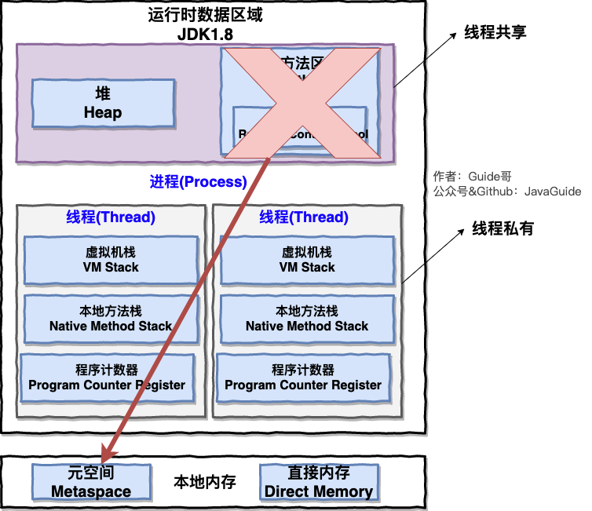

> 摘要：Java高级之JVM虚拟机，包括类加载机制，创建对象，内存分配机制，GC垃圾回收，JVM调优等。

<!-- more -->

## JVM虚拟机

### main方法的执行步骤

```
Student stu = new Student("Tom") 
stu.sayName();
```

1）字节码执行机制
- 编译 App.java 得到 App.class

2）类加载机制
- 加载 App 类：系统启动一个 JVM 进程，从 classpath 路径中查找 App.class，将 App 的类信息加载到方法区
- 找到 App 类中的主程序入口，执行 main()
- 检查是否已加载 Student 类：通过在常量池中定位**类的符号引用**
- 若无则加载 Student 类：加载类信息到方法区

3）new 创建 student 对象
- 变量 stu 放在局部变量表中，字面量"Tom"放在方法区
- 内存分配机制（GC）：在堆中为 Student 对象分配内存，并将引用赋给变量 stu；
- 构造器初始化 Student 对象，（有**指向方法区中 Student 类的类型信息**的引用）
- 根据 stu 引用找到 Student 对象，获得 sayName() 的字节码地址，执行sayName()

### 字节码执行机制

字节码：JVM 可理解的代码（即扩展名为 .class 的文件）

JVM：JIT 即时编译/运行时编译；先编译，后解释，编译与解释共存
JVM VS 传统解释型语言：
1. 一定程度上解决缺点：执行效率低；
2. 保留优点：可移植

Java程序运行过程：
->源文件(.java）
->Javac编译器->Java字节码文件（.class）
->JVM->特定系统可执行的二进制机器码
（
->Class Loader 加载.class文件
->Execution Engine 通过解释器逐行解释执行
->Runtime Data Area（运行时数据区，即常说的JVM内存）
）

##### Class 文件的字节码结构

1. 魔数: 确定此文件能否被虚拟机接收。
2. Class 文件主版本号和次版本号
3. 常量池 ：存放字面量和符号引用。
4. 访问标志 ：用于识别一些类或接口层次的访问信息（修饰符），包括：是类还是接口，是否为 public 或 abstract 类型，是否声明为 final 等。
5. 当前类索引、父类索引 ：用于确定当前类和父类的全限定名
6. 接口索引集合 ：用来描述类实现的接口
7. 字段表集合 ：描述接口或类中声明的变量。包括类级变量及实例变量，但不包括在方法内部声明的局部变量。
8. 方法表集合 ：类中的方法。
9. 属性表集合 ：

### 类加载机制

##### 类加载步骤

根据（常量池中的）动态链接定位**类的符号引用**，检查当前类是否已被加载：
1. 已被加载的类直接返回；
2. 否则尝试加载类

1）加载：
a. 将class文件加载到内存；
b. 将静态存储结构转换成方法区中的运行时数据结构；
c. 在（堆）内存中生成类的 Class 对象，作为方法区数据的访问入口；

2）连接：

a. 验证：确保文件格式、字节码结构等符合 JVM 安全规范；

b. 准备：为static成员变量（在方法区）分配内存，并设置0值；

c. 解析：将（常量池内的）符号引用替换为直接引用；

3）初始化：执行构造器，初始化成员变量和真正初始化static成员变量。

```
public static int i =3 ;

//第一次初始化后i的值为0，
//第二次初始化后值才为3.
```

4）使用
5）卸载：GC将无用对象从内存中卸载

##### 双亲委派模型

类加载器收到类加载请求后：

1. 首先判断当前类是否被加载过，已被加载的类会直接返回；检查顺序：CustomClassLoader->AppClassLoader->ExtensionClassLoader->BootstrapClassLoader

2. 若未被加载：
- 自底向上委派：加载未知类时，首先委派给父类加载器；
- 自顶向下查找：当父类加载器无法处理时，才由自己来处理；

加载类顺序：BootstrapClassLoader->ExtensionClassLoader->AppClassLoader->CustomClassLoader

- 如果都没有加载此类，则抛出ClassNotFoundException异常

=>不同层次的类加载器有不同优先级
=>可避免重复加载类
=>保证核心API不被修改。

##### 常用类加载器

ClassLoader：用来动态加载（按需加载）class文件到 JVM 内存（负责将 Class 的字节码形式=>内存形式的 Class 对象）

1. Bootstrap ClassLoader：最顶层的启动类加载器，由 C++实现，随JVM启动，负责加载 JDK中的核心类库（%JAVA_HOME%/lib目录下的 jar 包和类）和构造另二个ClassLoader；
2. Extension ClassLoader：负责加载 JVM 扩展类库（ %JRE_HOME%/lib/ext 目录下的 jar 包和类，通常以 javax 开头）；
3. Application ClassLoader：面向用户的加载器，负责加载 当前classpath 路径下的 jar 包和类。
4. UserDefinedClassLoader：

JVM搜索类时判断两个class是相同的，要同时满足以下二者：
1. 两个类名相同（同一份class字节码）；
2. 由同一个类加载器加载。

对于equals()、isinstanceof()等方法来判断对象的相等或所属关系都是需要基于同一个ClassLoader。

##### 创建对象

类的实例化过程：
- 先静态、先父后子。
- 按在代码中出现的顺序依次执行
加载类：
1. 父类静态成员变量？、静态初始化块/静态代码块（只执行一次）
2. 子类静态成员、静态初始化块
创建对象：
3. 父类实例成员、实例初始化块
4. 父类构造器
5. 子类实例成员、实例初始化块
6. 子类构造器
7. 普通代码块

创建对象的步骤：
1. 类加载：JVM遇到一条 new 指令时，执行类加载，完成后可确定所需内存大小。
2. （为新对象在堆中）分配内存，（若内存不够则先执行GC）方式有：
- 堆内存规整（没有内存碎片）->标记-整理算法：指针碰撞
- 堆内存不规整->标记-清除算法：空闲列表
3. 将成员变量初始化为0值；
4. 设置对象头；
5. 执行 init 方法：初始化成员变量，执行实例化代码块，调用类的构造方法，并把堆内对象的首地址赋值给（vm栈中的）引用变量。

对象在堆内存的存储布局：

1. 对象头：主要包含：
- MarkWord：存储哈希码、分代年龄、（锁状态标志位、）线程持有的（轻/重量级）锁、偏向锁线程ID等信息。
- 存储类型指针：指向类的元数据指针，确定对象是属于哪个类的实例。数组长度。

2. 实例数据：存储代码中所定义的各种类型的字段信息。

3. 对齐填充：起占位作用。HotSpot 虚拟机要求对象的起始地址必须是8的整数倍，因此需要对齐填充。

```
String str = new String("hello");
//变量str放在VM栈上的局部变量表中
//用new创建出来的字符串对象放在堆中
//而"hello"这个字面量放在方法区
```

### JVM 内存分配机制



栈负责运行代码，存放局部变量；堆负责存储数据（对象等）。
自动内存管理：最核心的是堆内存中对象的分配与回收。

JVM 运行时数据区（RunTime Data Area）/内存空间，分为两种类型：
1. 线程私有：生命周期与线程相同, 依赖用户线程（而创建/销毁）；包括程序计数器、虚拟机栈、本地方法栈；
2. 所有线程共享：生命周期与 JVM 相同，随JVM的启动/关闭（而创建/销毁）；包括堆、方法区。

1. 程序计数器：表示当前线程所执行字节码的行号指示器：
- Java方法中：存储的是（下一条？）字节码指令（在方法区）的地址；
- native方法中：undefined；
唯一没有OOM（内存溢出）和StackOverflowError的内存区域；由字节码执行引擎负责修改。

2. Java虚拟机栈：是描述Java方法执行的内存模型；方法从开始调用到执行完成，就是栈帧从入栈到出栈的过程。每个 Java 方法在执行的同时会创建一个栈帧用于存储：
- 1. 局部变量表：存放编译期可知的数据类型（如方法参数和局部变量）：
 a. 对于基本数据类型的变量，直接存值；
 b. 对于引用类型的变量，存的是指向对象的引用
- 2. 操作数栈
- 3. 动态链接：（符号引用）指向当前方法（所属类？）在运行时常量池中的引用；
- 4. 方法出口（返回地址）等

易出的错误：
- StackOverFlowError（VM栈的内存大小不允许动态扩展）：线程请求栈的深度>当前VM栈的最大深度；（栈帧中的局部变量过多时；常出现在递归、循环调用中）
- OutOfMemoryError（VM栈的内存大小允许动态扩展）：（堆中没有空闲内存，且GC也无法提供更多内存->）无法申请到内存时抛出；一直申请内存导致堆内存耗尽？

3. 本地方法栈：为VM用到的 Native 方法服务，其它与VM栈一致

4. 堆：是 JVM 所管理的内存中最大的一块，在 JVM 中只有一个堆；存储对象本身（由new和构造器创建）及数组本身，但引用在VM栈的局部变量表中；GC主要管理的对象；

- 内存空间/物理上可不连续，但逻辑上应连续；

- 字符串常量池：保存 String 对象实例本身，供运行时常量池引用；在JDK6.0及之前版本，在方法区中，在JDK7.0版本，被移到堆中

- 在1.8以前，静态成员变量存在方法区/永久代，在1.8后，由于JDK8取消永生代，静态变量存储到了堆中。

易出的错误：
- OutOfMemoryError: GC Overhead Limit Exceeded: GC 时间长，但只回收了很少的堆空间
- OutOfMemoryError: Java heap space: 堆内存不足以存放新创建的对象

本地内存： 
5. 方法区（JDK1.8->元空间），用于存放（编译器生成的）：
- 1. 类信息；
- 2. 常量；
- 3. 静态变量；
- 4. 即时编译器编译后的代码等。

HotSpot VM 把 GC 分代收集扩展至方法区, 即用堆的永久代来实现方法区（对方法区/永久代内存回收的主要目标是：对常量池的回收和对类型的卸载）

- class文件信息
- - 类信息：魔数、版本号等；
- - （class文件中的）常量池：
- - - 保存字面量（1.文本字符串"hello"、2.final常量值、3.基本数据类型的值23等）
- - - 和类的符号引用（1.类的完全限定名、2.字段名和描述符、3.方法名和描述符）。       

当class文件加载完，JVM会将class文件常量池里的内容转移到运行时常量池，部分符号引用会解析为直接引用，如类的静态方法或私有方法，实例构造方法，父类方法（因为这些方法不能被重写），而其他方法在第一次调用时才转变。

- 运行时常量池：存放字面量和直接引用

易出的错误：
- OutOfMemoryError

另外，
6. 直接内存/堆外内存：并不是 JVM 运行时数据区的一部分，由OS管理；JDK 1.4 引入的 NIO 提供了基于Channel与 Buffer的IO方式, 可用Native函数库直接分配堆外内存, 用DirectByteBuffer 对象作为这块内存的引用进行操作, 避免了在 Java堆和 Native 堆中来回复制数据。


### GC垃圾回收

##### 引用类型

1. 强引用：当内存不足时，JVM宁可出现 OutOfMemoryError 也不回收，和 GC Roots 断绝关系时才回收（如显式地将引用置为null）；普通的对象引用关系，如 String s = new String("Const")；
2. 软引用：当内存不足时回收，如果回收后仍内存不足，抛出内存溢出异常；由SoftReference 类创建；用于维护一些可有可无的对象，常用于高速缓存中，如 mybatis、浏览器的后退按钮；
3. 弱引用：下一次GC时回收，由WeakReference 类创建；
4. 虚引用：跟没有一样，形同虚设

##### 如何判断可被回收

1）废弃常量（被运行时常量池回收）：没有被任何对象引用

2）无用类（被方法区卸载/回收）：需同时满足
1. 类的所有实例都已被回收；
2. 加载类的 ClassLoader 已被回收；
3. 类对应的 Class 对象没有任何引用，无法通过反射访问该类的方法。

3）已死亡对象（被堆回收）：
- 没被引用的/超过作用域的对象；
- 引用被置为null在下一次GC回收

- ~~引用计数器法~~：一个对象没有任何关联引用时回收；无法解决对象循环引用；
- 可达性分析法：搜索引用链，基本思想是将GC Roots对象作为起始的存活对象集，向下搜索走过的路径（引用链/可达路径），
1. 把能被该集合引用的对象递归加入到集合中（移动到S0）；
2. 不能被引用（即对象到GC Roots没有任何引用链/该对象是不可达的）；二次标记后还没成功逃脱，只能被回收。

可作为GC Roots的对象：
1. 虚拟机栈和本地方法栈(局部变量表)中引用的对象；
2. 方法区中类的静态变量引用的对象；
3. 方法区中运行时常量池/常量引用的对象。

##### 回收策略

1. Mark-Sweep（标记-清除）算法：维护空闲列表，记录可用内存，标记结束后统一回收；易产生内存碎片；
2. Copying（复制）算法：将可用内存按容量划分为大小相等的两块，当一块内存用完后，将存活的对象移动到另一块，交换指针，清理已用内存；可用内存减为原来的一半，如果存活对象很多，效率会降低；
3. Mark-Compact（标记-整理）算法：指针碰撞，将存活对象都向一端移动，清除边界外的；
4. 分代回收算法：核心思想是根据**对象存活的生命周期**将内存划分为若干个区域。JDK8后：
- 新生代：复制算法，分为一块较大的 Eden 伊甸空间和两块较小的From Survivor0和To Survivor1空间（8：1：1）；
a. 对象优先分配在Eden；
b. Eden满，Minor GC，将存活对象移动到S0，年龄默认为1；
c. S0满，Minor GC，将存活对象移动到S1，年龄+1；
- 老年代：标记-清除或标记-整理算法
a. 长期存活的对象（S1中年龄增加到一定阈值如 15）或S1被填满，会被移动到老年代；
b. 大对象（需大量连续存储空间，最常见的是大数组）直接分配到老年代；
c. 老年代满触发Major/Full GC，清理新生代？和老年代，仍无法存储对象则抛出OOM
- 元空间（永久代）都不在GC范围内

##### GC常见调优参数

- -Xms/-Xmx：设置堆的最小/最大容量
- -XX:NewSize/MaxNewSize：新生代最小/最大值
- XX:PermSize/MaxPermSize：老年代最小/最大值
- -XX:NewRatio 新生代和老生代占比
- -XX:SurvivorRatio：Eden/Survivor

```
　　byte[] data = new byte[4*1024*1024]
```

##### 常见的垃圾回收器

1. Serial串行收集器：单线程，工作时必须暂停其他所有的工作线程，直到它收集结束。新生代用复制算法，老年代用标记-整理算法。简单而高效

2. ParNew 收集器：Serial 收集器的多线程版本

3. Parallel Scavenge并行收集器：注重吞吐量（高效率的利用 CPU）

4. CMS垃圾收集器：并发，以获取最短回收停顿时间为目标；
1、初始标记：暂停其他线程，标记与GC roots直接关联的对象；
2、并发标记：可达性分析过程；
3、重新标记/并发预处理：查找执行并发标记阶段从年轻代晋升到老年代的对象，重新标记，暂停虚拟机，扫描CMS堆中剩余对象。
4、并发清除：清理垃圾对象；
5、并发重置：重置CMS收集器的数据结构。

5. G1垃圾收集器：面向多CPU及大容量内存的服务器，相比于 CMS 的改进：
-  把堆划分成多个大小相等的独立区域（Region），可单独进行垃圾回收；
- 基于标记-整理算法，不产生内存碎片；
- 精确控制停顿时间，在不牺牲吞吐量前提下，实现低停顿垃圾回收。

1、初始标记
2、并发标记
3、最终标记：对并发标记过程中，用户线程修改的对象再次标记一下。
4、筛选回收：对各个Region的回收价值和成本进行排序，根据用户期望的GC停顿时间制定回收计划并回收。

##### GC日志分析

### JVM调优

##### JVM内存泄漏/性能监控与故障定位

- 内存溢出（OutOfMemory）：申请不到；指程序在申请内存时，没有足够的内存空间供其使用。
- 内存泄露（Memory Leak）：释放不了；指程序在申请内存后，无法释放已申请的内存空间；最终将导致内存溢出。

内存溢出的原因：
1. 内存泄露导致堆栈内存不断增大；
2. 加载过多jar、class文件；
3. 操作过多对象（如死循环/循环产生重复的对象实例）导致堆内存已满；
4. nio直接操作内存，内存过大
5. 设置参数过小

##### 调优工具

目的：减少GC（STW）

1. top
2. Java VisualVM：（jvisualvm） 提供运行监视和故障处理
3. 阿里巴巴arthas

常见的调优命令：

- jps (JVM Process Status）: 类似 UNIX 的 ps 命令。用户查看所有 Java 进程的启动类、传入参数和 Java 虚拟机参数等信息；
- jstat（ JVM Statistics Monitoring Tool）: 用于收集 HotSpot 虚拟机各方面的运行数据;
- jinfo (Configuration Info for Java) : Configuration Info forJava,显示虚拟机配置信息;
- jmap (Memory Map for Java) :生成堆转储快照;
- jhat (JVM Heap Dump Browser ) : 用于分析 heapdump 文件，它会建立一个 HTTP/HTML 服务器，让用户可以在浏览器上查看分析结果;
- jstack (Stack Trace for Java):生成虚拟机当前时刻的线程快照（当前虚拟机内每一条线程正在执行的方法堆栈的集合）。

### Java 内存模型（JMM）与并发
