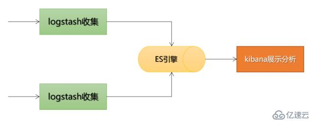

摘要：Spring 框架，包括 IoC 和 DI，Bean，AOP，设计模式，事务等；Spring MVC，包括 MVC、Java Web；Spring Boot，包括配置、自动装配、数据库、整合 Web、日志等；Spring Boot 整合 MyBatis、Security等。

<!-- more -->

---

## Spring

[Spring常见问题总结](https://github.com/Snailclimb/JavaGuide/blob/main/docs/system-design/framework/spring/spring-knowledge-and-questions-summary.md)

### Spring 概述

Spring 是轻量级的开源 J2EE（容器）框架和中间层框架（万能胶）。

##### 优点

1. **非侵入式**：对象可不依赖于 Spring 的 API；（不改变现有的类结构，就能增强 Java Bean 的功能，Struts2 等传统框架常要实现特定接口、继承特定类才能增强功能，改变了 Java 类的结构）；
2. **方便集成各种优秀框架**：支持 Struts2、Hibernate、MyBatis 等；
   - 为 JavaEE 开发中一些 API（JDBC、JavaMail、远程调用等）提供了封装；
3. 支持**WEB 框架**：[MVC 设计模式](#MVC 设计模式)；
4. 支持与代码松耦合：（IoC 解耦）用 **IoC 容器**管理对象的生命周期和配置；对象发生改变，只需在配置文件中修改，而无须修改 Java 代码；
6. 支持**AOP**：面向切面编程；
7. 事务管理：提供一个持续的事务管理接口，可扩展到上至本地事务下至全局事务（JTA）；
   - **支持声明式事务**：只通过配置就可完成事务管理，无须手动编程。
8. 对**单元测试**支持比较好：框架中包含测试环境；支持 JUnit4，可用注解方便地测试。

##### Spring Framework 八大模块

1. Data Access/Integration 数据访问/集成
    - JDBC
    - ORM：提供对象-关系映射框架的集成 API，包括 JPA、JDO、Hibernate 和 MyBatis 等。
    - ~~OXM：提供了一个支持 Object/XML 映射的抽象层实现（Java 对象和 XML 数据间的映射），如 JAXB、Castor、XMLBeans、JiBX 和 XStream。~~
    - JMS：Java 消息服务。
    - TX 事务
2. Web
	- Web-MVC
3. Core Container 核心容器：
    - Beans 模块：包括 IoC 和 DI
    - Core 模块
    - Context 上下文模块：ApplicationContext 接口
    - SpEL（Spring Express Language）表达式

4. AOP
5. ~~Aspects：支持 AspectJ 的集成~~
6. ~~Instrumentation~~
7. ~~Messaging~~ 
8. Test：支持 Junit 和 TestNG 测试框架，模拟 Http 请求的功能。

### IoC 设计思想

##### IoC 和 DI

在传统的 Java 应用中，一个类（调用者）想要调用（依赖）另一个类（被调用者）的成员变量或成员方法，通常会先通过 `new Object()` 创建对象。

1. IoC（`Inversion of Control`，控制反转）：new/创建对象的控制权，由开发者手动创建转移（反转）给（第三方） `IoC` 容器管理。
2. DI（`Dependency Injection`，依赖注入）：通过 `IoC` 容器**管理对象间的依赖**，容器在创建对象时，（根据依赖关系）将它依赖的对象自动注入当前对象（~~可引用依赖的对象~~）。

二者含义相同，是从两个角度描述的同一概念。

##### IoC 工作原理

IoC 底层通过工厂模式、XML 解析、Java 的反射机制等技术，降低代码耦合度，主要步骤有：

1. [工厂模式](#Spring 框架中的设计模式)：可把 **IoC 容器**当做一个**工厂**，产品就是 Spring Bean；
   - [IoC 容器的两种实现](#IoC 容器)：通过 `BeanFactory`、`ApplicationContext` 接口创建 Bean 对象；
2. XML 解析：在配置文件（如 Bean.xml）中，配置各个对象及对象间的依赖关系，容器启动时会加载并**解析**；
   - 与代码**松耦合**、IoC 解耦原理：对象发生改变，只需在配置文件中修改，而无须修改 Java 代码；
3. IoC 利用 **Java 的反射机制**：根据类名生成相应的对象，并根据依赖关系将此对象注入到依赖它的对象中。

工厂方法：分为无参和有参，静态工厂和实例工厂。

```
// 用静态工厂方法创建Bean
class UserFactory {
    public static UserDao getDao() {
        // xml解析
        String className = class属性值;
        // 通过反射创建对象
        Class clazz = Class.forName(className);
        return (UserDao)clazz.newInstance();
        // return new UserDao();
    }
}
UserDao dao = UserFactory.getDao();
```

##### IoC 容器

IoC 容器：管理（Bean）对象（从创建到销毁的）整个生命周期，管理对象间的依赖及注入。

IoC 容器的两种实现：

1. `BeanFactory` 接口：Spring 内部用；懒加载（获取对象时才创建对象）；简单，占内存少，启动快。最常用 `XmlBeanFactory` 类实现接口。

   ```
   import  org.springframework.beans.factory.BeanFactory;
   
   Resource res = new ClassPathResource("appContext.xml"); 
   BeanFactory fact = new XmlBeanFactory(res); 
   
   Student stu = (Student) fact.getBean("student");
   stu.getMsg();
   ```

2. `ApplicationContext` 接口：面向开发者，用的更多；继承并扩展 `BeanFactory`，功能更完整；即时加载（加载配置文件时创建并初始化**所有对象**）；不管用没用到，容器启动时**一次性**创建所有 Bean ；

    1. `ClassPathXmlApplicationContext`：从 `classpath` 加载配置文件，更常用；
    2. `FileSystemXmlApplicationContext`：从指定位置加载配置文件，不常用；
    3. `XmlWebApplicationContext`：从Web系统中的 XML 文件加载配置文件。
    
    ```
    BeanFactory beanFactory = new ClassPathXmlApplicationContext("beans.xml");
    ```

二者都是通过 XML 配置文件加载 Bean 的，通常用后者，只有在系统资源较少时，才考虑用 `BeanFactory`。主要区别在于 Bean 的某一属性**没有注入**时：

1. `BeanFacotry` 加载后，第一次调用 getBean() 会抛出异常；
2. `ApplicationContext` 在初始化时就自动检测所依赖的属性是否注入。

##### 依赖注入的方式

依赖注入本质上是 Spring Bean 属性注入的一种，只不过这个属性是一个对象。

### Spring Bean 定义

Bean：由 IoC 容器创建并管理的对象。

##### Bean 属性注入的方式

1. 构造器注入：XML 配置文件中，用 `<constructor-arg>` 标签给构造方法的参数赋值；
   - 缺点：没有部分注入；任意修改都会创建一个新实例；
2. `setter()` 注入：通过调用默认无参构造器或无参 static 工厂方法，实例化 Bean 对象，并调用 setXxx() 设置`<property>`属性；
   - 缺点：会覆盖 setter 属性；适用于设置少量属性。
3. 接口注入/工厂方法；
4. 短命名空间注入：
   1. c：`<bean>` 中嵌套的 `<contructor>` 元素，构造器注入的优化；
   2. p：`<bean>` 中嵌套的 `<property>` 元素，setter() 注入的优化；
5. 泛型注入
6. ~~基于Groovy DSL 配置（很少见）~~

##### 基于 XML 配置文件的属性注入

配置文件：描述如何创建对象和哪些组件需要哪些服务。用于定义 Bean 的属性值、作用域、依赖关系。

格式有：

1. `Properties` 配置文件：key-value 形式，只能赋值，不能进行其他操作；用于简单的属性配置。
2. `XML` 配置文件：树形结构清晰灵活，内容繁琐，用于大型复杂的项目。
   - `<bean>`的常用属性：见下；
     - `ref`：用于注入已定义好的 Bean；
     - `autowire` 属性：设置[自动装配的规则](#自动装配的五种规则)；
   - `<bean>`的其它属性：
     -  `parent` 属性：指定继承的父 Bean。
     - 指定 `abstarct="true"` 而不指定 class 属性，表示为 Bean 定义模板（抽象类？），只能被继承，不能被实例化。
     - `value`：用于注入基本数据类型及字符串类型的值；
     - `type`：用来指定对应的构造函数；
     - `index`：指定参数位置；
   - `<property>`：给属性注入值，name 的名称取决于 setXxx() 后的参数；
```
// Beans.xml
<beans>
    // bean 标签: 要创建的对象，默认执行无参构造器
    // id: Bean 的唯一标识符
    // class: Bean的实现类，指定从 package 到 class name 的完全限定名
    // name: 
    // scope: Bean 的作用域
    <bean id="user" class="com.spring5.User" name="" scope="">
        <--! 1. 用（有参）构造器注入属性-->
        <constructor-arg name="oname" index=0 type="" value="China">
        </constructor-arg>
        
        <--! 2. 用set方法注入属性，通过property标签实现属性注入-->
        // 注入8大基本数据类类 + String
        <property name="bname" value="java"></property>
        // 注入外部bean属性
        <property name="userDao" ref="userDaoImpl"></property>
        // 注入集合，创建类，定义数组、List、Set、Map属性，生成set方法
        <property name="courses">
            // 注入数组类型属性
            // 注入List集合属性
            <list>
                <value>java</value>
            </list>
            // 注入Map属性
            // 在集合里设置对象类型的值
        </property>
    </bean>
</beans>

// 类中
public Orders(String oname) {
    this.oname = oname;
}
```

##### Bean 作用域

Bean 作用域：指 Spring IoC 容器创建的 Bean 对象相对于其他 Bean 的请求可见范围。在装配 Bean 时就必须指明，可通过 XML 或注解方式配置。

```
1. XML 方式：
<bean id="" class="" scope="singleton"></bean>

2. 注解方式：
@Bean
//@Scope("singleton")
@Scope(value = ConfigurableBeanFactory.SCOPE_PROTOTYPE)
public Person personPrototype() {
    return new Person();
}
```

**基本作用域**：

1. `singleton`：单例模式，默认值，在整个Spring IoC 容器中只有一个**共享**的 Bean 实例，由 BeanFactory 维护。一旦创建成功，**可重复使用**。存储在高速缓存中，用于**无会话状态**的 Bean（如 DAO 层、Service 层）。
2. `prototype`：原型模式，每次获取 Bean 时，容器都会创建一个新的 Bean 实例；创建成功后不再跟踪和维护 Bean 实例的状态。用于需保持会话状态的 Bean（如 Struts2 的 Action 类）。

**Web 作用域**：只能在 Web 环境（`XmlWebApplicationContext`）下用，如果用 `ClassPathXmlApplicationContext` 加载这些作用域中的任意一个的 Bean，会抛出异常。

1. `request`：每次 HTTP request 请求都会产生一个新的（不同的）Bean 实例，仅在当前 request 内有效（在请求完成后，Bean 会被 **GC** 回收）。
2. `session`：每个 HTTP Session 会产生一个新的 Bean，仅在当前 session 内有效。同一个 Session 共享一个 Bean 实例。
3. ~~`global-session`~~：每个全局的 HTTP Session、用 session 定义的 Bean 都将产生一个新实例。典型情况下，仅在用 portlet context 时有效。
4. `application`：类似于 singleton，同一个 **Web 应用**（可能有多个 IoC 容器）共享一个 Bean 实例。
5. ~~`websocket`~~：作用域是 WebSocket。

##### Bean 生命周期


spring bean 在初始化和销毁时可触发自定义回调操作。

1. 实例化 Bean 对象（3步）；
2. 初始化 Bean 对象（4步）；
   1. ~~初始化顺序：类构造器 > `@PostConstruct` > `InitializingBean` > `init-method`~~
   2. ~~初始化时实现的方法：~~
      1. 通过 Java 提供的 `@PostConstruct` 注解；
      2. 通过实现 Spring 提供的 `InitializingBean` 接口，并重写其 `afterPropertiesSet()` 方法；
      3. 通过 Spring 的 xml bean 配置或 bean 注解指定初始化方法，如自定义 `initMethod`方法通过 `@Bean` 注解指定。
3. 销毁 Bean 对象（4步）；
   1. ~~销毁顺序：`@PreDestroy` > `DisposableBean` 接口> `destroyMethod`~~
   2. ~~销毁时实现的方法：~~
      1. 通过 Java 提供的 `@PreDestroy` 注释；
      2. 通过实现 spring 提供的 `DisposableBean` 接口，并重写其 `destroy` 方法；
      3. 通过 spring 的 xml bean 配置或 bean 注解指定销毁方法，如下面实例的 `destroyMethod` 方法通过 `@bean` 注解指定。

##### 同名 Bean 的优先级

1. 同一个配置文件内，以最早定义的为准；
2. 不同配置文件中，后解析的配置文件会覆盖先解析的；
3. 同文件中 `@Bean`的优先级（最先注册）> `@ComponentScan`；

### Bean 自动装配

Bean 装配/依赖注入（**装配方式即依赖注入方式**）：在 IoC 容器中，Bean 与 Bean 间建立依赖关系。

1. 手动装配 Bean：XML 配置文件中，通过 `<constructor-arg>`和 `<property>` 中的 `ref` 属性，手动维护 Bean 间的依赖关系。
2. 自动装配 Bean：Spring 容器依据规则，为指定的 Bean 从应用的上下文（AppplicationContext 容器）中查找所依赖的 Bean，并自动建立 Bean 间的依赖关系。
   1. 基于 XML 配置文件自动装配 Bean；
   2. 基于注解装配 Bean；

如何解决循环依赖：

1. 构造器的：直接抛出 `BeanCurrentlylnCreationException` 异常。 
2. 单例模式下的 `setter`（默认的单例 Bean 中，属性互相引用）：通过三级缓存处理。 
3. 非单例：无法处理。

##### 自动装配的五种规则

```
<!-- 通过 autowire 属性设置自动装配的规则-->
<bean id="employee" class="net.bian.Employee" autowire="byName" ref="">
```

1. `no`：默认设置，表示不用自动装配，必须通过 `ref` 属性设置依赖的 Bean。
2. `byName`：根据 Bean 中 `<Property>` 的 `name` 属性（查找对应的 Bean）自动装配/注入对象依赖。
3. `byType`：根据 Property 兼容的**数据类型**自动装配。
4. `constructor`：类似 byType，根据**构造方法参数**的数据类型，进行 `byType` 模式的自动装配。
5. `autodetect`：如果 Bean 中有默认的构造方法，则用 `constructor` 模式，否则用 `byType` 模式。

##### 基于 XML 自动装配Bean

`applicationContext.xml` 配置文件

1. 根据名字装配；
2. 根据类型装配；

局限：
1. 用 `<constructor-arg>` 和 `<property>` 设置指定依赖项，将覆盖自动装配；
2. 基本元数据类型（简单属性，如原数据类型、字符串和类）无法自动装配；
3. 不精确。

##### 声明 Bean 的注解

Spring Boot 彻底抛弃了 XML 配置，推荐基于 Java API 配置 Bean，在 Java 类中用注解设置依赖关系。

```
// Spring 配置文件（xml或properties）中启用注解装配
<beans>
	<context:annotation-config/>
</beans>
```

常用注解：

1. `@Component`：通用的注解，可标注**任意类**为 `Spring` 组件（Java Bean 对象），并添加到容器中。用于不知道属于哪层的 Bean。同 `@Name`，较少用。
2. `@Bean`：替代 `<bean />` 元素；将该方法**返回的 Bean 对象**加载到 Spring 容器；可用 name 属性自定义，默认为方法名。
3. `@Repository`：用于 Dao（数据持久化）层，数据库相关操作。
4. `@Service`： 用于 Service（业务逻辑）层，主要涉及一些复杂的逻辑，需用到 Dao 层。
5. `@Controller`：用于控制层，接受用户请求并调用 Service 层返回数据给前端页面。

`@Component` VS `@Bean`

1. 位置：`@Component` 注解作用于类，而 `@Bean` 作用于方法。
2. 作用对象：`@Component` （常通过类路径扫描来）自动装配**当前类的对象**到容器；`@Bean` 将该方法返回的对象加载到 Spring 容器。
3. `@Bean` 自定义性更强，多处只能用 @Bean 来注册 Bean。如引用第三方库中的类需装配到 Spring 容器时。

##### 基于注解装配 Bean

1. `@Autowired`：用于 setter()、构造函数或字段上。步骤：
     1. 默认用 `byType` 的方式自动注入 Bean 到（同样被 Spring 容器管理的）当前 Bean 中（即自动导入对象到类中），如：Service 类注入到 Controller 类中；
     2. 同一个实体类有多个实现类（配置多个 Bean）时**类型相同**，IOC 不知该注入哪个实现类，这时改为 `byName` 的方式注入，默认根据标注的成员变量名作为 id，查找 Bean，进行装配；
     3. 仍失败，则通过 `@Qualifiler` 指明目标 Bean 的 id（变量名）；
     4. 检查属性是否正常装配（设置），无法找到匹配的 Bean 装配会抛出异常；设置 `required=false` 允许属性不被设置，则不抛出异常。
     5. [@Autowired注解使用的自动装配方式](https://blog.csdn.net/weixin_44296929/article/details/109527112)
2. `@Resource`：默认（指定值）是 `byName`，找不到与名称匹配的 Bean（或该属性为空、不指定值）时用 `byType`，自动用标注处的变量或方法名作为 Bean 名；相同类型在 IOC 容器中只能有一个。
3. `@Qualifier("userDAO")`：限定要自动注入的 Bean 的 id，一般和 `@Autowired` 联用，指定 Bean的名称。

`@Controller` VS `@ResposeBody` VS `@RestController`

1. `@Controller`：单独使用（不加 `@ResponseBody`）返回一个视图/页面，用于（传统 Spring MVC）前后端不分离的情况。
   - 若扫描该类下有 `@RequestMapping` 方法，根据注解信息生成对应的处理器对象。

2. `@ResponseBody`：将 Controller 返回的对象转换为指定格式，并写入 HTTP 响应对象的响应 body 中，常用来返回 JSON（较多）或 XML 数据。
3. `@RestController` = `@Controller` + `@ResponseBody`：表示 REST 风格的控制器 Bean。返回 JSON 或 XML 格式（由客户端的 ACCEPT 请求头决定）的对象数据，并直接写入 HTTP 响应体中。属于 RESTful Web/API服务，最常用的前后端分离框架的情况。
   - ~~无需用 `@ResponseBody` 注解每个方法。~~
### AOP

AOP（面向切面编程）：将与业务无关却被业务模块所共同调用的逻辑（交叉业务逻辑，如事务处理、日志管理、权限控制等）封装成切面。主要作用是通过不修改源码的方式、将非核心功能代码织入来实现对方法的增强。

通过预编译方式和运行期动态代理实现程序功能的统一维护。可对业务逻辑的各部分进行隔离，从而降低耦合度，提高程序的可重用性。

##### AOP 实现原理

基于代理模式，主要分为两种方式：

1. AspectJ AOP 基于**静态代理**/编译时增强；
2. Spring AOP 基于**动态代理**/运行时增强；

[AOP 实现原理代码示例](https://www.cnblogs.com/xuwc/p/13889490.html) 

##### AspectJ AOP

1. 基于 XML 的**声明式** AspectJ / 开发AOP：指通过 Spring 配置文件定义切面、切入点及通知，都必须定义在 `<aop:config>` 元素（将定义好的 Bean 转换为切面 Bean）中。在 XML 文件中添加`<aop:aspectj-autoproxy>` 启用 `@AspectJ`。

2. 基于注解的声明式 AspectJ：启用 `@AspectJ` 注解有以下两种方法：
   
    1. 用 `@Configuration` 和 `@EnableAspectJAutoProxy` 注解；
    
       ```
       @Configuration
       @EnableAspectJAutoProxy
       public class Appconfig {}
       ```
    
    2. 
    

##### 代理工厂（静态方法）

1. 把 AOP 加入 IOC 容器中；
2. 把 UserDao 放入容器中；
3. 在配置文件中开启注解扫描，用工厂静态方法来创建代理类对象。

##### 通知

通知（Advice）：描述了切面要完成的工作及何时执行。如，日志切面需在接口调用前后分别记录当前时间，取差值计算调用时长。

- `@Aspect`：用于定义切面；切面是通知和切点的结合，定义了何时、何地应用通知功能。

- `@Pointcut`：切点，定义切点表达式，指定了通知被应用的范围。如，日志切面的应用范围是所有 Controller 层的接口方法。格式：

  ```
  // execution(方法修饰符 返回类型 方法所属的包.类名.方法名称(方法参数)
  @Pointcut("execution(public * com.macro.mall.controller.*.*(..))||execution(public * com.macro.mall.*.controller.*.*(..))")
  public void webLog() {
  }
  ```

- 连接点（JoinPoint）：通知功能被应用的时机。如，接口方法被调用时就是日志切面的连接点。
- 引入（Introduction）：在无需修改现有类的情况下，向现有类添加新方法或属性。
- 织入（Weaving）：把切面应用到目标对象，并创建新代理对象的过程。

- `@Before`：前置通知，通知方法会在目标方法调用前执行；
- `@After`：后置通知，通知方法会在目标方法返回或抛出异常后执行；
- `@AfterReturning`：返回通知，通知方法会在目标方法返回后执行；
- `@AfterThrowing`：异常通知，通知方法会在目标方法抛出异常后执行；
- `@Around`：环绕通知，通知方法会将目标方法封装起来；通知包裹了目标方法，在目标方法调用前和后、执行自定义的行为。

创建切面步骤：

1. 添加日志信息封装类 WebLog：用于封装需记录的日志信息，包括操作的描述、时间、消耗时间、url、请求参数和返回结果等信息。
2. 添加切面类 WebLogAspect：定义了一个日志切面，在环绕通知中获取日志需要的信息，并应用到 Controller 层中所有的 public 方法中。

### Spring 框架中的设计模式

1. 工厂模式：[IoC 容器的两种实现](#IoC 容器)：通过 `BeanFactory`、`ApplicationContext` 接口创建 Bean 对象；
2. 单例模式：Bean 默认为单例模式，只有一个实例；Spring 中 Bean 的默认作用域就是 singleton。Spring 可通过 XML 或注解方式[配置 Bean 的作用域](#Bean 作用域)来实现单例。Spring 通过 `ConcurrentHashMap` （线程安全）实现单例注册表的特殊方式实现单例模式。
   1. xml : `<bean id="userService" class="top.UserService" scope="singleton"/>`
   2. 注解：`@Scope(value = "singleton")`
3. 代理模式：AOP 用到 JDK 的动态代理和 CGLIB 字节码生成技术；
4. 适配器/包装器（Wrapper）模式 : 可根据客户的需求动态切换不同的数据源，使接口不兼容的类一起工作。Spring AOP 的增强或通知、Spring MVC 适配 Controller。
6. 装饰者模式：
7. 观察者模式：定义对象间的依赖关系，一个对象发生改变时，所有依赖它的对象都会被动更新。如，事件驱动模型（如每次添加商品时都需重新更新索引，`ApplicationListener` （listener 的实现））。
7. 模板方法：用来解决代码重复的问题。如 `RestTemplate, JmsTemplate, JpaTemplate、jdbcTemplate、hibernateTemplate` 等对数据库操作的类。

### Spring 事务管理

事务管理：按照给定的事务规则来执行提交或回滚操作。

1. 编程式事务：编写代码实现管理事务，难维护；
2. **声明式事务**：分离事务管理和业务逻辑代码，实际是通过 AOP 实现；不需编程，只需通过**在 XML 文件中配置或直接基于注解**实现。实现声明式事务的方式：
   1. 基于XML（`<tx>` 和 `<aop>` 命名空间）的声明式事务管理：推荐，最大特点是与 Spring AOP 结合紧密，可充分利用切点表达式的强大支持，更灵活。
   2. 基于 `@Transactional` 的全注解方式：简化，使用最多。

##### `@Transactional`

- 作用于类：表示该类所有的 public 方法都配置相同的事务属性信息；
- 作用于方法：方法的事务会覆盖类的事务配置信息。

##### 事务传播行为/规则

支持当前事务：

- `PROPAGATION_REQUIRED`：支持当前事务，如果当前没有事务，新建一个事务。最常见。
- `PROPAGATION_SUPPORTS`：支持当前事务，如果当前没有事务，以非事务方式执行。
- `PROPAGATION_MANDATORY`：支持当前事务，如果当前没有事务，抛出异常。

挂起当前事务：

- `PROPAGATION_REQUIRES_NEW`：新建事务，如果当前存在事务，把当前事务挂起。
- `PROPAGATION_NOT_SUPPORTED`：以非事务方式执行操作，如果当前存在事务，把当前事务挂起。
- `PROPAGATION_NEVER`：以非事务方式执行，如果当前存在事务，抛出异常。

嵌套：

- `PROPAGATION_NESTED`：如果当前存在事务，则在嵌套事务内执行。如果当前没有事务，进行与 `PROPAGATION_REQUIRED`类似的操作。

## Spring MVC

是一个基于 MVC 设计模式的轻量级 Web 开发框架，本质上相当于 Servlet，本身是 Spring 框架的一部分。

### MVC 设计模式

Model 1 时代：
1. 数据模型层（Model）：应用程序的主体部分，负责数据逻辑（业务规则）的处理和实现数据操作/存取。
2. 视图层（View）：负责格式化数据并呈现给用户；包括数据展示、用户交互、数据验证、界面设计等功能。
3. 控制层（Controller）：负责接收并转发请求，对请求进行处理后，指定视图并将响应结果发送给客户端。

Model 2 时代，早期 Java Web MVC 开发模式：
1. JavaBean + JSP；
2. JavaBean + JSP + Servlet
    1. Java Bean（Model，即 dao 和 bean）
    2. JSP（View）
    3. Servlet（Controller，可在 JSP 中实现）

Spring MVC 时代：
1. 持久层（Dao 数据库操作 / Entity 实体类 / Model）：可整合 MyBatis、Hibernate 和 JdbcTemplate 等技术。
2. 表现层（View）：提供与 Spring MVC、Struts2 框架的整合。
3. 控制层（Controller）：
4. 业务逻辑层（Service）：处理业务逻辑。处理请求和响应事件，“事件”包括**用户的行为**和**数据的改变**。管理事务和记录日志等。`service + serviceImpl、dao + daoImpl` 。

### Spring MVC VS Structs2

1. Spring MVC 基于方法开发，会将 URL 信息与 Controller 类的某个方法绑定并进行映射，请求参数作为该方法的形参，生成 Handler 对象，只包含一个 method 方法。Struts2 基于类开发，Action 类中所有方法的请求参数都是成员变量，方法越多，类越乱。

2. Spring MVC 支持单例开发模式，而 Struts2 由于只能通过类的成员变量接受参数，无法用单例模式。

### Spring MVC 工作原理/流程说明

1. 把 url 映射到 Controller上：
   1. 客户端（浏览器）发送请求到 DispatcherServlet；
   2. DispatcherServlet 根据请求信息调用 HandlerMapping；
   3. 解析请求到对应的 Handler（即 Controller）；
2. HandlerAdapter 适配器根据 Handler 调用真正的处理器处理请求，并处理相应的业务逻辑；
3. 处理器处理完业务后，会返回一个 `ModelAndView` 对象，Model 是返回的数据对象，View 是逻辑上的 View；ModelAndView 对象返回的方式：
   - `ViewResolver` 会根据逻辑 View 查找实际的 View；
   - `DispaterServlet` 把返回的 Model 传给 View（视图渲染）；
4. 把 View 返回给请求者（浏览器）。

## Spring Boot

### 概述

##### Spring Boot 特点

简化 Spring 项目配置：

1. 部署方便：提供嵌入式 HTTP 服务器，如 [Tomcat](#Tomcat) （作为默认的嵌入式 `Servlet` 容器）、 Jetty、Undertow，可轻松开发和测试 Web 应用程序；直接运行入口函数即可启动项目/作为独立应用程序运行；

2. 管理依赖关系：提供一系列的 `starter` 项目对象模型（POMS）来简化 Maven 配置（引入依赖）；

3. **自动配置**、开箱即用：提供大量默认配置；通过注解和（`@Configuration`）配置类替换传统繁杂的 xml 配置文件，以 JavaBean 形式配置。快速搭建开发环境；

4. 方便集成整合 Spring 生态系统，如 Spring JDBC、Spring ORM、Spring Data、Spring Security 等；

5. 强大的数据库事务管理功能；

6. 项目可打包成 jar 文件，可用`java–jar xx.jar` 命令以 jar 包的形式独立运行；

7. 自带应用监控；

8. 集成 Junit，测试方便；

##### Spring VS Spring Boot

1. Spring：主要功能是依赖注入，用于简化 Java EE 企业应用程序开发；
2. Spring Boot：主要功能是自动配置，用于简化 Spring  开发。
3. Spring MVC： 是一个面向 HTTP 的 Web 应用程序开发框架。

##### POJO 分层领域模型

`POJO`（Plain Ordinary Java Object）: 指只有 setter / getter / toString 的简单类，包括 DO / DTO / BO / VO 等。

1. `DO`（Data/Domain Object）：数据/领域对象，从现实世界中抽象出的有形或无形的业务实体。
2. `PO`（Persistent Object）：持久化对象，与持久层（通常是关系型数据库表）数据结构一 一对应的 POJO 类，通过 DAO 层向上传输数据源对象。
3. `DTO`（Data Transfer Object）：数据传输对象，泛指用于展示层与服务层间的数据传输对象。存放参数类型定义类；
4. `BO`（Business Object）：业务对象，可由 Service 层输出的封装业务逻辑的对象。
5. `VO`（View Object）：视图对象，通常是 Web 向**模板渲染引擎层**传输的对象。用于展示层，把某个指定页面（或组件）的所有数据封装起来。
6. `Query`：数据查询对象，各层接收上层的查询请求。注意超过 2 个参数的查询封装，禁止使用 Map 类传输。

##### SSM 架构

> 至少在项目里做过。介绍项目时，用一个业务流程来说 spring mvc 如何做的。

`Spring + Spring MVC + Mybatis `。

##### Spring Boot 体系结构

1. common：存放通用类，如工具类和通用返回结果。
2. ~~component：存放组件。~~
3. config 层：存放 Java 配置类。
4. **Controler 控制层**：存放控制器，负责接收并转发（原始数据和）请求、调用 service 层处理请求和响应事件，指定视图并将响应结果发送给客户端。用于组织不同层面，路由解析，控制流程，页面访问控制和交互，对外暴露 Rest API 接口。
5. **Service 业务逻辑层**：（用数据访问层提供的接口）处理业务逻辑；~~执行授权和验证~~。处理请求和响应事件，“事件”包括**用户的行为**和**数据的改变**。
   - serviceImpl
6. **DAO 数据访问 / 持久层**：~~将业务对象与数据库行进行相互转换~~。常用`@Mapper`修饰，存放自定义的`Mapper`接口。
7. **DTO 数据传输对象层**：存放自定义的传输对象，如请求参数和返回结果。
   - 面向表现层（界面UI），通过 UI 的需求来定义 DTO；实现了表现层与 Model 间的解耦，表现层不引用 Model。如果开发过程中模型改变了而界面没变，就只需改 Model 而不需去改表现层。要维护 DTO 与 Model 间的映射关系。
8. ~~mbg~~：MyBatis Generator 代码生成器和生成的代码；
  - mapper：生成的 mapper.xml 映射文件；
  - **Entity 实体层 / Model / Bean** ：CRUD，面向业务逻辑层，通过业务来定义 Model。
9. resource
  - **展示层**：负责处理 HTTP 请求，将 JSON 参数转换为对象，对请求进行身份验证并将其传输到业务层。由视图（即前端部分）组成。
  - dao/mapper：mapper.xml 映射文件；
  - application.yml：SpringBoot 配置文件；
  - generatorConfig.xml：配置数据库连接，Mybatis generator 生成 model、mapper 接口及mapper.xml 的路径。

### Spring 配置

##### 配置文件格式

```
// 1. properties 格式
server.port = 8080
// 表示文档间隔
---

// 2. yml 格式
// 不支持 @PropertySource 注解导入配置
// spring-boot-starter-web 或 spring-boot-starter 都集成了 SnakeYAML 库，引用任一个，Spring Boot 都会自动添加库到 classpath 下
server:
	port: 8080
// 以缩进来控制层级关系
// 键值对间必须有空格
// 大小写敏感
// 字符串不需加引号
// 双引号不转义, 单引号转义特殊字符，如"\n"为换行 
```

##### 配置绑定

配置绑定：读取（全局）配置文件中的属性值并绑定到 JavaBean 上，如数据库配置。用于容器中的组件。

1. `@ConfigurationProperties(prefix = "person") `：用在**类名**上，读取配置文件中（以`"person"`为前缀）的所有配置数据，并与此 JavaBean （用`@Component` 等标注）中的所有属性绑定；支持松散语法绑定。

2. `@Value("${url}")`：用在**属性**上，只读取配置文件中的某一个配置，与当前属性绑定；只支持基本数据类型 + String 类型，支持 SpEL 表达式。**不推荐**。与 [Lombok 常用注解](Lombok 常用注解)重名；

  ```
  import org.springframework.beans.factory.annotation.Value;
  @Value("${aliyun.oss.accessKeyId}")
  private String ALIYUN_OSS_ACCESSKEYID;
  ```

3. `@PropertySource(value = "classpath:person.properties")`：读取指定位置的配置文件；如与 Spring Boot 无关的（与 person 相关的）**自定义配置**移动到 `src/main/resources/person.properties`中。不常用。

##### 导入配置文件

1. `@Import`： 允许从另一个 Java/XML 配置文件加载 Bean 定义。
2. `@ImportResource(locations = {"classpath:/beans.xml"})`：用于主启动类上，加载 Spring 配置文件，`src/main/resources/beans.xml`。
3. 推荐用全注解方式加载 Spring 配置：
  - `@Configuration`：定义配置类，相当于 Spring 的配置文件；
  - 配置类内可有一个或多个被 @Bean 注解的方法，~~会被 `AnnotationConfigApplicationContext` 或 `AnnotationConfigWebApplicationContext` 类扫描~~，构建 Bean 定义（相当于 Spring 配置文件中的 `<bean>` 标签），方法的返回值会以组件的形式添加到容器中，组件的 id 就是方法名。
  - 优先级低于 `.properties/.yml` 配置文件。

##### 多环境配置/切换

1. 创建 `application-{profile}.properties` 文件，如：`application-dev.properties` 用于开发环境；
2. 在 `application.properties` 文件中添加 `spring.profiles.active=dev`；

```
// 命令行激活：将 Spring Boot 项目打包成 JAR 文件
// 命令行窗口，跳转到 JAR 文件所在目录，执行以下命令，
// 启动该项目，并激活开发环境的 Profile。
java -jar helloworld-0.0.1-SNAPSHOT.jar  --spring.profiles.active=dev
```

##### 配置文件优先级

Spring Boot 启动时会扫描以下位置的 `application.properties/.yml` 文件，作为默认配置文件。

1. `file:./config/*/`（jar包外的）
2. `file:./config/`
3. `file:./`
4. `classpath:/config/`
5. `classpath:/`

> 注：file: 指当前项目根目录；

优先级：序号越小优先级越高。

1. 根目录下的优先级高于当前项目的类路径下的；
2. 先加载 `config/` 文件夹，子文件高于父文件夹；

3. 相同位置的 .properties 的优先级高于 .yml；
4. 带 `-{profile}` 优先级高于不带的。

加载顺序：

1. 存在相同的配置内容时，高优先级的内容会覆盖低优先级的内容；
2. 存在不同的配置内容时，配置内容取并集。

##### classpath

`classpath`：指当前项目的类路径，常用 `classpath:文件名` 引用 `classpath` 路径下的文件。用来指示 JVM 搜索 `.class` 文件位置的环境变量。

1. 用 maven 构建（build）项目时，默认的 classpath 指向 `target/classes/`；
2. 用 maven 打包（package）项目时，默认的 classpath 指向 war 内部的 `WEB-INF/classes/`；

```
// springboot项目默认的classpath及工程编译后的位置
./src/main/java/ # 将.java文件按照包文件结构编译成.class存入target/classes/
./src/main/resources/ # 将static/、templates/目录按结构拷贝入target/classes/
./src/test/java/ # 将文件编译进target/test-classes/目录中
./target/

// 获取springboot项目默认的classpath
String classpath = ResourceUtils.getURL("classpath:").getPath();
```

#### 自动装配原理

> 开箱即用

自动装配：通过注解或简单配置在 Spring Boot 帮助下实现某块功能。

##### Spring Factories 机制

- Spring Boot 通过 `@EnableAutoConfiguration` 开启自动装配，基于 [Spring Factories 机制](#IoC 容器)实现自动装配。

- 通过 `SpringFactoriesLoader`（spring-core 包里） 自动扫描所有 Jar 包**类路径**下的 `META-INF/spring.factories ` 文件，最终加载其中的自动配置类（即通过 `@Conditional` 按需加载的配置类）实现自动装配。

- 想要其生效必须引入 `spring-boot-starter-xxx` 包实现起步依赖。

##### `@SpringBootApplication`

Spring Boot 启动类上的核心注解，实现自动装配的关键，主要组合包含以下 3 个注解：

1. `@EnableAutoConfiguration`：启用自动配置机制。也可关闭，如关闭数据源自动配置：`@SpringBootApplication(exclude = {DataSourceAutoConfiguration.class })`。Spring Boot 中几乎所有默认配置都是通过配置类 `XxxAutoConfiguration` 配置的。
2. `@Configuration`：允许在上下文中注册额外的 Bean 或[导入其他配置类](#导入配置文件)。用于声明配置类，（通过简单调用同类中的其他 @Bean 方法来）配置/定义 Bean 间的依赖关系。同 `@Component`。
  - `@SpringBootConfiguration`：组合了 `@Configuration`，实现配置文件的功能；
3. `@ComponentScan`： 扫描 `@Component （@Service，@Controller）`标注的 Bean，装配（加载）到容器中，默认会扫描该类所在包及其子包下所有的类。

### Spring Boot Starter

只需在 Maven  pom.xml 配置中引入 starter 依赖，Spring Boot 就能自动扫描到要加载的信息并启动相应的默认配置。通过少量注解和简单配置就能用第三方组件提供的功能。


##### 库依赖

1. 一方库：本工程内部子项目模块依赖的库（jar 包）；
2. 二方库：公司内部发布到中央仓库，可供公司内部其它应用依赖的库（jar 包）；
3. 三方库：公司之外的开源库（jar 包）。

##### GAV 定义规则

> 二方库依赖。

一般，`包名根目录 = groupId + artifactId`，唯一。

1. `GroupId` 格式：`com.{公司/BU/组织域名}.业务线.[子业务线]`，最多 4 级。如，`com.taobao.jstorm` 或 `com.alibaba.dubbo.register`。
2. `ArtifactId` 格式：`产品线名/项目名-模块名`。语义不重复不遗漏，先到中央仓库查证一下。
3. `Version`：主版本号.次版本号.修订号 
     1. 主版本号：产品方向改变，或大规模 API 不兼容，或架构不兼容升级；
     2. 次版本号：保持相对兼容性，增加主要功能特性，影响范围极小的 API 不兼容修改；
     3. 修订号：保持完全兼容性，修复 BUG、新增次要功能特性等。

##### 工作原理/启动过程

1. Spring Boot 在启动时，会去依赖的 Starter 包中寻找 `resources/META-INF/spring.factories` 文件，根据文件中配置的 jar 包扫描项目所依赖的 jar 包；
2. 根据 spring.factories 配置加载 `AutoConfigure` 类；
3. 根据 `@Conditional` 注解的条件，进行自动配置并将 Bean 注入 Spring Context；

按照约定去读取 Spring Boot Starter 的配置信息，再根据配置信息对资源进行初始化，并注入到 Spring 容器中。

##### spring-boot-starter-parent

> 版本仲裁中心。

1. 默认 JDK 版本（Java 8）；
2. 默认字符集（UTF-8）；
3. 统一管理部分常用依赖，版本仲裁；
4. 资源过滤；
5. 默认插件配置；
6. 识别 `application.properties/.yml` 类型的配置文件。

##### 常用 starter

1. spring-boot-starter-web：提供了嵌入的 Servlet 容器、web开发需要的 servlet 与 jsp 支持及 Spring MVC 的依赖，并为 Spring MVC 提供了大量自动配置；
2. spring-boot-starter-data-jpa：数据库支持；
3. spring-boot-starter-data-Redis
4. spring-boot-starter-data-solr？
5. mybatis-spring-boot-starter
6. spring-boot-devtools：LiveReload 自动刷新，将文件更新自动部署到服务器并重启。

### 数据库（事务问题）

##### JDBC、ORM、JPA

1. **JDBC**（`Java DataBase Connectivity`）：是 Java 连接数据库操作的**原生接口**，所有框架操作数据库必须要用的，由数据库厂商提供。
2. **JdbcTemplate** 通用 `JDBC` 操作数据库：位于 `spring-jdbc-x.x.x.jar` 包中，还需导入 `spring-tx-x.x.x.jar` 包用来处理事务和异常。Spring Boot 为 `JdbcTemplate` 提供了默认自动配置，可直接用 `@Autowired` 或构造函数注入到 Bean 中使用。
   - JdbcTemplate 是 Spring JDBC 核心包（core）中的核心类，可通过配置文件、注解、Java 配置类等形式获取数据库的相关信息，实现对 JDBC 开发过程中的驱动加载、连接的开启和关闭、SQL 语句的创建与执行、异常处理、事务处理、数据类型转换等**操作的封装**。
3. **ORM**（`Object Relational Mapping`，对象关系映射）框架：采用元数据来描述对象与关系映射的细节，一般用 XML 格式，存放在专门的**对象映射文件**中。是对象持久化的核心，是对 `JDBC` 的封装。
4. **JPA**（`Java Persistence API`）：用于对象持久化的 API，是一种规范，是 ORM 框架的**统一接口标准**（统一了 Java 应用程序访问 ORM 框架的规范），实现用同样的方式访问不同的 ORM 框架。
5. **Spring Data JPA**：是 Spring Data 的子模块，用 `Hibernate` 框架实现，（对 JPA 规范的抽象，没有实现 JPA 规范），用于简化数据访问层，可通过命名规范、注解的方式较快的**编写 SQL**。

##### Hibernate 与 MyBatis

1. **Hibernate**：是一个开源**全自动**化的 ORM 框架，对 JDBC 进行了非常轻量级的对象封装，将 `POJO` 与数据库表建立**映射关系**，可自动生成 SQL 语句并执行。封装了基本的 DAO 层操作，有较好的数据库移植性。

  - 面向对象，着力于对象（与对象）间的关系，用于解决计算机逻辑问题，考虑的是对象的整个生命周期（包括对象的创建、持久化、状态的改变和行为等），持久化只是对象的一种状态。

2. **MyBatis**：是一个持久化、**半自动**化（只支持将数据库查出的数据映射到 `POJO` 实体类上，而 `POJO` 到数据库的映射则需编写 `SQL` 语句实现）的`ORM`框架，不是依照 `JPA` 规范。

  - 面向关系模型，着力于 `POJO` 与 `SQL` 间的映射关系，用于解决数据的高效存取问题。

  - 可用简单的 XML 或注解来配置和映射原生信息，将接口和 `POJO` 映射成数据库中的记录。**主要依赖于** `SQL` 的编写与 `ResultMap` 查询结果集的映射，需额外维护。
  - ~~支持定制化 `SQL` 优化、存储过程及高级映射。避免了几乎所有的 `JDBC` 代码和手动设置参数及获取结果集。~~

区别：查询关联对象（或关联集合对象）时，
1. `Hibernate` 可根据对象关系模型直接获取，所以是**全自动**的。
2. 而 `MyBatis` 需手动编写 SQL 来完成，所以称为**半自动**的。

选型：

1. 进行底层编程，对性能要求高，用 JDBC；

2. 直接操作数据库表，没有过多的定制，用 Hibernate；

3. 灵活使用 SQL语句，用 MyBatis；

[Spring Data JPA、 MyBatis与Hibernate到底该用谁](https://blog.csdn.net/xihuanyuye/article/details/81201441)

[SpringBoot Guide](https://github.com/CodingDocs/springboot-guide)

 [Spring Boot JPA 基础：常见操作解析](https://snailclimb.gitee.io/springboot-guide/#/./docs/basis/springboot-jpa)

 [JPA 中非常重要的连表查询就是这么简单](https://snailclimb.gitee.io/springboot-guide/#/./docs/basis/springboot-jpa-lianbiao)

##### JDBC 访问数据库

```
<!-- pom.xml 中引入依赖 -->
<!-- 1. 导入JDBC的场景启动器 -->
<dependency>
    <groupId>org.springframework.boot</groupId>
    <artifactId>spring-boot-starter-data-jdbc</artifactId>
</dependency>

<!-- 2. 导入数据库驱动 -->
<dependency>
    <groupId>mysql</groupId>
    <artifactId>mysql-connector-java</artifactId>
    <scope>runtime</scope>
</dependency>

<!-- application.properties 中 -->
<!-- 3. 配置数据源 -->
## 数据库连接
# useUnicode=true&characterEncoding=UTF-8 表示使用Unicode字符集，指定字符从数据库取出后和存入前的编码、解码格式
# useSSL=false 表示在高版本禁用SSL

# 用来配置数据源连接池？控制重连特性；其中，
# autoReconnect=true 表示当数据库连接异常中断时自动重连
# failOverReadOnly=false 表示自动重连成功后，连接不设置为只读

spring.datasource.url=jdbc:mysql://localhost:3306/campusdate?useUnicode=true&characterEncoding=UTF-8&useSSL=false&autoReconnect=true&failOverReadOnly=false
spring.datasource.username=root
spring.datasource.password=root
spring.datasource.driver-class-name=com.mysql.jdbc.Driver

## 自动建表（实体类维护数据表）方式
# create 表示每次重启项目（加载 hibernate）时，根据实体类重新生成新表结构，会导致数据丢失；
# create-drop 表示每次加载  hibernate 时，根据实体类生成新表，当 sessionFactory（项目）关闭时自动删除表结构；hsqldb, h2, derby等内嵌数据库默认设置
# update 表示第一次加载 hibernate 时，根据实体类自动建表；以后加载 hibernate 时，表结构随实体类自动更新，且保留数据库中的数据；
# validate 表示每次加载 hibernate 时，只验证实体类和数据表是否一致，不对数据库进行任何更改。
# none 表示啥都不做；其它非内嵌数据库默认设置
# spring.jpa.properties.hibernate.hbm2ddl.auto=update
spring.jpa.hibernate.ddl-auto=update

# hibernate在操作时在控制台打印真实的sql语句，方便调试
spring.jpa.show-sql=true
# 表示格式化输出的json字符串
spring.jpa.properties.hibernate.dialect=org.hibernate.dialect.MySQL5Dialect
```

##### JPA 各层常用注解

Controller 控制层：

- `@Controller`

Service 业务层：

- `@Service`
- `@Autowired`

Repository 数据接口层：

1. `CrudRepository` 接口：继承了 `Repository` 接口，并新支持对实体类的增删改查等方法；
2. `PagingAndSortingRepository` 接口：继承了 `CrudRepository` 接口，并新支持分页、排序及根据条件查询等方法；
3. `JpaRepository` 接口：包括 JPA 提供的增删改、分页查询及排序查询等。

```
@Repository
public interface PersonRepository extends JpaRepository<Person, Long> {
}
```

- [Spring Boot 使用 JPA](http://www.imooc.com/wiki/springbootlesson/jpa.html) 测试类

##### Entity 数据持久层常用注解

- `@Entity`：标注在类上，表示数据库持久化类，对应一个数据库实体。
  - `[name]`可选属性默认为所标注实体类的名称。因用类反射机制 `Class.newInstance()` 方法创建实例的需要，至少有一个无参构造方法。也可标注抽象类。
- `@NamedQuery`：
- `@NamedQueries`：定义多个

```
@Entity
@NamedQuery(name="UserEntity.findAll", query="SELECT u FROM UserEntity u")
public class UserEntity implements Serializable {}

// 在自己实现的DAO的xxxRepository接口里定义同名方法，先找是否有同名的NamedQuery，如果有，则不按照接口定义的方法解析。
public List<UserModel> findByAge(int age);

@NamedQueries(value = { 
	@NamedQuery(name = User.QUERY_FIND_BY_LOGIN, query = "select u from User u where u." + User.PROP_LOGIN + " = :username"), 
	@NamedQuery(name = "getUsernamePasswordToken", query = "select new com.weibo.vo.TokenBO(u.username, u.password) from User u where u." + User.PROP_LOGIN + " = :username")
	}) 
```

- `@Query`：标注在继承 `JpaRepository` 接口的自定义查询方法上，指定要执行的查询语句；
- `@Modifying`：支持更新类的 Query 语句，配合 `@Transactional` [Spring 事务管理](#Spring 事务管理) 使用；

```
// like后的参数需在前/后加“%”
// nativeQuery=true表示指定本地查询
@Query(value="select * from tbl_user where name like %?1", nativeQuery=true)
public List<UserModel> findByUidOrAge(String name);

@Modifying
@Query(value = "update UserModel o set o.name=:newName where o.name like %:nn")
public int findByUidOrAge(@Param("nn") String name, @Param("newName") String newName);
```

- `@Table`：标注在类名前，设置数据库表名；

```
@Entity
@Table(name = "tb_contact", schema = "test", uniqueConstraints = {   
        @UniqueConstraint(columnNames = {"name", "email" }),  
        @UniqueConstraint(columnNames = {"col1", "col2" })  
}) 
// name 属性表示实体对应表名，默认为实体名;
// catalog 和 schema 属性表示目录名或数据库名，根据不同的数据类型有所不同;
// uniqueConstraints 属性表示该实体所关联的唯一约束条件，可有多个唯一约束，默认没有，需配合@UniqueContraint用;
public class ContactEO implements Serializable {}
```

- `@Temporal`：时间；
- `@Column`：表示持久化属性映射表中的字段。标注在 `getter()` 或属性前。
  1. **unique** 属性：表示该字段是否为唯一标识，默认为 false。也可用`@Table`标记中的`@UniqueConstraint`。
  2. **nullable** 属性：表示该字段是否可为 null，默认为 true（允许为 null）。
  3. **insertable** 属性：表示在用 “INSERT” SQL 脚本插入数据时，是否需插入该字段的值。多用于只读属性，如主键和外键等。这些字段值通常是自动生成的。
  4. **updatable**，同上。
  5. **columnDefinition** 属性：表示创建表时，该字段创建的SQL语句，一般用于通过 Entity 生成表定义时。如`@Column(columnDefinition = "tinyint(1) default 1")`，设置字段类型和默认值。
  6. **table** 属性：表示当映射多个表时，指定表中的字段。默认值为主表名。
  7. **length** 属性：表示该字段的长度，当字段的类型为 varchar 时才有效，默认为255个字符。
  8. **precision** 和 **scale** 属性：表示精度，当字段类型为 double 时，precision 表示数值的总长度，scale 表示小数点所占的位数。

```
@Temporal(TemporalType.TIMESTAMP)
@Column(name = "create_time", unique = false)
private Date createTime;
```

- `@Id`：标注在属性上，表示该字段对应数据库中的列为主键。能够标识为主键的属性类型有
  1. 基本数据类型及其对应的封装类：Byte、Short、Integer、Long、Character；
  2. 大数值类型：`java.math.BigInteger`；
  3. 字符串类型：`java.lang.String`；
  4. 时间日期型：
    - `java.util.Date`
    - `java.sql.Date`
- `@GeneratedValue`：指定主键生成策略。
  - **strategy** 属性：表示生成主键的策略，有 
    - GenerationType.**TABLE**：用一个特定的数据库表格来保存主键；
    - GenerationType.**SEQUENCE**：用序列机制生成主键，不支持主键自增长，如 Oracle、PostgreSQL；
    - GenerationType.**IDENTITY**：主键自增长，如 MySQL ；
    - GenerationType.**AUTO**：默认，把主键生成策略交给持久化引擎，以上三种选一；
  - generator 属性：为不同策略类型所对应的生成规则名。与`@GenericGenerator`搭配使用。
- `@TableGenerator`
- `@SequenceGenerator`

```
@Id
@GeneratedValue(strategy=GenerationType.AUTO)
private String id;
```

- `@Transient`：声明不与数据库映射的字段，不需保存进数据库 。
- `@Basic`
  - fetch 属性：表示获取值的方式，默认为 EAGER 表示即时/非延迟加载，LAZY 表示惰性/延迟加载。
  - optional 属性：表示是否可为 null，不能用于 Java 基本数据型。
- `@Lob`：声明为大字段。

```java
@Lob
// 指定 Lob 类型数据的获取策略
@Basic(fetch = FetchType.EAGER)
// columnDefinition 属性指定数据表对应的 Lob 字段类型
@Column(name = "content", columnDefinition = "LONGTEXT NOT NULL")
private String content;
```

- `@Enumerated(EnumType.STRING)`：枚举类型的字段；
- `@CreatedDate`：表示为创建时间字段，在这个实体被 insert 时会设置值；
- `@CreatedBy`：表示为创建人，在这个实体被 insert 时会设置值；
- `@LastModifiedDate`、`@LastModifiedBy`同理；
- `@EnableJpaAuditing`：开启 JPA 审计功能。

##### Lombok 常用注解

`Lombok` 插件：通过为实体类添加注解来自动生成（替换）通用方法，简化 `POJO` 对象封装，更简洁。

1. `@Data`：用在类上，相当于同时使用多个注解；生成通常与简单`POJO`关联的所有样板和`bean`；`RequiredArgsConstructor`；

  - `@Value`：用在类上，和 `@Data`类似，区别在于所有成员变量默认定义为 `private final` 修饰，且不生成 `setter()` 方法；与 Spring 用于绑定 `@Configuration` [配置](#配置绑定)的注解 `@Value` 重名，注意 import 路径；

2. `@Getter` / `@Setter`：用在类/属性上；

  - 若字段的类型为`boolean`，则为`isXxx；
  - 用在类上时， `@Setter(AccessLevel.PUBLIC) `，指定访问级别为`PUBLIC，PROTECTED，PACKAGE，PRIVATE，NONE`。
  - `@Getter(lazy=true)`：可替代经典的 `Double Check Lock` 样板代码；

3. `@ToString`：用在类上，自动覆写 `toString()` 方法，默认打印所有非静态字段；更常用 `@Override` 重写 `toString()` 方法的方式实现；

  - 类上`@ToString(exclude=”id”)`、字段上用 `@ToString.Exclude`注释：排除 id 属性；
  - `@ToString(onlyExplicitlyIncluded = true)`，配合用 `@ToString.Include` 在字段上标记要包含的每个字段；
  - `@ToString(callSuper=true, includeFieldNames=true)`：调用父类的 `toString()`方法，将父类实现的输出包含到输出中，包含所有属性；

4. `@EqualsAndHashCode`：用在类上，自动生成 `equals()` 方法和 `hashCode()` 方法，包括所有非静态变量和非 transient 的变量；

  -  Java 规定重写 `equals()` 必须重写 `hashCode()`；
  - `@EqualsAndHashCode.Include `和 `@EqualsAndHashCode(onlyExplicitlyIncluded = true)`来精确指定要使用的字段或方法。

5. `@NonNull`：用在方法参数上，如果为空，则抛出 NPE；

6. `@NoArgsConstructor, @RequiredArgsConstructor, @AllArgsConstructor`：用在类上，自动生成无参构造、使用所有参数的构造函数、所有 `@NonNull` 属性作为参数的构造函数；

  1. 指定 `staticName = "of"`参数：生成返回类对象的静态工厂方法；
  2. `@NoArgsConstructor`：生成无参构造函数。
     1. 如果字段由 final 修饰，则将导致编译器错误，除非使用`@NoArgsConstructor(force = true)`，否则所有 final 字段都将初始化为 `0 / false / null`；
     2. 对于具有约束（如`@NonNull`）的字段，不会生成任何检查。
  3. `@RequiredArgsConstructor`：为每个需特殊处理的字段生成有1个参数的构造函数。
     1. 所有未初始化的 final 字段；
     2. 所有未声明其位置的、未标记为`@NonNull`的字段。
  4. `@AllArgsConstructor`：为每个字段生成有1个参数的构造函数。标有`@NonNull`的字段将对这些参数进行非空检查。

7. `@Cleanup`：自动管理资源，用在局部变量前，在当前变量范围内即将执行完毕退出前自动清理资源，生成 `try-finally` 这样的代码来关闭流；用于确保已分配的资源被释放（`IO`的连接关闭）。

8. `@Builder`：只能标注到类上，生成类当前流程的一种链式（流式）构造工厂，如：

  ```javascript
  User buildUser = User.builder().username("riemann").password("123").build();
  Person.builder().name("Adam").city("San").job("Mythbusters").build();
  ```

9. `@SneakyThrows`：自动抛出受检异常，而无需显式在方法上使用 `throws` 语句；

10. `@Synchronized`：用在方法上，将方法声明为同步的，并自动加锁；自动添加到同步机制，生成的代码并不是直接锁方法，而是锁代码块。

  - 而锁对象是一个私有的属性`$lock`或`$LOCK`，而 `synchronized` 关键字锁对象是this，锁在this或自己的类对象上存在副作用，不能阻止非受控代码去锁this或类对象，这可能会导致竞争条件或其它线程错误；

11. `@Log`：根据不同的注解生成不同类型的 log 静态常量对象，但实例名称都是 log，有六种可选实现类：

```
// Creates 即 创建的类型，如 private static final java.util.logging.Logger 
@Log
Creates log = java.util.logging.Logger.getLogger(LogExample.class.getName());
@CommonsLog
Creates log = org.apache.commons.logging.LogFactory.getLog(LogExample.class);
@Log4j
Creates log = org.apache.log4j.Logger.getLogger(LogExample.class);
@Log4j2
Creates log = org.apache.logging.log4j.LogManager.getLogger(LogExample.class);
// 最常用
@Slf4j
Creates log = org.slf4j.LoggerFactory.getLogger(LogExample.class);
@XSlf4j
Creates log = org.slf4j.ext.XLoggerFactory.getXLogger(LogExample.class);
```

- `@Accessors`：用于配置`lombok`如何生成和查找`getter`和`setter`。
  - 对`getter`和`setter`的`bean`命名规范；
  - 参数 `chain=true`时，类的所有属性的`setter`方法返回值为`this`，支持链式写法。

##### 数据类型转换

Java 数据类型与数据库中的类型转换是由 JPA 实现框架自动转换的，所以不同的JPA实现框架转换的规则也不太一样。如 MySQL 中，varchar 和 char 类型都转化为 String 类型，Blob 和 Clob 类型可以转化成 Byte[] 型。

1. 基本数据类型及其对应的封装类：Byte、Short、Integer、Long、Character；
2. 字节和字符型数组：byte[]、Byte[]、char[]、Character[]
3. 大数值类型
  - java.math.BigInteger
  - java.math.BigDecimal
4. 字符串类型：java.lang.String
5. 日期时间类型
  - java.util.Date
  - java.util.Calendar
  - java.sql.Date
  - java.sql.Time
  - java.sql.Timestamp
6. 用户自定义的枚举型
7. Entity类型：标注为@Entity的类
8. 包含Entity类型的集合Collection类
  - java.util.Collection
  - java.util.Set
  - java.util.List
  - java.util.Map
9. 嵌入式（embeddable）类

### 整合 Druid 连接池

> 为 HikariCP。C3P0

连接池、数据源自动配置；`DataSourceAutoConfiguration` 类；

1. Druid：Alibaba 开源的高性能数据库连接池。加入了强大的监控功能，可实时观察数据库连接池和 SQL 的运行情况，帮助用户及时排查出系统中存在的问题。
2. HikariCP：Spring Boot 默认数据源
3. C3P0
4. DBCP

整合 Druid：

1. 引入依赖；

```
<!--添加 druid 的 starter-->
<dependency>
   <groupId>com.alibaba</groupId>
   <artifactId>druid-spring-boot-starter</artifactId>
   <version>1.1.17</version>
</dependency>
```

2. 自定义方式需创建数据源配置类；
3. 在 application.yml 配置文件中添加下数据源配置，会与 Druid 数据源中的属性进行绑定；
   - 配置类创建 Druid 数据源对象时，应尽量避免将数据源信息（如 url、username 和 password 等）硬编码到代码中，而应通过 `@ConfigurationProperties("spring.datasource")` 注解，将数据源属性与配置文件中以 `spring.datasource` 开头的配置绑定。

```
		######## JDBC 通用配置 ############### 
...
      	######## Druid 连接池的配置 ###############
spring:
  datasource:
    druid:
      initial-size: 5 # 初始化连接大小
      min-idle: 5 # 最小连接池数量
      max-active: 20 # 最大连接池数量
      max-wait: 60000 # 获取连接时最大等待时间，毫秒
      time-between-eviction-runs-millis: 60000 # 配置间隔多久进行一次检测，检测需关闭的空闲连接，毫秒
      min-evictable-idle-time-millis: 300000 # 配置连接在池中最小生存时间，毫秒
      validation-query: SELECT 1 FROM DUAL # 测试连接
      test-while-idle: true # 申请连接时检测，建议为true，不影响性能，且保证安全性
      test-on-borrow: false # 获取连接时执行检测，建议关闭，影响性能
      test-on-return: false # 归还连接时执行检测，建议关闭，影响性能
      pool-prepared-statements: false # 是否开启PSCache，对支持游标的数据库性能提升巨大，oracle建议开启，mysql建议关闭
      max-pool-prepared-statement-per-connection-size: 20 # 开启poolPreparedStatements后生效
      filters: stat,wall # 配置扩展插件，常用的插件有=>stat:监控统计，wall:防御sql注入
      connection-properties: 'druid.stat.mergeSql=true;druid.stat.slowSqlMillis=5000' # 打开mergeSql功能;慢SQL记录
```

4.  Spring Boot 提供的默认测试类；

```
package net.biancheng.www;

import org.junit.jupiter.api.Test;
import org.springframework.beans.factory.annotation.Autowired;
import org.springframework.boot.test.context.SpringBootTest;
import org.springframework.jdbc.core.JdbcTemplate;

import javax.sql.DataSource;
import java.sql.SQLException;

@SpringBootTest
class SpringBootAdminexApplicationTests {
    // 数据源组件
    @Autowired
    DataSource dataSource;
    // 用于访问数据库的组件
    @Autowired
    JdbcTemplate jdbcTemplate;
    
    @Test
    void contextLoads() throws SQLException {
        System.out.println("默认数据源为：" + dataSource.getClass());
        System.out.println("数据库连接实例：" + dataSource.getConnection());
        // 访问数据库
        Integer i = jdbcTemplate.queryForObject("SELECT count(*) from `user`", Integer.class);
        System.out.println("user 表中共有" + i + "条数据。");
    }

}
```

5. 内置提供的名为 `StatViewServlet` 的 Servlet，可开启 Druid 内置监控页面功能， 展示 Druid 的统计信息；
   - 需将该 Servlet 配置在 Web 应用中的 WEB-INF/web.xml 中；
6. 内置提供的 StatFilter，可开启 Druid 的 SQL 监控功能；
7. 内置提供了 WallFilter，可开启防火墙功能，防御 SQL 注入攻击。

### 整合 Redis

> 以验证码为例。

1. 在 pom.xml 添加 Mevan 依赖；
2. 修改 SpringBoot 配置文件 application.yml；
   - 在 `spring` 节点下添加 Redis 配置；
   - 在根节点下添加 Redis 自定义 key 的配置；
3. Service 层：添加 `RedisService` 接口用于定义常用 Redis 操作；
4. 注入 `StringRedisTemplate`，实现 `RedisService` 接口；
5. Controller 层：添加 `UmsMemberController`；
   - 添加根据电话获取验证码的接口和校验验证码的接口；
6. Service 层：添加 `UmsMemberService` 接口及其实现类；
   - 生成验证码时，将自定义的 Redis 键值 + 手机号生成一个 Redis 的 key，以验证码为 value 存入到 Redis中，并设置过期时间（如120s）；
   - 校验验证码时根据手机号码来获取 Redis 里存储的验证码，并与传入的验证码比对。
### 整合 Hibernate

JSR（Java Specification Requests） 是一套 Java Bean 参数校验的标准，定义了很多常用校验注解，可直接加在 Java Bean 的属性上。

##### Spring validation 验证框架

`spring-boot-starter-validation` 依赖。推荐用 JSR 注解，即所在 package 为 `javax.validation.constraints`，而不是`org.hibernate.validator.constraints`。

- `@Valid`：用于方法级别验证、标记成员属性以进行验证。
  1. 可注解位置：可用在方法、构造函数、方法参数和**成员属性**上；
  2. 分组：无分组功能；
  3. 嵌套验证：二者用在方法入参上都无法单独提供嵌套验证功能，需配合 `@Valid` 进行嵌套验证；
     - 能用在**成员属性**上，用于标记嵌套的成员对象；
  4. 如果验证失败，将抛出 `MethodArgumentNotValidException`。
- `@Validated`：
  1. 可注解位置：可用在类型、方法和方法参数上，不能用在成员属性上；
  2. 分组：提供**分组**功能，在入参验证时，根据不同的分组采用不同的验证机制；
  3. 嵌套验证：不能用在成员属性上。

```
public class Prop {

    @NotNull(message = "pid不能为空")
    @Min(value = 1, message = "pid必须为正整数")
    private Long pid;

    @NotBlank(message = "pidName不能为空")
    private String pidName;
}

public class Item {

    @NotNull(message = "id不能为空")
    @Min(value = 1, message = "id必须为正整数")
    private Long id;

	@Valid // 嵌套验证，必须用@Valid标记嵌套成员对象，且@Validated不能用在成员属性上；不加则不会对props里的Prop对象进行字段验证，即入参验证不检查pid和pidname
    @NotNull(message = "props不能为空")
    @Size(min = 1, message = "至少有一个属性")
    private List<Prop> props;
}

@RestController
public class ItemController {

    @RequestMapping("/item/add")
    public void addItem(@Validated Item item, BindingResult bindingResult) { // @Validated修饰入参
        doSomething();
    }
}

@RestController
@RequestMapping("/api")
@Validated
public class PersonController {
    @GetMapping("/person/{id}")
    public ResponseEntity<Integer> getPersonByID(@Valid @PathVariable("id") @Max(value=5, message="超过id范围") Integer id) {
        return ResponseEntity.ok().body(id);
    }
}
```

##### 字段验证注解

- `@NotNull(message = "name不能为空")`：元素不为 null；可为 empty（没有 size 的约束）；
  - `@NotEmpty`：用于集合类（String类、Collection、Map、数组），不能为 null 或 空`empty（size>0）`（String、Collection、Map的 `isEmpty() `方法）；
- `@NotBlank`：只用于 String，不能为 null，且必须包含一个非空白字符（trim() 后 size>0）；

```
1.String name = null;
2.String name = "";
3.String name = " ";
@NotNull:  false, true,	 true
@NotEmpty: false, false, true
@NotBlank: false, false, false
```

- `@AssertTrue`/`@AssertFalse`：被注释的元素必须为 true/ false；
- `@Pattern(regex=, flag=)`：被注释的元素必须符合指定的正则表达式；
- `@Email`：被注释的元素必须是 Email 格式；
- `@Size(min=4, max=15)`：元素大小必须在指定范围内；
  - `@Min(value)`/`@Max(value)`：元素必须是一个数字，值必须 `>= / <=` 指定值；
  - `@DecimalMin(value)`/`@DecimalMax(value)`：被注释的元素必须是一个数字，值必须 `>= / <=` 指定值；
- `@Digits(integer, fraction)`：被注释的元素必须是一个数字，其值必须在可接受的范围内；
- `@Past`/`@Future`：被注释的元素必须是一个过去/将来的日期。

### 整合 Thymeleaf

`@ThymeleafAutoConfiguration`：自动配置类；

ThymeleafProperties 配置类通过 `@ConfigurationProperties` 注解将配置文件（application.properties/yml） 中前缀为 spring.thymeleaf 的配置和这个类中的属性绑定。如：

- Thymeleaf 模板的默认位置在 `resources/templates` 目录下，默认的后缀是 html，即只要将 HTML 页面放在`classpath:/templates/`下，Thymeleaf 就能自动进行渲染。

##### 配置 thymeleaf

```
spring:
  thymeleaf:
    prefix: classpath:/templates/
    suffix: .html
```

### 整合Web

#### Java Web

##### 服务器

- Web 服务器：指能为发出请求的浏览器（客户端）提供文档的程序。

  - Nginx：轻量级的 Web 服务器、反向代理服务器，由于内存占用少，启动极快，高并发能力强，在互联网项目中广泛应用。
  - Apache HTTP 服务器：用 C 语言实现的 HTTP Web 服务器。

- 应用服务器：

  - Tomcat：是一个开源 `Servlet 容器 /Web容器`，作为 Servlet 容器 ，负责处理客户端请求，把请求传送给 Servlet，并将 Servlet 的响应返回给客户端。简单来说，Tomcat 主要实现了 2 个核心功能：

    1. 处理 `Socket` 连接，负责网络字节流与 `Request` 和 `Response` 对象的转化。用来管理和运行、支持 Java Servlet、JavaServer Pages （JSP）、Java 表达式语言、 Java WebSocket 技术 。
    2. 加载和管理 `Servlet`，及具体处理 `Request` 请求。Servlet 容器（**重点理解**）：是一个（基于 Java）运行在服务器端的 Web 组件 / 接口，由 Servlet 容器管理，用于交互式的浏览和修改数据，生成动态 Web 内容。 按照 Servlet 规范编写的 Java 类，被编译为平台独立的字节码，可被动态地加载到支持 Java 的 Web 服务器中运行。
       - 执行过程

  - Jetty、Undertow：

##### Tomcat


Tomcat 运行机制：Tomcat 服务器接受客户请求并做出响应的过程：

1. 客户端（通常都是浏览器）访问Web服务器，发送HTTP请求。
2. Web 服务器接收到请求后，传递给（Servlet 容器 ）Tomcat。
3. Servlet 容器（根据url等信息决定）加载对应 Servlet，从线程池中取出一个空闲线程（产生 Servlet 实例后），调用对应 Servlet 的 service() 方法返回一个 response 对象，向其传递表示请求和响应的对象。
4. Servlet 实例使用请求对象得到客户端的请求信息，然后进行相应的处理。
5. Servlet 实例将处理结果通过响应对象发送回客户端，容器负责确保响应正确送出，同时将控制返回给Web服务器。

##### 其它

- CDN 加速
- 持续集成/持续部署
  - Jenkins
- 代码质量检查
  - Sonar
- 日志收集与分析：ELK

##### Java Web 项目常用架构

- 前端通过 Bootstrap 搭建页面框架；
- SpringBoot 搭建 Java 后端环境（请求处理交由Servlet，返回的数据可通过 AJAX 或 JSP）；
  - 用 Maven 管理项目、jar 包，自动下载 jar 包；
  - DAO 层用 DbUtils 组件完成，MySQL 作为数据库。

#### 5 种常见的请求类型

- `GET`：请求从服务器获取特定资源，如 GET /users（获取所有学生）；
- `POST`：在服务器上创建一个新的资源，如 POST /users（创建学生）；
- `PUT`：更新服务器上的资源，如 PUT /users/12（更新编号为 12 的学生）；
- `DELETE`：从服务器删除指定的资源，如 DELETE /users/12（删除编号为 12 的学生）；
- `PATCH`：更新服务器上的资源（可看作是部分更新），较少用。

```
@GetMapping("/users")
//<==>@RequestMapping(value = "/users", method = RequestMethod.GET)
public ResponseEntity<List<User> > getAllUsers() {
	return userRepository.findAll();
}

@PostMapping("/users")
public ResponseEntity<User> createUser(@Valid @RequestBody UserCreateRequest userCreateRequest) {
	return userRespository.save(userCreateRequest);
}

@PutMapping("/users/{userId}")
public ResponseEntity<User> updateUser(@PathVariable(value = "userId") Long userId, @Valid @RequestBody UserUpdateRequest userUpdateRequest) {
  ......
}

@DeleteMapping("/users/{userId}")
public ResponseEntity deleteUser(@PathVariable(value = "userId") Long userId){
  ......
}

@PatchMapping("/profile")
public ResponseEntity updateStudent(@RequestBody StudentUpdateRequest stuUpdateRequest) {
	stuRepository.updateDetail(stuUpdateRequest);
	return ResponseEntity.ok().build();
}
```

#### REST

- REST：代表着抽象状态转移，根据 HTTP 协议从客户端发送数据到服务端，如：服务端的一本书以 XML 或 JSON 格式传递到客户端；

- REST API：利用 HTTP 中 get、post、put/patch、delete 及其他 HTTP 方法构成 REST 中数据资源的增删改查操作；

##### @RequestMapping VS @GetMapping

都用于处理常见的 HTTP 请求类型：

- `@RequestMapping`：配置处理器的 HTTP 请求方法、URI 等信息，将 HTTP 请求映射到（特定的处理程序）方法。可标注在类（一般是配置此控制器的 URI 前缀）和方法上；
- `@GetMapping`：仅可标注在方法上。

##### @RequestParam VS @PathVariable

用于前后端传值

- `@RequestParam` ：用于从 URL（Uniform Resource Locator，统一资源定位符，是 URI 的子集；通过标识定位地址，如家庭住址） 获取查询参数。最适合 Web 应用程序。如果 URL 中不存在查询参数，则可指定默认值。
- `@PathVariable`：用于从 URI（Uniform Resource Identifier，统一资源标识符，如身份证号）中获取路径参数。最适合 RESTful Web 服务。可在一个方法中定义多个。

区别：

- 都用于提取方法参数；
- 获取参数值的方式不同，`@RequestParam` 从请求携带的参数中获取参数，而 `@PathVariable` 从请求的 URI 中获取。

```
// 如果请求的 url 是：/klasses/123456/teachers?type=web
// 则获取到的数据就是：klassId=123456, type=web
@GetMapping("/klasses/{klassId}/teachers")
public List<Teacher> getKlassRelatedTeachers(
	@PathVariable("klassId") Long klassId,
	@RequestParam(value = "type", required = false) String type ) {
	...
}
```

##### @RequestXxx 系列

- `@RequestBody`： 用于将 HTTP 请求与方法参数中的对象绑定。在内部，用 **HTTP MessageConverters** 转换请求的正文。当用于注解方法参数时，会将传入的 HTTP 请求主体绑定到该参数。一个请求方法只可有一个 `@RequestBody`，但可有多个 `@RequestParam` 和 `@PathVariable`。
  - 用于读取 Request 请求的 body 部分且**Content-Type 为 application/json** 格式的数据，接收到数据后会自动将数据绑定到 Java 对象上去。系统会用 `HttpMessageConverter` 或自定义的 `HttpMessageConverter `将请求的 body 中的 json 字符串转换为 Java 对象。

- `@RequestHeader`：用于获取有关 HTTP 请求标头的详细信息。将此注解用作**方法参数**。注解的可选元素是**名称，必填，值，defaultValue。** 对于标题中的每个细节，应指定单独的注解。可在一种方法中多次使用。
- `@RequestAttribute`：将方法参数绑定到请求属性。提供了从控制器方法方便地访问请求属性的方法。可访问服务器端填充的对象。

##### @Required

- `@Required`：用于 Bean 设置方法。表示在配置时用必需的属性填充带注解的 Bean，否则将引发异常 `BeanInitilizationException` 。

##### AJAX、JSON

- `@JsonIgnoreProperties({"userRoles"})`：作用在类上，用于过滤掉特定字段不返回或不解析；
- `@JsonIgnore`：用于属性上，同`@JsonIgnoreProperties`；
- `@JsonFormat`：用来格式化 JSON 数据。

```java
@JsonFormat(shape=JsonFormat.Shape.STRING, pattern="yyyy-MM-dd'T'HH:mm:ss.SSS'Z'", timezone="GMT")
private Date date;
```

- `@JsonUnwrapped`：扁平化对象。

### Swagger-UI 接口文档

Swagger：可动态地根据注解生成在线API文档。是一套基于 OpenAPI 规范构建的开源工具，可帮助设计、构建、记录及使用 Rest API。

作用： 前后端分离的情况下，只需少量注解即可生成一份自带 UI 界面的 Rest API 文档，包括接口需要的参数及返回值，还可直接对 API 调试。

##### 配置文件

`config/SwaggerConfig.java`

```
@Configuration
@EnableSwagger2
public class SwaggerConfig extends BaseSwaggerConfig {

    @Override
    public SwaggerProperties swaggerProperties() {
        return SwaggerProperties.builder()
                .apiBasePackage("com.macro.mall.controller")
                .title("mall后台系统")
                .description("mall后台相关接口文档")
                .contactName("macro")
                .version("1.0")
                .enableSecurity(true)
                .build();
    }
}
```

##### 常用注解

- `@EnableSwagger2`
- 用于生成相关文档信息：
  - `@Api`：修饰 Controller 类；
  - `@ApiOperation`：修饰 Controller 类中的接口方法；
  - `@ApiParam`：修饰接口参数；
  - `@ApiModelProperty`：修饰实体类的属性，用于实体类是请求参数或返回结果时；

##### 整合 Swagger-UI

1. 添加项目依赖；

2. 添加 Swagger-UI 的 Java 配置文件；

3. 给 XxxController 添加 Swagger 注解；

4. 修改 MyBatis Generator 注释的生成规则，运行代码生成器重新生成 mbg 包中的代码；

  ```
  /**
   * 自定义注释生成器
   */
  public class CommentGenerator extends DefaultCommentGenerator {
  	public void addFieldComment(...) {
          ...
          // 给model的字段添加@ApiModelProperty注解来取代原来的方法注释
          field.addJavaDocLine("@ApiModelProperty(value = \"" + remarks + "\")");
      }
      // 使其能在import中导入@ApiModelProperty，否则需手动导入该类，在需要生成大量实体类时，非常麻烦
      public void addJavaFileComment(...) {
      ...
      }
  }
  ```

5. 访问Swagger-UI接口文档地址：http://localhost:8080/swagger-ui.html

参考：

- [springboot-guide Swagger ](https://snailclimb.gitee.io/springboot-guide/#/./docs/basis/swagger)
- [从零入门 ！Spring Security With JWT（含权限验证）后端部分代码](https://github.com/Snailclimb/spring-security-jwt-guide)

### 统一日志框架

#### 分类

应用中不可直接用日志系统中的 API，而应依赖使用日志框架中的 API，使用门面模式的日志框架，（解耦）有利于维护各个类的日志处理方式统一。

Mybatis 通过使用内置的日志工厂提供日志功能。

日志系统：JUL、~~Log4j、~~Log4j2、**Logback**等。

日志门面（框架）：

- Spring Boot：默认用 **SLF4J 日志门面+ Logback 日志系统**~~实现的组合~~来搭建日志系统；
- Spring：Apache Commons Logging，原名 JCL（Jakarta Commons Logging）；应用部署在一个类路径已包含 Commons Logging 的环境中（如 Tomcat 和 WebShpere应用服务器），MyBatis 会把它作为日志工具，而不是自定义的其它日志工具，需显式地在 MyBatis 配置文件 mybatis-config.xml 里用`<setting name="logImpl" value="LOG4J"/>`配置。
- Hibernate：jboss-logging。

#### Elasticsearch + LogStash + Kibana

ELK 是常用的日志处理系统。SpringBoot 配置 LogBack，将日志发送给 Logstash，再转发给 Elasticsearch。[SpringBoot应用整合ELK实现日志收集](https://github.com/macrozheng/mall-learning/blob/master/docs/technology/mall_tiny_elk.md)

- Elasticsearch：用于存储收集到的日志信息；
- Logstash 日志收集器：用于收集日志；可理解为一个管道，或中间件。功能是从定义的输入源inputs（stdin、日志文件、数据库等）读取信息，经过filters过滤器处理，输入到定义好的outputs输出源（stdout、elesticsearch、HDFS等）。
  - [springboot集成LogStash的步骤](https://www.yisu.com/zixun/89177.html)
- Kibana：通过Web端的可视化界面来查看日志。



#### Logback

> 结合项目说下，怎么用 AOP 输出日志。

##### Spring Boot 配置文件

logging 部分配置

```
# application-dev.yml
logging:
  level:
    root: info # 设置应用的日志打印级别
    com.macro.mall: debug
    
logstash:
  host: localhost

---
# application-prod.yml
logging:
  file:
    path: /var/logs
  level:
    root: info
    com.macro.mall: info
    
logstash:
  host: logstash

---
# application.property格式
# 设置应用的日志打印级别
logging.level.com.glmapper.spring.boot=INFO
# 输出位置
logging.path=./logs
```

##### `logback.xml` 配置文件

`src/mian/resource/logback-spring.xml`

想用 Spring 扩展 profile 支持，要以 logback-spring.xml 命名，其他如 property 需改为springProperty。

文件中主要标签有：

- `<configuration>`
  
- `<include>`：导入其他项目配置的 logback.xml 文件，[Configure Logback for Logging console-appender.xml](https://docs.spring.io/spring-boot/docs/current-SNAPSHOT/reference/htmlsingle/#howto.logging.logback)
  
  ```
  <!--引用默认日志配置-->
  <include resource="org/springframework/boot/logging/logback/defaults.xml"/>
  <!--使用默认的控制台日志输出实现-->
  <include resource="org/springframework/boot/logging/logback/console-appender.xml"/>
  ```
  
- `<property name="" value="">`：用来定义变量，可用`${name}`将值插入到`logger`上下文中。
- `<springProperty name="" scope="" source="" defaultValue="">`：

- `<appender name="" class="">`：日志打印组件。让应用知道怎么打、打印到哪里、打印成什么样。通过`logger`或`root`的`appender-ref`指定某个具体的`appender`；

  - `<filter>`：作为过滤器；可用任意条件对日志进行过滤。

- `<logger name="org.mybatis.example.BlogMapper">`：用来设置某个包、或具体某个类的日志打印级别、及指定`appender`。告诉应用哪些按照哪个appender 打印。

- `<root level="">`：根 logger，也是一种 logger，且只有一个level属性。

##### 日志文件隔离

一、通过控制台打印日志：

```
private static final Logger LOGGER = LoggerFactory.getLogger(HelloController.class);

@Autowired
private TestLogService testLogService;

@GetMapping("/hello")
public String hello(){

    LOGGER.info("this is info");
    LOGGER.error("this is error");
    testLogService.printLogToSpecialPackage();
    return "hello spring boot";
}
```

二、直接输出到日志文件

三、输出到 LogStash

[看完这个不会配置 logback ，请你吃瓜！](https://juejin.cn/post/6844903641535479821)

### 异常处理

1. `@ControllerAdvice` ：定义全局异常处理类；
2. `@ExceptionHandler` ：声明异常处理方法；

```
@ControllerAdvice
@ResponseBody
public class GlobalExceptionHandler {

    /**
     * 请求参数异常处理
     */
    @ExceptionHandler(MethodArgumentNotValidException.class)
    public ResponseEntity<?> handleMethodArgumentNotValidException(MethodArgumentNotValidException ex, HttpServletRequest request) {
       ....
    }
}
```

### Filter 过滤器

> 结合项目说下，是怎么用AOP，通过拦截器拦截非法请求。

Filter 过滤器（**重点理解**）：主要用来过滤用户请求，允许对用户请求进行前置和后置处理，如实现 URL 级别的权限控制、过滤非法请求等。是面向切面编程（AOP）的具体实现。依赖于 Servlet 容器，属于 Servlet 规范的一部分。

##### Listener 监听器

> （简单过一下）

监听器：是 Servlet 规范中定义的一种特殊类。用于监听 `servletContext、HttpSession和servletRequest` 等域对象的创建和销毁事件、属性发生修改的事件。

- Spring Boot 里的监听器实际上底下就是 Spring 和 Spring MVC 相关的东西，再下面就是 Servlet；
- 用 `@Configuration` 创建配置类。

用于在事件发生前、后做一些必要的处理。主要用于：

1. 系统启动时加载初始化信息；
2. 统计在线人数和用户；
3. 统计网站访问量；
4. 记录用户访问路径。

事件的发布与监听属于观察者模式；和MQ相比，偏向于处理“体系内”的某些逻辑。

步骤：

1. 自定义事件；
2. 自定义（用于处理某种事件的）监听器；`@EventListener`；
3. 注册监听器；`@Component`；
4. 发布事件（监听到该事件的监听器自动进行相关逻辑处理）。


### 国际化

### 参考列表

- [Spring Boot 框架入门教程（快速学习版）](http://c.biancheng.net/spring_boot/)
- [Spring/Spring Boot 常用注解总结](https://javaguide.cn/system-design/framework/spring/spring-common-annotations.htm)

## Spring Boot 整合 MyBatis

- [优雅整合 SpringBoot+Mybatis](https://snailclimb.gitee.io/springboot-guide/#/./docs/basis/springboot-mybatis)
- ~~[优雅整合 SpringBoot+Mybatis 多数据源](https://snailclimb.gitee.io/springboot-guide/#/./docs/basis/springboot-mybatis-mutipledatasource)~~
- [MyBatis 3 手册](https://mybatis.org/mybatis-3/zh/index.html)

用于简化复杂的 JDBC 代码。

### 功能架构

1. API 接口层：提供给外部使用的接口 API，用来操作数据库。接收请求、调用数据处理层来完成具体的数据处理。
2. 数据处理层：根据调用请求完成一次数据库操作。负责具体的 SQL 查找、解析、执行和结果映射等。
3. 基础支撑层：将共用功能抽取出来作为最基础的组件，为上层的数据处理层提供最基础的功能支撑，包括连接管理、事务管理、配置加载和缓存处理。

### 优缺点

**优点：**

1. **解耦 SQL 与程序代码**：通过提供 DAL 层，将业务逻辑和数据访问逻辑分离，使系统的设计更清晰，更易维护、单元测试。
2. 灵活：不会对应用程序或数据库的**现有设计**强加任何影响。SQL 写在 XML 里，便于统一管理和优化。
3. **简单易学**：本身很小，没有任何第三方依赖，最简单安装只要两个 jar 文件 + 配置几个 SQL 映射文件。通过文档和源代码，可比较完全的掌握设计思路和实现。
4. 提供映射标签，支持对象与数据库的 ORM 字段关系映射。
5. 提供 XML 标签，**支持动态 SQL**。

**缺点：**

1. SQL 语句依赖于数据库，**移植性差**。
2. 虽然简化了数据绑定代码，但整个底层数据库查询实际还是要自己写，**编写SQL语句工作量很大**，尤其是字段多、关联表多时，不适合快速数据库修改。
3. **二级缓存机制**不佳。

### 引入依赖

```
<dependency>
    <groupId>org.mybatis.spring.boot</groupId>
    <artifactId>mybatis-spring-boot-starter</artifactId>
    <version>2.2.0</version>
</dependency>
```

### 配置 MyBatis

##### Spring Boot 配置 MyBatis

> Spring Boot 在配置文件（application.properties/yml）中配置 MyBatis。

```
# 使用 MyBatis，必须提前配置数据源信息，如数据库 URL、用户名、密码和驱动等。
############ MyBatis 配置 ############
mybatis:
  # 指定 mapper.xml 的位置
  mapper-locations: 
    - classpath:dao/*.xml # ./mall-admin/src/main/java/resource/dao/*.xml
    - classpath*:com/**/mapper/*.xml # ./mall-mgb/src/main/java/com.macro.mall.mapper/*.xml
  # 类型别名包：在此处指明扫描实体类的包后，在 XxxMapper.xml 中实体类就可不写全路径名
  type-aliases-package: net.biancheng.www.bean
  configuration:
    # 默认即开启驼峰命名法
    map-underscore-to-camel-case: true  
```

##### XML 配置 MyBatis

> 了解

XML 配置文件：`mybatis-config.xml`，包含对 MyBatis 系统的核心设置，主要用于构建 `SqlSessionFactory`。元素标签有：

- `configuration`（配置）
  1. `<properties resource="org/mybatis/config.properties">` -> `SqlSessionFactoryBuilder.build()` 传入的属性：用于替换需动态配置的属性值；
  2. `settings`（设置）：`cacheEnabled`、`lazyLoadingEnabled` 延迟加载等；
  3. `typeAliases`（类型别名）：给 Java 类型的全限定类名设置别名；
  4. `typeHandlers`（类型处理器）：MyBatis 在设置（`PreparedStatement`）预处理语句中的参数或从结果集中取出一个值时， 将获取到的值以合适的方式转换成 Java 类型。枚举类型。
  5. `objectFactory`（对象工厂）：实例化目标类；
  6. `plugins`（插件）：仅可编写针对 `ParameterHandler` 、 `ResultSetHandler` 、 `StatementHandler` 、 `Executor` 这 4 种接口的插件，MyBatis 用 JDK 的动态代理，为需拦截的接口生成代理对象，来实现接口方法拦截功能；每当执行这 4 种接口对象的方法时，就会进入拦截方法，具体就是 `InvocationHandler` 的 `invoke()` 方法。
     - 实现 MyBatis 的 `Interceptor` 接口并重写 `intercept()` 方法，给插件编写注解，指定要拦截哪个接口的哪些方法，在配置文件中配置编写的插件。
  7. `environments`（环境配置）：可配置多个环境，每个 SqlSessionFactory 实例选择一种环境。
    - `environment`（环境变量）
      - `transactionManager`（事务管理器）：决定事务作用域和控制方式；Spring 不必配置，会用自带的管理器来覆盖前面的配置。
        1. `JDBC`：直接用 JDBC 的提交和回滚功能，依赖从数据源获得的连接来管理事务作用域；在关闭连接时启用自动提交。
        2. `MANAGED`：从不提交或回滚一个连接，让容器来管理事务的整个生命周期（如 JEE 应用服务器的上下文）。
      - `dataSource`（数据源）：获取数据库连接实例，连接池；
        1. `UNPOOLED`：每次请求时打开和关闭连接；
        2. `POOLED`：使用连接池，使并发 Web 应用快速响应请求；
        3. `JNDI`：在如 EJB 或应用服务器这类容器中用；
  8. `databaseIdProvider`（数据库厂商标识）
  9. `mappers`（映射器）
     - `mapper`：指定 XML 映射文件路径，包含 SQL 代码和映射定义信息。

### SqlSession 实例

当 Mybatis 与（Spring 等）依赖注入框架搭配使用时，`SqlSession` 将被创建并注入，不需用 `SqlSessionFactoryBuilder` 或 `SqlSessionFactory`。参考 `Mybatis-Spring`

获取 `SqlSession` 实例：

##### SqlSessionFactoryBuilder 类

`SqlSessionFactoryBuilder`： 可从 XML 配置文件、注解或 `Java Configuration` 配置类来构建出 `SqlSessionFactory` 实例。一旦创建 ，就不再需要。

1. 用 XML 配置文件构建 `SqlSessionFactory` 实例：

   ```
   // 用 Resources 工具类加载 mybatis-config.xml 文件，构造 InputStream 输入流实例
   String resource = "org/mybatis/builder/mybatis-config.xml";
   InputStream inputStream = Resources.getResourceAsStream(resource);
   
   SqlSessionFactoryBuilder builder = new SqlSessionFactoryBuilder();
   SqlSessionFactory factory = builder.build(inputStream);
   
   // env: 加载 environment 元素体中指定的环境，包括数据源和事务管理器，<environment id="dev">
   // props: 读取作为方法参数传递的属性
   // SqlSessionFactory build(InputStream inputStream, [String env,] [Properties props])
   ```

2. 注解；

3. 用 Java 配置类 `config/MyBatisConfig.java` 构建 `SqlSessionFactory` 实例：

   ```
   @Configuration
   @EnableTransactionManagement
   @MapperScan({"com.macro.mall.mapper","com.macro.mall.dao"})
   public class MyBatisConfig {
   }
   	
   SqlSessionFactory build(Configuration config)
   ```

##### SqlSessionFactory 类

`SqlSessionFactory`：基于 MyBatis 的应用的核心，用于创建、获取 `SqlSession` 实例，在应用的运行期间一直存在。创建方法有：

```
// 创建的SqlSession具备如下特性：
// - 事务处理：事务作用域开启（即不自动提交）。autoCommit=true 表示自动提交（对很多数据库和 JDBC 驱动来说，等同关闭事务支持）
// - 数据库连接：由当前环境配置的 DataSource 实例中获取 Connection 对象。
// - 事务隔离级别：用驱动或数据源的默认设置。
// - 语句执行：不复用PreparedStatement 预处理语句，也不批量处理更新（包括插入和删除）语句。
SqlSession openSession()

SqlSession openSession(boolean autoCommit)
SqlSession openSession(Connection connection)
SqlSession openSession(TransactionIsolationLevel level)

// ExecutorType 枚举参数用来设置语句执行
SqlSession openSession(ExecutorType execType)
SqlSession openSession(ExecutorType execType, boolean autoCommit)
SqlSession openSession(ExecutorType execType, Connection connection)
SqlSession openSession(ExecutorType execType, TransactionIsolationLevel level)

// 返回 Configuration 实例，可在运行时用来检查 MyBatis 配置
Configuration getConfiguration();
```

##### SqlSession 类

`SqlSession`：MyBatis 的主要接口。不是线程安全的，因此不能被共享。包含：

1. 所有执行语句的方法（在数据库执行 SQL 命令所需的所有方法，可直接执行已映射的 SQL 语句）；
2. 管理事务的方法；
3. 及获取映射器实例的方法。

```
try (SqlSession session = sqlSessionFactory.openSession()) {
	Blog blog = (Blog) session.selectOne("org.eg.BlogMapper.selectBlog", 101);
}

// 更简洁的方式：用与指定语句的参数和返回值相匹配的接口（如 BlogMapper.class）
try (SqlSession session = sqlSessionFactory.openSession()) {
	BlogMapper mapper = session.getMapper(BlogMapper.class);
	Blog blog = mapper.selectBlog(101);
}

// 语句执行方法
<T> T selectOne(String statement, Object parameter)
<E> List<E> selectList(String statement, Object parameter)
<T> Cursor<T> selectCursor(String statement, Object parameter)
<K,V> Map<K,V> selectMap(String statement, Object parameter, String mapKey)
int insert(String statement, Object parameter)
int update(String statement, Object parameter)
int delete(String statement, Object parameter)
// 还有 select 方法的三个高级版本，允许限制返回行数的范围，或提供自定义结果处理逻辑，常用于数据集非常庞大时

// 立即批量更新方法
// 设置为 ExecutorType.BATCH 时，可清除（执行）缓存在 JDBC 驱动类中的批量更新语句
List<BatchResult> flushStatements()

// 事务控制方法，用由 Connection 实例控制的 JDBC 事务管理器时起作用
// 设置了自动提交或使用了外部事务管理器，不起作用
// MyBatis-Spring 等提供了声明式事务处理
void commit()
void commit(boolean force)
void rollback()
void rollback(boolean force)

// 本地缓存
每当创建一个新 session，MyBatis 就会创建与之相关联的本地缓存，保存任何在 session 执行过的查询结果；当再次执行参数相同的查询时，不需再实际查询数据库。在做出修改、事务提交或回滚，及关闭 session 时清空。
默认情况下，本地缓存数据的生命周期等同于整个 session 的周期。由于缓存会被用来解决循环引用问题和加快重复嵌套查询的速度，所以无法将其完全禁用。
void clearCache()

// 确保 SqlSession 被关闭
void close()

// 使用映射器
上述的各个 insert、update、delete 和 select 方法都很强大，但也有些繁琐，并不符合类型安全，对 IDE 和单元测试也不友好。因此，用映射器类来执行映射语句更常见。
<T> T getMapper(Class<T> type)
```

### 创建实体类

> 略

### 在DAO层创建映射器类

映射器类：`XxxDao.java / XxxMapper.java`，实现 Mapper 接口或由 `@Mapper ` 修饰的类；映射器类就是一个仅需声明与 SqlSession 方法（映射器方法）相匹配的接口。

- 映射器接口不需去实现任何接口或继承自任何类，只要方法签名可被用来唯一识别对应的映射语句即可。
- 映射器接口可继承自其他接口。在用 XML 绑定映射器接口时，保证语句处于合适的命名空间中即可。
- 字符串参数 ID 无需匹配，而是由方法名匹配映射语句的 ID。
- 返回类型必须匹配期望的结果类型，包括：原始类型、Map、POJO 和 JavaBean。

映射器类上的注解：

- `@Mapper`：用于定义 Mybatis 映射器接口（Dao 层接口）。告诉 Spring 框架此接口的实现类由 Mybatis 负责创建，并将其实现类对象存储到 Spring 容器中。不支持重载。
- `@MapperScan(basePackages = "top.snailclimb.dao")` ：（当 mapper 接口较多时），用于Spring Boot 主启动类上；表示动态扫描指定包（DAO接口所在包）下的 mapper 接口，相当于每个 mapper 接口上都标注 `@Mapper`。

**配置 Mapper 映射的两种方式：**

1. 注解： 用来映射简单语句，代码更简洁，但 SQL 有变化时需重新编译代码。
2. `XML Mapper` 映射文件：用 XML 来映射复杂语句（如：嵌套联合语句？映射）。与映射器接口同名，`XxxDao.xml/XxxMapper.xml`，MyBatis 会自动查找并加载。
   
   1. 在 Spring 配置文件（`application.properties/yml`）中指定扫描映射文件的位置；
   
      ```
      mybatis:
        mapper-locations:
          - classpath:dao/*.xml
          - classpath*:com/**/mapper/*.xml
      ```
   
     2. 在 MyBatis 配置文件中通过`<Mappers>`指定位置。

##### 一、全注解方式

在映射器类中用常用注解标识 `SqlSession` 方法：

1. `@Select`：用于方法上，取代 XML 中的 `<select>` 标签。
  - `@Param`：用于方法参数向映射器（动态 SQL `${}、#{}`）传参；
    - `@ResultType`：`@Select `方法返回类型是 void 时，用结果处理器。
  - `@ResultMap`：指定 XML 映射中 `<resultMap>` 元素的 id。
2. `@Insert`
3. `@Update`
4. `@Delete`

```
// 1. Dao层开发

// UserDao.java
@Mapper
public interface UserDao {
     // 通过名字查询用户信息
    @Select("SELECT * FROM user WHERE name = #{name}")
    User findUserByName(@Param("name") String name);

    // 插入用户信息
    @Insert("INSERT INTO user(name, age) VALUES(#{name}, #{age})")
    void insertUser(@Param("name") String name, @Param("age") Integer age);

    // 根据 id 更新用户信息
    @Update("UPDATE user SET name = #{name},age = #{age} WHERE id = #{id}")
    void updateUser(@Param("name") String name, @Param("age") Integer age, @Param("id") int id);
}

// 2. Service层开发
// 3. Controller层开发
```

##### 二、Mapper 映射文件

可理解为 Dao 接口实现类的地位。

[SQL 映射文件](#https://mybatis.org/mybatis-3/zh/sqlmap-xml.html#)的顶级元素（按照应被定义的顺序）：

`<mapper namespace="com.macro.mall.dao.UmsRoleDao">`：（用 XML 绑定映射器接口时），namespace 属性用于设置 DAO 接口的全限定名。

1. `cache`：命名空间的缓存配置。

2. `cache-ref`：引用其他命名空间的缓存配置。

3. `<resultMap> `：描述如何从数据库结果集中加载对象。最复杂也最强大的元素。逐一定义列名和对象属性名间的映射关系，MyBatis 通过反射创建对象，同时用反射给对象的属性逐一赋值并返回。常用于

   1. `constructor`：用于在实例化类时，注入结果到构造方法中；
      - Executor 执行器、批处理；
      - 类型处理器（typeHandlers）：处理枚举类型；

   2. `<id />`：一个 ID 结果；标记出作为 ID 的结果可帮助提高整体性能；

   3. `<result />`：注入到字段或 JavaBean 属性的普通结果；

      ```
      <id column="id" jdbcType="BIGINT" property="id" />
      <result column="member_id" jdbcType="BIGINT" property="memberId" />
      ```

   4. `association`： 一个复杂类型的关联；许多结果将包装成这种类型；

      - 嵌套结果映射 – 关联可是 `resultMap` 元素，或是对其它结果映射的引用；
   5. `<collection />`：一个复杂类型的集合；
   - 嵌套结果映射 – 集合可以是 `resultMap` 元素，或是对其它结果映射的引用；
     
   6. `discriminator` – 使用结果值来决定使用哪个 `resultMap`；

   ```
   <resultMap id="orderDetailResultMap" type="com.macro.mall.dto.OmsOrderDetail" extends="com.macro.mall.mapper.OmsOrderMapper.BaseResultMap">
       <collection property="orderItemList" resultMap="com.macro.mall.mapper.OmsOrderItemMapper.BaseResultMap" columnPrefix="item_"/>
   </resultMap>
   ```

4. ~~`parameterMap` – 老式风格的参数映射。已废弃，现用行内参数映射 parameterType属性。~~

5. `<sql>` – 可被其他语句引用的可重用语句块。（在加载阶段）参数可静态地确定下来。

6. `<select id=""> </select>` – 映射查询语句
   
   - 通过 `resultType` 属性的值查找 map 等基础类型、或 [ `<mapper>`的 `namespace` 属性值，即映射器类的全限定名，省略表示本文件的 ] + `<resultType>` 的 `id` ；
   - 语句参数映射：如果 User 类型的参数对象传递到了语句中，会查找 id、username 属性，然后将值传入预处理语句的参数中。
     - `#{}`：是 SQL 的参数占位符，预编译处理时会被替换为 `?`，在 SQL 执行前，调用~~`JDBC`中的~~ `PreparedStatement` 的 set 方法，按序、安全地设置参数值。
       1. 自动进行 JDBC 类型转换，将传入的数据当作字符串，自动加双引号。
       2. 能很大程度防止 SQL 注入，优先用 `#{}`。
          1. **SQL注入**发生在编译过程中，因为注入了某些特殊字符，最后被编译成了恶意的执行操作。
          2. 而预编译机制可以很好的防止 SQL 注入。预编译完成后，SQL 的结构已经固定，即便用户输入非法参数，也不会对 SQL 的结构产生影响，从而避免了潜在的安全风险。
       3. 一般用来传字段名；传多个参数时，参数名必须对应与当前表关联 `[实体类的属性名]或[Map集合关键字]`。
     - `${value}`：是 Properties 文件中的变量占位符，属于静态文本替换。
       1. 不自动进行 JDBC 类型转换，将传入的数据直接显式地生成在 SQL 中，不加双引号。
       2. 在`JDBC`不支持用占位符的地方，只能用`${}`。
          - 如用 `order/group by ${colName}` 排序、分组的动态参数，在 SQL 语句中直接插入，不会修改或转义字符串。`#{}`会自动加双引号，出现 `order by "id"` 的错误。
          - 可用于标签属性值和 SQL 内部。
       3. 一般用于传入数据库对象，如传入表名。
   
7. `<insert> </insert>` – 映射插入语句

8. `update` – 映射更新语句

9. `delete` – 映射删除语句

```
// 语句接收一个 int（或 Integer）类型的参数，返回 HashMap 类型的对象
<select id="selectPerson" parameterType="int" resultType="hashmap">
  SELECT * FROM PERSON WHERE ID = #{id}
</select>

// 基本等价于 JDBC 代码：
// #{id}，告诉 MyBatis 创建一个预处理语句的参数，在JDBC中由 `?` 来标识
String selectPerson = "SELECT * FROM PERSON WHERE ID=?";
PreparedStatement ps = conn.prepareStatement(selectPerson);
ps.setInt(1, id); // 向预处理语句传参

<select
  id="selectPerson"
  parameterType="int"
  parameterMap="deprecated"
  resultType="hashmap"
  resultMap="personResultMap"
  flushCache="false"
  useCache="true"
  timeout="10000"
  fetchSize="256"
  statementType="PREPARED"
  resultSetType="FORWARD_ONLY"> 
```

`select` 元素的属性：

1. `id`：在命名空间中唯一的标识符，用来引用此语句。对应 DAO 接口中的方法名，方法参数就是传递给 SQL 的参数。
   - Dao 接口里的方法可重载，但同一 namspace 下的 id 不允许重复。重载需满足以下条件：
     - 仅有一个无参方法和一个有参方法；
     - 多个有参方法时，参数数量必须一致，且使用相同的 `@Param` ，或使用 `param1` 这种。
     - id 相同，对应同一段`MappedStatement`标签，用动态 SQL 处理不同的参数列表。
   - Dao 接口的工作原理：MyBatis 运行时会用 **JDK 动态代理**为 Dao 接口生成 `proxy` 代理对象，用于拦截接口方法，转而执行 `MappedStatement` 所代表的 SQL，返回 SQL 执行结果。
2. `parameterType`：参数类的完全限定名或别名。MyBatis 可通过 TypeHandler 推断出具体传入语句的参数，默认值为 unset。
3. `resultType`：返回类型的类，完全限定名或别名。如果是集合，应是集合包含的类型，而不是 `List`。
   - MyBatis 会在幕后自动创建一个 `ResultMap`，再根据属性名来映射列到 JavaBean 的属性上。如果列名和属性名不能匹配上，可在 `select` 语句中设置列别名来完成匹配。
4. `resultMap`：指定外部 resultMap 的命名（id）引用。
5. ~~flushCache~~： true 表示任何时候只要语句被调用，都会导致本地缓存和二级缓存被清空，默认值：false。
6. ~~useCache~~： true 表示本条语句的结果被二级缓存，默认值：select 元素为 true。
7. ~~timeout~~：在抛出异常前，驱动程序等待数据库返回请求结果的秒数。默认值为 unset（依赖驱动）。
8. ~~fetchSize~~：驱动程序每次批量返回的结果行数。默认值为 unset（依赖驱动）。
9. ~~statementType~~：STATEMENT，PREPARED 或 CALLABLE ，让 MyBatis 分别用 Statement，PreparedStatement 或 CallableStatement，默认值：PREPARED。
10. ~~resultSetType~~：FORWARD_ONLY，SCROLL_SENSITIVE 或 SCROLL_INSENSITIVE，默认值为 unset （依赖驱动）。
11. ~~databaseId~~：如果配置了 databaseIdProvider，MyBatis 会加载所有不带 databaseId 或匹配当前 databaseId 的语句；如果带或不带的语句都有，则忽略不带的。
12. ~~resultOrdered~~：仅针对嵌套结果 select 语句适用： true，假设包含了嵌套结果集或分组，当返回一个主结果行时，就不会有对前面结果集引用的情况。使得在获取嵌套的结果集时不至于导致内存不够用。默认值：false。
13. ~~resultSets~~：仅对多结果集的情况适用，将列出语句执行后返回的结果集并每个结果集给一个名称，用逗号分隔。

 仅对 insert 和 update 有用的属性：

- useGeneratedKeys： MyBatis 使用 JDBC 的 getGeneratedKeys 方法来取出由数据库内部生成的主键（如：像 MySQL 和 SQL Server 等关系数据库管理系统的自动递增字段），默认值：false。
- ~~keyProperty~~：唯一标记一个属性，MyBatis 会通过 getGeneratedKeys 的返回值或通过 insert 语句的 selectKey 子元素设置它的键值，默认：unset。
- ~~keyColumn~~：通过生成的键值设置表中的列名，仅在某些数据库（像 PostgreSQL）是必须的，当主键不是表的第一列时需设置。

### 动态SQL

目的：~~在 XML 映射文件内，以标签的形式编写动态 SQL，~~用于逻辑判断和动态拼接 SQL 语句的功能。

**动态 sql 的执行原理**：使用 OGNL 从 SQL 参数对象中计算表达式的值，再动态拼接 SQL。

元素种类：

1. `<if> </if>`：动态 SQL 最常见情景是根据（ `@param` 传入的方法参数作为）条件判断，并拼接到 where 子句；

   ```
   <if test="queryParam.createTime!=null and queryParam.createTime!=''">
   	AND create_time LIKE concat(#{queryParam.createTime},"%")
   </if>
   ```

2. choose (when, otherwise)：同 switch；

3. trim (where, set)

4. foreach：

   ```
   <foreach item="item" index="index" collection="list" open="ID in (" separator="," close=")" nullable="true">
     	#{item}
   </foreach>
   ```

5. bind：允许在 OGNL 表达式外创建一个变量，并绑定到当前的上下文；

6. script：在带注解的映射器接口类中使用动态 SQL；

**SQL语句构建器**：通过**SQL工具类**处理动态SQL典型问题，如加号、引号、换行、格式化问题、嵌入条件的逗号管理及 AND 连接。

```
private String selectPersonSql() {
  return new SQL() {{
    SELECT("P.ID, P.USERNAME, P.PASSWORD, P.FULL_NAME");
    FROM("PERSON P");
    INNER_JOIN("DEPARTMENT D on D.ID = P.DEPARTMENT_ID");
    WHERE("P.FIRST_NAME like ?");
    HAVING("P.LAST_NAME like ?");
    OR();
    HAVING("P.FIRST_NAME like ?");
    ORDER_BY("P.ID");
  }}.toString();
}
```

### 分页

MyBatis 用 RowBounds 对象进行分页，是针对 ResultSet 结果集执行的内存分页，而非物理分页；

物理分页的实现方式：

1. 在 SQL 内直接书写带有物理分页的参数 `Limit offset`；
2. 用分页插件。基本原理是用 MyBatis 提供的插件接口，实现自定义插件，在插件的拦截方法内拦截待执行的 SQL 并重写 SQL，根据 dialect 方言，添加对应的物理分页语句和参数。

**PagerHelper**

> SpringBoot 整合 PagerHelper 就自动整合了 MyBatis。

```
PageHelper.startPage(pageNum, pageSize);
// 之后进行查询操作将自动进行分页
List<PmsBrand> brandList = brandMapper.selectByExample(new PmsBrandExample());
// 通过构造PageInfo对象获取分页信息，如当前页码、总页数、总条数
PageInfo<PmsBrand> pageInfo = new PageInfo<PmsBrand>(list);
```

##### Mybatis generator

MyBatis 的代码生成器，可根据数据库生成 model、mapper.xml、mapper 接口和 Example，通常情况下的单表查询不用再手写 mapper。

## Spring Boot 整合 Spring Security 权限

>  系统设计 安全 认证和授权

整合 Spring Security 和 JWT 实现后台用户的**登录和授权功能**，同时改造Swagger-UI 的配置使其可自动记住登录令牌进行发送。

认证和鉴权：

- Session 和 Cookie；
- `Spring Security + OAuth2`：强大的可高度定制的**认证和授权框架**，对 Spring 应用来说是一套 Web 安全标准。
  - `JWT（JSON WEB TOKEN）`：是（基于 RFC 7519 标准定义的）一种可安全传输的的 JSON 对象，由于使用了数字签名，所以是可信任和安全的。
- SSO 单点登录；
- Apache **Shiro**：强大易用的 Java 安全框架，提供了认证、授权、加密和会话管理功能。

### JWT 实现认证和授权的原理

1. 用户调用登录接口，登录成功后获取到 JWT 的 token；
2. 之后用户每次调用接口都在 http 的请求 header 中添加一个 Authorization 头，值为 JWT 的token；
3. 后台程序通过对 Authorization 头中信息解码及数字签名校验来获取其中的用户信息，从而实现认证和授权。

### 整合 Spring Security 及 JWT

1. 在 `pom.xml` 中添加项目依赖；
   - Hutool 之 StrUtil 工具类；

2. 添加生成和解析 `JWT token` 的工具类；
3. 添加 Spring Security 的配置类，`com.macro.mall.security.config.SecurityConfig`
   1. `configure(HttpSecurity httpSecurity)`：用于配置需拦截的 URL 路径、白名单 URL、JWT 过滤器及抛出异常后的处理器；
     2. `configure(AuthenticationManagerBuilder auth)`：用于配置 `UserDetailsService` 及`PasswordEncoder`；
     3. 添加 `RestfulAccessDeniedHandler() RestAuthenticationEntryPoint()`；

4. 添加 `AdminUserDetails`；
5. 添加 `JwtAuthenticationTokenFilter`，在用户名和密码校验前添加的过滤器，如果请求中有 JWT 的 token 且有效，会取出 token 中的用户名，然后调用 Spring Security 的 API 进行登录操作。
6. 登录注册功能实现
   - 添加 `UmsAdminController` 类，实现后台用户登录、注册及获取权限的接口；
     - 添加 `UmsAdminService` 接口、`UmsAdminServiceImpl` 类；

7. 修改 Swagger 的配置，实现调用接口自带 Authorization 头，就可访问需登录的接口了。

8. 给 `PmsBrandController` 接口中的方法添加访问权限。

```
  @PreAuthorize("hasAuthority('pms:brand:read')")
  public CommonResult<List<PmsBrand>> getBrandList() {
      return CommonResult.success(brandService.listAllBrand());
  }
```

### 敏感词过滤

### 数据脱敏

### 定时任务

https://github.com/Snailclimb/JavaGuide/blob/main/docs/system-design/schedule-task.md