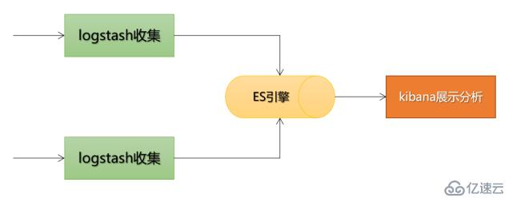

title: Spring框架
categories:

  - 应用框架
    tags:
    location:
    abbrlink: '81y02uhg'
    permalink: '81y02uhg'
    date: 2021-09-01 13:42:12
    updated: 2021-09-01 13:42:12

> 摘要：Spring框架，包括IoC和DI，Bean，AOP，事务等。

<!-- more -->

## Spring

[Spring常见问题总结](https://github.com/Snailclimb/JavaGuide/blob/main/docs/system-design/framework/spring/spring-knowledge-and-questions-summary.md)

### Spring 概述

Spring是轻量级的开源J2EE（容器）框架和中间层框架（万能胶）。

优点：

- 非侵入式：对象可不依赖于Spring的API；（不改变现有的类结构，就能增强JavaBean的功能，Struts2等传统框架常要实现特定接口、继承特定类才能增强功能，改变了java类的结构）
- 松耦合：IoC
- AOP
- 容器：管理对象的生命周期和配置
- 对单元测试支持比较好：框架中包含测试环境；支持 JUnit4，可用注解方便地测试。
- WEB框架：MVC
- 方便集成各种优秀框架：支持 Struts2、Hibernate、MyBatis等
- 为JavaEE 开发中一些 API（JDBC、JavaMail、远程调用等）提供了封装
- 事务管理：提供一个持续的事务管理接口，可扩展到上至本地事务下至全局事务（JTA）
- 声明式事务的支持：只通过配置就可完成事务管理，无须手动编程。

##### Spring Framework 八大模块

1. Data Access/Integration 数据访问/集成

- JDBC
- ORM：提供对象-关系映射框架 的集成 API，包括 JPA、JDO、Hibernate 和 MyBatis 等。
- OXM：提供了一个支持 Object /XML 映射的抽象层实现（Java 对象和 XML 数据间的映射），如 JAXB、Castor、XMLBeans、JiBX 和 XStream。
- JMS：Java 消息服务
- TX事务

2. Web

- Web-MVC

3. Core Container 核心容器：

- Beans 模块：包括IoC和DI
- Core 模块
- Context 上下文模块：ApplicationContext 接口
- SpEL（Spring Express Language）

4. AOP
5. ~~Aspects：与 AspectJ 的集成提供支持~~
6. ~~Instrumentation~~
7. ~~Messaging~~ 
8. Test：支持 Junit 和 TestNG 测试框架，模拟 Http 请求的功能

### IoC 设计思想

##### IoC 和 DI

在传统的 Java 应用中，一个类（调用者）想要调用（依赖）另一个类（被调用者）的属性或方法，通常会先通过 new Object() 创建对象。

1. 控制反转（Inversion of Control）：new/创建对象的控制权，由开发者手动创建转移（反转）给第三方IoC容器管理。
2. 依赖注入（Dependency Injection）：通过IoC容器管理对象间的依赖，容器在创建对象时，（根据依赖关系）将它依赖的对象自动注入当前对象。

二者含义相同，是从两个角度描述的同一个概念。

##### IoC工作原理

IoC 底层通过工厂模式、Java 的反射机制、XML 解析等技术，降低代码耦合度，主要步骤有：

1. 在配置文件（例如 Bean.xml）中，配置各个对象及它们间的依赖关系，与代码松耦合；
2. 可把 IoC 容器当做一个工厂，产品就是 Spring Bean；
3. 容器启动时会加载并解析配置文件，得到对象的基本信息及它们间的依赖关系；
4. IoC 利用 Java 的反射机制，根据类名生成相应的对象，并根据依赖关系将这个对象注入到依赖它的对象中。

即使对象发生改变，也只需在配置文件中修改，而无须修改 Java 代码，即 Spring IoC 实现解耦的原理。

工厂方法：分为无参和有参，静态工厂和实例工厂。


```
//用静态工厂方法创建Bean。
class UserFactory {
    public static UserDao getDao() {
    //xml解析
    String className = class属性值;
    //通过反射创建对象
    Class clazz = Class.forName(className);
    return (UserDao)clazz.newInstance();
    
    //return new UserDao();
    }
}

UserDao dao = UserFactory.getDao();
```

##### IoC 容器

IoC 容器：管理对象（从创建到销毁的）整个生命周期。

IoC 容器的两种实现：

1. BeanFactory接口：Spring内部用；懒加载（获取对象时才创建对象）；简单，占内存少，启动快。

```
import  org.springframework.beans.factory.BeanFactory;

Resource res = new ClassPathResource("appContext.xml"); 
//实现 BeanFactory 接口最常用 XmlBeanFactory 类
BeanFactory fact = new XmlBeanFactory(res);  

Student stu = (Student) fact.getBean("student");
stu.getMsg();
```

2. ApplicationContext 接口：面向开发者，用的更多；继承并扩展 BeanFactory，功能更完整；不管用没用到，容器启动时一次性创建所有 bean ；即时加载（加载配置文件时创建并初始化对象）；

- ClassPathXmlApplicationContext：从 class path 加载配置文件，更常用；
- FileSystemXmlApplicationContext：从参数指定位置加载配置文件，不常用。
- XmlWebApplicationContext：从Web系统中的XML文件加载配置文件。

```
BeanFactory beanFactory = new ClassPathXmlApplicationContext("beans.xml");
...
```

二者都是通过 XML 配置文件加载 Bean 的，通常用后者，只有在系统资源较少时，才考虑用 BeanFactory。主要区别在于 Bean 的某一属性没有注入时：

- BeanFacotry 加载后，第一次调用 getBean() 会抛出异常，
- ApplicationContext 会在初始化时自检所依赖的属性是否注入。

##### 依赖注入的方式

依赖注入本质上是 Spring Bean 属性注入的一种，只不过这个属性是一个对象属性。

### Spring Bean 定义

Bean：由 IoC 容器创建并管理的对象。

##### Bean属性注入的方式

1. 构造器注入：XML配置文件中，用 <constructor-arg> 标签给构造方法的参数赋值

2. setter()注入：通过调用默认无参构造器或无参static工厂方法，实例化bean对象，并调用setXxx()设置<property>属性。

构造函数注入 VS setter() 注入

- 没有部分注入；有部分注入
- 不会覆盖 setter 属性；会覆盖 setter 属性
- 任意修改都会创建一个新实例；任意修改不会创建一个新实例
- 适用于设置很多属性；适用于设置少量属性

3. ~~基于Groovy DSL配置（很少见）~~

4. 接口注入/工厂方法
5. ~~短命名空间注入~~
   1. p：<bean> 中嵌套的 <property> 元素，setter()注入的优化
   2. c：<bean>中嵌套的<contructor>元素，构造器注入的优化
6. 泛型注入

##### 基于xml配置文件的属性注入

配置文件：描述如何创建对象和哪些组件需要哪些服务。用于定义 Bean 的属性值和作用域，Bean 间的依赖关系。格式有：

1. Properties 配置文件：key-value 形式，只能赋值，不能进行其他操作，用于简单的属性配置。
2. XML 配置文件：树形结构，结构清晰灵活，内容繁琐，用于大型复杂的项目。

- 通过 parent 属性指定继承的父 Bean。
- 指定 abstarct="true"而不指定 class 属性，定义为 Bean 定义模板，只能被继承，不能被实例化。
- value 用于注入基本数据类型及字符串类型的值；
- ref 用于注入已定义好的 Bean；
- type 用来指定对应的构造函数；
- index 指定参数位置。
- <property>：给属性注入值，name 的名称取决于 set() 后的参数；

```
//Beans.xml
<beans>
//bean 标签：要创建的对象，默认执行无参构造器
//id：Bean 的唯一标识符
//class：Bean的实现类，完全限定名，从 package 到 class name
//scope	表示 Bean 的作用域
<bean id="user" class="com.spring5.User" name="" scope="">
	//property用于属性注入
    <--! 1. 用set方法注入属性-->
    //注入基本数据类型（8大基本数据类+String）
    <property name="bname" value="java"></property>
    
    //注入外部bean属性
    <property name="userDao" ref=userDaoImpl"></property>
    
    //注入集合，创建类，定义数组、List、Set、Map属性，生成set方法
    <property name="courses">
        //注入数组类型属性
        //注入List集合属性
        <list>
            <value>java</value>
        </list>
        //注入Map属性
        //在集合里设置对象类型的值
    </property>
    
    <--! 2. 用有参构造注入属性-->
    <constructor-arg name="oname" index=0 type="" value="China"></constructor-arg>
</bean>

<bean id="userDaoImpl" class="com.at.spring5.dao.UserDaoImpl">
</bean>

</beans>

//类中
    public Orders(String oname) {
        this.oname = oname;
    }
```

##### Bean 作用域

Bean 作用域：指 Spring IoC 容器创建的 Bean 对象相对于其他 Bean 对象的请求可见范围。在装配 Bean 时就必须指明，可通过xml方式或注解方式配置 bean 的作用域。

```
1. xml 方式：
<bean id="" class="" scope="singleton"></bean>

2. 注解方式：
@Bean
@Scope("singleton")
@Scope(value = ConfigurableBeanFactory.SCOPE_PROTOTYPE)
public Person personPrototype() {
    return new Person();
}
```

**基本作用域**：

1. singleton：默认值，单例模式，在整个Spring IoC 容器中只有一个共享的Bean实例，由BeanFactory维护。一旦创建成功，可重复使用。存储在高速缓存中，用于无会话状态的 Bean（如 DAO 层、Service 层）。
2. prototype：原型模式，每次获取 Bean 时，容器都会创建一个新的 Bean 实例。创建成功后不再跟踪和维护Bean实例的状态。用于需保持会话状态的 Bean（如 Struts2 的 Action 类）。

**Web作用域**：只能在 Web 环境下（XmlWebApplicationContext）用，如果用 ClassPathXmlApplicationContext 加载这些作用域中的任意一个的 Bean，会抛出异常。

1. request：每次 HTTP 请求都会产生一个新的 bean，仅在当前 HTTP request 内有效（在请求完成后，bean会失效并被GC回收）。即每次HTTP请求将会产生不同的Bean实例。
2. session：每个 HTTP Session 会产生一个新的 bean，仅在当前 HTTP session 内有效。同一个 HTTP Session 共享一个 Bean 实例。
3. ~~global-session~~：每个全局的HTTP Session、用session定义的Bean都将产生一个新实例。典型情况下，仅在用portlet context时有效。
4. ~~application~~：类似于 singleton，同一个 Web 应用（可能有多个 IoC 容器）共享一个 Bean 实例。
5. ~~websocket~~：作用域是 WebSocket。

##### Bean生命周期

##### 同名Bean的优先级

- 同一个配置文件内，以最上面定义的为准
- 不同配置文件中的，后解析的配置文件会覆盖先解析的
- 同文件中@Bean（最先注册）的优先级 > @ComponentScan

### Bean 自动装配

Bean装配/依赖注入：在 IoC 容器中，Bean 与 Bean 间建立依赖关系。装配方式即依赖注入方式。

手动装配 bean：XML 配置中通过 <constructor-arg>和 <property> 中的 ref 属性，手动维护 Bean 与 Bean 间的依赖关系。

自动装配 bean：Spring 容器依据规则，为指定的 Bean 从应用的上下文（AppplicationContext 容器）中查找所依赖的 Bean，并自动建立 Bean 间的依赖关系。

##### 自动装配的五种规则

```
<!-- 通过 autowire 属性设置自动装配的规则-->
<bean id="employee" class="net.biancheng.c.Employee" autowire="byName">
```

- no：默认设置，表示不用自动装配，Bean 依赖必须通过 ref 元素引用定义。
- byName：根据 Property 的 name 自动装配/注入对象依赖项，如果一个 Bean 的 name 和另一个 Bean 中的 Property 的 name 相同，则自动装配这个 Bean 到 Property 中。
- byType：根据 Property 的数据类型自动装配，如果一个 Bean 的数据类型兼容另一个 Bean 中 Property 的数据类型，则自动装配。
- constructor：类似于 byType，根据构造方法参数的数据类型，进行 byType 模式的自动装配。
- autodetect：如果 Bean 中有默认的构造方法，则用 constructor 模式，否则用 byType 模式。

##### 基于XML自动装配Bean

applicationContext.xml 配置文件

- 根据名字来装配
- 根据类型类装配

局限：

- 用 <constructor-arg> 和 <property> 设置指定依赖项，将覆盖自动装配。
- 基本元数据类型（简单属性，如原数据类型，字符串和类）无法自动装配。
- 不精确

如何解决循环依赖

1. 构造器的：直接抛出BeanCurrentlylnCreationException异常。 
2. 单例模式下的setter（默认的单例Bean中，属性互相引用）：通过三级缓存处理。 
3. 非单例：无法处理。

##### 基于注解声明 Bean @Component

Spring Boot彻底抛弃了xml配置，推荐基于 Java API 配置Bean，在Java类中用注解设置依赖关系

```
//Spring 配置文件（xml或properties）中启用注解装配
<beans>
	<context:annotation-config/>
</beans>
```

- `@Component`：通用的注解，可标注任意类为 `Spring` 组件（Java Bean 对象），添加组件到容器中。用于不知道属于哪层的 Bean。同@Name，较少用。
- `@Repository`：用于Dao（数据持久化）层，数据库相关操作。
- `@Service`： 用于Service（业务逻辑）层，主要涉及一些复杂的逻辑，需要用到 Dao 层。
- `@Controller`：用于控制层，接受用户请求并调用 Service 层返回数据给前端页面。
- `@Bean`：替代 <bean /> 元素；将该方法返回的Bean对象加载到Spring容器，可用@Bean的name属性自定义，默认为方法名。用于自动装配Bean？

`@Component` VS `@Bean`

- 作用对象: @Component 注解作用于类，而@Bean作用于方法。
- `@Component`常通过类路径扫描来自动装配到Bean容器；@Bean 常在方法中定义产生这个 bean,告诉Spring这是某个类的实例，当用它时还给我。？
- `@Bean` 的自定义性更强，多地只能用 @Bean 来注册bean。如引用第三方库中的类需装配到 Spring容器时

##### 基于注解方式实现依赖注入/装配 Bean

- `@Autowired`：用于 setter()、构造函数或字段上。
  - 默认用byType（基于类型）的方式自动注入Bean到（同样被 Spring 容器管理的）当前Bean中（即自动导入对象到类中），如：Service 类注入到 Controller 类中；
  - 同一个实体类有多个实现类（配置多个bean）时类型相同，IOC不知该注入哪个实现类，这时改为byName的方式注入，默认根据标注的成员变量名作为id查找bean，进行装配；
  - 仍失败，通过@Qualifiler指明目标bean的id（变量名）；
  - 检查属性是否正常装配（设置），无法找到匹配的Bean装配会抛出异常；设置required = false 允许属性不被设置，不抛出异常。
  - [@Autowired注解使用的自动装配方式](https://blog.csdn.net/weixin_44296929/article/details/109527112)
  - 如何把url映射到Controller上，ModelAndView对象返回的方式等。
- `@Resource`：默认（指定值）是byName，找不到与名称匹配的bean（或该属性为空、不指定值）时用byType，自动用标注处的变量或方法名作为 bean 名；相同类型在IOC容器中只能有一个。
- `@Qualifier("userDAO")`：限定要自动注入的bean的id，一般和@Autowired联用，指定bean的名称

##### `@Controller` VS `@ResposeBody` VS `@RestController`

- `@Controller`：单独使用不加 `@ResponseBody`返回一个视图/页面，用于传统的Spring MVC 前后端不分离的情况。~~扫描该类下有 @RequestMapping 的方法，根据注解信息生成一个对应的处理器对象。~~
- `@ResponseBody`：将 Controller 返回的对象转换为指定格式，并写入HTTP 响应对象的 body，常用来返回 JSON（较多）或 XML 数据。

- `@RestController` = `@Controller` + `@ResponseBody`：表示 REST 风格的控制器 bean。返回 JSON 或 XML 格式（由客户端的 ACCEPT 请求头决定）的对象数据，并直接写入 HTTP 响应体中。属于 RESTful Web/API服务，最常用的前后端分离框架的情况。~~无需用@ResponseBody注解每个方法。~~

### AOP

AOP（面向切面编程）：将与业务无关却为业务模块所共同调用的逻辑（交叉业务逻辑，如事务处理、日志管理、权限控制等）封装成切面。

通过预编译方式和运行期动态代理实现程序功能的统一维护的一种技术。可对业务逻辑的各部分进行隔离，从而降低耦合度，提高程序的可重用性。

##### 代理机制：Spring AOP VS AspectJ AOP

1. Spring AOP 基于动态代理/运行时增强，不需专门的编译过程和类加载器：

- JDK 动态代理：被代理的类至少实现一个接口
- CGLIB 动态代理/子类代理：目标类没有实现接口

2. AspectJ 基于静态代理/编译时增强：

- 性能更好，功能更全，需特定的编译器处理

##### AspectJ AOP

1. 基于XML的声明式 AspectJ/开发AOP：
   指通过 Spring 配置文件定义切面、切入点及通知，都必须定义在 <aop:config> 元素（将定义好的 Bean 转换为切面 Bean）中。在 XML 文件中添加<aop:aspectj-autoproxy>启用 @AspectJ。
2. 基于注解的声明式 AspectJ：
   启用 @AspectJ 注解有以下两种方法：
   1）用@Configuration和@EnableAspectJAutoProxy注解：

```
@Configuration 
@EnableAspectJAutoProxy
public class Appconfig {
}
```

##### 代理工厂（静态方法）

- 把AOP加入IOC容器中
- 把UserDao放入容器中
- 在配置文件中开启注解扫描，用工厂静态方法来创建代理类对象

##### 通知（Advice）

通知：描述了切面要完成的工作及何时执行。如日志切面需记录每个接口调用时长，就需在接口调用前后分别记录当前时间，再取差值。

- 前置通知（Before）：在目标方法调用前调用通知功能；
- 后置通知（After）：在目标方法调用之后调用通知功能，不关心方法的返回结果；
- 返回通知（AfterReturning）：在目标方法成功执行之后调用通知功能；
- 异常通知（AfterThrowing）：在目标方法抛出异常后调用通知功能；
- 环绕通知（Around）：通知包裹了目标方法，在目标方法调用之前和之后执行自定义的行为。

##### 相关概念

- 连接点（JoinPoint）：通知功能被应用的时机。如接口方法被调用时就是日志切面的连接点。

- 切点（Pointcut）：定义通知功能被应用的范围。如日志切面的应用范围就是所有接口，即所有controller层的接口方法。

- 切面（Aspect）：是通知和切点的结合，定义了何时、何地应用通知功能。

- 引入（Introduction）：在无需修改现有类的情况下，向现有的类添加新方法或属性。

- 织入（Weaving）：把切面应用到目标对象并创建新的代理对象的过程。

##### Spring中创建切面相关注解

- @Aspect：用于定义切面
- @Before：通知方法会在目标方法调用之前执行
- @After：通知方法会在目标方法返回或抛出异常后执行
- @AfterReturning：通知方法会在目标方法返回后执行
- @AfterThrowing：通知方法会在目标方法抛出异常后执行
- @Around：通知方法会将目标方法封装起来
- @Pointcut：定义切点表达式，指定了通知被应用的范围，格式：

```
//execution(方法修饰符 返回类型 方法所属的包.类名.方法名称(方法参数)
@Pointcut("execution(public * com.macro.mall.controller.*.*(..))||execution(public * com.macro.mall.*.controller.*.*(..))")
public void webLog() {
}
```

**步骤：**

- 添加日志信息封装类WebLog：用于封装需要记录的日志信息，包括操作的描述、时间、消耗时间、url、请求参数和返回结果等信息。
- 添加切面类WebLogAspect：定义了一个日志切面，在环绕通知中获取日志需要的信息，并应用到controller层中所有的public方法中去。

### Spring 框架中用到的设计模式

1. 工厂模式：[IoC 容器的两种实现](#IoC 容器)：通过 BeanFactory、ApplicationContext 接口创建Bean对象；
2. 单例模式：Bean默认为单例模式，只有一个实例；Spring 中 bean 的默认作用域就是 singleton。Spring 可通过xml方式或注解方式[配置 bean 的作用域](#Bean 作用域)来实现单例。Spring 通过 `ConcurrentHashMap` （线程安全）实现单例注册表的特殊方式实现单例模式。
   1. xml : `<bean id="userService" class="top.snailclimb.UserService" scope="singleton"/>`
   2. 注解：`@Scope(value = "singleton")`
3. 代理模式：AOP用到JDK的动态代理和CGLIB字节码生成技术；
4. 模板方法：用来解决代码重复的问题。如 RestTemplate, JmsTemplate, JpaTemplate、jdbcTemplate、hibernateTemplate 等以 Template 结尾的对数据库操作的类。
5. 观察者模式：定义对象间的依赖关系，一个对象发生改变时，所有依赖它的对象都会被动更新，如事件驱动模型（如每次添加商品时都需重新更新索引，ApplicationListener （listener的实现））。
6. 适配器/包装器(Wrapper)模式 : 可根据客户的需求动态切换不同的数据源，使接口不兼容的类一起工作。Spring AOP 的增强或通知(Advice)、spring MVC 适配Controller。
7. 装饰者模式: 

### JdbcTemplate

JdbcTemplate 是 Spring JDBC 核心包（core）中的核心类，可通过配置文件、注解、Java 配置类等形式获取数据库的相关信息，实现对 JDBC 开发过程中的驱动加载、连接的开启和关闭、SQL 语句的创建与执行、异常处理、事务处理、数据类型转换等操作的封装。

### Spring 事务管理

事务管理：按照给定的事务规则来执行提交或回滚操作。

1. 编程式事务：编写代码实现管理事务，难维护；
2. 声明式事务：分离事务管理和业务逻辑代码，实际是通过 AOP 实现；不需编程，只需通过**在 XML 文件中配置或直接基于注解**实现；实现声明式事务的方式：
   - 基于XML（<tx> 和<aop>命名空间）的声明式事务管理：推荐，最大特点是与 Spring AOP 结合紧密，可充分利用切点表达式的强大支持，更加灵活。
   - 基于 @Transactional 的全注解方式：简化，使用最多
   - 最好知道声明式事务的做法。

##### `@Transactional`

- **作用于类**：表示该类所有的 public 方法都配置相同的事务属性信息。
- **作用于方法**：方法的事务会覆盖类的事务配置信息。

##### 事务传播行为/规则

- PROPAGATION_REQUIRED: 支持当前事务，如果当前没有事务，就新建一个事务。最常见
- PROPAGATION_SUPPORTS: 支持当前事务，如果当前没有事务，就以非事务方式执行。
- PROPAGATION_MANDATORY: 支持当前事务，如果当前没有事务，就抛出异常。
- PROPAGATION_REQUIRES_NEW: 新建事务，如果当前存在事务，把当前事务挂起。
- PROPAGATION_NOT_SUPPORTED: 以非事务方式执行操作，如果当前存在事务，就把当前事务挂起。
- PROPAGATION_NEVER: 以非事务方式执行，如果当前存在事务，则抛出异常。
- PROPAGATION_NESTED:如果当前存在事务，则在嵌套事务内执行。如果当前没有事务，则进行与 PROPAGATION_REQUIRED类似的操作。


## Spring MVC

是一个基于 MVC 设计模式的轻量级 Web 开发框架，本质上相当于 Servlet，本身是 Spring 框架的一部分。

### MVC 设计模式

Model 1 时代：

1. 数据模型层（Model）：应用程序的主体部分，负责数据逻辑（业务规则）的处理和实现数据操作（即在数据库中存取数据）。
2. 视图层（View）：负责格式化数据并呈现给用户；包括数据展示、用户交互、数据验证、界面设计等功能。
3. 控制层（Controller）：负责接收并转发请求，对请求进行处理后，指定视图并将响应结果发送给客户端。

Model 2 时代，早期 JavaWeb MVC 开发模式：

1. JavaBean + JSP；
2. JavaBean + JSP + Servlet

- Java Bean(Model，即 dao 和 bean）
- JSP（View）
- Servlet（Controller，可在JSP中实现）

Spring MVC 时代：

- 业务逻辑层（Service/Controller）：可管理事务和记录日志等；业务逻辑相关的部分无法单独处理，但 service+serviceImpl、dao+daoImpl 又太冗余，于是将其单独列为业务逻辑层。
  - 业务逻辑：客户想干什么。service 层处理请求和响应事件，“事件”包括**用户的行为**和**数据的改变**。
- 持久层（Dao数据库操作/Entity实体类/Model）：可以整合 MyBatis、Hibernate 和 JdbcTemplate 等技术。
- 表现层（View）：提供了与 Spring MVC、Struts2 框架的整合。


### Spring MVC VS Structs2

1. Spring MVC 基于方法开发，会将 URL 信息与 Controller 类的某个方法绑定并进行映射，请求参数作为该方法的形参，生成 Handler 对象，只包含一个 method 方法。
   Struts2 基于类开发，Action 类中所有方法的请求参数都是成员变量，方法越多，类越乱。

2. Spring MVC 支持单例开发模式，而 Struts2 由于只能通过类的成员变量接受参数，无法用单例模式。

### Spring MVC 工作原理/流程说明

1. 客户端（浏览器）发送请求到 DispatcherServlet。
2. DispatcherServlet 根据请求信息调用 HandlerMapping。
3. 解析请求到对应的 Handler（即 Controller）。
4. HandlerAdapter 适配器根据 Handler调用真正的处理器处理请求，并处理相应的业务逻辑。
5. 处理器处理完业务后，会返回一个 ModelAndView 对象，Model 是返回的数据对象，View 是逻辑上的 View。
6. ViewResolver 会根据逻辑 View 查找实际的 View。
7. DispaterServlet 把返回的 Model 传给 View（视图渲染）。
8. 把 View 返回给请求者（浏览器）

## Spring Boot

### 特点

简化Spring项目配置：

1. 部署方便：提供嵌入式 HTTP 服务器，如 Tomcat 、 Jetty、Undertow，可轻松开发和测试 web 应用程序；直接运行入口函数即可启动项目/作为独立应用程序运行；

   - 用 Tomcat 作为默认的嵌入式 `Servlet` 容器；简单来说，Tomcat 主要实现了 2 个核心功能：

   1. 处理 `Socket` 连接，负责网络字节流与 `Request` 和 `Response` 对象的转化。
   2. 加载和管理 `Servlet`，及具体处理 `Request` 请求。

2. 管理依赖关系：提供一系列的“starter”项目对象模型（POMS）来简化 Maven 配置（引入依赖）；

3. **自动配置**、开箱即用：自动提供大量默认配置；通过注解和配置类（标注 @Configuration 的类）替换传统繁杂的 xml 配置文件，以 JavaBean 形式配置。快速搭建开发环境；

4. 方便集成整合Spring 生态系统集成，如 Spring JDBC、Spring ORM、Spring Data、Spring Security 等；

5. 强大的数据库事务管理功能；

6. 项目可打包成jar文件，可用“ java–jar xx.jar” 命令以 jar 包的形式独立运行；

7. 自带应用监控；

8. 集成Junit，测试方便；

### Spring VS Spring Boot

- Spring：主要功能是依赖注入，用于简化 Java EE 企业应用程序开发；
- Spring Boot：主要功能是自动配置，用于简化 Spring  开发。
- Spring MVC： 是一个面向HTTP的Web应用程序开发框架。

##### POJO 分层领域模型

POJO(Plain Ordinary Java Object): 专指只有 setter / getter / toString 的简单类，包括 DO / DTO / BO / VO 等。

2. DO(Data Object): 专指数据库表一 一对应的 POJO 类。此对象与数据库表结构一 一对应，通过 DAO 层向上传输数据源对象。
3. PO(Persistent Object): 也指数据库表一 一对应的 POJO 类。此对象与数据库表结构一 一对应，通过 DAO 层向上传输数据源对象。
4. DTO(Data Transfer Object ): 数据传输对象，Service 或 Manager 向外传输的对象。
5. BO(Business Object): 业务对象，可由 Service 层输出的封装业务逻辑的对象。
6. Query: 数据查询对象，各层接收上层的查询请求。注意超过 2 个参数的查询封装，禁止使用 Map 类来传输。
7. VO(View Object): 显示层对象，通常是 Web 向模板渲染引擎层传输的对象。

##### Spring Boot 体系结构

- common：存放通用类，如工具类和通用返回结果。
- component：存放组件。
- config 层：存放Java配置。
- **Controler 控制层**：存放控制器，实现PmsBrand表中的添加、修改、删除及分页查询接口。
- **Service 业务逻辑层**：处理所有**业务逻辑** 。由服务类组成，并使用数据访问层提供的服务。还执行**授权**和**验证**。
  - impl
- **DAO 数据访问 / 持久层**：包含所有**存储逻辑**，并将业务对象与数据库行进行相互转换。常用`@Mapper`修饰，存放自定义的`Mapper`接口。
- **DTO 数据传输对象层**：面向表现层（界面UI），通过UI的需求来定义DTO；实现了表现层与Model间的解耦，表现层不引用Model。如果开发过程中模型改变了而界面没变，就只需改Model而不需去改表现层。要维护DTO与Model间的映射关系。存放自定义的传输对象，如请求参数和返回结果。
- mbg：MyBatis Generator代码生成器和生成的代码
  - mapper：生成的mapper.xml 映射文件
  - **Entity 实体层 / Model / Bean** ：**CRUD**，面向业务逻辑层（Service），通过业务来定义Model。
- resource 
  - **展示层**：负责处理HTTP请求，将JSON参数转换为对象，并对请求进行身份验证并将其传输到业务层。由**视图**即前端部分组成。
  - mapper：mapper.xml 映射文件
  - application.yml：SpringBoot配置文件
  - generatorConfig.xml：配置数据库连接，Mybatis generator生成model、mapper接口及mapper.xml的路径。

### SSM架构

Mybatis+Spring+Spring MVC，至少在项目里做过。介绍项目时，用一个业务流程来说spring mvc如何做的。

##### 文件格式

```
// 1. properties 格式
server.port = 8080

// 表示文档间隔
---

// 2. yml 格式
// 不支持 @PropertySource 注解导入配置
// spring-boot-starter-web 或 spring-boot-starter 都集成了 SnakeYAML 库，引用任一个，Spring Boot 都会自动添加库到 classpath 下。
server:
	port: 8080
// 以缩进来控制层级关系；
// 键值对间必须有空格；
// 大小写敏感
// 字符串不需加引号
// 双引号不转义, 单引号转义特殊字符; "\n"为换行 
```

##### 配置绑定

配置绑定：读取（全局）配置文件中的属性值并绑定到 JavaBean 上，如数据库配置。用于容器中的组件。

- `@ConfigurationProperties(prefix = "person") `：用在类名上，读取配置文件中（以“person”为前缀）的所有配置数据，并与此 JavaBean （用@Component 等标注）中的所有属性绑定；支持松散语法绑定。
- `@Value("${url}")`：用在属性上，只读取配置文件中的某一个配置，与当前属性绑定；只支持基本数据类型+String类型，支持 SpEL 表达式。**不推荐**
- `@PropertySource(value = "classpath:person.properties")`：读取指定的配置文件，与Spring Boot 无关的（person 相关的）自定义配置移动到src/main/resources/person.properties 中。不常用。

##### 导入 Spring 配置文件

- `@Import`： 允许从另一个Java/XML配置文件加载bean定义。
- `@ImportResource(locations = {"classpath:/beans.xml"})`：用于主启动类上，加载 Spring 配置文件，src/main/resources/beans.xml
- 推荐用全注解方式加载 Spring 配置：
  - `@Configuration`：定义配置类，相当于 Spring 的配置文件；
  - 配置类内可有一个或多个被 @Bean 注解的方法，会被 AnnotationConfigApplicationContext 或 AnnotationConfigWebApplicationContext 类扫描，构建 bean 定义（相当于 Spring 配置文件中的<bean>标签），方法的返回值会以组件的形式添加到容器中，组件的 id 就是方法名。
  - 优先级低于 .properties / .yml 配置文件

##### 多环境配置/切换

1. 创建application-{profile}.properties文件，如：application-dev.properties用于开发环境
2. 在application.properties文件中添加spring.profiles.active=dev

```
//命令行激活：将 Spring Boot 项目打包成 JAR 文件
//命令行窗口，跳转到 JAR 文件所在目录，执行以下命令，
//启动该项目，并激活开发环境的 Profile。
java -jar helloworld-0.0.1-SNAPSHOT.jar  --spring.profiles.active=dev
```

##### 配置文件优先级

Spring Boot 启动时会扫描以下 5 个位置的 application.properties/.yml 文件，并作为默认配置文件。

1. file:./config/*/（jar包外的）
2. file:./config/
3. file:./
4. classpath:/config/
5. classpath:/

> 注：file: 指当前项目根目录；
>
> classpath: 指当前项目的类路径，即 src/main/resources 目录。

优先级：

- 序号越小优先级越高。
- 根目录下的优先级高于当前项目的类路径下的；
- /config/子文件高于父文件夹；

- 相同位置的 .properties 的优先级高于 .yml；
- 带-{profile}优先级高于不带的；

加载顺序：

- 存在相同的配置内容时，高优先级的内容会覆盖低优先级的内容；
- 存在不同的配置内容时，高优先级和低优先级的配置内容取并集。

### 自动装配原理

自动装配：通过注解或简单配置在 Spring Boot 帮助下实现某块功能。

##### Spring Factories 机制

- Spring Boot 通过`@EnableAutoConfiguration`开启自动装配，基于 Spring Factories 机制实现自动装配。

- 通过 `SpringFactoriesLoader`（spring-core 包里） 自动扫描所有 Jar 包类路径下的`META-INF/spring.factories`文件，最终加载其中的自动配置类（即通过`@Conditional`按需加载的配置类）实现自动装配。

- 想要其生效必须引入`spring-boot-starter-xxx`包实现起步依赖。

##### `@SpringBootApplication`

SpringBoot 启动类上的核心注解，实现自动装配的关键，主要组合包含以下 3 个注解：

- `@EnableAutoConfiguration`：启用自动配置机制。也可关闭，如关闭数据源自动配置：@SpringBootApplication(exclude = {DataSourceAutoConfiguration.class })。Spring Boot 中几乎所有默认配置都是通过配置类 XxxAutoConfiguration 配置的。
- `@Configuration`：允许在上下文中注册额外的 bean 或导入其他配置类。声明配置类，用于（通过简单调用同类中的其他 @Bean 方法来）配置/定义Bean间的依赖关系。同@Component。
  - `@SpringBootConfiguration`：组合了 @Configuration，实现配置文件的功能；
- `@ComponentScan`： 扫描@Component （@Service，@Controller）标注的 bean，装配（加载）到容器中，默认会扫描该类所在包及其子包下所有的类。

### Spring Boot Starter

只需要在 Maven  pom.xml 配置中引入 starter 依赖，Spring Boot 就能自动扫描到要加载的信息并启动相应的默认配置。

引入 starter 后，通过少量注解和简单配置就能用第三方组件提供的功能


##### 库依赖

- 一方库: 本工程内部子项目模块依赖的库(jar 包)。
- 二方库: 公司内部发布到中央仓库，可供公司内部其它应用依赖的库(jar 包)。
- 三方库: 公司之外的开源库(jar 包)。

##### 二方库依赖 GAV 定义规则

- groupId：分为多个字段，一般为`公司/组织域名`；
- artifactId：一般是`项目名-模块名`。
- 一般，`包名根目录 = groupId + artifactId`，唯一。

1. GroupId 格式: com.{公司/BU}.业务线.[子业务线]，最多 4 级。
   com.taobao.jstorm 或 com.alibaba.dubbo.register
2. ArtifactId 格式: 产品线名-模块名。语义不重复不遗漏，先到中央仓库去查证一下。
3. Version: 主版本号.次版本号.修订号 

 - 主版本号: 产品方向改变，或大规模 API 不兼容，或架构不兼容升级。
 - 次版本号: 保持相对兼容性，增加主要功能特性，影响范围极小的 API 不兼容修改。
 - 修订号: 保持完全兼容性，修复 BUG、新增次要功能特性等。

##### 工作原理/启动过程

- Spring Boot 在启动时，会去依赖的 Starter 包中寻找 resources/META-INF/spring.factories 文件，然后根据文件中配置的 jar 包扫描项目所依赖的 jar 包。
- 根据 spring.factories 配置加载 AutoConfigure 类
- 根据 @Conditional 注解的条件，进行自动配置并将 Bean 注入 Spring Context

按照约定去读取 Spring Boot Starter 的配置信息，再根据配置信息对资源进行初始化，并注入到 Spring 容器中。

##### spring-boot-starter-parent（版本仲裁中心）

- 默认 JDK 版本（Java 8）
- 默认字符集（UTF-8）
- 统一管理部分常用依赖，版本仲裁
- 资源过滤
- 默认插件配置
- 识别 application.properties/.yml 类型的配置文件

##### 常用的starter有哪些？

1. spring-boot-starter-web：提供了嵌入的 Servlet 容器、web开发需要的servlet与jsp支持及 SpringMVC 的依赖，并为 Spring MVC 提供了大量自动配置
2. spring-boot-starter-data-jpa 数据库支持
3. spring-boot-starter-data-Redis
4. spring-boot-starter-data-solr？
5. mybatis-spring-boot-starter
6. spring-boot-devtools：LiveReload自动刷新，将文件更新自动部署到服务器并重启。

### 数据库（事务问题）

##### Spring Data JPA、 MyBatis 与 Hibernate

**JDBC**（Java DataBase Connectivity）：是java连接数据库操作的原生接口，所有框架操作数据库必须要用的，由数据库厂商提供。

**JdbcTemplate** 通用JDBC操作数据库

位于 spring-jdbc-x.x.x.jar 包中，还需导入 spring-tx-x.x.x.jar 包用来处理事务和异常。Spring Boot 对 JdbcTemplate 提供了默认自动配置，可直接用 @Autowired 或构造函数将它注入到 bean 中使用。

**ORM**（Object Relational Mapping，对象关系映射）框架：采用元数据来描述对象与关系映射的细节，元数据一般采用XML格式，并且存放在专门的对象一映射文件中。是对象持久化的核心，是对jdbc的封装。

**JPA**（Java Persistence API）：用于对象持久化的 API，是一种规范，（统一了Java应用程序访问）ORM框架的规范，实现用同样的方式访问不同的ORM框架。JPA是ORM框架的统一接口标准。

**Spring Data JPA**：是Spring Data的子模块，用Hibernate框架实现，（对JPA规范的抽象，没有实现JPA规范？，）用于简化数据访问层。可通过命名规范、注解的方式较快的编写SQL。


**Hibernate**：是一个开源**全自动**化的ORM框架，对JDBC进行了非常轻量级的对象封装，将POJO与数据库表建立映射关系，可自动生成SQL语句并自动执行。封装了基本的DAO层操作,有较好的数据库移植性。

面向对象，着力于对象与对象间的关系，用于解决计算机逻辑问题，考虑的是对象的整个生命周期（包括对象的创建、持久化、状态的改变和行为等），持久化只是对象的一种状态。

**MyBatis**：是一个持久化、**半自动**化（只支持将数据库查出的数据映射到 POJO 实体类上，而实体到数据库的映射则需编写 SQL 语句实现）的`ORM`框架，不是依照`JPA`规范。面向关系模型的，着力于POJO与SQL间的映射关系，用于解决数据的高效存取问题。

支持定制化 SQL、存储过程及高级映射。避免了几乎所有的 JDBC 代码和手动设置参数及获取结果集。可用简单的 XML 或注解来配置和映射原生信息，将接口和 POJOs映射成数据库中的记录。可进行更细致的SQL优化，查询必要的字段，需维护SQL和查询结果集的映射。主要依赖于SQL的编写与ResultMap的映射。

Hibernate 属于**全自动** ORM 映射工具，用 Hibernate 查询关联对象或关联集合对象时，可根据对象关系模型直接获取，所以是全自动的。而 MyBatis 在查询关联对象或关联集合对象时，需手动编写 sql 来完成，所以称为**半自动**的。

**选型：**

- 进行底层编程，对性能要求高，用 JDBC；

- 直接操作数据库表，没有过多的定制，用 Hibernate；

- 灵活使用 SQL语句，用 MyBatis；

[Spring Data JPA、 MyBatis与Hibernate到底该用谁](https://blog.csdn.net/xihuanyuye/article/details/81201441)

[SpringBoot Guide](https://github.com/CodingDocs/springboot-guide)

 [Spring Boot JPA 基础：常见操作解析](https://snailclimb.gitee.io/springboot-guide/#/./docs/basis/springboot-jpa)

 [JPA 中非常重要的连表查询就是这么简单](https://snailclimb.gitee.io/springboot-guide/#/./docs/basis/springboot-jpa-lianbiao)

##### JDBC访问数据库

```
<!-- pom.xml中引入依赖 -->
<!-- 1. 导入JDBC的场景启动器 -->
<dependency>
    <groupId>org.springframework.boot</groupId>
    <artifactId>spring-boot-starter-data-jdbc</artifactId>
</dependency>

<!-- 2. 导入数据库驱动 -->
<dependency>
    <groupId>mysql</groupId>
    <artifactId>mysql-connector-java</artifactId>
    <scope>runtime</scope>
</dependency>

<!-- application.properties中 -->
<!-- 3. 配置数据源 -->
## 数据库连接
# useUnicode=true&characterEncoding=UTF-8 表示使用Unicode字符集，指定字符从数据库取出后和存入前的编码、解码格式
# useSSL=false 表示在高版本禁用SSL
# autoReconnect 和 failOverReadOnly 用来配置数据源连接池？控制重连特性
# 其中，autoReconnec=true 表示当数据库连接异常中断时自动重连
# failOverReadOnly=false 表示自动重连成功后，连接不设置为只读
spring.datasource.url=jdbc:mysql://localhost:3306/campusdate?useUnicode=true&characterEncoding=UTF-8&useSSL=false&autoReconnect=true&failOverReadOnly=false
spring.datasource.username=root
spring.datasource.password=root
spring.datasource.driver-class-name=com.mysql.jdbc.Driver

## 自动建表（实体类维护数据表）方式
# create 表示每次重启项目（加载  hibernate）时，根据实体类重新生成新表结构，会导致数据丢失；
# create-drop 表示每次加载  hibernate 时，根据实体类生成新表，当 sessionFactory（项目） 关闭时自动删除表结构；
# update 表示第一次加载 hibernate 时，根据实体类自动建表；以后加载 hibernate 时，表结构随实体类自动更新，且保留数据库中的数据；
# validate 表示每次加载 hibernate 时，只验证实体类和数据表是否一致，不对数据库进行任何更改。
# none 表示啥都不做
# spring.jpa.properties.hibernate.hbm2ddl.auto=update
spring.jpa.hibernate.ddl-auto=update

# hibernate在操作时在控制台打印真实的sql语句，方便调试
spring.jpa.show-sql=true
# 表示格式化输出的json字符串
spring.jpa.properties.hibernate.dialect=org.hibernate.dialect.MySQL5Dialect
```

##### 数据源自动配置

DataSourceAutoConfiguration 类

如 DBCP、C3P0、Druid、HikariCP 等

##### JPA各层常用注解

Controller控制层：

- @Controller

Service业务层：

- @Service
- @Autowired

Repository数据接口层：

- `CrudRepository`接口：继承了Repository接口，并新支持对实体类的增删改查等方法；
- `PagingAndSortingRepository`接口：继承了CrudRepository接口，并新支持分页、排序及根据条件查询等方法；
- `JpaRepository`接口：包括JPA 提供的增删改查、分页查询及排序查询等。

```
@Repository
public interface PersonRepository extends JpaRepository<Person, Long> {
}
```

- [Spring Boot 使用 JPA](http://www.imooc.com/wiki/springbootlesson/jpa.html) 测试类

##### Entity数据持久层常用注解

- `@Entity`：标注在类上，表示数据库持久化类，对应一个数据库实体。
  - “name”可选属性默认为所标注实体类的名称。至少一个无参构造方法，因为用类反射机制 Class.newInstance()方法创建实例需要。也可标注抽象类。
- `@NamedQuery`：
- `@NamedQueries`：定义多个

```
@Entity
@NamedQuery(name="UserEntity.findAll", query="SELECT u FROM UserEntity u")
public class UserEntity implements Serializable {}

// 在自己实现的DAO的xxRepository接口里定义同名方法，先找是否有同名的NamedQuery，如果有，则不按照接口定义的方法解析。
public List<UserModel> findByAge(int age);

@NamedQueries(value = { 
	@NamedQuery(name = User.QUERY_FIND_BY_LOGIN, query = "select u from User u where u." + User.PROP_LOGIN + " = :username"), 
	@NamedQuery(name = "getUsernamePasswordToken", query = "select new com.aceona.weibo.vo.TokenBO(u.username,u.password) from User u where u." + User.PROP_LOGIN + " = :username")
	}) 
```

- @Query：标注在继承JpaRepository接口的自定义查询方法上，指定要执行的查询语句
- @Modifying：支持更新类的Query语句，配合`@Transactional`使用

```
// like后的参数需在前/后加“%”
// nativeQuery=true表示指定本地查询
@Query(value="select * from tbl_user where name like %?1" ,nativeQuery=true)
public List<UserModel> findByUuidOrAge(String name);

@Modifying
@Query(value="update UserModel o set o.name=:newName where o.name like %:nn")
public int findByUuidOrAge(@Param("nn") String name,@Param("newName") String newName);
```

- @Table：标注在类名前，设置数据库表名

```
@Entity
@Table(name = "tb_contact", schema = "test", uniqueConstraints = {   
        @UniqueConstraint(columnNames = {"name", "email" }),  
        @UniqueConstraint(columnNames = {"col1", "col2" })  
}) 
// name 属性表示实体对应表名，默认为实体名。
// catalog 和schema 属性表示目录名或数据库名，根据不同的数据类型有所不同。
// uniqueConstraints 属性表示该实体所关联的唯一约束条件，可有多个唯一约束，默认没有。需配合标记UniqueContraint标记用。
public class ContactEO implements Serializable {}
```

- `@Temporal`：时间
- `@Column`：表示持久化属性映射表中的字段。标注在getter()或属性前。
  - **unique** 属性表示该字段是否为唯一标识，默认为false。也可用@Table标记中的@UniqueConstraint。
  - **nullable** 属性表示该字段是否可为null值，默认为true（允许为null值）。
  - **insertable** 属性表示在用“INSERT” SQL脚本插入数据时，是否需插入该字段的值。
  - **updatable** 属性表示在用“UPDATE”脚本插入数据时，是否需更新该字段的值。insertable和updatable多用于只读属性，如主键和外键等。这些字段值通常是自动生成的。
  - **columnDefinition** 属性表示创建表时，该字段创建的SQL语句，一般用于通过Entity生成表定义时。如`@Column(columnDefinition = "tinyint(1) default 1")`设置字段类型并加默认值.
  - **table** 属性表示当映射多个表时，指定表中的字段。默认值为主表名。
  - **length** 属性表示该字段的长度，当字段的类型为varchar时，该属性才有效，默认为255个字符。
  - **precision** 属性和**scale** 属性表示精度，当字段类型为double时，precision表示数值的总长度，scale表示小数点所占的位数。

```
@Temporal(TemporalType.TIMESTAMP)
@Column(name="create_time")
private Date createTime;
```

- @Id：标注在属性上，表示该字段对应数据库中的列为主键。能够标识为主键的属性类型有
  - 基本数据类型及其对应的封装类：Byte、Short、Integer、Long、Character
  - 大数值类型：java.math.BigInteger
  - 字符串类型：java.lang.String
  - 时间日期型：
    - java.util.Date
    - java.sql.Date
- @GeneratedValue：指定主键生成策略。
  - **strategy** 属性表示生成主键的策略，有 
    - GenerationType.**TABLE**：用一个特定的数据库表格来保存主键
    - GenerationType.**SEQUENCE**：用序列机制生成主键，不支持主键自增长，如Oracle、PostgreSQL
    - GenerationType.**IDENTITY**：主键自增长，如MySQL 
    - GenerationType.**AUTO**：默认，把主键生成策略交给持久化引擎，以上三种选一
  - **generator** 为不同策略类型所对应的生成规则名。与`@GenericGenerator`搭配使用。
- @TableGenerator
- @SequenceGenerator

```
@Id
@GeneratedValue(strategy=GenerationType.AUTO)
private String id;
```

- `@Transient`：声明不与数据库映射的字段，不需保存进数据库 。
- `@Basic`
  - fetch属性表示获取值的方式，默认为EAGER表示即时/非延迟加载、LAZY表示惰性/延迟加载。
  - optional表示属性是否可为null，不能用于java基本数据型
- `@Lob`:声明为大字段。

```java
@Lob
//指定 Lob 类型数据的获取策略
@Basic(fetch = FetchType.EAGER)
//columnDefinition 属性指定数据表对应的 Lob 字段类型
@Column(name = "content", columnDefinition = "LONGTEXT NOT NULL")
private String content;
```

- `@Enumerated(EnumType.STRING)`：枚举类型的字段
- `@CreatedDate`: 表示为创建时间字段，在这个实体被 insert 时会设置值
- `@CreatedBy` :表示为创建人，在这个实体被 insert 时会设置值
- `@LastModifiedDate`、`@LastModifiedBy`同理。
- `@EnableJpaAuditing`：开启 JPA 审计功能。

##### 可持久化的数据类型

Java数据类型与数据库中的类型转换是由JPA实现框架自动转换的，所以不同的JPA实现框架转换的规则也不太一样。

如MySQL中，varchar和char类型都转化为String类型，Blob和Clob类型可以转化成Byte[]型。

- 基本数据类型及其包装类
- 字节和字符型数组：byte[]、Byte[]、char[]、Character[]
- 大数值类型
  - java.math.BigInteger
  - java.math.BigDecimal
- 字符串类型：java.lang.String
- 日期时间类型
  - java.util.Date
  - java.util.Calendar
  - java.sql.Date
  - java.sql.Time
  - java.sql.Timestamp
- 用户自定义的枚举型
- Entity类型：标注为@Entity的类
- 包含Entity类型的集合Collection类
  - java.util.Collection
  - java.util.Set
  - java.util.List
  - java.util.Map
- 嵌入式（embeddable）类

##### Lombok	简化对象封装工具

### 整合Druid数据源

alibaba开源的数据库连接池，号称Java语言中最好的数据库连接池。

### 整合MyBatis

- [优雅整合 SpringBoot+Mybatis](https://snailclimb.gitee.io/springboot-guide/#/./docs/basis/springboot-mybatis)
- ~~[优雅整合 SpringBoot+Mybatis 多数据源](https://snailclimb.gitee.io/springboot-guide/#/./docs/basis/springboot-mybatis-mutipledatasource)~~
- [MyBatis 3 手册](https://mybatis.org/mybatis-3/zh/index.html)

用于简化复杂的JDBC代码。

##### 功能架构分为三层

1. API接口层：提供给外部使用的接口API，开发人员通过这些本地API来操纵数据库。一接收到调用请求就会调用数据处理层来完成具体的数据处理。
2. 数据处理层：负责具体的SQL查找、解析、执行和结果映射处理等。主要目的是根据调用的请求完成一次数据库操作。
3. 基础支撑层：负责最基础的功能支撑，包括连接管理、事务管理、配置加载和缓存处理。将共用的东西抽取出来作为最基础的组件，为上层的数据处理层提供最基础的支撑。

##### 优缺点

**优点：**

- **解耦SQL与程序代码**：通过提供DAL层，将业务逻辑和数据访问逻辑分离，使系统的设计更清晰，更易维护、单元测试。
- 灵活：不会对应用程序或数据库的现有设计强加任何影响。 sql写在xml里，便于统一管理和优化。
- **简单易学**：本身很小，没有任何第三方依赖，最简单安装只要两个jar文件+配置几个sql映射文件。通过文档和源代码，可以比较完全的掌握它的设计思路和实现。
- 提供映射标签，支持对象与数据库的orm字段关系映射。
- 提供xml标签，**支持动态sql**。

**缺点：**

- SQL语句依赖于数据库，**移植性差**。
- 虽然简化了数据绑定代码，但整个底层数据库查询实际还是要自己写，**编写SQL语句工作量很大**，尤其是字段多、关联表多时，不易适应快速数据库修改。
- **二级缓存机制**不佳。

##### 引入依赖

```
<!--引入 mybatis-spring-boot-starter 依赖-->
<dependency>
    <groupId>org.mybatis.spring.boot</groupId>
    <artifactId>mybatis-spring-boot-starter</artifactId>
    <version>2.2.0</version>
</dependency>
```

##### 配置 MyBatis

XML配置文件：mybatis-config.xml，包含对 MyBatis 系统的核心设置。主要用于构建 SqlSessionFactory。元素标签有：

- configuration（配置）
  - properties（属性）：用于替换需动态配置的属性值；标签-><properties resource="org/mybatis/config.properties">->SqlSessionFactoryBuilder.build()传入的属性；
  - settings（设置）：cacheEnabled、lazyLoadingEnabled 延迟加载等；
  - typeAliases（类型别名）：给Java类型的全限定类名设置别名；
  - typeHandlers（类型处理器）：MyBatis 在设置预处理语句（PreparedStatement）中的参数或从结果集中取出一个值时， 将获取到的值以合适的方式转换成 Java 类型。枚举类型
  - objectFactory（对象工厂）：实例化目标类；
  - plugins（插件）：仅可编写针对 `ParameterHandler` 、 `ResultSetHandler` 、 `StatementHandler` 、 `Executor` 这 4 种接口的插件，MyBatis 用 JDK 的动态代理，为需拦截的接口生成代理对象，来实现接口方法拦截功能，每当执行这 4 种接口对象的方法时，就会进入拦截方法，具体就是 `InvocationHandler` 的 `invoke()` 方法。实现 MyBatis 的 Interceptor 接口并重写 `intercept()` 方法，给插件编写注解，指定要拦截哪个接口的哪些方法，在配置文件中配置编写的插件。
  - environments（环境配置）：可配置多个环境，每个 SqlSessionFactory 实例选择一种环境。
    - environment（环境变量）
      - transactionManager（事务管理器）：决定事务作用域和控制方式；Spring不必配置，会用自带的管理器来覆盖前面的配置。
        - JDBC：直接使用 JDBC 的提交和回滚功能，依赖从数据源获得的连接来管理事务作用域。在关闭连接时启用自动提交。
        - MANAGED：从不提交或回滚一个连接，让容器来管理事务的整个生命周期（如 JEE 应用服务器的上下文）。
      - dataSource（数据源）：获取数据库连接实例，连接池；
        - UNPOOLED：每次请求时打开和关闭连接；
        - POOLED：使用连接池，使并发 Web 应用快速响应请求；
        - JNDI：在如 EJB 或应用服务器这类容器中用；
  - databaseIdProvider（数据库厂商标识）
  - mappers（映射器）
    - mapper：指定XML映射文件路径，包含 SQL 代码和映射定义信息。

##### SqlSession

当 Mybatis 与（Spring 等）依赖注入框架搭配使用时，SqlSession 将被创建并注入，不需用 SqlSessionFactoryBuilder 或 SqlSessionFactory。参考 Mybatis-Spring。

> Spring Boot 配置文件（application.properties/yml）设置MyBatis

```
# 使用 MyBatis，必须提前配置数据源信息，如数据库 URL、用户名、密码和驱动等。
############ MyBatis 配置 ############
mybatis:
  # 指定 mapper.xml 的位置
  mapper-locations: 
  	- classpath:mybatis/mapper/*.xml
  # 类型别名包：扫描实体类的位置,在此处指明扫描实体类的包，在 mapper.xml 中就可不用写实体类的全路径名
  type-aliases-package: net.biancheng.www.bean
  configuration:
    # 默认即开启驼峰命名法，可不设置该属性
    map-underscore-to-camel-case: true  
```

获取SqlSession实例：

- SqlSessionFactoryBuilder： 可从 XML 配置文件、注解或Java Configuration配置类来构建出 SqlSessionFactory 实例。一旦创建 ，就不再需要。

  1. 用 XML 配置文件构建 SqlSessionFactory实例

     ```
     //用Resources 工具类从类路径等位置加载资源文件，构造InputStream（输入流）实例。
     String resource = "org/mybatis/builder/mybatis-config.xml";
     InputStream inputStream = Resources.getResourceAsStream(resource);
     
     SqlSessionFactoryBuilder builder = new SqlSessionFactoryBuilder();
     SqlSessionFactory factory = builder.build(inputStream);
     
     //env:加载在 environment 元素体中指定的环境，包括数据源和事务管理器，<environment id="dev">
     //props:读取作为方法参数传递的属性
     //SqlSessionFactory build(InputStream inputStream, [String env,] [Properties props])
     ```

  2. 注解：

  3. 用 Java 配置类构建 SqlSessionFactory实例：

     ```
     SqlSessionFactory build(Configuration config)
     ```

- SqlSessionFactory：基于 MyBatis 的应用的核心。用于创建、获取SqlSession 实例。在应用的运行期间一直存在。创建方法有：

  ```
  //创建的SqlSession具备如下特性：
  // - 事务处理：事务作用域开启（即不自动提交）。autoCommit=true表示自动提交（对很多数据库和 JDBC 驱动来说，等同关闭事务支持）
  // - 数据库连接：由当前环境配置的 DataSource 实例中获取 Connection 对象。
  // - 事务隔离级别：用驱动或数据源的默认设置。
  // - 语句执行：不复用PreparedStatement 预处理语句，也不批量处理更新（包括插入和删除）语句。
  SqlSession openSession()
  
  SqlSession openSession(boolean autoCommit)
  SqlSession openSession(Connection connection)
  SqlSession openSession(TransactionIsolationLevel level)
  
  //ExecutorType枚举参数用来设置语句执行
  SqlSession openSession(ExecutorType execType)
  SqlSession openSession(ExecutorType execType, boolean autoCommit)
  SqlSession openSession(ExecutorType execType, Connection connection)
  SqlSession openSession(ExecutorType execType, TransactionIsolationLevel level)
  
  //返回一个 Configuration 实例，可在运行时用来检查 MyBatis 配置
  Configuration getConfiguration();
  ```

- SqlSession：MyBatis 的主要接口。不是线程安全的，因此不能被共享。包含：

  - 所有执行语句（在数据库执行 SQL 命令所需的所有方法，可直接执行已映射的 SQL 语句）的方法；
  - 管理事务的方法；
  - 及获取映射器实例的方法。

  ```
  try (SqlSession session = sqlSessionFactory.openSession()) {
    Blog blog = (Blog) session.selectOne("org.mybatis.example.BlogMapper.selectBlog", 101);
  }
  
  //更简洁的方式：用和指定语句的参数和返回值相匹配的接口（如 `BlogMapper.class`）
  try (SqlSession session = sqlSessionFactory.openSession()) {
    BlogMapper mapper = session.getMapper(BlogMapper.class);
    Blog blog = mapper.selectBlog(101);
  }
  
  //语句执行方法
  <T> T selectOne(String statement, Object parameter)
  <E> List<E> selectList(String statement, Object parameter)
  <T> Cursor<T> selectCursor(String statement, Object parameter)
  <K,V> Map<K,V> selectMap(String statement, Object parameter, String mapKey)
  int insert(String statement, Object parameter)
  int update(String statement, Object parameter)
  int delete(String statement, Object parameter)
  //还有 select 方法的三个高级版本，允许限制返回行数的范围，或提供自定义结果处理逻辑，通常在数据集非常庞大的情形下使用。
  
  //立即批量更新方法
  //将 ExecutorType 设置为 ExecutorType.BATCH 时，可清除（执行）缓存在 JDBC 驱动类中的批量更新语句。
  List<BatchResult> flushStatements()
  
  //事务控制方法，用由 Connection 实例控制的 JDBC 事务管理器时起作用
  //设置了自动提交或使用了外部事务管理器，不起作用
  //MyBatis-Spring 等提供了声明式事务处理
  void commit()
  void commit(boolean force)
  void rollback()
  void rollback(boolean force)
  
  //本地缓存
  每当一个新 session 被创建，MyBatis 就会创建一个与之相关联的本地缓存。任何在 session 执行过的查询结果都会被保存在本地缓存中，当再次执行参数相同的相同查询时，不需实际查询数据库。本地缓存将会在做出修改、事务提交或回滚，及关闭 session 时清空。
  默认情况下，本地缓存数据的生命周期等同于整个 session 的周期。由于缓存会被用来解决循环引用问题和加快重复嵌套查询的速度，所以无法将其完全禁用。
  void clearCache()
  
  //确保 SqlSession 被关闭
  void close()
  
  //使用映射器
  上述的各个 insert、update、delete 和 select 方法都很强大，但也有些繁琐，它们并不符合类型安全，对 IDE 和单元测试也不那么友好。因此，使用映射器类来执行映射语句是更常见的做法。
  <T> T getMapper(Class<T> type)
  ```

##### 创建实体类

##### 在DAO层创建映射器类

XxxDao.java / XxxMapper.java，实现Mapper接口或由`@Mapper`修饰的类；声明映射器方法。

- 一个映射器类就是一个仅需声明与 SqlSession 方法相匹配方法的接口；
- 字符串参数 ID 无需匹配，而是由方法名匹配映射语句的 ID。
- 返回类型必须匹配期望的结果类型，包括：原始类型、Map、POJO 和 JavaBean。
- 映射器接口不需去实现任何接口或继承自任何类，只要方法签名可被用来唯一识别对应的映射语句就可以。
- 映射器接口可继承自其他接口。在用 XML 绑定映射器接口时，保证语句处于合适的命名空间中即可。

映射器类上的注解：

- `@Mapper`：用于定义 Mybatis Dao层接口。告诉sprigng框架此接口的实现类由Mybatis负责创建，并将其实现类对象存储到spring容器中。不支持重载。
- `@MapperScan(basePackages = "top.snailclimb.dao")` ：当 mapper 接口较多时，用于Spring Boot 主启动类上；表示动态扫描指定包（DAO接口所在包）下的 mapper 接口，相当于每个 mapper 接口上都标注 `@Mapper`。

**配置Mapper映射的两种方式：**

- 注解： 用来映射简单语句，代码更加简洁，但SQL有变化时需重新编译代码。
- XML Mapper 映射文件：用 XML来映射复杂语句（如：嵌套联合语句？映射）。与映射器类同名，XxxDao.xml/XxxMapper.xml，MyBatis 会自动查找并加载。
  - 在application.properties/yml Spring 配置文件中通过mybatis.mapper-locations 指定位置；
  - 在MyBatis配置文件中通过<Mappers>指定位置。

##### 一、全注解方式 配置Mapper映射

SpringBoot 配置文件中加入：

```
mybatis.mapper-locations=classpath:mapper/*.xml
```

在映射器类中用**常用注解**标识 SqlSession 方法：

- `@Select`：用于方法上，取代xml中的<select>标签。
  - `@Param`：用于方法参数向动态SQL（${}、#{}）传参；用于给映射器的方法参数命名？；一般用于有多个参数时；
  - `@ResultType`：`@Select `方法返回类型是 void时，用结果处理器。
  - `@ResultMap`：指定 XML 映射中 `<resultMap>` 元素的 id。
- `@Insert`
- `@Update`
- `@Delete`

```
// 1. Dao层开发
//UserDao.java

@Mapper
public interface UserDao {
     // 通过名字查询用户信息
    @Select("SELECT * FROM user WHERE name = #{name}")
    User findUserByName(@Param("name") String name);

    // 插入用户信息
    @Insert("INSERT INTO user(name, age,money) VALUES(#{name}, #{age})")
    void insertUser(@Param("name") String name, @Param("age") Integer age);

    // 根据 id 更新用户信息
    @Update("UPDATE user SET name = #{name},age = #{age} WHERE id = #{id}")
    void updateUser(@Param("name") String name, @Param("age") Integer age, @Param("id") int id);
}

// 2. Service层开发
// 3. Controller层开发
```

##### 二、Mapper 映射文件 配置Mapper映射

可理解为Dao接口的实现类的地位。

SQL 映射文件的顶级元素（按照应该被定义的顺序）：

- `<mapper namespace="com.macro.mall.dao.UmsRoleDao">`：用 XML 绑定映射器接口时，namespace属性设置dao接口的全限定名。
  - `cache` – 命名空间的缓存配置。
  - `cache-ref` – 引用其他命名空间的缓存配置。
  - `<resultMap> ` – 用来描述如何从数据库结果集中加载对象。最复杂也最强大的元素。逐一定义列名和对象属性名间的映射关系，MyBatis 通过反射创建对象，同时用反射给对象的属性逐一赋值并返回。
    - `constructor` - 用于在实例化类时，注入结果到构造方法中
    - Executor 执行器、批处理
    - 类型处理器（typeHandlers）
      - 处理枚举类型
  - ~~`parameterMap` – 老式风格的参数映射。已废弃，现用行内参数映射 parameterType属性~~
  - `<sql>` – 可被其他语句引用的可重用语句块。（在加载阶段）参数可静态地确定下来。
  - `<select id=""> </select>` – 映射查询语句
    - 语句参数映射：如果 User 类型的参数对象传递到了语句中，会查找 id、username 和 password 属性，然后将它们的值传入预处理语句的参数中。
    - `#{}`：是 sql 的参数占位符，预编译处理时，会被替换为`?`，在 sql 执行前，调用~~`JDBC`中的~~ `PreparedStatement` 的set方法，按序、安全地设置参数值。
      - ~~自动进行jdbc类型转换，~~将传入的数据当作字符串，自动加双引号。
      - 能很大程度防止SQL注入，优先用`#{}`。**SQL注入**发生在编译过程中，因为注入了某些特殊字符，最后被编译成了恶意的执行操作。而预编译机制可以很好的防止SQL注入。预编译完成后，SQL的结构已经固定，即便用户输入非法参数，也不会对SQL的结构产生影响，从而避免了潜在的安全风险。
      - 一般用来传字段名；传多个参数时，参数名必须对应与当前表关联[实体类的属性名]或[Map集合关键字]。
    - `${value}`：是 Properties 文件中的变量占位符，属于静态文本替换。
      - 将传入的数据直接显式地生成在sql中，~~不会自动进行jdbc类型转换（不加双引号）~~。
      - 在`JDBC`不支持用占位符的地方，只能用`${}`。如用order/group by ${colName} 排序、分组的动态参数，在 SQL 语句中直接插入，不会修改或转义字符串。`#{}`会自动加双引号，出现order  by "id" 的错误。
      - 可用于标签属性值和 sql 内部。
      - 一般用于传入数据库对象，如传入表名。
  - `<insert> </insert>` – 映射插入语句
  - `update` – 映射更新语句
  - `delete` – 映射删除语句

```
// selectPerson语句，接受一个 int（或 Integer）类型的参数，并返回一个 HashMap 类型的对象
<select id="selectPerson" parameterType="int" resultType="hashmap">
  SELECT * FROM PERSON WHERE ID = #{id}
</select>

// #{id}，告诉 MyBatis 创建一个预处理语句参数，这样的一个参数在JDBC中由 `?` 来标识，并被传递到一个新的预处理语句中
// 基本等价于 JDBC代码：
String selectPerson = "SELECT * FROM PERSON WHERE ID=?";
PreparedStatement ps = conn.prepareStatement(selectPerson);
ps.setInt(1,id);

<select
  id="selectPerson"
  parameterType="int"
  parameterMap="deprecated"
  resultType="hashmap"
  resultMap="personResultMap"
  flushCache="false"
  useCache="true"
  timeout="10000"
  fetchSize="256"
  statementType="PREPARED"
  resultSetType="FORWARD_ONLY"> 
```

`select` 元素的属性：

- id：在命名空间中唯一的标识符，可被用来引用这条语句。
  - 对应Dao接口中的方法名，方法内的参数，就是传递给 sql 的参数。
  - Dao 接口里的方法可重载，但 同一namspace 下的 ID 不允许重复。重载需满足以下条件：
    - 仅有一个无参方法和一个有参方法；
    - 多个有参方法时，参数数量必须一致，且使用相同的 `@Param` ，或使用 `param1` 这种。
    - ID相同，对应同一段`MappedStatement`标签，用动态SQL处理不同的参数列表。
  - Dao 接口的工作原理：MyBatis 运行时会用 **JDK 动态代理**为 Dao 接口生成 proxy 代理对象，用于拦截接口方法，转而执行 `MappedStatement` 所代表的 sql，然后将 sql 执行结果返回。
- parameterType：参数类的完全限定名或别名。MyBatis 可通过 TypeHandler 推断出具体传入语句的参数，默认值为 unset。
- resultType：返回类型的类，完全限定名或别名。如果是集合，应是集合包含的类型，而不是List。
  - MyBatis 会在幕后自动创建一个 `ResultMap`，再根据属性名来映射列到 JavaBean 的属性上。如果列名和属性名不能匹配上，可在 SELECT 语句中设置列别名来完成匹配。
- resultMap：指定外部 resultMap 的命名（id）引用。
- ~~flushCache： true表示任何时候只要语句被调用，都会导致本地缓存和二级缓存被清空，默认值：false。~~
- ~~useCache： true表示本条语句的结果被二级缓存，默认值：对 select 元素为 true。~~
- ~~timeout：在抛出异常前，驱动程序等待数据库返回请求结果的秒数。默认值为 unset（依赖驱动）。~~
- ~~fetchSize：驱动程序每次批量返回的结果行数。默认值为 unset（依赖驱动）。~~
- ~~statementType：STATEMENT，PREPARED 或 CALLABLE ，让 MyBatis 分别使用 Statement，PreparedStatement 或 CallableStatement，默认值：PREPARED。~~
- ~~resultSetType：FORWARD_ONLY，SCROLL_SENSITIVE 或 SCROLL_INSENSITIVE，默认值为 unset （依赖驱动）。~~
- ~~databaseId：如果配置了 databaseIdProvider，MyBatis 会加载所有的不带 databaseId 或匹配当前 databaseId 的语句；如果带或者不带的语句都有，则不带的会被忽略。~~
- ~~resultOrdered：仅针对嵌套结果 select 语句适用： true，假设包含了嵌套结果集或分组，当返回一个主结果行时，就不会有对前面结果集引用的情况。使得在获取嵌套的结果集时不至于导致内存不够用。默认值：false。~~
- ~~resultSets：仅对多结果集的情况适用，将列出语句执行后返回的结果集并每个结果集给一个名称，用逗号分隔。~~

 仅对 insert 和 update 有用的属性：

- useGeneratedKeys： MyBatis 使用 JDBC 的 getGeneratedKeys 方法来取出由数据库内部生成的主键（如：像 MySQL 和 SQL Server 等关系数据库管理系统的自动递增字段），默认值：false。
- ~~keyProperty：唯一标记一个属性，MyBatis 会通过 getGeneratedKeys 的返回值或通过 insert 语句的 selectKey 子元素设置它的键值，默认：unset。~~
- ~~keyColumn：通过生成的键值设置表中的列名，仅在某些数据库（像 PostgreSQL）是必须的，当主键列不是表中的第一列时需要设置。~~

##### 动态SQL

目的：在 Xml 映射文件内，以标签的形式编写动态 SQL，完成逻辑判断和动态拼接 SQL 语句的功能。

**动态 sql 的执行原理**：使用 OGNL 从 sql 参数对象中计算表达式的值，根据表达式的值动态拼接 sql。

元素种类：

- `<if test="title != null"> </if>`：动态 SQL 最常见情景是根据条件包含 where 子句的一部分

- choose (when, otherwise)：同switch

- trim (where, set)

- foreach：

  ```
  <foreach item="item" index="index" collection="list" open="ID in (" separator="," close=")" nullable="true">
  	#{item}
  </foreach>
  ```

- bind：许你在 OGNL 表达式以外创建一个变量，并绑定到当前的上下文。

- script：在带注解的映射器接口类中使用动态 SQL

**SQL语句构建器**：通过**SQL工具类**处理动态SQL典型问题，如加号、引号、换行、格式化问题、嵌入条件的逗号管理及 AND 连接。

```
private String selectPersonSql() {
  return new SQL() {{
    SELECT("P.ID, P.USERNAME, P.PASSWORD, P.FULL_NAME");
    FROM("PERSON P");
    INNER_JOIN("DEPARTMENT D on D.ID = P.DEPARTMENT_ID");
    WHERE("P.FIRST_NAME like ?");
    HAVING("P.LAST_NAME like ?");
    OR();
    HAVING("P.FIRST_NAME like ?");
    ORDER_BY("P.ID");
  }}.toString();
}
```

##### 分页

MyBatis 用 RowBounds 对象进行分页，是针对 ResultSet 结果集执行的内存分页，而非物理分页；

物理分页的实现方式：

- 在 sql 内直接书写带有物理分页的参数Limit offset；
- 用分页插件。基本原理是用 MyBatis 提供的插件接口，实现自定义插件，在插件的拦截方法内拦截待执行的 sql，重写 sql，根据 dialect 方言，添加对应的物理分页语句和参数。

**PagerHelper**

> SpringBoot整合PagerHelper就自动整合了MyBatis。

```
PageHelper.startPage(pageNum, pageSize);
//之后进行查询操作将自动进行分页
List<PmsBrand> brandList = brandMapper.selectByExample(new PmsBrandExample());
//通过构造PageInfo对象获取分页信息，如当前页码，总页数，总条数
PageInfo<PmsBrand> pageInfo = new PageInfo<PmsBrand>(list);
```

##### 日志

Mybatis 通过使用内置的日志工厂提供日志功能。实现有：

1. SLF4J + Logback：应用的类路径下`logback.xml`
2. Apache Commons Logging：应用部署在一个类路径已经包含 Commons Logging 的环境中（如 Tomcat 和 WebShpere应用服务器），MyBatis 会把它作为日志工具，而不是自定义的其它日志工具，需显式地在 MyBatis 配置文件 mybatis-config.xml 里用`<setting name="logImpl" value="LOG4J"/>`配置。
3. Log4j 2
4. ~~Log4j （3.5.9 起废弃）~~
5. JDK logging

##### Mybatis generator

> MyBatis的代码生成器，可根据数据库生成model、mapper.xml、mapper接口和Example，通常情况下的单表查询不用再手写mapper。

### 整合Thymeleaf

@ThymeleafAutoConfiguration 自动配置类

ThymeleafProperties 配置类通过 @ConfigurationProperties 注解将配置文件（application.properties/yml） 中前缀为 spring.thymeleaf 的配置和这个类中的属性绑定。如：

- Thymeleaf 模板的默认位置在 resources/templates 目录下，默认的后缀是 html，即只要将 HTML 页面放在“classpath:/templates/”下，Thymeleaf 就能自动进行渲染。

##### 配置thymeleaf

```
spring:
  thymeleaf:
    prefix: classpath:/templates/
    suffix: .html
```

### 整合Hibernate

**JSR(Java Specification Requests）** 是一套 Java Bean 参数校验的标准，定义了很多常用的校验注解，可直接加在 Java Bean 的属性上。`spring-boot-starter-validation` 依赖。

推荐用 JSR 注解，即`javax.validation.constraints`，而不是`org.hibernate.validator.constraints`

- `@Valid`如果验证失败，将抛出`MethodArgumentNotValidException`。
- `@Validated` 告诉 Spring 去校验方法参数

```
@RestController
@RequestMapping("/api")
@Validated
public class PersonController {

    @GetMapping("/person/{id}")
    public ResponseEntity<Integer> getPersonByID(@Valid @PathVariable("id") @Max(value = 5,message = "超过 id 的范围了") Integer id) {
        return ResponseEntity.ok().body(id);
    }
}
```

##### 常用的字段验证注解

- `@NotEmpty` 被注释的字符串的不能为 null 也不能为空
- `@NotBlank` 被注释的字符串非 null，且必须包含一个非空白字符
- `@Null`/`@NotNull(message = "name 不能为空")`  被注释的元素必须为 /不为null
- `@AssertTrue`/`@AssertFalse`  被注释的元素必须为 true/ false
- `@Pattern(regex=,flag=)`被注释的元素必须符合指定的正则表达式
- `@Email` 被注释的元素必须是 Email 格式。
- `@Min(value)`/`@Max(value)`被注释的元素必须是一个数字，值必须 >= / <= 指定值
- `@DecimalMin(value)`/`@DecimalMax(value)`被注释的元素必须是一个数字，值必须 >= / <= 指定值
- `@Size(max=, min=)`被注释的元素的大小必须在指定的范围内
- `@Digits(integer, fraction)`被注释的元素必须是一个数字，其值必须在可接受的范围内
- `@Past`/`@Future`被注释的元素必须是一个过去/将来的日期

### 服务器

- [ ] Web服务器：Nginx
- [ ] 应用服务器：Tomcat(简单过一下)、Jetty、Undertow

### 整合Web

##### Java Web项目常用架构

- 以Maven来管理项目，管理 jar 包，免除手动下载 jar 包的过程。
- 前端通过BootStrap搭建页面框架
- SpringBoot来搭建Java后端环境（请求处理交由Servlet，返回的数据可通过AJAX或用JSP）
- DAO层用DbUtils组件完成，MySQL作为数据库

##### 5 种常见的请求类型

- GET ：请求从服务器获取特定资源。GET /users（获取所有学生）
- POST ：在服务器上创建一个新的资源。POST /users（创建学生）
- PUT ：更新服务器上的资源。PUT /users/12（更新编号为 12 的学生）
- DELETE ：从服务器删除特定的资源。DELETE /users/12（删除编号为 12 的学生）
- PATCH ：更新服务器上的资源（可看作是部分更新），较少用。

```
@GetMapping("/users")
//<==>@RequestMapping(value="/users",method=RequestMethod.GET)
public ResponseEntity<List<User>> getAllUsers() {
 return userRepository.findAll();
}
```

##### REST

REST 代表着抽象状态转移，根据 HTTP 协议从客户端发送数据到服务端，例如：服务端的一本书可以以 XML 或 JSON 格式传递到客户端

REST API：利用HTTP中get、post、put/patch、delete及其他的HTTP方法构成REST中数据资源的增删改查操作

##### @RequestMapping VS @GetMapping

处理常见的 HTTP 请求类型

- `@RequestMapping`：配置处理器的 HTTP 请求方法、URI等信息，将请求和方法进行映射；将 HTTP 请求映射到特定的处理程序方法。可标注在类（一般是配置此控制器的 URI 前缀）和方法上；`@GetMapping`仅可标注在方法上

```
@GetMapping("/users")
//<==>@RequestMapping(value="/users", method=RequestMethod.GET)
public ResponseEntity<List<User>> getAllUsers() {
	return userRepository.findAll();
}

@PostMapping("/users")
public ResponseEntity<User> createUser(@Valid @RequestBody UserCreateRequest userCreateRequest) {
	return userRespository.save(userCreateRequest);
}

@PutMapping("/users/{userId}")
public ResponseEntity<User> updateUser(@PathVariable(value = "userId") Long userId,
  @Valid @RequestBody UserUpdateRequest userUpdateRequest) {
  ......
}

@DeleteMapping("/users/{userId}")
public ResponseEntity deleteUser(@PathVariable(value = "userId") Long userId){
  ......
}

@PatchMapping("/profile")
public ResponseEntity updateStudent(@RequestBody StudentUpdateRequest studentUpdateRequest) {
	studentRepository.updateDetail(studentUpdateRequest);
	return ResponseEntity.ok().build();
}
```

##### @RequestParam VS @PathVariable

用于前后端传值

- **@RequestParam:** 用于从URL获取查询参数。最适合Web应用程序。如果URL中不存在查询参数，则可指定默认值。
- **@PathVariable:** 用于从URI中获取路径参数。最适合RESTful Web服务，其中URL包含路径变量。可在一个方法中定义多个。
- 都用于方法参数；都用于提取参数；
- 获取参数值的方式不同，@RequestParam 的参数从请求携带的参数中获取，而 @PathVariable 注解从请求的 URI 中获取

```
// 如果请求的 url 是：/klasses/123456/teachers?type=web
// 则获取到的数据就是：klassId=123456, type=web
@GetMapping("/klasses/{klassId}/teachers")
public List<Teacher> getKlassRelatedTeachers(
	@PathVariable("klassId") Long klassId,
	@RequestParam(value = "type", required = false) String type ) {
...
}
```

##### @RequestXxx 系列

- `@RequestBody`： 用于将HTTP请求与方法参数中的对象绑定。在内部，用 **HTTP MessageConverters** 转换请求的正文。当用于注解方法参数时，会将传入的HTTP请求主体绑定到该参数。一个请求方法只可有一个`@RequestBody`，但可有多个`@RequestParam`和`@PathVariable`。
  - 用于读取 Request 请求的 body 部分且**Content-Type 为 application/json** 格式的数据，接收到数据后会自动将数据绑定到 Java 对象上去。系统会用`HttpMessageConverter`或自定义的`HttpMessageConverter`将请求的 body 中的 json 字符串转换为 java 对象。

- `@RequestHeader`：用于获取有关HTTP请求标头的详细信息。将此注解用作**方法参数**。注解的可选元素是**名称，必填，值，defaultValue。** 对于标题中的每个细节，应指定单独的注解。可在一种方法中多次使用
- `@RequestAttribute`：将方法参数绑定到请求属性。提供了从控制器方法方便地访问请求属性的方法。可访问服务器端填充的对象。

##### @Required

- **@Required:** 适用于 **bean** 设置方法。表示在配置时用必需的属性填充带注解的Bean，否则将引发异常 **BeanInitilizationException** 。

##### AJAX、JSON(简单过一下)

- `@JsonIgnoreProperties({"userRoles"})` 作用在类上，用于过滤掉特定字段不返回或不解析。
- `@JsonIgnore`用于属性上，同`@JsonIgnoreProperties`
- `@JsonFormat`用来格式化 json 数据。

```java
@JsonFormat(shape=JsonFormat.Shape.STRING, pattern="yyyy-MM-dd'T'HH:mm:ss.SSS'Z'", timezone="GMT")
private Date date;
```

- `@JsonUnwrapped` 扁平化对象

### Swagger-UI 接口文档

Swagger：可动态地根据注解生成在线API文档。是一套基于 OpenAPI 规范构建的开源工具，可帮助设计、构建、记录及使用 Rest API。

作用： 前后端分离的情况下，只需少量注解即可生成一份自带 UI 界面的 Rest API 文档，包括接口需要的参数及返回值。还可直接对 API 调试。

**配置文件**

config/SwaggerConfig.java

```
@Configuration
@EnableSwagger2
public class SwaggerConfig extends BaseSwaggerConfig {

    @Override
    public SwaggerProperties swaggerProperties() {
        return SwaggerProperties.builder()
                .apiBasePackage("com.macro.mall.controller")
                .title("mall后台系统")
                .description("mall后台相关接口文档")
                .contactName("macro")
                .version("1.0")
                .enableSecurity(true)
                .build();
    }
}
```

**常用注解**

- `@EnableSwagger2`

- `@Api`：用于修饰Controller类，生成Controller相关文档信息
- `@ApiOperation`：用于修饰Controller类中的方法，生成接口方法相关文档信息
- `@ApiParam`：用于修饰接口中的参数，生成接口参数相关文档信息
- `@ApiModelProperty`：用于修饰实体类的属性，当实体类是请求参数或返回结果时，直接生成相关文档信息

整合Swagger-UI

- 添加项目依赖；

- 添加Swagger-UI的Java配置文件；

- 给XxxController添加Swagger注解；

- 修改MyBatis Generator注释的生成规则，运行代码生成器重新生成mbg包中的代码；

  ```
  /**
   * 自定义注释生成器
   */
  public class CommentGenerator extends DefaultCommentGenerator {
  	public void addFieldComment(...) {
          ...
          //给model的字段添加@ApiModelProperty注解来取代原来的方法注释
          field.addJavaDocLine("@ApiModelProperty(value = \""+remarks+"\")");
      }
      //使其能在import中导入@ApiModelProperty，否则需手动导入该类，在需要生成大量实体类时，非常麻烦
      public void addJavaFileComment(...) {
      ...
      }
  }
  ```

- 访问Swagger-UI接口文档地址：http://localhost:8080/swagger-ui.html

参考：

- [](https://snailclimb.gitee.io/springboot-guide/#/./docs/basis/swagger)
- [从零入门 ！Spring Security With JWT（含权限验证）后端部分代码](https://github.com/Snailclimb/spring-security-jwt-guide)

### 统一日志框架

#### 分类

日志系统：~~Log4j、~~Log4j2、**Logback**等。

日志框架：JCL（Jakarta Commons Logging）、SLF4J、Jboss-logging、jUL等。

应用中不可直接使用日志系统(Log4j、Logback)中的 API，而应依赖使用日志框架(SLF4J、 JCL)中的 API，使用门面模式的日志框架，有利于维护和各个类的日志处理方式统一。

- Spring Boot 默认用 **SLF4J 日志门面+ Logback 日志框架**~~实现的组合~~来搭建日志系统。

- Spring（commons-logging）

- Hibernate（jboss-logging）

#### Elasticsearch + LogStash + Kibana

ELK是常用的日志处理系统。

[SpringBoot应用整合ELK实现日志收集](https://github.com/macrozheng/mall-learning/blob/master/docs/technology/mall_tiny_elk.md)

- Logback 日志门面
- Logstash 日志收集器：用于收集日志，SpringBoot配置LogBack将日志发送给Logstash，再转发给Elasticsearch；可理解为一个管道，或中间件。功能是从定义的输入源inputs（stdin、日志文件、数据库等）读取信息，经过filters过滤器处理，输入到定义好的outputs输出源（stdout、elesticsearch、HDFS等）。
  - [springboot集成LogStash的步骤](https://www.yisu.com/zixun/89177.html)
- Elasticsearch：用于存储收集到的日志信息；
- Kibana：通过Web端的可视化界面来查看日志。



#### Logback

##### SpringBoot配置文件./application.yml

```
# application-dev.yml
logging:
  level:
    root: info
    com.macro.mall: debug
    
logstash:
  host: localhost

---
# application-prod.yml
ogging:
  file:
    path: /var/logs
  level:
    root: info
    com.macro.mall: info
    
logstash:
  host: logstash

---
# allication.property格式
#设置应用的日志打印级别
logging.level.com.glmapper.spring.boot=INFO
#输出位置
logging.path=./logs
```

##### logback.xml配置文件

src/mian/resource/logback-spring.xml

> 想使用spring扩展profile支持，要以logback-spring.xml命名，其他如property需要改为springProperty。

文件中主要标签有：

- `<configuration>`

- `<include`：导入其他项目配置的logback.xml文件 [Configure Logback for Logging console-appender.xml](https://docs.spring.io/spring-boot/docs/current-SNAPSHOT/reference/htmlsingle/#howto.logging.logback)

  ```
  <!--引用默认日志配置-->
  <include resource="org/springframework/boot/logging/logback/defaults.xml"/>
  <!--使用默认的控制台日志输出实现-->
  <include resource="org/springframework/boot/logging/logback/console-appender.xml"/>
  ```

- `<property name="" value="">`：用来定义变量，可用`${name}`将值插入到`logger`上下文中。

- `<springProperty name="" scope="" source="" defaultValue="">`：

- `<appender name="" class="">`：日志打印组件。让应用知道怎么打、打印到哪里、打印成什么样。通过`logger`或`root`的`appender-ref`指定某个具体的`appender`

  - `<filter>`：作为过滤器；可用任意条件对日志进行过滤。

- `<logger name="org.mybatis.example.BlogMapper">`：用来设置某个包、或具体的某个类的日志打印级别、及指定`appender`。告诉应用哪些可按照哪个appender打。

- `<root level="">`：根logger，也是一种logger，且只有一个level属性。

##### 日志文件隔离

一、通过控制台打印日志：

```
private static final Logger LOGGER = LoggerFactory.getLogger(HelloController.class);

@Autowired
private TestLogService testLogService;

@GetMapping("/hello")
public String hello(){
    LOGGER.info("this is info");
    LOGGER.error("this is error");
    testLogService.printLogToSpecialPackage();
    
    return "hello spring boot";
}
```

二、直接输出到日志文件

三、输出到LogStash

[看完这个不会配置 logback ，请你吃瓜！](https://juejin.cn/post/6844903641535479821)

### 异常处理

1. `@ControllerAdvice` ：定义全局异常处理类
2. `@ExceptionHandler` ：声明异常处理方法

```
@ControllerAdvice
@ResponseBody
public class GlobalExceptionHandler {

    /**
     * 请求参数异常处理
     */
    @ExceptionHandler(MethodArgumentNotValidException.class)
    public ResponseEntity<?> handleMethodArgumentNotValidException(MethodArgumentNotValidException ex, HttpServletRequest request) {
       ......
    }
}
```

### Filter 过滤器

Filter 过滤器：主要用来过滤用户请求，允许对用户请求进行前置处理和后置处理，如实现 URL 级别的权限控制、过滤非法请求等。是面向切面编程（AOP）的具体实现。依赖于 Servlet 容器，属于 Servlet 规范的一部分

最好结合项目的用法，说下你是怎么用AOP，拦截器的，比如说可以通过拦截器拦截非法请求，怎么用 AOP输出日志等。

**Servlet(重点理解)**
**Filter过滤器(重点理解)**
Listener监听器(简单过一下)

布隆过滤器：用于Redis、海量数据处理、缓存穿透的场景

### 国际化

### 参考列表

- [Spring Boot框架入门教程（快速学习版）](http://c.biancheng.net/spring_boot/)
- [Spring/Spring Boot 常用注解总结](https://javaguide.cn/system-design/framework/spring/spring-common-annotations.htm)

## Spring Security 系统设计 安全 认证和授权

认证和鉴权：

- Session、Cookie
- Spring Security + OAuth2
- SSO单点登录
- Apache Shiro：是一个强大易用的Java安全框架，提供了认证、授权、加密和会话管理功能。

整合Spring Security和JWT实现后台用户的**登录和授权功能**，同时改造Swagger-UI的配置使其可以自动记住登录令牌进行发送。

- SpringSecurity是一个强大的可高度定制的**认证和授权框架**，对于Spring应用来说是一套Web安全标准。

- JWT（JSON WEB TOKEN），是基于 RFC 7519 标准定义的一种可安全传输的的JSON对象，由于使用了数字签名，所以是可信任和安全的。

### JWT实现认证和授权的原理

1. 用户调用登录接口，登录成功后获取到JWT的token；
2. 之后用户每次调用接口都在http的header中添加一个叫Authorization的头，值为JWT的token；
3. 后台程序通过对Authorization头中信息的解码及数字签名校验来获取其中的用户信息，从而实现认证和授权。

### 整合SpringSecurity及JWT

- 在pom.xml中添加项目依赖；

  - Hutool之StrUtil工具类

- 添加生成和解析JWT token的工具类；

- 添加SpringSecurity的配置类，com.macro.mall.security.config.SecurityConfig

  - configure(HttpSecurity httpSecurity)：用于配置需要拦截的url路径、jwt过滤器及出异常后的处理器；
  - configure(AuthenticationManagerBuilder auth)：用于配置UserDetailsService及PasswordEncoder；
  - 添加RestfulAccessDeniedHandler() RestAuthenticationEntryPoint()

- 添加AdminUserDetails

- 添加JwtAuthenticationTokenFilter，在用户名和密码校验前添加的过滤器，如果请求中有jwt的token且有效，会取出token中的用户名，然后调用SpringSecurity的API进行登录操作。

- 登录注册功能实现

  - 添加UmsAdminController类，实现后台用户登录、注册及获取权限的接口
  - 添加UmsAdminService接口、UmsAdminServiceImpl类

- 修改Swagger的配置，实现调用接口自带Authorization头，就可以访问需要登录的接口了。

- 给PmsBrandController接口中的方法添加访问权限

```
  @PreAuthorize("hasAuthority('pms:brand:read')")
  public CommonResult<List<PmsBrand>> getBrandList() {
      return CommonResult.success(brandService.listAllBrand());
  }
```

### 敏感词过滤

### 数据脱敏

### 定时任务

https://github.com/Snailclimb/JavaGuide/blob/main/docs/system-design/schedule-task.md