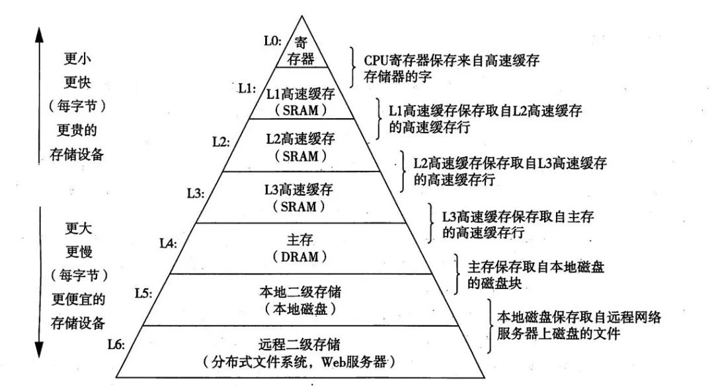

> 摘要：计算机基础之操作系统，包括进程管理、进程调度、进程同步、进程通信，死锁，内存管理与调度、虚拟内存、页面置换算法，设备管理等。

<!-- more -->

## 目录

[TOC]

## 概述

操作系统：是管理计算机硬件与软件资源的程序，向上对用户程序提供接口，向下负责管理硬件资源。

操作系统基本功能：

1. 进程管理：PCB 进程控制、进程同步、进程通信、死锁处理、处理机调度等。
2. 内存管理：内存分配、地址映射、内存保护与共享、虚拟内存等。
3. 设备管理：完成用户的 I/O 请求，方便用户使用各种设备，并提高设备的利用率。主要包括缓冲管理、设备分配、设备处理、虛拟设备等。
4. 文件管理：文件存储空间的管理、目录管理、文件读写管理和保护等。

#### 用户态 VS 内核态

- 用户态：**用户程序**执行时CPU所处的状态，只能访问用户地址空间。
- 内核态（kernel mode）：**操作系统管理程序**执行时CPU所处的状态，能执行（包含特权指令在内的）一切指令，访问系统内所有的存储空间。

用户程序运行在用户态，操作系统内核运行在内核态。

#### 中断分类

CPU从用户态切换到内核态的方法有三种：

1. **外部中断**：由 **CPU 执行指令**以外的事件引起，如 **I/O 完成中断**，表示设备输入/输出处理已经完成，CPU 能够发送下一个输入/输出请求。此外还有时钟中断、控制台中断等。处理器外设的状态变化，是**硬中断**。

2. **异常**/内中断：由 **CPU 执行指令**的内部事件引起，如非法操作码、**地址越界**、算术溢出等。由错误引起的，如文件损坏、缺页故障等。

3. **陷入**：在用户程序中使用**系统调用**，进程在用户态需要使用内核态的功能。系统调用是一种**软中断**。

#### 系统调用

系统调用：进程在用户态需要使用内核态的功能，就进行**系统调用**从而陷入内核，由操作系统代为完成。

- 是操作系统提供的用户接口。

Linux 的系统调用主要有以下这些：

|   Task   | Commands                      |
| :------: | ----------------------------- |
| 进程控制 | `fork(); exit(); wait();`     |
| 进程通信 | `pipe(); shmget(); mmap();`   |
| 文件操作 | `open(); read(); write();`    |
| 设备操作 | `ioctl(); read(); write();`   |
| 信息维护 | `getpid(); alarm(); sleep();` |
|   安全   | `chmod(); umask(); chown();`  |

## 进程管理

#### 进程与线程

进程：程序的一次执行。进程是系统**资源分配**的基本单位。（Windows 任务管理器查看，`.exe` 文件的运行）

线程：进程中的一个执行任务（控制单元），负责当前进程中程序的执行。线程是**CPU任务调度和执行**的基本单位。


区别：

1. **根本区别**：进程是**系统资源分配**的基本单位；线程是**CPU任务调度和执行**的基本单位。
2. **关系**：一个进程中可以有多个线程。~~多个进程可以并发地执行。~~
3. **内存空间**：进程有**独立**内存空间；线程不拥有资源、共享进程的资源；所有线程共享堆和方法区（元空间），每个线程有自己（独享的）PC 程序计数器、虚拟机栈和本地方法栈。
4. **系统开销**：（创建、撤销、切换）进程开销大；线程开销小。
5. **~~通信~~**：进程通信需要借助 IPC 进程间通信；线程间可以通过直接读写**同一进程中的数据**进行通信。
6. **~~调度~~**：线程是独立调度的基本单位。在同一进程中，线程的切换不会引起进程切换，从一个进程中的线程切换到另一个进程中的线程时，会引起进程切换。
7. **健壮**：一个进程崩溃后，（在保护模式下）不会对其他进程产生影响；但一个线程崩溃会导致整个进程崩溃。
8. **独立执行**：进程有程序运行的**入口和出口**；但线程不能独立执行，必须依存于进程。

### 进程调度

**进程调度**：操作系统（根据一定的**调度算法**），（从**就绪态**的进程队列中）选择一个进程来占用CPU资源的**决策过程**，使其执行。

- 目的：为了**确定进程执行顺序**以实现最大 CPU 利用率。
- 目标：提高系统的吞吐量、响应性能和公平性。
- 调度算法可以根据不同的策略，如优先级调度、时间片轮转调度、最短作业优先调度等，来决定选择哪个进程进行执行。

**进程切换**：从一个**正在执行的进程**切换到另一个就绪态的进程的**实际执行过程**。

对比：

1. 进程调度是一个**决策过程**，决定了进程的执行顺序；而进程切换是**实际执行过程**。
2. 进程调度和进程切换的**触发时机**不同。进程调度可以触发进程切换，而进程切换是进程调度的一部分。

#### 进程调度的时机

进程调度的触发时机主要有以下几种情况：需要切换到下一个（就绪）进程来占用CPU资源时，会触发进程调度。

1. 当前进程因等待某个事件、由于某种原因而进入阻塞（如等待I/O操作完成），或当前运行的进程**运行结束**；
2. 当一个新的进程创建完成，或一个阻塞的进程变为就绪态（如I/O操作完成）；
3. 当一个**高优先级的进程**抢占了正在执行的低优先级进程，或者分给当前进程的**时间片**用完；
4. ~~执行完**系统调用**等系统程序后返回用户进程；~~

**进程切换**的触发时机：主要是在进程调度过程中，当操作系统**决定要切换到**一个新的进程时，就会进行进程切换。

##### 不能进行进程调度的情况

1. 在中断处理程序执行时；
2. 在操作系统的内核程序**临界区**内；
3. 其它需完全**屏蔽中断**的原子操作过程中。

#### 进程调度算法/策略

不同环境的调度算法目标不同，因此需要针对不同环境来讨论调度算法。

##### 批处理系统中

批处理系统没有太多的用户操作，在该系统中，调度算法目标是保证吞吐量和周转时间（从提交到终止的时间）。

1. **先到先服务**（FCFS）：从**就绪队列**中选择最先进入的进程，分配资源立即执行直到完成，或发生某事件而被阻塞放弃占用 CPU。非抢占式的调度算法，按照请求的顺序进行调度。
    - 有利于长作业，但不利于短作业，因为短作业必须一直等待前面的长作业执行完毕才能执行，而长作业又需要执行很长时间，造成了短作业等待时间过长。
2. **短作业优先**（SJF）：从就绪队列中选出**估计运行时间最短**的进程。非抢占式的调度算法，按估计运行时间最短的顺序进行调度。
    - 长作业有可能会饿死，处于一直等待短作业执行完毕的状态。因为如果一直有短作业到来，那么长作业永远得不到调度。
3. **抢占式短任务优先**、最短剩余时间优先：按剩余运行时间的顺序进行调度。在短任务的基础上加上抢占机制，也就是不等长任务执行完，只要有短任务，就优先执行短任务，但响应时间依旧没有缩短。
4. ~~高响应比优先。~~

##### 交互式系统中

交互式系统有大量的用户交互操作，在该系统中调度算法的目标是快速地进行响应。

1. **时间片轮转**：每个进程被分配一个时间片，即该进程允许运行的时间，时间片结束后将该任务放回**任务队列**。
    1. 将所有就绪进程按 FCFS 的原则排成一个队列，每次调度时，把 CPU 时间分配给队首进程，该进程可以执行一个时间片。当时间片用完时，由计时器发出时钟中断，调度程序便停止该进程的执行，并将它送往就绪队列的末尾，同时继续把 CPU 时间分配给队首的进程。
2. （抢占式）**优先级调度**：为每个进程**分配一个优先级**，按优先级进行调度。根据内存、时间或其他资源要求**确定优先级**，相同优先级的以 FCFS 方式执行。为了防止低优先级的进程永远等不到调度，可以随着时间的推移增加等待进程的优先级。
3. **多级队列**：根据进程类型不同分配到多个队列当中，每个队列根据不同的类型实行不同的调度算法。
    - 缺点也显而易见，如果同一类型的进程过多，那么就会导致一个队列任务过多而其他队列却没有事情做。
4. **多级反馈队列**：使用多个队列，每个队列的**优先级**、时间片大小不同，最上面的优先权最高。当进程第一次执行都会出现在**第一级队列**，每次执行完一个时间片，都会导致优先级降低。当第一个队列任务为空，才执行第二个队列。
    1. 可以看成是时间片轮转调度算法和优先级调度算法的结合。
    2. 既能使高优先级的进程得到响应，又能使短进程迅速完成。以此长任务队列和短任务队列都会**被公平执行**的同时，短任务队列较短，优先级降低过程中也会更快的被执行完，长任务则会被停滞在低级队列。
    3. 但问题也就在这，如果不断有新进程或者短进程的进入，长进程就会不断地呆在低级队列中不被执行，所以调度算法还会进行周期性更新，每隔一段时间会将所有进程重新放入一级队列重新降级。


##### 实时系统中

实时系统要求一个请求在一个确定时间内得到响应。

分为硬实时和软实时，前者必须满足绝对的截止时间，后者可以容忍一定的超时。

##### 进程调度策略的基本设计指标

1. CPU 利用率；
2. 系统吞吐率，即单位时间内CPU完成的作业的数量；
3. 响应时间；
4. 周转时间：指作业从提交到完成的时间间隔；
    - 平均周转时间；
    - 带权周转时间；
    - 平均带权周转时间；

### 进程切换

**进程切换**：从一个**正在执行的进程**切换到另一个就绪态的进程的**实际执行过程**。

- 是操作系统的核心任务之一，用于在不同进程之间进行 CPU 时间的共享和分配。

#### 进程状态及切换

1. **就绪状态**（ready）：等待被调度。进程获得了除CPU外的一切所需资源，一旦得到CPU分配的**时间片**即可运行。
2. **运行状态**（running）：进程正在CPU上运行（单核 CPU 任意时刻只有一个进程处于运行状态）。
3. **阻塞状态**（waiting）：进程正在等待某一事件、**等待资源**而暂停运行，如**等待某资源可用**或 **IO 操作完成**。即使 CPU 空闲，该进程也不能运行。

注意：

- 只有就绪态和运行态可以相互转换，其它的都是单向转换。
    1. **就绪状态**的进程通过**调度算法**从而获得 CPU 时间，转为运行状态；
    2. 而**运行状态**的进程，在分配给它的 CPU 时间片用完之后就会转为就绪状态，等待下一次调度。
- **阻塞状态**是缺少需要的资源从而由运行状态转换而来。但是该资源不包括 CPU 时间，缺少 CPU 时间会从运行态转换为就绪态。


#### 进程切换的步骤、过程

> 进程切换时操作系统都会发生什么？

当操作系统决定切换到某个新的进程时，

1. 保存当前进程的上下文信息：（如程序计数器、寄存器的值等），并将这些信息存储在进程控制块（PCB）中。
2. 操作系统从**就绪态**的进程队列中选择一个新的进程，（从该进程的PCB中）读取并**加载、恢复新进程的上下文信息**到CPU寄存器中，使其（从上一次停止的地方）开始执行，并获得CPU的控制权。
    1. 包括恢复该进程的硬件上下文（如程序计数器和寄存器的值）
    2. 以及用户级上下文（如存储管理数据，如页表、TLB等）。


#### PCB 进程控制块

进程的控制结构：PCB 进程控制块、程序段、数据段。

进程控制块（Process Control Block, **PCB**）：描述进程的基本信息和运行状态，是进程存在的唯一标识。所谓的创建进程和撤销进程，都是指对 PCB 的操作。

1. 进程标识符（PID）
2. 进程当前状态
3. 进程优先级
4. 资源分配清单
5. 程序和数据地址
6. CPU 现场保护区（用于进程切换）等

### 进程同步

进程同步与进程通信很容易混淆，区别在于：

- **进程同步**：控制多个进程按一定顺序执行；
- **进程通信**、**IPC** 进程间通信：进程间传输信息。

进程通信是一种**手段**，而进程同步是一种**目的**。也可以说，为了能够达到进程同步的目的，需要让进程进行通信，传输一些进程同步所需要的信息。

同步与互斥：

1. 同步：多个进程因为合作产生的直接制约关系，使得进程有一定的**先后执行关系**。
2. 互斥：多个进程在**同一时刻**只有一个进程能进入临界区。

临界资源：

临界区：对临界资源进行访问的那段代码称为临界区。

- 为了互斥访问临界资源，每个进程在进入临界区之前，需要先进行检查。

#### 经典同步问题

##### 生产者-消费者问题

> 使用信号量实现

问题描述：使用一个缓冲区来保存物品，只有缓冲区没有满，生产者才可以放入物品；只有缓冲区不为空，消费者才可以拿走物品。

- 因为缓冲区属于**临界资源**，因此需要使用一个**互斥量 mutex** 来控制对缓冲区的互斥访问。

为了同步生产者和消费者的行为，需要记录缓冲区中物品的数量。数量可以使用**信号量**来进行统计，这里需要使用两个信号量：

1. `empty `记录空缓冲区的数量，在生产者进程中使用；当 empty 不为 0 时，生产者才可以放入物品；
2. `full `记录满缓冲区的数量，在消费者进程中使用；当 full 信号量不为 0 时，消费者才可以取走物品。

##### 哲学家进餐问题

1. 五个哲学家围着一张圆桌，每个哲学家面前放着食物。
2. 哲学家的生活有两种交替活动：吃饭以及思考。
3. 当一个哲学家吃饭时，需要先拿起自己左右两边的两根筷子，并且一次只能拿起一根筷子。

错误解法：如果所有哲学家同时拿起左手边的筷子，那么所有哲学家都在等待其它人吃完、并释放自己手中的筷子，导致**死锁**。

为了防止死锁的发生，可以设置两个条件：

1. 必须同时拿起左右两根筷子；
2. 只有在两个邻居都没有进餐的情况下才允许进餐。


##### 读者-写者问题

允许多个进程**同时对数据进行读操作**，但是不允许**读和写**、以及**写和写**操作同时发生。

1. 一个整型变量 count 记录在对数据进行读操作的进程数量，
2. 一个互斥量 count_mutex 用于对 count 加锁，
3. 一个互斥量 data_mutex 用于对读写的数据加锁。

### 进程通信

**进程通信**、**IPC** 进程间通信：进程间传输信息。进程通信是一种**手段**，而进程同步是一种**目的**。为了能够达到进程同步的目的，需要让进程进行通信，传输一些进程同步所需要的信息。

- 独立进程：不与任何其他进程**共享数据**的进程；

- 协作进程：与其他进程共享数据的进程。

每个进程各自有不同的用户地址空间，任一进程的全局变量在另一进程中都看不到，协作进程间交换数据必须通过内核。

#### 进程间的通信方式

1. 管道、**匿名管道**（`Pipes`）：用于有亲缘关系的父子或兄弟进程间的通信；只支持半双工通信（单向交替传输），数据只能单向流动，存在于内存中的文件。
2. **有名管道**、命名管道（`Names Pipes`） : 去除了管道只能在父子进程中使用的限制。用于任意两个进程通信。严格遵循**先进先出**，以磁盘文件的方式存在。常用于在客户进程和服务器进程之间传递数据。
3. **信号**（`Signal`） ：用于通知接收进程某个事件已发生。
4. **信号量**（`Semaphores`）：本质是一个计数器，用于记录资源能被多少个进程同时访问，用来实现进程之间的互斥与同步，是为了解决共享内存通信方式造成的进场安全问题。解决进程同步相关的问题并避免竞争条件。
5. **共享内存**、共享存储：允许多个进程共享同一块内存空间，可及时看到其它进程对共享内存中数据的更新。协作进程通过向**共享内存**区域读出或写入数据来实现通信。
    - 是最快最有用的一种IPC方式，因为没有内存拷贝的操作，但需要依靠**互斥锁或信号量**来实现同步。
6. **消息队列**（`Message Queuing`）：通过在协作进程间**交换消息**来实现通信。多个不相干的进程可以通过一个消息队列来传递数据。是消息的链表，存放在内存/内核中。
7. **套接字**（`Sockets`)）: 用于不同机器间的进程通信。用于在客户端和服务器间的**网络通信**，是支持 TCP/IP 的网络通信的基本操作单元。

## 死锁

> 见多线程。

死锁：指多个进程/线程因争夺有限的资源或彼此通信而造成**互相等待**（阻塞），若无外力作用，都将无法推进下去。

活锁：任务或执行者没有被阻塞，由于某些条件没有满足，导致一直重复尝试、失败。

解决死锁的方法分为：死锁的预防，避免，检测/定位、恢复。

### 产生死锁的必要条件

以下四个条件同时成立，死锁才会出现：

1. **互斥**：一个资源某一时刻（每次）只能被一个线程占用，直到被释放；
2. **请求与保持**：一个线程因**请求**资源而阻塞时，对已获得的资源**保持**不放；
3. **不剥夺**：线程已获得的资源，在末用完前不能被其他线程强行剥夺；
4. **循环等待**：多个线程间形成头尾相接的循环（环路）等待资源。

### 处理方法

主要有以下四种方法：

1. 鸵鸟策略
2. 死锁检测与死锁恢复
3. 死锁预防
4. 死锁避免

### 鸵鸟策略

把头埋在沙子里，假装根本没发生问题。

> 因为解决死锁问题的代价很高，因此鸵鸟策略这种不采取任务措施的方案会获得更高的性能。

当发生死锁时不会对用户造成多大影响，或发生死锁的概率很低，可以采用鸵鸟策略。

大多数操作系统，包括 Unix，Linux 和 Windows，处理死锁问题的办法仅仅是忽略它。

### 死锁检测/定位和恢复

死锁检测/定位/排查：

1. 用 `jps `或系统的 `ps `命令、任务管理器等工具，确定进程 ID；
2. 调用 `jstack` 工具获取线程栈：`jstack pid`，定位相互间的依赖关系，进而找到死锁；
3. `studio` 打印日志；
4. `JConsole` 可在图形界面进行有限的死锁检测。

恢复的方法：

1. 利用回滚恢复：**逐个撤消**陷于死锁的进程，直到死锁消失；
2. 通过杀死进程恢复：从陷于死锁的进程中**逐个强迫放弃**所占用的资源，直至死锁消失；
3. 利用抢占恢复：从其它进程**强行剥夺足够资源**分配给死锁进程。

### 死锁预防

预防死锁：**破坏**四个必要条件中的任一个：

1. ~~破坏互斥条件~~：允许多个进程同时访问某个资源；
    - 缺点：有的资源不允许被同时访问，如打印机等临界资源需互斥访问，不现实。
2. 破坏请求与保持条件：一次性申请所有的资源，资源不够则不分配；
    - 缺点：线程在执行前不可能知道所需的全部资源；
     - 资源利用率低；
     - 降低并发。
3. 破坏不剥夺条件：占用部分资源的线程申请不到其他需要的资源时，可主动释放占有的资源；
    - 缺点：实现起来困难，会降低系统性能。
4. 破坏循环等待条件：按某一顺序申请资源，反序释放；
    - 缺点：排序困难，增加开销。

### 避免死锁

在资源分配时，借助于算法（如银行家算法）对资源分配进行计算评估，使其进入安全状态。

在程序运行时避免发生死锁。

1. 安全状态：如果没有死锁发生，并且即使所有进程突然请求对资源的最大需求，也仍然存在某种调度次序能够使得每一个进程运行完毕，则称该状态是安全的。安全状态的检测与死锁的检测类似，因为安全状态必须要求不能发生死锁。

2. 单个资源的银行家算法：一个小城镇的银行家，他向一群客户分别承诺了一定的贷款额度，算法要做的是判断对请求的满足是否会进入不安全状态，如果是，就拒绝请求；否则予以分配。

3. 多个资源的银行家算法：

### `AB-BA` 死锁问题

例如，[支付宝转账过程并发交易引起的分布式死锁问题](https://blog.csdn.net/taylorchan2016/article/details/51039362)

问题背景：最常见的一种场景： 支付宝账号A向账号B转账500元。 由于支付宝有几亿用户，账户的保存采用了**分库分表**的方案， 账号A和账号B分别被保存在不同的数据库实例中。

过程见以上链接。

`AB-BA` 死锁问题：

1. 线程1去拿`synchronized`锁A；
2. 线程2拿`synchronized`锁B；
3. 线程1拿锁B，线程2拿锁A，两个线程**相互等待**形成死锁。

```
public class Main {
	public static void main(String[] args) {
		new Thread(()->{ //
			A.a();
		}).start();
		new Thread(()->{
			B.b();
		}).start();
	}

	// 静态内部类
    static class A {
        public static synchronized void a() {
            try {
                Thread.sleep(3000);
            } catch (Exception e) {
                e.printStackTrace();
            }
            System.out.println("get A.");
            B.b();
        }
    }
    // B 类相似
}
```

## 内存管理与调度

内存管理：负责内存的分配与回收、地址转换（将逻辑地址转换为相应的物理地址）、内存寻址等。



- L1-L3 高速缓存：`CPU Cache` （CPU 高速缓存）缓存的是内存数据，用于**解决** CPU 处理速度和内存不匹配的问题；
- 主存：**内存缓存**的是硬盘数据，用于解决硬盘访问速度过慢的问题。

### 逻辑、虚拟、物理地址

- 逻辑地址：在机器语言指令中指定操作数或一条指令的地址。

- 虚拟地址/线性地址：32位或64位的无符号整数。由**虚拟页页号**和**页偏移量**两部分组成。对应页式管理中，线性地址是页式管理转换前的地址。

- 物理地址：实际存在硬件里面的空间地址。

### 虚拟内存

目的是：为了让物理内存扩充成更大的**逻辑内存**，从而让程序获得更多的可用内存。

1. 使应用程序认为它拥有连续的可用内存（连续完整的地址空间），
2. 而实际上，通常被分隔成多个物理内存碎片，还有部分暂存在外部磁盘存储器上，在需要时进行数据交换。

原理：

1. 为了更好的管理内存，操作系统将内存抽象成地址空间。
2. 每个程序拥有自己的地址空间，这个地址空间被分割成多个块，每一块称为**一页**。
3. 这些页被映射到物理内存，但不需要映射到连续的物理内存，也不需要所有页都必须在物理内存中。
4. 当程序引用到不在物理内存中的页时，由硬件执行必要的映射，将缺失的部分装入物理内存并重新执行失败的指令。

#### 局部性原理

表现在以下两个方面：

1. 时间局部性 ：执行的指令和访问的数据、不久后可能再次被执行和访问。
2. 空间局部性 ：一旦程序访问了某个存储单元，不久后附近的存储单元也将被访问。

#### 虚拟存储器

1. 操作系统将内存中暂时不用的内容换到外存上；
2. 当访问的信息不在内存时，再调入内存，这样存储器好像比实际内存大了。

### 常见的内存管理机制

连续分配管理方式：为一个用户程序分配一个连续的内存空间，如块式管理（有碎片）。

非连续分配管理方式：允许一个程序使用的内存分布在离散/不相邻的内存中，如**页式管理**和**段式管理**、**段页式管理**机制。

- 页是物理单位，段是逻辑单位。分别通过**页表**和**段表**对应逻辑地址和物理地址。

#### 分页系统地址映射

内存管理单元（MMU）管理着地址空间和物理内存的转换，其中的页表（Page table）存储着页（程序地址空间）和页框（物理内存空间）的映射表。

一个虚拟地址分成两个部分，一部分存储页面号，一部分存储偏移量。

页表（Page table）存储着页（程序地址空间）和页框（物理内存空间）的映射表。

#### 分段

虚拟内存采用的是分页技术，也就是将地址空间划分成固定大小的页，每一页再与内存进行映射。

分段的做法是把每个表分成段，一个段构成一个独立的地址空间。每个段的长度可以不同，并且可以动态增长。

#### 分页与分段的比较

- 对程序员的透明性：分页透明，但是分段需要程序员显式划分每个段。

- 地址空间的维度：分页是一维地址空间，分段是二维的。

- 大小是否可以改变：页的大小不可变，段的大小可以动态改变。

- 出现的原因：分页主要用于实现虚拟内存，从而获得更大的地址空间；分段主要是为了使程序和数据可以被划分为逻辑上独立的地址空间并且有助于共享和保护。

#### 段页式内存寻址

程序的地址空间划分成多个拥有独立地址空间的段，每个段上的地址空间划分成大小相同的页。这样既拥有分段系统的共享和保护，又拥有分页系统的虚拟内存功能。

- **分段**机制：用于实现逻辑地址到**线性地址**的转换。逻辑地址的段内偏移量与段描述符的 Base 字段相加得到线性地址。
- **分页**机制：将线性地址转换为**物理地址**。通过虚拟地址的页面号，首先在**快表**中查询是否有该映射，查询不成功，在页表中找到该页对应的物理页面号，+页内偏移，得到真实的物理地址。
  - **快表**：在页表方案基础之上，引入了快表来加速虚拟地址到物理地址的转换速度。可理解为一种特殊的高速缓冲存储器（Cache）。
  - 多级页表：避免把全部页表一直放在内存中占用过多空间。


### 页面置换算法

**缺页中断**：地址映射过程中，如果要访问的页面不在内存中，需要 OS 将该页调入主存后再访问。

页面置换算法：当发生**缺页中断**时，如果当前内存中并没有空闲页面、空闲空间，OS 必须在内存选择一个页面将其移出内存，以便为即将调入的页面让出空间。

> 页面置换算法和缓存淘汰策略类似，可以将内存看成磁盘的缓存。在缓存系统中，缓存的大小有限，当有新的缓存到达时，需要淘汰一部分已经存在的缓存，这样才有空间存放新的缓存数据。

页面置换算法的主要目标是：使页面置换频率最低（也可以说缺页率最低）。

淘汰页面的规则有：

1. OPT/最佳页面置换算法：选择最长时间内不再被访问的页面。是一种理论上的算法，无法实现，因为无法知道一个页面多长时间不再被访问。
2. FIFO 算法：淘汰最先进入内存、内存中驻留时间最久的页面。
3. **LRU**（Least Recently Used **最近最久未使用**算法）：记录页面自上次访问以来所经历的时间 T，选择 T 值最大的。
    1. 为了实现 LRU，需要在内存中维护一个所有页面的**链表**。当一个页面被访问时，将这个页面移到链表表头。这样就能保证链表**表尾**的页面是最近最久未访问的。
    2. 因为每次访问都需要更新链表，因此这种方式实现的 LRU 代价很高。
4. LFU （Least Frequently Used 最少使用算法） ：随机地从类编号最小的非空类中挑选一个页面将它换出。
5. 先进先出（FIFO）：选择换出的页面是最先进入的页面。该算法会将那些经常被访问的页面换出，导致缺页率升高。

5. 第二次机会算法：FIFO 算法可能会把经常使用的页面置换出去，为了避免这一问题，对该算法做一个简单的修改：

6. 时钟：第二次机会算法需要在链表中移动页面，降低了效率。时钟算法使用环形链表将页面连接起来，再使用一个指针指向最老的页面。

### 手写 LRU/LFU 调度算法

> 见手撕算法

## 设备管理

### 磁盘结构

1. 盘面（Platter）：一个磁盘有多个盘面；
2. 磁道（Track）：盘面上的圆形带状区域，一个盘面可以有多个磁道；
3. 扇区（Track Sector）：磁道上的一个弧段，一个磁道可以有多个扇区，它是最小的物理储存单位，目前主要有 512 bytes 与 4 K 两种大小；
4. 磁头（Head）：与盘面非常接近，能够将盘面上的磁场转换为电信号（读），或者将电信号转换为盘面的磁场（写）；
5. 制动手臂（Actuator arm）：用于在磁道之间移动磁头；
6. 主轴（Spindle）：使整个盘面转动。


### 磁盘调度算法

读写一个磁盘块的时间的影响因素有：

- 旋转时间（主轴转动盘面，使得磁头移动到适当的扇区上）
- 寻道时间（制动手臂移动，使得磁头移动到适当的磁道上）
- 实际的数据传输时间

其中，寻道时间最长，因此磁盘调度的主要目标是使磁盘的平均寻道时间最短。

#### 1. 先来先服务

> FCFS, First Come First Served

按照磁盘请求的顺序进行调度。

优点是公平和简单。缺点也很明显，因为未对寻道做任何优化，使平均寻道时间可能较长。

#### 2. 最短寻道时间优先

> SSTF, Shortest Seek Time First

优先调度与当前磁头所在磁道距离最近的磁道。

虽然平均寻道时间比较低，但是不够公平。如果新到达的磁道请求总是比一个在等待的磁道请求近，那么在等待的磁道请求会一直等待下去，也就是出现饥饿现象。具体来说，两端的磁道请求更容易出现饥饿现象。

#### 3. 电梯算法

> SCAN

电梯总是保持一个方向运行，直到该方向没有请求为止，然后改变运行方向。

电梯算法（扫描算法）和电梯的运行过程类似，总是按一个方向来进行磁盘调度，直到该方向上没有未完成的磁盘请求，然后改变方向。

因为考虑了移动方向，因此所有的磁盘请求都会被满足，解决了 SSTF 的饥饿问题。
