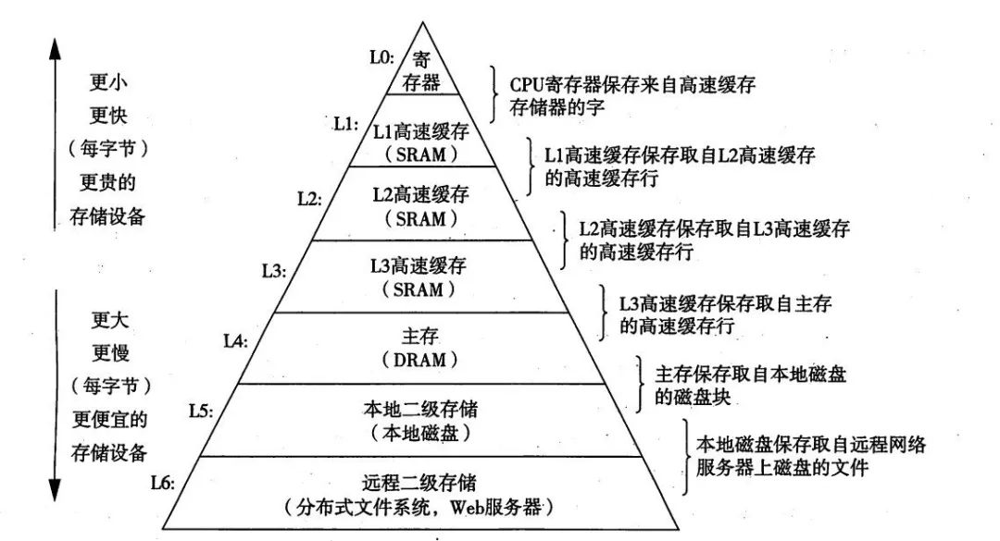

> 摘要：计算机基础之操作系统，包括进 程通信、调度，死锁，内存管理，内存寻址，虚拟内存等。

<!-- more -->

## 操作系统

操作系统：是管理计算机硬件与软件资源的程序，向上对用户程序提供接口，向下负责管理硬件资源，如处理器管理、存储器管理、设备管理、文件管理等。

##### 用户态 VS 内核态

- 用户态：用户程序执行时CPU所处的状态，只能访问用户地址空间。
- 内核态（kernel mode）：操作系统管理程序执行时CPU所处的状态，能执行（包含特权指令在内的）一切指令，访问系统内所有的存储空间。

用户程序运行在用户态，操作系统内核运行在内核态。

CPU从用户态切换到内核态的方法有三种：

1. 系统调用：操作系统提供的用户接口，是一种软中断。
2. 异常/内中断：由错误引起的，如文件损坏、缺页故障等。
3. 外部中断：处理器外设的状态变化，是硬中断。


### 进程

##### 并发 VS 并行

- 串行：多个任务由同一线程按顺序执行；时间上不重叠；一个队列和一台机器。

- 并行：多个任务在多核CPU上，单位时间内同时执行；同一时刻互不干扰；两个队列和两台机器。目前发展方向。

- 并发：多个任务在同一CPU上，按时间片轮流交替执行，逻辑上是同时执行；允许两个任务彼此干扰；两个队列和一台机器。

##### 进程 VS 线程

进程：程序的一次执行。

线程：进程中的一个执行任务（控制单元），负责当前进程中程序的执行。

区别：
1. 根本：进程是系统资源分配的基本单位；线程是CPU任务调度和执行的基本单位；
2. 关系：一个进程至少有一个线程，可有多个线程；
3. 内存空间：进程有独立内存空间；所有线程共享堆和方法区，每个线程独享程序计数器、虚拟机栈和本地方法栈；
4. 开销：进程开销大；线程开销小
5. 崩溃/健壮：一个进程崩溃后，（在保护模式下）不会对其他进程产生影响；但一个线程崩溃会导致整个进程崩溃。
6. 独立执行：进程有程序运行的入口和出口；但线程不能独立执行，必须依存于进程。

进程的控制结构：
1. 进程控制块 PCB：是进程存在的唯一标识
   - 进程标识符（PID）
   - 进程当前状态
   - 进程优先级
   - 资源分配清单
   - 程序和数据地址
   - CPU 现场保护区（用于进程切换）等
2. 程序段
3. 数据段

##### 进程状态

- 创建（new)）
- 就绪（ready)）：进程获得了除CPU外的一切所需资源，一旦得到CPU分配的时间片即可运行。
- 运行（running） ：进程正在CPU上运行（单核 CPU 任意时刻只有一个进程处于运行状态）。
- 阻塞/等待（waiting)）：进程正在等待某一事件而暂停运行，如等待某资源可用或 IO 操作完成。即使处理器空闲，该进程也不能运行。
- 结束（terminated)）：进程正常结束或其他原因中断退出运行。

##### 进程间的通信方式

独立进程：不与任何其他进程共享数据的进程；

协作进程：与其他进程共享数据的进程。

每个进程各自有不同的用户地址空间，任一进程的全局变量在另一进程中都看不到，协作进程间交换数据必须通过内核。

进程间通信（IPC）：~~在内核中开辟一块缓冲区，进程A把数据从用户空间拷到**内核缓冲区**，进程B再（从内核缓冲区）把数据读走。~~

1. 管道
    - 管道/匿名管道（Pipes）：用于有亲缘关系的父子或兄弟进程间的通信；数据只能单向流动，存在于内存中的文件。
    - 有名管道（Names Pipes） : 用于任意两个进程通信。严格遵循先进先出，以磁盘文件的方式存在。

2. 系统 IPC：
    - **消息队列**（Message Queuing、消息传递系统）：是消息的链表，存放在内存/内核中。通过在协作进程间**交换消息**来实现通信。
    - **共享内存**：协作进程通过向**共享内存**区域读出或写入数据来实现通信。~~多个进程访问同一块内存空间，可及时看到其它进程对共享内存中数据的更新。~~需依靠同步操作，如互斥锁和信号量等，最快最有用。
      - 生产者-消费者问题。
    - 信号量（Semaphores）：是一个计数器，用于多进程对共享数据的访问，解决进程同步相关的问题并避免竞争条件。
- 信号（Signal） ：用于通知接收进程某个事件已发生。
  
3. 套接字（Sockets)）: 用于在客户端和服务器间的网络通信，是支持 TCP/IP 的网络通信的基本操作单元。

##### 进程调度

为了确定进程执行顺序以实现最大 CPU 利用率。

进程调度的时机：
1. （在使用抢占式优先级调度的系统中，）有更高优先级的进程就绪时；
2. 分时系统中，分给当前进程的时间片用完；
3. 当前运行的进程由于某种原因阻塞；
4. 执行完系统调用等系统程序后返回用户进程；
5. 当前运行的进程运行结束；

不能进行进程调度的情况：
1. 在中断处理程序执行时；
2. 在操作系统的内核程序临界区内；
3. 其它需完全屏蔽中断的原子操作过程中。

进程调度算法/策略：
1. 先到先服务（FCFS）：从**就绪队列**中选择最先进入的进程，分配资源立即执行直到完成，或发生某事件而被阻塞放弃占用 CPU。
2. 短作业优先（SJF）：从就绪队列中选出估计运行时间最短的进程，忽略了长进程。
3. 时间片轮转/R（(Round Robin）：每个进程被分配一个时间片，即该进程允许运行的时间，时间片结束后将该任务放回任务队列。
4. （抢占式）优先级调度：根据内存、时间或其他资源要求确定优先级，相同优先级的以 FCFS 方式执行。
5. 高响应比优先。
6. 多级队列。
7. 多级反馈队列：也按时间片轮转算法执行任务，设置n个队列，当第一个队列任务为空，才执行第二个队列，依次类推。既能使高优先级的进程得到响应，又能使短进程迅速完成。

进程调度策略的基本设计指标：
1. CPU 利用率；
2. 系统吞吐率，即单位时间内CPU完成的作业的数量；
3. 响应时间；
4. 周转时间：指作业从提交到完成的时间间隔；
    - 平均周转时间；
    - 带权周转时间；
    - 平均带权周转时间；


### 死锁

死锁：指多个进程/线程因争夺有限的资源或彼此通信而造成互相等待（阻塞），若无外力作用，都将无法推进下去。

活锁：任务或执行者没有被阻塞，由于某些条件没有满足，导致一直重复尝试、失败。

解决死锁的方法分为：死锁的预防，避免，检测/定位、恢复。

##### 产生死锁的必要条件

以下四个条件同时成立，死锁才会出现：

1. 互斥：一个资源每次只能被一个线程占用，直到被释放；
2. 请求与保持：一个线程因请求资源而阻塞时，不释放已获得的资源；
3. 不剥夺：线程已获得的资源，在末用完前不能强行剥夺；
4. 循环等待：多个线程间形成头尾相接的循环（环路）等待资源。

##### 预防死锁

破坏四个必要条件中的任一个。

1. 破坏互斥条件：允许多个进程同时访问某些资源；缺点：
	- 有的资源不允许被同时访问，如打印机等临界资源需互斥访问，不现实；
2. 破坏请求与保持条件：一次性申请所有的资源，资源不够则不分配；缺点：
	- 线程在执行前不可能知道所需的全部资源；
    - 资源利用率低；
    - 降低并发；
3. 破坏不剥夺条件：占用部分资源的线程申请不到其他需要的资源时，可主动释放占有的资源；缺点：
	- 实现起来困难，会降低系统性能；
4. 破坏循环等待条件：按某一顺序申请资源，反序释放；缺点：
	- 排序困难，增加开销；
5. 尽量减少同步代码块。

##### 死锁检测/定位和恢复

死锁检测/定位：

1. 用 jps 或系统的 ps 命令、任务管理器等工具，确定进程 ID；
2. 调用 jstack 工具获取线程栈：jstack pid，定位相互间的依赖关系，进而找到死锁；
3. studio 打印日志；
4. JConsole 可在图形界面进行有限的死锁检测。

恢复：

1. 逐个撤消陷于死锁的进程，直到死锁消失；
2. 从陷于死锁的进程中逐个强迫放弃所占用的资源，直至死锁消失；
3. 从其它进程强行剥夺足够资源分配给死锁进程；

##### `AB-BA` 死锁问题

1. 线程1去拿`synchronized`锁A；
2. 线程2拿`synchronized`锁B；
3. 线程1拿锁B，线程2拿锁A，两个线程相互等待形成死锁。

```
public class Main {
	public static void main(String[] args) {
		new Thread(()->{ //
			A.a();
		}).start();
		new Thread(()->{
			B.b();
		}).start();
	}

	// 静态内部类
    static class A {
        public static synchronized void a() {
            try {
                Thread.sleep(3000);
            } catch (Exception e) {
                e.printStackTrace();
            }
            System.out.println("get A.");
            B.b();
        }
    }
    // B 类相似
}
```

### 内存管理

内存管理：负责内存的分配与回收、地址转换（将逻辑地址转换为相应的物理地址）、内存寻址等。

CPU 中的高速缓存大都是为了解决 CPU 处理速度和内存处理速度不对等的问题。



##### 常见的内存管理机制

连续分配管理方式：为一个用户程序分配一个连续的内存空间，如块式管理（有碎片）。

非连续分配管理方式：允许一个程序使用的内存分布在离散/不相邻的内存中，如页式管理和段式管理、段页式管理机制。

- 页是物理单位，段是逻辑单位。分别通过页表和段表对应逻辑地址和物理地址。？

##### 逻辑、虚拟/线性、物理地址

- 逻辑地址：在机器语言指令中指定操作数或一条指令的地址。

- 虚拟地址、线性地址：32位或64位的无符号整数。由虚拟页号和页偏移两部分组成。对应页式管理中，线性地址是页式管理转换前的地址。

- 物理地址：实际存在硬件里面的空间地址。

##### 内存寻址

- 分段机制：用于实现逻辑地址到线性地址的转换。逻辑地址的段内偏移量与段描述符的 Base 字段相加得到线性地址。

- 分页机制：将线性地址转换为物理地址。通过虚拟地址的页面号，首先在**快表**中查询是否有该映射，查询不成功，在页表中找到该页对应的物理页面号，+页内偏移，得到真实的物理地址。
  - 快表：加速虚拟地址到物理地址的转换速度。
  - 多级页表：避免把全部页表一直放在内存中占用过多空间。


### 虚拟内存

虚拟内存：使应用程序认为它拥有连续的可用内存（连续完整的地址空间），而实际上，通常被分隔成多个物理内存碎片，还有部分暂存在外部磁盘存储器上，在需要时进行数据交换。

##### 局部性原理

表现在以下两个方面：

- 时间局部性 ：执行的指令和访问的数据、不久后可能再次被执行和访问。
- 空间局部性 ：一旦程序访问了某个存储单元，不久后附近的存储单元也将被访问。

##### 虚拟存储器

- 操作系统将内存中暂时不用的内容换到外存上；
- 当访问的信息不在内存时，再调入内存，这样存储器好像比实际内存大了。

##### 页面置换算法

> 缺页中断：地址映射过程中，若在页面中发现要访问的页面不在内存中，需要 OS 将其调入主存后再访问。

页面置换算法：当发生缺页中断时，如果当前内存中并没有空闲页面，OS 必须在内存选择一个页面将其移出内存，以便为即将调入的页面让出空间。淘汰页面的规则。

- OPT/最佳页面置换算法：选择最长时间内不再被访问的页面，无法实现。
- FIFO 算法：淘汰最先进入内存、内存中驻留时间最久的页面。
- **LRU**（Least Recently Used 最近最久未使用算法）：记录页面自上次访问以来所经历的时间 T，选择 T 值最大的。
- LFU （Least Frequently Used 最少使用算法） 


