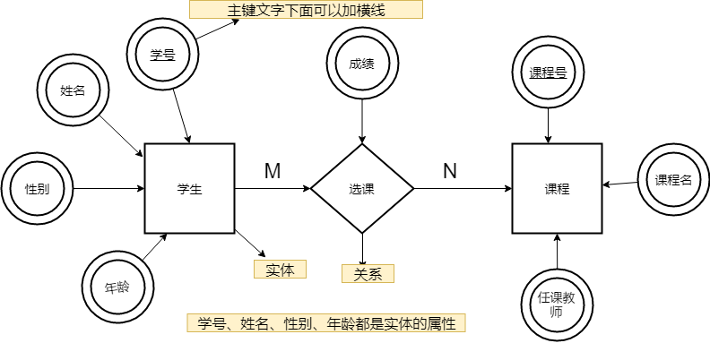
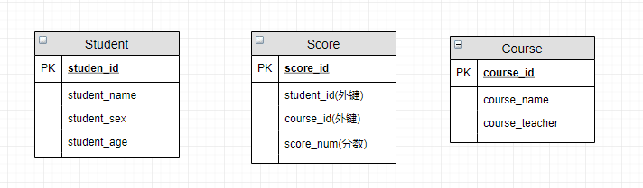

> 摘要：计算机基础之数据库，包括SQL语句书写，数据类型，索引/锁，MySQL等。

<!-- more -->

## 目录

[TOC]

## 数据库基础

### 什么是数据库, 数据库管理系统, 数据库系统?

**数据库系统**（Data Base System，简称 **DBS**）：通常由软件、数据库和数据管理员组成。

* **数据库**（DataBase 简称 DB）：就是信息的集合、或者说数据库是由数据库管理系统管理的**数据的集合**。
* **数据库管理系统**（Database Management System 简称 **DBMS**）：是一种**操纵和管理**数据库的大型软件，通常用于建立、使用和**维护**数据库。
* **数据库管理员**（Database Administrator, 简称 **DBA**）：负责全面管理和控制数据库系统。

数据库系统基本构成如下图所示：


### SQL 关系型数据库

##### SQL 关系型数据库和NoSQL 非关系型数据库的区别

- **SQL 关系型数据库**：建立在**关系模型**的基础上的数据库。
    - 关系模型表明了数据库中所存储的数据之间的联系（一对一、一对多、多对多）。
    - 由多张能互相连接的表组成。数据都被存放在了各种表中（比如用户表），表中的每一行就存放着一条数据（比如一个用户的信息）。
    - 主要用于执行**规模小而读写频繁**，或大批量 极少写~~访问~~的事务。
    - 借助于集合、代数等数学概念和方法处理数据。
- **NoSQL 非关系型数据库**：
    - 关系数据库在一些数据敏感的应用中读写性能较差，如为**海量文档**创建索引、高流量网站的网页服务，及发送流式媒体，故采用 **NoSQL**；
    - 优点：**高效读写海量数据**，支持**高并发**；支持 `key-value`、文档、图片等形式，可用硬盘或随机存储器作为载体，不支持SQL；

##### 数据模型

数据库按照数据结构来组织、存储和管理数据，共有三种模型：

1. 层次模型：轻量级数据访问协议，如树；
2. 网状模型：大型数据储存；
3. **关系模型**：表明数据库中存储数据间一对一、一对多、多对多的联系，如表格。

##### 分类

- **SQL 关系型数据库**：
    1. 商用数据库，如：`Oracle`，`SQL Server`，DB2 等；
    2. 开源数据库，如：
        1. **`MySQL` Community Server** (GPL) 社区版：主要用于业务数据存储；
        2. MariaDB 分支：开源社区用来规避 MySQL 闭源的风险，大部分跟 MySQL 5.5 以前的版本使用差不多；
        3. PostgreSQL 等；
    3. 桌面数据库，如：微软 `Access`，适合桌面应用程序使用；
    4. 嵌入式数据库，如：`SQLite`（如微信本地的聊天记录的存储），适合手机应用和桌面程序。
- **NoSQL 非关系型数据库**：
    1. **Redis**：Key-value；RAM 存储；缓存数据存储；
    2. **ElasticSearch**：搜索数据存储；
    3. **MongoDB**：Nodejs 在 Mongoose 包的帮助下 JSON 的数据格式直接插入；用户行为分析数据存储；
    4. Apache Cassandra（Facebook 使用、高度可扩展）、Dynamo；
    5. MemcacheDB 和 HBase 等。
### 元组, 码, 候选码, 主码, 外码, 主属性, 非主属性

- **元组**：表中的一行/一条记录；
- **码**：码就是能唯一标识实体的某个或**某几个**属性的组合，用于区分每条记录，~~对应表中的列~~；
  - **候选码**：能唯一标识一条记录的最小属性集和；~~可被选为主码的属性或属性组；~~
- **主键（主码） `id`**：用于唯一标识一条记录的**某个**属性，一个表只能有一个主键。不可重复、不可空。主码是从候选码中选出来的。 一个实体集中只能有一个主码，但可以有多个候选码。`unique + not null`。
- **外键（外码）**：用来和其他表建立联系，是**另一个表**的主键，一个表可有多个外键。可重复、可为空。
- **主属性**：所有候选码属性的**并集**；
    - **非主属性**：相对于主属性来说，不包含在任何一个候选码中的属性。

**主码 id 选取的基本原则**：选取完全业务无关的字段，不可用身份证号、手机号、邮箱地址等（看上去唯一但可能会更改）。可用作 `id` 字段的类型有：

1. 自增整数类型：INT 上限约21亿，BIGINT约922亿亿。
2. 全局唯一GUID字符串类型：GUID算法通过网卡MAC地址、时间戳和随机数保证任意计算机在任意时间生成的字符串都是不同的。

### 主键和外键有什么区别?

### 不用外键与级联更新

一切外键概念必须在应用层解决：

- 当表越来越多，关系越来越复杂时，一般在**设计数据库**时通过外键来标注表与表间的关系；
- 但在数据库中往往不使用外键，而是通过**逻辑**来关联。

**级联更新**：更新当前表的主键时、会触发其它表的对应外键更新。

- 如：学生表中的 student_id 是主键，那么成绩表中的 student_id 则为外键。
- 如果更新学生表中的 student_id，同时触发成绩表中的 student_id 更新，即为级联更新。

为什么不要用外键呢？

1. 增加了**复杂性**： 每次做DELETE 或UPDATE都必须考虑外键约束，需额外维护；**增加了额外工作**： 去检查，来保证数据的的一致性和正确性，消耗资源；
2. 外键影响数据库的**插入速度**；
3. 外键的**主从关系**是定的，假如那天需求有变化，数据库中的这个字段根本不需要和其他表有关联的话就会增加很多麻烦。
4. 级联更新是**强阻塞**，存在数据库**更新风暴**的风险；
5. 适用于单机**低并发**，不适合分布式、高并发集群；
6. 对**分库分表**不友好，分库分表下外键无法生效；

### 数据库范式

##### 函数依赖

1. **函数依赖** ：若在一张表中，在属性（或属性组）X 的值确定的情况下，必定能确定属性 Y 的值，那么就可说 `Y` 函数**依赖于** `X`，写作 `X → Y`。
2. **部分函数依赖** ：如果 `X→Y`，且存在 X 的一个真子集 X0（部分关键字），使得 `X0→Y`，则称 `Y` 对 `X` 部分函数依赖。
    - 如学生基本信息表 R关系（学号，身份证号，姓名）中，（学号，身份证号）->（姓名），（学号）->（姓名），（身份证号）->（姓名）；
    - 姓名部分函数依赖于（学号，身份证号）；
3. **完全函数依赖**：在一个关系中，某个非主属性数据项依赖于**全部关键字**。
    - 不同班级学生编号可能相同，在 R 关系中，（班级，学生编号）->（姓名），但（学生编号）->（姓名）不成立，（班级）->（姓名）不成立，姓名**完全函数依赖于**（班级，学生编号）；
4. **传递函数依赖** ： 某个字段依赖于主键，而有其他字段依赖于该字段。会导致数据冗余和异常。
    - 在关系模式 R(U)中，设 X，Y，Z 是 U 的不同的属性子集，如果 **X 确定 Y**、Y 确定 Z，且有 X 不包含 Y，Y 不确定 X，（X∪Y）∩Z=空集合
    - 如，在关系 R（学号 , 姓名, 系名，系主任）中，学号 → 系名，系名 → 系主任，**非主属性**系主任对于学号有传递函数依赖。

##### 范式

用于规范建表，划分字段。

1. `1NF`（第一范式）：对属性的原子性约束，要求属性（表中的字段）**不可再分**（为其他字段）。是所有关系型数据库的最基本要求，即创建的表一定满足第一范式。
2. `2NF`（第二范式）：对记录的惟一性约束，要求**主键**可以唯一标识记录。
    - 在 `1NF` 基础上，消除了非主属性对于码的**部分函数依赖**，非主属性都依赖于**主键**。
3. `3NF`（第三范式）：对**字段冗余性**的约束，要求字段没有冗余，即任何字段不能由其他字段派生出来。
    - 在 `2NF` 基础上，消除了非主属性对于码的**传递函数依赖**（任何非主属性不依赖于其它非主属性）。
    - 基本上解决了数据冗余，插入异常，修改异常，删除异常的问题。
    - 比如在关系 R(学号 , 姓名, 系名，系主任)中，学号 → 系名，系名 → 系主任，所以存在非主属性系主任对于学号的传递函数依赖，所以该表的设计，不符合 3NF 的要求。
4. `BCNF`：主属性内部不能有**部分或传递依赖**。

### 数据库设计

> 数据库设计就是建立数据存储模型。

##### 设计步骤

1. **需求分析** : 包括数据、功能和性能需求。根据功能模块划分实体（往往指现实世界中一个完整单位），实体间的关系，各实体的属性、可选唯一标识属性（主键）、数据存储特点/生命周期（是否常用，分库分表，永久存储，定期归档，定期清空等）。
2. **概要设计** : 主要用 E-R 模型进行设计，如用 Visio 画 `E-R` 图。
3. **逻辑设计/详细设计** : 通过将 E-R 图转换成表，实现从 E-R 模型到关系模型的转换，并应用三大范式优化。
4. **物理结构设计** : 为设计的数据库选择合适的存储结构和存取路径，做具体的技术选型。
5. 数据库**实现** : 包括 SQL 编程（创建数据库表）、测试和试运行。
6. 数据库的**运行和维护** : log 日志，根据新需求进行建表、索引优化、大表拆分。

##### E-R 图

E-R 图 / 实体-联系图：提供了表示**实体类型、属性和联系**的方法，用来描述现实世界的概念模型。 它是描述现实世界**关系概念模型**的有效方法。 是表示概念关系模型的一种方式。

- 实体：矩形；
- 属性： <u>唯一标识属性（主键）</u>、派生属性、可选属性、联系属性；
- 关系：1:1，1:N，M:N；
    - 每个学生可以选若干门课程，同一门课程也可以被若干人选择，所以它们之间的关系是多对多（M: N）
- 元组、候选码、主码、域；
- 多值属性：

E-R 图中的冲突有三种：属性冲突、命名冲突、结构冲突。



转换为数据库实际的**关系模型**：



##### UML 类图

> 见面向对象。

### 存储过程

存储过程：是一组为了完成特定功能的 SQL 语句集合，中间加了逻辑控制语句。更偏向于业务逻辑。

- 优点：
    - 在业务比较复杂时非常实用，如一个操作需写一大串 SQL 语句，存储过程方便下一次的调用。
    - 存储过程一旦调试完成通过后就能稳定运行；
    - 比单纯 SQL 语句执行要快，因为存储过程是预编译过的。
- 缺点：存储过程难以调试和扩展，没有移植性，消耗数据库资源。禁止使用。

```
CREATE PROCEDURE <过程名> ( [过程参数[,…] ] ) <过程体>
[过程参数[,…] ] 格式
[ IN | OUT | INOUT ] <参数名> <类型>
```

## MySQL

是一种关系型数据库，主要用于**持久化存储**系统中的数据，建立在**关系模型**的基础上。

MySQL 的默认端口号是 **3306**。

### 优势

1. **开源**。
2. 用 C 和 C++ 编写，并用了多种编译器进行测试，保证源代码的**可移植性**。
3. **跨平台**：支持 Windows、Linux、Mac OS 等操作系统。SQL Server 只支持 Windows。
4. 为多种**编程语言**提供了API，包括 C、C++、C#、`Java`、PHP、Python、Ruby 等。
5. 支持**多语言编码**，如中文的 `GB2312`、BIG5、日文的 Shift JIS 等都可用作数据表名和列名。
6. 支持**多线程**，充分利用 CPU资源，支持多用户。
7. 基于 **C/S 模式**的 DBMS。既能作为单独的应用程序在 C/S 网络环境中运行，也能作为程序库嵌入其他软件。
    - 另一类是基于共享文件系统的 DBMS，如 Microsoft Access 和 FileMaker，主要用于桌面用途，不适合高端或更关键的应用。
8. 提供 TCP/IP、ODBC 和 JDBC 等多种**数据库连接**途径。
9. 提供用于管理、检查、优化数据库操作的**管理工具**。如默认 MyCli，Navicat、MySQL Workbench 图形客户端；phpMyAdmin。
10. 优化的**SQL**查询算法，有效地提高查询速度。可处理拥有上千万条记录的大型数据库。

### 安装

##### 版本号

MySQL 的命名机制由 3 个数字和 1 个后缀组成，如 `mysql-5.7.21`：

> 源自Github 上面的[语义化版本标准](http://semver.org/lang/zh-CN/) 

1. 第 1 个数字 `5` 是**主版本号**：用于描述文件的格式，所有版本 5 的发行版都有相同的文件夹格式。表示做了不兼容的 API 修改。
2. 第 2 个数字 `7` 是**发行级别**：表示做了向下兼容的**功能性新增**；+ 主版本号组合 = 发行序列号，描述了稳定的特征集。
3. 第 3 个数字 `20` 是在此发行系列的版本号：随每次新发行的版本递增。表示做了向下兼容的**问题修正**。通常选择已发行的最新版本。

##### 使用

- MySQL Client 的可执行程序是 mysql，在其中输入的 SQL 语句通过**TCP连接**发送到 MySQL Server；
- MySQL Server 的可执行程序是 mysqld，本机默认IP地址为 `127.0.0.1:3306`，可用远程IP。

```
mysql -h 127.0.0.1:3306 -u root -p
mysqld start/stop/restatr/status
```

### 字符集和字符编码

数据库和表的字符集统一用 UTF8，兼容性更好。

```
CHARACTER SET UTF8
```

乱码的本质： 编码和解码时用了不同或不兼容的字符集 。

- 字节：1 个字节（Byte）等于 8 个 bit 位，可表示 256 个状态，是计算机里最基本的存储单位；
- 字符：指计算机中使用的英文字母、数字、符号、中文等；

二者表示的含义不同，在不同编码中，字符和字节的对应关系不同。

1. `ASCII` 字符集和编码：用 7 bits 位表示一个字符，**共 128 个字符**，包括控制字符、英文大小写字符、阿拉伯数字、英文标点符号等；
    1. `ASCII` 扩展字符集用 8 bits 位表示一个字符，共 256 个字符；一个英文字符占 1Byte；
    2. 缺点：只支持英文和部分西欧语言，不支持其他语言。
2. `GB2312` 字符集和编码：一个英文字符占 1Byte，和 `ASCII` 码相同；非英字符（如中文）占 **2Byte**。涵盖了绝大部分常用汉字，不支持部分生僻字和繁体字。
    1. `GBK`：兼容并扩展 `GB2312` 字符集；
    2. 缺点：各地区的本地编码方案（如 GB2312）互相不兼容，容易出现乱码。
3. `BIG5` 字符集&编码：支持港澳台**繁体**中文。
4. `Unicode` 字符集和 `UTF` 编码：包含了世界上几乎所有已知字符。
    1. `UTF-8` **字符编码方案**：是一种针对 `Unicode` 的**可变长度**字符编码（定长码），也是一种前缀码，可用来表示 `Unicode` 标准中的任何字符，且其编码中的**第一个字节**仍与 `ASCII` 兼容；用 `1-4 `个字节为每个字符编码；目前使用最广，所有互联网协议都支持；
    2. `UTF-16` 字符编码方案：一个英文字母字符或一个汉字字符存储都需 **2 个字节**（Unicode 扩展区的一些汉字存储需 4 个字节）；
    3. `UTF-32` 字符编码方案：任何字符的存储都需 4 个字节。

MySQL 字符集中有两套 `UTF-8` 编码的实现：

1. **`utf8`** ： 只支持`1-3`个字节 ；一个英文字符占 `1Byte`，和 `ASCII` 码相同；一个中文字符占 **`3Byte`**；
2. **`utf8mb4`** ： UTF-8 的完整实现，可存储 `emoji` 符号、较复杂的文字、繁体字，占 **`4` 个字节**。

```
SELECT LENGTH("轻松工作");            -- 返回为 12 位
SELECT CHARACTER_LENGTH("轻松工作");  -- 返回为 4 字节
```

### 数据类型

##### MySQL 数据类型、及对应的 Java 包装类、JDBC 类型

> 注意：类型应为大写，暂用小写便于记忆；大于显示宽度也可插入。


|          | MySQL数据类型   | Java包装类   | JDBC类型      | 占用空间                | 范围                     |
| -------- | --------------- | ------------ | ------------- | ----------------------- | ------------------------ |
| 整型     | `tinyint`       | `Byte`       | TINYINT       | 1 Byte                  | 0 ~ 255                  |
|          | **`smallint`**  | `Short`      | SMALLINT      | 2 Byte                  | 0 ~ 65535                |
|          | **`mediumint`** | `Integer`    | INTEGER       | 3 Byte                  | 0 ~ 1677w                |
|          | `int/integer`   | `Integer`    | INTEGER       | 4 Byte                  | 0 ~ 42亿                 |
|          | `bigint`        | `Long`       | BIGINT        | 8 Byte                  |                          |
| 浮点型   | `float(M, D)`   | `Float`      | **REAL**      | 4 Byte                  |                          |
|          | `double(M, D)`  | `Double`     | DOUBLE        | 8 Byte                  |                          |
| 定点数   | `decimal(M, D)` | `BigDecimal` | DECIMAL       | 由定义的宽度决定        | 每 4 字节可存储 9 位数字 |
|          | `numberic`      | `BigDecimal` | DECIMAL       | 由定义的宽度决定        |                          |
| 字符串   | `char(M)`       | `String`     | CHAR          | 固定长度，1 <= M <= 255 |                          |
|          | `varchar(N)`    | `String`     | VARCHAR       | 可变长度                |                          |
|          | **`tinytext`**  | `String`     | **VARCHAR**   | 可变长度                |                          |
|          | `text`          |              |               |                         |                          |
|          | `blob`          |              |               |                         |                          |
|          | `binary`        |              | BINARY        |                         |                          |
| 日期时间 | `date`          | `Date`       | DATE          |                         | YYYY-MM-DD               |
|          | `year`          | `Date`       | **DATE**      |                         | YYYY                     |
|          | `time`          | `Date`       | TIME          |                         | HH:MM:SS                 |
|          | `datetime`      | `Date`       | **TIMESTAMP** | 8 Byte                  | YYYY-MM-DD HH:MM:SS      |
|          | `timestamp`     | `Date`       | TIMESTAMP     | 4 Byte                  | YYYY-MM-DD HH:MM:SS？    |

##### 四大类数据类型及主要用法：

> 字段类型选择原则

1. **数值类型**：可用 `UNSIGNED` 修饰；
   
   1. 整型：
      1. `tinyint unsigned`（1 Byte）：0 ~ 255；对应 Java 中的 `Byte` 类型；可表示 bool；
      2. **`smallint`**（2 Byte）：0 ~ 65535；            对应 Java 中的 `Short` 类型；
      3. `mediumint`（3 Byte）：0 ~ 1677w；          对应 Java 中的 `Integer` 类型；
      4. `int/integer`（4 Byte）/`int(M位数)`：0 ~ 42亿；对应 Java 中的 `Integer` 类型； 
      5. `bigint`（8 Byte）：对应 Java 中的 `Long` 类型，否则可能会 Integer 溢出。
          - 如 `id unsigned bigint not null auto_increment, primary key (id)`。
   2. 浮点型：可用`(精度M, 标度D)`，分别表示（总位数/显示宽度，**小数位数**）。注意浮点数相减和比较运算时易出误差问题。
      1. `float(M, D小数位数)`：比较粗略但开销相对较少，常用浮点型；对应 JDBC 中的`real`（4 Byte）；
      2. `double(M, D)`（8 Byte）
   3. 定点数
      - `decimal(M, D小数位数)`：优点是不存在**舍入误差**，值和计算都是精确的。不同于浮点数的四舍五入，实际上是以**字符串**的形式存放；用于**对精度要求较高**时，如金额、货币、科学数据；占用空间由定义的宽度决定，每 4 个字节可存储 9 位数字，且**小数点**占用1 Byte。
      - `numeric`
   
2. **字符串类型**：电话号码、信用卡号含非数字字符（空格和短划线），及避免丢失开头的 `0`，不能存为数值类型。对应 Java 中的 `String`，`length()` 返回的是 `char`（占 2Byte ）的数量。
   
   1. `CHAR(M)`：固定长度，存入的数据均占 M 字节，1 <= M <= 255；会自动删除插入数据尾部的空格；处理速度快，但浪费空间。
   2. ~~`VARCHAR(M)`~~：可变长度，按照**实际的长度**存储；MySql 5.0 之前的版本，指最多存储 **M 个字节**，1 <= M <= 255；
   3. `VARCHAR(N)`：可变长度，按照**实际的长度**存储；MySql 5.0 之后的版本，指最多存储 **N 个字符（**数字、字母或汉字）的数据；
      1. MySQL 规定：一行数据的最大长度是 65535 字节，是所有列共享（相加）的，所以 VARCHAR 的最大值受此限制；`UTF-8` 编码中，一个英文字符占 1 Byte，**中文占 3 Byte**，故 1 <= 字符数 N <= 65535 / 3；
      2. 另外需 1-2 个**额外字节**记录/存储长度 N 的值：N <= 255 时需 1 Byte（2^8）；N >255 时则需 2 Byte；`varchar(255)` 比 `varchar(256)`少占用 1 个（记录 N 的额外）字节；
   4. 其它文本字符串类型：text、blob、binary等
      1. `tinytext(255), text(65535，64k), mediumtext, longtext(4GB)`
      2. `tinyblob, blob, mediumblob, longblob`：避免使用
   3. `binary, varbinary`
   
3. **日期时间类型**：统一对应 Java 中的 Date 类；

   1. `date`：YYYY-MM-DD
      
      - `year`：YYYY：对应 JDBC 中的 DATE；
   2. `time`：HH:MM:SS
   3. `datetime`（8Byte）：YYYY-MM-DD HH:MM:SS，create_time；对应 JDBC 中的 `TIMESTAMP`；
   4. `timestamp`（4Byte）：YYYY-MM-DD HH:MM:SS；用于需记录时区的 create_time；
      
   - 时间？数据： `int(timestamp) > datetime > char > varchar`。
      - 用 int 存储时间取值范围为 `1970-01-01 00:00:01 ~ 2038-01-19-03:14:07`，超出范围的用 `DATETIME`，还需转换为时间，若**访存频繁**则用 datetime。
      
      ```
      # 用于需记录时区的 create_time
      INSERT INTO time_zone_test(date_time, time_stamp) VALUES(NOW(), NOW());
      ```

4. **其它类型**

   1. `enum(‘v1’, ...)`：最多 65535 个元素；从多个值中取一个时用 ENUM；避免使用；
   2. `set(‘v1’, ...)`：最多 64 个成员；取多个值时用SET；

      ```
      CREATE TABLE tab ( gender SET('man', 'woman', 'no') );
      INSERT INTO tab VALUES ('man', 'man');
      ```

##### `char VS varchar`

字符字段类型的选择原则：

   1. 一般 `<` 50个**字节**时用 `char` （除个别很少用到的字段，也可用 `varchar` 来节省空间）；
   2. 对于 `MyISAM `存储引擎，最好用**固定长度**的数据列（CHAR ）。可使整个表静态化，从而使数据**检索更快**，用空间换时间；
   3. 对于 **`InnoDB` 存储引擎**，最好用**可变长度**的数据列（VARCHAR）。`InnoDB `数据表的存储格式不分固定长度和可变长度，因此用 CHAR 不一定比用 VARCHAR 更好，但由于 VARCHAR 是按照**实际的长度**存储，更**节省空间**，对磁盘 I/O 和数据存储总量更好。

### SQL 语句

标准 SQL ：指符合国际标准的 SQL；

方言：各数据库支持的各自扩展功能。

#### SQL 语言分类

1. **DDL**（`Data Definition Language`）数据库定义语言：主要用于定义数据库/数据表结构、视图、索引和触发器等对象。主要由 `DBA` 数据库管理员使用。`CREATE、ALTER、DROP` 等语句。
2. **DQL**（`Data Query Language`）数据库查询语言：用于查询表记录，最频繁的数据库操作。`SELECT` 语句。
3. **DML**（`Data Manipulation Language`）数据库操作语言：用于插入、更新、删除表记录。`INSERT、UPDATE、DELETE` 语句。
4. **DCL**（`Data Control Language`）：数据库控制语言。主要用于控制用户的访问权限。其中：
   1. `GRANT`：增加用户权限；
   2. `REVOKE`：收回用户权限；
   3. `COMMIT`：确认对数据库中的数据进行的变更；
   4. `ROLLBACK`：取消对数据库中的数据进行的变更。

```
-- 允许远程连接的 IP 地址，“%”表示不限制连接的 IP
-- 123456 为用户密码
MySQL> grant all PRIVILEGES on <数据库名.表名> to root@'127.0.0.1/%' identified by '123456' [WITH GRANT OPTION];

-- 开启MySQL的远程帐号，立即生效
FLUSH PRIVILEGES;
```

#### DDL 数据库/表结构操作

> 反引号` `` `用于区分MYSQL的保留字与普通字符、识别符，如用于表名、列名等，如 \`status\`；
>
> 单引号` '' `、双引号用于字符串。

##### 数据库操作

- 登录数据库：`mysql -uroot -proot`
- 创建数据库：`create database test`
- 查看所有数据库：`show databases`
- 删除数据库：`drop database test`
- 使用数据库：`use test`
- 查看所有数据表：`show tables`

##### 表操作

- 创建表：`create table dept(deptno int(2),deptname varchar(10))`
- 查看表的定义：`desc emp`
- 查看表定义（详细）：`show create table emp \G`
- 删除表：`drop table emp`
- 修改表名：`alter table emp rename emp1`

字段：

- 添加表字段：`alter table emp add column age int(3)`
- 删除表字段：`alter table emp drop column age`
- 修改表字段：`alter table emp modify ename varchar(20)`
- 字段改名：`alter table emp change age age1 int(4)`

##### 常用语句

1. 创建：`CREATE` database **[IF NOT EXISTS]** <数据库名> / table <表名> 

    ```
    [[DEFAULT] CHARACTER SET <字符集名>] 
    [[DEFAULT] COLLATE <校对规则名 utf8_chinese_ci>];
    ```

2. 删除：`DROP` database [ **IF** **EXISTS** ] <数据库名> / table 表名;
3. 选择：`USE` <数据库名>;
4. 修改数据库：比较麻烦，不支持直接修改，需要通过其它方式**间接修改**。比如先创建新库，再导出导入数据。
5. 修改：`ALTER` TABLE <表名> [修改选项]，修改选项有：
    1. `RENAME TO` <新表名>，`rename table old_db.tb to new_db.tb`;
    2. `ADD COLUMN` <新列名> <类型> [约束条件] [FIRST | after <已存在的列名>]
    3. `DROP COLUMN` <列名>
    4. `CHANGE COLUMN` <旧列名> <新列名> <新列类型不能为空>：不仅用于修改现有列的定义，还可以用于**重命名列**；
    5. `MODIFY COLUMN` <列名> <**类型**> { `SET DEFAULT` <默认值>}：修改现有列（字段）的定义，**数据类型**和约束，如默认值、是否允许 NULL 等；
        - `ALTER TABLE employees MODIFY COLUMN salary DECIMAL(10, 2) NOT NULL;`
    6. `CHARACTER SET` <字符集名>
    7. `COLLATE` <校对规则名>

6. 修改存储引擎：`ALTER TABLE <表名> ENGINE=<存储引擎名>;`

##### 列属性/列约束

1. `NULL` 约束：表示当前列可为 null；
    - `NOT NULL` 约束：在添加数据时没有指定值会报错；常搭配 `AUTO_INCREMENT` 用于 id 字段；
2. `DEFAULT` <默认值>：当前字段的默认值；
3. `AUTO_INCREMENT`：自动增长约束，必须为索引（主键或 `unique`），只能用于一个字段、不可为空（`NOT NULL` ）；只能是整数类型，默认从1开始，通过表属性 `auto_increment = x` 设置起始值；
4. `PRIMARY KEY`：主键，不可空、不可重复；
5. `FOREIGN KEY`：外键约束；
6. `COMMENT`：注释；
7. `UNIQUE`：唯一索引（唯一约束），**可空**、不可重复，可在多个字段定义；主键和唯一约束的创建需依靠索引，没有已建好的索引，Oracle 会自动建立唯一索引。
8. `CHECK`：检查约束；

```
-- 在定义完列后直接用关键字指定约束
<字段名> <数据类型> 约束关键字/UNIQUE
ALTER TABLE <数据表名> ADD CONSTRAINT <约束名> UNIQUE(<列名>);
ALTER TABLE <数据表名> CHANGE COLUMN <字段名> <数据类型> DEFAULT <默认值>/NULL;
ALTER TABLE <表名> DROP INDEX <约束名>;

-- 如果数据库中存在user_accounts表，就从数据库中删除
DROP TABLE IF EXISTS `user_accounts`;

-- 创建数据库表
CREATE TABLE `user_accounts` (
  `id`        int(100) unsigned NOT NULL AUTO_INCREMENT [primary key],
  `password`  varchar(32) 		NOT NULL DEFAULT '' COMMENT '用户密码',
  `reset_pwd` tinyint(32) 		NOT NULL DEFAULT 0  COMMENT '用户类型：0-不需重置密码；1-需重置',
  `mobile`    varchar(20)  		NOT NULL DEFAULT '' COMMENT '手机',
  `create_at` timestamp(6) 		NOT NULL DEFAULT CURRENT_TIMESTAMP(6),
  `update_at` timestamp(6) 		NOT NULL DEFAULT CURRENT_TIMESTAMP(6) ON UPDATE CURRENT_TIMESTAMP(6), -- 
  PRIMARY KEY (`id`),
  -- 创建唯一索引，不允许重复
  UNIQUE INDEX idx_user_mobile(`mobile`)
) ENGINE=InnoDB DEFAULT CHARSET=utf8 COMMENT='用户表信息';
```

#### DQL SELECT 和约束

在表查询中，一律不要使用 `*` 作为查询的字段列表，需要哪些字段必须明确写明。 

1. 增加查询**分析器**解析成本；
2. 增减字段容易与 `MyBatis` 中的 `resultMap` 配置不一致；
3. 无用字段增加网络消耗，尤其是 text 类型的字段；

##### 投影查询

只返回某些列
`SELECT 列1 别名1, 列2 别名2 FROM ...`

##### FROM 子句

##### 多表查询/笛卡尔查询

每一行都两两拼在一起，行数为多表的乘积，结果集可能非常巨大。

```
SELECT
    s.id sid,
    s.name,
    s.score,
    c.id cid,
    c.name cname
FROM students [AS] s, classes [AS] c
WHERE s.gender = 'M' AND c.id = 1;
[GROUP BY <group>
[HAVING <expression> [{<operator> <expression>}…]]
[ORDER BY <order>]
[LIMIT[<offset>,] <row count>]
```

##### WHERE 子句

运算符：

```
and, or, not, xor：返回NULL、0、1
&&, ||, !,
<=, <, >=, >, 
=, !=/<>, <=>
```

1. `=` 表示比较两个值是否相等，但不能用于比较`NULL`；
    - `NULL=NULL` 的返回结果是 `NULL`，而不是 `true`;
2. `<=> `表示安全的等于；不同于`=`，当比较的两个值相等或都为 `NULL `时返回 `true`;
    - 当一个操作数为 `NULL `时，其返回值为 0 而不为 `NULL`;
    - `NULL<=>NULL` 的返回结果是 `1(true)`;
3. `NULL<>NULL` 的返回结果是 `false`;
4. `NULL<>1` 的返回结果是 `true`;

```
is [not] null，更推荐ISNULL()
[not] between and：包括起始值和终止值
[not] like [BINARY区分大小写]："%"代表任何长度的字符串，不能匹配 NULL，"_"代表单个字符
[not] in ... ：尽量不用
is [not] ture/false/unknown：检验某个值的真假
... [NOT] EXISTS
```

##### HAVING 条件子句

类似 `where`，**过滤分组**，对分组后/查询结果再次过滤，可用**聚合函数**、字段别名。

##### 排序子句

`ORDER BY 首选排序字段/别名 排序方式（默认升序ASC/降序DESC） [二次排序字段/别名 ,排序方式] ...`

##### LIMIT 限制结果数量子句

`LIMIT <记录数> OFFSET <初始位置>`
等价于 `LIMIT <[初始位置,] 记录数>`：初始位置由0开始计数，默认为0

##### 函数

[MySQL常用函数汇总](http://c.biancheng.net/mysql/function/)

1. 数学函数
2. 字符串函数
3. 日期和时间函数
4. **聚合函数**：
    1. `MAX、MIN、COUNT、SUM、AVG`；
    2. `LAST_INSERT_ID()`：获取最后插入的~~最新的~~记录的 id，需和 `AUTO_INCREMENT` 属性一起使用；当往带有 `AUTO_INCREMENT` 属性的字段的表中新增记录时，返回该字段的值。
        1. 可传入参数，如：`LAST_INSERT_ID(10)` 则返回10；
        2. 用一条 INSERT 语句插入多行时，只返回插入**第一行**数据时的 id，原因是这使依靠其它服务器复制同样的 INSERT语句变得简单。
5. 条件判断函数：`IF 、IFNULL、CASE 和 WHERE` 语句等；
6. 系统信息函数：用于获取 MySQL 数据库的系统信息，包括获取数据库名、获取当前用户和获取数据库版本的函数等；
7. 加密函数、格式化函数和锁函数等。

##### 聚合函数、聚合查询

```
-- count 计数、统计，返回不同的非NULL值数目：
	count(*)：统计值不为 NULL 的行数；
    count(列名)：统计此列不为 NULL 值的行数，无结果返回0；
	count(distinct col)：计算该列除 NULL 外的不重复行数；
    count(distinct col1 , col2)：统计两列均不为 NULL 的行数；如果其中一列全为 NULL，即使另一列有不同的值，也返回为 0。

-- sum 求和，无结果或全为NULL时返回NULL，需注意 NPE 问题。下同
-- avg 求平均值
-- max/min 求最大/小值，不限于数值类型

SELECT COUNT(*/id) 聚合列别名 FROM ...
-- 分组聚合子句，得到N行结果<class_id, num>
    SELECT COUNT(*) num  FROM students GROUP BY class_id;
-- 只支持分组的列，按class_id, gender分组:
    SELECT class_id,gender,COUNT(*) num  FROM students GROUP BY class_id, gender;

-- 将group by产生的同一个分组中的值连接起来，返回一个字符串结果。
-- group_concat 返回带有来自一个组的连接的非NULL值的字符串结果。组内字符串连接。
-- 按性别分组，结果拼接name，如<female, Lily,Cat>
    SELECT `sex`, GROUP_CONCAT(DISTINCT name)  FROM tb_students_info GROUP BY sex;

-- DISTINCT, ALL 选项：去除重复记录
SELECT DISTINCT name,age FROM student; -- 统计<name, age>不同的结果集
SELECT COUNT(DISTINCT name,age) FROM student;

-- AS 语法：用于为表或列(字段)提供临时名称(别名)。
select t1.name from table_1 as t1, table_2 as t2 where t1.id = t2.id;
-- 为子查询结果集指定别名
SELECT * FROM (SELECT * FROM result) AS Temp;
```

##### 连接查询

对多个表进行 **JOIN 运算**，先确定一个主表作为结果集，然后选择性地连接其他表的行。

1. **内连接** `[INNER] JOIN ON`：
2. **外连接** `OUTER JOIN`
     1. `LEFT [OUTER] JOIN`：必须**返回左边表**的记录，右表可能返回 `null`；
     2. `RIGHT [OUTER] JOIN`
     3. `FULL [OUTER] JOIN`：取**并集**，彼此没有对应的值为 null。
3. `cross join`：结果是**笛卡尔积**，就是第一个表的行数乘以第二个表的行数。

`on 和 where` 条件的区别：**on是 join on 的条件**，先运行生成**临时表**，再根据 where 筛选；

 - `on` 条件：在**生成临时表时**使用，条件不为真也会返回左表中的记录？。不管 on 中的条件是否为真，都会返回左边表中的记录。
 - `where` 条件：是在临时表**生成好后**，再对临时表进行**过滤**。这时已没有 `left join` 的含义（必须返回左边表的记录），条件不为真的就全部过滤掉。

`union VS union all`：都用于合并两个或多个 SELECT 语句的结果集。

- `union`：取唯一值，记录没有重复；进行表连接后会筛选掉重复的记录。
- `union all`：直接连接，取到的是所有值，记录可能有重复；Union All 不去除重复记录。

#### DML 数据操纵语句

返回 `WHERE` 条件匹配的行数及操作的行数。

##### 插入记录

```
-- 指定名称插入：
insert into emp (ename,hiredate,sal,deptno) values ('zhangsan','2018-01-01','2000',1)
INSERT [INTO] `user_info` name="Tom", age=21;

-- 不指定名称插入：
insert into emp values ('lisi','2018-01-01','2000',1)

-- 批量插入数据：
insert into dept values(1,'dept1'),(2,'dept2')
INSERT [INTO] `user_info` [name, age] VALUES ("Tom", 21), ("Jack", 13);

-- 插入，如果已存在则更新
INSERT INTO students (id, name, gender, score) VALUES (1, '小明', 'F', 99) ON DUPLICATE KEY UPDATE name='小明', gender='F', score=99;
```

##### 删除记录

```
delete from emp where 
DELETE FROM user_info WHERE ename='zhangsan'
```

##### 修改记录

```
UPDATE user_info SET age=22,sal='4000',score=score+10 WHEN name="Tom" and score<80;
```

##### 查询记录

- 查询所有记录：`select * from emp`
- 查询不重复的记录：`select distinct deptno from emp`
- 条件查询：`select * from emp where deptno=1 and sal<3000`
- 排序和限制：`select * from emp order by deptno desc limit 2`
- **聚合**（查询部门人数大于1的部门编号）：`select deptno,count(1) from emp group by deptno having count(1) > 1`？
- 连接查询：`select * from emp e left join dept d on e.deptno=d.deptno`
- **子查询**：`select * from emp where deptno in (select deptno from dept)`
- 记录联合：`select deptno from emp union select deptno from dept`

#### DCL 数据控制语句

- 授予操作权限：`grant select,insert on test.* to 'test'@'localhost' identified by '123'`
- 收回操作权限：`revoke insert on test.* from 'test'@'localhost'`

##### 字符集相关

- 查看字符集：`show variables like 'character%'`
- 创建数据库时指定字符集：`create database mall character set utf8`

##### 修改时区

- 修改mysql全局时区为北京时间，即我们所在的东8区：`set global time_zone = '+8:00';`
- 修改当前会话时区：`set time_zone = '+8:00'`
- 立即生效：`flush privileges`

##### 权限相关

```
-- 授予所有数据库的所有权限：
grant all privileges on *.* to z1@localhost identified by '123'
-- 授予所有数据库的所有权限（包括grant）
grant all privileges on *.* to z1@localhost with grant option
-- 授予`SUPER PROCESS FILE`权限
grant super,process,file on *.* to z3@localhost
-- 只授予登录权限
grant usage on *.* to z4@localhost

-- 查看账号权限
show grants for z1@localhost
-- 修改自己的密码
set password = password('123')
-- 管理员修改他人密码
set password for 'z1'@'localhost' = password('123')
-- 删除账号
drop user z2@localhost
```

#### drop、delete 与 truncate 区别

1. **用处**不同：
   1. `drop table 表名`（删除**表结构**）： 释放表占用的空间。
   2. `truncate table 表名`（**清空**表中数据） : 用于删除表内的数据和索引，但不删除表本身。把自增值重置、索引恢复到初始大小，再插入数据时**自增长 id** 又从 1 开始。
   3. `delete from 表名 where 列名=值`（删除某些行的数据） : 不加 where 子句作用与`truncate table 表名` 类似。

2. 属于不同的数据库语言，能否**回滚**：
   1.  `drop`  和 `truncate` 属于 DDL语句，操作**立即生效**。不支持事务回滚，数据删除后无法找回。有可能造成事故，故不建议使用。
   2. `delete` 是 DML 语句，操作会放到 `rollback segement` 中，**事务提交后**才生效。配合**事件回滚**可找回数据。
3. **执行速度**不同：一般来说 `drop > truncate > delete`。
   1. `drop`命令：会把表占用的空间**全部释放**掉。
   2. `truncate`命令：执行时不会产生数据库日志，因此比`delete`要快。
   3. `delete`命令：执行时会产生数据库的**`binlog`日志**，**逐行**删除记录，需要消耗时间，因此比`truncate`慢，但是好处是方便数据回滚恢复。

#### SQL查重和去重

[在几千条记录里，如何用SQL语句删除掉重复的?](http://www.xiangguo.li/sql_and_nosql/2015/01/01/sql)

```
-- 查找表中多余的重复记录，重复记录是根据单个字段（peopleId）来判断
select * from people 
where peopleId in (select peopleId from people 
                   group by peopleId 
                   having count(peopleId) > 1)

-- 删除表中多余的重复记录，重复记录是根据单个字段（peopleId）来判断，只留有rowid最小的记录
delete from people where 
peopleId in (select peopleId from people 
   			group by peopleId having count(peopleId) > 1)
and rowid not in (select min(rowid) from people 
   			group by peopleId having count(peopleId) > 1)

-- 查找表中多余的重复记录（多个字段）
select * from vitae a where (a.peopleId,a.seq) 
in (select peopleId,seq from vitae 
	group by peopleId,seq having count(*) > 1)

-- 删除表中多余的重复记录（多个字段），只留有rowid最小的记录
delete from vitae a
where (a.peopleId,a.seq) in (select peopleId,seq from vitae 
                             group by peopleId,seq having count(*) > 1) 
           and rowid not in (select min(rowid) from vitae 
           					 group by peopleId,seq having count(*) > 1)

-- 查找表中多余的重复记录（多个字段），不包含rowid最小的记录
select * from vitae a
where (a.peopleId,a.seq) in (select peopleId,seq from vitae 
                             group by peopleId,seq 
                             having count(*) > 1) 
           and rowid not in (select min(rowid) from vitae 
                             group by peopleId,seq 
                             having count(*) > 1)
```

#### 删除表前1W行数据

方式有：

1. 直接 `delete from T limit 10000`：单条语句执行时间过长，会导致长事务，导致**锁的时间变长**、主从延迟等问题。
2. 在一个连接中**循环执行**20次 `delete from T limit 500`：多个短事务串行执行，每次短暂执行就释放锁资源，相对更好一些；可优化为第3种并发执行。
3. 在20个连接中**并发**（同时）**执行** `delete from T limit 500`：20个连接并发delete且条件一样，会人为导致**锁冲突**。但如果能将1W条数据先查出来，分片后分配给20个连接，通过id=xxx精确删除，各连接就不会相互竞争。

### 高性能优化

##### 数据库、表、字段设计规范

> [数据库设计的重要性和设计原则](https://yq.aliyun.com/articles/131756)

1. 可读性原则：用**下划线**分隔字段等；
2. **表意性**原则：表名应能体现其存储内容；临时库表必须以 `tmp_` 为前缀、以日期为后缀，备份表必须以 `bak_` 为前缀、以时间戳为后缀；
3. **长名原则**：少用缩写；
4. 所有存储相同数据的列名和列类型必须一致；
5. 尽量控制**单表数据量**的大小在 500 万以内。过大会造成修改表结构、备份、恢复问题。
    1. 历史数据归档：应用于日志数据；
    2. **分库分表**：应用于业务数据、单表行数超过 500 万行或单表容量超过 2GB时；
6. 冷热数据分离，减小表的宽度。减少磁盘 IO，保证热数据的内存**缓存命中率**（表越宽，把表装载进内存缓冲池时所占用的内存也就越大，会消耗更多的 IO）；
7. 尽可能把所有列定义为 NOT NULL。

##### 索引设计规范

- 建议单张表索引不超过 5 个；
- 选用 `WHERE` 从句或 `ORDER BY、GROUP BY、DISTINCT` 中的字段；

##### SQL 开发规范

1. 索引
2. 分库分表

数据库操作行为规范：

- 避免使用**子查询**，会产生大量的**临时表**也没有索引，消耗过多的 CPU 和 IO 资源，对查询性能的影响大。
  - 子查询在 in 子句中，且为简单 SQL（不包含 `union、group by、order by、limit` 从句)）时，可优化为 **join 关联查询**。
- WHERE 从句中禁止对列进行函数转换和计算，导致无法用索引；

- 慢查询优化

### MySQL 基础架构

下图是 MySQL 的一个简要架构图，从下图可以很清晰的看到客户端的一条 SQL 语句在 MySQL 内部是如何执行的。


从上图可以看出， MySQL 主要由下面几部分构成：

- Server 层：
    1. **连接器：** 身份认证和**权限验证**(登录 MySQL 的时候)。
    2. **查询缓存：** 执行查询语句的时候，会先查询缓存（~~MySQL 8.0 版本后移除，因为这个功能不太实用~~）。**命中**缓存，则直接返回。
    3. **分析器：** 没有命中缓存的话，SQL 语句就会经过分析器（**词法分析、语法分析**）。分析器说白了就是要先看你的 SQL 语句要干嘛，再检查你的 SQL 语句语法是否正确。
    4. **优化器：** 按照 MySQL 认为最优的方案去**执行**。索引选择。
    5. **执行器：** 执行语句，**操作引擎**，然后从存储引擎**返回数据**。 执行语句之前会先判断是否有权限，如果没有权限的话，就会报错。
    6. 同时还有一个**日志模块**（`bin log`，所有执行引擎都可共用），redo log 只有 `InnoDB` 有。
- 引擎层：
    - **存储引擎** ： 主要负责数据的存储和读取，提供读写接口。采用的是**插件式**架构，支持 `MyISAM、InnoDB、Memory` 等多种存储引擎。

##### SQL语句在MySQL中的执行过程

执行流程：

- 查询语句：权限校验（如果命中缓存）=> **查询缓存** => 分析器 => 优化器 =>权限校验 => 执行器 =>存储引擎；
- 更新语句：分析器 => 权限校验 => 执行器 => 引擎 => redo log（prepare 状态） => bin log => redo log（commit状态）

##### 查询缓存

### 存储引擎

> MySQL 核心在于存储引擎。

存储引擎：如何存储数据并建立索引，更新、查询数据等技术的实现方法。

#### MySQL 支持哪些存储引擎？默认用哪个？

MySQL 支持多种存储引擎，可以通过 `show engines` 命令来查看 MySQL 支持的所有存储引擎。包括：

1. MyISAM
2. InnoDB，并且只有 InnoDB 支持**事务**；
3. FEDERATED
4. MEMORY
5. CSV

MySQL 默认的存储引擎：

- MySQL 5.5.5 之前是 `MyISAM` ，5.5.5 版本之后是 `InnoDB `。

如：MySQL 版本 8.x 的存储引擎。


#### 存储引擎架构

MySQL 存储引擎采用的是**插件式**架构，支持多种存储引擎，甚至可以为不同的数据库表设置不同的存储引擎以适应不同场景的需要。**存储引擎是基于表的，而不是数据库。**

- ~~还可以根据 MySQL 定义的存储引擎实现标准接口来编写一个属于自己的存储引擎。~~
- ~~这些非官方提供的存储引擎可以称为第三方存储引擎，区别于官方存储引擎。~~

#### MyISAM 引擎、InnoDB 引擎的区别

##### 定义

- `MyISAM` 引擎设计简单，数据以**紧密格式**存储。
- `InnoDB` 引擎是 MySQL 默认的事务型存储引擎。

##### 行级锁

- 行级锁：`MyISAM` 只支持表级锁（对整张表加锁，不利于并发写）。
    - 只能对整张表加锁，读取时会对需要读到的所有表加**共享锁**，写入时则对表加**排它锁**。但在表有读取操作的同时，也可以往表中插入新的记录，被称为并发插入。
- `InnoDB` 支持**行级锁**和表级锁（**高并发**下性能更好），默认为行级锁。支持 **MVCC**。

##### 事务、MVCC

- `MyISAM` 引擎不支持事务。
- `InnoDB` 引擎支持**事务、MVCC**：有提交（commit）、回滚（rollback）事务、和崩溃恢复能力。
    - 实现了四个标准的**隔离级别**，默认隔离级别是**可重复读**（REPEATABLE-READ），可以解决**幻读**问题发生的（基于 **MVCC** 多版本并发控制和 Next-Key Lock）。
    - **MVCC** 可以看作是行级锁的一个升级，可以有效减少加锁操作，提高性能。
    - 用于计费或财务系统等对数据准确性要求比较高的。

##### 外键

- `MyISAM` 引擎不支持，而 `InnoDB` 引擎支持**外键**。

> 外键对于维护数据一致性非常有帮助，但是对性能有一定的损耗。因此，通常情况下不建议在实际生产项目中使用外键的，在**业务代码**中进行约束即可！

##### 崩溃恢复

- `MyISAM` 引擎不支持。
- `InnoDB` 引擎支持数据库**异常崩溃后的安全恢复**。数据库重新启动时会保证数据库恢复到崩溃前的状态。这个恢复的过程依赖于 `redo log` 。

##### 索引实现

> 二者都是使用 B+Tree 作为索引结构，但是两者的实现方式不太一样。
>
> [索引的存储方式及类型](#索引的存储方式及类型)

- `MyISAM` 引擎中，索引文件和数据文件是分离的。
    - 支持非聚集索引？（**全文索引**、空间数据索引）。
- `InnoDB` 引擎中，其数据文件本身就是索引文件，是一起存放的。
    - 其表数据文件本身就是按 **B+ 多路平衡查找树**组织的一个索引结构，树的叶节点 data 域保存了完整的数据记录。
    - 支持**聚集索引、集群索引**、**聚簇索引**，在索引中保存了数据，从而避免直接读取磁盘，因此对查询性能有很大的提升。

##### 备份

- `MyISAM` 引擎不支持。要获取一致性视图需要停止对所有表的写入，而在读写混合场景中，停止写入可能也意味着停止读取。
- `InnoDB` 引擎支持真正的**在线热备份**。

#### MyISAM 和 InnoDB 如何选择？

- `InnoDB` 引擎是 MySQL 默认的事务型存储引擎。
    - 一般情况下都选择 `InnoDB`，支持行级锁、表级锁、MVCC，外键，数据库异常崩溃后的安全恢复，数据文件本身就是索引文件，在线热备份。
    - 某些情况下需要特殊特性时，才考虑使用其它存储引擎。
    - ~~内部做了很多优化：~~包括（从磁盘读取数据时采用的）可预测性读、（能够加快读操作并且自动创建的）自适应哈希索引、能够加速插入操作的**插入缓冲区**等。
- `MyISAM` 引擎设计简单，数据以**紧密格式**存储。对于只读数据，或者表比较小、可以容忍修复操作。
    1. **选择密集型**的表。最突出的优点是在**筛选大量数据**时非常迅速。
    2. **插入密集型**的表。**批量插入**速度快。并发插入特性允许同时选择和插入数据。如：管理邮件数据、日志记录系统（处理用户的登录日志、操作日志、Web服务器日志）等。
    3. `MyISAM` 引擎支持**压缩表**。

### 索引

索引：是一种用于**快速查询和检索数据**的数据结构，相当于**目录**的作用。实质上是一张描述**索引列**的列值与原表中记录（行）间一 一对应关系的**有序表**。

- 优点：大大加快数据检索速度；

- 缺点 ：创建和**维护**索引耗时间和空间。当对表中的数据增删改时，需同时修改索引，降低 SQL 执行效率。

索引的效率取决于索引列的值是否**散列**，即该列的值如果越互不相同，那么索引效率越高。

常见的索引结构有: `B` 树， `B+` 树和 `Hash` 表。

##### 索引的数据结构

##### Hash表

哈希表：是键值对的集合，用**哈希算法**通过键（key）即可快速取出对应的值（value）。

缺点：

1. 哈希冲突：
   - JDK1.8 前 `HashMap` 用链地址法；
   - JDK1.8 后 `HashMap` 用红黑树；
2. 最大缺点是 Hash 索引不支持**顺序**和范围查询，hash 表存储的是无序数据，范围查找时需遍历，比较耗费时间。
3. 将所有的数据文件添加到内存，比较耗费**内存**空间。

##### B-Tree/多路平衡查找树

二叉树及其变种的其他树都不能支撑索引的需求，原因是**插入数据**的性能较低，且树的深度无法控制， 过深造成 IO 次数变多，影响读取数据的效率。

`B` 树 VS `B+` 树：

1. 节点：`B` 树的**所有节点**存放键和数据，而 `B+` 树只有**叶子节点**存放 key 和 data，其他内节点只存放 key。
2. 叶子节点：`B` 树的叶子节点是独立的；`B+` 树的叶子节点有**引用链**指向相邻的叶子节点。
3. 查找：`B` 树的检索相当于对节点的关键字做**二分查找**，可能不到叶子节点就找到；而 `B+` 树的查找是从根节点到叶子节点。

##### 索引的存储方式及类型

> 见 [MyISAM 引擎、InnoDB 引擎的索引实现](#索引实现)

1. **聚集索引**（集群索引、聚簇索引？）：索引结构和数据**一起存放**。`MyISAM` 中索引文件和数据文件是分离的，对于 `InnoDB` 引擎的表来说，该表的索引（B+树）的每个**非叶子节点**存储索引，叶子节点存储索引（key）和索引对应的数据。
   - 优点：**查询速度**非常快，**多路平衡查找树**的叶子节点都是有序的，定位到索引的节点，就相当于定位到了数据。
   - 缺点：依赖于有序的数据；更新代价大。
   - **主键索引**（`PRIMARY`）：索引的 key 是数据表的主键。
2. **非聚集索引**：索引结构和数据**分开存放**。叶节点 data 域存储的数据是**主键的值**而不是地址，用来定位主键的位置。如二级索引/辅助索引：
   - 最大缺点：可能会二次查询（**回表**），当查到索引对应的指针或主键后，可能还需再到数据文件或表中查询。
   - 分类：
     1. 唯一索引（`UNIQUE`）：如身份证号、邮箱等；根据业务要求，不宜作为主键但**有唯一性约束**；可为 `NULL`；
     2. 普通索引（`INDEX`）：
     3. 前缀索引：用于字符串类型；
     4. **全文索引**（`FULLTEXT`）：用于检索**大文本**数据中关键字的信息，搜索引擎数据库。
     5. 空间数据索引
3. **覆盖索引**：索引包含/覆盖所有需**查询**的字段的值，避免**回表**。相当于目录。

##### MySQL 添加索引

> 1. 除了索引外，有过哪些SQL优化方面的经验？如分库分表，或通过执行计划查看SQL的优化点。最好是能结合做的实际项目来讲。
>

```
CREATE <索引名> ON <表名> (<列名> [<长度>] [ ASC | DESC]);
CREATE TABLE(...
KEY | INDEX | UNIQUE INDEX [<索引名>] [<索引类型>] (<列名>,…)
);

SHOW INDEX FROM <表名> [ FROM <数据库名>];
DROP INDEX <索引名> ON <表名>;

-- 1. 添加 主键索引
ALTER TABLE `table_name` ADD PRIMARY KEY ( `col` )

-- 2.添加 唯一索引
ALTER TABLE `table_name` ADD UNIQUE uni_name ( `col` )
-- 也可只对某一列添加唯一约束而不创建唯一索引：
ALTER TABLE students ADD CONSTRAINT uni_name UNIQUE (name);

-- 3.添加 普通索引
ALTER TABLE `table_name` ADD INDEX index_name ( `col` )

-- 4.添加 全文索引
ALTER TABLE `table_name` ADD FULLTEXT ( `col`)

-- 5.添加多列索引
ALTER TABLE `table_name` ADD INDEX index_name ( `col1`, `col2` )
```

##### 建立和使用索引的时机

在 **`WHERE` 和 `JOIN` 语句**中出现的列需建立索引，但也不完全如此：

选用 `WHERE` 从句或 `ORDER BY、GROUP BY、DISTINCT` 中的字段；

1. MySQL 只对`<`，`<=`，`=`，`>`，`>=`，`BETWEEN`，`IN` 使用索引；
2. 某些时候的 `LIKE` 也会使用索引；但在 `LIKE` 以通配符 `% 和 _` 开头做查询时，不会使用索引。如，`name like '123%'`会走索引。

### 视图

视图：是一种虚拟的表，数据库中只存定义，数据来自所引用的真实表。

```
CREATE VIEW <视图名> AS <SELECT语句>;
CREATE VIEW v_stu_info (s_id, s_name, d_id, s_age)
AS SELECT id,name,dept_id,age FROM tb_stu_info;
DESCRIBE 视图名;
```

### 触发器

```
create trigger <触发器名称>  
{ before | after}         -- 之前或之后触发
insert | update | delete  -- 指明激活触发程序的语句的类型  
on <表名>                  -- 操作哪张表  
for each row              -- 触发器的执行间隔，通知触发器每隔一行执行一次动作，而不是对整个表执行一次。  
<触发器SQL语句>
```

### 事务

> 事务的概念起源于数据库，目前，已经成为一个比较广泛的概念。

**事务**：是逻辑上的一组操作，要么全都执行，要么全不执行。

**数据库事务**：可以保证多个对数据库的操作（即 SQL 语句）构成一个逻辑上的整体。多条 SQL 语句要么全部执行成功，要么全部不执行 。

例如，A 转出钱与 B 收到钱，这两个操作必须都成功、或者都失败。

```
# 开始事务，显式事务
BEGIN; 或 START TRANSACTION;

# 多条 SQL 语句
UPDATE accounts SET balance = balance - 100 WHERE id = 1;
UPDATE accounts SET balance = balance + 100 WHERE id = 2;

COMMIT;

# 有一条SQL执行失败、则回滚事务
ROLLBACK;
```


##### 事务的四大特性（ACID）


关系型数据库（例如：`MySQL`、`SQL Server`、`Oracle` 等）事务都有 **ACID** 特性：

1. **A 原子性**（`Atomicity`）：事务是最小的原子单位，不可再分割。事务中的所有操作要么全部执行成功，要么全部执行失败。
   - 事务内的所有 SQL 作为一个原子单元执行。
   - MySQL InnoDB 引擎用 `undo log`（回滚日志）保证。
2. **C 一致性**（`Consistency`）：事务执行前后，状态（数据）保持一致。如不管 A 、B 间如何转账，事务结束后两账户的**总额**与事务执行前一致，都是 5000。
3. **I 隔离性**（`Isolation`）：当（多个用户）**并发**访问数据库时，多个并发事务间要相互隔离。如，操作同一张表时，数据库为每个用户开启的事务，不能被其他事务的操作所**干扰**。
   - 即，要达到这么一种效果：对于任意两个并发的事务 T1 和 T2，在事务 T1 看来，T2 要么在 T1 开始前就已结束，要么在T1结束后才开始，这样每个事务都感觉不到有其他事务在并发地执行。
   - 数据库提供了多种隔离级别。
   - MySQL InnoDB 引擎通过 [锁机制](#锁机制)、`MVCC` 等。
4. **D 持久性**（`Durability`）：一个事务**被提交**后，对数据库中数据的改变是持久的，即使数据库发生故障也不会丢失提交事务的操作。
   - MySQL InnoDB 引擎用 `redo log`（重做日志）保证。

##### 事务传播行为

> 见 SSM 框架中 Spring 事务管理。

##### 并发事务的三大一致性问题

> 副作用。

在典型的应用程序中，多个事务**并发运行**，经常会操作**相同的数据**来完成各自的任务（多个用户对同一数据进行操作）。并发虽然是必须的，但可能会导致以下的问题。

四种问题按照**严重性**排序：**脏写 > 脏读 > 不可重复读 > 幻读**。

0. **脏写**、丢失更新（Lost to modify）：当前事务的更新（修改）**覆盖**了其它事务之前（未提交的）的更新。事务的修改结果就被丢失，因此称为丢失修改。
    - 脏写这个问题太严重了，事务的任何隔离级别都一定不允许发生，对访问的数据**加锁**即可。

1. **脏读（Dirty read）**：一个事务读取到其它事务更新后（已修改）但未提交到数据库的数据，如果其它事务回滚该更新，则当前事务读到的（未提交的数据）就是**脏数据**。
2. **不可重复读（Unrepeatable read）**：在一个事务中，多次读同一数据，（在事务还未结束时，其它事务就修改了此数据），两次读取的数据可能不一致。
3. **幻读（Phantom read）**：在一个事务执行过程中，第一次未查询到某条记录，其它事务在此之后插入/删除、并提交了此条记录，再次按相同条件可查询到。即好像**发生幻觉**一样，与不可重复读类似。

**不可重复读和幻读有什么区别呢？**

- 不可重复读的重点：是**内容修改**或者记录减少，比如多次读取一条记录发现其中某些记录的值被修改；
- 幻读的重点：在于记录**新增**，比如多次执行同一条查询语句（DQL）时，发现查到的记录增加了。

幻读其实可以看作是不可重复读的一种特殊情况，单独把区分幻读的原因主要是解决幻读和不可重复读的方案不一样。

- 解决不可重复读：执行 `delete` 和 `update` 操作的时候，可以直接对记录**加锁**（Record Lock），保证事务安全。
- 解决幻读：而执行 `insert` 操作时，由于**记录锁**只能锁住已经存在的记录，为了避免插入新记录，需要依赖**间隙锁**（Gap Lock）。也就是说执行 `insert` 操作时需要依赖 `Next-Key Lock`（Record Lock+Gap Lock） 进行加锁来保证不出现幻读。

##### 事务隔离级别

> MySQL是怎么保证数据不丢的？
>
> 见 SSM 框架中 Spring 事务管理。

事务隔离机制：

- 并发处理带来的问题中，更新丢失可完全避免，由应用对数据加锁即可。
- 脏读、不可重复读、幻读，其实都是**数据库的一致性问题**，必须由一定的事务隔离机制来解决。


数据库的事务隔离**越严格**，并发副作用越小，但付出的代价也就越大。

1. `READ_UNCOMMITTED`（读取未提交）： 最低，允许读取尚**未提交**的数据变更；
   
   - 解决了**丢失更新**，可能导致脏读、不可重复读、幻读。
   
2. `READ_COMMITTED`（读取已提交）： 允许读取并发事务**已提交**的数据；
   
   - 解决了丢失更新、**脏读**，可能导致不可重复读、幻读。
   
3. `REPEATABLE-READ`（可重复读）： 对同一字段的**多次读取**结果都是一致的，除非数据是被事务本身所修改。
   
   - MySQL InnoDB 存储引擎**默认**支持的隔离级别。可以通过`SELECT @@tx_isolation;`命令来查看，MySQL 8.0 该命令改为`SELECT @@transaction_isolation;`
   
   - 解决了丢失更新、脏读、**不可重复读**，可能导致幻读。
   
4. `SERIALIZABLE`（可序列化）： 最高，完全服从 `ACID` 四大特性。所有的事务依次逐个执行，事务间完全不可能产生干扰；串行执行，效率会大大下降。

   - 解决了丢失更新、脏读、不可重复读、**幻读**。

```
SET TRANSACTION ISOLATION LEVEL READ UNCOMMITTED;
```

##### MySQL 的隔离级别是基于锁实现的吗？

MySQL 的隔离级别基于**锁和 MVCC 机制**共同实现的。

- `SERIALIZABLE` 隔离级别，是通过**锁**来实现的。
- 除了 `SERIALIZABLE` 隔离级别，其他的隔离级别都是基于 **MVCC** 实现。不过，可能也需要用到锁机制，就比如 `REPEATABLE-READ` 在**当前读**情况下需要使用加锁读来保证不会出现幻读。

### 锁机制


关系型数据库中的为悲观锁：

- 表锁、行锁
- S 共享锁（读锁）、X 排它锁（写锁）

#### 表锁、行锁、页锁

表级锁和行级锁对比 ：

- **表级锁（table-level locking）：** MySQL 中锁定粒度最大的一种锁，是针对**非索引字段**加的锁，对当前操作的整张表加锁。实现简单，资源消耗也比较少，加锁快，不会出现死锁。其锁定粒度最大，触发锁冲突的概率最高，并发度最低，MyISAM 和 InnoDB 引擎都支持表级锁。
- **行级锁（row-level locking）：** MySQL 中**锁定粒度最小**的一种锁，是针对**索引字段**加的锁，只针对当前操作的行记录进行加锁。 行级锁能大大减少数据库操作的冲突。其加锁粒度最小，并发度高，但加锁的开销也最大，加锁慢，会出现**死锁**。InnoDB 不光支持表级锁，还支持行级锁。

```
-- 锁定
LOCK TABLES tbl_name [AS alias]
-- 解锁
UNLOCK TABLES
```

行级锁的使用有什么注意事项？

- InnoDB 的行锁是针对索引字段加的锁，表级锁是针对非索引字段加的锁。
- 当我们执行 `UPDATE`、`DELETE` 语句时，如果 `WHERE`条件中字段没有命中唯一索引或者索引失效的话，就会导致**扫描全表**对表中的所有行记录进行加锁。
- 这个在日常工作开发中经常会遇到，一定要多多注意！！！

- 不过，很多时候即使用了**索引**也有可能会走**全表扫描**，这是因为 MySQL 优化器的原因。

#### 共享锁和排他锁

不论是表级锁还是行级锁，都存在共享锁和排他锁这两类：

- **读锁、共享锁（Share Lock，S 锁）** ：事务在**读取记录时**获取共享锁，允许多个事务同时获取（**锁兼容**）。
- **写锁、排他锁/独占锁（Exclusive Lock，X 锁）** ：事务在**修改记录时**获取排他锁，不允许多个事务同时获取。如果一个记录已经被加了排他锁，那其他事务不能再对这条事务加任何类型的锁（锁不兼容）。

排他锁与任何的锁都不兼容（有**冲突**），共享锁仅和共享锁兼容。

由于 MVCC 的存在，对于一般的 `SELECT` 语句，InnoDB 不会加任何锁。不过， 可以通过以下语句显式加共享锁或排他锁。

```sql
# 共享锁
SELECT ... LOCK IN SHARE MODE;
# 排他锁
SELECT ... FOR UPDATE;
```

#### 意向锁

如果需要用到表锁的话，如何判断表中的记录没有行锁呢？一行一行遍历肯定是不行，性能太差。

意向锁：用来快速判断是否可以对某个表使用**表锁**。

意向锁是表级锁，共有两种：

- **意向共享锁（Intention Shared Lock，IS 锁）**：事务有意向对表中的某些记录加共享锁（S 锁），加共享锁前必须先取得该表的 IS 锁。
- **意向排他锁（Intention Exclusive Lock，IX 锁）**：事务有意向对表中的某些记录加排他锁（X 锁），加排他锁之前必须先取得该表的 IX 锁。

意向锁是有数据引擎自己维护的，用户无法手动操作意向锁，在为数据行加共享 / 排他锁之前，InooDB 会先获取该数据行所在在数据表的对应意向锁。

- 意向锁之间是互相兼容的。

- 意向锁和共享锁和排它锁互斥（这里指的是表级别的共享锁和排他锁，意向锁不会与行级的共享锁和排他锁互斥）。

|      | IS 锁 | IX 锁 |
| ---- | ----- | ----- |
| S 锁 | 兼容  | 互斥  |
| X 锁 | 互斥  | 互斥  |

#### InnoDB的 3 种行锁定方式

MySQL InnoDB 支持三种行锁定方式：

- **记录锁（Record Lock）** ：属于单个行记录上的锁。用于解决**不可重复读**。
- **间隙锁（Gap Lock）** ：锁定一个范围，不包括记录本身。用于解决**幻读**。
- **临键锁（Next-key Lock）** ：`Record Lock+Gap Lock`，锁定一个范围，包含记录本身。记录锁只能锁住已经存在的记录，为了避免**插入**新记录，需要依赖间隙锁。用于解决**不可重复读** + **幻读**。

### MVCC 多版本并发控制

多版本并发控制（Multi-Version Concurrency Control，**MVCC**）：是 MySQL 的 InnoDB 存储引擎**实现隔离级别**的一种具体方式，用于实现**读已提交和可重复读**这两种隔离级别。

- 而未提交读隔离级别总是读取最新的数据行，要求很低，无需使用 MVCC。
- 可串行化隔离级别需要对所有读取的行都加锁，单纯使用 MVCC 无法实现。

##### 数据库并发场景

- `读-读`：不存在任何问题，也不需要并发控制；
- `读-写`：有线程安全问题，可能会造成事务隔离性问题，可能遇到**脏读、幻读、不可重复读**；
- `写-写`：有线程安全问题，可能会存在**更新丢失**问题，比如第一类更新丢失，第二类更新丢失。

#### MVCC解决并发哪些问题？

MVCC机制具有以下优点：

1. 提高数据库并发性能：用更好的方式去处理**并发读-写冲突**，做到即使有读写冲突时，也能做到不加锁。可以做到读操作不会阻塞写操作，同时写操作也不会阻塞读操作。
2. 降低死锁风险：由于无需使用**显式锁**来进行并发控制，MVCC可以降低**死锁**的风险。
3. 解决脏读、不可重复读、幻读等**事务隔离**问题，但不能解决上面的 **写-写 更新丢失**问题。

#### 基本思想

MVCC 用来**解决读-写冲突**的无锁并发控制，即为事务分配单向增长的**时间戳**。为每个数据修改保存一个版本，版本与事务时间戳相关联。

读操作只读取该事务开始前的数据库快照。

因此有了下面提高并发性能的组合拳：

- MVCC + 悲观锁：MVCC 解决读写冲突，悲观锁解决写写冲突；
- MVCC + 乐观锁：MVCC 解决读写冲突，乐观锁解决写写冲突；

加锁能解决多个事务同时执行时出现的**并发一致性**问题。

- 在实际场景中读操作往往多于写操作，因此又引入了**读写锁**来避免不必要的加锁操作，例如读和读没有互斥关系。
- 读写锁中读和写操作仍然是互斥的，而 MVCC 利用了**多版本**的思想，写操作更新最新的版本快照，而读操作去读旧版本快照，没有互斥关系，这一点和 `CopyOnWrite `类似。

脏读和不可重复读最根本的原因是：事务读取到其它事务未提交的修改。

- 在事务进行读取操作时，为了解决这个，MVCC 规定只能**读取已经提交**的快照。当然一个事务可以读取自身未提交的快照，这不算是脏读。

#### MVCC的实现原理

实现原理主要是**版本链**、[undo日志](#三大日志) 、`Read View ` 来实现的。

- **快照**：即记录的历史版本，每行记录可能存在多个历史版本（多版本技术）。在 MVCC 中事务的修改操作（`DELETE、INSERT、UPDATE`）会为数据行新增一个版本**快照**。
- MVCC 的**多版本**：指的是（数据库中**某一条记录**同时存在）多个版本的**快照**，快照存储在 **Undo 日志**中。
- `undo log`（回滚日志）：通过**回滚指针** ROLL_PTR 把一个**数据行**的所有快照连接起来。发生异常时，对已执行的操作进行回滚。用于**实现 MVCC**。
- `ReadView`：MVCC 维护了一个 ReadView 结构。在数据行快照不可使用的情况下，需要沿着 Undo Log 的回滚指针 ROLL_PTR  找到下一个快照。

#### 当前读和快照读

InnoDB 的默认隔离级别 RR（可重读）是可以解决幻读问题发生的，主要有下面两种情况：

- **[快照读](#快照读)**：由 MVCC 机制来保证不出现幻读。
- **[当前读](#当前读)**：使用 Next-Key Lock 进行加锁来保证不出现幻读。

##### 快照读

快照读（一致性非锁定读）：MVCC 的 `SELECT` 语句操作是快照中的数据，不需要进行加锁操作。

- 除**当前读**中的两类强制指定进行加锁的`SELECT` 外。

```
SELECT * FROM table ...;
```

快照读的情况下，如果读取的记录正在执行 `UPDATE/DELETE` 操作，读取操作不会因此去等待记录上 X 锁的释放，而是会去读取行的一个快照。

只有在事务隔离级别 RC（读取已提交）和 RR（可重复读）下，InnoDB 才会使用**一致性非锁定读**：

- 在 RC 级别下，对于快照数据，一致性非锁定读总是读取被锁定行的**最新一份快照**数据。
- 在 RR 级别下，对于快照数据，一致性非锁定读总是读取**本事务开始时**的行数据版本。

快照读比较适合对于数据一致性要求不是特别高且追求极致性能的业务场景。

##### 当前读

当前读 （一致性锁定读）：就是给行记录加 **X 锁或 S 锁**。

1. 在进行 `SELECT` 操作时，可以强制指定进行加锁操作。
2. MVCC 其它会对数据库进行修改的操作（`INSERT、UPDATE、DELETE`）需要进行加锁操作，从而读取最新的数据。可以看到 MVCC 并不是完全不用加锁，而只是避免了 `SELECT` 的加锁操作。

当前读的一些常见 SQL 语句类型如下：

```sql
# 对读的记录加一个X锁
SELECT...FOR UPDATE;
# 对读的记录加一个S锁
SELECT...LOCK IN SHARE MODE;

# 对修改的记录加一个X锁
INSERT...
UPDATE...
DELETE...
```

### 数据备份与还原

- 热备（Hot Backup）
- 冷备（Cold Backup）
- 温备（Warm Backup）

### 三大日志

1. `binlog`（归档日志）：是物理日志，记录"在某个数据页上做了哪些修改"。用于数据备份；
2. `redo log`（重做日志）：InnoDB独有；用于MySQL 实例挂了或宕机、崩溃恢复；
3. `undo log`（回滚日志）：发生异常时，对已执行的操作进行回滚。用于**实现 MVCC**。

> 为什么不直接写数据文件而是写redo log？

### 参考

- [MySQL教程：MySQL数据库学习宝典（从入门到精通）](http://c.biancheng.net/mysql/)
- [廖雪峰SQL教程](https://www.liaoxuefeng.com/wiki/1177760294764384)

## Redis 缓存数据库

Redis：用 **C 语言**开发的数据库，数据存在内存中（即内存数据库），**读写速度**非常快。

- 默认端口号为 `6379`。

### 简单介绍基础

#### 为什么要用 Redis/为什么要用缓存？

- **高性能**：假如用户第一次访问数据库中的某些数据的话，从硬盘中读取、过程比较慢。但如果是**高频数据**且不会经常改变的话，则放入缓存，下一次再访问时可直接从缓存中获取。操作缓存就是直接操作内存，所以速度相当快。
    - 不过，要保持数据库和缓存中的数据的一致性，如果数据库中的对应数据改变的之后，同步改变缓存中相应的数据即可！
- **高并发**：直接操作缓存能承受的**数据库请求**数量远大于直接访问数据库的，所以可考虑把数据库中的部分数据转移到缓存中，这样用户的一部分请求会直接到缓存而不用经过数据库。进而，也就提高了系统整体的**并发**。
    - QPS（Query Per Second）：服务器每秒可执行的查询次数。

#### 其它用途

用于：

1. **数据缓存**：处理（大量数据的）高访问负载；目的：提升用户体验、应对更多的用户。见上。应用场景有：
    1. `session、token`、序列化后的对象的缓存。
    2. 计数：比如用户单位时间的请求数（简单限流可以用到）、页面单位时间的访问数。
2. **分布式锁**：基于 `Redisson `实现分布式锁；
3. **限流** ：通过` Redis + Lua` 脚本的方式来实现限流；
4. **消息队列**：`Redis `自带的 list 数据结构可作为简单的队列使用。
   - Redis 5.0 中增加的 Stream 类型的数据结构更适合用来做消息队列，类似于 `Kafka`。支持：发布 / 订阅模式、按照消费者组进行消费、消息持久化（ RDB 和 AOF）、ACK 机制。
   - 不过，和专业的消息队列相比，还是有很多欠缺的地方。比如**消息丢失**和堆积问题不好解决。
   - 因此，通常建议是不使用 Redis 来做消息队列，完全可以选择市面上比较成熟的一些消息队列，比如  `RocketMQ、Kafka` 等。

#### 缓存数据的处理流程

> 通常为了保证缓存中的数据与数据库中的**数据一致性**，会给 Redis 里的数据设置**过期时间**

简单来说就是:

1. 查询用户请求的数据是否在缓存中，如果在缓存中就**直接返回**查询结果；
2. 如果不存在缓存中的话（第一次访问数据、或缓存数据过期），就查询数据库中是否存在；
3. 数据库中存在的话就**返回**查询结果、并**更新**缓存中的数据；
4. 数据库中不存在的话就返回空数据。


#### 分布式缓存常见技术选型方案

> 分布式缓存使用的比较多的主要是 Memcached 和 Redis。
>
> 不过，基本没有用 Memcached 做缓存的，都是直接用 Redis。

分布式缓存：主要解决**单机缓存的容量**受服务器限制、且无法保存通用信息的问题。因为本地缓存只在**当前服务里**有效，如果部署了两个相同的服务，两者间的缓存数据无法共享。

#### Redis 和 Memcached

共同点 ：

1. 都是**基于内存**的数据库，一般都用来当做缓存使用；
2. 都有**过期策略**；
3. 两者的性能都非常高；

区别 ：

1. 数据类型：`Redis `支持更丰富的**数据类型**（更复杂的应用场景），不仅支持简单的 k/v 类型的数据，同时还提供 `list，set，zset，hash` 等数据结构的存储。`Memcached `只支持最简单的 k/v 数据类型。
2. 线程模型：`Redis` 使用**[单线程](#单线程模型)的多路 IO 复用模型**（Redis 6.0 引入了多线程 IO ）。`Memcached` 是多线程，**非阻塞 IO 复用**的网络模型。
3. [内存管理](#内存管理)：`Redis` 在服务器内存用完后，可将不用的数据放到**磁盘**上。`Memcached `直接报异常。
4. [过期数据的删除策略](#过期数据的删除策略)：`Redis `同时用了惰性删除与**定期删除**。`Memcached `只用了惰性删除。
5. 持久化：`Redis `支持数据的**持久化**，有**灾难恢复机制**，可将内存（缓存）中的数据持久化到磁盘中，**重启时**可再次加载使用。而 `Memcached `把数据全部存在内存中。
6. 事务：`Redis` 支持**发布订阅模型、Lua 脚本、事务**等功能、更多编程语言。而 `Memcached` 不支持。
7. 集群：`Redis` 原生支持 cluster 模式的。`Memcached `没有原生的**集群**模式，需依靠客户端来实现往集群中分片写入数据。

### 数据类型

> Redis 常用的数据结构有哪些？
>
> 见 [Redis 常见命令的用法](https://github.com/Snailclimb/JavaGuide/blob/main/docs/database/redis/redis-questions-01.md#redis-%E5%B8%B8%E8%A7%81%E6%95%B0%E6%8D%AE%E7%BB%93%E6%9E%84)

- **5 种基础数据结构** ：String（字符串）、List（列表）、Hash（散列）、Set（集合）、Zset（有序集合）。
- **3 种特殊数据结构** ：HyperLogLogs（基数统计）、Bitmap（位存储）、Geospatial（地理位置）。

5大基础数据类型及应用场景：

1. `String`：简单的 key-value 类型。

   - 常用命令： `set/get/del, mset, setex, strlen, exists, incr/decr, expire, ttl` 等。
   - 应用场景： 常用在需**计数**的场景，如用户的**访问次数**、热点文章的点赞转发数、**验证码**等。

2. `List`：即**双向链表**。支持反向查找和遍历。

   - 常用命令：`rpush/rpop, lpush/lpop, lrange, llen` 等。
   - 应用场景：实现队列、栈，发布与订阅、**消息队列**、慢查询。

      

3. `Hash`：类似于 JDK1.8 前的 `HashMap`，内部实现也差不多（数组 + 链表）。是一个 String 类型的 field 和 value 的**映射表**。

   - 常用命令： `hset/hmset/hget, hgetall, hexists, hkeys, hvals` 等。
   - 应用场景：特别适合用于**存储对象**。

4. `Set`：类似于 HashSet 。提供了判断某个成员是否在 set 集合内的重要接口，轻易实现交、并、差集的操作。如：**共同关注**就是求交集。

   - 常用命令： `sadd/spop, smembers, sismember, scard（长度）, sinterstore（交集）, sunion` 等。
   - 应用场景：存放**不重复**的数据及需获取多个数据源**交集和并集**等场景。
   - **抽奖系统**需要用到什么命令？
       - `SPOP key count` ： **随机移除**并获取指定集合中一个或多个元素，适合**不允许重复**中奖的场景。
       - `SRANDMEMBER key count` : 随机获取指定集合中指定数量的元素，适合允许重复中奖的场景。

5. `Sorted Set`：比 set 增加了一个**权重参数** `score`，使集合中的元素能按 score 进行有序排列，还可通过 score 的范围来获取元素的列表。有点像 HashMap 和 TreeSet 的结合体。

   - 常用命令： `zadd, zcard, zscore, zrange, zrevrange, zrem` 等。
   - 应用场景： 需对数据**根据某个权重进行排序**的场景、**排行榜**。如直播间实时礼物的排行榜、朋友圈的微信步数排行榜、王者荣耀中的段位排行榜、话题热度排行榜等。
   - 相关的一些 Redis 命令： `ZRANGE` (从小到大排序) 、 `ZREVRANGE` （从大到小排序）、`ZREVRANK` (指定元素排名)。

```
private RedisTemplate<String, Object> redisTemplate;

// String
redisTemplate.opsForValue().set(RedisConstantKey.MY_REDIS_VALUE.key, "人民");
Object o = redisTemplate.opsForValue().get(RedisConstantKey.MY_REDIS_VALUE.key);
if(Objects.nonNull(o)){
     System.out.println(o.toString());
}

// List
List<Object> language = Lists.newArrayList("java","c++","python","js");
redisTemplate.opsForList().leftPushAll(RedisConstantKey.MY_REDIS_LIST.key, language);

// Hash，通过putAll方法以map集合的形式添加键值对
public void addHashData(String key, Map<String, Object> hashData) {
    redisTemplate.opsForHash().putAll(key, hashData);
    Map newMap = new HashMap();  
    newMap.put("map3","map3-3");  
    newMap.put("map5","map5-5");
    redisTemplate.opsForHash().putAll("hashValue",newMap);
    map = redisTemplate.opsForHash().entries("hashValue");  
}

// Set
redisTemplate.opsForSet().add(RedisConstantKey.MY_REDIS_SET.key,"aa");
redisTemplate.opsForSet().add(RedisConstantKey.MY_REDIS_SET.key,"bb");
// 这里加入一个重复的值，set集合自动去重
redisTemplate.opsForSet().add(RedisConstantKey.MY_REDIS_SET.key,"aa");

Set<Object> members = redisTemplate.opsForSet().members(RedisConstantKey.MY_REDIS_SET.key);
Iterator<Object> it = members.iterator();
while (it.hasNext()){
	System.out.println(it.next());
}

//Zset

```

3 种特殊数据结构：

1. `Bitmap`（位存储）：存储连续的二进制数字（0 和 1）。只需一个 `bit` 位来表示某个元素对应的值或状态，key 就是对应元素本身。 8  bit 可组成一个 byte，所以会极大的**节省储存空间**。
   - 常用命令： `setbit/getbit, bitcount, bitop`等
   - 应用场景： 需保存**状态信息**（如是否签到、是否登录...）并进一步进行分析的场景。
     1. **用户行为分析**：分析喜好，需研究点赞过的内容；
     2. **统计活跃用户**：用时间作为 key，用户 ID 为 offset，如果当日活跃过就设置为 1；
     3. 获取或统计用户**在线状态**：只需要一个 key，用户 ID 为 offset，如果在线就设置为 1，不在线就设置为 0。
2. `HyperLogLogs`（基数统计）:
    - 应用场景：**统计页面 UV**
3. `Geospatial`（地理位置）

#### String 还是 Hash 存储对象数据更好呢？

- String 存储的是**序列化后**的对象数据，存放的是整个对象。Hash 是对对象的**每个字段**单独存储，可以获取部分字段的信息，也可以修改或者添加部分字段，节省网络流量。如果对象中某些字段需要**经常变动**或者经常需要单独查询对象中的个别字段信息，Hash 就非常适合。
- String 存储相对来说更加**节省内存**，缓存相同数量的对象数据，String 消耗的内存约是 Hash 的一半。并且，存储具有多层嵌套的对象时也方便很多。如果系统对性能和资源消耗非常敏感的话，String 就非常适合。

在绝大部分情况，建议使用 String 来存储对象数据即可！

> 那根据你的介绍，购物车信息用 String 还是 Hash 存储更好呢?

购物车信息建议使用 Hash 存储：

- 用户 id 为 key
- 商品 id 为 field，商品数量为 value

由于购物车中的商品**频繁修改和变动**，这个时候 Hash 就非常适合了！

#### 使用 Bitmap 统计活跃用户怎么做？

使用日期（精确到天）作为 key，然后用户 ID 为 offset，如果当日活跃过就设置为 1。

初始化数据：

```bash
> SETBIT 20210308 1 1
(integer) 0
> SETBIT 20210308 2 1
(integer) 0
> SETBIT 20210309 1 1
(integer) 0
```

统计 20210308~20210309 总活跃用户数:

```bash
> BITOP and desk1 20210308 20210309
(integer) 1
> BITCOUNT desk1
(integer) 1
```

统计 20210308~20210309 在线活跃用户数:

```bash
> BITOP or desk2 20210308 20210309
(integer) 1
> BITCOUNT desk2
(integer) 2
```

#### 使用 HyperLogLog 统计页面 UV 怎么做？

1、将访问指定页面的每个用户 ID 添加到 `HyperLogLog` 中。

```bash
PFADD PAGE_1:UV USER1 USER2 ...... USERn
```

2、统计指定页面的 UV。

```bash
PFCOUNT PAGE_1:UV
```

### 线程模型

Redis 线程模型总结：

1. 对于**读写命令**来说，Redis 一直是**单线程**模型。
2. 多线程：
    1. 不过，在 Redis 4.0 版本之后引入了**多线程**来执行一些**大键值对**的异步删除操作，
    2. Redis 6.0 版本之后引入了**多线程**来处理**网络请求**（提高网络 IO 读写性能）。

#### 单线程模型


Redis 基于 Reactor 模式的**文件事件处理器**，以单线程方式运行，通过**I/O 多路复用程序** 来监听多个（客户端连接）**套接字**（`Socket`），将感兴趣的事件及类型（读、写）**注册**到内核中并**监听**每个事件是否发生。

文件事件处理器（file event handler）主要包含 4 个部分：

1. 多个 Socket（客户端连接）；
2. IO 多路复用程序（支持多个客户端连接的关键）；
3. 文件事件**分派器**（将 socket 关联到相应的事件处理器）；
4. 事件处理器（命令请求处理器、命令回复处理器、连接应答处理器）。

#### 既然是单线程，那怎么监听大量的客户端连接呢？

通过**I/O 多路复用程序** 来监听多个（客户端连接）**套接字**（`Socket`），将感兴趣的事件及类型（读、写）**注册**到内核中并**监听**每个事件是否发生。

好处：不需额外创建多余的线程来**监听**客户端的大量连接，降低了资源的消耗。由于绝大多数的操作都是纯内存的，所以处理速度**非常快**。

#### Redis 6.0 之前为什么不用多线程用单线程？

> 其实，在 Redis 4.0 版本之后就引入了**多线程**来执行一些**大键值对**的异步删除操作。

1. 单线程**编程容易**且更**易维护**，方便开发和调试；
2. **主要原因**：Redis 的**性能瓶颈**不在 CPU（资源），主要在**内存和网络**（I/O操作）；
    1. 使用多线程模型带来的性能提升并不能抵消开发和维护成本（可维护性低）；
    2. 单线程模型（用 I/O 多路复用机制）也能并发处理来自客户端的多个连接，同时等待多个连接发送请求；
3. 多线程存在**死锁**、线程上下文切换等问题，甚至会影响性能。

#### Redis 6.0 之后为什么引入多线程？

1. 主要是为了**提高网络 IO 读写**性能（解决性能瓶颈）。
2. 充分利用多核。

> 默认禁用，需手动打开。

### 内存管理

##### 缓存数据设置过期时间

- 有助于缓解内存消耗：内存是有限的，如果缓存中的所有数据都一直保存，会有`OOM`。

> 注意：Redis 中除了**字符串**类型有自己独有设置过期时间的命令 `setex` 外，其他方法都需要依靠 `expire` 命令来设置过期时间 。另外， `persist` 命令可以移除一个键的过期时间。

```
> exp key 60 # 数据在 60s 后过期，expire 命令
(integer) 1
> setex key 60 value # 数据在 60s 后过期，用于String
OK
> ttl key # 查看数据还有多久过期
(integer) 56
```

##### Redis 判断数据过期

通过 **过期字典**（可看作是 hash 表）来保存数据过期的时间。键指向 Redis 数据库中的 key，值是一个 long long 类型的整数，保存了 key 所指向的数据库键的过期时间（毫秒精度的 UNIX 时间戳）。

##### 过期数据的删除策略

Redis 采用的是 **定期删除+惰性/懒汉式删除**，定期删除对**内存**更友好，惰性删除对 **CPU** 更友好。 

1. 惰性删除 ：只在取出 key 时才对数据进行过期检查；可能造成太多过期 key 没有被删除。
2. 定期删除 ： 每隔一段时间抽取一批 key 执行删除过期 key 操作。Redis 底层会通过限制删除操作执行的时长和频率来减少删除操作对 CPU 时间的影响。

但是，仅仅通过给 key 设置过期时间还是有问题的。因为还是可能存在定期删除和惰性删除漏掉了很多过期 key 的情况。这样就导致大量过期 key 堆积在内存里，然后就 Out of memory 了。

怎么解决这个问题呢？答案就是：**Redis 内存淘汰机制。**

##### Redis 内存淘汰机制

>  相关问题：MySQL 里有 2000w 数据，Redis 中只存 20w 的数据，如何保证 Redis 中的数据都是热点数据?

Redis 提供 6 种数据淘汰策略：4.0 版本后增加两种 LFU。

1. `volatile-lru`（least recently used）：**从已设置过期时间的数据集**（server.db[i].expires）中，淘汰**最近最少使用**的数据。
2. `volatile-lfu`（least frequently used）：淘汰**最不常用**的数据。4.0 版本后增加。
3. `volatile-ttl`：淘汰**将要过期**的数据。
4. `volatile-random`：淘汰**随机选择**的数据。
5. `allkeys-lru`：**当内存不足以容纳新写入数据时，在键空间中**，移除最近最少使用的 key。最常用。
6. `allkeys-lfu`：移除最不常用的 key。4.0 版本后增加。
7. `allkeys-random`：从数据集中任意选择数据淘汰。
8. `no-eviction`：禁止驱逐数据，即新写入操作会报错。没人用。

### 持久化机制

> 怎么保证 Redis 挂掉之后再重启数据可进行恢复？

持久化数据：将内存中的数据写入到硬盘。

1. 重用数据（如机器故障、重启机器后恢复数据）；
2. 或为了防止系统故障而将数据备份到一个远程位置。 

#### 持久化方式

- 默认，**RDB 快照持久化**：通过创建**快照**来获得（存储在内存里的）数据在某个时间点上的副本。Redis 创建快照之后，
    1. 可以对快照进行备份，
    2. 可以将快照复制到其他服务器、从而创建具有相同数据的服务器副本（Redis 主从结构，主要用来提高 Redis 性能），
    3. 还可以将快照留在原地以便重启服务器时使用。
- **只追加文件**（append-only file, `AOF`）：每执行一条会更改 Redis 中数据的命令，就将该命令写入到**内存缓存** `server.aof_buf` 中，然后再根据 `appendfsync` 配置来决定何时将其同步到硬盘中的 AOF 文件。

> AOF 持久化的实时性更好，因此已成为主流的持久化方案。

#### RDB 创建快照时会阻塞主线程吗？

Redis 提供了两个命令来生成 RDB 快照文件：

- `save` : 主线程执行，会阻塞主线程；
- `bgsave` : 子线程执行，不会阻塞主线程，默认选项。

```
# RDB
#在900秒之后，如果至少有1个key发生变化，Redis就会自动触发bgsave命令创建快照。
save 900 1  
save 300 10  #在300秒之后，如果至少有10个key发生变化。
save 60 10000  #在60秒之后，如果至少有10000个key发生变化。
```

#### 三种不同的 AOF 持久化方式

> 在 Redis 的配置文件中存在三种不同的 AOF 持久化方式：

```
# 默认情况下 Redis 没有开启 AOF方式的持久化，可以通过 appendonly 参数开启：
appendonly yes

appendfsync always    #每次有数据修改发生时都会写入AOF文件,这样会严重降低Redis的速度
appendfsync everysec  #每秒钟同步一次，显式地将多个写命令同步到硬盘
appendfsync no        #让操作系统决定何时进行同步
```

为了兼顾数据和写入性能，用户可以考虑 `appendfsync everysec` 选项 ，让 Redis 每秒同步一次 AOF 文件，Redis 性能几乎没受到任何影响。

而且这样即使出现系统崩溃，用户最多只会丢失一秒之内产生的数据。当硬盘忙于执行写入操作的时候，Redis 还会优雅的放慢自己的速度以便适应硬盘的最大写入速度。

#### AOF 日志

> AOF 日志是如何实现的？

关系型数据库（如 MySQL）通常都是**执行命令之前**记录日志（方便故障恢复），而 Redis AOF 持久化机制是在**执行完命令（写内存）之后**再记录日志（到磁盘）。

> 为什么是在执行完命令之后记录日志呢？

- 避免**额外**的检查开销，AOF 记录日志不会对命令进行语法检查；
- 在命令执行完之后再记录，不会**阻塞**当前的命令执行。

这样也带来了风险：

1. 如果刚执行完命令 Redis 就**宕机**会导致对应的修改丢失；
2. 可能会**阻塞**后续其他命令的执行（AOF 记录日志是在 Redis 主线程中进行的）。

#### AOF 重写

AOF 重写可以产生一个新的 AOF 文件，这个新的 AOF 文件和原有的 AOF 文件所保存的数据库**状态**一样，但体积更小。

AOF 重写：通过读取数据库中的**键值对**来实现，程序无须对现有 AOF 文件进行任何读入、分析或写入操作。

1. 在执行 `BgreWRITEAOF` 命令时，Redis 服务器会维护一个 **AOF 重写缓冲区**，该缓冲区会在子进程创建新 AOF 文件期间，记录服务器执行的所有写命令。
2. 当子进程完成创建新 AOF 文件的工作之后，服务器会将重写缓冲区中的所有内容追加到新 AOF 文件的末尾，使得新的 AOF 文件保存的数据库状态与现有的数据库状态一致。
3. 最后，服务器用新的 AOF 文件替换旧的 AOF 文件，以此来完成 AOF 文件重写操作。

#### Redis 4.0 对于持久化机制做了什么优化？

Redis 4.0 开始支持 RDB 和 AOF 的混合持久化（默认关闭，可以通过配置项 `aof-use-rdb-preamble` 开启）。

如果把混合持久化打开，AOF 重写时就直接把 RDB 的内容写到 AOF 文件开头。

- 好处：可以结合 RDB 和 AOF 的优点，快速加载同时避免丢失过多的数据。
- 缺点：AOF 里面的 RDB 部分是压缩格式不再是 AOF 格式，可读性较差。

### 事务

> 不建议使用

可以将 Redis 中的事务就理解为 ：Redis 事务提供了一种将**多个命令请求打包**的功能。然后，再按顺序执行打包的所有命令，并且不会被中途打断。

#### 事务命令

Redis 可以通过 **`MULTI`，`EXEC`，`DISCARD` 和 `WATCH`** 等命令来实现事务（transaction）功能。

1. `MULTI`命令：可输入多个命令，Redis 不会立即执行这些命令，而是将它们放到队列，当调用了 `EXEC` 命令再执行所有命令；
2. `EXEC`命令：
3. `DISCARD`命令：取消一个事务，清空事务队列中保存的所有命令；
4. `WATCH`命令：用于监听指定的键；当调用 `EXEC` 命令执行事务时，如果一个被 `WATCH` 命令监视的键被修改的话，整个事务都不会执行，直接返回失败。

这个过程是这样的：

1. 开始事务（`MULTI`）。
2. 命令入队：批量操作 Redis 的命令，先进先出（FIFO）的顺序执行。
3. 执行事务（`EXEC`）。

```
> MULTI #开始事务
OK
> SET USER "Guide哥" #命令入队(批量操作 Redis 的命令，先进先出（FIFO）的顺序执行)
QUEUED
> GET USER
QUEUED
> EXEC #执行事务
1) OK
2) "Guide哥"
```

#### Redis 支持原子性吗？

Redis 的事务和我们平时理解的**关系型数据库**的[事务](#事务)不同。我们知道事务具有四大特性（ACID）： 1. A 原子性，2. C一致性，3. I 隔离性，4. D 持久性。

Redis 事务在运行错误的情况下，除了执行过程中出现错误的命令外，其他命令都能正常执行。

并且，Redis不支持**回滚**操作。不满足“要么全部完成，要么完全不起作用”。

因此，Redis 事务其实是不满足**原子性**的（而且不满足**持久性**）。

#### 如何解决 Redis 事务的缺陷？

Redis 从 2.6 版本开始支持执行 **Lua 脚本**，它的功能和事务非常类似。可以利用 Lua 脚本来**批量执行**多条 Redis 命令，这些 Redis 命令会被提交到 Redis 服务器一次性执行完成，大幅减小了网络开销。

一段 Lua 脚本可以视作一条命令执行，一段 Lua 脚本执行过程中不会有其他脚本或 Redis 命令同时执行，保证了操作不会被其他指令插入或打扰。

如果 Lua 脚本运行时出错并中途结束，出错之后的命令是不会被执行的。并且，出错之前执行的命令是无法被撤销的。因此，严格来说，通过 Lua 脚本来批量执行 Redis 命令也是不满足原子性的。

### 管道

> 

### 集群

#### 负载均衡算法

#### 负载均衡转发实现

#### 集群下的 Session 管理

### 性能优化

#### bigkey

`bigkey`：key 对应的 value 所占用的内存较大。如 string 类型的 value 超过 10 kb，复合类型的 value 包含的元素超过 5000 个（对于复合类型的 value，不一定包含的元素越多，占用的内存就越多）。

危害：除了会消耗更多的内存空间，bigkey 对**性能**也会有比较大的影响。因此，应该尽量避免写入 bigkey！

#### 如何发现 bigkey？

1. 使用 Redis 自带的 `--bigkeys` 参数来查找。这个命令会扫描 Redis 中的所有 key ，会对 Redis 的性能有一点影响。并且，这种方式只能找出每种数据结构 top 1 bigkey（占用内存最大的 string 数据类型，包含元素最多的复合数据类型）。
2. 通过分析 RDB 文件来找出 big key。这种方案的前提是 Redis 采用的是 RDB 持久化。网上有现成的代码/工具可以直接拿来使用：
    - [redis-rdb-tools](https://github.com/sripathikrishnan/redis-rdb-tools) ：Python 语言写的用来分析 Redis 的 RDB 快照文件用的工具；
    - [rdb_bigkeys](https://github.com/weiyanwei412/rdb_bigkeys) : Go 语言写的用来分析 Redis 的 RDB 快照文件用的工具，性能更好。

#### 大量 key 集中过期问题

在内存管理中，对于过期 key，Redis 采用的是 **定期删除+惰性/懒汉式删除** 策略。

- 定期删除执行过程中，如果**突然遇到**大量过期 key 的话，客户端请求必须**等待**定期清理过期 key 任务线程执行完成，因为这个这个定期任务线程是在 **Redis 主线程**中执行的。
- 这就导致客户端请求没办法被及时处理，响应速度会比较慢。

如何解决呢？下面是两种常见的方法：

1. 给 key 设置**随机**过期时间。
2. 开启 `lazy-free`（惰性删除/延迟释放） 。`lazy-free` 特性：是 Redis 4.0 开始引入的，指的是让 Redis 采用异步方式延迟释放 key 使用的内存，将该操作交给单独的**子线程**处理，避免阻塞主线程。

### 缓存

#### 缓存特征

命中率：当某个请求能够通过访问缓存而得到响应时，称为缓存命中。

- 缓存命中率越高，缓存的利用率也就越高。

最大空间：缓存通常位于内存中，内存的空间通常比磁盘空间小的多，因此缓存的最大空间不可能非常大。

- 当缓存存放的数据量超过最大空间时，就需要淘汰部分数据来存放新到达的数据。

淘汰策略：

- FIFO（First In First Out）：先进先出策略，在实时性的场景下，需要经常访问最新的数据，那么就可以使用 FIFO，使得最先进入的数据（最晚的数据）被淘汰。
- LRU（Least Recently Used）：最近最久未使用策略，优先淘汰最久未使用的数据，也就是上次被访问时间距离现在最久的数据。该策略可以保证内存中的数据都是热点数据，也就是经常被访问的数据，从而保证缓存命中率。基于 双向链表 + HashMap 的 LRU 算法实现 LRU。
    1. 访问某个节点时，将其从原来的位置删除，并重新插入到链表头部。这样就能保证链表尾部存储的就是最近最久未使用的节点，当节点数量大于缓存最大空间时就淘汰链表尾部的节点。
    2. 为了使删除操作时间复杂度为 O(1)，就不能采用遍历的方式找到某个节点。HashMap 存储着 Key 到节点的映射，通过 Key 就能以 O(1) 的时间得到节点，然后再以 O(1) 的时间将其从双向队列中删除。
- LFU（Least Frequently Used）：最不经常使用策略，优先淘汰一段时间内使用次数最少的数据。

#### 缓存位置

1. **浏览器**：当 HTTP 响应允许进行缓存时，浏览器会将 HTML、CSS、JavaScript、图片等静态资源进行缓存。
2. **网络服务提供商**（ISP）：是网络访问的第一跳，通过将数据缓存在 ISP 中能够大大提高用户的访问速度。
3. **反向代理**：位于服务器之前，请求与响应都需要经过反向代理。通过将数据缓存在反向代理，在用户请求反向代理时就可以直接使用缓存进行响应。
4. 本地缓存：使用 `Guava Cache` 将数据缓存在服务器本地内存中，服务器代码可以直接读取本地内存中的缓存，速度非常快。
5. **分布式缓存**：使用 Redis、Memcache 等分布式缓存将数据缓存在分布式缓存系统中。
    - 相对于本地缓存来说，分布式缓存单独部署，可以根据需求分配硬件资源。不仅如此，服务器集群都可以访问分布式缓存，而本地缓存需要在服务器**集群**之间进行同步，实现难度和性能开销上都非常大。
6. **数据库缓存**：MySQL 等数据库管理系统具有自己的查询缓存机制来提高查询效率。
7. **Java 内部的缓存**：Java 为了优化空间，提高字符串、基本数据类型包装类的创建效率，设计了字符串常量池及 Byte、Short、Character、Integer、Long、Boolean 这六种**包装类缓冲池（常量池）**。
8. **CPU 多级缓存**：CPU 为了解决运算速度与主存 IO 速度不匹配的问题，引入了**多级缓存**结构，同时使用 MESI 等**缓存一致性**协议来解决多核 CPU 缓存数据一致性的问题。

### 缓存雪崩、击穿、穿透

> Redis 生产问题，缓存异常


##### 缓存雪崩

缓存雪崩：缓存在**同一时刻大面积失效**、或充当缓存的Redis宕机，请求都**直接落到数据库**上，造成数据库短时间内承受大量请求而宕机。

- ~~如果在高并发的情况下，可能瞬间就会导致数据库宕机。这时候如果运维马上又重启数据库，马上又会有新的流量把数据库打死。~~

解决方法：

1. 针对大量数据同时过期的情况：
    1. 错开**设置不同的缓存失效时间**，如**随机设置**，可以避免因为采用**相同的过期时间**导致的缓存雪崩。让他们尽量不同时过期。尤其是在缓存预热的时候，更需要这样做。
    2. 加**互斥锁**（`setnx`命令），保证同一个时间内只有一个请求来构建缓存，构建完后释放锁，未能获取到锁的请求，要么等锁释放后重新读取缓存，要么返回空或默认值。
        - 如果缓存失效的情况，只有拿到锁才可以查询数据库，降低了在同一时刻打在数据库上的请求，防止数据库打死。当然这样会导致系统的性能变差。
    3. 后台定时更新缓存：业务线程不再负责更新缓存，对于热点的key可以设置**永不过期**的key，让缓存“永久有效”，让**后台线程定时更新缓存**。适合用于对于**缓存一致性**要求不特别严格的场景。
    4. 双 `key` 策略：备用 key 永久不过期，主 key 过期时返回备用 key 的内容。
2. Redis 服务不可用、宕机导致的：
    1. 采用 Redis 集群、构建Redis主从和哨兵来保证**可靠性**，避免单机出现问题整个缓存服务都无法使用；
    2. 服务熔断或进行请求限流，避免同时处理大量的请求。
        1. **熔断机制**：当流量到达一定的**阈值**时，就暂停业务，直接返回“系统拥挤”之类的错误提示，防止过多的请求打在数据库上。等Redis恢复正常后，再允许业务进行。至少能保证一部分用户是可以正常使用，其他用户多刷新几次也能得到结果。
        2. **启用限流**：只允许少部分请求访问数据库，大于能承受的压力的请求直接拒绝服务。等到Redis正常且预热完毕，再解除限流。
    3. 提高数据库的容灾能力，可以使用分库分表、读写分离的策略。

例如：

- 当多个商品缓存同时失效时会雪崩，导致大量查询数据库。还有就是秒杀刚开始的时候缓存里没有数据。
- **解决方案**：缓存预热，错开缓存失效时间

##### 缓存击穿

缓存击穿：是一个**热点的Key**（比如秒杀活动），有**大并发**集中对其进行访问，突然间这个Key失效了，导致大量**并发请求**全部落在数据库上，导致数据库很容易被击穿。

实际上缓存击穿与缓存雪崩都是**key失效**的问题，也可以认为**缓存击穿**是**缓存雪崩**的子集。

二者的区别在于：雪崩针对很多 key 失效，而击穿只针对于某一个**热点 key** 失效。

**解决方法**：与缓存雪崩类似

1. 使用**互斥锁**。
2. 后台更新缓存。

##### 缓存穿透

缓存穿透：是当用户访问的数据，**既不在缓存中，也不在数据库中**，导致请求在访问缓存时，发现缓存缺失，再去访问数据库时，发现数据库中也没有要访问的数据，没办法构建缓存数据，来服务后续的请求。那么当有大量这样的请求到来时，数据库的压力骤增。

发生的原因有：

1. 非法请求的限制、参数校验：不合法的参数请求直接抛出异常信息返回给客户端。如查询的数据库 id 不能小于 0、传入的邮箱格式错误等；
2. 业务操作错误，缓存的数据或数据库的数据被删除，或者意外被用户访问到不存在的数据。
    - **解决方法**：**缓存无效 key**，缓存空值、或默认值，如果缓存和数据库都查不到某个 key 的数据就写入 Redis 并设置过期时间，可解决请求的 key 变化不频繁的情况；
3. 使用**布隆过滤器**：快速判断数据是否存在，避免通过查询数据库来判断数据是否存在；加入布隆过滤器之后的**缓存处理流程**：
    1. 把所有可能存在的请求的值都存放在布隆过滤器中，先判断用户发来的请求的值**是否存在于**布隆过滤器中。不存在的话，直接返回请求参数错误信息给客（无效请求）户端；
    2. 存在的话判断**缓存中**是否存在对应的数据，存在的话直接返回；
    3. 不存在的话判断**数据库中**是否存在对应的数据，存在的话返回数据、并更新缓存的数据，不存在的话返回空数据。
4. 黑客恶意攻击：

##### 保证缓存和数据库数据的一致性

缓存一致性要求数据更新的同时缓存数据也能够实时更新。

解决方案：

- 在数据更新的同时立即去更新缓存；
- 在读缓存之前先判断缓存是否是最新的，如果不是最新的先进行更新。

如果更新数据库成功，而删除缓存这一步失败的情况的话，简单说两个解决方案：

1. 让缓存数据失效时间变短（不推荐，治标不治本） ：缓存会从数据库中加载数据。不适用先操作缓存后操作数据库的场景。
2. 增加 cache 更新重试机制（常用）： 如果 cache 服务当前不可用导致缓存删除失败，就**隔一段时间重试**。如果多次重试还是失败，可把当前更新失败的 key 存入**队列**中，等缓存服务可用后，再将缓存中对应的 key 删除即可。

[缓存和数据库一致性问题，看这篇就够了 - 水滴与银弹](https://mp.weixin.qq.com/s?__biz=MzIyOTYxNDI5OA==&mid=2247487312&idx=1&sn=fa19566f5729d6598155b5c676eee62d&chksm=e8beb8e5dfc931f3e35655da9da0b61c79f2843101c130cf38996446975014f958a6481aacf1&scene=178&cur_album_id=1699766580538032128#rd)

#### 缓存读写策略

##### ~~Cache Aside Pattern（旁路缓存模式）~~

适合读请求较多的场景。

写请求：

1. 先更新 DB；
2. 然后直接删除 cache 。

先删除 cache ，后更新 DB，可能会造成数据库和缓存数据不一致的问题。

读请求 :

1. 从 cache 中读取数据，读取到就直接返回；
2. cache中读取不到的话，就从 DB 中读取数据返回，再把数据放到 cache 中。

缺陷：

1. 首次请求数据一定不在 cache 的问题：可将热点数据提前放入cache 中。

2. 写操作较频繁导致cache中的数据会被频繁被删除，影响缓存命中率 。

解决办法：

- 数据库和缓存数据强一致场景 ：更新DB时同样更新cache，不过需加一个锁/分布式锁来保证更新cache时不存在线程安全问题。
- 可短暂地允许数据库和缓存数据不一致的场景 ：更新DB时同样更新cache，但给缓存加一个较短的过期时间，可保证即使数据不一致影响也比较小。

##### ~~Read/Write Through Pattern（读写穿透）~~

服务端把 cache 视为主要数据存储，从中读写数据。cache 服务负责将此数据读取和写入 DB，从而减轻应用程序的职责。少见。

写（Write Through）：

1. 先查 cache，cache 中不存在，直接更新 DB。
2. cache 中存在，则先更新 cache，然后 cache 服务自己更新 DB（同步更新 cache 和 DB）。

读(Read Through)：

1. 从 cache 中读取数据，读取到就直接返回 。
2. 读取不到的话，先从 DB 加载，写入到 cache 后返回响应。

##### ~~Write Behind Pattern（异步缓存写入）~~

和 Read/Write Through Pattern 很相似，两者都是由 cache 服务来负责 cache 和 DB 的读写。

但又有很大不同：Read/Write Through 是同步更新 cache 和 DB，而 Write Behind Caching 则是只更新缓存，不直接更新 DB，改为异步批量的方式来更新 DB。少见。

## Elasticsearch 全文搜索引擎

### 简介

`Elasticsearch` 是一个基于Lucene的搜索服务器。

- 一个开源的**分布式**全文搜索引擎，基于**restful web接口**。
- 可以用来实现**搜索**、**日志**统计、分析、系统监控等功能。
- 广泛运用于云计算中，能够达到实时搜索，具有稳定、可靠、快速的特点。
- 端口：默认端口号为 `9200/9300`，`Kibana` 默认端口为 `5601`。

> 参考：[ES分布式搜索引擎(ES从入门到精通一篇就够了) ](https://www.cnblogs.com/buchizicai/p/17093719.html)

#### MySQL、Elasticsearch

- MySQL：擅长**事务类型**操作，可以确保数据的安全和一致性；对安全性要求较高的写操作。使用正向索引。
- Elasticsearch：擅长**海量数据**的搜索、分析、计算；对**查询性能**要求较高的搜索需求。使用**倒排索引**。

#### SQL 和 ES DSL 对应关系

| MySQL                   | Elasticsearch Query DSL | 说明                                                         |
| ----------------------- | ----------------------- | ------------------------------------------------------------ |
| SQL                     | DSL                     | 是elasticsearch提供的JSON风格的请求语句，用来操作elasticsearch，实现CRUD。 |
| 数据库                  | Index（索引）           | 就是文档的集合。                                             |
| Table                   | `Type`（类型）          | 是索引的**逻辑类别分区**，通常为具有一组**公共字段**的文档类型 |
| Row                     | Document（文档）        | 就是一条条的数据，文档都是JSON格式。                         |
| Column                  | Field（字段）           | 就是JSON文档中的字段。                                       |
| id？                    | Term（词条）            |                                                              |
| Schema（s给ma，表结构） | Mapping（映射）         | 是索引中文档的约束，例如字段类型约束。                       |

#### 倒排索引

MySQL **正向索引**：如给**表中的id**创建索引，基于 `title ` 做**模糊查询**时，只能**全表扫描**/逐行扫描，随着数据量增加，查询效率也会越来越低。当数据量达到数百万时，就是一场灾难。

倒排索引中两个非常重要的概念：

- 文档（`Document`）
- 词条（`Term`）：对文档数据或用户搜索数据，利用某种**算法分词**，得到的具备含义的词语。如：我是中国人，就可以分为：我、是、中国人、中国、国人这样的几个词条。

**创建倒排索引**是对正向索引的一种特殊处理，流程如下：

1. 将每一个**文档**的数据利用**算法分词**，得到一个个**词条**；
2. 创建**词条列表**：每行数据包括**词条**、词条所在**文档id**、位置等信息；
3. 因为词条唯一性，可以给词条创建**倒排索引**（相当于 SQL 中的表），例如hash表结构索引。
4. 查询时，先**分词**得到词条，再根据词条去**词条列表**（倒排索引）中查询对应的文档id，根据文档id去**正向索引**中查询文档存入结果集。


#### 相关概念

- `Near Realtime`（**近实时**）：Elasticsearch是一个近乎实时的搜索平台，这意味着从**索引文档**到**可搜索文档**之间只有一个轻微的延迟（通常是一秒钟）。
- `Cluster`（集群）：群集是一个或多个**节点的集合**，它们一起保存整个数据，并提供跨所有节点的**联合索引**和搜索功能。每个群集都有自己的唯一群集名称，节点通过名称加入群集。
- `Node`（节点）：节点是指属于集群的**单个Elasticsearch实例**，存储数据并参与集群的索引和搜索功能。可以将节点配置为按集群名称加入特定集群，默认情况下，每个节点都设置为加入一个名为`elasticsearch`的群集。
- `Index`（**索引**）：索引是一些具有相似特征的**文档集合**，类似于MySql中**数据库**的概念。
    - `Type`（类型）：类型是索引的**逻辑类别分区**，通常为具有一组**公共字段**的文档类型，类似MySql中表的概念。`注意`：在6.0.0及更高的版本中，一个索引只能包含一个类型。
- `Document`（**文档**）：文档是可被索引的基本信息单位，指（`Row`），以`JSON`形式表示，类似于MySQL中**行记录**（`Row`）的概念。
    - 文档中往往包含很多的**字段（Field）**，类似于MySQL数据库中的列。
- `Shards`（分片）：当索引存储大量数据时，可能会超出单个节点的硬件限制，为了解决这个问题，Elasticsearch提供了将**索引细分**为分片的概念。分片机制赋予了索引**水平扩容**的能力、并允许跨分片分发和并行化操作，从而提高性能和吞吐量。
- `Replicas`（副本）：在可能出现故障的网络环境中，需要有一个**故障切换机制**，Elasticsearch提供了将索引的分片复制为一个或多个副本的功能，副本在某些节点失效的情况下提供高可用性。
- **IK分词器**有几种模式？
    - `ik_smart`：智能切分，粗粒度
    - `ik_max_word`：最细切分，细粒度

### DSL 命令 / RestAPI

Elasticsearch 提供了基于JSON的**DSL（Domain Specific Language）**来**定义查询**。常见的查询类型包括：

- **查询所有**：查询出所有数据，一般测试用。例如：`match_all`
- **全文检索（full text）查询**：利用分词器对用户输入内容分词，然后去**倒排索引库**中匹配。例如：
    - `match_query`
    - `multi_match_query`
- **精确查询**：根据精确词条值查找数据，一般是查找keyword、数值、日期、boolean等类型字段。例如：
    - `ids`
    - `range`
    - `term`（分词）：
- **地理查询**：根据经纬度查询。例如：
    - `geo_distance`
    - `geo_bounding_box`
- **复合（compound）查询**：复合查询可以将上述各种查询条件组合起来，合并查询条件。例如：
    - `bool`
    - `function_score`

#### 索引库的CRUD

- 创建索引库：PUT /索引库名
- 查询索引库：GET /索引库名
- 删除索引库：DELETE /索引库名
- 修改索引库（添加字段）：PUT /索引库名/_mapping

#### 文档操作

- 创建文档：POST /{索引库名}/_doc/文档id
- 查询文档：GET /{索引库名}/_doc/文档id
- 删除文档：DELETE /{索引库名}/_doc/文档id
- 修改文档：
    - 全量修改：PUT /{索引库名}/_doc/文档id，直接覆盖原来的文档
    - **增量修改**：POST /{索引库名}/_update/文档id { "doc": {字段}}，修改文档中的部分字段

```
# 查看所有节点
GET _cat/nodes

# 查看book索引数据
GET book/_search
{
    "query": {
    "match": {
      "content": "chenqionghe"
    }
  }
}

# 添加一条数据
POST book/_doc 
{
  "page":8,
  "content": "chenqionghe喜欢运动，绳命是如此的精彩，绳命是多么的辉煌"
}

# 更新数据
PUT book/_doc/iSAz4XABrERdg9Ao0QZI
{
  "page":8,
  "content":"chenqionghe喜欢运动，绳命是剁么的回晃；绳命是入刺的井猜"
}

# 删除数据
POST book/_delete_by_query
{
  "query": {
    "match": {
      "page": 8
    }
  }
}

# 批量插入数据
POST book/_bulk
{ "index":{} }
{ "page":22 , "content": "Adversity, steeling will strengthen body.逆境磨练意志，锻炼增强体魄。"}
{ "index":{} }
{ "page":23 , "content": "Reading is to the mind, such as exercise is to the body.读书之于头脑，好比运动之于身体。"}
{ "index":{} }
{ "page":24 , "content": "Years make you old, anti-aging.岁月催人老，运动抗衰老。"}
{ "index":{} }
```

### SQL 查询

在`Kibana`的Console中输入如下命令：

```
POST /_sql?format=txt
{
  "query": "SELECT account_number,address,age,balance FROM account LIMIT 10"
}
```

##### 将SQL转化为DSL

当需要使用Query DSL时，也可以先使用SQL来查询，然后通过`Translate API`转换即可。

例如翻译以下查询语句：

```
POST /_sql/translate
{
  "query": "SELECT account_number,address,age,balance FROM account WHERE age>32 LIMIT 10"
}
```

### ES 与 MySQL 数据同步

同步调用：

1. hotel-demo对外提供接口，用来修改elasticsearch中的数据；
2. 酒店管理服务在完成数据库操作后，直接调用hotel-demo提供的接口。


异步通知：

- hotel-admin对mysql数据库数据完成增、删、改后，发送MQ消息；
- hotel-demo**监听MQ**，接收到消息后完成elasticsearch数据修改。

