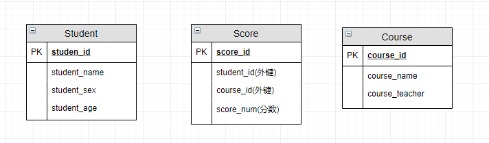

> 摘要：计算机基础之数据库，包括SQL语句书写，数据类型，索引/锁，MySQL等。

<!-- more -->

## 数据库入门

- DBMS：数据库管理系统

### 分类

- 关系型数据库：建立在关系模型基础上，借助于集合代数等数学概念和方法处理数据。由多张能互相连接的表组成。主要用于执行规模小而读写频繁，或大批量极少写~~访问~~的事务。
  - 商用数据库，如：Oracle，SQL Server，DB2等；
  - 开源数据库，如：
    - MySQL Community Server (GPL) 社区版；主要业务数据存储；
    - MariaDB 分支：开源社区用来规避MySQL 闭源的风险，大部分跟 MySQL 5.5 以前版本使用差不多；
    - PostgreSQL等；
  - 桌面数据库，如：微软Access，适合桌面应用程序使用；
  - 嵌入式数据库，如：Sqlite，适合手机应用和桌面程序。
- 非关系型数据库：关系数据库在一些数据敏感的应用中读写性能较差，如为海量文档创建索引、高流量网站的网页服务，及发送流式媒体，采用NoSQL；高效读写海量数据；支持高并发；可以是 key-value、文档、图片等形式；可用硬盘或随机存储器作为载体；不支持SQL；包括：
  - Redis：Key-value；RAM存储；缓存数据存储；
  - MongoDB：在 Nodejs 在 Mongoose 包的帮助下 JSON 的数据格式直接插入；用户行为分析数据存储；
  - ElasticSearch：搜索数据存储；
  - Apache Cassandra（为Facebook所使用、高度可扩展）、Dynamo
  - MemcacheDB 和 HBase等。

### 数据模型

数据库按照数据结构来组织、存储和管理数据，共有三种模型：

- 层次模型：轻量级数据访问协议，如树；
- 网状模型：大型数据储存；
- 关系模型：表明了数据库中存储的数据间一对一、一对多、多对多的联系，如表格。

### 主键

- 元组：表中的一行/一条记录
- 候选码：能唯一标识元组的列/属性

- 主键：用于唯一标识一个元组，不可重复不可空，一个表只能有一个主键。作为主键的条件：= unique + not null；基本原则是：选取完全业务无关的字段，身份证号、手机号、邮箱地址看上去唯一但可能会更改的字段均*不可*用。可用作`id`字段的类型有：
  - 自增整数类型：INT上限约21亿，BIGINT约922亿亿。
  - 全局唯一GUID字符串类型：GUID算法通过网卡MAC地址、时间戳和随机数保证任意计算机在任意时间生成的字符串都是不同的。

- 外键：用来和其他表建立联系，是另一表的主键，可重复，可为空。一个表可有多个外键。当表越来越多，关系越来越复杂时，一般在设计数据库时通过外键来标注表与表间的关系，但在数据库中往往不使用外键，而是通过逻辑来关联。

**不用外键与级联更新**，一切外键概念必须在应用层解决：

- 适用于单机低并发，不适合分布式、高并发集群; 
- 级联更新是强阻塞，存在数据库更新风暴的风险; 
- 外键影响数据库的插入速度；

如：学生表中的 student_id 是主键，那么成绩表中的 student_id 则为外键。如果更新学生表中的 student_id，同时触发成绩表中的 student_id 更新，即为**级联更新**。

1. 增加了复杂性： 每次做DELETE 或UPDATE都必须考虑外键约束；
2. 额外维护；
3. 对分库分表不友好 ：分库分表下外键是无法生效的；

### 数据库范式

##### 函数依赖

- **函数依赖** ：若在一张表中，在属性（或属性组）X 的值确定的情况下，必定能确定属性 Y 的值，那么就可说 Y 函数依赖于 X，写作 X → Y。
- **部分函数依赖** ：如果 X→Y，且存在 X 的一个**真子集 X0**，使得 X0→Y，则称 Y 对 X 部分函数依赖。如学生基本信息表 R关系（学号，身份证号，姓名）中，（学号，身份证号）->（姓名），（学号）->（姓名），（身份证号）->（姓名）；姓名部分函数依赖于（学号，身份证号）；
- **完全函数依赖**：在一个关系中，某个非主属性数据项依赖于**全部关键字**。假设不同的班级学号有相同的，在 R 关系中，（学号，班级）->（姓名），但（学号）->（姓名）不成立，（班级）->（姓名）不成立，姓名完全函数依赖于（学号，班级）；
- **传递函数依赖** ： 在关系模式 R(U)中，X，Y，Z 是 U 的不同的属性子集，如果 X 确定 Y、Y 确定 Z，且有 X 不包含 Y，Y 不确定 X，（X∪Y）∩Z=空集合，则称 Z 传递函数依赖于 X。会导致数据冗余和异常。Y 和 Z 子集往往同属于某一个事物，因此可将其合并放到一个表中。如在关系 R(学号 , 姓名, 系名，系主任)中，学号 → 系名，系名 → 系主任，非主属性系主任对于学号的传递函数依赖。某个字段依赖于主键，而有其他字段依赖于该字段。

##### 范式

用于规范建表，划分字段

1. 1NF（第一范式）：对属性的原子性约束，要求属性（表中的字段）不可再分（为其他字段）。是所有关系型数据库的最基本要求，即创建的表一定满足第一范式。
2. 2NF（第二范式）：对记录的惟一性约束，要求主键可以唯一标识记录；在1NF基础上增加主键，非主属性都依赖于主键。消除了非主属性对于码的**部分函数依赖**。
3. 3NF（第三范式）：对字段冗余性的约束，即任何字段不能由其他字段派生出来，要求字段没有冗余。消除了非主属性对于码的**传递函数依赖**。基本上解决了数据冗余，插入异常，修改异常，删除异常的问题。
4. BCNF：主属性内部不能部分或传递依赖。

### 数据库设计

> 数据库设计就是建立数据存储模型。

##### 设计步骤

- 需求分析 : 包括数据、功能和性能需求。根据功能模块划分实体（实体往往指现实世界中一个完整单位），实体间的关系，各实体的属性、可选唯一标识属性（主键）、数据存储特点/生命周期（是否常用，分库分表，永久存储，定期归档，定期清空等）。
- 概要设计 : 主要用 E-R 模型进行设计，如用Visio画 E-R 图。
- 逻辑设计/详细设计 : 通过将 E-R 图转换成表，实现从 E-R 模型到关系模型的转换，并应用三大范式优化。
- 物理结构设计 : 为设计的数据库选择合适的存储结构和存取路径。做具体的技术选型。
- 数据库实现 : 包括编程（用 SQL 语言创建数据库表）、测试和试运行
- 数据库的运行和维护 : 系统的运行与数据库的日常维护。新需求进行建表、索引优化、大表拆分。

##### E-R 图

E-R 图/实体-联系图：表示实体类型、属性和联系。

- 实体：矩形

- 属性： <u>唯一标识属性（主键）</u>、派生属性、可选属性、联系属性

- 关系：1:1，1:N，M：N

- 元组、候选码、主码、域。

- 多值属性：

E-R图中的冲突有三种：属性冲突、命名冲突、结构冲突。


数据库实际的关系模型：



## MySQL

是一种关系型数据库：用于持久化存储系统中的一些数据，建立在关系模型的基础上。

### 优势

- **开源**。
- 用C和C++编写，并用了多种编译器进行测试，保证源代码的**可移植性**。
- **跨平台**：支持Windows、Linux、Mac OS、Solaris等操作系统。SQL Server只支持Windows。
- 为多种**编程语言**提供了API，包括C、C++、C#、Java、PHP、Python、Ruby等。
- 支持**多语言编码**，如中文的GB 2312、BIG5、日文的Shift JIS等都可用作数据表名和列名。
- 支持**多线程**，充分利用CPU资源，支持多用户。
- 基于 C/S 模式的DBMS。既能作为一个单独的应用程序在客户端服务器网络环境中运行，也能作为一个程序库而嵌入其他软件中。另一类是基于共享文件系统的DBMS，如 Microsoft Access 和 FileMaker，主要用于桌面用途，不适合高端或更关键的应用。
- 提供TCP/IP、ODBC和JDBC等多种**数据库连接**途径。
- 提供用于管理、检查、优化**数据库操作的管理工具**。
  - MyCli，默认；
  - MySQL Workbench 图形客户端；
  - phpMyAdmin、Navicat；
- 优化的**SQL**查询算法，有效地提高查询速度。
- 可以处理拥有上千万条记录的大型数据库。

### 安装

##### 版本号

MySQL 的命名机制由 3 个数字和 1 个后缀组成，如`mysql-5.7.20`：

> 源自Github 上面的[语义化版本标准](http://semver.org/lang/zh-CN/) 

- 第 1 个数字`5`是主版本号：用于描述文件的格式，所有版本 5 的发行版都有相同的文件夹格式。当你做了不兼容的 API 修改。
- 第 2 个数字`7`是发行级别：当你做了向下兼容的功能性新增；+ 主版本号组合 = 发行序列号，描述了稳定的特征集。
- 第 3 个数字`20`是在此发行系列的版本号：随每次新发行的版本递增。当你做了向下兼容的问题修正。通常选择已经发行的最新版本。

##### 使用

- MySQL Client的可执行程序是mysql，在其中输入的SQL语句通过**TCP连接**发送到MySQL Server；

- MySQL Server的可执行程序是mysqld，本机默认IP地址为127.0.0.1:3306，可以用远程IP。

```
mysql -h 127.0.0.1:3306 -u root -p
mysqld start/stop/restatr/status
```

### 字符集

数据库和表的字符集统一用 UTF8，兼容性更好。

```
CHARACTER SET UTF8
```

乱码的本质： 编码和解码时用了不同或不兼容的字符集 。

- ASCII： 128 个字符，ASCII 扩展字符集256个。
- GB2312：对于英语字符，和 ASCII 码是相同的，1 字节编码即可；对于非英字符，需要 2 字节编码。涵盖了绝大部分常用汉字，不支持绝大部分的生僻字和繁体字。
  - GBK：兼容并扩展 GB2312 字符集。
- Unicode 字符集：包含了世界上几乎所有已知的字符。
  - UTF-8：用 1 到 4 个字节为每个字符编码，对于英语字符，和 ASCII 码是相同的。是目前使用最广的一种字符编码。

MySQL 字符集中有两套 UTF-8 编码实现：

- **`utf8`** ： 只支持`1-3`个字节 。中文占 3 个字节，其他数字、英文、符号占一个字节。
- **`utf8mb4`** ： UTF-8 的完整实现，最多支持用 4 个字节表示字符；用来存储 emoji 符号、一些较复杂的文字、繁体字，这些占 4 个字节。

```
SELECT LENGTH("轻松工作");--返回为 12
SELECT CHARACTER_LENGTH("轻松工作");--返回为 4
```

### 数据类型和函数

> 大于显示宽度也可插入

1. 数值类型：可用UNSIGNED修饰
   1. 整型
      - tinyint unsigned（1 Byte）：0 ~ 255，可表示Bool
      - smallint（2 Byte）：0〜65535
      - mediumint（3 Byte）：0 ~ 1677w
      - int（4 Byte）/int(M位数)：0〜42亿
      - bigint（8 Byte）：必须对应类属性的Long类型，否则可能会Integer溢出。
   2. 浮点型：可用`(精度M, 标度D)`，分别表示（总位数/显示宽度，小数位数）。注意浮点数相减和比较运算时易出问题。
      - real（4 Byte）/float(M, D小数位数)：比较粗略但开销相对较少；一般选择；
      - double(M, D)（8 Byte）
   3. 定点数
      - decimal(M, D)：优点是不存在舍入误差，值和计算都是精确的。不同于浮点数的四舍五入，实际上是以字符串的形式存放；用于对精度要求比较高时，如金额、货币、科学数据；占用空间由定义的宽度决定，每 4 个字节可存储 9 位数字，且小数点占用一个字节
   
2. 日期时间类型
   
   - year：YYYY
   - date：YYYY-MM-DD
   - datetime：YYYY-MM-DD HH:MM:SS，8Byte，create_time
   - time：HH:MM:SS
   - timestamp：YYYY-MM-DD HH:MM:SS，4Byte，1970-01-01 00:00:01 ~ 2038-01-19-03:14:07，超出取值范围的用 DATETIME，`INSERT INTO time_zone_test(date_time,time_stamp) VALUES(NOW(),NOW());`用于需记录时区的create_time
   
3. 字符串类型
   - char(N)：固定长度，不管存入的数据多长，均占 N字节；会自动删除插入数据的尾部空格；处理速度快，浪费空间；
   - varchar(M)：M为0～65535；可变长度，所占的字节数为实际长度L+1。
   - tinytext(255), text(65535，64k), mediumtext, longtext(4GB)
   - blob：避免使用
   - binary, varbinary

   - enum(‘v1’, ...)：最多 65535 个元素；从多个值中取一个时用 ENUM；避免使用
   - set(‘v1’, ...)：最多 64 个成员；取多个值时用SET；

```
CREATE TABLE tab ( gender SET('man', 'woman', 'no') );
INSERT INTO tab VALUES ('man', 'man');
```

##### 字段类型选择原则

1. 数据： int > datetime > char > varchar。
 - unsigned bigint id
2. 一般 `<` 50个字节时用 char （除了个别很少用到的字段，也可用varchar来节省空间）。
3. 用 int 来存储时间只能存到 2038-1-19 11：14：07，需要转换，访存频繁用 datetime。
4. 电话号码、信用卡号和社会保险号含非数字字符空格和短划线，不能存为数值类型，以避免丢失开头的“零”。
5. 存储引擎对于选择 CHAR 和 VARCHAR 的影响:
   - 对于 MyISAM ，最好用固定长度的数据列。可使整个表静态化，从而使数据检索更快，用空间换时间。
   - 对于InnoDB，最好用可变长度的数据列，InnoDB 数据表的存储格式不分固定长度和可变长度，因此用 CHAR 不一定比用 VARCHAR 更好，但由于 VARCHAR 是按照实际的长度存储，比较节省空间，对磁盘 I/O 和数据存储总量比较好。

##### 函数

[MySQL常用函数汇总](http://c.biancheng.net/mysql/function/)

- 数学函数
- 字符串函数
- 日期和时间函数
- 聚合函数
- 条件判断函数：IF 、CASE 和 WHERE 语句等。
- 系统信息函数：用于获取 MySQL 数据库的系统信息，包括获取数据库名、获取当前用户和获取数据库版本的函数等。
- 加密函数、格式化函数和锁函数等。

### SQL语句

标准 SQL ：指符合国际标准的 SQL；

方言：各数据库支持的各自扩展功能。

##### SQL 语言分类

- **DDL **（Data Definition Language）数据库定义语言：CREATE、ALTER、DROP等语句；主要用于定义数据库、表结构、视图、索引和触发器等对象。主要由DBA数据库管理员使用。
- **DML **（Data Manipulation Language）数据库操作语言：INSERT、UPDATE、DELETE语句；用于插入、更新、删除表记录。
- **DQL**（Data Query Language）数据库查询语言：SELECT语句；用于查询表记录，最频繁的数据库操作。
- **DCL**（Data Control Language）：数据库控制语言。主要用于控制用户的访问权限。其中：
  - GRANT：增加用户权限；
  - REVOKE：收回用户权限；
  - COMMIT：确认对数据库中的数据进行的变更；
  - ROLLBACK：取消对数据库中的数据进行的变更。

```
-- 允许远程连接的 IP 地址，“%”表示不限制链接的 IP
-- 123456 为用户密码
MySQL> grant all PRIVILEGES on <数据库名.表名> to root@'127.0.0.1/%'  identified by '123456' [WITH GRANT OPTION];

-- 开启MySQL的远程帐号，立即生效
FLUSH PRIVILEGES;
```

##### DDL 数据库/表结构操作

- 创建：`CREATE` database **[IF NOT EXISTS]** <数据库名> / table <表名> 

  [[DEFAULT] CHARACTER SET <字符集名>] 
  [[DEFAULT] COLLATE <校对规则名utf8_chinese_ci>];

- 删除：`DROP` database [ **IF** **EXISTS** ] <数据库名> / table 表名;选择：

- USE <数据库名>;

- 修改数据库：同创建；

- 修改：ALTER TABLE <表名> [修改选项];
  - { **ADD COLUMN** <新列名> <类型> [约束条件] [FIRST | AFTER <已存在的列名>]
    | **CHANGE COLUMN** <旧列名> <新列名> <新列类型不能为空>
    | ALTER COLUMN <列名> { **SET DEFAULT** <默认值> | DROP DEFAULT }
    | MODIFY COLUMN <列名> <**类型**>
    | **DROP COLUMN** <列名>
    | **RENAME TO** <新表名>
    | CHARACTER SET <字符集名>
    | COLLATE <校对规则名> };
  
- 修改存储引擎：ALTER TABLE <表名> ENGINE=<存储引擎名>;

```
-- 如果数据库中存在user_accounts表，就把它从数据库中drop掉
DROP TABLE IF EXISTS `user_accounts`;

-- 创建数据库表
CREATE TABLE `user_accounts` (
  `id`  int(100) unsigned NOT NULL AUTO_INCREMENT primary key,
  `password`  varchar(32) NOT NULL DEFAULT '' COMMENT '用户密码',
  `reset_pwd` tinyint(32) NOT NULL DEFAULT 0 COMMENT '用户类型：0-不需重置密码；1-需重置',
  `mobile`    varchar(20) NOT NULL DEFAULT '' COMMENT '手机',
  `create_at` timestamp(6) NOT NULL DEFAULT CURRENT_TIMESTAMP(6),
  `update_at` timestamp(6) NOT NULL DEFAULT CURRENT_TIMESTAMP(6) ON UPDATE CURRENT_TIMESTAMP(6),
  -- 创建唯一索引，不允许重复
  UNIQUE INDEX idx_user_mobile(`mobile`)
)
ENGINE=InnoDB DEFAULT CHARSET=utf8
COMMENT='用户表信息';

SHOW CREATE TABLE <数据表名>;
desc/describe `sys_user`;
```

##### 数据类型的列属性/列约束

- PRIMARY KEY：主键，不可空不可重复；
- UNIQUE：唯一索引（唯一约束），可空不可重复，可在多个字段定义；主键和唯一约束的创建需依靠索引，没有已建好的索引，Oracle会自动建立唯一索引。
- NULL 约束：表示当前列可为null；
- NOT NULL：在添加数据时没有指定值，会报错；默认值？
- CHECK：检查约束
- DEFAULT <默认值>：当前字段的默认值
- AUTO_INCREMENT：自动增长约束，必须为索引（主键或unique），只能一个字段用不可为空；只能是整数类型，默认从1开始，通过表属性 auto_increment = x 设置
- COMMENT：注释
- FOREIGN KEY：外键约束
- 反引号` `` `用于区分MYSQL的保留字与普通字符、识别符，如表名、列名等；单引号` '' `、双引号用于字符串。

```
-- 在定义完列后直接用关键字指定约束
<字段名> <数据类型> 约束关键字/UNIQUE
ALTER TABLE <数据表名> ADD CONSTRAINT <约束名> UNIQUE(<列名>);
ALTER TABLE <数据表名> CHANGE COLUMN <字段名> <数据类型> DEFAULT <默认值>/NULL;
ALTER TABLE <表名> DROP INDEX <约束名>;
```

##### DQL SELECT 和约束

在表查询中，一律不要使用 * 作为查询的字段列表，需要哪些字段必须明确写明。 
1)增加查询分析器解析成本。
2)增减字段容易与 resultMap 配置不一致。 
3)无用字段增加网络消耗，尤其是 text 类型的字段。

```
-- 投影查询：只返回某些列
SELECT 列1 别名1, 列2 别名2 FROM ...

-- FROM 子句
-- 多表查询/笛卡尔查询：结果集可能非常巨大，行数为多表的乘积，每一行都两两拼在一起
SELECT
    s.id sid,
    s.name,
    s.score,
    c.id cid,
    c.name cname
FROM students [AS] s, classes [AS] c
WHERE s.gender = 'M' AND c.id = 1;
[GROUP BY <group>
[HAVING <expression> [{<operator> <expression>}…]]
[ORDER BY <order>]
[LIMIT[<offset>,] <row count>]

-- WHERE 子句：运算符
and, or, not, xor：返回NULL、0、1
&&, ||, !,
=, != 对应 <=>, <>是安全的，null=null返回null，null<=>null返回1
<=, <, >=, >, 
is [not] null，更推荐ISNULL() 。NULL 与任何值的直接比较都为 NULL。
1)NULL<>NULL 的返回结果是 NULL，而不是 false。 
2)NULL=NULL 的返回结果是 NULL，而不是 true。 
3)NULL<>1 的返回结果是 NULL，而不是 true。
[not] between and：包括起始值和终止值
[not] like [BINARY区分大小写]：“%”代表任何长度的字符串，不能匹配 NULL，“_”代表单个字符

[not] in, 能避免则避免
is [not], 加上ture/false/unknown，检验某个值的真假
[NOT] EXISTS

-- HAVING 条件子句：类似where，过滤分组，对分组后/查询结果再次过滤，可用聚合函数、字段别名。

-- 排序子句
ORDER BY 首选排序字段/别名 排序方式（默认升序ASC/降序DESC） [二次排序字段/别名 ,排序方式] ...

-- LIMIT 限制结果数量子句
LIMIT <记录数> OFFSET <初始位置>
等价于 LIMIT <[初始位置,] 记录数>：初始位置由0开始计数，默认为0

-- 聚合函数、聚合查询
-- count 返回不同的非NULL值数目，count(*) 会统计值为 NULL 的行，而 count(列名) 不会统计此列为 NULL 值的行，无结果返回0。count(distinct col) 计算该列除 NULL 外的不重复行数，注意 count(distinct col1 , col2) 如果其中一列全为 NULL，那么即使另一列有不同的值，也返回为 0。
-- sum 求和，无结果或全为NULL时返回NULL，需注意 NPE 问题。下同
-- avg 求平均值
-- max 求最大值，不限于数值类型
-- min 求最小值
SELECT COUNT(*/id) 聚合列别名 FROM ...
 
-- 分组聚合子句，得到了N行结果<class_id, num>
SELECT COUNT(*) num FROM students GROUP BY class_id;
-- 只支持分组的列，按class_id, gender分组:
SELECT class_id, gender, COUNT(*) num FROM students GROUP BY class_id, gender;
-- 性别分组，拼接name
SELECT `sex`, GROUP_CONCAT(name) FROM tb_students_info 
    -> GROUP BY sex;

-- DISTINCT, ALL 选项：去除重复记录
SELECT DISTINCT name,age FROM student;
SELECT COUNT(DISTINCT name,age) FROM student;

-- AS 语法 用于为表或列(字段)提供临时名称(别名)。
select t1.name from first_table as t1 , second_table as t2 where t1.id = t2.id;

-- 为子查询结果集指定别名
SELECT * FROM (SELECT * FROM result) AS Temp;

-- group_concat 返回带有来自一个组的连接的非NULL值的字符串结果。组内字符串连接。
```

连接查询：对多个表进行JOIN运算，先确定一个主表作为结果集，然后选择性地“连接”其他表的行。
— 内连接 [INNER] JOIN
— 外连接 OUTER JOIN
- LEFT [OUTER] JOIN：右表可能返回null
— RIGHT [OUTER] JOIN
- FULL [OUTER] JOIN：取并集，彼此没有对应的值为 null。
- cross join : 结果是笛卡尔积，就是第一个表的行数乘以第二个表的行数。

on 和 where 条件的区别：
on是join on的条件，先运行生成临时表，再根据where筛选
 1. on 条件在**生成**临时表时使用，条件不为真也会返回左表中的记录。不管 on 中的条件是否为真，都会返回左边表中的记录。
 2. where 条件是在临时表**生成好后**，再对临时表进行**过滤**。这时已没有 left join 的含义（必须返回左边表的记录），条件不为真的就全部过滤掉。

##### DML 增删改

返回WHERE条件匹配的行数及操作的行数。

```
-- 
INSERT [INTO] `user_info` [name, age] VALUES ("Tom", 21), ("Jack", 13);
INSERT [INTO] `user_info` name="Tom", age=21;

-- 插入，但如果已存在则更新
INSERT INTO students (id, class_id, name, gender, score) VALUES (1, 1, '小明', 'F', 99) ON DUPLICATE KEY UPDATE name='小明', gender='F', score=99;

--
DELETE FROM user_info WHERE ...

-- 
UPDATE user_info 
SET age=22, score=score+10 
WHEN name="Tom" and score<80;
```

##### drop、delete 与 truncate 区别？

1. 用法不同
   - drop（删除表结构）： `drop table 表名` 。释放表占用的空间。
   - truncate （清空表中数据） : `truncate table 表名`，用于删除表内的数据和索引，但不删除表本身。把自增值重置和索引恢复到初始大小等。
   - delete（删除某些行的数据） : `delete from 表名 where 列名=值`，不加 where 子句同`truncate table 表名`。

2. 属于不同的数据库语言
   - truncate 和 drop 属于 DDL语句，原数据不放到 rollback segment 中，操作立即生效，不能回滚，操作不触发 trigger。有可能造成事故，故不建议使用。
   - 而 delete 是 DML 语句，操作会放到 rollback segement 中，事务提交后才生效。
- DELETE 删除数据后，配合事件回滚可以找回数据；TRUNCATE 不支持事务的回滚，数据删除后无法找回。
  
3. 执行速度不同
   - 一般来说：drop > truncate > delete。
   - `delete`命令执行时会产生数据库的`binlog`日志，逐行一条一条删除记录，因此比`truncate`慢，好处是方便数据回滚恢复。

##### SQL查重和去重

[在几千条记录里，如何用SQL语句删除掉重复的?](http://www.xiangguo.li/sql_and_nosql/2015/01/01/sql)

```
-- 查找表中多余的重复记录，重复记录是根据单个字段（peopleId）来判断
select * from people 
where peopleId in (select peopleId 
                   from people 
                   group by peopleId 
                   having count(peopleId) > 1)

-- 删除表中多余的重复记录，重复记录是根据单个字段（peopleId）来判断，只留有rowid最小的记录
delete from people 
where peopleId in (select peopleId from people group by peopleId having count(peopleId) > 1)
and rowid not in (select min(rowid) from people group by peopleId having count(peopleId) > 1)

-- 查找表中多余的重复记录（多个字段）
select * from vitae a
where (a.peopleId,a.seq) 
in (select peopleId,seq 
    from vitae group by peopleId,seq 
    having count(*) > 1)

-- 删除表中多余的重复记录（多个字段），只留有rowid最小的记录
delete from vitae a
where (a.peopleId,a.seq) in (select peopleId,seq from vitae 
                             group by peopleId,seq having count(*) > 1) 
           and rowid not in (select min(rowid) from vitae 
           					 group by peopleId,seq having count(*) > 1)

-- 查找表中多余的重复记录（多个字段），不包含rowid最小的记录
select * from vitae a
where (a.peopleId,a.seq) in (select peopleId,seq from vitae 
                             group by peopleId,seq 
                             having count(*) > 1) 
           and rowid not in (select min(rowid) from vitae 
                             group by peopleId,seq 
                             having count(*) > 1)
```

### 高性能优化

##### 基本设计规范

- [数据库设计的重要性和设计原则](https://yq.aliyun.com/articles/131756)

##### 数据库、表、字段设计规范

- 可读性原则（用下划线分隔字段等）；
- 表意性原则（表名应能体现其存储内容等）；临时库表必须以 tmp_为前缀以日期为后缀，备份表必须以 bak_为前缀以时间戳为后缀
- 长名原则（少用缩写）
- 所有存储相同数据的列名和列类型必须一致
- 尽量控制单表数据量的大小在 500 万以内。过大会造成修改表结构，备份，恢复问题。可用历史数据归档（应用于日志数据），分库分表（应用于业务数据、单表行数超过 500 万行或单表容量超过 2GB时）等手段
- 冷热数据分离，减小表的宽度。减少磁盘 IO，保证热数据的内存缓存命中率（表越宽，把表装载进内存缓冲池时所占用的内存也就越大，会消耗更多的 IO）；
- 尽可能把所有列定义为 NOT NULL

##### 索引设计规范

- 建议单张表索引不超过 5 个
- 选用WHERE 从句或 ORDER BY、GROUP BY、DISTINCT 中的字段

##### SQL开发规范

##### 数据库操作行为规范

- 避免使用子查询，会产生大量的临时表也没有索引，会消耗过多的 CPU 和 IO 资源，对查询性能的影响大。子查询在 in 子句中，且为简单 SQL(不包含 union、group by、order by、limit 从句) 时,可优化为 join 关联查询。
- WHERE 从句中禁止对列进行函数转换和计算，导致无法用索引

### 存储引擎

 存储引擎：如何存储数据、为存储的数据建立索引和更新、查询数据等技术的实现方法。

##### InnoDB 引擎

- 行级锁：MyISAM 只有表级锁（对整张表加锁，不利于并发写），而 InnoDB 支持**行级锁和表级锁**（**高并发**下性能更好），支持**MVCC**（行级锁的一个升级）。
- InnoDB 支持**事务**：有提交、回滚和崩溃恢复能力；用于计费或财务系统等对数据准确性要求比较高的；
- InnoDB 支持**外键**；
- 支持集群索引

##### MyISAM 引擎

- 选择密集型的表。最突出的优点是在筛选大量数据时非常迅速。
- 插入密集型的表。批量插入速度快。并发插入特性允许同时选择和插入数据。如：管理邮件数据、日志记录系统（处理用户的登录日志，操作日志、Web服务器日志）等。
- 支持全文索引；数据可压缩

### 索引

索引：是一种用于快速查询和检索数据的数据结构。相当于目录的作用。实质上是一张描述索引列的列值与原表中记录行间一 一对应关系的有序表。

优点：大大加快数据检索速度

缺点 ：创建和维护索引耗时长。当对表中的数据增删改时，需同时修改索引，会降低 SQL 执行效率。占空间。

索引的效率取决于索引列的值是否散列，即该列的值如果越互不相同，那么索引效率越高。

常见的索引结构有: B 树， B+树和 Hash表。

\1. 索引怎么建的，怎么用的？比如我建好了一个索引，在where 语句里写 name like '123%'会不会走索引，怎么情况下不该建索引，哪些语句不会走索引。

\2. 除了索引之外，你有过哪些SQL优化方面的经验，比如分库分表，或通过执行计划查看SQL的优化点。这最好是能结合你做的项目实际来讲。

##### 索引的数据结构

##### Hash表

哈希表：是键值对的集合，用**哈希算法**通过键(key)即可快速取出对应的值(value)。缺点：

1. 哈希冲突
   - 链地址法，JDK1.8 前 `HashMap`；
   - 红黑树，JDK1.8 后 `HashMap；`
2. 最大缺点是Hash 索引不支持顺序和范围查询，hash表存储的是无序数据，范围查找时需遍历，比较耗费时间。
3. 将所有的数据文件添加到内存，比较耗费内存空间。

##### B-Tree/多路平衡查找树

二叉树及其变种的其他树都不能支撑索引的需求，原因是其插入数据的性能较低，且树的深度无法控制， 过深造成IO次数变多，影响读取数据的效率。

B 树 VS B+树：

- 节点：B 树的所有节点存放键和数据，而 B+树只有叶子节点存放 key 和 data，其他内节点只存放 key。
- 叶子节点：B 树的叶子节点是独立的；B+树的叶子节点有引用链指向相邻的叶子节点。
- 查找：B 树的检索相当于对节点的关键字做二分查找，可能不到叶子节点就找到；而 B+树的查找是从根节点到叶子节点。

##### 索引的存储方式 / 索引类型

1. 聚集索引：索引结构和数据一起存放。MyISAM中索引文件和数据文件是分离的，对于 InnoDB 引擎表来说，该表的索引(B+树、表数据文件)的每个非叶子节点存储索引，叶子节点存储索引和索引对应的数据。
   - 主键索引：索引的 key 是数据表的主键。
   - 优点：查询速度非常的快，多叉平衡树叶子节点都是有序的，定位到索引的节点，就相当于定位到了数据。
   - 缺点：依赖于有序的数据；更新代价大。
2. 非聚集索引：索引结构和数据分开存放。叶节点data 域存储的数据是主键的值而不是地址，用来定位主键的位置。如二级索引/辅助索引：
   - 最大缺点：可能会二次查询（回表)），当查到索引对应的指针或主键后，可能还需再到数据文件或表中查询。
   - 唯一索引：如身份证号、邮箱等；根据业务要求，不宜作为主键但有唯一性约束；可为NULL；
   - 普通索引：
   - 前缀索引：用于字符串类型
   - 全文索引：用于检索大文本数据中关键字的信息，搜索引擎数据库
3. 覆盖索引：索引包含/覆盖所有需要**查询**的字段的值，避免回表。相当于目录。

##### MySQL添加索引

```
CREATE <索引名> ON <表名> (<列名> [<长度>] [ ASC | DESC]);
CREATE TABLE(...
KEY | INDEX | UNIQUE INDEX [<索引名>] [<索引类型>] (<列名>,…)
);

SHOW INDEX FROM <表名> [ FROM <数据库名>];
DROP INDEX <索引名> ON <表名>;

-- 1. 添加 主键索引
ALTER TABLE `table_name` ADD PRIMARY KEY ( `col` )

-- 2.添加 唯一索引
ALTER TABLE `table_name` ADD UNIQUE uni_name ( `col` )
-- 也可只对某一列添加唯一约束而不创建唯一索引：
ALTER TABLE students ADD CONSTRAINT uni_name UNIQUE (name);

-- 3.添加 普通索引
ALTER TABLE `table_name` ADD INDEX index_name ( `col` )

-- 4.添加 全文索引
ALTER TABLE `table_name` ADD FULLTEXT ( `col`)

-- 5.添加多列索引
ALTER TABLE `table_name` ADD INDEX index_name ( `col1`, `col2` )
```

##### 建立索引的时机

在`WHERE`和`JOIN`中出现的列需建立索引，但也不完全如此：

- MySQL只对`<`，`<=`，`=`，`>`，`>=`，`BETWEEN`，`IN`使用索引
- 某些时候的`LIKE`也会使用索引。
- 在`LIKE`以通配符%和_开头作查询时，MySQL不会使用索引。

### 事务

事务：用户定义的一个数据库操作序列；是逻辑上的一组操作；要么都执行，要么都不执行。如转钱与收钱。

数据库事务：多条SQL 语句要么全部执行成功，要么全部不执行 。

```
-- 开始事务
-- 显式事务
BEGIN;
或
START TRANSACTION;

UPDATE accounts SET balance = balance - 100 WHERE id = 1;
UPDATE accounts SET balance = balance + 100 WHERE id = 2;

COMMIT;

-- 回滚事务
ROLLBACK;
```

##### 事务的四大特性(ACID)

1. 原子性（Atomicity）：事务是最小的执行单位，不允许分割。将所有SQL作为原子工作单元执行。确保动作要么全部完成，要么完全不起作用；MySQL InnoDB 引擎用undo log(回滚日志) 保证。
2. 一致性（Consistency）：执行事务前后，数据保持一致；事务完成后，所有数据的状态都是一致的；
3. 隔离性（Isolation）：并发访问数据库时，一个用户的事务不被其他事务所干扰，各并发事务间数据库是独立的；如果有多个事务并发执行，每个事务作出的修改必须与其他事务隔离；MySQL InnoDB 引擎通过 锁机制、MVCC 等
4. 持久性（Durability）：一个事务被提交后，对数据库中数据的改变是持久的，即使数据库发生故障也不应有影响。事务完成后，对数据库数据的修改被持久化存储。MySQL InnoDB 引擎用 redo log(重做日志)保证

##### 并发事务带的问题

- 脏读：一个事务会读到另一个事务更新后但未提交的数据，如果另一个事务回滚，那么当前事务读到的就是脏数据；
- ~~丢失修改~~
- 不可重复读：在一个事务内，多次读同一数据，在事务还没有结束时，如果另一事务修改了此数据，那么两次读取的数据可能不一致。
- 幻读：在一个事务中，第一次查询某条记录，发现没有，但当试图更新这条不存在的记录时，竟然能成功，且再次读取同一条记录，就出现了。

##### 隔离级别

1. READ-UNCOMMITTED(读取未提交)： 最低，允许读取尚未提交的数据变更；可能导致脏读、幻读或不可重复读。
2. READ-COMMITTED(读取已提交)： 允许读取并发事务已提交的数据；可能导致幻读或不可重复读。
3. REPEATABLE-READ(可重复读)： 对同一字段的多次读取结果都是一致的，除非数据是被本身事务自己所修改；可能导致幻读。MySQL InnoDB 存储引擎的默认支持的隔离级别。
4. SERIALIZABLE(可串行化)： 最高，完全服从 ACID 。所有的事务依次逐个执行，事务间完全不可能产生干扰；可防止脏读、不可重复读及幻读。串行执行，效率会大大下降。

```
SET TRANSACTION ISOLATION LEVEL READ UNCOMMITTED;
```

### 锁机制

##### 表锁、行锁、页锁

```
-- 锁定
    LOCK TABLES tbl_name [AS alias]
-- 解锁
    UNLOCK TABLES
```

##### InnoDB 锁算法

##### InnoDB的3种行锁定方式

### SQL语句在MySQL中的执行过程

MySQL 主要分为

-  Server 层：主要包括连接器、查询缓存、分析器、优化器、执行器，同时还有一个日志模块（binlog），这个日志模块所有执行引擎都可以共用，redolog 只有 InnoDB 有。
- 引擎层：主要包括MyISAM,InnoDB,Memory 等。

执行流程

- 查询语句：权限校验（如果命中缓存）--->**查询缓存**--->分析器--->优化器--->权限校验--->执行器--->引擎
- 更新语句：分析器---->权限校验---->执行器--->引擎---redo log(prepare 状态)--->binlog--->redo log(commit状态)

### 视图

视图：是一种虚拟的表，数据库中只存定义，数据来自所引用的真实表。

```
CREATE VIEW <视图名> AS <SELECT语句>;
CREATE VIEW v_stu_info (s_id, s_name, d_id, s_age)
AS SELECT id,name,dept_id,age FROM tb_stu_info;
DESCRIBE 视图名;
```

### 存储过程

存储过程：是一组为了完成特定功能的 SQL 语句集合，加了逻辑控制语句。更偏向于业务逻辑。

优点：在业务比较复杂时非常实用，如一个操作需要写一大串 SQL 语句。存储过程一旦调试完成通过后就能稳定运行；比单纯 SQL 语句执行要快，因为存储过程是预编译过的。

缺点：存储过程难以调试和扩展，没有移植性，消耗数据库资源。禁止使用。

```
CREATE PROCEDURE <过程名> ( [过程参数[,…] ] ) <过程体>
[过程参数[,…] ] 格式
[ IN | OUT | INOUT ] <参数名> <类型>
```

### 触发器

```
create trigger <触发器名称>  
{ before | after}         -- 之前或之后触发
insert | update | delete  -- 指明激活触发程序的语句的类型  
on <表名>                  -- 操作哪张表  
for each row              -- 触发器的执行间隔，通知触发器每隔一行执行一次动作，而不是对整个表执行一次。  
<触发器SQL语句>
```

### 数据备份与还原

- 热备（Hot Backup）
- 冷备（Cold Backup）
- 温备（Warm Backup）

### MySQL三大日志

- binlog（归档日志）：是物理日志，记录"在某个数据页上做了哪些修改"。用于数据备份；
- redo log（重做日志）：InnoDB独有；用于MySQL 实例挂了或宕机、崩溃恢复；
- undo log（回滚日志）：发生异常时，对已执行的操作进行回滚。用于实现MVCC。

1. MySQL是怎么保证数据不丢的？
2. 为什么不直接写数据文件而是写redo log？

### SQL注入

##### SQL 注入方式

- 最常见的是：通过网页输入框（<input> 、<textarea> 标签等）将恶意 SQL 代码提交给服务器。将 userID 参数拼接到 SQL 语句中，从而构建 SELECT 查询，从数据库中获取当前用户的所有信息。

##### 防止 SQL 注入

- Web 防火墙可检测和阻止最基本的 SQL 注入；
- 检测用户输入的内容。永远不要信任用户提供的数据，仅在校验通过后才将数据提交给数据库。
  - 在页面输入参数时进行字符串检测和提交时进行参数检查、用正则表达式过滤参数中的特殊符号等。
  - 用户输入的 SQL 参数严格使用参数绑定或 METADATA 字段值限定，禁止字符串拼接 SQL 访问数据库。

### 参考

- [MySQL教程：MySQL数据库学习宝典（从入门到精通）](http://c.biancheng.net/mysql/)
- [廖雪峰SQL教程](https://www.liaoxuefeng.com/wiki/1177760294764384)

## Redis 缓存数据库

Redis：用 C 语言开发的数据库，数据存在内存中（即内存数据库），读写速度非常快。用于数据缓存、处理大量数据的高访问负载，如**缓存、分布式锁**、甚至**消息队列**。

5大基础数据类型、事务、管道、持久化、集群

##### 整合Redis

- 添加项目依赖
- 修改SpringBoot配置文件application.yml
  - 在spring节点下添加Redis的配置
  - 在根节点下添加Redis自定义key的配置
- 添加RedisService接口用于定义一些常用Redis操作
- 注入StringRedisTemplate，实现RedisService接口
- 添加UmsMemberController
  - 添加根据电话号码获取验证码的接口和校验验证码的接口
- 添加UmsMemberService接口及其实现类UmsMemberServiceImpl
  - 生成验证码时，将自定义的Redis键值+手机号生成一个Redis的key，以验证码为value存入到Redis中，并设置过期时间（如120s）。
  - 校验验证码时根据手机号码来获取Redis里面存储的验证码，并与传入的验证码进行比对。

##### Redis 和 Memcached 的区别和共同点

1. Redis 和 Memcached 的区别和共同点
2. 为什么要用 Redis/为什么要用缓存？
3. Redis 常见数据类型及应用场景
4. Redis 没有使用多线程？为什么不使用多线程？Redis6.0 之后为何引入了多线程？
5. Redis 给缓存数据设置过期时间有啥用？
6. Redis 是如何判断数据是否过期的呢？
7. 过期的数据的删除策略？
8. Redis 内存淘汰机制？
9. Redis 持久化机制(怎么保证 Redis 挂掉之后再重启数据可以进行恢复)
10. Redis 缓存穿透、缓存雪崩？
11. 如何保证缓存和数据库数据的一致性？
12. redis是单线程为什么还这么快

#### 缓存穿透

说简单点就是大量请求的 key 根本不存在于缓存中，导致请求直接到了数据库上，根本没有经过缓存这一层。