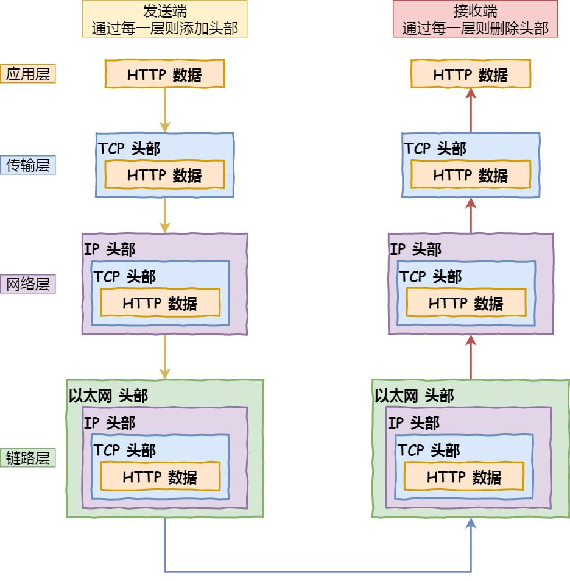

> 摘要：计算机基础之网络，包括七/四层模型，IP协议，TCP/UDP，HTTP/HTTPS，Session等。

<!-- more -->

### OSI七层模型 VS TCP/IP四（五）层模型

协议栈：浏览器（应用层）通过调用 Socket 库来委托协议栈工作。
- 传输层：负责收发数据的 TCP 和 UDP 协议。
- 网络层：IP 协议
- 数据链路层：网卡驱动程序，负责控制网卡硬件，网卡负责收发网线中的信号。

为什么分层
- 封装
- 解耦

### 网络接口层

- 物理层：最底层，解决两台物理机间的通信，通过比特流的传输来实现。网卡、中继器和集线器在这层工作。

- 数据链路层：将网络层交下来的 IP 数据报组装成帧。交换机、网桥。

### 网络层

路由和寻址。将网络地址翻译成对应的物理地址，通过路由选择算法为IP数据报/分组（通过通信子网）选择最佳路径。路由器。

常见协议：
- IP 协议：控制网络包收发
- ICMP 控制报文协议：用于告知网络包传送过程中产生的错误及各种控制信息。
- ARP 地址解析协议：用于物理地址寻址，根据 IP 地址获取物理 MAC 地址。

IP：负责将数据包发给最终目的地地址
MAC：只负责某一区间（主机、路由器、主机）的通信传输

IP地址：分类号 + 网络号 + 主机号

为什么要分离网络号和主机号？
两台计算机通信，首先要判断是否处于同一个广播域内，即网络地址是否相同。如果网络地址相同，表明接受方在本网络上，可以把数据包直接发送到目标主机。如路由器寻址。

- 网络地址：主机位全为0，网段的第一个地址，表示属于互联网的哪一个网络
- - 0.0.0.0 ：本机 IP 地址
- 主机地址：表示属于网络中的哪一台主机。
- 网关地址：路由器的地址

- 广播地址：主机位全为1的，网络的最后一个地址
- - 255.255.255.255 ：受限的广播地址，只能用于本地网络
- 回送（~~环回~~）地址：127.0.0.0/8，表示本机地址
- 子网掩码：网络位+主机位
1. 减少 IP 地址浪费
2. 计算 IP 地址与子网掩码**按位与**区分网络位和主机位
3. 将一个大的 IP 地址划分为若干子网络
4. 检测两个 IP 地址是否属于同一子网

### 传输层

提供进程间的逻辑通信。负责向（两台终端设备）进程间的通信提供通用的数据传输服务，传送应用层报文。网关。

##### TCP VS UDP

1. TCP 传输控制协议：提供面向连接的、可靠的数据传输服务，只能点对点通信。用于传输准确性要求高的数据，速度较慢。负载较高，采用虚电路。一般用于文件传输、收发邮件、远程登录等。

2. UDP 用户数据报协议：提供无连接的数据传输服务，不保证可靠性。支持点对点、多播和广播。用于即时通信，如语音、视频、直播等。

##### TCP 三次握手

目的是建立可靠的通信信道。

- 客户端：发送有 SYN 标志的数据包
- 服务端：发送有 SYN/ACK 标志的数据包
- 客户端：发送有 ACK 标志的数据包。

B（SYN=1, seq=x）
S（SYN=1, ACK=1, ack=x+1, seq=y）
B（ACK=1, ack=y+1）

两次不可以：两次握手只能保证客户端可以正常给服务端发送数据，只有经过第三次握手，才能确保双向都可以接收到对方发送的数据。

##### TCP 四次挥手

- 客户端：发送一个 FIN，用来关闭连接
- 服务器：收到 FIN，发回 ACK，确认序号为收到的序号加 1 。TCP连接处于半关闭状态，即客户端已没有要发送的数据，但服务端若发送数据，则客户端仍要接收。
- 服务器：发送一个 FIN，关闭与客户端的连接。
- 客户端：发回 ACK 确认，并将确认序号设置为收到序号加 1

S（FIN=1，seq=x）
B（ACK=1）
B（FIN=1，seq=y）
S（(ACK=1）

##### TCP 如何保证可靠传输

在不可靠服务的基础上实现可靠的信息传输。

- 校验和：如果收到段的检验和有错，TCP 将丢弃此报文段。
- 序列号：给发送的包/数据块编号，接收方对数据包排序，去重，传送给应用层。
- 确认应答/ARQ 自动重传请求协议：每发完一个分组就停止发送，收到对方确认（ACK 报文中有对应的确认序列号，告诉发送方，接收了哪些数据，下一次数据从哪里传）后再发下一个。
- 超时重传（最关键）：当 TCP 发出一个段后，启动定时器，等待目的端确认收到。超时后仍未收到确认，重发此报文段。
- 三次握手四次挥手；
- 流量控制：利用滑动窗口（接收方发送的确认报文中的窗口字段用来控制发送方窗口大小）实现流量控制，控制发送速率，解决丢包重传。
- 拥塞控制：当网络拥塞时减少数据发送。

### 应用层

- 会话层：建立和保持会话，身份验证等；
- 表示层：编译数据格式等；
- 应用层：定义网络通信规则（协议）。报文

##### 应用层协议

- HTTP 超文本传输协议：用于Web 浏览器与服务器间的通信。基于 TCP协议，发送 HTTP 请求前先建立 TCP 连接，即 3 次握手。
- SMTP 邮件发送协议：基于TCP
- POP3/IMAP 邮件接收协议
- FTP 文件传输协议：基于TCP
- Telnet 远程登录协议：基于TCP，缺点是所有数据以明文发送
- SSH 安全网络传输协议：基于TCP
- DNS 域名解析协议
- DHCP 动态主机设置协议：用于内部网或网络服务供应商自动分配IP地址给用户

##### HTTP1.0 VS HTTP1.1

- 连接方式：HTTP/1.0 默认用短连接；HTTP/1.1 默认长连接（成功建立后保持连接不关闭），开启 Keep-Alive。多路复用？
- 状态响应码：HTTP/1.1新加入大量状态码，如100，在请求大资源前的预热请求。
- 缓存处理 :  HTTP1.0 缓存策略更灵活。
- 带宽优化：HTTP1.0 传送整个对象，浪费带宽；HTTP1.1 允许只请求资源的某个部分，即返回码 206，充分利用带宽。
- HTTP/1.1新增Host字段；支持断点续传。

##### HTTP2.0

##### HTTP VS HTTPS 协议

TCP 作为底层协议。

- 端口号：HTTP 默认是 80，HTTPS 默认是 443。
- URL 前缀：http://；https://。
- 安全性和资源消耗： HTTP 传输内容是明文，客户端和服务器端都无法验证对方的身份。HTTPS 运行在 SSL/TLS 之上，传输内容经过**对称加密**，密钥用服务器的证书进行非对称加密。安全性高，但耗费更多资源。

**https 加密的过程**

对称加密：指加密和解密用同一个密钥，最大问题是如何安全地将密钥发给对方;
非对称加密：指用一对公钥和私钥。发送方用对方的公钥加密，对方用自己的私钥解密。

##### 消息结构

客户端请求消息：

1. 请求行：8种请求方法类型
   1. HTTP1.0：GET POST HEAD
   2. HTTP1.1：PUT DELETE CONNECT OPTIONS TRACE
2. 请求头部
   1. Accept
   2. Cache-Control
3. 请求数据

服务端响应消息：

1. 状态行
2. 消息报头：响应头信息
3. 响应正文

fetch 请求怎么发
  - [ ] http请求头和请求体有哪些
  - [ ] http有哪些方法 option是做什么的
  - [ ] http 缓存机制怎么做到的、优缺点 强缓存

##### GET 请求 VS POST 请求

- 回退：GET请求在浏览器回退时是无害的，而POST会再次提交请求。
- 书签：GET产生的URL地址可被收藏，而POST不可以。
- 缓存：GET会被浏览器主动cache，而POST不会，除非手动设置。
- 编码类型：GET请求只能进行url编码，而POST支持多种编码方式。
- 历史：GET请求参数会被完整保留在浏览器历史记录里，而POST中的参数不会被保留。
- URL中参数的数据长度：GET有长度限制，而POST没有。
- 参数的数据类型：GET只接受ASCII字符，而POST没有限制。
- 安全性：GET比POST更不安全，因为参数直接暴露在URL上，所以不能用来传递敏感信息。
- 可见性：GET参数通过URL传递，所有人可见，POST放在Request body中。
- TCP 数据包：get 请求发送一个 TCP 数据包；post 发送两个。对于get 请求，浏览器会把 http header 和 data 一并发送出去，服务器响应 200（返回数据）；而对于 post，浏览器先发送 header，服务器响应 100 continue，浏览器再发送 data，服务器响应 200 ok（返回数据）。

##### 状态码

服务端发生错误时，返回给前端的响应信息必须包含 HTTP 状态码，errorCode、 errorMessage、用户提示信息四个部分。涉及对象分别是浏览器、前端开发、错误排查人员、用户。

- 浏览器接受并显示网页前
- 在**服务器响应消息**的**状态行**中

- 1XX: 接收的请求正在处理；

- 2XX: 请求正常处理完毕；
  - 200 OK: 请求成功，表明该请求被成功地完成，所请求的资源发送到客户端。一般用于 GET 或 POST

- 3XX：重定向，需要附加操作以完成请求；
  - 301: 永久重定向
  - 302: 临时重定向
  - 304: 资源未修改，用缓存的

- 4XX: 客户端错误
  - 401 Unauthorized: 请求要求身份验证，常见对于需登录而用户未登录的情况。
  - 403 Forbidden: 服务器拒绝请求，禁止访问资源。常见于机密信息或复制其它登录用户链接访问服务器的情况。 
  - 404 NotFound: 服务器无法取得所请求的网页，请求资源不存在。

- 5XX：服务器端错误
  - 501 InternalServerError：内部服务器错误

### 浏览器访问网页的过程

- 解析URL：协议 + Web服务器域名 + 资源地址
- DNS 解析：根据域名查找对应服务器的IP地址/域名IP地址映射关系；
  - 本地 hosts 文件/计算机缓存
  - 本地 DNS 服务器（TCP/IP 参数中设置的首选 DNS 服务器）。如果域名在区域中，则返回解析结果，有权威性；如果不在区域中，但缓存了此域名IP 地址映射关系，则返回解析结果，没有权威性。
  - 根dns服务器：（根域的 DNS 服务器信息保存在互联网中所有的 DNS 服务器中。）如果自己无法解析，返回负责管理目标地址的.com 顶级域名dns服务器地址。循环直到最后把结果返回给本地 DNS 服务器。
- 通过ip寻址和arp，找到服务器：路由器与服务器通信时，用ARP协议将IP地址转换为MAC地址；
- TCP 三次握手建立连接
- 浏览器（生成HTTP报文，）发起HTTP请求
- TCP将HTTP请求报文分割成报文段，并可靠地传给对方
- 在网络层使用IP协议：搜索对方地址，中转并传送；
- OSPF路由选择协议，IP数据包在路由器间传递；
- TCP接收报文段并重组；
- 服务器给浏览器响应一个301永久重定向
- 浏览器跟踪重定向地址，发现缓存中有，304，直接去缓存中拿（最快）
- 服务器处理请求，返回网页内容（HTTP报文）

2. 浏览器解析渲染网页
   1. DOM 构造
      1. HTML 解析器 -> DOM 树
      2. CSS 解析器 -> **样式表规则**
   2. 布局：**广度？优先**读取 DOM 树结点，送入**文档流**
   3. 渲染（~~绘制~~）页面

### Section/Cookie

Cookie 和 Session 都是用来跟踪浏览器用户身份的会话方式

- Session 存储在服务器端，Cookie 存储在客户端中；
- Cookie 一般用来保存用户信息，
Session 主要作用是通过服务端记录用户状态。典型场景是购物车、个性化推送、免密登录

### 跨域

跨域：指不同域名]间相互访问。指浏览器不能执行其他网站的脚本，是由浏览器的同源策略所造成的，是浏览器对于JavaScript所定义的安全限制策略。

##### 什么情况会跨域

- 同一协议， 如http或https
- 同一IP地址，如127.0.0.1
- 同一端口，如8080

以上三个条件任一条件不同就会产生跨域问题。

##### 解决方案

**前端解决方案**

1. 使用JSONP方式实现跨域调用；
2. 使用NodeJS服务器做为服务代理，前端发起请求到NodeJS服务器， NodeJS服务器代理转发请求到后端服务器；

**后端解决方案**

1. nginx反向代理解决跨域；
2. 服务端设置Response Header(响应头部)的Access-Control-Allow-Origin；
3. 在需跨域访问的类和方法中设置允许跨域访问（如Spring中使用`@CrossOrigin`注解）；
4. 继承使用Spring Web的`CorsFilter`（适用于Spring MVC、Spring Boot）；
5. 实现WebMvcConfigurer接口（适用于Spring Boot）；

[Java 解决跨域问题](https://cloud.tencent.com/developer/article/1668879)