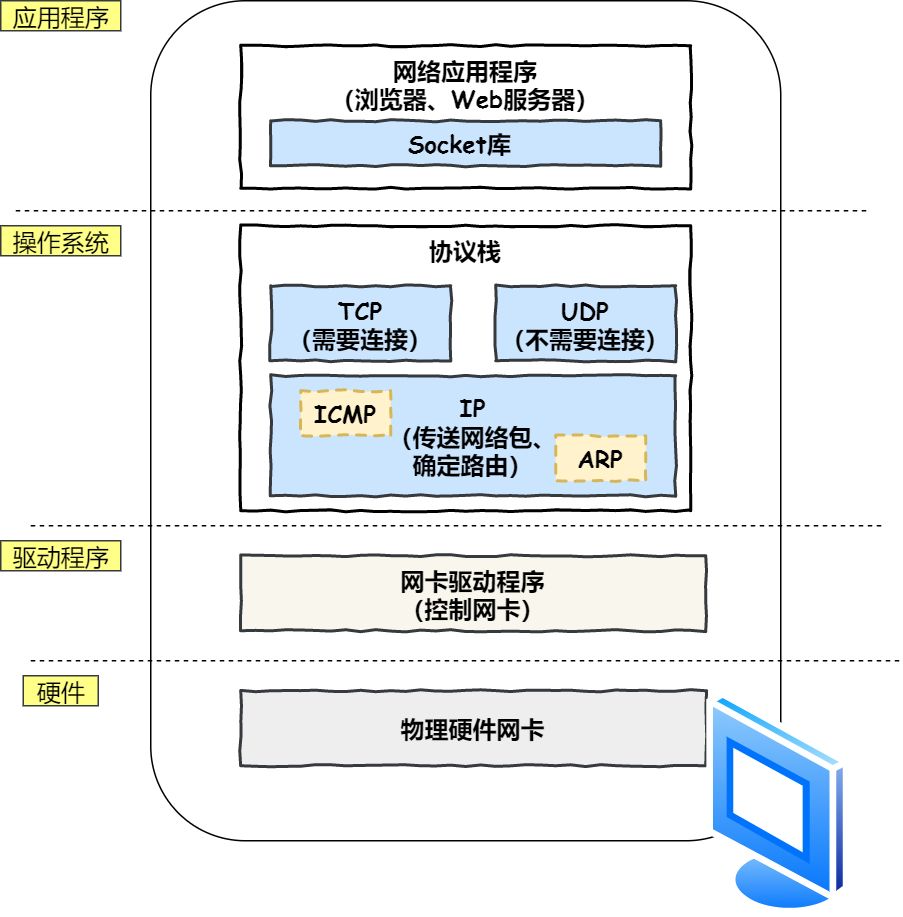
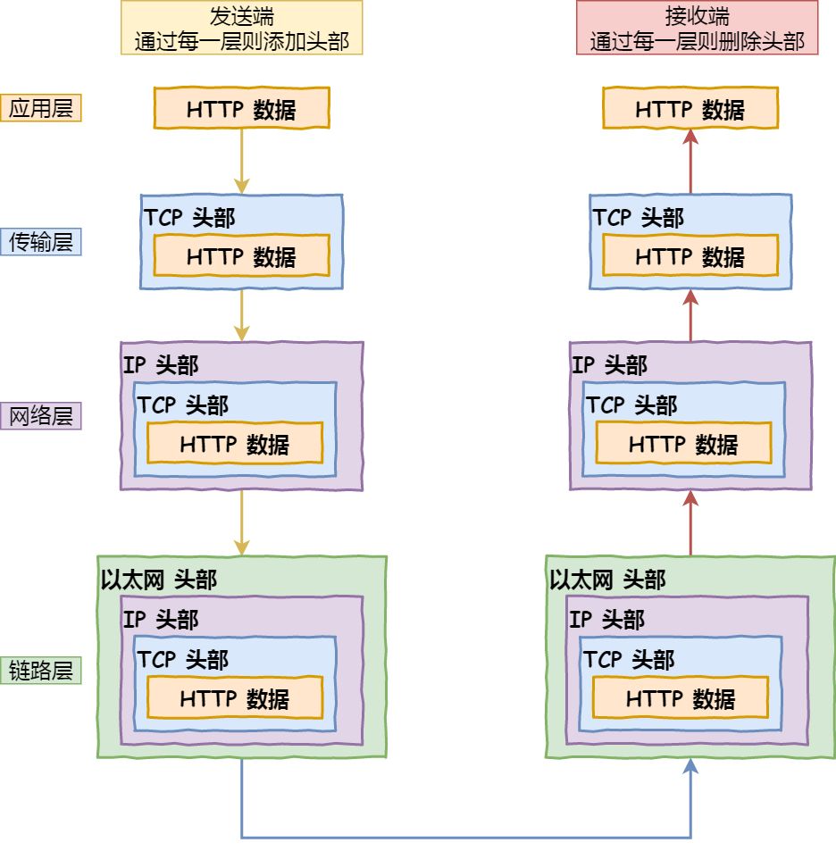
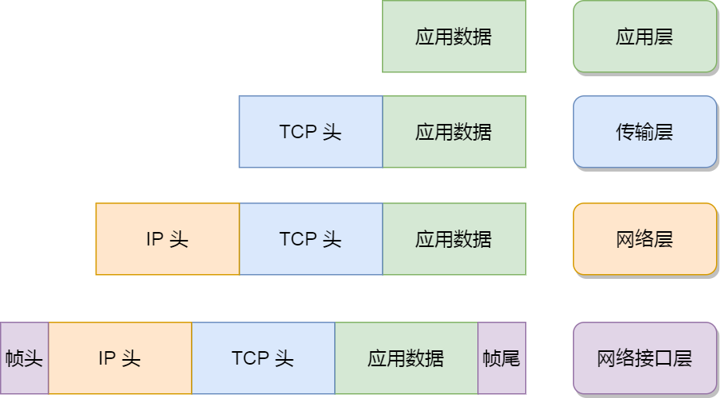

> 摘要：计算机网络属于计算机基础，包括四/七层模型，网络层 IP 协议，传输层 TCP/UDP、三次握手、四次挥手，应用层 HTTP/HTTPS、请求报文和响应报文、状态码、HTTP 缓存机制，Session等。
>
> 用浏览器访问网页的过程（重点是DNS 解析）将所有知识串联到一起。

<!-- more -->

### 目录

[TOC]

### 基本概念

1. 带宽（bandwidth） ：表示在单位时间内，从网络中的某一点到另一点所能通过的“**最高**数据率”。常用来表示网络的通信线路传送数据的能力。单位是 `b/s` 比特每秒。
2. 吞吐量（throughput ）：表示在单位时间内，通过某个网络（或信道、接口）的数据量。用于测量实际上到底有多少数据量能通过网络。受网络带宽或额定速率的限制。

### TCP/IP 四层模型、OSI 七层模型

  

OSI 模型的：

1. 下三层是媒体层（Media Layer）：物理层、数据链路层、网络层；
2. 上四层是主机层（Host Layer）：传输层、（会话层、表示层）、应用层。

分层：为了封装、解耦

1. 网络接口层：
   1. **物理层**：最底层，利用**传输介质**实现（相邻两台物理机/计算机节点间的）**比特流传送**。**网卡**/物理硬件（负责收发网线中的信号）、**中继器**和**集线器**在这层工作。
   2. **数据链路层**：将网络层交下来的 IP 数据报组装成**帧**，可靠的传输到相邻节点（/目标机）的网络层。
       - 给数据包加以太网头部。网卡**驱动**程序（负责控制网卡/硬件）、**交换机**、网桥。
2. **网络层**：**路由和寻址**。将网络地址翻译成对应的物理地址，通过**路由选择算法**为 **IP 数据报**/分组选择（通过通信子网的）最佳路径。IP 协议、ARP 协议。给数据包加 IP 头部。路由器。
3. **传输层**：为两台**主机进程**间的（逻辑）通信提供通用的数据传输服务，传送应用层报文。**网关**。
    - 负责收发数据的 **TCP 和 UDP 协议**。TCP 三次握手、四次挥手。给数据包加 TCP 头部。
4. 应用层：浏览器通过调用 **Socket 库**来委托协议栈工作；
   1. **会话层**：用于管理（建立和保持、维护、重连）应用程序间的会话，身份验证等；
   2. **表示层**：用于数据处理（编码解码、**加密解密**、压缩解压缩等）；
   3. **应用层**：用于定义网络通信规则（**协议**），为计算机用户提供服务。**报文**；**DNS 协议**、HTTP 协议。

数据包：

- 应用层：建立 TCP 连接后，浏览器生成 **HTTP 请求报文**（请求行、请求头、请求体），发给服务器；

- 在发送端，（应用层）**HTTP 数据包**，（传输层）**+ TCP 头部**，（网络层）**+ IP 头部**，（数据链路层）**+ 以太网头部**。
- 发送端将**子网掩码**分别与源 IP、目标 IP进行与运算，相等则在同一个子网。
    1. 如果源 IP 与目标 IP 在同一个子网，直接将数据包通过**交换机**（在数据链路层）发出去。
    2. 如果源 IP 与目标 IP 不在同一个子网，将数据包（通过默认网关知道路由器的 IP 地址）交给**路由器**处理。
    3. 通过 ARP 协议，
- 发送给（物理层的）**集线器**：只负责向所有节点转发数据包；
- 发送给（数据链路层的）**交换机**：没有独立的 MAC 地址，记录 MAC 地址表，向路由器的 MAC 地址发送数据包。
- 发送给（网络层的）**路由器**：有自己独立的 MAC 地址（记录在交换机的 MAC 地址表中），记录 IP 地址表，将 MAC 地址改为目标 MAC，向目标 IP 地址转发数据包。
    - ARP 协议：在主机中，
    - 路由表：
- 发送给（传输层的）网关：
- 发送给（应用层的）



### 一、网络接口层

**CRC**（Cyclic Redundancy Check）循环冗余检验：为了保证数据传输的可靠性，广泛使用的一种检错技术。

### 三、网络层

#### 常见协议

1. `IP` 协议：控制**网络包收发**。
2. `ICMP` 控制报文协议：用于告知网络包传送过程中产生的错误及各种控制信息。
3. `OSPF` 动态**路由选择**协议（`Open Shortest Path First`，开放式最短路径优先）：用于 IP 数据包（在路由器间）的**路由选择**。四层负载均衡。
     1. 是一个基于链路状态、IP 协议的内部网关协议。具有路由变化收敛速度快、无路由环路、支持变长子网掩码（VLSM）和汇总、层次区域划分等优点。
     2. 用于取代 RIP（`Routing Information Protocol`）作为内部网关协议。
     3. 采用戴克斯特拉算法来计算**最短路径树**，见
4. `ARP` **地址解析**协议：路由器与服务器通信时，用于**物理地址寻址**，负责**将 IP 地址转换为 `MAC` 物理地址**。每台主机中都有一张 **ARP 缓存表**，记录主机的 IP 地址和 MAC 地址间的对应关系；
     1. 在 ARP 缓存中查询 IP 地址，未命中则发送（包含待查询 IP 地址的）ARP 广播请求，等待回应；
     2. 收到广播的主机检查自己的 IP，符合条件的将（含有自己 `MAC` 地址的） ARP 包返回给广播的主机；
     3. 得到 ARP 回应后，将 IP 地址与**路由的下一跳 `MAC` 地址**写入 ARP 缓存表；以路由下一跳的地址填充目的 `MAC` 地址，以数据帧形式转发；
5. `RARP` 逆地址解析协议：逆向从 IP 地址反查域名。

#### IP 地址

`MAC`：只负责某一区间（主机、路由器、主机）的通信传输；

`IP` 地址：负责将数据包发给最终目的地地址；**分类号 + 网络号 + 主机号**。

- 为什么要分离网络号和主机号：两台计算机的网络地址，用于判断是否处于同一广播域内。如果网络地址相同，表明接受方在本网络内，可把数据包直接发送到目标主机。如路由器寻址。
  1. 网络地址（号）：主机位全为0，网段的第一个地址，表示属于互联网的哪一个网络。本机 IP 地址 0.0.0.0。
  2. 主机地址（号）：表示属于网络中的哪一台主机。
- **子网掩码**：网络位 + 主机位
  1. 用 IP 地址与子网掩码**按位与**，用于区分网络位和主机位；
  2. 将一个大的 IP 地址划分为若干子网络；
  3. 检测两个 IP 地址是否属于同一子网；
  4. 减少 IP 地址浪费；
- **网关地址**：路由器的地址；
- **广播地址**：主机位全为1的，网络的最后一个地址；
  - 255.255.255.255 ：受限的广播地址，只能用于本地网络；
- **回送**（~~环回~~）地址：127.0.0.0/8，表示本机地址（本机服务器）。一般用来测试使用，常用来ping 127.0.0.1来看本地ip/tcp正不正常，如能ping通即可正常使用。
    - localhost也叫local ，指本地服务器。通过解析本机的host文件，windows自动将localhost解析为127.0.0.1。
    - localhot（local）不经网卡传输，不受网络防火墙和网卡相关的的限制。127.0.0.1是通过网卡传输，依赖网卡，并受相关的限制。
    - 一般设置程序时本地服务用localhost是最好的，localhost不会解析成ip，也不会**占用网卡、网络资源**。
    - 猜想localhost访问时，系统带的本机当前用户的权限去访问，而用ip的时候，等于本机是通过网络再去访问本机，可能涉及到网络用户的权限。


#### IPV4、IPV6


### 四、传输层

#### TCP VS UDP

1. `TCP` 传输控制协议：提供**面向**连接的、**可靠的**数据传输服务；只能点对点通信。
   - 用于传输对**准确性**要求高的数据，如浏览器与服务器间的 HTTP 通信、文件传输、收发邮件、远程登录等。速度较慢，负载较高，采用虚电路。
2. `UDP` 用户数据报协议：提供**无连接**的数据传输服务，不保证可靠性；支持点对点、多播和广播。
   - 用于**即时通信**，如语音、视频、直播等。

#### TCP 三次握手


目的：保证客户端和服务端（浏览器和服务器）**建立可靠的通信信道**。主要作用是为了确认双方的接收和发送能力是否正常、指定自己的初始化序列号、为后面的可靠性传送做准备。

实质上就是连接服务器指定的端口，建立 TCP 连接，并同步客户端和服务端的序列号和确认号，交换 TCP 窗口大小信息。 

```
  		报文标志位    确认号      序列号
B-to-S:	SYN		  (			   seq = x )
S-to-B:	SYN + ACK ( ACK = x+1, seq = y )
B-to-S:	ACK		  ( ACK = y+1, [seq = x+1] )
```

刚开始客户端处于 `Closed` 的状态，服务端处于 `Listen` 状态。Socket 编程中，客户端执行 `connect()` 时，将**触发三次握手**。

Socket：从传输层上抽象出的一个抽象层，本质是接口。

1. 客户端向服务端：发送 `SYN` 报文/数据包，**请求建立连接**，初始序列号 `seq` 设置为 `x`。
   - 告诉服务端要发送请求，客户端进入 `SYN_SENT` 状态，等待服务端确认。
2. 服务端（**准备好建立连接**后）向客户端：发送 `SYN + ACK` 报文，**请求确认连接**，确认号 `ACK` 设为 （第一次握手时，客户端发送过来的）序列号 `x + 1`，服务端初始化序列号 `seq` 设为 `y`。其中 `ACK` 报文用来应答，`SYN` 报文用来同步。
   - 告诉客户端准备接收数据，然后进入 `SYN_RECV` 状态。
3. 客户端（收到**请求确认连接报文**后~~知道服务器已做好建立连接的准备~~）：发送 `ACK` 报文，确认号 `ACK` 设为 序列号 `y + 1`，**确认连接**。
   - 告诉服务端准备接收数据，客户端和服务端都进入 `ESTABLISHED` 状态，双方建立连接。
   - `ACK` 报文段可携带数据（序列号 `seq` 设置为 `x + 1`），不携带则不消耗序列号。

##### 两次握手不可以

原因：两次握手只能保证客户端可正常给服务端发送数据，只有经过第三次握手，双方才能确认自己与对方的发送与接收是正常的。

1. 第一次握手：客户端发送数据包，服务端收到了。服务端能确认：客户端的发送能力、服务端的接收能力是正常的；
2. 第二次握手：服务端发送数据包，客户端收到了。 客户端能确认：服务端的接收、发送能力，客户端的发送、接收能力是正常的。不过此时，服务器并不能确认**客户端的接收能力**是否正常；
3. 只有经过第三次握手：客户端发送数据包，服务端收到了。 这样服务端就能确认：**客户端的接收**、发送能力正常，服务器自己的发送、接收能力也正常。

**若只有两次握手**：已失效的连接请求报文突然又传送到了服务端，从而产生错误。

1. 如第一次握手时，客户端发出的连接请求报文延误、丢失，而未收到来自第二次握手的确认报文；
2. 于是客户端再重传一次连接请求，第二个到达了服务端，客户端收到了确认，二者建立了连接。数据传输完毕后，释放了连接；
3. 此时，第一个丢失的连接请求报文段到达服务端，此时服务端**误认为客户端又发出一次新的连接请求**，于是就向客户端发出确认报文段，因为不采用三次握手，所以二者直接建立连接；服务器并不能确认**客户端的接收能力**是否正常；
4. **客户端已关闭连接**，会忽略服务端发来的确认，也不发送数据，则**服务端一直等待客户端发送数据**，浪费资源。

#### 数据传输

```
  		标志位 确认号  	序列号
B-to-S:	ACK ( ACK = y+1, seq = x+1 )
S-to-B:	ACK ( ACK = x+2 		   )
```

#### TCP 四次挥手

```
  	报文标志位 确认号	   序列号
B-to-S:	FIN ( 			 seq = x )
S-to-B:	ACK	( ACK = x+1 		 )
S-to-B:	FIN ( 			 seq = y )
B-to-S:	ACK ( ACK = y+1			 )
```

当 TCP 连接超过一定时间或不再使用时（数据传送完毕、传输完一个网页的全部资源、收到全部内容后），**触发四次挥手**。

1. 客户端向服务端：发送 `FIN` **连接释放报文**段，表示请求报文发送完了，准备关闭 TCP 连接，并停止发送数据。
   - 客户端进入 `FIN_WAIT1`（终止等待1）状态，等待服务端确认。
2. **服务端**收到 `FIN` 后，向客户端发送 `ACK` 报文：`ACK` 确认号设置为（第一次挥手时）客户端发送过来的**序列号 `x + 1`**，表示**已收到**客户端的关闭连接请求。
   - 此时服务端进入 `CLOSE_WAIT` **半关闭**状态，即客户端已没有要发送的数据，但服务端若发送数据，则客户端仍要接收；
   - 客户端收到服务端的确认后，进入 `FIN_WAIT2`（终止等待2）状态，等待服务端发出的连接释放报文段。
3. **服务端**响应报文**发送完**后，（**等到服务端所有的报文都发送完**了），请求关闭/断开与客户端的连接，（和客户端的第一次挥手一样），发出 `FIN` 连接释放报文，指定一个序列号 `y`。告诉客户端响应报文发送完了，同意关闭请求。
   - 此时服务端进入 `LAST_ACK` （最后确认）状态，等待客户端的确认。 
4. 客户端收到 `FIN` 连接释放报文段后，发送 `ACK` 确认作为应答，将 `ACK` 确认号设置为收到的服务端序列号 `y + 1`；告诉服务器响应报文接受完了。
   - 此时客户端进入 `TIME_WAIT` 状态。
   - 服务端收到 `ACK` 报文后，关闭连接，进入 `CLOSED` 状态；
   - 客户端等待一定时间未收到回复，则正常关闭，进入 `CLOSED` 状态。

##### 挥手为什么需要四次？

四次由 TCP 的**半关闭**（half-close）造成的。即，TCP 提供了一种能力，连接的一端在**结束发送**后、还能接收来自另一端的数据。第二次挥手后。

关闭连接时，当服务端收到 `FIN` 报文时，可能响应报文并没有发送完，并不会立即关闭 `SOCKET` 连接，所以只能先回复一个 `ACK` 报文，告诉客户端收到了发的 `FIN` 报文。只有**等到服务端所有的报文都发送完**了，才发送 `FIN` 报文，故需四次挥手。

#### TCP 如何保证可靠传输

在不可靠服务的基础上实现可靠的信息传输。

1. **校验和**：如果收到**段**的检验和有错，TCP 将丢弃此报文段。
2. **序列号**：为发送的包/数据块编号，接收方对数据包排序，去重，再传送给应用层。
3. 确认应答/**ARQ 自动重传请求协议**：每发完一个分组就停止发送，收到对方确认后再发下一个；ACK 报文中有对应的确认序列号，告诉发送方接收了哪些数据、下一次数据从哪里传。
4. （最关键）**超时重传**：当 TCP 发出一个报文段后，启动定时器，等待目的端确认收到；超时后仍未收到确认，则重发此报文段。
5. **三次握手四次挥手**，用来建立和关闭连接；
6. **流量控制**：利用**滑动窗口**（接收方发送的（确认报文中的）窗口字段用来控制发送方窗口大小）实现流量控制，控制发送速率，解决丢包重传。
7. **拥塞控制**：当网络拥塞时减少数据发送。

##### 滑动窗口


### 七、应用层

#### 应用层协议及对应端口

[TCP/UDP端口列表](https://zh.wikipedia.org/wiki/TCP/UDP%E7%AB%AF%E5%8F%A3%E5%88%97%E8%A1%A8)

运行于 TCP 协议上的：

1. `HTTP` 超文本传输协议（`HyperText Transfer Protocol`）：用于浏览器与服务器间的通信（传输数据）。基于 **TCP 协议**，先（3 次握手）建立 TCP 连接，再发送 HTTP 请求。功能包括：事务处理、缓存控制、标记媒体类型等。默认的 HTTP 通信端口是 **80**。
    1. 当在Web浏览器中输入一个URL时，如果没有指定端口号，浏览器会默认使用**端口80**与Web服务器建立连接，以获取网页内容。
    2. **代理服务器**常用端口号：`80/8080/3128/8081/9098`。
    3. `HTTPS `服务器，默认端口号为` 443/TCP,UDP`。
    4. **`Tomcat` 默认端口号**为`8080`。
    5. `MySQL  ` 默认端口号为 `3306/TCP,UDP`。
    6. `Redis  ` 默认端口号为 `6379`。
    7. `Elasticsearch` 默认端口号为 `9200/9300`，`Kibana` 默认端口为 `5601`。
    8. `MongoDB ` 默认端口号为 `27017 `。
2. `FTP` 文件传输协议：基于 TCP 实现可靠传输，好处是可屏蔽操作系统和文件存储方式。代理服务器常用端口号：`21`。
3. `Telnet` 远程登录协议：缺点是所有数据以明文发送；代理服务器常用端口号：`23`。
4. `SSH` **安全网络传输**协议：是目前较可靠、专为远程登录会话和其他网络服务提供安全性的协议。解决了 Telnet 不安全的问题，可有效防止远程管理过程中的信息泄露问题。默认的端口号为`22`。
5. `SMTP` 邮件发送协议；
6. `POP3/IMAP` 邮件接收协议：默认端口号为`110`。
7. `SOCKS` 代理协议常用端口号：`1080`。

运行于 UDP 协议上的 ：

1. [`DNS` 域名解析协议](#浏览器访问网页的过程)；
2. `DHCP` 动态主机**配置**协议：用于内部网（路由器？）或网络服务供应商自动分配 IP 地址给用户。

其它：

- RabbitMQ：`15672`.

#### DNS 域名解析协议

[`DNS` 域名解析协议](#浏览器访问网页的过程)

#### HTTP、HTTPS 协议

##### HTTP/1.0  vs  HTTP/1.1

1. 连接方式：`HTTP/1.0` 默认用**短连接**；`HTTP/1.1` 默认长连接（成功建立后保持连接不关闭），开启 `Keep-Alive`，请求头设置 ``Connection: Keep-Alive` `。
2. 状态（响应）码：`HTTP/1.1`新加入大量状态码，如 `100、206、409、410` 等。
3. **缓存处理** :  `HTTP/1.0` 中主要用请求 `header` 中的 `If-Modified-Since/Expires` 作为缓存判断标准；`HTTP/1.1` 引入了更多的缓存控制策略，如 `Entity tag，If-Unmodified-Since, If-Match/If-None-Match` 等。[HTTP 缓存机制](#缓存策略)
4. **带宽优化**：`HTTP/1.0` 传送整个对象，浪费带宽；`HTTP/1.1` 在请求头引入了 `range` 头域，允许只请求资源的某个部分（返回码 `206`），充分利用带宽，还支持断点续传。
5. `HTTP/1.1` 在请求头中新增 `Host` 字段。

##### HTTP2.0

略

##### HTTP  vs  HTTPS 协议

都是 `TCP` 作为底层协议。

1. **端口号**：`HTTP` 默认是 80，`HTTPS` 默认是 443。
2. **URL 前缀**：http://；https://。
3. 安全性和资源消耗： `HTTP` 传输内容是**明文**，客户端和服务器端都无法验证对方的身份。`HTTPS` 运行在 `SSL/TLS` 之上，传输内容经过**对称加密**，密钥用服务器的证书进行**非对称加密**。安全性高，但耗费更多资源。

**https 加密的过程**

- 对称加密：加密和解密用同一个密钥，**最大的问题是**如何安全地将密钥发给对方；

- 非对称加密：用一对公钥和私钥。**发送方**用对方的公钥加密，对方用自己的私钥解密。

#### HTTP Request 请求报文

> 客户端请求消息 HttpServletRequest


1. 请求行（request line）：
   
   ```
   GET	 /search?lan=zh-CN&name=tom  HTTP/1.1
   ```
   
   1. 8种请求方法：
      - `HTTP/1.0`：`GET` 、`POST`、`HEAD` 方法；
      - `HTTP/1.1`：`PUT、DELETE、CONNECT、OPTIONS、TRACE` 方法。
   2. **URL 地址**：指定/定位资源地址，也可传递 `GET` 方法的请求参数；
   3. **协议名**及版本号：`HTTP/1.0、HTTP/1.1、HTTPS`。
   
2. 请求头（header）：报文头的字段及取值（“属性名 : 属性值”），通知服务器关于客户端请求的附属信息。 `HttpServletRequest` 服务端用于读取请求报文头的 API。
   1. `Accept:` 客户端可识别的**内容类型**列表，为一个或多个 `MIME` 类型的值；告诉服务端，客户端接受什么类型的响应；
      1. ` application/json`
      2. `text/plain, image/jpeg`
   2. **`Referer`** ：表示这个请求是从哪个URL过来的；用于 CDN（内容分发网络）**防盗链**，防止静态资源被盗刷。
   3. `User-Agent:` （产生请求的）浏览器类型，兼容性及定制化需求；
   4. `Host: localhost:8088` 请求的**主机名**，允许多个域名同处一个IP地址，即**虚拟主机**；
   5. `Content-Type:` 用于定义网络文件的类型和网页的编码，决定浏览器将以什么形式、什么编码读取这个文件。在请求（例如 `POST` 或 `PUT`）中，客户端会告诉服务器实际发送的数据类型。在响应中，向客户端提供返回内容的实际内容类型。与 `@RequestParam、@RequestBody` 相关。
      1. `application/json;charset=UTF-8`： JSON数据格式， 作为响应头肯定不陌生。实际上，现在越来越多的人把它作为请求头，用来告诉服务端消息主体是序列化后的 JSON 字符串。
      2. `application/x-www-form-urlencoded`
      3. `text/plain`
      4. `multipart/form-data; boundary=WebAppBoundary `
   6. `Content-Length` 与请求体相关；
   7. `Connection: Keep-Alive` 即**持久连接**，一个连接可发多个请求；
   8. `Keep-Alive: timeout=60`
   9. `Cache-Control: no-cache` [缓存策略](#缓存策略)~~让请求返回的响应内容不要在客户端缓存；~~`no-cache` 表示用[对比缓存](#对比缓存)来验证缓存数据；
   10. `Cookie: JSESSIONID=xxx`
   11. `Transfer-Encoding: chunked` 分块；
   12. `Authorization: Basic user passwd`：**鉴权方法**；
   
3.  请求体（Request body、请求数据、报文体）：在 `POST` 方法中使用，可包含多个请求参数。适用于需客户填写表单的场合，存放表单的键值对。

##### GET  VS POST 请求

1. ~~情景~~：`GET` 当客户端点击网页上的链接、在浏览器的地址栏输入网址、要从服务器中读取文档时。
2. 用法：`GET` 要求服务器将 URL 定位的资源放在**响应报文**的数据部分，回送给客户端。`HEAD` 类似 `GET`，只不过服务端接收到 `HEAD` 请求后只返回响应头，而不会发送**响应内容**，适合只需查看某个页面的**状态**时。
3. 参数：
   1. 参数限制：`GET` 一般不含**请求体**，请求参数（以地址的形式）通过 URL 传递，有长度、大小限制，只接受 ASCII 字符；`POST` 将请求参数（以 `key-value` 的形式）封装在请求体中，没有限制，可传输大量数据。
   2. 安全性/可见性：`GET` 的参数**所有人可见**，不安全，不适合传送私密数据、敏感信息。
   3. 历史记录：`GET` 请求参数会被完整保留在**浏览器历史记录**里，URL 地址可被收藏，而 `POST` 中的参数不会被保留。
   4. 回退：`GET` 请求在**浏览器回退**时是无害的，而 `POST` 会再次提交请求。
4. 编码类型：`GET` 请求只能进行 URL 编码，而 `POST` 支持多种编码方式。
5. TCP 数据包：`GET` 请求发送一个 TCP 数据包； `POST` 发送两个。
   - 对于 `GET` 请求，浏览器会把 http header 和 data 一起发送出去，服务器响应 `200`（返回数据）；
   - 而对于 `POST` ，浏览器先发送 header，服务器响应 `100 continue`，浏览器再发送 data，服务器响应 `200 ok`（返回数据）。
6. 缓存：`GET ` 会被浏览器主动 cache，而 `POST` 不会，除非手动设置。

#### HTTP Response 响应报文

> 服务端响应消息


1. 状态行（相应行？）：
   1. 协议名及版本；
   2. 状态码及状态描述。
2. 消息报头（**响应头**）：由多个键值对组成；
   1. `Content-Type`：`application/json`。
   2. `Cache-Control: max-age=3600` 服务端告诉客户端如何控制响应内容的缓存。缓存3600秒。
   3. `Location: https://github.com` 让客户端再发一个请求到重定向的 URL，状态码为 `303`。
   4. `Set-Cookie: UserID=Jack; Max-Age=3600; Version=1` 服务端可设置客户端的 Cookie。
3. **响应体**（响应正文）

#### HTTP 状态码

服务端发生错误时，返回给前端的响应信息必须包含 HTTP 状态码、errorCode、 errorMessage、用户提示信息四部分。涉及对象分别是浏览器、前端开发、错误排查人员、用户。

- 浏览器接受并显示网页前；
- 在**服务器响应消息**的**状态行**中；

状态码：

1. `1XX`：接收到请求，正在处理。
2. `2XX`：请求**正常**处理完毕。
3. `3XX`：**重定向**，需附加操作以完成请求；让客户端再发起一个请求以完成整个处理。
4. `4XX`：**客户端**错误。
5. `5XX`：**服务器端**错误。

| 状态码    | 状态            | 解释                                                         | 举例                   |
| --------- | --------------- | ------------------------------------------------------------ | ---------------------- |
| `1XX`     |                 | 接收到请求，正在处理。                                       |                        |
| `2XX`     |                 | 请求**正常**处理完毕。                                       |                        |
| `200 `    | OK              | **请求成功**，表明该请求被成功完成，所请求的资源已发送到客户端。 | 一般用于 GET 或 POST。 |
| `202`     |                 | 接受和处理、但处理未完成。                                   |                        |
| `203`     |                 | 返回信息不确定或不完整。                                     |                        |
| `204`     |                 | 请求收到，但返**回信息为空**。                               |                        |
| `205`     |                 | 服务器完成了请求，用户代理必须复位当前已经浏览过的文件。     |                        |
| `206 `    | Partial Content | 范围请求。                                                   |                        |
| `3XX`     |                 | **重定向**，需附加操作以完成请求；让客户端再发起一个请求以完成整个处理。 |                        |
| ~~`301`~~ |                 | ~~永久重定向，表示旧地址的资源已被永久移除（不可访问了）；~~ |                        |
| `302`     |                 | 临时重定向，表示旧地址的资源还在（仍可访问），只是临时跳转到新地址，搜索引擎会抓取新地址的内容而保存旧网址； | SEO 302 好于 301       |
| `303 `    | See Other       | **重定向到其它页面**，目标 URL 在响应报文头的 Location 属性； |                        |
| `304 `    | Not Modified    | 资源（自上次取得后）**并未修改**，直接用本地的缓存。         |                        |


| 状态码     | 状态                  | 解释                                                         | 举例                                                         |
| ---------- | --------------------- | ------------------------------------------------------------ | ------------------------------------------------------------ |
| `4XX`      |                       | **客户端**错误。                                             |                                                              |
| `400 `     | Bad Request           | 客户端请求有**语法错误**，不能被服务器所理解。               | 如果将 Content-Type 或 Accept 标头设置为 application/json 以外的值（如 text/plain），收到 400 响应。 |
| **`401 `** | Unauthorized          | **请求未经授权**，必须和 `WWW-Authenticate` 头域一起使用。   | 常见于用户未登录的情况。  使用 JWT 时，用户未登录、token 不对、已过期。`Authorization Bearer Token`。 |
| `403 `     | Forbidden             | 服务器**拒绝请求**，禁止访问资源。常见于机密信息或复制其它登录用户链接访问服务器的情况。 |                                                              |
| `404 `     | NotFound              | 服务器**无法取得所请求的网页**，请求资源不存在。如输入错误的URL。 |                                                              |
| **`405`**  | Method Not Allowed    | 使用了不支持的**请求方法**来访问资源。                       | 后端为 POST 方法，测试时却用了 GET。                         |
| `409 `     | Conflict              | 请求与当前资源的规定冲突。                                   |                                                              |
| `410 `     | Gone                  | 资源已被永久转移，且没有任何已知的转发地址。                 |                                                              |
| `5XX`      |                       | **服务器端**错误。                                           |                                                              |
| **`500`**  | Internal Server Error | 服务器发生不可预期的错误，通过服务端日志查看抛出的异常。     |                                                              |
| `501`      | Internal Server Error | **内部服务器错误**。                                         |                                                              |
| `503`      | Server Unavailable    | 服务器当前**不能处理客户端的请求**，一段时间后可能恢复正常。 | 如服务器未启动、没有可以处理请求的客户端（已被占用）         |
| `504`      |                       | 关口过载（路由出错？），服务器使用另一个关口或服务来响应用户，等待时间设定值较长。 |                                                              |
| `505`      |                       | 服务器不支持或拒绝支请求头中指定的HTTP版本。                 |                                                              |


```java
 // ========== 客户端错误段 ==========
ErrorCode BAD_REQUEST = new ErrorCode(400, "请求参数不正确");
ErrorCode UNAUTHORIZED = new ErrorCode(401, "账号未登录");
ErrorCode FORBIDDEN = new ErrorCode(403, "没有该操作权限");
ErrorCode NOT_FOUND = new ErrorCode(404, "请求未找到");
ErrorCode METHOD_NOT_ALLOWED = new ErrorCode(405, "请求方法不正确");
ErrorCode LOCKED = new ErrorCode(423, "请求失败，请稍后重试"); // 并发请求，不允许
ErrorCode TOO_MANY_REQUESTS = new ErrorCode(429, "请求过于频繁，请稍后重试");

// ========== 服务端错误段 ==========
ErrorCode INTERNAL_SERVER_ERROR = new ErrorCode(500, "系统异常");
ErrorCode NOT_IMPLEMENTED = new ErrorCode(501, "功能未实现/未开启");
ErrorCode ERROR_CONFIGURATION = new ErrorCode(502, "错误的配置项");

// ========== 自定义错误段 ==========
ErrorCode REPEATED_REQUESTS = new ErrorCode(900, "重复请求，请稍后重试"); // 重复请求
ErrorCode DEMO_DENY = new ErrorCode(901, "演示模式，禁止写操作");

ErrorCode UNKNOWN = new ErrorCode(999, "未知错误");
```


#### HTTP 缓存机制

> HTTP性能优化

##### 缓存策略

缓存是一种保存**资源副本**并在下次请求时直接使用该副本的技术，当 web 缓存发现请求的资源已被存储，会拦截请求，返回该资源的拷贝，而不会去资源服务器重新下载。

HTTP 缓存主要是通过请求和响应报文头（`Expires、Cache-Control、Last-Modified、Etag` 字段）来控制缓存策略。

缓存处理 : 

1.  `HTTP/1.0` 中主要用请求 `header` 中的 `If-Modified-Since/Expires` 作为缓存判断标准；
2. `HTTP/1.1` 引入了更多的缓存控制策略，如 `Entity tag, If-Unmodified-Since, If-Match/If-None-Match` 等。

优点：优秀的缓存策略可缩短网页请求资源的距离，减少延迟，节省网络流量；由于缓存文件可重复利用，降低网络负荷，提高客户端响应。

根据是否需重新向服务器发起请求分为两种：强制缓存和对比缓存。

1. 强制缓存先向**浏览器的缓存数据库**请求数据，如果缓存命中且未失效，则直接返回数据，不需再和服务器发生交互；而对比缓存不管是否命中，都需与服务端发生交互。
2. 强制缓存优先级高于对比缓存，即，当执行强制缓存的规则时，如果缓存命中，直接使用缓存，不再执行对比缓存规则。

##### 强制缓存


响应 header 中两个字段来**标明失效规则**：

- `Expires`：**HTTP/1.0**，服务端返回的缓存到期时间，即下一次请求时，请求时间小于此时间，则直接使用缓存数据。
  - 到期时间由**服务端**生成，如果客户端跟服务器时间不一致，会导致缓存命中的误差。故浏览器默认使用 `HTTP/1.1`，即：
- `Cache-Control`： **HTTP/1.1**，用于指定缓存规则；
  1. `max-age`：用来设置资源可被缓存多长时间，缓存的内容将在 xxx 秒后失效，单位为秒；
  2. ~~`s-maxage`：同 `max-age`，不过只针对代理服务器缓存；~~
  3. `public`：任何缓存区（客户端和代理服务器）都可缓存响应；
  4. `private`：只能被客户端，而不能被代理服务器缓存；
  5. `no-cache`：用**对比缓存**来验证缓存数据；
  6. `no-store`：禁止一切缓存（这才是响应资源不被缓存的意思）；所有内容都不缓存，强制缓存、对比缓存都不会触发。

##### 对比缓存


每次请求都需让服务器验证缓存数据是否过期（缓存响应的有效性），从而决定浏览器是否可以使用缓存。

1. 向缓存数据库请求缓存数据的标识；
2. 浏览器第一次请求数据时（缓存未命中）：服务器（在响应请求中）将缓存标识/规则（`Etag` 标识或 `Last-Modified` 最后修改时间）与数据一起返回给浏览器，返回状态码 `200`，浏览器将二者备份至缓存数据库中。
3. 浏览器再次请求数据时：将缓存标识（作为 `If-None-Match` 或 `If-Modified-Since`）发送给服务器进行判断，比较**服务器资源**的 `Etag `是否与 `If-None-Match` 相同 、或 `Last-Modified` 是否小于（早于）等于 `If-Modified-Since`：
   1. 相同、早于等于，则比较成功，返回 **`304 (Not Modified)` 状态码**，表示资源（自上次取得后）并未修改/未失效（缓存命中），浏览器可直接使用本地缓存；
   2. 不同、晚于，则比较失败，则说明资源修改过了（缓存未命中），浏览器不能再继续使用此缓存，需（如同第一次请求数据时一样）重新完整响应。

#### 加密和解密算法

> 见 SSM 文档中 Spring Security 的加密机制部分。

##### 对称加密

对称加密算法：指加密和解密使用**同一个密钥**，也叫**共享密钥**加密。


常见的对称加密算法有 DES、3DES、AES 等。

缺点：公钥可能被泄露。

##### 非对称加密

非对称加密算法：指加密和解密使用**不同的密钥**。即公钥和私钥。公钥可以公开给任何人使用，私钥则要保密。

- 如果用公钥加密数据，只能用对应的私钥解密；
- 如果用私钥加密数据，只能用对应的公钥解密（签名）。这样就可以实现数据的安全传输和身份认证。


常见的非对称加密算法有 RSA、DSA、ECC 等。

公钥加密（对称加密的秘钥），私钥解密。防偷看。

可能会受到**中间人攻击**：中间人**伪造另一个公钥**加密发给对方，收到数据后根据伪造公钥解密获取数据，（再加密返回给发送方）。

解决方法：私钥加密（签名），公钥解密（验签）。可以防篡改。

##### HTTP CA

CA 认证：

#### Session 和 Cookie

> 见

### URI 和 URL 的区别是什么?

* URI（Uniform Resource Identifier）：统一资源标志符，可以唯一标识一个资源。比如像**身份证号**。
* URL（Uniform Resource Locator）：统一资源定位符，是 URI 的子集，可以提供该资源的路径。比如像**家庭地址**。
    * 它是一种具体的 URI，即 URL 可以用来标识一个资源，而且还指明了如何 locate **定位**这个资源。
    * 一个标准的URL必须包括：protocol 协议、host 主机IP地址、port 端口、path 资源具体路径、parameter、anchor/query。`http://localhost:8080/RequestAndResponse/requestmethod  `。

区别：

- URI 的作用像身份证号一样，URL 的作用更像家庭住址一样。
- 在 REST 注解、HTTP 请求参数中，`@RequestParam` 用 URL 获取查询参数 ，`@PathVariable` 用 URI 获取路径参数。

### 浏览器访问网页的过程

#### 前端发送请求

用户交互：用户在前端界面（如网页或移动应用）上进行操作，触发请求。

构建请求：前端根据用户操作，构建 HTTP 请求，包括请求方法（如 GET 、POST）、请求头（如 Content-Type 、Authorization 等）、请求参数（如查询参数、表单数据、JSON 数据等）。

#### URL 网址解析

`Q1`：URL 统一资源定位符：用于定位互联网上资源，俗称网址。提取**域名**。

```
<协议>://<域主机>.<Web 服务器域名>:<端口>/<资源路径地址>/<文件名>?
scheme://host.domain:port/path/filename?<参数>
```

1. `scheme`：因特网服务的类型。常见的协议有 http、https、ftp、file。
2. `host`：域主机（http 的默认主机是 www）；
3. `domain`：因特网/Web 服务器**域名**，主机地址，如 w3school.com.cn；
4. `port`：主机上的端口号（http 的**默认端口号是 80**）；如果没有指定端口号，浏览器会默认使用**端口80**与**Web服务器**建立连接，以获取网页内容。
5. `path`：服务器上的资源路径地址（如果省略，则文档必须位于网站的根目录中）；
6. `filename`：文档/资源名；


#### DNS 域名解析

`DNS` 域名解析（网络层？应用层？）：通过**网址/域名**查找服务器的 **IP 地址**，基于（网络层的）路由和 `IP` 寻址、（传输层的）UDP 协议。

**主机记录**（A记录）：将特定的主机名映射到对应主机的IP地址上。是用于名称解析的重要记录。

**DNS 服务器**分为四类：记录了主机名到IP地址的映射关系。

1. **根 DNS 服务器**。
2. **顶级域 DNS 服务器**：负责管理在该顶级域名服务器下注册的**主域名**。
    1. `.com`是**顶级域名；**
    2. `aliyun.com`是**主域名**，也叫二级域名；
    3. `example.aliyun.com`、`www.aliyun.com`是**子域名**，也叫三级域名；
    4. `test.example.aliyun.com`是**子域名的子域**，也叫四级域名。
3. **权威 DNS 服务器**：在特定区域内具有唯一性，负责维护该区域内的域名与IP地址之间的对应关系。例如云解析DNS的公网权威解析。
4. **本地 DNS 服务器**：是**响应**来自客户端的递归请求，并**最终跟踪**直到获取到解析结果的DNS服务器。
    1. TCP/IP 参数中设置的首选 DNS 服务器，一般是**运营商区域 DNS 服务器**，根据 **`DHCP` 动态主机设置协议**自动分配 IP 地址。
    2. 例如用户本机自动分配的DNS、运营商ISP分配的DNS、谷歌/223.5.5.5公共DNS等。
    3. 由 ISP（`Internet Service Provider`，互联网服务提供商）提供的，如电信/移动宽带、大型互联网公司。

DNS 查询有两种方式：

- 递归查询
- 迭代查询

```
域名 		  服务器外网IP地址  端口
baidu.com	220.114.23.56 	80
```

##### 客户机（**本机**）DNS 解析

1. `Q2`：浏览器查询 **DNS 解析缓存**（域名和 IP 地址映射关系，有时间和大小双重限制），命中则直接返回，未命中（没有找到记录或记录已过期）；
2. ~~路由器缓存；~~
3. `Q3`：查询本地 `HOSTS` 文件（本机操作系统缓存）；

##### 本地 DNS 解析

2. `Q4`：浏览器向本地 DNS 服务器（正式）发送解析请求：
2. `Q5`：查询本地区域资源配置：如果域名在区域中（命中），则返回解析结果，**有权威性**；如果不在区域中，
3. `Q6`：查询本地 DNS **解析结果缓存**：命中直接返回解析结果，没有权威性；
   - TTL（`Time To Live`）参数：设置本地 DNS 服务器对于域名的最长缓存时间，过期失效后将删除这条记录。如，阿里云解析默认的 TTL 是10分钟。

如果**本地 DNS 服务器**自己在本地和缓存中都查不到，则有两种查询配置：

1. 递归查询
2. 迭代查询

###### 递归查询

递归查询：配置**直接转发 DNS**，递归查询 DNS。

1. 本地 DNS 服务器向**根服务器**查询（`Q7`），如果**根服务器**在本地或缓存中查到则直接返回；
2. 如果**根服务器自己**查不到，则**根服务器**再向顶级域服务器查询（`Q8`），如果**顶级域服务器**在本地或缓存中查到则直接返回给**根服务器**（`A8`）；
3. 再一级级（`Q7 -> Q8 -> Q10 -> Q12`）**递归向下查询**，直到得到目标域名对应的 IP 地址。
4. 最后将得到的查询结果（倒序）**逐级返回**给**权威**域名服务器、顶级域服务器、根服务器、本地 DNS 服务器（`A12 -> A10 -> A8 -> A7`），最后返回给浏览器。

特点：

1. 用户只需问一次、等一次。只需要等递归服务器给出最后的解析结果即可
2. 递归服务器压力较大，需要走完整查询流程。
3. 这是客户端和本地DNS之间**最常见**的方式。

常见应用：

- 普通用户/PC/浏览器 ：只有递归查询，不处理迭代查询。
- 本地DNS服务器（如宽带运营商、公网8.8.8.8、公司内网DNS）：通常承担递归解析的角色，对外（向根、TLD、权威DNS）发起迭代查询。
- 公共DNS服务器：对用户递归，对更上级DNS迭代。

###### 迭代查询

迭代查询：不转发 DNS，通过**根提示**进行迭代查询。

- 根 DNS 服务器不是自己向其他 DNS 服务器进行查询，而是返回能解析该域名的其他 DNS 服务器的 IP 地址，本地 DNS 服务器再继续向这些 DNS 服务器**迭代查询**，直到得到目标域名对应的 IP 地址。

详细步骤：

1. `Q7`：本地 DNS 服务器根据根提示，向**根 DNS 服务器**发起 DNS 解析请求；
   - `A7`：根 DNS 服务器查询（负责管理目标域名的） `.com` 顶级域名对应的（DNS 服务器的）IP 地址，返回给本地 DNS 服务器；
2. `Q9`：本地 DNS 服务器向 `.com` **顶级域名 DNS 服务器**发起 DNS 解析请求；
   - `A9`：`.com` 顶级域名 DNS 服务器查询（负责管理目标域名的） `baidu.com` 子域名对应的（DNS 服务器的）IP 地址，返回给本地 DNS 服务器；
3. `Q11`：不断迭代（如二级域名），直到获得目标域名对应的 IP 地址，返回给本地 DNS 服务器；
    - `A11`：

特点：

- 每一步都需要客户端自己去问。
- 服务器压力较小，但客户端负担大（通常不这样用）。

常见应用：

- 根DNS服务器、TLD服务器、权威DNS服务器。
- 企业、学校等自建的DNS服务器。
- 公共DNS服务器：对用户递归，对更上级DNS迭代。

###### 更新本地 DNS 缓存

1. 更新本地 DNS 缓存：将域名解析的结果（以域名和 IP 地址键值对的形式）写入**本地 DNS 解析缓存表**，并设置 TTL；
2. `A4`：将域名解析的结果返回给**浏览器**，更新**浏览器 DNS 缓存**；

##### ~~生成 HTTP 请求~~

`Q13`：浏览器（根据 IP 地址）生成 HTTP 请求，发送给服务器。

> **DNS 缓存污染/投毒**（`DNS cache pollution/poisoning`）：指一些刻意制造的域名服务器数据包， 把域名指往不正确的 IP 地址。是常见的黑客攻击手段，也是防火长城的主要手段之一。

#### 反向代理

如果配备了 DNS 负载均衡：一个域名可能对应多个 IP 地址；

1. DNS 解析获得的 IP 地址是**负载均衡服务器**的 IP 地址；
2. 负载均衡服务器根据设定的分配算法和规则（如根据每台机器的负载量，离用户地理位置的距离等），选择一台后端的（真实） Web 服务器 IP 地址并返回；


- **路由转发**：根据配置规则（如 `location` 指令），`Nginx` 将请求转发到后端网关或服务。
- **负载均衡**：如果后端有多个服务实例，`Nginx` 还可以根据负载均衡策略（如轮询、最小连接数等），将请求分发到不同的服务实例上。

#### API 网关


#### 三次握手建立 TCP 连接

（传输层）发起 `TCP` 请求：浏览器（选择一个大于1024的本机端口（`8080`？）向目标 IP 地址的 `80` 端口）发起 TCP 连接请求，经过[三次握手](传输层)建立 TCP 连接；Cookie 会随请求发送给服务器。

##### [HTTP 缓存机制](#缓存策略)

1. 强制缓存：向**浏览器**的缓存数据库判断缓存是否失效；
2. 对比缓存：将**缓存标识**发送给**服务器**，判断缓存是否过期，从而决定浏览器是否使用缓存（缓存策略）；

#### 发送 HTTP 请求


应用层：建立 TCP 连接后，浏览器生成 **HTTP 请求报文**（请求行、请求头、请求体），发给服务器；

（应用层）**HTTP 数据，+ （传输层）TCP 头部，+ （网络层）IP 头部，+ （数据链路层）以太网头部。**

~~浏览器按照 HTTP 协议的格式[组装数据](#TCP/IP 四（五）层模型 VS OSI 七层模型)，最终将数据按照 TCP/IP 协议的方式发送给服务器；~~

1. ~~TCP 将 HTTP 请求报文分割成报文段，并可靠地传给对方；~~
2. ~~在网络层使用 IP 协议：搜索对方地址，中转并传送；~~
   - ~~OSPF 路由选择协议，IP数据包在路由器间传递；~~
3. ~~服务器接收报文段并重组 HTTP 请求报文，解析并进行相应的处理；~~

#### 服务器处理请求并返回 HTTP 响应报文

将请求转发到 **Nginx 负载均衡（反向代理）服务器**：将同一个应用部署在多台服务器上，将大量用户的请求分配给多台机器处理；

1. 负载均衡服务器与选择的 Web 服务器建立 TCP 连接，转发浏览器的请求；
2. Web 服务器（Tomcat）收到请求后，调用自身服务（如 Spring Boot 应用等）处理请求，生成 HTTP 响应报文（响应行、响应头、响应体），（通过使用 TCP/IP 协议）返回给负载均衡服务器；
3. ~~将网页传递给 `filters` 链处理，~~再返回给浏览器。

#### 四次挥手断开 TCP 连接

当 TCP 连接超过一定时间或不再使用时（数据传送完毕、传输完一个网页的全部资源、收到全部内容后），[四次挥手](#数据传输)断开（与服务器间的） TCP 连接。

#### 浏览器解析并渲染网页


1. 框架？
2. 浏览器解析网页内容：根据响应头的 `Content-Type` 字段的值判断数据类型，如文字、图像、声音、视频等;
   1. 解析 `HTML` 标签生成 `DOM` 树；
   2. 解析 `CSS` 代码生成 `CSS` 规则树；
   3. 调用 `JavaScript` 执行引擎执行 JS 代码；
3. 结合 `DOM` 树和 `CSS` 规则树，生成**渲染树**；
4. 根据渲染树**计算**每个节点的布局信息（元素在网页中的位置和尺寸）；
5. 根据计算好的信息**绘制**（渲染）网页；
6. 页面引用了其他未加载的 image、css、js 文件等静态内容，从提供**静态资源**的服务器加载；
   - 依靠部署在各地的边缘服务器，通过 **CDN 内容分发网络**就近获取静态资源

### 跨域

跨域（`Cross Origin`）：指不同站点之间，使用 AJAX 无法相互调用的问题。浏览器不能执行其他网站的脚本。

- 跨域问题，本质是浏览器的限制（拦截了响应）。根本原因是由**同源策略**引起的。所谓同源，是指网络协议、域名、端口相同。
- 一种保护机制（JavaScript 所定义的安全限制策略），初衷是为了防止恶意网站窃取数据，阻止用户读取到另一个域名下的内容。 问题是也限制了不同站点之间的正常调用。
- 因为表单并不会获取新的内容，所以可以通过表单的方式发起跨域请求。
- 跨域并不能完全阻止 **CSRF**，因为请求能发出去，服务端能收到请求并正常返回结果，只是结果被浏览器拦截了。

#### 什么情况会跨域

在请求时，如果出现了以下情况中的任意一种，那么它就是跨域请求：

1. 不同网络协议， 如 `http` 或 `https`；
2. 不同域名（包括子域名、二级域名、IP地址），如 `127.0.0.1`；
3. 不同端口：如项目部署时，前端项目和后端接口项目，二者端口不一致。

#### 解决方案

##### 前端解决方案

1. 使用 JSONP 方式实现跨域调用；
2. 使用 NodeJS 服务器作为服务代理，前端发起请求到 NodeJS 服务器， 代理转发请求到后端服务器；

##### 后端解决方案

1. 通过 **CORS ** Response 对象解决跨域：常见，通常仅需在服务端（实现 CORS 接口）配置 `Response Header`（响应头部）中的 `Access-Control-Allow-Origin` 字段。

    - `Cross-origin resource sharing`，跨域资源共享。
    - 实现方式：响应数据包发送给浏览器后，浏览器就会根据这里配置的**白名单放行**，允许白名单的服务器对应的网页来用 ajax 跨域访问 。

2. 使用**Nginx 反向代理**配置解决跨域：推荐，配置简单。也是通过在响应头中添加特定的 HTTP 头来实现的。

    - 原理：因为跨域是浏览器限制的，服务器**请求服务器**不受浏览器同源策略限制。

        ```
        location / {
           add_header Access-Control-Allow-Origin *;
           add_header Access-Control-Allow-Headers X-Requested-With;
           add_header Access-Control-Allow-Methods GET,POST,PUT,DELETE,OPTIONS;
        
           if ($request_method = 'OPTIONS') {
             return 204;
           }
        }
        ```

3. 使用 **`@CrossOrigin`注解**：在需跨域访问的部分接口（类和方法）上设置；

4. 继承使用 Spring Web 的 `CorsFilter`（适用于Spring MVC、Spring Boot）；

5. 实现 `WebMvcConfigurer `接口（适用于Spring Boot）；

6. 通过实现 `ResponseBodyAdvice`。

7. `WebSocket `协议解决跨域：同源策略对 WebSocket 不适用。

    1. WebSocket 是一种浏览器的API，目标是在一个单独的持久连接上提供全双工、双向通信。
    2. 原理：在 JS 创建了 WebSocket 之后，会有一个 HTTP 请求发送到浏览器以发起连接。取得服务器响应后，建立的连接会从 HTTP 协议交换为 WebSocket 协议。

8. `Spring Cloud Gateway` 跨域配置：

    - 通过`gateway` 转发的其他项目，不要进行配置跨域配置
    - 有时即使配置了也不会起作用，这时可以根据浏览器控制的错误输出来查看问题.

```
spring: 
  cloud:
    gateway:
      globalcors:
        cors-configurations:
          '[/**]':
            # 允许跨域的源(网站域名/ip)，设置*为全部
            # 允许跨域请求里的head字段，设置*为全部
            # 允许跨域的method， 默认为GET和OPTIONS，设置*为全部
            allow-credentials: true
            allowed-origins:
              - "http://xb.abc.com"
              - "http://sf.xx.com"
            allowed-headers: "*"
            allowed-methods:
              - OPTIONS
              - GET
              - POST
              - DELETE
              - PUT
              - PATCH
            max-age: 3600
```

参考：[Java 解决跨域问题](https://cloud.tencent.com/developer/article/1668879)

### 网络攻击和安全

> 见攻击技术文档