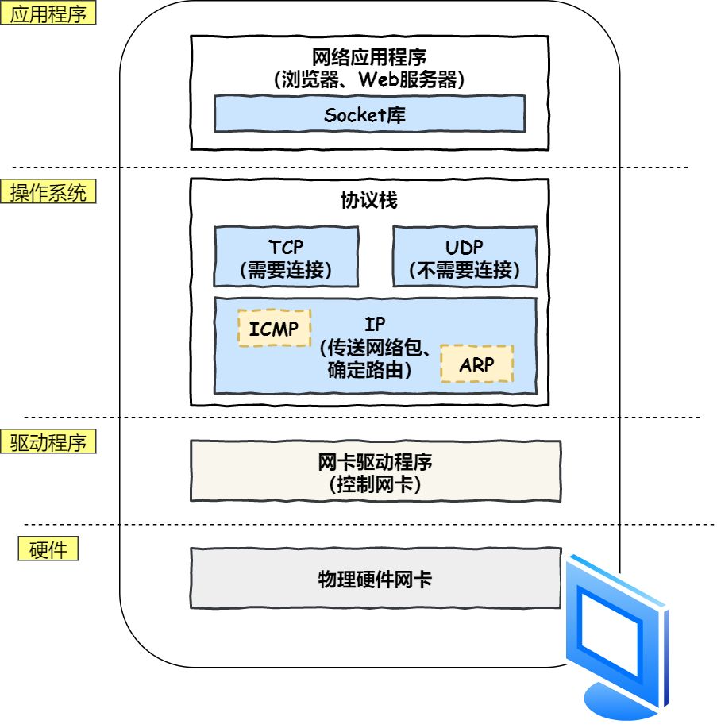

> 摘要：计算机网络属于计算机基础，包括四/七层模型，网络层 IP 协议，传输层 TCP/UDP、三次握手、四次挥手，应用层 HTTP/HTTPS、请求报文和响应报文、状态码、HTTP 缓存机制，Session等。
>
> 用浏览器访问网页的过程（重点是DNS 解析）将所有知识串联到一起。

<!-- more -->

### 基本概念

1. 带宽（bandwidth） ：表示在单位时间内，从网络中的某一点到另一点所能通过的“**最高**数据率”。常用来表示网络的通信线路传送数据的能力。单位是 b/s 比特每秒。
2. 吞吐量（throughput ）：表示在单位时间内，通过某个网络（或信道、接口）的数据量。用于测量实际上到底有多少数据量能通过网络。受网络带宽或额定速率的限制。

### TCP/IP 四（五）层模型 VS OSI 七层模型

  

1. 网络接口层：
   1. 物理层：最底层，利用传输介质实现（相邻两台物理机/计算机节点间的）比特流传送。网卡/物理硬件（负责收发网线中的信号）、中继器和集线器在这层工作。
   2. 数据链路层：将网络层交下来的 IP 数据报组装成帧，可靠的传输到相邻节点（/目标机）的网络层。网卡**驱动**程序（负责控制网卡/硬件）、交换机、网桥。
2. 网络层：路由和寻址。将网络地址翻译成对应的物理地址，通过路由选择算法为 IP 数据报/分组选择（通过通信子网的）最佳路径。路由器；IP 协议。
3. 传输层：为两台主机进程间的（逻辑）通信提供通用的数据传输服务，传送应用层报文。网关；负责收发数据的 TCP 和 UDP 协议。
4. 应用层：浏览器通过调用 Socket 库来委托协议栈工作；
   1. 会话层：用于管理（建立和保持、维护、重连）应用程序间的会话，身份验证等；
   2. 表示层：用于数据处理（编码解码、加密解密、压缩解压缩等）；
   3. 应用层：用于定义网络通信规则（协议），为计算机用户提供服务。报文；HTTP 协议。


**为什么分层**：

1. 封装
2. 解耦

### 一、网络接口层

CRC（Cyclic Redundancy Check）循环冗余检验：为了保证数据传输的可靠性，广泛使用的一种检错技术。

### 二、网络层

常见协议：

1. `IP` 协议：控制网络包收发。
2. `ICMP` 控制报文协议：用于告知网络包传送过程中产生的错误及各种控制信息。
3. `OPSF` 路由选择协议：用于 IP 数据包（在路由器间）的路由选择。
4. `ARP` 地址解析协议：路由器与服务器通信时，用于物理地址寻址，负责将 IP 地址转换为 `MAC` 物理地址。每台主机中都有一张 ARP 缓存表，记录主机的 IP 地址和 MAC 地址间的对应关系；
     1. 在 ARP 缓存中查询 IP 地址，未命中则发送（包含待查询 IP 地址的）ARP 广播请求，等待回应；
     2. 收到广播的主机检查自己的 IP，符合条件的将（含有自己 `MAC` 地址的） ARP 包返回给广播的主机；
     3. 得到 ARP 回应后，将 IP 地址与路由的下一跳 `MAC` 地址写入 ARP 缓存表；以路由下一跳的地址填充目的 `MAC` 地址，以数据帧形式转发；
5. `RARP` 逆地址解析协议：逆向从 IP 地址反查域名。

地址：

1. `MAC`：只负责某一区间（主机、路由器、主机）的通信传输；
2. `IP` 地址：负责将数据包发给最终目的地地址；分类号 + 网络号 + 主机号。
   - 为什么要分离网络号和主机号：两台计算机的网络地址，用于判断是否处于同一广播域内。如果网络地址相同，表明接受方在本网络内，可把数据包直接发送到目标主机。如路由器寻址。
     1. 网络地址（号）：主机位全为0，网段的第一个地址，表示属于互联网的哪一个网络。本机 IP 地址 0.0.0.0。
     2. 主机地址（号）：表示属于网络中的哪一台主机。
   - 子网掩码：网络位 + 主机位
     1. 用 IP 地址与子网掩码**按位与**，用于区分网络位和主机位；
     2. 将一个大的 IP 地址划分为若干子网络；
     3. 检测两个 IP 地址是否属于同一子网；
     4. 减少 IP 地址浪费；
   - 网关地址：路由器的地址；
   - 广播地址：主机位全为1的，网络的最后一个地址；
     - 255.255.255.255 ：受限的广播地址，只能用于本地网络；
   - 回送（~~环回~~）地址：127.0.0.0/8，表示本机地址；
### 三、传输层

##### TCP VS UDP

1. `TCP` 传输控制协议：提供**面向**连接的、可靠的数据传输服务；只能点对点通信。
   - 用于传输对**准确性**要求高的数据，如浏览器与服务器间的 HTTP 通信、文件传输、收发邮件、远程登录等。速度较慢，负载较高，采用虚电路。
2. `UDP` 用户数据报协议：提供**无连接**的数据传输服务，不保证可靠性；支持点对点、多播和广播。
   - 用于即时通信，如语音、视频、直播等。

##### TCP 三次握手


目的：保证客户端和服务端（浏览器和服务器）建立可靠的通信信道。主要作用是为了确认双方的接收和发送能力是否正常、指定自己的初始化序列号、为后面的可靠性传送做准备。

实质上就是连接服务器指定的端口，建立 TCP 连接，并同步客户端和服务端的序列号和确认号，交换 TCP 窗口大小信息。 

```
  		报文标志位    确认号      序列号
B-to-S:	SYN		  (			   seq = x )
S-to-B:	SYN + ACK ( ACK = x+1, seq = y )
B-to-S:	ACK		  ( ACK = y+1, [seq = x+1] )
```

刚开始客户端处于 `Closed` 的状态，服务端处于 `Listen` 状态。Socket 编程中，客户端执行 `connect()` 时，将触发三次握手。

Socket：从传输层上抽象出的一个抽象层，本质是接口。

1. 客户端向服务端：发送 `SYN` 报文/数据包，**请求建立连接**，初始序列号 `seq` 设置为 `x`。
   - 告诉服务端要发送请求，客户端进入 `SYN_SENT` 状态，等待服务端确认。
2. 服务端（**准备好建立连接**后）向客户端：发送 `SYN + ACK` 报文，**请求确认连接**，确认号 `ACK` 设为 （第一次握手时，客户端发送过来的）序列号 `x + 1`，服务端初始化序列号 `seq` 设为 `y`。其中 `ACK` 报文用来应答，`SYN` 报文用来同步。
   - 告诉客户端准备接收数据，然后进入 `SYN_RECV` 状态。
3. 客户端（收到**请求确认连接报文**后~~知道服务器已做好建立连接的准备~~）：发送 `ACK` 报文，确认号 `ACK` 设为 （第二次握手时，服务器发送过来的）序列号 `y + 1`，确认连接。
   - 告诉服务端准备接收数据，客户端和服务端都进入 `ESTABLISHED` 状态，双方建立连接。
   - `ACK` 报文段可携带数据（序列号 `seq` 设置为 `x + 1`），不携带则不消耗序列号。

两次不可以：两次握手只能保证客户端可正常给服务端发送数据，只有经过第三次握手，双方才能确认自己与对方的发送与接收是正常的。

1. 第一次握手：客户端发送数据包，服务端收到了。服务端能确认：客户端的发送能力、服务端的接收能力是正常的；
2. 第二次握手：服务端发送数据包，客户端收到了。 客户端能确认：服务端的接收、发送能力，客户端的发送、接收能力是正常的。不过此时，服务器并不能确认**客户端的接收能力**是否正常；
3. 只有经过第三次握手：客户端发送数据包，服务端收到了。 这样服务端就能确认：**客户端的接收**、发送能力正常，服务器自己的发送、接收能力也正常。

若只有两次握手：已失效的连接请求报文突然又传送到了服务端，从而产生错误。

1. 如第一次握手时，客户端发出的连接请求报文延误、丢失，而未收到来自第二次握手的确认报文；
2. 于是客户端再重传一次连接请求，第二个到达了服务端，客户端收到了确认，二者建立了连接。数据传输完毕后，释放了连接；
3. 此时，第一个丢失的连接请求报文段到达服务端，此时服务端误认为客户端又发出一次新的连接请求，于是就向客户端发出确认报文段，因为不采用三次握手，所以二者直接建立连接；服务器并不能确认**客户端的接收能力**是否正常；
4. 客户端已关闭连接，会忽略服务端发来的确认，也不发送数据，则服务端一直等待客户端发送数据，浪费资源。

##### 数据传输

```
  		标志位 确认号  	序列号
B-to-S:	ACK ( ACK = y+1, seq = x+1 )
S-to-B:	ACK ( ACK = x+2 		   )
```

##### TCP 四次挥手

```
  	报文标志位 确认号	   序列号
B-to-S:	FIN ( 			 seq = x )
S-to-B:	ACK	( ACK = x+1 		 )
S-to-B:	FIN ( 			 seq = y )
B-to-S:	ACK ( ACK = y+1			 )
```

当 TCP 连接超过一定时间或不再使用时（数据传送完毕、传输完一个网页的全部资源、收到全部内容后），触发四次挥手。

1. 客户端向服务端：发送 `FIN` 连接释放报文段，表示请求报文发送完了，准备关闭 TCP 连接，并停止发送数据。
   - 客户端进入 `FIN_WAIT1`（终止等待1）状态，等待服务端确认。
2. 服务端收到 `FIN` 后，向客户端发送 `ACK` 报文：`ACK` 确认号设置为（第一次挥手时）客户端发送过来的序列号 `x + 1`，表示**已收到**客户端的关闭连接请求。
   - 此时服务端进入 `CLOSE_WAIT` **半关闭**状态，即客户端已没有要发送的数据，但服务端若发送数据，则客户端仍要接收；
   - 客户端收到服务端的确认后，进入 `FIN_WAIT2`（终止等待2）状态，等待服务端发出的连接释放报文段。
3. 服务端响应报文**发送完**后，请求关闭/断开与客户端的连接，（和客户端的第一次挥手一样），发出 `FIN` 连接释放报文，指定一个序列号 `y`。告诉客户端响应报文发送完了，同意关闭请求。
   - 此时服务端进入 `LAST_ACK` （最后确认）状态，等待客户端的确认。 
4. 客户端收到 `FIN` 连接释放报文段后，发送 `ACK` 确认作为应答，将 `ACK` 确认号设置为收到的服务端序列号 `y + 1`；告诉服务器响应报文接受完了。
   - 此时客户端进入 `TIME_WAIT` 状态。
   - 服务端收到 `ACK` 报文后，关闭连接，进入 `CLOSED` 状态；
   - 客户端等待一定时间未收到回复，则正常关闭，进入 `CLOSED` 状态。

**挥手为什么需要四次**？

四次由 TCP 的**半关闭**（half-close）造成的。即，TCP 提供了一种能力，连接的一端在**结束发送**后、还能接收来自另一端的数据。第二次挥手后。

关闭连接时，当服务端收到 `FIN` 报文时，可能响应报文并没有发送完，并不会立即关闭 `SOCKET` 连接，所以只能先回复一个 `ACK` 报文，告诉客户端收到了发的 `FIN` 报文。只有等到服务端所有的报文都发送完了，才发送 `FIN` 报文，故需四次挥手。

##### TCP 如何保证可靠传输

在不可靠服务的基础上实现可靠的信息传输。

1. 校验和：如果收到段的检验和有错，TCP 将丢弃此报文段。
2. 序列号：为发送的包/数据块编号，接收方对数据包排序，去重，再传送给应用层。
3. 确认应答/ARQ 自动重传请求协议：每发完一个分组就停止发送，收到对方确认后再发下一个；ACK 报文中有对应的确认序列号，告诉发送方接收了哪些数据、下一次数据从哪里传。
4. （最关键）**超时重传**：当 TCP 发出一个报文段后，启动定时器，等待目的端确认收到；超时后仍未收到确认，则重发此报文段。
5. 三次握手四次挥手，用来建立和关闭连接；
6. 流量控制：利用滑动窗口（接收方发送的确认报文中的窗口字段用来控制发送方窗口大小）实现流量控制，控制发送速率，解决丢包重传。
7. 拥塞控制：当网络拥塞时减少数据发送。

### 四、应用层

#### 应用层协议

运行于 TCP 协议上的：

1. `HTTP` 超文本传输协议：用于浏览器与服务器间的通信（传输数据）。基于 TCP 协议，先（3 次握手）建立 TCP 连接，再发送 HTTP 请求。功能包括：事务处理、缓存控制、标记媒体类型等。
2. `FTP` 文件传输协议：基于 TCP 实现可靠传输，好处是可屏蔽操作系统和文件存储方式。
3. `SMTP` 邮件发送协议；
4. `POP3/IMAP` 邮件接收协议。
5. `Telnet` 远程登录协议：缺点是所有数据以明文发送；
6. `SSH` **安全网络传输**协议：是目前较可靠、专为远程登录会话和其他网络服务提供安全性的协议。解决了 Telnet 不安全的问题，可有效防止远程管理过程中的信息泄露问题。

运行于 UDP 协议上的 ：

1. [`DNS` 域名解析协议](#DNS 域名解析)；
2. `DHCP` 动态主机**配置**协议：用于内部网（路由器？）或网络服务供应商自动分配 IP 地址给用户。

#### HTTP

##### HTTP/1.0 VS HTTP/1.1

1. 连接方式：`HTTP/1.0` 默认用短连接；`HTTP/1.1` 默认长连接（成功建立后保持连接不关闭），开启 `Keep-Alive`，请求头设置 ``Connection: Keep-Alive` `。
2. 状态（响应）码：`HTTP/1.1`新加入大量状态码，如 `100、206、409、410` 等。
3. **缓存处理** :  `HTTP/1.0` 中主要用请求 `header` 中的 `If-Modified-Since/Expires` 作为缓存判断标准；`HTTP/1.1` 引入了更多的缓存控制策略，如 `Entity tag，If-Unmodified-Since, If-Match/If-None-Match` 等。[HTTP 缓存机制](#HTTP 缓存机制)
4. **带宽优化**：`HTTP/1.0` 传送整个对象，浪费带宽；`HTTP/1.1` 在请求头引入了 `range` 头域，允许只请求资源的某个部分（返回码 `206`），充分利用带宽，还支持断点续传。
5. `HTTP/1.1` 在请求头中新增 `Host` 字段。

##### HTTP2.0

##### HTTP VS HTTPS 协议

都是 `TCP` 作为底层协议。

1. **端口号**：`HTTP` 默认是 80，`HTTPS` 默认是 443。
2. **URL 前缀**：http://；https://。
3. 安全性和资源消耗： `HTTP` 传输内容是明文，客户端和服务器端都无法验证对方的身份。`HTTPS` 运行在 `SSL/TLS` 之上，传输内容经过**对称加密**，密钥用服务器的证书进行**非对称加密**。安全性高，但耗费更多资源。

**https 加密的过程**

- 对称加密：加密和解密用同一个密钥，**最大的问题是**如何安全地将密钥发给对方；

- 非对称加密：用一对公钥和私钥。**发送方**用对方的公钥加密，对方用自己的私钥解密。

#### HTTP Request 请求报文

> 客户端请求消息


1. 请求行（request line）：
   
   ```
   GET	 /search?lan=zh-CN&name=tom  HTTP/1.1
   ```
   
   1. 8种请求方法：
      - `HTTP/1.0`：`GET` 、`POST`、`HEAD` 方法；
      - `HTTP/1.1`：`PUT、DELETE、CONNECT、OPTIONS、TRACE` 方法。
   2. URL 地址：指定/定位资源地址，也可传递 `GET` 方法的请求参数；
   3. 协议名及版本号：`HTTP/1.0、HTTP/1.1、HTTPS`。
   
2. 请求头（header）：报文头的字段及取值（“属性名 : 属性值”），通知服务器关于客户端请求的附属信息。 `HttpServletRequest` 服务端用于读取请求报文头的 API。
   1. `Accept: text/plain, image/jpeg` 客户端可识别的内容类型列表；告诉服务端，客户端接受什么类型的响应。一个或多个 `MIME` 类型的值；
   2. Referer 表示这个请求是从哪个URL过来的；
   3. `User-Agent:` （产生请求的）浏览器类型，兼容性及定制化需求；
   4. `Host: localhost:8088` 请求的主机名，允许多个域名同处一个IP地址，即虚拟主机；
   5. `Content-Type 和 Content-Length` 与请求体相关；
   6. `Connection: Keep-Alive` 即持久连接，一个连接可发多个请求；
   7. `Cache-Control: no-cache` 让请求返回的响应内容不要在客户端缓存；
   8. `Cookie: JSESSIONID=xxx`
   9. 缓存处理 :  `HTTP/1.0` 中主要用请求 `header` 中的 `If-Modified-Since/Expires` 作为缓存判断标准；`HTTP/1.1` 引入了更多的缓存控制策略，如 `Entity tag，If-Unmodified-Since, If-Match/If-None-Match` 等。

3.  请求体（Request body、请求数据、报文体）：在 `POST` 方法中使用，可包含多个请求参数。适用于需客户填写表单的场合，存放表单的键值对。

##### GET 请求 VS POST 请求

1. ~~情景~~：`GET` 当客户端点击网页上的链接、在浏览器的地址栏输入网址、要从服务器中读取文档时。
2. 用法：`GET` 要求服务器将 URL 定位的资源放在响应报文的数据部分，回送给客户端。`HEAD`类似 `GET`，只不过服务端接收到 `HEAD` 请求后只返回响应头，而不会发送响应内容，适合只需查看某个页面的状态时。
3. 参数：
   1. 参数限制：`GET` 一般不含请求体，请求参数（以地址的形式）通过 URL 传递，有长度、大小限制，只接受 ASCII 字符；`POST` 将请求参数（以 `key-value` 的形式）封装在请求体中，没有限制，可传输大量数据。
   2. 安全性/可见性：`GET` 的参数所有人可见，不安全，不适合传送私密数据、敏感信息。
   3. 历史记录：`GET` 请求参数会被完整保留在浏览器历史记录里，URL 地址可被收藏，而 `POST` 中的参数不会被保留。
   4. 回退：`GET` 请求在浏览器回退时是无害的，而 `POST` 会再次提交请求。
4. 编码类型：`GET` 请求只能进行 URL 编码，而 `POST` 支持多种编码方式。
5. TCP 数据包：`GET` 请求发送一个 TCP 数据包； `POST` 发送两个。
   - 对于 `GET` 请求，浏览器会把 http header 和 data 一起发送出去，服务器响应 200（返回数据）；
   - 而对于 `POST` ，浏览器先发送 header，服务器响应 100 continue，浏览器再发送 data，服务器响应 200 ok（返回数据）。
6. 缓存：`GET `会被浏览器主动 cache，而 `POST` 不会，除非手动设置。

#### HTTP Response 响应报文

> 服务端响应消息


1. 状态行：
   1. 协议名及版本；
   2. 状态码及状态描述；
2. 消息报头（响应头）：由多个键值对组成；
   1. `Content-Type`：`application/json`。
   2. `Cache-Control: max-age=3600` 服务端告诉客户端如何控制响应内容的缓存。缓存3600秒。
   3. `Location: https://github.com` 让客户端再发一个请求到重定向的 URL，状态码为 `303`。
   4. `Set-Cookie: UserID=Jack; Max-Age=3600; Version=1` 服务端可设置客户端的 Cookie。
3. 响应体（响应正文）

##### 状态码

服务端发生错误时，返回给前端的响应信息必须包含 HTTP 状态码、errorCode、 errorMessage、用户提示信息四部分。涉及对象分别是浏览器、前端开发、错误排查人员、用户。

- 浏览器接受并显示网页前；
- 在**服务器响应消息**的**状态行**中；

状态码：
1. `1XX`：接收的请求正在处理。
2. `2XX`：请求正常处理完毕。
  - `200 (OK`：请求成功，表明该请求被成功完成，所请求的资源已发送到客户端。一般用于 GET 或 POST；
  - `206 (Partial Content)`：范围请求；
3. `3XX`：重定向，需附加操作以完成请求；让客户端再发起一个请求以完成整个处理。
  - ~~`301`：永久重定向，表示旧地址的资源已被永久移除（不可访问了）；~~
  - `302`：临时重定向，表示旧地址的资源还在（仍可访问），只是临时跳转到新地址，搜索引擎会抓取新地址的内容而保存旧网址；SEO 302 好于 301；
  - `303 (See Other)`：重定向到其它页面，目标 URL 在响应报文头的 Location 属性；
  - `304 (Not Modified)`：资源（自上次取得后）并未修改，直接用本地的缓存；
4. `4XX`：客户端错误。
  - `400 (Bad Request)`：客户端请求有语法错误，不能被服务器所理解；
  - `401 (Unauthorized)`：请求未经授权，必须和 `WWW-Authenticate` 头域一起使用；常见于用户未登录的情况；
  - `403 (Forbidden)`：服务器拒绝请求，禁止访问资源。常见于机密信息或复制其它登录用户链接访问服务器的情况；
  - `404 (NotFound)`：服务器无法取得所请求的网页，请求资源不存在。如输入错误的URL；
  - `409 (Conflict)`：请求与当前资源的规定冲突；
  - `410 (Gone)`：资源已被永久转移，且没有任何已知的转发地址；
5. `5XX`：服务器端错误。
  - `500 (Internal Server Error)`：服务器发生不可预期的错误，通过服务端日志查看抛出的异常；
  - `501 (Internal Server Error)`：内部服务器错误；
  - `503 (Server Unavailable)`：服务器当前不能处理客户端的请求，一段时间后可能恢复正常；
  - 路由出错，HTTP 版本不支持等；

#### HTTP 缓存机制

> HTTP性能优化

##### 缓存策略

缓存是一种保存资源副本并在下次请求时直接使用该副本的技术，当 web 缓存发现请求的资源已被存储，会拦截请求，返回该资源的拷贝，而不会去资源服务器重新下载。

HTTP 缓存主要是通过请求和响应报文头（`Expires、Cache-Control、Last-Modified、Etag` 字段）来控制缓存策略。

优点：优秀的缓存策略可缩短网页请求资源的距离，减少延迟，节省网络流量；由于缓存文件可重复利用，降低网络负荷，提高客户端响应。

根据是否需重新向服务器发起请求分为两种：强制缓存和对比缓存。

1. 强制缓存先向**浏览器的缓存数据库**请求数据，如果缓存命中且未失效，则直接返回数据，不需再和服务器发生交互；而对比缓存不管是否命中，都需与服务端发生交互。
2. 强制缓存优先级高于对比缓存，即，当执行强制缓存的规则时，如果缓存命中，直接使用缓存，不再执行对比缓存规则。

##### 强制缓存


响应 header 中两个字段来**标明失效规则**：

- `Expires`：**HTTP/1.0**，服务端返回的缓存到期时间，即下一次请求时，请求时间小于此时间，则直接使用缓存数据。
  - 到期时间由**服务端**生成，如果客户端跟服务器时间不一致，会导致缓存命中的误差。故浏览器默认使用 `HTTP/1.1`，即：
- `Cache-Control`： **HTTP/1.1**，用于指定缓存规则；
  1. `max-age`：用来设置资源可被缓存多长时间，缓存的内容将在 xxx 秒后失效，单位为秒；
  2. ~~`s-maxage`：同 `max-age`，不过只针对代理服务器缓存；~~
  3. `public`：任何缓存区（客户端和代理服务器）都可缓存响应；
  4. `private`：只能被客户端，而不能被代理服务器缓存；
  5. `no-cache`：用对比缓存来验证缓存数据；
  6. `no-store`：禁止一切缓存（这才是响应资源不被缓存的意思）；所有内容都不缓存，强制缓存、对比缓存都不会触发。

##### 对比缓存


每次请求都需让服务器验证缓存数据是否过期（缓存响应的有效性），从而决定浏览器是否可以使用缓存。

1. 向缓存数据库请求缓存数据的标识；
2. 浏览器第一次请求数据时（缓存未命中）：服务器（在响应请求中）将缓存标识/规则（`Etag` 标识或 `Last-Modified` 最后修改时间）与数据一起返回给浏览器，返回状态码 `200`，浏览器将二者备份至缓存数据库中。
3. 浏览器再次请求数据时：将缓存标识（作为 `If-None-Match` 或 `If-Modified-Since`）发送给服务器进行判断，比较**服务器资源**的 `Etag `是否与 `If-None-Match` 相同 、或 `Last-Modified` 是否小于（早于）等于 `If-Modified-Since`：
   1. 相同、早于等于，则比较成功，返回 `304 (Not Modified)` 状态码，表示资源（自上次取得后）并未修改/未失效（缓存命中），浏览器可直接使用本地缓存；
   2. 不同、晚于，则比较失败，则说明资源修改过了（缓存未命中），浏览器不能再继续使用此缓存，需（如同第一次请求数据时一样）重新完整响应。

### 分布式 Session 和 Cookie

> 见分布式

### 浏览器访问网页的过程

##### URL 解析

Q1：URL 统一资源定位符：用于定位互联网上资源，俗称网址。

```
<协议>://<域主机>.<Web 服务器域名>:<端口>/<资源路径地址>/<文件名>?
scheme://host.domain:port/path/filename?<参数>
```

1. `scheme`：因特网服务的类型。常见的协议有 http、https、ftp、file。
2. `host`：域主机（http 的默认主机是 www）；
3. `domain`：因特网/Web 服务器**域名**，主机地址，如 w3school.com.cn；
4. `port`：主机上的端口号（http 的默认端口号是 80）；
5. `path`：服务器上的资源路径地址（如果省略，则文档必须位于网站的根目录中）；
6. `filename`：文档/资源名；

##### DNS 域名解析

`DNS` 域名解析（应用层？）：通过网址/域名查找服务器的 IP 地址，基于（网络层的）路由和 `IP` 寻址）、（传输层的）UDP 协议；

```
域名 		  服务器外网IP地址  端口
baidu.com	220.114.23.56 	80
```


1. 客户机（本机）DNS 解析：
   1. `Q2`：浏览器查询**DNS 解析缓存**（域名和 IP 地址映射关系，有时间和大小双重限制），命中则直接返回，未命中（没有找到记录或记录已过期）；
   2. ~~路由器缓存；~~
   3. `Q3`：查询本地 `HOSTS` 文件（本机操作系统缓存）；
2. `Q4`：浏览器向本地 DNS 服务器（正式）发送解析请求（递归查询）：
   1. **本地 DNS 服务器**：TCP/IP 参数中设置的首选 DNS 服务器，一般是运营商区域 DNS 服务器，由ISP（Internet Service Provider，互联网服务提供商，如电信/移动宽带、大型互联网公司提供的）的 DNS 服务器、根据 `DHCP` 动态主机设置协议自动分配 IP 地址；
   2. `Q5`：查询本地区域资源配置：如果域名在区域中（命中），则返回解析结果，有权威性；如果不在区域中，
   3. `Q6`：查询**本地 DNS （解析结果）缓存**：命中直接返回解析结果，没有权威性；
      - TTL（Time To Live）参数：设置本地 DNS 服务器对于域名的缓存（最长）时间，过期失效后将删除这条记录。如，阿里云解析默认的 TTL 是10分钟。
3. 本地 DNS 服务器有两种配置：
   1. 配置直接转发 DNS，**递归查询** DNS；每一级与本地 DNS 查询一样；一般是先向根域服务器查询（`Q7`），再由根域名服务器一级级（`Q8 -> Q10 -> Q12`）向下查询，最后将得到的查询结果逐级（`A12 -> A10 -> A8 -> A7`）返回给本地 DNS 服务器，再返回给浏览器。
   2. 不配置转发 DNS，通过**根提示**进行**迭代查询**：根 DNS 服务器不是自己向其他 DNS 服务器进行查询，而是返回能解析该域名的其他 DNS 服务器的 IP 地址，本地 DNS 服务器再继续向这些 DNS 服务器迭代查询，直到得到结果：
      1. `Q7`：本地 DNS 服务器根据根提示，向根 DNS 服务器发起 DNS 解析请求；
         - `Q8`：根 DNS 服务器查询（负责管理目标域名的） `.com` 顶级域名对应的（DNS 服务器的）IP 地址，返回给本地 DNS 服务器；
      2. `Q9`：本地 DNS 服务器向 `.com` 顶级域名 DNS 服务器发起 DNS 解析请求；
         - `Q10`：`.com` 顶级域名 DNS 服务器查询（负责管理目标域名的） `baidu.com` 子域名对应的（DNS 服务器的）IP 地址，返回给本地 DNS 服务器；
      3. `Q11、Q12`：不断迭代（如二级域名），直到获得目标域名对应的 IP 地址，返回给本地 DNS 服务器；
      4. `A11`：将域名解析的结果（以域名和 IP 地址键值对的形式）写入本地 DNS 解析缓存表，并设置 TTL；
   3. 将域名解析的结果返回给浏览器，更新浏览器 DNS 缓存；
4. `Q13`：浏览器根据 IP 地址生成 HTTP 请求，发送给服务器。

##### DNS 负载均衡

如果配备了 DNS 负载均衡：一个域名可能对应多个 IP 地址；

1. DNS 解析获得的 IP 地址是负载均衡服务器的 IP 地址；
2. 负载均衡服务器根据设定的分配算法和规则（如根据每台机器的负载量，离用户地理位置的距离等），选择一台后端的（真实） Web 服务器 IP 地址并返回；

DNS 缓存污染/投毒（DNS cache pollution/poisoning）：指一些刻意制造的域名服务器数据包， 把域名指往不正确的 IP 地址。是常见的黑客攻击手段，也是防火长城的主要手段之一。

##### 三次握手建立 TCP 连接

（传输层）发起 `TCP` 请求：浏览器（选择一个大于1024的本机端口（`8080`？）向目标 IP 地址的 `80` 端口）发起 TCP 连接请求，经过[三次握手](TCP 三次握手)建立 TCP 连接；Cookie 会随请求发送给服务器。

##### HTTP 缓存机制

[HTTP 缓存机制](#HTTP 缓存机制)

1. 强制缓存：向浏览器的缓存数据库判断缓存是否失效；
2. 对比缓存：将缓存标识发送给服务器，判断缓存是否过期，从而决定浏览器是否使用缓存（缓存策略）；

##### 发送 HTTP 请求

应用层：建立 TCP 连接后，浏览器生成 HTTP 请求报文（请求行、请求头、请求体），发给服务器；

~~浏览器按照 HTTP 协议的格式[组装数据](#TCP/IP 四（五）层模型 VS OSI 七层模型)，最终将数据按照 TCP/IP 协议的方式发送给服务器；~~

1. ~~TCP 将 HTTP 请求报文分割成报文段，并可靠地传给对方；~~
2. ~~在网络层使用 IP 协议：搜索对方地址，中转并传送；~~
   1. ~~OSPF 路由选择协议，IP数据包在路由器间传递；~~
3. ~~服务器接收报文段并重组 HTTP 请求报文，解析并进行相应的处理；~~

##### 服务器处理请求并返回 HTTP 响应报文

将请求转发到 Nginx 负载均衡（反向代理）服务器：将同一个应用部署在多台服务器上，将大量用户的请求分配给多台机器处理；

1. 负载均衡服务器与选择的 Web 服务器建立 TCP 连接，转发浏览器的请求；
2. Web 服务器收到请求后，调用自身服务（如 Spring Boot 应用等）处理请求，生成 HTTP 响应报文（响应行、响应头、响应体），（通过使用 TCP/IP 协议）返回给负载均衡服务器；
3. ~~将网页传递给 `filters` 链处理，~~再返回给浏览器。

##### 四次挥手断开 TCP 连接

当 TCP 连接超过一定时间或不再使用时（数据传送完毕、传输完一个网页的全部资源、收到全部内容后），[四次挥手](#TCP 四次挥手)断开（与服务器间的） TCP 连接。

##### 浏览器解析渲染网页


1. 浏览器解析网页内容：根据响应头的 `Content-Type` 字段的值判断数据类型，如文字、图像、声音、视频等;
   1. 解析 `HTML` 标签生成 `DOM` 树；
   2. 解析 `CSS` 代码生成 `CSS` 规则树；
   3. 调用 `JavaScript` 执行引擎执行 JS 代码；
2. 结合 `DOM` 树和 `CSS` 规则树，生成渲染树，；
3. 根据渲染树**计算**每个节点的布局信息（元素在网页中的位置和尺寸）；
4. 根据计算好的信息**绘制**（渲染）网页；
5. 页面引用了其他未加载的 image、css、js 文件等静态内容，从提供静态资源的服务器加载；
   - CDN 内容分发网络：是依靠部署在各地的边缘服务器，使用户就近获取所需内容，降低网络拥塞，提高用户访问响应速度。

### 跨域

跨域：指不同域名间相互访问。浏览器不能执行其他网站的脚本，是由同源策略（对于JavaScript所定义的安全限制策略）造成的。

##### 什么情况会跨域

1. 同一协议， 如http或https；
2. 同一IP地址，如127.0.0.1；
3. 同一端口，如8080；

以上三个条件任一条件不同就会产生跨域问题。

##### 解决方案

**前端解决方案**

1. 使用JSONP方式实现跨域调用；
2. 使用NodeJS服务器作为服务代理，前端发起请求到NodeJS服务器， 代理转发请求到后端服务器；

**后端解决方案**

1. nginx反向代理解决跨域；
2. 服务端设置Response Header(响应头部)的 `Access-Control-Allow-Origin`；
3. 在需跨域访问的类和方法中设置允许跨域访问（如Spring中使用`@CrossOrigin`注解）；
4. 继承使用Spring Web的`CorsFilter`（适用于Spring MVC、Spring Boot）；
5. 实现WebMvcConfigurer接口（适用于Spring Boot）；

[Java 解决跨域问题](https://cloud.tencent.com/developer/article/1668879)