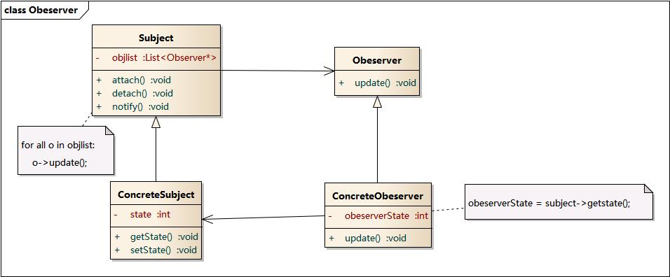

> 摘要：23种设计模式，其中5种创建型、7种结构型、11种行为型。

<!-- more -->

---

> JDK 中用到了哪些设计模式?
>
> Spring 中用到了哪些设计模式?
>
> 需要达到3个层次：
>
> 1. 能在白纸上画出所有的模式结构和时序图；
>2. 能用代码实现；如果模式的代码都没有实现过，是用不出来的；即所谓，看得懂，不会用；
> 3. 灵活应用到工作中的项目中；

设计模式(Design Pattern)是一套被反复使用、多数人知晓的、经过分类编目的、代码设计经验的总结。

一般而言，设计模式有四个基本要素：

1. 模式名：一个助记名，用一两个词来描述模式的问题、解决方案和效果。
2. 问题、使用情景：描述了应在何时使用。
3. 解决方案：描述了设计的组成成分、相关关系及各自的职责和协作方案。
4. 效果：描述了模式应用的效果及使用模式应权衡的问题。

### 设计模式的七大原则

1. 开闭原则 OCP：对扩展开放，对修改关闭。关键步骤是**抽象化**，实现方法有：
   1. 通过**接口或抽象类**约束扩展，不允许出现在接口或抽象类中不存在的public方法。即，扩展要添加具体实现，而不是改变已有方法。
   2. 参数类型、引用对象尽量用接口或抽象类，而不是实现类。能尽量保证抽象层是稳定的。如，用抽象类代替相似内容的else if分支。
   3. 一般抽象模块设计完成（如接口的方法已经敲定），不允许修改接口或抽象方法的定义。
2. 单一职责：一个类只负责一个功能领域中的相应职责。承担的职责越多，复用的可能性越低。当一个职责变化时，可能会影响其他职责的运作。核心是**解耦和增强内聚性**。确定职责的粒度，得出相对合理的职责分配。
3. 里氏替换：子类应可以完全替换父类。即，**继承**时只扩展新功能，而不要破坏父类原有的功能。是对开-闭原则的补充，继承就是抽象化的具体实现。子类可继承基类的所有非私有属性或方法。
4. 依赖倒转：依赖于抽象接口，不能依赖于具体实现。本质是：**面向接口(抽象)编程**。
   - 传递参数时或在关联关系中，尽量引用层次高的抽象层类，即，用接口和抽象类进行变量、参数、方法返回的类型声明，及数据类型的转换等，而不要用具体类。将具体类的对象通过依赖注入的方式注入到其他对象中，如Spring的IOC。
5. 接口隔离：客户端不应依赖它不需要的接口，类间的依赖关系应建立在最小的接口上。接口在实现时拆分冗余方法，让实现类只依赖自己需要的接口方法。即，接口尽量细化，同时接口中的方法尽量少。
   - 设计接口时有可能满足单一职责原则、但不满足接口隔离原则，接口太大时分割。
6. 合成 / 聚合复用：尽量用**合成/聚合**，而不是通过继承达到复用已有功能的目的。即，新对象通过向内部持有对象的委派、达到复用已有功能的目的。称为"黑箱"复用。
   - 继承复用破坏包装，因为继承将基类的实现细节暴露给派生类，称为"白箱复用"。基类发生改变，会影响所有派生类的实现。
   - 不得已使用继承的话，必须符合里氏代换原则
7. 迪米特法则 / 最少知识：一个软件实体应当尽可能少的与其他实体发生相互作用。即，一个类不应知道自己操作的类的细节。**类间解耦**。

**SOLID**：单一职责原则、开闭原则、迪米特法则、里氏代换原则和接口隔离原则。

- [设计模式概念和七大原则](https://cloud.tencent.com/developer/article/1650116)

### UML 类图和时序图

##### UML 统一建模语言

> 可视化的、面向对象的、软件开发的工业标准。

在UML系统开发中有三个主要模型：

- 功能模型：从用户的角度展示系统的功能，包括用例图。
- 对象模型：采用对象，属性，操作，关联等概念展示系统的结构和基础，包括类别图、对象图。
- 动态模型：展现系统的内部行为。包括序列图，活动图，状态图。

##### 类间关系与UML图例


- `<<abstract>>`：抽象类
- 继承关系为 is-a，eg：自行车是车、猫是动物。
  - 实现关系：带空心箭头的虚线。eg：车为抽象概念（接口），在现实中无法直接用来定义对象，只有指明具体的子类(汽车or自行车)，才可用来定义对象。表现为继承抽象类。
  - 泛化关系：带空心箭头的实线。eg：汽车与SUV。表现为继承非抽象类。
- 聚合关系：带空心菱形箭头的实线。eg：学生与班级。
  - 组合关系：带实心菱形箭头的实线。是一种强依赖的特殊聚合关系，如果整体不存在了，则部分也不存在了。
    - eg：轮胎、发动机组成小汽车。
- 关联关系：实线。 通常与运行状态无关，用来定义不同类的对象间静态的、天然的、由常识等因素决定的结构；是一种强关联的关系。默认不强调方向，表示对象间相互知道，箭头表示A知道指向的对象B。
  - eg：乘车人和车票、学生和学校。
  - 通常是以成员变量的形式实现。
- 依赖关系：带箭头的虚线。描述对象在运行期间会用到另一个对象的关系；是一种临时性的关系，通常在运行期间产生，随运行变化； 双向依赖是一种非常糟糕的结构，应保持单向依赖。
  - eg：学生依赖于指向的自行车。
  - 体现为构造方法及方法的传入参数，箭头的指向被调用者；“使用”对方的方法和属性。

##### 时序图

- 在需求分析阶段，如果与系统交互的 User 超过一类并且相关的 UseCase 超过 5 个，使用用例图来表达更加清晰的结构化需求。
- 如果某个业务对象的状态超过 3 个，使用状态图来表达并且明确状态变化的各个触发条件。
说明:状态图的核心是对象状态，首先明确对象有多少种状态，然后明确两两状态之间是否存在直接转换关系，再明确触发状态转换的条件是什么。 
正例:淘宝订单状态有已下单、待付款、已付款、待发货、已发货、已收货等。比如已下单与已收货这两种状态之间是 不可能有直接转换关系的。
- 如果系统中某个功能的调用链路上的涉及对象超过 3 个，使用时序图来表达并且明确各调用环节的输入与输出。
- 如果系统中模型类超过 5 个，且存在复杂的依赖关系，使用类图来表达并且明确类之间的关系。 说明:类图像建筑领域的施工图，如果搭平房，可能不需要，但如果建造蚂蚁 Z 空间大楼，肯定需要详细的施工图。
- 如果系统中超过 2 个对象之间存在协作关系，并需要表示复杂的处理流程，使用活动图来表示。 说明:活动图是流程图的扩展，增加了能够体现协作关系的对象泳道，支持表示并发等。

时序图：显示对象间交互与协作关系，清晰立体地反映系统的调用纵深链路。按时间顺序排列。

顺序图：显示参与交互的对象及其对象间消息交互的顺序。

包括的建模元素主要有：

- 系统角色（Actor）：可是人、其他的系统或子系统。
- 对象（Object）：三种命名方式：对象名和类名、只显示类名表示匿名对象、只显示对象名。
- 生命线（Lifeline）：表示为从对象图标向下延伸的虚线，表示对象存在的时间。
- 控制焦点（Focus of control）：表示时间段的符号，在这个时间段内对象将执行相应的操作。用小矩形表示。
- 消息（Message）：一般分为：
  - 同步消息=调用消息（Synchronous Message）：消息发送者把控制传递给消息的接收者，然后停止活动，等待消息的接收者放弃或返回控制。用来表示同步的意义。
  - 异步消息（Asynchronous Message）：消息发送者通过消息把信号传递给消息的接收者，然后继续自己的活动，不等待接受者返回消息或控制。接收者和发送者是并发工作的。
  - 返回消息（Return Message）：表示从过程调用返回
  - 自关联消息（Self-Message）：  表示方法的自身调用及同对象内的方法调用另一个方法。

### 创建型模式（5种）

> 对象实例化的模式，用于对象的创建对业务或应用逻辑是强依赖，或者创建的创景比较复杂的场景。

#### 单例模式

SingleInstance，某个类（单例类）有且只有一个实例。如：线程池、缓存、日志对象、对话框、注册表，充当打印机、显卡等设备驱动程序的对象。

目的（优点）：

- 保证对象的唯一性；
- 避免因创建多个实例造成资源浪费；new 操作次数减少，因而对系统内存的使用频率也会降低，这将减轻 GC 压力，缩短 GC 停顿时间。
- 且多个实例由于多次调用易导致行为异常、结果不一致等错误。

##### 三个要点

- 确保某个类（单例类）有且只有一个实例：
  - 用 `private` 修饰构造函数=>不允许其他类`new`该类的对象；
  - 创建静态对象；
- 自行实例化：通过`new`在本类中创建一个本类（私有静态）对象（单例）；
- 对外提供可全局访问的`getInstance()`方法、用于获取该对象（单例）；

##### 懒汉实现（推荐）

获取单例时发现没有对象、才去创建对象。

```
class Singleton {
	private static Singleton instance;	//
	private Singleton() {}
	// 保证了:延迟加载和线程安全
	public static Singelon getInstance() {	//
		if (instance == null) {	// 这里线程是不安全的,可能得到两个不同的实例，需要第二次判空
			synchronized (Singleton.class) { //双重校验锁，每个线程获取类的实例时，进行同步
				if (instance == null) { //只执行一次实例化代码，后面的线程想获得该类实例，直接return就行
					this.instance = new Singleton();
				}
			}
		}
		return this.instance;
	}
}

Singleton sg = Singleton::getInstance();
```

##### 饿汉实现

通过类获取单例时、对象已创建好。

在类加载时就完成了实例化，避免了线程的同步问题。

缺点：没有达到`Lazy Loading`（懒加载）的效果，即，即使没用到这个实例也会加载，造成内存浪费（可忽略）。

```
public class SingletonEHan {

    private SingletonEHan() {}
    private static SingletonEHan singletonEHan = new SingletonEHan();

    public static SingletonEHan getInstance() {
        return singletonEHan;
    }
}
```

##### 内部类实现

类似饿汉实现，都是采用了类装载的机制、来保证初始化实例时只有一个线程。

不同:

 * 饿汉方式只要类被装载就会实例化；
 * 内部类是在需要实例化时，调用`getInstance()`方法，才会装载`SingletonInHolder`类。

```
public class SingletonIn {

    private SingletonIn() {}

    private static class SingletonInHodler {
        private static SingletonIn singletonIn = new SingletonIn();
    }

    public static SingletonIn getSingletonIn() {
        return SingletonInHodler.singletonIn;
    }
}
```

##### 枚举实现

略

#### 建造者模式

又称生成器模式。将一个复杂对象的构建与它的表示分离，使得同样的构建过程可创建不同的表示。

#### 工厂模式

- 静态工厂（方法）模式：项目中的辅助类，类+静态方法。
  - JDK类库中广泛使用了简单工厂模式，如工具类java.text.DateFormat，用于格式化本地日期或时间。TextUtil.isEmpty等
- 简单工厂模式：专门定义一个类来负责创建其他类的实例，被创建的实例通常都有共同的父类。
- 工厂方法模式：定义一个创建对象的接口，但由子类决定要实例化的类是哪一个。可根据参数的不同返回不同类的实例。`public abstract RouJiaMo sellRoujiaMo(String type);`
- 抽象工厂模式：提供一个接口`public interface RouJiaMoYLFactroy`，用于创建相关的或依赖对象的家族`public Meat createMeat(); public YuanLiao createYuanliao();`，而不需要明确指定具体类。

#### 原型模式

用于直接创建对象的代价较大时，创建重复的对象（当前对象的克隆），同时又能保证性能。

- 如，一个对象需在一个高代价的数据库操作后被创建，可缓存该对象，在下一个请求时返回它的克隆，在需要时更新数据库，以此来减少数据库调用。

### 结构型模式（7种）

> 把类或对象结合在一起形成一个更大的结构。一般是解决不同的类之间有不同关系的情况。

#### 适配器模式

把一个接口转成另一个接口，让原本接口不兼容的类可相互合作。类似于电源适配器。可定义一个包装类（适配器 Adapter），包装不兼容接口的对象（适配者 Adaptee，即被适配的类）。

#### 桥接模式

> 又称柄体模式、接口模式。用于把抽象部分与实现部分解耦，使二者可独立变化。通过提供抽象化和实现化间的桥接结构，来实现二者解耦。

- **主要解决**：在有多种可能会变化的情况下，用继承会造成类爆炸问题，扩展起来不灵活。

#### 装饰者模式

> 动态地给一个对象增加一些额外的职责。不同于继承机制，应用关联机制，即 将一个类的对象嵌入另一个对象中，由另一个对象来决定是否调用嵌入对象的行为以便扩展自己的行为，称这个嵌入的对象为装饰器(Decorator)。

- 主要优势在于：不会破坏类的封装性。用于设计好了一个类，需要给这个类添加一些辅助功能，且不希望改变这个类的代码时。符合开闭原则。

#### 组合模式

> 又叫部分整体模式，是用于把一组相似对象当作单一对象。依据树形结构来组合对象，用来表示部分及整体层次。创建了对象组的树形结构。

- **主要解决**：在树型结构的问题中，模糊了简单元素和复杂元素的概念，客户程序可像处理简单元素一样来处理复杂元素，从而使二者的内部结构解耦。

#### 外观模式

又称门面模式。外观定义了一个高层的统一接口，用来访问子系统中的一群接口。即，为了方便客户使用，把一群操作，封装成一个方法。

#### 享元模式

尝试重用现有的同类对象，如果未找到匹配的对象，则创建新对象。

用于减少创建对象的数量，以减少内存占用和提高性能。避免重新创建。

#### 代理模式

一个类代表另一个类的功能。创建有现有对象的对象，以便向外界提供功能接口。可理解为内存中没有这个对象就创建，有就直接返回这个对象。

- **主要解决**：在直接访问对象时带来的问题。如：要访问的对象在远程机器上。在面向对象系统中，有些对象由于（创建开销很大、或某些操作需安全控制、或需进程外的访问）等原因，直接访问会给使用者或系统结构带来很多麻烦，可在访问此对象时加上一个对此对象的访问层。

### 行为型模式（11种）

> 类和对象如何交互，及划分责任和算法。

#### 观察者模式

定义对象间一对多的依赖，当对象（观察目标）状态改变时，其所有依赖的对象（观察者）都会收到通知并自动更新。又称发布-订阅（Publish/Subscribe）模式、模型-视图（Model/View）模式、源-监听器（Source/Listener）模式、从属者（Dependents）模式。

- 可实现表示层和数据逻辑层的分离，并定义稳定的消息更新传递机制，抽象了更新接口，使各种不同的表示层作为具体观察者角色。
- 可用来实现MVC模式，观察目标是模型(Model)，而观察者就是视图(View)，控制器(Controller)充当两者间的中介者(Mediator)。当模型层的数据发生改变时，视图层将自动改变其显示内容。
- JDK、Andorid中很多地方实现了观察者模式，如XXXView.addXXXListenter 。
- 如电子商务网站可在执行发送操作后、给多个用户发送商品打折信息。



#### 策略模式

> 策略：完成任务的方式，对算法的封装。
>
> 定义一系列可相互替换的算法，分别封装进类。让算法的变化独立于使用算法的客户，由客户端自己决定在什么情况下使用什么具体策略。
>
> 如：查找算法类，每个方法对应一个具体的查找算法，硬编码

- 封装变化（把可能变化的代码封装起来）；
- 多用组合，少用继承；
- 针对接口编程，不针对实现。

#### 模板方法模式

定义了一个算法骨架，将一些步骤延迟到子类中。使子类可在不改变算法结构的情况下，重新定义算法的步骤。

#### 命令模式

又称动作模式、事务模式。将请求封装成对象，将动作请求者和执行者解耦。

#### 迭代器模式

> 用于顺序访问集合对象的元素，不需知道集合对象的底层表示。

- **主要解决**：不同的方式来遍历整个整合对象。Java 和 .Net 编程环境中非常常用的设计模式。

#### 中介者模式

> 用来降低多个对象和类间的通信复杂性。提供了一个中介类，通常处理不同类间的通信，并支持松耦合，使代码易于维护。

- **主要解决**：对象间存在大量的关联关系，会导致系统的结构很复杂，同时若一个对象发生改变，也需跟踪与之相关联的对象，同时做出相应的处理。如：用户与用户直接聊天。

#### 备忘录模式

> 保存一个对象的某个状态，以便在适当时恢复对象。

- **主要解决**：在不破坏封装的前提下，捕获一个对象的内部状态，并在该对象之外保存这个状态，这样可在以后将对象恢复到原先保存的状态。

#### 解释器模式

> 提供了评估语言的语法或表达式的方式。实现了一个表达式接口，解释一个特定的上下文。

- **主要解决**：对于一些固定文法构建一个解释句子的解释器。被用在 SQL 解析、符号处理引擎等。

#### 状态模式

当对象的内部状态改变时，它的行为跟随状态的改变而改变了，看起来像重新初始化了一个类。

#### 责任链模式

> 为请求创建了一个接收者对象的链。给予请求的类型，对请求的发送者和接收者进行解耦。通常每个接收者都包含对另一个接收者的引用。如果一个对象不能处理该请求，那么它会把相同的请求传给下一个接收者，依此类推。

- **主要解决**：职责链上的处理者负责处理请求，客户只需将请求发送到职责链上即可，无须关心请求的处理细节和传递，所以职责链将请求的发送者和处理者解耦了。

#### 访问者模式

> 访问者类改变了元素类的执行算法，可随着访问者改变而改变。元素对象已接受访问者对象，这样访问者对象就可处理元素对象上的操作。

- **主要解决**：稳定的数据结构和易变的操作耦合问题。

