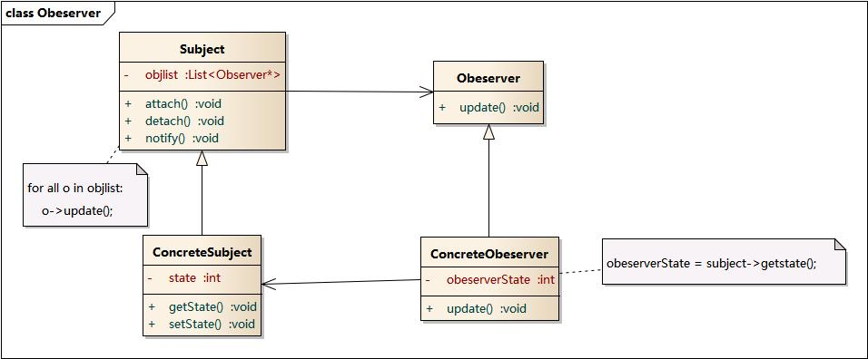

> 摘要：23种设计模式，其中5种创建型、7种结构型、11种行为型。

<!-- more -->

---

> JDK 中用到了哪些设计模式?
>
> Spring 中用到了哪些设计模式?
>
> 需要达到3个层次：
>
> 1. 能在白纸上画出所有的模式结构和时序图；
>2. 能用代码实现；如果模式的代码都没有实现过，是用不出来的；即所谓，看得懂，不会用；
> 3. 灵活应用到工作中的项目中。

### 目录

[TOC]

一般而言，设计模式有四个基本要素：

1. 模式名：一个助记名，用一两个词来描述模式的问题、解决方案和效果。
2. 问题、使用情景：描述了应在何时使用。
3. 解决方案：描述了设计的组成成分、相关关系及各自的职责和协作方案。
4. 效果：描述了模式应用的效果及使用模式应权衡的问题。

### 设计模式的七大原则

简记为 **SOLID**：S 单一职责原则、O 开闭原则、L 里氏代换原则、I 接口隔离原则、D迪米特法则。

1. **S 单一职责**：一个类只负责一个功能领域中的相应职责。承担的职责越多，复用的可能性越低。当一个职责变化时，可能会影响其他职责的运作。核心是**解耦和增强内聚性**。确定职责的粒度，得出相对合理的职责分配。
2. **OCP 开闭原则**：对扩展开放，对修改关闭。关键步骤是**抽象化**，实现方法有：
   1. 通过**接口或抽象类**约束扩展，不允许出现在接口或抽象类中不存在的 `public` 方法。即，扩展要添加具体实现，而不是改变已有方法。
   2. **参数类型、引用对象**尽量用接口或抽象类，而不是实现类。能尽量保证抽象层是稳定的。如，用抽象类代替相似内容的 `else if` 分支。
   3. 一般抽象模块设计完成（如接口的方法已经敲定），不允许修改接口或抽象方法的定义。
3. **L 里氏替换**：子类应可以完全替换父类。即，**继承**时只扩展新功能，而不要破坏父类原有的功能。是对开-闭原则的补充，继承就是抽象化的具体实现。子类可继承基类的所有非私有属性或方法。
4. **I 接口隔离**：客户端不应依赖它不需要的接口，类间的依赖关系应建立在**最小的接口**上。接口在实现时拆分冗余方法，让实现类只依赖自己需要的接口方法。即，接口尽量细化，同时接口中的**方法尽量少**。
   - 设计接口时有可能满足单一职责原则、但不满足接口隔离原则，接口太大时分割。
5. **D 迪米特法则 / 最少知识**：一个软件实体应当尽可能少的与其他实体发生相互作用。即，一个类不应知道自己操作的类的细节。**类间解耦**。
6. **依赖倒转**：依赖于抽象接口，不能依赖于具体实现。本质是：**面向接口（抽象）编程**。类似开闭原则？
   - 传递参数时或在关联关系中，尽量引用层次高的抽象层类，即，用接口和抽象类进行变量、参数、方法返回的类型声明，及数据类型的转换等，而不要用具体类。将具体类的对象通过**依赖注入**的方式注入到其他对象中，如Spring的IOC。
7. **合成 / 聚合复用**：尽量用**合成/聚合**，而不是通过继承达到复用已有功能的目的。即，新对象通过向内部持有对象的委派、达到复用已有功能的目的。称为**"黑箱"复用**。
    - 继承复用破坏包装，因为继承将基类的实现细节暴露给派生类，称为"白箱复用"。基类发生改变，会影响所有派生类的实现。
    - 不得已使用继承的话，必须符合**里氏代换**原则。

- [设计模式概念和七大原则](https://cloud.tencent.com/developer/article/1650116)

### 创建型模式（5种）

> 对象实例化的模式，用于对象的创建对业务或应用逻辑是强依赖，或者创建比较复杂的场景。

#### 单例模式

SingleInstance，某个类（单例类）有且只有一个实例。如：线程池、缓存、**日志对象**、对话框、注册表，充当打印机、显卡等设备驱动程序的对象。

优点：

1. 保证对象的唯一性；
2. 避免因创建多个实例造成资源浪费：new 操作次数减少，因而对系统内存的使用频率也会降低，这将减轻 GC 压力，缩短 GC 停顿时间。
3. 且多个实例由于多次调用易导致行为异常、结果不一致等错误。

##### 三个要点

1. 确保某个类（单例类）有且只有一个实例：
    - 用 `private` 修饰构造函数 ==> 不允许其他类`new`该类的对象；
      - 创建静态对象；
2. 自行实例化：通过`new`在本类中创建一个本类（私有静态）对象（单例）；
3. 对外提供可全局访问的`getInstance()`方法、用于获取该对象（单例）。

##### 懒汉实现（推荐）

获取单例时发现没有对象、才去创建对象。

```
class Singleton {
	private static Singleton instance;	//
	private Singleton() {}
	// 保证了:延迟加载和线程安全
	public static Singelon getInstance() {	//
		if (instance == null) {	// 这里线程是不安全的,可能得到两个不同的实例，需要第二次判空
			synchronized (Singleton.class) { //双重校验锁，每个线程获取类的实例时，进行同步
				if (instance == null) { //只执行一次实例化代码，后面的线程想获得该类实例，直接return就行
					this.instance = new Singleton();
				}
			}
		}
		return this.instance;
	}
}

Singleton sg = Singleton::getInstance();
```

##### 饿汉实现

通过类获取单例时、对象已创建好。

在类加载时就完成了实例化，避免了线程的同步问题。

缺点：没有达到 `Lazy Loading`（懒加载）的效果，即，即使没用到这个实例也会加载，造成内存浪费（可忽略）。日志实例？

```
public class SingletonEHan {

    private SingletonEHan() {}
    private static SingletonEHan singletonEHan = new SingletonEHan();

    public static SingletonEHan getInstance() {
        return singletonEHan;
    }
}
```

##### 内部类实现

类似饿汉实现，都是采用了类装载的机制、来保证初始化实例时只有一个线程。

不同:

 * 饿汉方式只要类被装载就会实例化；
 * 内部类是在需要实例化时，调用`getInstance()`方法，才会装载`SingletonInHolder`类。

```
public class SingletonIn {

    private SingletonIn() {}

    private static class SingletonInHodler {
        private static SingletonIn singletonIn = new SingletonIn();
    }

    public static SingletonIn getSingletonIn() {
        return SingletonInHodler.singletonIn;
    }
}
```

##### 枚举实现

略

#### 工厂模式

- 静态工厂（方法）模式：项目中的辅助类，类 + 静态方法。
- 简单工厂模式：专门定义一个类负责创建其他类的实例，被创建的实例通常都有共同的父类。
  - JDK 类库中广泛使用了简单工厂模式，如，工具类 `java.text.DateFormat`，用于格式化本地日期或时间；`TextUtil.isEmpty` 等
- 工厂方法模式：定义一个创建对象的接口，但由子类决定要实例化哪一个类。可根据不同参数返回不同类的实例。`public abstract RouJiaMo sellRoujiaMo(String type);`
- 抽象工厂模式：提供一个接口 `public interface RouJiaMoYLFactroy`，用于创建相关的或依赖对象的家族 `public Meat createMeat(); public YuanLiao createYuanliao();`，而不需明确指定具体类。

例如，**Spring IoC 工作原理**：IoC 底层通过工厂模式、XML 解析、Java 的反射机制等技术，降低代码耦合度，主要步骤有：可把 **IoC 容器**当做一个工厂，产品就是 Spring Bean；

- IoC 容器的两种实现：通过 `BeanFactory`、`ApplicationContext` 接口创建 Bean 对象。

#### 建造者模式

又称生成器模式。将一个复杂对象的构建与它的表示分离，使得同样的构建过程可创建不同的表示。

#### ~~原型模式~~

用于直接创建对象的代价较大时，创建重复的对象（当前对象的克隆），同时又能保证性能。

- 如，一个对象需在一个高代价的数据库操作后被创建，可缓存该对象，在下一个请求时返回它的克隆，在需要时更新数据库，以此来减少数据库调用。

### 结构型模式（7种）

> 把类或对象结合在一起形成一个更大的结构。一般是解决不同的类之间有不同关系的情况。

#### 代理模式

用代理对象来代替对真实对象的访问；为对象提供一种代理，以控制对这个对象的访问；

##### 主要作用

1. 用于解决在直接访问对象时带来的各种问题，如：进程外的访问、要访问的对象在远程机器上、创建开销很大、某些操作需安全控制，可在访问此对象时加上访问层。
2. 在不修改原目标对象的前提下，扩展目标对象的功能；如，在目标对象的某个方法执行前后增加一些自定义的操作。

##### 静态代理

目标类与代理类实现同一个接口，让代理类持有真实类对象，在代理类方法中调用真实类方法，在调用前后添加所需的功能扩展代码达到增强的目的；

1. 从实现和应用角度，对目标对象每个方法的增强都是手动完成的；
2. 从 JVM 层面来说， 在编译时就将接口、实现类、代理类都编译成了实际的 class 文件。

缺点：

1. 代理类中有大量冗余代码：每个目标类都单独对应一个代理类；
2. 非常不灵活，不利于扩展：接口一旦新增加方法，目标对象和代理对象都要进行修改；

日常开发几乎不用，因此有了动态代理。

实现步骤：

1. 定义一个接口及其实现类；
2. 创建一个**代理类**同样实现这个接口；
3. 将目标对象注入进代理类，在代理类的对应方法调用目标类中的对应方法。就可通过代理类屏蔽对目标对象的访问，在目标方法执行前后添加所需的功能。

##### 动态代理

动态代理更加灵活；

1. 从实现和应用角度，不需针对每个目标类都单独创建代理类，也不需要必须实现接口，可直接代理实现类；
2. 从 JVM 角度来说，是在**运行时动态生成**类字节码，并加载到 JVM 中。

在框架中应用很多。

实现方式：

1. **JDK 动态代理**：与静态代理一样，被代理的类（目标类）至少需**实现一个接口**（缺点是只能代理实现了接口的类）；大部分情况下更优秀。使用步骤： 	
   1. 定义一个接口及其实现类；
   2. 自定义 `InvocationHandler` 并重写`invoke`方法，在 `invoke` 方法中调用被代理类的原生方法并自定义一些处理逻辑；
   3. 通过 `Proxy.newProxyInstance(ClassLoader loader,Class<?>[] interfaces,InvocationHandler h)` 方法创建代理对象。
2. **CgLib 动态代理/子类代理**：目标类不用实现接口，通过**继承**方式来实现代理（无法对 final 类、private 方法和 static 方法实现代理），生成一个目标类的子类，来拦截被代理类的方法调用，并覆盖目标类的方法来实现代理。使用步骤：
   1. 定义一个类；
   2. 自定义 `MethodInterceptor` 并重写 `intercept` 方法（用于拦截增强被代理类，和 JDK 动态代理中的 `invoke` 方法类似）；
   3. 通过 `Enhancer` 类的 `create()`创建代理类。

#### 适配器模式

把一个接口**转成**另一个接口，让原本接口不兼容的类可相互合作。类似于电源适配器。可定义一个包装类（适配器 Adapter），包装不兼容接口的对象（适配者 Adaptee，即被适配的类）。

#### ~~桥接模式~~

> 又称柄体模式、接口模式。用于把抽象部分与实现部分解耦，使二者可独立变化。通过提供抽象化和实现间的桥接结构，来实现二者解耦。

- 主要解决：在有多种可能会变化的情况下，用继承会造成类爆炸问题，扩展起来不灵活。

#### ~~装饰者模式~~

> 动态地给一个对象增加一些额外的职责。不同于继承机制，应用关联机制，即 将一个类的对象嵌入另一个对象中，由另一个对象来决定是否调用嵌入对象的行为以便扩展自己的行为，称这个嵌入的对象为装饰器(Decorator)。

- 主要优势在于：不会破坏类的封装性。用于设计好了一个类，需要给这个类添加一些辅助功能，且不希望改变这个类的代码时。符合**开闭原则**。

#### ~~组合模式~~

> 又叫部分整体模式，是用于把一组相似对象当作单一对象。依据树形结构来组合对象，用来表示部分及整体层次。创建了对象组的树形结构。

- 主要解决：在树型结构的问题中，模糊了简单元素和复杂元素的概念，客户程序可像处理简单元素一样来处理复杂元素，从而使二者的内部结构解耦。

#### ~~外观模式~~

又称门面模式。外观定义了一个高层的统一接口，用来访问子系统中的一群接口。即，为了方便客户使用，把一群操作，封装成一个方法。

#### ~~享元模式~~

尝试重用现有的同类对象，如果未找到匹配的对象，则创建新对象。

用于减少创建对象的数量，以减少内存占用和提高性能。避免重新创建。

### 行为型模式（11种）

> 类和对象如何交互，及划分责任和算法。

#### 观察者模式

定义对象间**一对多**的依赖，当对象（观察目标）状态改变时，其所有依赖的对象（观察者）都会**收到通知**并自动更新。又称发布-订阅（Publish/Subscribe）模式、模型-视图（Model/View）模式、源-监听器（Source/Listener）模式、从属者（Dependents）模式。

- 可实现表示层和数据逻辑层的分离，并定义稳定的消息更新传递机制，抽象了更新接口，使各种不同的表示层作为具体观察者角色。
- 可用来实现**MVC模式**，观察目标是模型(Model)，而观察者就是视图(View)，控制器(Controller)充当两者间的中介者(Mediator)。当模型层的数据发生改变时，视图层将自动改变其显示内容。
- JDK、Andorid中很多地方实现了观察者模式，如`XXXView.addXXXListenter`。
- 如电子商务网站可在执行发送操作后、给多个用户发送商品打折信息。



#### 策略模式

> 策略：完成任务的方式，对**算法**的封装。
>
> 定义一系列可相互替换的算法，分别封装进类。让算法的变化独立于使用算法的客户，由客户端自己决定在什么情况下使用什么具体策略。
>
> 如：查找算法类，每个方法对应一个具体的查找算法，硬编码。

- 封装变化（把可能变化的代码封装起来）；
- 多用组合，少用继承；
- 针对接口编程，不针对实现。

#### 模板方法模式

定义了一个**算法骨架**，将一些步骤延迟到子类中。使子类可在不改变算法结构的情况下，重新定义算法的步骤。

#### 责任链模式

> 为请求创建了一个接收者对象的链。给予请求的类型，对请求的发送者和接收者进行解耦。通常每个接收者都包含对另一个接收者的引用。如果一个对象不能处理该请求，那么它会把相同的请求传给下一个接收者，依此类推。

- 主要解决：职责链上的处理者负责处理请求，客户只需将请求发送到职责链上即可，无须关心请求的处理细节和传递，所以职责链将请求的发送者和处理者解耦了。

#### ~~命令模式~~

又称动作模式、事务模式。将请求封装成对象，将动作请求者和执行者解耦。

#### ~~迭代器模式~~

> 用于顺序访问集合对象的元素，不需知道集合对象的底层表示。

- 主要解决：不同的方式来遍历整个整合对象。Java 和 .Net 编程环境中非常常用的设计模式。

#### ~~中介者模式~~

> 用来降低多个对象和类间的通信复杂性。提供了一个中介类，通常处理不同类间的通信，并支持松耦合，使代码易于维护。

- 主要解决：对象间存在大量的关联关系，会导致系统的结构很复杂，同时若一个对象发生改变，也需跟踪与之相关联的对象，同时做出相应的处理。如：用户与用户直接聊天。

#### ~~备忘录模式~~

> 保存一个对象的某个状态，以便在适当时恢复对象。

- 主要解决：在不破坏封装的前提下，捕获一个对象的内部状态，并在该对象之外保存这个状态，这样可在以后将对象恢复到原先保存的状态。

#### ~~解释器模式~~

> 提供了评估语言的语法或表达式的方式。实现了一个表达式接口，解释一个特定的上下文。

- 主要解决：对于一些固定文法构建一个解释句子的**解释器**。被用在 SQL 解析、符号处理引擎等。

#### ~~状态模式~~

当对象的内部状态改变时，它的行为跟随状态的改变而改变了，看起来像重新初始化了一个类。

#### ~~访问者模式~~

> 访问者类改变了元素类的执行算法，可随着访问者改变而改变。元素对象已接受访问者对象，这样访问者对象就可处理元素对象上的操作。

- 主要解决：稳定的数据结构和易变的操作耦合问题。

