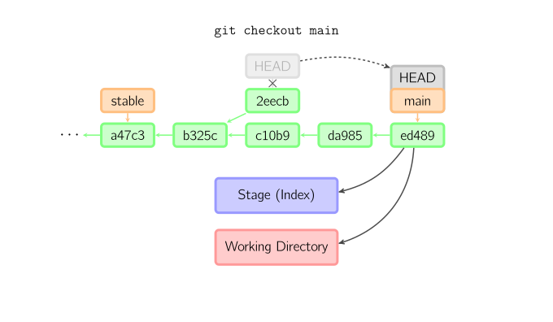
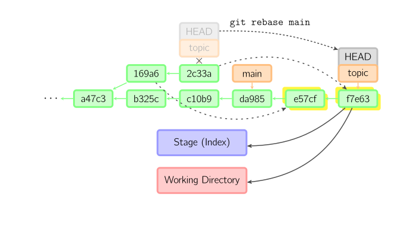

> 摘要：Git 是一款主流分布式版本管理系统，Github 是提供 Git 服务的一个主流网站，Github Desktop 是其客户端。

<!-- more -->

---

## IDEA

### 编辑器 UI界面

### 快捷键

- [Keymap Windows copy 快捷键用法](https://github.com/judasn/IntelliJ-IDEA-Tutorial/blob/master/keymap-introduce.md)

##### Ctrl

- `Ctrl + D`	复制光标所在行 或 选中的内容，并插入到光标后
- `Ctrl + E`	显示最近打开的文件记录列表
- `Ctrl + F `    查找使用此类的成员
- `Ctrl + J`	插入自定义动态代码模板
- `Ctrl + U`     实现类跳转到接口的方法
- `Ctrl + Y`	删除光标所在行 或 选中行 
- `Ctrl + /` 、`Ctrl + Shift + /`：注释单行、多行
- `Ctrl + \`、`Ctrl + Alt + N/B`：*根据 URL 直接跳转到对应的方法定义*
- `Ctrl + ;` 基础代码补全
- `Ctrl + .` 自动补全？
- `Ctrl + [`、`Ctrl + ]` 移动光标到花括号开始、结束位置
- `Ctrl + Shift + [`	选中从光标到中括号开始位置
- `Ctrl + =/-`   展开、折叠
- `Ctrl + Shift + =/-` 全部展开、折叠
- `Ctrl + F12`    Structure面板
  - `Alt + 7`    方法大纲

##### Alt

- Alt +  `	显示版本控制菜单
- ~~`Alt + F1` + `1`、 `Alt + 1` + `1`：定位当前文件所在 Project 窗口中的位置，已用`Always Select Opened File`设为自动定位~~
- `Alt + F3`    在当前文件查找
- `Alt + Insert`	代码自动生成，如生成对象的 set / get 方法，构造函数，toString() 等 
- `Alt + Enter`     查询控制台`Query Console`编辑器中，提示功能，如`SELECT *`语句选中`*`扩展成相关列、列添加别名前缀
  - Free MyBatis Plugin直接生成新方法的xml实现
- `Alt + F`      Find in file，在所有文件中查找字符串

##### Shift

##### Ctrl + Alt

- `Ctrl + Alt + S`	打开系统设置
- `Ctrl + Alt + 左方向键`	退回到上一个操作处/光标所在位置，与显卡调整屏幕方向的快捷键冲突
- `Ctrl + Alt + B/鼠标左键`    接口跳转到实现方法
- `Ctrl + Alt + C`	重构-快速提取常量
- `Ctrl + Alt + F`	重构-快速提取成员变量
- `Ctrl + Alt + L`    自动格式化、格式化SQL语句；
- `Ctrl + Alt + M`	重构-快速提取方法、接口
- `Ctrl + Alt + P`	重构-快速提取参数
- `Ctrl + Alt + V`	重构-快速提取变量

##### Ctrl + Shift

- `Ctrl + Shift + +`	展开所有代码
- `Ctrl + Shift + Space`	智能代码提示
- `Ctrl + Shift + “`	    最大化工具窗口、控制台
- `Ctrl + Shift + F12`	    编辑器最大化 
- ~~`Ctrl + Shift + F`    Find by XPath expression~~ 
- `Ctrl + Shift + R`	替换
- `Ctrl + Shift + T`	重新打开关闭的选项卡、~~对当前类生成单元测试类，如果已存在的单元测试类则可进行选择~~
- `Ctrl + Shift + U`    变量大小写切换；方法继承关系表Diagram

##### Alt + Shift

- `Alt + Shift + 前方向键`	上移光标所在行

##### 智能补全

```
//Press Enter to insert, Tab to replace
//ctrl + . select first default，自动补全
//psvm + ctrl+.
public static void main(String[] args) {}

//sout
System.out.println();
//soutm
System.out.println("Main.main");
//soutp
System.out.println("args = " + Arrays.deepToString(args));
//soutv
System.out.println("args = " + args);

//123.var
int i = 123;
//new File().var
File file = new File();

//expression.if
if (args.length > 1) {}

//variable.nn
if (args != null) {}

//args.for
for (String arg : args) {}

//args.fori
for (int i = 0; i < args.length; i++) {}

//args.forr
for (int i = args.length - 1; i >= 0; i--) {}

//statment.try
//语句外层加try...catch

//dep + Enter in pom.xml
//生成依赖模板
C:\Program Files\Java\jdk1.8.0_92
D:\Develop\Java\jdk\jdk1.8.0_311\;D:\Develop\Java\jdk\jdk1.8.0_311\bin\;C:\Program Files\Common Files\Oracle\Java\javapath\
```

### 常用插件

- [插件推荐](https://github.com/judasn/IntelliJ-IDEA-Tutorial/blob/master/plugins-settings.md#插件推荐)

- IDE Eval Resetter 无限试用

- **Rainbow Brackets**（括号彩色插件）和Material Theme UI（主题插件）冲突，手动配置Rainbow Brackets来兼容Solarized Themes日晒主题的配色方案：

  方案1（最佳颜色配置）

  Color #1：E6B422

  Color #2：43A047

  Color #3：2196F3

  Color #4：3F51B5

  Color #5：00897B

  方案2（稍微亮一些的 配色）

  Color #1：E8B622

  Color #2：59DD5D

  Color #3：21A2FF

  Color #4：E669DA

  Color #5：00D1C1

- jclasslib ByteCode Viewer 字节码查看器，反编译 .class 文件

- Lombok：简化对象封装，通过为实体类添加`@Getter`和`@Setter`注解，替换手写的 Setter、Getter、toString、equals、hashCode 及非空判断等。

- Free MyBatis Plugin：可在Mapper接口的方法和xml实现间自由跳转，也可用来一键生成某些xml实现。

- MyBatis Log Plugin：把Mybatis输出的SQL日志还原成完整的SQL语句

- RestfulToolkit：一套Restful服务开发辅助工具集，提供了项目中的接口概览信息，可根据URL跳转到对应的接口方法中去，内置了HTTP请求工具，对请求方法做了一些增强功能，功能很强大！

  - 右侧的`RestServices`按钮显示项目中接口的概览信息；
  - 在接口方法上右键可生成查询参数、请求参数、请求URL；
  - 在实体类上右键可直接生成实体类对应的JSON；

- Translation：选中内容，点击右键翻译源码注释等；

- ~~GsonFormat：在实体类名上右键`Generate -> GsonFormat`，可根据JSON格式的字符串创建实体类~~

- Grep Console：用于分析控制台日志，可对不同级别的日志进行不同颜色的高亮显示，还可按关键字搜索日志内容。

- Alibaba Java Coding Guidelines：实时检测代码中不符合阿里巴巴《Java 开发手册》规约的地方

- Maven Helper：用于快速查找项目中的依赖冲突并解决

  - 通过`pom.xml`文件底部的`依赖分析`标签页查看当前项目中的所有依赖；

- Statistic：通过顶部菜单中的`View->Tool Windows->Statistic`按钮统计当前项目中代码的行数和大小；

- element：Element-UI支持插件，可对Element-UI中的标签进行智能提示

## Git

### 认识Git

> 版本控制的主要功能有备份、回滚、分支管理。

##### TortoiseSVN 与 Git 区别

1. SVN：是集中式的版本控制系统，中央服务器，简单； CVS、Subversion等
   1. 保存一组基本文件和每个文件随时间逐步累积的差异。
   2. 增量多的话，得到最终文件耗时长。
   3. 缺点是必须联网才能工作；
   4. 易发生单点故障；严重依赖中央服务器，安全性低。
2. Git：是分布式的版本控制系统；
   1. 用直接记录快照的方式，而非差异比较。对当前的全部文件制作一个快照并保存其索引。 跟踪并管理的是修改，而非文件。
   2. 为了高效，不再重新存储没有修改的文件，只保留一个链接指向之前存储的文件。
   3. 每个客户端都有代码仓库的完整镜像，**不用联网**；
   4. 多个镜像安全性高。实际应用时也有一台充当“中央服务器”的电脑，但仅是用来方便“交换”大家的修改，没有也可以。
   5. 强大的分支管理。
   6. 开源。

##### Git的三个区域

三种状态：

1. **已修改（modified）**：表示已修改了文件，但还没添加到暂存区。
   1. 手动把文件恢复到上一个版本的状态；
   2. `git checkout -- readme.txt` [撤销readme.txt文件在工作区的全部修改](#checkout)。
2. **已暂存（staged）**：表示对一个已修改文件的当前版本做了标记，使之包含在下次提交的快照中。  
   - `git reset HEAD readme.txt` 可撤销暂存区的修改，重新放回工作区。
3. **已提交（committed）**：数据已安全的保存在本地仓库中。
   1. 未把本地版本库推送到远程版本库：
   2. 已把错误修改提交推送到远程版本库：

三个工作区域/工作流：

1. 工作目录（Working Directory）：持有实际文件；用`git add`把文件修改（快照）添加到暂存区；
2. 暂存区（Index / Staging Area）：暂存文件修改，等待commit；用`git commit`提交更改到仓库，实际上就是一次性提交暂存区的所有修改（快照）到当前分支。与SVN的区别。
3. Git 仓库(.git directory、Repository)：永久记录文件或目录状态，存储着内容修改的历史提交记录。分布式开发 + 集中式管理。
   1. 远程仓库、origin 原始仓库、源仓库： 配有专用的服务器，为了多人共享而建立的数据库。汇总参与该项目的各个开发者的代码；存放趋于稳定和可发布的代码。只有项目管理者能对其进行较高权限的操作。
   2. 本地仓库：为了方便用户个人使用，在自己的机器上配置的数据库。


基本的 Git 工作流程如下：


##### Git 参考

1. [图解Git](https://marklodato.github.io/visual-git-guide/index-zh-cn.htm)
2. [git - 简明指南](https://rogerdudler.github.io/git-guide/index.zh.html)
3. [廖雪峰--史上最浅显易懂的Git教程](https://www.liaoxuefeng.com/wiki/0013739516305929606dd18361248578c67b8067c8c017b000)
4. [使用git和github管理自己的项目---基础操作学习](https://segmentfault.com/a/1190000003728094)
5. [Git Cheat Sheet](http://www.cheat-sheets.org/saved-copy/git-cheat-sheet.pdf)
6. [Git 学习 可视化提交树](https://learngitbranching.js.org/)
7. ~~[Git入门指南使用资料汇总及文章推荐](https://github.com/xirong/my-git/blob/master/ixirong.com.md)~~

### Git 命令

#### [Git 常用命令思维导图](https://www.cnblogs.com/1-2-3/archive/2010/07/18/git-commands.html)


#### HEAD

HEAD 是一个对当前检出记录的符号引用，指向正在其基础上进行工作的提交记录。

> 实际上，通常情况下HEAD指向分支名，分支名指向当前分支上最近一次提交记录。

**分离 HEAD** 就是让其指向某个具体的提交记录而不是分支名。

```
#在命令执行前的状态如下所示：HEAD -> main -> C1
git checkout C1
#变成了：HEAD -> C1
```

**相对引用**：用 `^`、`~<n>` 将HEAD向上移动 1 个、n个提交记录，可代替<commit id>。

```
git checkout <commit id>
git checkout main^
git checkout HEAD~1 #HEAD~1：历史版本库最新提交的第一父提交
```

#### Repository 仓库

- `git clone <server url> [directory name]`：克隆远程仓库到本地目录，默认为./。`<server url>` 如`https://github.com/Snailclimb/test.git`或`username@host:/path/to/repository.git`。Git支持多种协议，默认的git://使用ssh，https速度慢，每次推送都必须输入口令，但某些公司内部只开放http端口。
- `git fetch`
- `git init`：在当前目录中初始化仓库，创建一个名为 .git 的子目录（Git用来跟踪管理版本库的）。
- `git pull`：拉取远程仓库；获取（fetch）并合并（merge）远程改动，覆盖本地工作目录。Git会自动合并已有的变更点；但如果远程数据库和本地数据库的同一个地方都发生了修改，无法自动判断要选用哪一个修改，就会发生冲突，需要手动修正冲突。
  - `--progress`：

```
pull --progress origin: Fast-forward
```

- `git push origin [branch name]`：将分支在本地仓库的提交历史推送/共享到远程仓库，二者保持同步。`push`前应先合并（pull），否则`push`将被拒绝。
  - `--force`
  - `-u`：把本地的master分支内容推送到远程新的master分支，并关联起来；
- `git remote`
  - `-v`：查看远程库信息
  - `add origin <server>`：关联本地仓库和远程仓库，并指定远程仓库别名，`origin`是默认习惯命名，如`https://github.com/Snailclimb/test.git>`，可用`origin`指代远程仓库地址
  - `rename origin ori`
  - `rm origin`：删除远程库，解除了本地和远程的绑定关系，并不是物理上删除了远程库。

```
# 丢弃在本地的所有改动与提交：从服务器获取最新的版本历史，并将本地主分支指向它
git fetch origin
git reset --hard origin/master
```

#### work on the current change

- `git add <filename>`：添加文件到暂存区；修改文件来手动合并冲突后，标记为合并成功
  - `git add -i`：交互式添加文件到暂存区
- `describe`：显示离当前提交最近的标签。
- `git mv README.md README`：对文件重命名，相当于`mv README.md README`、`git rm README.md`、`git add README` 三条命令的集合
- `git restore`：把文件从缓存区撤销，回到未被追踪的状态。
- `rm test.txt`：删除文件后，工作区和版本库不一致。先手动删除文件，然后使用`git rm <file>`和`git add<file>`效果是一样的。
  - `git status` 显示哪些文件被删除了。
  - 从版本库中删除该文件：`git rm <filename>` ，从暂存区域移除，然后提交；
  - 错误删除后恢复：`git checkout -- test.txt`，用版本库中的最新版本，替换工作区的。

#### state

- `git diff [<source commit id>] <target commit id> [--] [<path>…]`：显示提交间的差异
  - `<source commit id>`：默认为工作目录，可为branch名等；
    - `--cached`表示Index时，显示暂存区与HEAD的差异
  - `<target commit id>`：默认为暂存区，指定版本库（默认为HEAD）


- `git grep`

- `git log --<option>` ：列出所有提交

  -  `-p` 或` --patch`：按 **补丁** 的格式	显示每次提交引入的差异
  -  ~~`--stat`：显示每次提交的文件修改统计信息。~~
     - ~~`--shortstat`：只显示 --stat 中最后的行数修改添加移除统计。~~
  -  `--name-status`：显示新增、修改、删除的文件清单。
     - ~~`--name-only`：仅在提交信息后显示已修改的文件清单。~~
  -  `--pretty`：使用其他格式显示历史提交信息，可选 oneline、short、full、fuller 和 format。
  -  ~~`--abbrev-commit`：短字符 commit-id，仅显示 SHA-1 校验和所有 40 个字符中的前几个字符。~~
     -  `--oneline`：--pretty=oneline --abbrev-commit 合用的简写，压缩后的每一条提交记录只占一行的输出。
  -  `--graph`：在日志旁以 ASCII 图形显示分支与合并历史。

  -  ~~`--relative-date`：使用较短的相对时间而不是完整格式显示日期（如“2 weeks ago”）。~~

  常用选项：

  -   `-<n>` ：只显示最近的n条提交。
  -   `--since` 和 `--after`：指定时间后的提交，可取2.weeks、2008-01-15
  -   `--until` 和`--before`：指定时间前的提交。
  -   `--author`：作者匹配指定字符串。
  -   ~~`--committer`：提交者匹配指定字符串。~~
  -   `--grep`：搜索提交说明中的关键字。
  -   ~~`-S`：添加或删除内容匹配指定字符串的提交。~~

  -   `[--] <path>`：指定某些文件或目录的路径。
  -   `--no-merges` ：隐藏合并提交

- `git show`：用于显示各种类型的对象。

- `git stash`：可把当前工作现场“储藏”起来，等以后恢复现场后继续工作。查看工作区，就是干净的（除非有没有被Git管理的文件），因此可以放心的创建分支来修复bug了。

- `git status`：查看当前文件状态

#### 基本操作

##### branch

- `git branch <branch name>`：默认创建分支，基于这个提交及它所有的父提交进行新工作；分支是用来将特性开发绝缘开来的。
- `git branch`：查看所有分支，，当前分支前面会标一个`*`号。
  - `-d <branch name>`：删除分支；即删除分支指针。
  - `-f main HEAD~3`：让分支指向另一个提交，将分支强制移动到指定位置；将 main 分支强制指向 HEAD 的第 3 级父提交。

##### cherry-pick

- `git cherry-pick`："复制"一个提交节点并在当前分支做一次完全一样的新提交。


##### commit

- `git commit `：给暂存区生成快照，并提交。每完成一个功能就提交一次，不要累计代码。

  1. 提交时，用**暂存区**的文件创建一个新提交，并把此时的节点（HEAD）设为父节点，把当前分支（顺移）指向新的提交节点。

  

  2. 若当前分支`stable`是某次提交的祖父节点，提交后生成了`1800b`。`stable`分支就不再是`main`分支的祖父节点。此时，`merge`是必须的。

  

  3. 当`HEAD`处于分离状态（不依附于任一分支）时，`commit`不会更新任何已命名的分支。可认为是在更新一个匿名分支。一旦切换到别的分支（如`main`），那么这个提交节点再也不会被引用到，会被丢弃掉。想保存这个状态，可用命令`git checkout -b <name>`来创建一个新分支。

   
  
  

  - `-m "备注"`

  - `-a/add`：跳过暂存区直接提交代码到仓库；自动把所有**已跟踪过的文件**暂存起来一并提交，从而跳过 git add 步骤。

  - `--amend`：更改一次提交，用与当前提交相同的父节点进行一次新提交，旧的提交会被取消。添加漏掉的文件或修改提交信息，尝试重新提交.

    

##### checkout

- `git checkout <branch name>`：切换分支，即*HEAD*标识会移动到指定分支，暂存区域和工作目录中的内容会和*HEAD*对应的提交节点一致。新提交节点（a47c3）中的所有文件都会被复制（到暂存区域和工作目录中）；只存在于老的提交节点（ed489）中的文件会被删除；不属于上述两者的文件会被忽略，不受影响。
  - `-b <new branch> <source branch>` ：在source 分支（默认为当前分支）上创建分支，并切换过去。
  - `git checkout <>`：如果既没指定文件名，也没指定分支名，而是一个标签、远程分支、SHA-1值或是像*main~3*类似的东西，就得到一个匿名分支，称作*detached HEAD*（被分离的*HEAD*标识）。这样可方便地在历史版本间互相切换。


- `git checkout [HEAD] -- <filename>`：
  - 当给定某个文件名（或打开`-p`选项）时，用于将指定**历史提交节点**（如果没有指定，默认为暂存区域）中的文件，拷贝到工作目录，并加到暂存区域中。用来丢弃本地修改。
  - 文件自修改后还没放到暂存区，用当前历史提交节点覆盖工作目录；回到最近一次git commit到版本库后的状态；
  - 已添加到暂存区后，又作了修改，用暂存区覆盖工作目录；回到最近一次git add添加到暂存区后的状态。
  - 注意当前分支不会发生变化。已添加到暂存区的改动及新文件都不会受影响。


##### merge

- `git merge <branch name>`：把不同分支合并起来。合并前，索引必须和当前提交相同，否则可能会有冲突。每次 merge 前先 pull 远程分支。
  
  - `git status` 检查冲突的文件；
    - 手动解决冲突后，再add、commit。
  - 如果另一个分支是当前提交的祖父节点，那么什么也不做。 
  - `git merge main`如果当前提交是另一个分支的祖父节点，就导致*fast-forward*合并。指向只是简单的移动，并生成一个新的提交。
  - `git merge other`否则就是一次真正的合并。默认把当前提交（*ed489* ）和另一提交（*33104*）及他们的共同祖父节点（*b325c*）进行一次三方合并。结果先保存当前目录和索引，然后和父节点（*33104*）一起做一次新提交。
  
  
  
  
  
  - `--no-ff`参数：表示不执行快进式（**f**ast-**f**orward、plain）合并，不在当前分支留有指定分支的演进过程。
    - 用普通模式合并，合并后的历史有分支，能看出来曾经做过合并。而fast forward 快进模式，直接把master指向dev的当前提交，所以合并速度非常快；但看不出来曾经做过合并，删除分支后，会丢掉分支信息。
    - 将feature分支（一组提交实现的整个功能）打包作为develop分支的一个commit节点合并进来。
    - 常用于对feature分支实现的整个功能进行回退、简化日志信息。
  
  

##### rebase

- `git rebase main`：合并分支。在当前分支（topic）上重演另一个分支（main）的历史，提交历史是线性的。 本质上是线性化的自动的`cherry-pick`。注意旧提交（169a6、2c33a）没有被引用，将被回收。

  

  - `--onto`：限制回滚范围。在*main*分支上重演当前分支从*169a6*以来的最近几个提交，即*2c33a*。


##### reflog

- `git reflog`：查看命令历史，操作类型、commit id、注释。

##### reset

- `git reset --<mode> [<commit id>, 默认HEAD, origin/master] [file]`：作用于索引，分支指向不变；撤销暂存区的修改，重新放回工作区，用指定提交（默认为HEAD）覆盖暂存区。“改写历史”，原来指向的提交记录就跟从来没有提交过一样。 对远程分支无效。？省略文件名表示回退所有。
  
  - ~~`-- filename`：撤销最后一次`git add files`；相当于`checkout file`；更新索引。~~
  - `--soft` ：作用于仓库，回退到指定版本commit前的状态？。如果还要提交，直接commit即可。~~索引和工作目录都不变。~~
  - `--mixed`：默认方式。
  - `--hard`： 作用于索引和工作目录。
  
  ```
  #查找commit id
  git reflog
  
  #恢复到因reset回退的commit
  git reset --hard <commit id>
  ```
  
  


##### revert

- `git revert`：新提交记录引入**更改**用来撤销某个提交。回退状态。

##### switch

- `git switch <branch name>`：切换分支
  - `-c dev`：创建并切换到新的`dev`分支

##### tag

- `git tag <tag name> <commit id>`：在指定提交上创建标签

  - `-d`：删除标签

  ```
  #一次性推送全部尚未推送到远程的本地标签
  git push origin --tags
  
  #标签已经推送到远程，要删除远程标签就麻烦一点，先从本地删除，然后从远程删除
  git tag -d v0.9
  git push origin :refs/tags/v0.9
  ```

#### 其它 config等

- `gitk`：内建的图形化 git
- `git config color.ui true`：彩色的 git 输出
- `git config format.pretty oneline`：显示历史记录时，每个提交的信息只显示一行
- `git config `
  - `--global`参数，表示这台机器上所有的Git仓库都会用此配置；
  - `--global user.email "you@example.com"`：配置邮件；
  - `--global user.name "Your Name"` 配置用户名，否则后面的commit、push到远程库都会失败。
- `git config`
  - `--global alias.br branch`：配置别名
  - `--global alias.ci commit`
  - `--global alias.co checkout`
  - `--global alias.st status`

### Git 分支管理策略

1. [介绍一个成功的 Git 分支模型](https://www.oschina.net/translate/a-successful-git-branching-model)
5. [使用 git 和 github 管理自己的项目---分支管理策略实战](https://segmentfault.com/a/1190000003739324)

- origin/master 主分支： 用于正式发布、线上生产环境。用于存放经过完全测试、代码reivew，已经完全稳定、任何时刻用户可用的代码，应随时保持代码的清洁。分支版本的设立、master版本的merge，统一由管理员操作。发布后需打上 tag。

  - develop 开发分支：用于本地日常开发环境，用于开发者存放基本稳定代码、生成代码的最新隔夜版本（nightly）。

    - feature/topic 功能分支：  通常为即将发布或未来发布版开发新的功能。合并到develop。分支版本的merge，一般先在本地仓库的feature分支merge到本地仓库的develop分支，然后将develop分支push到服务器上。

      - 删除分支：develop分支测试完毕，合入master主分支后。
      - 不删除：开发周期长，与develop分支处于并行关系，自身有特定功能的feature分支。

      ```
      >>> git checkout develop
      # 回到develop分支
      
      >>> git merge --no-ff feature-discuss
      # 把做好的功能合并到develop中
      
      >>> git branch -d feature-discuss
      # 删除功能性分支
      
      >>> git push origin develop
      # 把develop提交到自己的远程仓库中
      ```

    - ~~feature/weixin_recharge 临时功能分支：按照功能点（而不是需求）命名，  用于开发新功能，预发布成功后删除。~~

    - release-1.2 预发布分支：用于线上测试环境，待发布版本的提测及细小修改、修复 bug，严禁增加大的新features。实际开发中用的较少。

      - 创建时机：develop分支达到了发布的理想状态后，至少所有此次要发布的features已合并到develop分支。从develop创建。创建后，所有未来准备发布的features可合并到develop分支。
      - 必须合并到 master：需打 tag，以便将来引用这个版本。
      - 必须合并到 develop：临时分支用完删除。

  - fixbug-0.1、hotfix/#1 、issue-101 临时修补分支：通过平台生成的问题编号来命名 ，生产环境紧急bug修复。可以基于master分支，必须合并回develop和master分支。与发布分支很相似。临时分支用完删除。

    1. 在 master 分支上拉一个 hotfix 分支 hotfix/0.0.1；
    2. 修复后 merge 回 master 分支；
    3. 再 merge 回 develop 分支；
    4. 删除该分支；
    5. 应始终保证 master 和 develop 上都修复了该bug。


以[开发功能分支 feature/search-recommend](https://blog.csdn.net/cs958903980/article/details/53896411)为例，工程师需要做以下步骤：

1. 建立 develop 的分支 feature/search-recommend；
2. 在该分支上进行开发，完成后进行本地提交；
3. 切换到 develop 分支，pull拉取远程仓库最新版本；
4. 此时本地 develop 分支是最新版本，然后 merge 分支 feature/search-recommend；
   1. 如果此时有冲突，清除后commit；
5. 把本地合并后的分支 develop push 到远程 develop；
6. 在 develop 分支环境下进行测试；
7. 一切ok，删除该功能分支；
8. 切到 master 分支，pull 然后 merge develop，收工。


### Github Desktop 客户端

1. [Github 的 SSH 配置](https://blog.csdn.net/chenliguan/article/details/51072809)
2. [GitHub for Windows 客户端的使用教程](https://blog.csdn.net/qq_25269835/article/details/70177314)

> 使用迅雷下载 https://desktop.github.com/ 会快点

##### 项目初始化

> 项目最好存储在纯英文路径下

##### 创建项目

> 一般在某一文件夹，如使用 IDE 创建项目文件夹后，将此项目文件夹创建为 Git 项目。

##### 添加本地项目

> 此时项目中应有 /.git 文件夹，表示这是一个 git 项目，操作是将其添加入本地仓库。

##### 从 Github 克隆项目

> fork 指将别人的项目拷贝到自己的账户中。
>
> clone 指将在 Github 网站上的项目克隆到本地计算机的仓库中，默认是自己的项目，可通过 URL 克隆其他用户的项目。
>
> 克隆时本地文件夹可重命名。

##### remove 项目

> 默认只是将项目移出本地仓库，勾选后才删除项目到回收站。

##### 更改本地项目存储位置

> 将本地项目移动到其它路径下

1. ~~通过设置 Options-clone 里面的路径，v1.6.5 中没有发现这个功能~~
2. 直接将项目文件夹移动到目标位置，打开 Github Desktop 项目时会提示重新定位（locate）。或手动将项目重新添加到本地仓库即可

#####  [通过 GitHub Desktop 版本回退](https://www.cnblogs.com/lqcdsns/p/5265665.html)

1. 在本地仓库 commit to master 未 push 到远程仓库

    undo
2. 已 push 到远程仓库

    History->右键->Reserve this commit
    commit to master
    push

### 错误处理

[使用git时出现：warning: LF will be replaced by CRLF](https://www.jianshu.com/p/0acf732eab68)

##### 提交失败

- [Github 提交失败 fatal: unable to access](https://segmentfault.com/q/1010000004014275/a-1020000004044485)

- 代理错误：[Git push时报错：Failed connect to github.com:443; No error和The remote end hung up unexpectedly](https://blog.csdn.net/qq_27093465/article/details/71210203)

  ```
  git config --global http.proxy "localhost:1080"
  git config --global https.proxy "localhost:1080"
  ```
  

## 项目管理/构建工具

### Maven

标准化的 Java 项目管理和构建工具。

##### 依赖管理

`pom.xml`项目描述文件：

- 用`<dependency>`声明一个依赖后，Maven就会（从中央仓库、镜像仓库下载）自动下载依赖jar包及其父依赖、并缓存在本地（放到classpath中）。

- 插件：`<plugins><plugin>`

##### 项目结构 / 标准目录结构

##### 构建流程

标准化的构建流程，可自动化实现编译，打包，发布等。

常用命令：

- `mvn clean`：清理所有生成的class和jar；
- `mvn clean compile`：先清理，再执行到`compile`；
- `mvn clean test`：先清理，再执行`test`，因为执行`test`前必须执行`compile`，故不必指定`compile`；
- `mvn clean package`：先清理，再执行`package`。

##### 模块管理

抽取共用的`pom.xml`并继承，用`<modules>`编译多个模块。

### Gradle

基于 JVM 的富有突破性构建工具。

### Docker 容器

安装时，把原始环境一模一样地复制过来。

- 虚拟机

- LXC Linux 容器

Docker：是一个虚拟环境容器，可将开发环境、代码、配置文件等一并打包进去，并发布和应用到任意平台中。

主要用途：

- 提供一次性的环境。如，本地测试他人的软件、持续集成时提供单元测试和构建的环境。

- 提供弹性的云服务。因为 Docker 容器可随开随关，很适合动态扩容和缩容。

- 组建微服务架构。通过多个容器，一台机器可跑多个服务，在本机就可模拟出微服务架构。