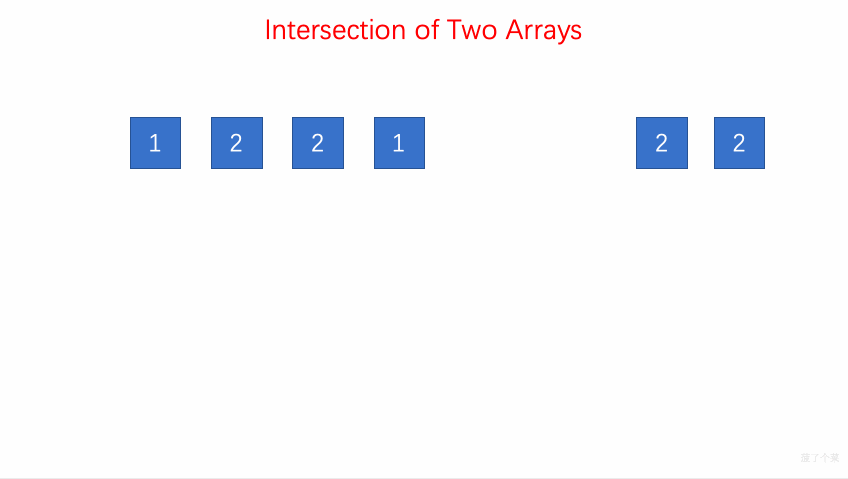
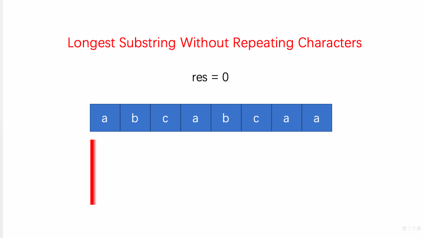
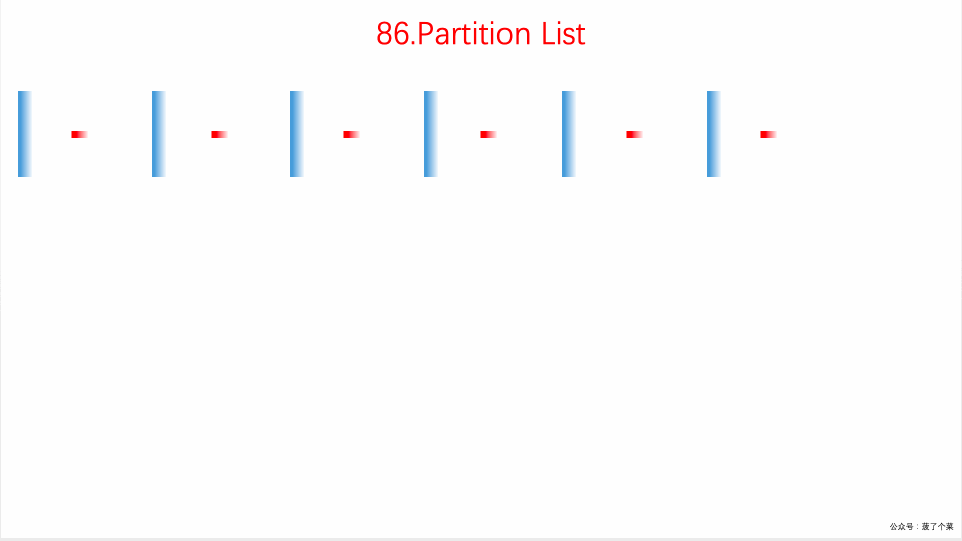
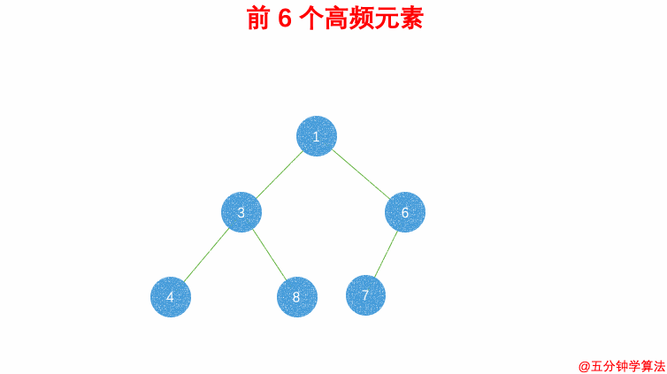
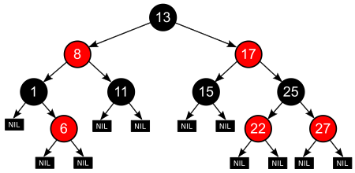
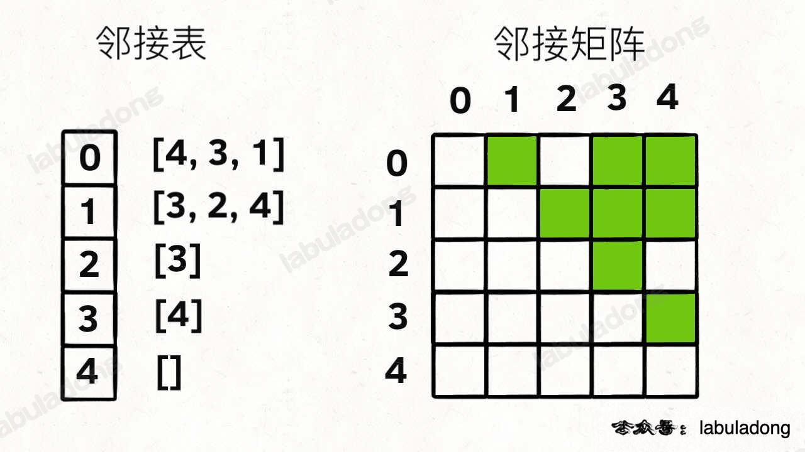
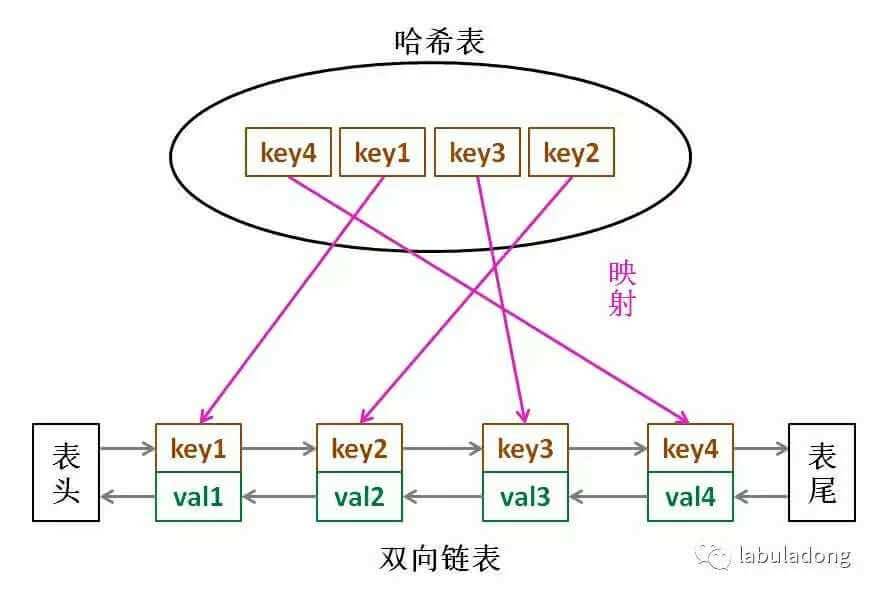

> 摘要：数据结构中，线性结构有数组、字符串、链表、栈和队列、哈希表，非线性结构有堆、树、二叉树、图。手撕算法多为框架，包括常用技巧、十大排序算法、二分查找、分治与递归、动态规划、BFS 框架、DFS框架与回溯、贪心、缓存淘汰算法。基本涵盖[labuladong 的算法小抄](https://github.com/labuladong/fucking-algorithm)、[CodeTop](https://codetop.cc/)频度前40、[剑指 Offer（第 2 版）](https://leetcode.cn/problem-list/xb9nqhhg/)、[LeetCode 热题 HOT 100](https://leetcode.cn/problemset/all/?listId=2cktkvj&page=1&sorting=W3sic29ydE9yZGVyIjoiREVTQ0VORElORyIsIm9yZGVyQnkiOiJTT0xVVElPTl9OVU0ifV0%3D)常见例题。

<!-- more -->

---

## 数据结构

> 由Java数组、String类和Java集合框架实现。
>
> 线性数据结构：数组（字符串）、链表、栈和队列；
>
> 非线性结构有堆、树、二叉树、图。

### 数组

顺序表，支持随机访问


```
int[] arr = new int[5]; // 声明 + 动态初始化
int[] num = new int[]{1, 2, 3, 5, 8};  // 一般不用
int[] num = {1,2,3,5,8}; // 声明和静态初始化
arr.length; // 长度

List list = new ArrayList();

//与index无关
for(char ch : str) {}
```

##### nSum

nSum：取出数组中n个数， 等于target

- [1. 两数之和 无序数组](https://leetcode.cn/problems/two-sum/)：用 `HashMap<nums[i], i>`。注意`return new int[]{i, j}; return new int[0];`


- [167. 两数之和 II - 有序数组](https://leetcode.cn/problems/two-sum-ii-input-array-is-sorted/)：两数之和为 `target` 的所有元素对，结果不能出现重复。思路就是**排序 + 双指针**，`sum = nums[lo] + nums[hi], sum > target 则hi--, sum < target 则lo++`；注意跳过重复元素对。


- [15. 三数之和](https://leetcode.cn/problems/3sum/)：**nSum框架 = 递归 + 2Sum**，`List<List<Integer> > nSubSum = nSum(nums, n-1, i+1, target-nums[i]); 表示从i+1开始求(n-1)Sum，加上nums[i]即为nSum的结果`

##### 前缀和

前缀和技巧、累加和：数列前 n 项的和。时间复杂度降为 `O(1)`。

主要适用场景是：原始数组不被修改的情况下，**频繁查询**某区间的累加和。

- [303. sumRange 区域和 - 数组不可变](https://leetcode.cn/problems/range-sum-query-immutable/)：`sums[left, ..., right] 即 preSums[left+1, ..., right+1]`


- [304. 二维区域和 - 矩阵不可变](https://leetcode.cn/problems/range-sum-query-2d-immutable/)：`preSum[0][0] = 0;` `preSum[i+1][j+1]` 记录 matrix 中子矩阵` [1, 1, i, j]` 的元素累加和，`i, j > 0`


- [5.2 计数排序](#5.2 计数排序)

##### 差分数组

[差分数组](https://labuladong.github.io/algo/2/18/23/)主要适用场景是：频繁对原始数组某区间的元素值进行增减。

`diff` 数组：`diff[i] = nums[i] - nums[i-1]`

对区间 `nums[i..j]` 的元素全部加 3，只需让 `diff[i] += 3`，再让 `diff[j+1] -= 3` 即可


##### 头尾对向双指针

> 前后相向双指针

- [nSum](#nSum)
- [判断全串是否回文](#回文串)
- [344. 原地反转字符数组 O(1) 额外空间](https://leetcode.cn/problems/reverse-string/)：数组，双指针【】


- [剑指 Offer 21. 调整数组顺序使奇数位于前半部分](https://leetcode.cn/problems/diao-zheng-shu-zu-shun-xu-shi-qi-shu-wei-yu-ou-shu-qian-mian-lcof/)

##### 背向双指针

- 基本上都是回文串
  - [获取最长回文子串内容](#回文串)

##### 同向双指针

- [88. 合并两个有序数组](https://leetcode.cn/problems/merge-sorted-array/)：拉链法，将双指针初始化在数组的尾部，从后向前进行合并，可避免占用多余空间；合并到 nums1 中，开始时 nums1 的长度即为 `m + n`。

##### 快慢双指针

- [26. **原地**删除有序数组中的重复项](https://leetcode.cn/problems/remove-duplicates-from-sorted-array/)：
  1. ~~快慢指针相同时，就后移快指针；~~
  2. 快指针与慢指针值不同时，将快指针的值附到慢指针后（与第一种方法思想不同）。


- [27. **原地**移除元素](https://leetcode.cn/problems/remove-element/)：不需单调数组，快指针不为某值时覆盖慢指针。
  
  - [283. **原地**移动零](https://leetcode.cn/problems/move-zeroes/)：复用 [27. 移除元素] 的解法移除所有 0 `int p = removeElement(nums, 0)`，把最后的元素都置为 0，即相当于移动所有 0 到最后。【】
  
  

##### 有序：[二分查找](#二分查找)

##### 二维数组的花式遍历

- [剑指 Offer 04. 二维递增数组中二分查找](https://leetcode.cn/problems/er-wei-shu-zu-zhong-de-cha-zhao-lcof/)：从左下角开始遍历，比 target 大则向上 `row--`，小则向右 `col++`；用二分查找效率低。类似二叉查找树。
- [54. 矩阵的螺旋遍历](https://leetcode.cn/problems/spiral-matrix/)【】、[剑指 Offer 29. 顺时针打印矩阵](https://leetcode.cn/problems/shun-shi-zhen-da-yin-ju-zhen-lcof/)：收缩四个边界【】
  - [59. 生成螺旋矩阵 II](https://leetcode.cn/problems/spiral-matrix-ii/)【】
- [48. 顺时针旋转 90 度图像](https://leetcode.cn/problems/rotate-image/)：沿对角线反转矩阵，再反转每一行。【】

##### 经典例题

- [118. 杨辉三角](https://leetcode.cn/problems/pascals-triangle/)【】


- [349. 两个数组的交集](https://leetcode.cn/problems/intersection-of-two-arrays/)：用 set 容器 record 存储 num1 的元素，遍历 num2 查找是否有相同的元素，如果有，用 set 容器 resultSet 进行存储，将 resultSet 转换为 vector 类型【】



### 字符串

> Java对字符串的处理较麻烦。

##### 回文串

- 数组等能找到前驱的：
  1. **判断**全串是否回文==>可用头尾（对向）双指针向中点遍历；
     - [9. 回文数](https://leetcode.cn/problems/palindrome-number/)
     - [125. 验证回文串](https://leetcode.cn/problems/valid-palindrome/)：忽略字母大小写、空格，注意两个标点相邻的情况，因此每趟循环只移动一次；
  2. **获取**最长回文**子串**内容：（遍历字符串，以当前位置作为回文中点，）传入回文中点 `l` 和 `r` ，向两侧（背向双指针）扩撒（遍历判断），`l == r`时长度为奇数。[5. 最长回文子串](https://leetcode.cn/problems/longest-palindromic-substring/)
  3. ~~根据字符数组构造回文串；~~
  4. 最长回文子序列：[动态规划](#子序列)
     - 子串：是字符串中连续的一个序列；
     - 子序列：是字符串中保持相对位置（删除某些字符）的字符序列；
     - 如，`"bbbb"`是字符串`"bbbgb"`的子序列但不是子串。
  
  ```
  // 1.判断
  // 在 s 中寻找以 s[left] 和 s[right] 为中心的最长回文串
  // left == right时，回文串长度为奇数
  String palindrome(String s, int left, int right) {
      // 防止索引越界
      while (left >= 0 && right < s.length()
              && s.charAt(left) == s.charAt(right)) {
          left--;	// 背向双指针，向两边展开
          right++;
      }
      // 返回以 s[初始left] 和 s[初始right] 为中心的、最长回文串[left+1, right)
      return s.substring(left + 1, right);
  }
  
  // 2.获取
  if (s.length() < 2)
      return s;
  for (int i = 0; i < n; i++) {
      # 找到以 s[i] 为中心的回文串
      palindrome(s, i, i)
      # 找到以 s[i] 和 s[i+1] 为中心的回文串
      if (i + 1 < n)
      	palindrome(s, i, i + 1);
  }
  
  // 用于存放字符
  HashSet<Character> hashset = new HashSet<Character>();
  ```
  
- 链表：
  
  - **判断**全串是否回文：[234. 判断回文链表](https://leetcode.cn/problems/palindrome-linked-list/) 对称链表，**经典例题**；
    1. 快慢双指针找前半部分链表的尾节点（奇数找中点前一个节点，偶数找前一个中点）；
    2. （封装函数）（头插法）**反转**后半部分链表；
    3. 比较同向双指针，空间复杂度`O(1)`。
    4. 还原链表并返回结果。

##### 滑动窗口


左右指针技巧中，把索引**左闭右开**的区间 `[left, right)` 称为一个「窗口」。方便边界处理， `[0, 0)`中没有元素，`[0, 1)`中有一个元素0。

滑动窗口：保证每个窗口里字母都是唯一的。双指针的一种，大多与不重复字符有关。

**核心思想**：维护一个窗口，不断滑动，左右指针交替前进（ **不回头** ），更新答案。虽然有嵌套的 while 循环，但依然是 `O(n)`，因为每个元素都只会进入和被移出窗口一次。

滑动窗口4类经典例题：

1. [3. 无重复字符的最长子串](https://leetcode.cn/problems/longest-substring-without-repeating-characters/)：遍历 right，如果 HashMap 字符对应的窗口结束位置已有当前字符，则将更新 `left = Math.max(window.get(ch) + 1, left)`，更新 right 和子串长度；`O(N)`

   - [剑指 Offer 48. 最长不含重复字符的子字符串](https://leetcode.cn/problems/zui-chang-bu-han-zhong-fu-zi-fu-de-zi-zi-fu-chuan-lcof/)：也可用动态规划，但为`N^2`。`subDp[i]` 表示 `[0, i]` 区间内最长不含重复字符的子串，`subDp[i] = Math.max(subDp[i-1], longestSub)`，从 i 不断向前遍历得到 `longestSub` = `[j+1, i]`，表示以 i 索引位置结尾的不含重复字符的最长子串。

     

2. [76. 最小覆盖子串](https://leetcode.cn/problems/minimum-window-substring/)：包含`Target`所有字符的、当前字符串`Source`的最短子串；

   - 步骤：

     1. need 和 window 相当于计数器，分别记录 T 中（需凑齐的）字符数量和窗口中对应字符的出现次数；
       2. 寻找可行解：先不断地增加 `right` 指针扩大窗口 `[left, right)`，直到窗口中的字符串符合要求（包含了 `T` 中所有字符）；

       

     3. 优化可行解：再不断右移 `left` 指针缩小窗口，更新窗口的起始索引及长度，直到窗口不再符合要求（不包含 `T` 中所有字符）。

       

     - [567. 字符串的排列](https://leetcode.cn/problems/permutation-in-string/)【】

     - [438. 找到字符串中所有字母异位词](https://leetcode.cn/problems/find-all-anagrams-in-a-string/)【】

     - [209. 长度最小的子数组](https://leetcode.cn/problems/minimum-size-subarray-sum/)【】
       

3. [219. 存在重复元素 II](https://leetcode.cn/problems/contains-duplicate-ii/)【】

4. [239. 滑动窗口中的最大值](https://leetcode.cn/problems/sliding-window-maximum/)【】


**滑动窗口框架**：

```
/* 滑动窗口算法框架 */
void slidingWindow(string s, string t) {
    // 字符最后一次出现的位置，用map记下每个字符的索引，直接进行跳转
    Map<Character, Integer> window = new HashMap<>();
    // needs 和 window 相当于计数器，分别记录 T 中字符出现次数和窗口中对应字符的出现次数。
    Map<Character, Integer> need = new HashMap<>();
    for (char key : t.toCharArray) { // need.keySet()) {
    	// 不存在则初始化为0，存在则+1
  		need.put(key, map.getOrDefault(key, 0) + 1);
    }
    
    // 表示窗口中满足need条件（包含的T中字符）的个数，valid == need.size 说明窗口已完全覆盖了 T
    int valid = 0;
    for (int left = 0, right = 0; right < n; right++) { // 大多数解法用while，不理解
        // 准备移入窗口的字符
        char inCh = s.charAt(right);
        // 扩大窗口的更新操作
        ...
        // debug 输出窗口的区间位置
        // System.out.printf("[" + left + ", " + right + ")");
        
        // 判断左侧窗口是否要收缩
        while (window 仍满足条件) {
            // 判断是否完全覆盖子串
            // 准备移出窗口的字符
            char outCh = s.charAt(left);
            // 缩小窗口，并更新操作，与扩大对称
            left++;
            ...
        }
    }
}
```

##### 经典例题

- String 类的常用方法
- 统计字符串中每个字符出现的频率
  
  - 出现次数最多字符
- [剑指 Offer 50. 第一个未重复的字符](https://leetcode.cn/problems/di-yi-ge-zhi-chu-xian-yi-ci-de-zi-fu-lcof/)
  
  1. 字符串运算：将所有重复的字符替换为“”
  2. ~~哈希表~~
- [剑指 Offer 05. 替换空格](https://leetcode.cn/problems/ti-huan-kong-ge-lcof/)：常规方法为遍历 `charAt(i)`；

```
StringBuffer res = new StringBuffer();
return res.toString();

// 将char转为String，并比较
String.valueOf(ch).equals(" ")

str.replaceAll("\\s", "%20"); // 模式匹配
str.replace(" "， "%20");
```

- 简化复杂 url

- [14. 字符串数组的最长公共前缀](https://leetcode.cn/problems/longest-common-prefix/)：先用 `Arrays.sort(strs)` 为字符串数组升序排序，再从前往后遍历、对比第一个和最后一个字符串的字符。

- [415. 字符串相加](https://leetcode.cn/problems/add-strings/)：[链表位运算 两数逐位相加](#双指针)【】

  - [剑指 Offer 67. 把字符串转换成整数](https://leetcode.cn/problems/ba-zi-fu-chuan-zhuan-huan-cheng-zheng-shu-lcof/)【】

  ```
  StringBuffer ans = new StringBuffer();
  while (i >= 0 || j >= 0 || add != 0) {
  	int x = i >= 0 ? num1.charAt(i) - '0' : 0;
  }
  // 答案需翻转
  ans.reverse();
  ```

- [剑指 Offer 58 - I. 翻转单词顺序](https://leetcode.cn/problems/fan-zhuan-dan-ci-shun-xu-lcof/)
  1. 常规方式：把将字符串`s` 按空格 `split` 成若干单词，然后 `reverse` ，把单词 `join` 成句子。用了额外的空间。
  2. 原地翻转：将字符串 `s` 反转，然后将每个单词分别反转再 `join()`；
    - 用**正则匹配**分割单词，放入String数组，反转数组再 `join()`。
  
- [剑指 Offer 58 - II. 左旋转字符串](https://leetcode.cn/problems/zuo-xuan-zhuan-zi-fu-chuan-lcof/)：字符串前n位原地移动到尾部；

  1. 切片函数 + 拼接；
  2. `StringBuilder()`，用 i 遍历 `[n, len + n]` ，取余 `i%len`。

##### KMP 字符串~~模式~~匹配算法

“暴力搜索”会反复回溯主串，导致效率低下，而 KMP 算法可利用已遍历部分匹配这个有效信息（部分匹配表），保持主串上的指针不回溯；通过修改子串的指针，让模式串尽量移动到有效的位置。

- 应用了贪心算法。用来解决字符串查找的问题，可在字符串（S）中查找子串（W）、模式串（P）出现的位置。
- 把字符匹配的时间复杂度缩小到 `O(m+n)` ，空间复杂度也只有 `O(m)`。


根据**部分匹配表**（next数组），最后一个匹配字符B（在已匹配的字符串中）对应的"部分匹配值"为2。移动位数 = 已匹配的字符数 - 对应的部分匹配值。

- 前缀：指除了最后一个字符外，字符串的全部连续字符组合；
- 后缀：指除了第一个字符外，字符串的全部连续字符组合。
- 部分匹配值："前缀"和"后缀"的最长共有元素的长度。
  - 如`"ABCDA"`的前缀为`[A, AB, ABC, ABCD]`，后缀为`[BCDA, CDA, DA, A]`，共有元素为`"A"`，长度为1；
- "**AB**CD**AB**"中有两个`"AB"`，"部分匹配值"就是 2（"AB"的长度）。搜索词移动时，第一个`"AB"`向后移动4位（字符串长度-部分匹配值），就可来到第二个"AB"的位置。
- [字符串匹配的KMP算法 阮一峰](https://www.ruanyifeng.com/blog/2013/05/Knuth%E2%80%93Morris%E2%80%93Pratt_algorithm.html)

### 链表

> 数组 VS 链表 、ArrayList VS LinkedList。

##### 头指针 VS 头结点

指针：Java 语言中不存在指针，但可理解为`引用`。

- 指针丢失：指针没有明确指向。

- 内存泄漏：结点不判空就操作next域等，导致空指针异常。

头结点：在单链表的第一个结点前附加一个结点，称为头结点。头结点的Data域可为空，仅包含 next 域；也可记录表长等信息。

头指针：指向链表的第一个节点，通常用来标识一个链表，如单链表L。

- **若不带头结点**：
  - 头指针指向第一个节点的存储位置；
  - 判空：头指针为`null`（Java 区分大小写，且所有关键字都是小写）时表示一个空链表。
- 若带头结点：
  - 头指针指向头结点的存储位置；
  - 判空：头结点的next域为`null`时为空链表。

优点：统一头/非头节点、空/非空链表的操作。

- 第1个节点位置的插入、删除与其他位置的操作保持一致.

```
 // 通常在链表头部加入哨兵(作为头结点)，使删除的代码保持一致，不用额外考虑删除第一个节点的情况
 // 虚拟头结点技巧，插入 dummy 哑节点，用dummy.next表示真正的头节点，可避免处理头节点为null的边界问题
 ListNode dummy = new ListNode(-1);
 dummy.next = head;
 ....
 return dummy.next;
```

**判断边界 / 特殊情况**

- 链表为空时，判空；
- 链表只包含一个、两个结点时；
- 在处理头结点和尾结点时。

##### 链表快慢双指针

单链表大部分都适用快慢指针技巧。

```
// 快慢指针初始化指向 head
ListNode slow = head, fast = head;
```

- [剑指 Offer 22. 查找倒数第k个节点](https://leetcode.cn/problems/lian-biao-zhong-dao-shu-di-kge-jie-dian-lcof/)：即正数第 `n - k + 1` 个结点，但 `n` 无法直接得到（计算链表的length、栈），因此用快慢双指针；注意 `k>n` 时应返回null。

  - [19. 删除倒数第 K 个结点](https://leetcode.cn/problems/remove-nth-node-from-end-of-list/) ：调用查找函数，获取倒数第 `k + 1` 个结点的引用，删除后继结点；
  - 虚拟头结点技巧：为了防止空指针，如链表共有 5 个节点，删除倒数第 5 个（即正数第一个）节点，需先找到倒数第 6 个节点，但第一个节点前已没有节点。

  

  ```
  // 删除倒数第 k 个，要先找倒数第 k + 1 个节点
  ListNode x = findKthFromEnd(dummy, k + 1);
  ```

  - [876. 链表的中间结点](https://leetcode.cn/problems/middle-of-the-linked-list/)：慢指针走一步，快指针走两步。

- 判断回文链表：见字符串中的[回文串](#回文串)；

- [141. 检测链表中是否有环](https://leetcode.cn/problems/linked-list-cycle/)：slow 和 fast 指针相遇即有环；

  - [142. 环形链表 II 找环起点](https://leetcode.cn/problems/linked-list-cycle-ii/)：`fast` 指针在环内，第二次相遇即为环起点；环起点不一定在 `head`；

  

- [160. 相交链表](https://leetcode.cn/problems/intersection-of-two-linked-lists/)：判断两单链表是否相交；【】

  -  [剑指 Offer 52. 两链表的第一个公共节点](https://leetcode.cn/problems/liang-ge-lian-biao-de-di-yi-ge-gong-gong-jie-dian-lcof/)：找出交点（第一个公共结点）；

  - 方法一：用 `HashSet` 记录一个链表的所有节点，和另一条链表对比，缺点是需额外空间；

  - **方法二**：让 `p1` 遍历完链表 `A` 后开始遍历链表 `B`，…，逻辑上拼接两条链表， `p1` 和 `p2` 能同时到达相交节点 `c1`。空间复杂度 `O(1)`。

  - 方法三：两条链表首尾相连，问题转换成了「寻找环起点」。

  - 方法四：预先计算两条链表的长度，较长的链表 `fast` 指针先走，使 `p1` 和 `p2` 到达尾部的距离相同，`p1 == p2` 且不为空时即相交。

    

- 循环左移

##### 双指针

- [剑指 Offer 25. 合并两个排序的链表](https://leetcode.cn/problems/he-bing-liang-ge-pai-xu-de-lian-biao-lcof/)：拉链法 / 归并法 [（2-路）归并排序](#4. （2-路）归并排序)

  ```
  // 虚拟头结点
  ListNode dummy = new ListNode(-1);
  // 合并后l1 l2最多只有一个非空，直接将链表末尾指向未合并完的链表
  p.next = (l1 == null) ? l2 : l1;
  ```

  - [23. 合并K个升序链表](https://leetcode.cn/problems/merge-k-sorted-lists/) ：[第K个元素](#第K个元素)

- 链表位运算
  
  - [2. 逆序链表按位表示整数 两数逐位相加 链表求和](https://leetcode.cn/problems/add-two-numbers/)：carry 进位
  
  
  
- [328. 奇偶链表](https://leetcode.cn/problems/odd-even-linked-list/)：`odd、even` 奇偶双指针交替前进；`even.next` 不能为空；

  - [86. 分隔链表](https://leetcode.cn/problems/partition-list/)【】



- [148. 链表插入排序](https://leetcode.cn/problems/sort-list/)：【】
- [42. 接雨水总数](https://leetcode.cn/problems/trapping-rain-water/)：【】


```
water[i] = min(
           # 左边最高的柱子
           max(height[0...i]),
           # 右边最高的柱子
           max(height[i...end])
        ) - height[i]
```

##### 经典例题

- [206. 反转链表](https://leetcode.cn/problems/reverse-linked-list/)

  1. **头插法**：不申请额外空间，就地反转，空间复杂度O(1)；

  2. 反转 => 栈：[剑指 Offer 06. 从尾到头打印链表](https://leetcode.cn/problems/cong-wei-dao-tou-da-yin-lian-biao-lcof/)；

  3. 递归：

     - [92. 反转链表 II 指定区间](https://leetcode.cn/problems/reverse-linked-list-ii/)：【】
     1. 迭代解法很简单，用一个 for 循环反转链表区间即可；
       2. 常用来考察**纯递归**的形式。
     - [25. K 个一组翻转链表](https://leetcode.cn/problems/reverse-nodes-in-k-group/)：原地反转 `[head, tail)` 区间的元素；

       - [24. 两两交换链表中的节点](https://leetcode.cn/problems/swap-nodes-in-pairs/)：相当于 `K = 2` 的特殊情况，可用简化的多指针；【】

       


- [剑指 Offer 35. 复杂链表的深拷贝 random 指针](https://leetcode.cn/problems/fu-za-lian-biao-de-fu-zhi-lcof/)：

  1. HashMap + 递归；
  2. 第一次遍历复制并后插，第二次复制随机指针并分离链表【】；

  

- [143. 重排链表](https://leetcode.cn/problems/reorder-list/)：找**链表中点**，**合并**原链表的左半端和**反转**后的右半端【】

- [237. 删除链表中的特定节点](https://leetcode.cn/problems/delete-node-in-a-linked-list/)：不给头结点，只给要被删除的节点；前后节点交换值，删后继。【】


- ~~奇数位升序，偶数位降序，要求输出全局升序，不用数组~~
- 双向链表
- **前插**：右下（指向后继）+ 顺时针
  - 后插：左下 + 逆时针
  - 删前驱：
- 循环链表
- 双向循环链表

```
/* 迭代遍历单链表 */
for (ListNode p = head; p != null; p = p.next) {
}

/* 递归遍历单链表 */
void traverse(ListNode head) {
    if (head == null) {
        return;
    }
    // 前序位置
    traverse(head.next);
    // 后序位置
    /* 倒序打印链表元素 */
    print(head.val);
}
```

### 栈、队列

##### 栈

栈常用一维数组或链表来实现：

- 用数组实现的栈叫作 顺序栈，
- 用链表实现的栈叫作 **链式栈** 。

```
Deque<Integer> stack = new LinkedList<>();
stack.push(1);
Integer x = stack.pop();

Stack<Character> stack = new Stack<>();
```

##### 队列

队头（front）出队，队尾（rear）入队；


- 顺序队列（数组实现）：存在“假溢出”的问题（即明明有位置却不能添加）。因为 `front` 和 `rear` 会持续往后移动，无法返回空出的数组头部。
  - 队列空：`front == rear` ；
  - 队列满：`rear - front == QueueSize`；
  - 循环队列：可解决假溢出和越界问题。
    - 队列空：`front == rear` ，排除队列溢出的情况；
    - 队列满： `(rear + 1) % QueueSize == front`，即`rear` 在 `front` 前一个位置 。
- 链式队列（链表实现）


常用于：

1. 阻塞队列；
2. 线程池中的请求/任务队列；
3. Linux 内核进程队列；
4. 消息队列；

##### Deque 双端队列

> 集合框架，用于实现栈和队列。

##### PriorityQueue 优先队列

出队顺序按照优先级的队列；常用于找最值，往往用[堆](#堆)来实现。用于有动态添加、删除数据且需获得最值的场景。手撕算法典型题包括：

1. 堆排序；
2. 带权图的遍历等。

至少需支持下述操作：

1. 插入带优先级的元素（insert_with_priority）；
2. 查看或取出最高优先级的元素（peek、pull_highest_priority_element）；

其它可选的操作：

- 清空优先队列；
- 调整一个元素的优先级；
- 批量插入元素；
- 检查优先级高的一批元素；
- 合并多个优先队列；

##### 单调栈、单调队列

单调栈：每次新元素入栈后，栈内的元素都保持有序。用途不广，只处理一类典型的问题。


- [496. 下一个更大元素 I](https://leetcode.cn/problems/next-greater-element-i/) ：由后往前对比数组元素和栈顶，矮个弹出，插入目标元素再挨个入栈【】

##### 经典例题

- [232. 用栈实现队列](https://leetcode.cn/problems/implement-queue-using-stacks/)：如用两个栈实现浏览器的回退和前进功能。
  1. `queue()` 构造：new `stackIn` 和 `stackOut` ；
  2. 队尾（rear）入队（`push/offer/add`）：`stackIn.push(x)`（s1）入栈；
  3. 查看队头（peek）：如果 `stackOut` 为空，则`stackIn` 全部倒入 `stackOut`；栈顶为 `top()`；
  4. 队头（front）出队（`pop/poll/remove`）：先调用 `peek()` 保证 `stackOut` 非空，`stackOut`（s2）出栈；出队结束，`stackIn` 为空也不必重新倒回；
  5. `isEmpty()` 判空：`stackIn` 和 `stackOut` 均为空。


- [225. 用队列实现栈](https://leetcode.cn/problems/implement-stack-using-queues/)：只需一个队列；
  - `stack()`构造：`sz = 0`，重新塞入时用于计数；
  - `push(x)` 入栈：`queue.offer(x)`入队；维护 `topElem = x` 栈顶元素，x 是队列的队尾，是栈的栈顶；
  - `top()` 查看栈顶：返回 `topElem`；把队尾元素前的所有元素重新塞到队尾，查看后恢复（塞入队尾）；
  - `pop()` 弹出栈顶：`top()` 把队尾元素前的所有元素重新塞到队尾，原队尾（现队头）`poll()`出队；更新 `topElem` 为新队尾元素；
  - `isEmpty()` 判空：`queue.isEmpty()`。


- [20. 判断有效的成对括号](https://leetcode.cn/problems/valid-parentheses/)：`Stack` 保存所需的**右**括号 + HashMap 存左右括号对应关系、方便查表；
  
  - [921. 使括号有效的最少添加](https://leetcode.cn/problems/minimum-add-to-make-parentheses-valid/)、[1541. 平衡括号的最少插入次数](https://leetcode.cn/problems/minimum-insertions-to-balance-a-parentheses-string/)：计算多出的`(`或`)`，`need` 变量记录对右括号的需求数，`(` 则 `need++`，`)` 则 `need--`；当 `need == -1` 时，意味着遇到一个多余的右括号，显然需插入一个左括号。【】
  - [1614. 计算括号的最大嵌套深度](https://leetcode.cn/problems/maximum-nesting-depth-of-the-parentheses/)：`depth++` 时更新 `maxDep = Math.max(maxDep, depth)`；
  - [1111. 根据嵌套深度 分成两个不相交的有效括号字符串](https://leetcode.cn/problems/maximum-nesting-depth-of-two-valid-parentheses-strings/)：【】
  
  
  
- 中缀表达式->后缀：根据中序结果构造二叉树，打印后序结果；

  - [剑指 Offer 31. 入栈序列、推断弹出序列](https://leetcode.cn/problems/zhan-de-ya-ru-dan-chu-xu-lie-lcof/)：每次入栈后，弹出所有符合弹出序列顺序的栈顶元素。

- [150. 逆波兰表达式求值](https://leetcode.cn/problems/evaluate-reverse-polish-notation/)：用栈计算后缀表达式；


- [316. 去除重复字母](https://leetcode.cn/problems/remove-duplicate-letters/)：【】
  1. `bool[] inStack` 布尔数组保证栈中元素不重复；
  2. 栈保证字符出现的顺序；
  3. 类似单调栈的思路，配合计数器 `count` 不断 pop 掉不符合最小字典序的字符。
- 反转字符串：还可用[背向双指针](#背向双指针)

### 哈希表

哈希表：又称散列表，通过散列函数把键映射到一个大数组里，实现快速存取数据的功能。

解决散列冲突的方法：

- 拉链法：需要链表特性，操作简单，但需额外的空间存指针；
- 线性探查法：需要数组特性，以便连续寻址，不需指针的存储空间，但操作稍复杂。

##### 经典例题

- [169. 多数元素](https://leetcode.cn/problems/majority-element/)

  1. 哈希表法：`O(n)`
  2. 摩尔投票法：计数器，空间`O(1)`【】

  

### 堆

##### 定义

堆是一种树，任意一个节点的值都 `>=`（或 `<=`）其所有子节点的值。

- 最大堆
- 最小堆

用途：用于只关心最值，**多次获取**最大值或最小值，**多次**插入或删除数据时。

##### 优势

相对于有序数组，堆的主要优势在于更新（插入或删除）数据效率较高。

1. 初始化：排序算法；堆为`nlog(n)`；
2. 查找最大值或最小值： 都是`O(1)`；
3. 更新（插入或删除）数据： `O(n)`，二分法为 `log(n)` + 移动数据 `O(n)` ；堆为`log(n)`。

##### 堆的存储

通常用完全二叉树的形式来表示堆。也不一定全都是完全二叉树，如斐波那契堆和二项堆。

用数组存储二叉树即节省空间，又方便索引。

- 根结点下标从`0`开始，数组中下标为 `i` 的节点，对应的：
  - 父结点：`(i - 1) / 2`
  - 左子结点：`2 * i + 1`
  - 右子结点：`2 * i + 2`
  - 非叶节点：`[0, (n-2)/2]`，用于[建堆](#3.2 堆排序)；


- 若根结点的序号为 `1`，对于树中任意节点 `i`，其
  - 父结点：`i / 2`
  - 左子节点序号为： `2 * i`
  - 右子节点为： `2 * i + 1`

同样，（二叉）堆可用完全二叉树的形式进行存储。

```
PriorityQueue<Integer> pq = new PriorityQueue<>();
pq.offer(e); // 插入堆
int e = pq.poll(); // 删除/弹出堆顶元素
```

##### 插入元素


1. 将要插入的元素放到数组末尾；
2. 自底向上堆化，将末尾元素上浮（如果父结点比该元素大则交换，直到无法交换）；

##### 删除堆顶元素

删除堆顶元素后，为了保持堆顶元素为最值的性质，需调整堆的结构，称为"**堆化**"。


- 自底向上堆化：子节点接力上浮填补空白；易出现“气泡”，导致存储空间浪费。


- **自顶向下堆化**：
  1. 将末尾元素放至堆顶；
  2. 堆顶元素下沉（由最顶部向下移动）：逐步与左右子节点比较并交换位置，直到无法交换位置；


##### [堆排序](#3.2 堆排序)

##### 第K个元素

- [215. 数组中的第K个最大元素](https://leetcode.cn/problems/kth-largest-element-in-an-array/)
  
  - `PriorityQueue`：**默认**实现最小堆，弹出直到留下 k 个元素，堆顶（最小元素）即第 k 个最大的元素；
  
    - 实现最大堆，弹出第 K 个元素；
  
    ```
    // 默认创建最小堆，设置大小为k
    PriorityQueue<ListNode> pq = new PriorityQueue<>(
    	k, (a, b)->(a.val - b.val)
    );
    // 改造为最大堆
    PriorityQueue<Integer> priorityQueue = new PriorityQueue<>((a, b) -> {
        return b - a;
    });
    PriorityQueue<Integer> pq = new PriorityQueue<>(new Comparator<Integer>() {
        @Override
        public int compare(Integer a, Integer b) {
        	return map.get(a) - map.get(b);
        }
    });
    ```
  
  - 也可用快速选择算法，稍微改造了快速排序的算法思路。【】
  
- [347. 前 K 个高频元素](https://leetcode.cn/problems/top-k-frequent-elements/)：最小堆，借助 **哈希表** 来建立数字和出现次数的映射，遍历一遍数组统计元素的频率：
  
  1. 维护一个元素数目为 k 的最小堆；
  2. 每次都将新元素与堆顶元素（堆中频率最小的元素）进行比较；
  3. 如果新元素的频率比堆顶元素大，则弹出堆顶端的元素，将新元素添加进堆中；
  4. 最终，堆中的 k 个元素即为前 k 个高频元素。
  
  
  
- [23. 合并K个升序链表](https://leetcode.cn/problems/merge-k-sorted-lists/) ：将`k`条链表的头结点加入最小堆（用[PriorityQueue 优先级队列](#PriorityQueue 优先队列)实现）进行节点排序，选取堆顶元素；不断将链表的剩余节点加入最小堆。
  
  - `pq` 中的元素个数最多是 `k`，一次 `poll` 或 `add` 方法的时间复杂度是 `logk`；所有节点都会被加入和弹出 `pq`，整体是 `Nlogk`，其中`N` 是所有链表的节点总数。
  
  

### 树

##### 基本概念

- 节点的高度 ：该节点到**叶子节点**的最长路径所包含的**边数**；
  - 树的高度 ：根节点的高度。
- 节点的深度 ：**根节点**到该节点的路径所包含的**边数**；
  - 树的深度：叶子节点的最大深度。
- 节点的层数 ：节点的深度+1。
- 路径：一条从树中任意节点出发，沿父-子节点连接，达到任意节点的序列。同一节点至多出现一次 ；至少包含一个节点，且不一定经过根节点。
  - 路径和：路径中各节点值的总和。
  - 单边路径和：从根节点 root 为起点的路径和。


```
/* 基本的 N 叉树节点 */
class TreeNode {
    int val;
    TreeNode[] children;
}
```

##### 树、图的遍历

树的 DFS/BFS 遍历算法

```
// 多叉树遍历框架
void traverse(TreeNode root) {
	if (root == null) return;
    for (TreeNode child : root.childern) {
        // 前序位置，在进入节点前执行的操作
        traverse(child);
        // 后序遍历需要的操作
    }
}
```

##### 经典题目

- [236. 二叉树的最近公共祖先](https://leetcode.cn/problems/lowest-common-ancestor-of-a-binary-tree/)
  1. 递归：根据root、p、q的关系递归。[235. 二叉搜索树的最近公共祖先](https://leetcode.cn/problems/lowest-common-ancestor-of-a-binary-search-tree/)【】
  2. 还可转化为[两链表的公共节点](#链表快慢双指针)
- Huffman 树

### 二叉树

优点：增**删**改查性能都很好；
缺点：斜树，瘸子；

##### 分类

- 满二叉树：二叉树每层（k）的结点数都达到最大值2^(k-1)^，即结点总数是(2^k^) -1。

- 完全二叉树：最后一层若不满则缺少的节点都在右边，其余层都是满的。性质：父子节点的序号有对应关系。


- 二叉查找/搜索/排序树、`BST` 树（`Binary Search Tree、ordered binary tree、sorted binary tree`）：若不为空，任意节点的值均 > 左子树任意结点、均 < 右子树任意节点，且左右子树都是二叉查找树（即**中序遍历**为单调递增的二叉树 + 二分查找思想）。

  - 压扁了就是无重复值的有序数组。~~由二叉树的**层序遍历**扩展而来，常用于求无权图的**最短路径**。维护了一组数据的顺序性，得到一个数据的上下界。~~
  - 注意不是所有的 BST 题目都需递归，有的只需 `while` 循环即可；
  - **查找**、插入、删除（CRUD）节点：复杂度均为 `O(h)`，`h`为树的高度，最坏为 `lgN`；
  - 缺点：在插入数据有序的序列，可能退化成斜树、链表，CRUD 的性能均从 `lgN` 降为 `O(N)`；因此引入平衡二叉树。

  

- 平衡二叉树、`AVL` 树：除了空树，每个节点的左右子树都是一棵平衡二叉树、且高度差的绝对值不超过1。常用实现方法有 **红黑树**、**替罪羊树**、**加权平衡树**、**伸展树** 等。

- 红黑树（自平衡二叉查找树、对称二叉 `B` 树）：

  - 一种**二叉查找树**，满足：[一篇漫画告诉你--什么是红黑树？](https://zhuanlan.zhihu.com/p/78249704)
  - 根、所有叶子（为空、NIL或NULL）节点都是黑色；
    - 每个红节点必须有两个黑子节点。（或红节点的父、子节点均是黑色）（或从每个叶子到根的所有路径上不能有两个连续的红节点）（或不存在两个相邻（父子关系）的红节点）
    - 从任一节点到每个叶子的所有简单路径都包含相同数目的黑节点。确保没有一条路径会比其他路径长出两倍。
  - 既有线性表的二分查找、有序，又有链表的增删性能。可在 `O(lgN)` 时间内完成查找、插入和删除。
  - 典型用途是实现关联数组，`TreeMap、TreeSet` 及 `JDK1.8` 的 `HashMap` 底层都用到红黑树。
  - 左旋算法：父节点被自己的**右孩子**取代。
  - 变色：添加、删除

  

- `B` 树 / 多路平衡查找树：用于数据库索引的实现。

- `B+` 树：B 树的所有节点存放键和数据，而 B+树只有叶子节点存放 `key` 和 `data`，其他内节点只存放 `key`。

- `Trie` 树、字典树、前缀树、单词查找树：由二叉树衍生出来，主要用于处理字符串前缀相关的操作、保存和统计大量的字符串和相关的信息。

- 线段树：处理数组区间信息的汇总（求和、最值等）、单点更新、区间更新问题。

- 树状数组：处理数组的前缀和、单点更新、区间更新问题。

##### 二叉树的存储

- 链式存储

- [顺序存储](#堆的存储)：
  - 根结点的序号为 0；
  - 根结点的序号为 1。

##### BST 二叉查找树

- [108. 将升序数组转为高度平衡的二叉搜索树](https://leetcode.cn/problems/convert-sorted-array-to-binary-search-tree/)：取 `mid` 位置构造当前 `root` 节点，递归创建左右子树；【】
  - [109. 有序链表转换二叉搜索树](https://leetcode.cn/problems/convert-sorted-list-to-binary-search-tree/)：链表和数组相比一个关键差异是无法通过索引快速访问元素；【】
    1. 把链表转化成数组；
    2. 用双指针获取链表的中点；
    3. 利用中序遍历的特点写出最优化的解法。

##### 层序遍历

外部变量 + **迭代遍历**一遍：对应[回溯算法核心框架](#回溯算法框架)，简单易懂；

- [102. 二叉树的层序遍历](https://leetcode.cn/problems/binary-tree-level-order-traversal/)：从上到下将每层的节点塞入**队列**，自左向右列序遍历。可扩展出 [BFS 算法框架](#BFS 算法框架)；

  - [111. 二叉树的最小深度](https://leetcode.cn/problems/minimum-depth-of-binary-tree/)
  - [103. 二叉树的锯齿形层序遍历](https://leetcode.cn/problems/binary-tree-zigzag-level-order-traversal/)：奇偶层 `ArrayList` 分别用 `addLast()、addFirst()`；【】
  - [107. 二叉树的自底向上层序遍历 II](https://leetcode.cn/problems/binary-tree-level-order-traversal-ii/)【】
  - 从上到下打印每行中的最大值；
  - [199. 二叉树的右视图](https://leetcode.cn/problems/binary-tree-right-side-view/)【】
  1. 用 BFS **层序遍历**算法，从右往左遍历每行，每层 `queue` 的第一个节点就是右视图。
    2. 用 DFS ~~递归遍历~~算法，反过来从右往左遍历每一行，先递归 `root.right` 再递归 `root.left`，同时用 `res` 记录每层的最右侧节点作为右视图。
  
  
  

**层序遍历框架**：


  ```
// 层序遍历：非递归实现
public List<List<Integer> > levelOrderTraverse(TreeNode root) {
    // 一维结果
    // List<Integer> res = new LinkedList<>();
    // 二维结果
    List<List<Integer> > res = new LinkedList<>();
    if (root == null) return res;
    Deque<TreeNode> q = new LinkedList<>();
    q.offer(root);
    
    // 从上到下遍历二叉树的每一层
    while (!q.isEmpty()) {
    	// depth++; // 深度
        int sz = q.size();
        List<Integer> re = new LinkedList<>(); // List new，level
        // 右视图从右往左遍历，且保存队头
        // TreeNode last = q.peek();
        // 从左到右遍历本层的每个节点
        for (int i = 0; i < sz; i++) {
            TreeNode cur = q.poll(); //	
            re.add(cur.val); // not offer() push()
            if (0 == res.size()%2) { // 奇数层
            }
            // 二叉树的最小深度
            if (node.left == null && node.right == null) {
                return depth;
            }
            // 将下一层节点放入队列
            if (cur.left != null) {
                q.offer(cur.left);
            }
            // 从右往左遍历时，right先入队，用于右视图等
            if (cur.right != null) {
                q.offer(cur.right);
            }
        }
        res.add(re);
        // 前插每层的遍历结果，就是自底向上的层序遍历
        //res.addFirst(level);
        // 用于右视图
        //res.add(last.val);
    }
    return res;
}

// 层序遍历：递归实现
List<List<Integer> > res = new ArrayList<>();
List<List<Integer> > levelOrderTraverse(TreeNode root) {
    if (root == null) {
        return res;
    }
    // root 视为第 0 层
    traverse(root, 0);
    return res;
}

void traverse(TreeNode root, int depth) {
    if (root == null) {
        return;
    }
    // 前序位置，判断是否已存储 depth 层的节点
    if (res.size() <= depth) {
        // 第一次进入 depth 层
        res.add(new LinkedList<>());
    }
    // 前序位置，在 depth 层添加 root 节点的值
    res.get(depth).add(root.val);
    traverse(root.left, depth + 1);
    traverse(root.right, depth + 1);
}
  ```

##### 前序/中序/后序遍历

- [144. 二叉树的前序遍历](https://leetcode.cn/problems/binary-tree-preorder-traversal/)：逻辑上用栈，实际用**递归栈**；
- [94. 二叉树的中序遍历](https://leetcode.cn/problems/binary-tree-inorder-traversal/)：【】
- [145. 二叉树的后序遍历](https://leetcode.cn/problems/binary-tree-postorder-traversal/)：【】
  - [124. 二叉树中的最大路径和](https://leetcode.cn/problems/binary-tree-maximum-path-sum/)：递归后序遍历时，计算单边路径和、最大路径和【】


- [105. 从前序与中序遍历序列构造二叉树](https://leetcode.cn/problems/construct-binary-tree-from-preorder-and-inorder-traversal/)：`inorderValToIdxMap<>` 存储中序序列的值到索引的映射；前序序列 `preorder[preStart, preEnd]` 确定 root 、左子树 + 右子树的范围，再根据中序序列 `inorder[inStart, inEnd]` 确定（划分）左右子树的长度，得到左右子树的前序和中序序列，递归；
  - [106. 从中序与后序遍历序列构造二叉树](https://leetcode.cn/problems/construct-binary-tree-from-inorder-and-postorder-traversal/)【】


**递归框架**：

在递归函数中，将当前节点**分解**为子问题（子树），通过子树的结果推导出当前节点的结果：对应[动态规划核心框架](#动态规划算法框架)；

```
public List<Integer> preorderTraverse(TreeNode root) {
    List<Integer> res = new LinkedList<>();
    if (root == null) return res;
    
    // 前序位置：自顶向下、自左向右遍历node、执行代码；从根节点遍历过来的过程能顺带记录前序位置的信息，如节点的深度；快速排序，对前中后序位置不敏感的代码；
    res.add(root.val);
    res.addAll(preorderTraverse(root.left));
    // 中序位置：主要用在 BST 二叉查找树场景
    res.addAll(preorderTraverse(root.right));
    // 后序位置：自底向上遍历node、执行代码；只有后序位置才能通过返回值获取子树的信息，如树的深度/高度、二叉树的最大深度（即根节点到「最远」叶子节点的最长路径上的节点数）、节点的高度；归并排序、大多数和子树有关的、倒序打印单链表、二叉树的最长直径（即任意两个结点间的路径长度，不一定要穿过根结点=左右子树的最大深度之和+1）
    return res;
}
```

### 图

> 面试笔试很少出现图相关的问题，就算有大多也是简单的遍历问题，基本上可完全照搬多叉树的遍历。
>

##### 基本概念

图（G）由顶点的有穷非空集合（V）和顶点间的边（E）组成，通常表示为：**G(V,E)**。如社交软件上好友关系。

- 无向图和有向图；
- 无权图和带权图；

树和图的根本区别：树不含环，图可能含环。树是一种图，即无环连通图，图是多叉树的延伸。如果图没有环，可拉伸成一棵树。

- 度（degree）：每个节点相连的边数。
  - 入度（indegree）：有向图中指向每个节点的边数；
  - 出度（outdegree）：有向图中从每个节点出发的边数。

##### 图的存储

> 表示方法、具体实现、物理结构

- 邻接矩阵：优点是简单直接（用一个二维数组），可快速判断两点间是否连通，可进行矩阵运算，但（图比较稀疏时）会浪费空间。

- **邻接表**：比较节省空间，但很多操作效率低，如无法快速判断两个节点是否连通。在常规的算法题中使用更频繁。
  - 在无向图中，邻接表元素个数等于边数的两倍；
  - 在有向图中，邻接表元素个数等于边的条数；

  

```
// 邻接矩阵
// graph[x][y] 记录 x 是否有一条指向 y 的边、或边的权重
boolean/int[][] graph;

// 邻接表
// graph[x] = List<Integer> ？存储 x 的所有相邻节点
List<Integer>[] graph;
```

##### 图的搜索、遍历

各种搜索问题其实都是树的遍历问题：

- [DFS 深度优先搜索](#DFS 框架、回溯)：用**栈**回溯；
- [BFS 广度优先搜索](#BFS 框架)：把问题抽象成图，每次将当前节点周围的所有节点加入**队列**。

二者最主要的区别是：BFS 的 `depth` 每增加一次，队列中的所有节点都向前迈一步，保证了第一次到达终点时，走的步数是最少的，可在不遍历完整棵树的条件下找到**最短路径**。DFS 实际上是靠递归的堆栈记录走过的路径，把二叉树中所有节点都走完才能对比出**最短路径**。

BFS 空间复杂度比 DFS 大。


```
// 记录被遍历过的节点
boolean[] visited;
// 记录从起点到当前节点的路径，用于判断是否成环
boolean[] onPath;

// 图的遍历框架：递归实现
void traverse(Graph graph, int s) { // 节点 s
    if (visited[s]) return;
    visited[s] = true;
    // 做选择：标记节点 s 在路径上
    onPath[s] = true;
    for (int neighbor : graph.neighbors(s)) {
        traverse(graph, neighbor);
    }
    // 撤销选择：节点 s 离开路径
    onPath[s] = false;
}
```

- [797. 所有可能的路径](https://leetcode.cn/problems/all-paths-from-source-to-target/)【】
  - [剑指 Offer II 110. 所有路径](https://leetcode.cn/problems/bP4bmD/)【】

```
// 记录所有路径
List<List<Integer> > res = new LinkedList<>();

public List<List<Integer> > allPathsSourceTarget(int[][] graph) {
    // 维护递归过程中经过的路径
    LinkedList<Integer> path = new LinkedList<>();
    traverse(graph, 0, path);
    return res;
}

// 图的遍历框架：非递归实现
void traverse(int[][] graph, int s, LinkedList<Integer> path) {
    // 添加节点 s 到路径
    path.addLast(s);

    int n = graph.length;
    if (s == n - 1) {
        // 到达终点
        res.add(new LinkedList<>(path));
        // 可在这直接 return，但要 removeLast 正确维护 path
        // path.removeLast();
        // return;
        // 不 return 也可，因为图中不含环，不会出现无限递归
    }
    // 递归每个相邻节点
    for (int v : graph[s]) {
        traverse(graph, v, path);
    }
    // 从路径移出节点 s
    path.removeLast();
}
```

##### 最小生成树 Kruskal 算法

> 经典算法，学有余力可以掌握一下

图的生成树：生成树是包含图中所有顶点的**无环连通子图**（无环树）。

[最小生成树（MST）](https://visualgo.net/zh/mst)：权重和最小的生成树。都用了贪心思想。[1584. 连接所有点的最小费用](https://leetcode.cn/problems/min-cost-to-connect-all-points/)

- `Kruskal` 克鲁斯卡尔算法：用到了贪心思想，使权重和尽可能小。对所有边按照权重从小到大排序，从权重最小的边开始，选择合适的边加入 `mst` 集合；如果边的两端点不属于同一集合，则合并，直到所有的点都属于同一个集合为止。用并查集算法来保证生成树不含环且不是森林：
  - 如果一条边的两个节点是连通的，则会出现环；
  - 如果最后的连通分量总数大于 1，则说明是「森林」。
  - 并查集 Union-Find Disjoin Sets（UFDS）：用于处理不相交集合的动态连接问题。模拟多个不相交集，能在几乎常数时间内确定一个元素属于哪个集、测试两个元素是否属于同一个集、将两个不相交集合并为一个。在`Kruskal`算法中用来寻找无向图中的连接分量。
- `Prim` 普里姆算法：核心是切分定理（将图分为两个不重叠且非空的节点集合），每次都把权重最小的「横切边」拿出来，直到把构成最小生成树的所有边都切出来为止。用 BFS 算法思想 和 `visited` 布尔数组避免成环。

##### 最短路径 Dijkstra 算法

> 经典算法，学有余力可以掌握一下

简单图（有向无向皆可）的最短路径 Dijkstra 迪杰斯特拉算法：注意是长度而不是具体的路径。是 BFS 算法的加强版，都是从二叉树的层序遍历衍生出来。

##### 经典题目

- 看到依赖问题 ==> 首先想到的就是把问题转化成「有向图」

比较基本且有用的算法，应较熟练地掌握：

- 有向图的环检测、循环依赖判断：[207. 课程表 选修依赖先修](https://leetcode.cn/problems/course-schedule/)[二分图判定算法](https://labuladong.github.io/algo/2/20/49/)，常用邻接表，DFS 算法遍历图的框架 + `visited` 数组

  - DFS 实现
  - BFS 实现

- 拓扑排序（Topological Sorting）：是一个**有向无环图**所有顶点的线性序列；

  1. 每个顶点出现且只出现一次；
  2. 若存在一条从顶点 A 到顶点 B 的路径，那么在序列中顶点 A 出现在顶点 B 的前面。

  

  直观说就是，把一幅图「拉平」，且所有箭头方向都是一致的。存在环，则肯定做不到所有箭头方向一致。如返回一个合理的上课顺序，保证开始修每个课程时，前置课程都已修完。实现：

  - DFS 实现（可进一步理解递归）
  - BFS 实现（更简洁）

- 二分图的判定、图论的双色问题：二分图的顶点集可分割为两个互不相交的子集，图中每条边依附的两个顶点都分属于这两个子集，且两个子集内的顶点不相邻。

### 布隆过滤器

布隆过滤器：可非常方便地判断一个给定数据不存在于海量数据中（哈希函数）；用于解决 Redis 中的缓存穿透。

## 手撕算法

### 算法定义

- 数据结构：是解决问题的过程中（存放、处理数据）的容器和缓存，是空间换时间思想的体现。
- 算法：是（正确、高效）解决问题的方法：
  - 算法工程师（数学算法）：重点在数学建模和调参经验，计算机只是拿来做计算的工具而已；
  - 数据结构与算法（计算机算法）：重点是计算机思维，站在计算机的视角，抽象、化简实际问题，用合理的数据结构去解决问题。

> 大部分开发岗位工作中都是基于现成的开发框架做事，不怎么会碰到底层数据结构和算法相关的问题，但技术相关的岗位，数据结构和算法的考察，公认的程序员基本功。

### 常用技巧

> 一题多解、多题一解。一句话题解、写题目详解、写总结。

- 排序类
- 数组、字符串：**[二分查找](#二分查找)**
  - n数之和：[nSum](#nSum)
  - 子数组的和：[前缀和](#前缀和)
    - 频繁对子数组增减：[差分数组](#差分数组)
  - 双指针：左右（相向、背向）；同向（快慢、同速）
  - 子串：动态规划
  - 数组元素的取值都在 `[0, n-1]` 范围内：哈希表 `HashMap<Integer, Integer>`
- 单链表：
  - 子串：**[快慢双指针](#快慢双指针)**（滑动窗口）
  - 反转链表
- 递归类：
  - 二叉树：
    - **回溯**算法核心框架：遍历一遍二叉树得出答案；
    - **动态规划**核心框架：通过分解问题计算出答案；
- 非递归类：无遗漏（正确不出错）、无冗余（优化算法的时间、空间复杂度）聪明的穷举。
  - **贪心**：在题目中发现一些规律（专业点叫贪心选择性质），不用完整穷举所有解。
- **分治**：核心依然是大问题分解成子问题，只不过没有重叠子问题

### 时间、空间复杂度

### 排序

> 排序算法总结和比较。注意写代码的流畅度。

- [10-classical-sorting-algorithms](https://github.com/Snailclimb/JavaGuide/blob/main/docs/cs-basics/algorithms/10-classical-sorting-algorithms.md#%E5%9F%BA%E6%95%B0%E6%8E%92%E5%BA%8F-radix-sort)

- [912. 排序数组](https://leetcode.cn/problems/sort-an-array/)

可分为：

- 内部排序：数据记录在内存中进行排序；
  - 比较类排序
  - 非比较类排序
- 外部排序：数据量很大，内存一次不能容纳全部记录，需访问外存。

四个不稳定的算法：**希快选堆**。可能变为不稳定：插冒


#### 0. 内置排序函数

```
Arrays.sort(nums);

List<User> list = new ArrayList<User>();
Collections.sort(list);
```

#### 1. 插入排序

##### 1.1 插入排序

- 工作原理：**抓牌 + 插牌**。（将待排序元素）分为“已排序”和“未排序”两部分，**遍历**未排序元素（抓牌）；
  - 直接插入：**由后向前**查找当前元素在已排序元素中的位置，将后面的元素**逐个后移**，插入（插牌）；
  - 折半插入：[二分查找](#二分查找框架)插入位置，统一后移。
- 最易理解
- 性能：`n（有序、设置此趟是否排序flag） n^2^  n^2^（逆序） O(1)`
- 稳定：**查找右边界时**，值相等的元素保持原来的相对位置（原序）。


```
int[] binaryInsertSort(int[] nums) {
	int n = nums.size();
	for (int i = 1; i < n; i++) {
		// 在已排序序列中二分查找插入位置，
		// 相当于在区间[lo, hi]中查找右边界
		int lo = 0, hi = i-1;
		int target = nums[i];
		while (lo <= hi) {
			int mid = lo + (hi-lo)/2;
			// 2.找右边界时，收缩左侧边界
			if (nums[mid] <= target) {
				lo = mid + 1;
			} else if (nums[mid] > target) {
				hi = mid - 1;
			}
		}
		// 将[lo, i]内的元素由后往前逐位后移
		int j = i;
		while (j-- > lo) {
			nums[j] = nums[j-1];
		}
		// target插入lo位置
		nums[lo] = target;
	}
	return nums;
}
```

##### 1.2 希尔排序

- 又称缩小增量排序；
- 基本思想：
  1. 先将整个待排序的记录，分成为若干组子序列并组内（直接插入）排序，当整个序列中的记录基本有序时，再对全体记录排序；
  2. 间隔为步长（倍数）的位置分为一组（物理上并不相邻，逻辑上通过步长相邻），组内直接插入排序，不断缩小步长，通常减半 `gap[i]：n/2 -> 1`（步长为1即直接插入排序）。
- `nlogn  nlogn?  n^2^  O(n)`
- **不稳定**：同组内元素交换位置后，不同组内相等元素的相对位置可能改变。如`[4, 2, 2, 3]`。


```
public static void shellSort(int[] nums) {
	...
	for (int gap = n/2; gap > 0; gap /= 2) { // 步长减半
		// 逐个分组内排序
		for (int i = gap * 1; i < n; i++) {
			// 取出各组内第2个元素（第gap个元素）作为待插入元素；
			// 取出各组内第3个元素（第gap*2个元素）
            int current = nums[i];
			int pre = i - gap; // 同组的前一个元素的索引
			// 同组内i（当前元素）前的元素直接插入排序
			while (pre >= 0 && nums[pre] > current) { // &&
				// 比当前元素大的在组内向后移，如第1个覆盖第2个
				nums[pre + gap] = nums[pre];
				pre -= gap;	// 向前迈一个步长
			}
			nums[pre + gap] = current; // 插入待排序元素
		}
	}
}
```

#### 2. 交换排序

##### 2.1 冒泡排序

- 基本思想：在未排序序列`[0，n-i)`范围内冒泡一次，相邻元素两两排序（逆序则交换）作为一趟冒泡，未排序元素中最大的向后冒泡，加入已排序元素的左侧。注意 i、j 的起始取值。
- 性能：`n  n^2^  n^2^  O(1)`
- 稳定：交换时，元素相等就停止交换，则可保证相对位置不变；（若改成 `r[j] >= r[j+1]`），两个相等的记录就会交换位置，则变为**不稳定**。


```
public static void bubbleSort(int[] nums) {
	int n = nums.size();
	for (int i = 0; i < n; i++) { // [0, n)表示n次排序
		boolean runSort = false; // flag 作为一趟冒泡是否发生交换的标志
		for (int j = 1; j < n - i; j++) { // 在[0，n-i)范围内冒泡一次
			if (nums[j-1] > nums[j]) { // 前面的大于后面的
				swap(nums, j-1, j); // 则交换
				runSort = true;
			}
		}
		if (!runSort) {
			break;
		}
	}
}
```

##### 2.2 快速排序

- 又称分区交换排序。
- 基本思想：选取基准元素 `pivot`（即划分标杆、枢纽、比较子），通过一趟划分（分治法）将序列分隔成两个子序列，比基准元素小的元素均放在其左侧，大的放在右侧，对左右两部分**递归**。
- 平均性能最优，划分最平衡，平均情况最接近最坏情况。
- 性能：`nlgn   nlgn  n^2^`（最坏情况为划分不对称，如 `[1,2,3,4,5]`，取最大/最小值1作为 pivot） 
- 空间`O(NlogN)` 递归工作栈，用后者覆盖前者的方式代替交换函数最少可到 `O(1*logN) `
- **不稳定**：
  - 待排序数组: `int a[] = {1, 2, 2, 3};`
  - 在快速排序的随机选择 pivot 时：
    1. 若把等于基准元素的数放在右边，选择第二个 `2` 作为基准时，第一个 `2` 会被放在第二个 `2` 右边，二者非原序（即不稳定）；
    2. 若把等于基准元素的数放在左边，选择第一个 `2` 作为基准时，二者非原序。
- 提高：
  1. 子序列规模较小时用直接插入；
  2. 划分尽量对称；


```
public static int partation(int[] nums, int lo, int hi) {
	int pivot = nums[lo]; // 取最左一位作为基准，not povit
	while (lo < hi) {
		while (lo < hi && nums[hi] >= pivot) { // >=, not nums[pivot]
			hi--;
		}
		if (lo < hi) {
			nums[lo++] = nums[hi]; // 覆盖最左
		}
		while (lo < hi && nums[lo] < pivot) { // not > or <=
			lo++;
		}
		if (lo < hi) {
			nums[hi--] = nums[lo]; //
		}
	}
	nums[lo] = pivot; // lo即为pivot最终放的index
	return lo;
}

public static void quickSort(int[] nums, int lo, int hi) {
	if (lo < hi) {
        int pos = partation(nums, lo, hi); // partation
        quickSort(nums, lo, pos-1);	// -1
        quickSort(nums, pos+1, hi);
     }
}
```

#### 3. 选择排序

##### 3.1 简单选择排序

- 基本思想：一趟排序中，**选择**未排序序列中最小的元素，添加在已排序序列的最后。
- 代码最简单直观。
- 性能：`n^2^ O(1)`  用于数据规模很小时，不占用额外的内存空间；
- **不稳定**：`[2, 2, 1, 3]`，选择最小的 `1`，与第一个`2`交换后，两个`2`的相对顺序改变了。

```
public static void selectSort(int[] nums) {
    int n = nums.size();
    for (int i = 0; i < n - 1; i++) { // n-2 趟
        int mini = i;
        // 从下一个位置开始查找
        for (int j = i + 1; j < n; j++) {
            if (nums[j] < nums[mini]) {
                mini = j; // 记录最小值的index
            }
        }
        // 最小值为当前元素时不移动，提高的效率并不高，可省略
        if (mini != i) {
            swap(nums,mini,i);
        }
    }
}
```

##### 3.2 [堆排序](https://www.cs.usfca.edu/~galles/visualization/HeapSort.html)

- [基本思想](https://oi-wiki.org/basic/heap-sort/)：
  1. **[建大顶堆](https://visualgo.net/zh/heap)**：将无序数组建立为一个[二叉堆](#堆)；从 `len/2 -> 1` 向前遍历非叶节点，对所有以非叶节点为根的子树向下调整堆；
  2. 交换堆顶和（堆底）末尾元素：
       1. 弹出堆顶元素，作为最大值附在无序数组后（有序数组最前）；
       2. 将末尾元素放至根结点。
  3. 维持剩余堆的性质，**向下调整新堆**（即自顶向下堆化 `heapify`，使该子树成为堆）：
       1. 交换非叶结点与左右子结点中的较大值 ；
       2. （交换后可能破坏子堆的结构），沿交换后的子节点向下，交换较大的子节点，直到父结点 `>=` 左右子节点（以该结点为根的子树成为堆）为止；
  4. 遍历无序数组（堆），直到其中的所有元素都取出为止；
       - 将堆顶的元素取出，作为次大值，与数组倒数第二位元素交换，并维持剩余堆的性质。
- 性能：`nlgn  O(1)`
- **不稳定**：
  1. 在建堆时，关键字相同的两个记录，按序逐个加入并调整堆，相对位置不变，是稳定的；
  2. 但在堆顶与堆尾交换时，排在后面的元素可能被调整到前面，两个相等的记录（在序列中的）相对位置可能发生改变，是不稳定的。


```
public static void heapSort(int[] nums) {
	// buildMaxHeap(nums)
	for (int i = n/2 - 1; i >= 0; i--) { //
		adjustDownHeap(heap, i, n); // 从i开始自下而上构建大顶堆
	}
	for (int i = n-1; i > 0; i--) { // n-1，not n/2-1
		swap(heap, 0, i); // 交换堆顶和堆底
		adjustDownHeap(heap, 0, i-1); // 对无序区间[0,i-2]调整为大顶堆
	}
}

// 自上而下调整大顶堆（非递归）while
public static void adjustDownHeap(int[] nums, int root, int n) {
	// while 版
	int child = root*2+1; // 沿root节点较大的子节点向下调整
	while (child < n) {
		// 如果左子结点小于右子结点
		if (child + 1 < n && nums[child] < nums[child+1]) { // 注意边界child+1
			child ++; // 则取右子结点
		}
		if (nums[root] >= nums[child]) { // 如果堆顶结点最大
			break; // 则调整结束
		} else {
			swap(nums, root, child); // 将大者与父结点交换
			root = child; // 将大者作为root，继续向下(递归)调整
			child = root*2 + 1;
		}
	}
	
	// for not swap版，教科书写法
	int x = nums[root];
	for (int child = 2*root + 1; child < n; child = child*2 + 1) {
		....
		} else {
			nums[root] = nums[child]; // 将大者赋给父结点
			root = child;
		}
	}
	nums[root] = x;	// 将堆顶节点放到最终位置
}

// 自上而下调整大顶堆（递归）
public static void adjustDownHeap(int[] nums, int root, int n) {
	int left = i*2 + 1;
	int right = i*2 + 2;
	if (left < n && nums[i] < nums[left]) {
		swap(nums, i, left);
		adjustHeap(nums, left, n);
	}
	if (right < n && nums[i] < nums[right]) {
		swap(nums, i, right);
		adjustHeap(nums, right, n);
	}
}
```

#### 4. （2-路）归并排序

- 基本思想：将序列看作长度为 `1` 的 `n` 个有序子序列，相邻子序列两两归并，合并为长度为 `2` 的有序子序列，直到合并成长度为 `n` 的有序序列。分治法的典型应用。
- 性能：`nlgn O(n)`，需额外的内存空间；稳定。
- 递归步骤：
  1. 只有一个元素时直接返回，否则将序列分为两个子序列；
  2. 分别（在递归后序位置）对两个子序列进行归并排序；
     1. 设定两个指针，分别指向两个已排序子序列的起始位置；
     2. 比较两指针所指向的元素，选择相对小的元素放入到合并（排序）结果，移动指针到下一位置；直到某一指针达到序列尾；
     3. 将另一序列剩下的所有元素直接复制到合并序列尾。
- [剑指 Offer 25. 合并两个排序的链表](https://leetcode.cn/problems/he-bing-liang-ge-pai-xu-de-lian-biao-lcof/)：归并法；链表双指针技巧；
- [315. 计算右侧小于当前元素的个数](https://leetcode.cn/problems/count-of-smaller-numbers-after-self/)【】


```
public static void merge(int[] a, int low, int mid, int high) {
	// 改进：先将原数组a复制出来，结果可直接放进a
	int[] temp = Arrays.copyOfRange(a, low, high);
	int i = low; // 第一个数组（左半部分）的指针
	int j = mid + 1; // 第二个数组的指针
	int k = low; // 注意下标不从0开始
	// 已排序数组[low, mid] 和 [mid + 1, high]
	while (i <= mid && j <= high) { // &&
		if (temp[i] < temp[j]) {
			a[k++] = temp[i++];
		} else {
			a[k++] = temp[j++];
		}
	}
	// 把第一个数组剩余的数移入原数组
    while (i <= high) {
    	a[k++] = temp[i++];
    }
	while (j <= high) {
    	a[k++] = temp[j++];
    }
}

public static void mergeSort(int[] a, int low, int high) {
	// low == high 时只有一个元素
	if (low < high) {
		int mid = low + (high - low) / 2;
		// 左边
		mergeSort(a, low, mid);
		mergeSort(a, mid + 1, high);
		// 左右归并
		merge(a, low, mid, high);
		// System.out.println(Arrays.toString(a));
	}
}
```

#### 5. 非比较类的排序

（线性时间）非比较排序：不通过比较、而是通过每个元素前的元素个数来排序（决定元素间的相对次序）。

- 一次遍历即可，可突破基于比较排序的时间下界，以线性时间运行，算法时间复杂度 `O(n)`；
- 需占用空间来确定唯一位置，对数据规模和分布有一定要求。

##### 5.1 基数排序

- 又称多关键字排序；
- 基本思想：（统一正整数长度），（从最低位开始）对元素中的每一位数字进行排序。最早用于解决卡片排序问题 。
- 算法步骤：
  1. 取数组中的最大值，计算其位数（即为迭代次数 `N`，如：数组中最大值为 1000，则 `N = 4`）；
  2. 收集：从最低位开始取每个位放入 `radix` 数组；
  3. 对 `radix` 进行计数排序（利用计数排序适用于小范围数的特点）；
  4. 将 `radix` 依次赋值给原数组；
  5. 重复 2~4 步骤 `N` 次。
- `O(n x k)`，`k` 为数组中元素的最大的位数；需额外的内存空间； 稳定；


```
public static int[] radixSort(int[] arr) {
    if (arr.length < 2) {
        return arr;
    }
    int maxValue = arr[0];
    for (int element : arr) {
        if (element > maxValue) {
            maxValue = element;
        }
    }
    int N = (int)(Math.log10(maxValue) + 1);
    /*
    int N = 0;
    while (maxValue != 0) {
        maxValue /= 10;
        N += 1;
    }
    */
    
    for (int i = 0; i < N; i++) {
        // 第i位初始化
        List<List<Integer> > radix = new ArrayList<>();
        // 第i位有10种取值
        for (int k = 0; k < 10; k++) {
            radix.add(new ArrayList<Integer>());
        }
        // 收集
        for (int element : arr) {
        	// 取第i位的数字
            int idx = (element / (int)Math.pow(10, i) ) % 10;
            radix.get(idx).add(element);
        }
        // 赋给原数组
        int idx = 0;
        for (List<Integer> list : radix) {
            for (int x : list) {
                arr[idx++] = x;
            }
        }
    }
}
```

##### 5.2 计数排序

- 核心思想：

  - 将输入的数据值作为数组`C`的下标 `j`，即第 `j` 个元素是待排序数组 `A` 中值等于 `j` 的元素的个数；根据 `C` 将 `A` 中的元素排到正确的位置。
  - 适用于数据有确定范围、范围很小的**整数**数组，可用在基数排序中、来排序数据范围更大的数组。

- 算法步骤：

  1. 找出最大和最小的元素；
  2. 创建新数组 `C`，长度是`max+1`或 `max-min+1`，默认值都为 0；
  3. 遍历原数组 `A`，统计每个值为`j`的元素（`j = nums[i]`或`j = nums[i] - min` ）出现的次数 `cnt`，存入` count[j] = cnt`；
  4. 求每个数出现次数 `count` 的 [前缀和](#前缀和)：对所有的计数累加，新元素的值是该元素与前一个元素值的和，即当 `j>1` 时 `preCount[j] = count[j] + preCount[j-1]`，此处代码中 `preCount` 仍为 `count`，表示原地求前缀和；
  5. 创建结果数组 `re`，长度和原始数组 `A` 一致；
  6. **从后向前**遍历原始数组 `A` ，利用前缀和，从右至左计算每个数的排名。反向填充结果数组：将 `nums[i]` 放在结果数组 `re` 中的`preCount[j]-1` 位置，`preCount[j] -= 1`。

  

- `n + max`； `O(k)`，需额外的内存空间；稳定。

```
public static int[] countingSort(int[] nums) {
	if (n < 2) return nums;
	// Arrays.sort(nums);
	int[] extremum = getMinAndMax(nums);
	int min = extremum[0];
	int max = extremum[1];
	// int min = Collections.min(Arrays.asList(nums));
	
	int len = max - min + 1; // 元素大小的极值差，用于减小数组count的大小
	// int count[len+1] = 0;
	int[] count = new int[len+1];
	int[] re = new int[n];

	for (int num : nums) {
		int j = num - min; // 减去极差
		count[j] += 1; // 初始化数组，（1表示值为j的元素有1个），统计值为j的元素个数
	}
	for (int j = 1; j <= len; j++) { // len = count.length - 1
		count[j] += count[j-1]; // 原数组求前缀和，count[j-1]表示偏移量
	}
	for (int i = n - 1; i >= 0; i--) {
		int j = count[i] + min - 1;	// -1，前缀和是为了求元素在最终结果re的索引j
		re[j] = count[i];
		count[i+1] -= 1; // i+1处元素数量-1
	}
	return re;
}

public static int[] getMinAndMax(int[] arr) {
    int maxValue = arr[0];
    int minValue = arr[0];
    for (int i = 0; i < arr.length; i++) {
        if (arr[i] > maxValue) {
            maxValue = arr[i];
        } else if (arr[i] < minValue) {
            minValue = arr[i];
        }
    }
    return new int[] { minValue, maxValue };
}
public static int[] getMinAndMax(List<Integer> arr) {
    int maxValue = arr.get(0);
    int minValue = arr.get(0);
    for (int i : arr) {
        if (i > maxValue) {
            maxValue = i;
        } else if (i < minValue) {
            minValue = i;
        }
    }
    return new int[] { minValue, maxValue };
}
```

##### 5.3 桶排序

- 工作原理：将数据分到有限数量的桶里，每个桶再分别排序（用其它排序算法或递归用桶排序）。
- 适用于待排序数据值域较大、但分布较均匀的情况。
- 桶排序是计数排序的升级版。利用了函数的映射关系，高效与否的关键在于映射函数的确定。为了更高效：
  1. 在额外空间充足的情况下，尽量增大桶的数量；
  2. 使用的映射函数能将输入的 `N` 个数据均匀的分配到 `K` 个桶中；
- 算法步骤：
  1. `BucketSize`：每个桶的容量；
  2. 把数据依次映射到对应的桶里；
  3. 对每个非空桶排序，可用其它排序方法，也可递归用桶排序；
  4. 从非空桶里把排好序的数据，放回原来的序列中。
- `n+k  n^2^   n+k`；` O(k)`，需额外的内存空间；
- 如果用稳定的内层排序（由于每块元素不多，一般用插入排序），且插入桶中时不改变元素间的相对顺序，此时稳定。


```
public static List<Integer> bucketSort(List<Integer> arr, int buketSize) {
	int n = arr.size();
	if (n < 2 || buketSize == 0) return arr;
	int[] extremum = getMinAndMax(arr);
	int min = extremum[0];
	int max = extremum[1];
	// 桶个数，向下取整
	int bucketCnt = (int)Math.floor((max-min) / buketSize) + 1;
	
	List<List<Integer> > buckets = new ArrayList<>();
	for (int i = 0; i < bucketCnt; i++) {
		buckets.add(new ArrayList<Integer>()); // 创建桶
	}
	for (Integer el : arr) {
		int j = (el - min)/bucketSize; // idx
		buckets.get(j).add(el);	// 放进桶里
	}
	
	List<Integer> re = new ArrayList<>();
	// int index = 0;
	for (int i = 0; i < buckets.size(); i++) {
		List<Integer> bkt = buckets.get(i);
		if (bkt.size > 1) {
			insertSort(bkt); // 桶内插入排序
		}
		for (Integer k : bkt) {
			re.add(k); // 将排好序的数据，放回原来的序列中
			// index++;
		}
	}
	return re;
}
```

#### 6. 外部排序

**外归并排序**（External merge sort）：读入一些能放在内存内的数据量，在内存中排序后输出为一个顺串（即内部数据有序的临时文件），处理完所有的数据后再进行归并。如，要对900 MB 的数据进行排序，但机器上只有100 MB的可用内存时，按如下操作：

1. 读入100 MB的数据至内存中，用某种内部排序（如[快速排序](#快速排序)、[堆排序](#堆排序)、[归并排序](#归并排序)等）在内存中完成排序。
2. 将排序完成的数据写入磁盘。
3. 临时不用完全载入主存，读入每个临时文件（9个顺串）的前10 MB（ = 100 MB / (9块 + 1)）的数据放入内存中的输入缓冲区；100MB内存剩余的10 MB作为输出缓冲区。
4. 用 [PriorityQueue 优先队列实现最小堆（类似合并 K 个升序链表）](#第K个元素)，执行九路归并算法，将结果输出到输出缓冲区。满了后将数据写出至目标文件，清空缓冲区。
5. 一旦9个输入缓冲区中的一个变空，就从关联的文件再读入10M数据，直到读完。

##### 经典例题

- 第k大：一亿条数据选出其中1000个最大的；
  - 外部排序 + 堆排序；
- 内存 1000M、文件 1G、10个出现次数最多的网址；

### 二分查找

基本思想：减而治之（减治）思想，逐渐（减半）缩小问题规模。

```
Arrays.sort(nums);
int index = Arrays.binarySearch(nums, [0, nums.length,] target); // 必须有序
```

##### 应用场景

1. 有序数组中查找 `target` 的下标；
   - 计算满足约束条件 `f(x) == target` 时的 `x` 的值，`x`取值范围即搜索区间：
2. 找左、右边界的下标；
3. 对时间复杂度要求 `logN`；


##### 经典例题

- [704. 二分查找](https://leetcode.cn/problems/binary-search/)【】

- [34. 在非递减数组中查找元素的第一个和最后一个位置](https://leetcode.cn/problems/find-first-and-last-position-of-element-in-sorted-array/)
  
  - [35. 搜索插入位置](https://leetcode.cn/problems/search-insert-position/)：找不到就插入，即返回值为左边界：如`nums = [2,3,5,7]` 中搜索 `target = 4`，搜索左边界的二分算法返回 2【】
    1. 是`nums` 中大于等于 `target` 的最小元素索引；
    2. 是 `target` 应插入在 `nums` 中的索引位置；
    3. 是 `nums` 中小于 `target` 的元素个数。
  - [剑指 Offer 53 - I. 在排序数组中统计一个数字出现的次数](https://leetcode.cn/problems/zai-pai-xu-shu-zu-zhong-cha-zhao-shu-zi-lcof/)：`repeatTime = lastPos - firstPos + 1;`
  
- [4. 寻找两个正序数组的中位数](https://leetcode.cn/problems/median-of-two-sorted-arrays/)：
  - 中位数的定义：
    - 当 `m1 + m2` 是奇数时，是合并数组的第 `(m1 + m2)/2 + 1`个元素；
    - 当 `m1 + m2` 是偶数时，是第 `(m1 + m2)/2`和第` (m1 + m2)/2 + 1` 个元素的平均值（/2.0）。
  - 中位数对应的两下标之和是已知的 `k = (m1 + m2)/2`；
  - ~~合并，根据奇偶计算，O(m, n)；~~
  - 不合并，用双指针 + 二分查找的减治思想：`log(m1 + m2)`；
    - 二分查找虚拟合并数组中第 `k` 小的元素：
      1. 分别找出两链表第 `k/2` 大的数，对比，小的表明该数组的前 `k/2` 个数字都不是第 `k` 小数字，可舍弃；
      2. 每次将`k`自减`(j-i) + 1`长度，指向较小值的指针后移`j + 1`位，直到到达中位数的位置（k=1时，返回两数组较小的一个）。如果一个指针已到达数组末尾，则中位数一定在另一数组。

  

- [剑指 Offer 11. 旋转数组的最小数字](https://leetcode.cn/problems/xuan-zhuan-shu-zu-de-zui-xiao-shu-zi-lcof/)：把数组最开始的若干个元素搬到末尾，`target` > 前面的数字。`[l, r)`

  

##### 二分查找框架

```
// leftBound()
// searchFistPos()
int binarySearch(int[] nums, int target) {
	int n = nums.length;
    if (n <= 0) return -1;
    int left = 0;
    int right = n-1; // 查找区间为[left, right]，left = right + 1 时搜索区间为空，故while条件为l <= r。推荐。
    // int right = n; // 查找区间为[left, right)，left = right 时搜索区间为空，故while条件为l < r

	// 终止条件是查找区间为[]时，表示在区间里只剩下一个元素时仍需继续查找
    while (left <= right) {
    	// 防溢出，int signed 4byte 32bit ~2^31-1 ~21亿，取left = right = 2^31-2
        int mid = left + (right - left) / 2;
        int num = nums[mid];
        // 若中间值小于目标值
        if (num < target) {
        	// 则左边界向右收缩，搜索区间变为[mid + 1, right]
            left = mid + 1;
        } else if (num > target) {
        	// 右边界向左收缩
            right = mid - 1;
            
            // [left, right)，当 nums[mid] 被检测后，下一步应去 mid 的左侧[left, mid)或右侧区间[mid + 1, right)搜索
            // left = mid + 1; right = mid;
            
        } else if (num == target) {
            // 0.当 nums[mid] == target 时立即返回
            return mid;
            // 1.找左边界时，收缩右侧边界，最终达到left锁定左边界的目的。
    		right = mid - 1;
    		// 2.找右边界时，收缩左侧边界
    		left = mid + 1;
        }
    }
    // 0.二分查找，未找到
    return -1;
    
    // 1.找左边界时，检查 left 是否越界、是否未找到目标值（未找到时left == right+1，查找区间为[]）
    if (left >= n || nums[left] != target) return -1;
    return left;
    
    // 2.找右边界时，检查 right 是否越界
    if (right < 0 || nums[right] != target) return -1;
    return right;
}
```

### 分治与递归

##### 分治

分治（Divide and Conquer）：问题分而治之；

1. 分解 ：（复杂的）原问题分解为结构相同（相似、重叠）的子问题；
2. 解决（触底）：分解到某个容易求解的边界后，进行递归求解；
3. 合并（回溯）：将子问题的解合并成原问题的解。

##### 递归

递归 VS 迭代：都是循环中的一种。

- 迭代：函数内某段代码实现循环，与普通循环的区别：将本次循环的输出作为下次循环的输入；循环代码中参与运算的变量同时是保存结果的变量，作为下一次循环的初始值。

- 递归（Recursion）：重复**调用函数自身**实现循环。还指重复将问题分解为同类的子问题而解决问题的方法。
  1. 递推：把复杂问题的求解推到简单问题的求解；
    - 画出**递归树**，向下生长直到最简单情况，分析算法的复杂度、寻找算法低效的原因。

  2. 递归出口：必须有一个明确的递归结束条件；
  3. 回归：当获得最简单的情况后，逐层返回，依次得到复杂的解。

缺点是：递归层数过多时，会造成**栈溢出**。

打印递归树：


```
// 打印缩进和i、j来debug递归
int count = 0;
void printIndent(int n) {
    while (n-- > 0)) {
        System.out.print("\t");
    }
}

int dp(string& ring, int i, string& key, int j) {
    // printIndent(count++);
    // printf("i = %d, j = %d\n", i, j);

    if (j == key.size()) {
        // printIndent(--count);
        // printf("return 0\n");
        return 0;
    }
    
    int res = INT_MAX;
    for (int k : charToIndex[key[j]]) {
        res = min(res, dp(ring, j, key, i + 1));
    }
    
    // printIndent(--count);
    // printf("return %d\n", res);
    return res;
}
```

##### 经典例题

- 二叉树
  - [对称的二叉树](https://leetcode.cn/problems/dui-cheng-de-er-cha-shu-lcof/)
- 菲波那切数列
- 阶乘
- 快速排序
- 二分查找
- 汉诺塔

### 动态规划

核心思想：如何聪明地**穷举求最值**。本质上是穷举「状态」，做「选择」找最优解。

##### 动态规划三要素

1. 重复子问题：在计算的过程中，有一些问题会重复计算，必须记住结果；没有重复子问题的话，可「分而治之」求解。

2. 最优子结构：子问题间必须互相独立、可同时最优，不能互相影响。如要总分最高，则子问题为语文、数学等分别最高。如果语文、数学成绩互相制约、影响，不能同时达到最高，子问题并不独立，无法同时最优。

3. 状态转移方程：
  1. 明确 **base case**：直接从最底下、最简单、问题规模最小、已知结果的，开始往上推，直到想要的答案。如 `f(1)` 和 `f(2) ` 推出 `f(20)`。
  2. 明确**状态**：记录解决问题到了哪一步，通常是原问题和子问题中变化的变量，如目标金额 `n`。
  3. 做选择：导致状态产生变化的行为，通过**选择**从一个状态转移到另一个状态。选择需要硬币最少的那个结果。
  4. 定义 `dp` 数组/函数的含义：一般 { key / 参数， value / 函数返回值 } = { 状态，题目要求计算的量}。如 { 目标金额 `n`，凑出 `n` 所需的最少硬币数量 / 至少需 `dp[n]` 枚硬币凑出}。
  5. **状态转移方程**：对最后一步，可由已知的**状态**，通过**选择**所有情况（1、2、5元），**转移**到目标状态：
     - 还差1元，dp[n] = dp[n - **1**] + 1;
       - 还差2元， dp[n] = dp[n - **2**] + 1;
       - 还差5元，dp[n] = dp[n - **5**] + 1;
  6. 循环迭代：一般都脱离了递归，由**循环迭代**计算，自底向上进行递推求解。

4. 优化递归树，消除**重叠子问题**：通过**递归树**找到**被重复计算的子问题节点**，寻找算法低效的原因。
  - 通过**剪枝**，消除巨量冗余（重叠子问题），极大减少了子问题的个数。
  - 分析递归算法的时间复杂度：子问题个数（即递归图中节点总数） X 解决一个子问题需要的时间。
    - 降低时间复杂度：用空间换时间。
  - 降低空间复杂度：如果每次状态转移只需 DP table 中的一部分，可尝试缩小 DP table 的大小，只记录必要的数据。

##### 子序列

> 子序列！=子串

- 双字符串动态规划
  
  - [1143. 最长公共子序列](https://leetcode.cn/problems/longest-common-subsequence/)：
    - 定义：`dp[i][j]` 的含义是 `s1[0..i-1]` 和 `s2[0..j-1]` 的 LCS 长度；
    - 目标：`s1[0..m-1]` 和 `s2[0..n-1]` 的 lcs 长度，即 `dp[m][n]`；
    - `base case`: `dp[0][..] = dp[..][0] = 0 `；
    - [剑指 Offer II 095. 最长公共子序列](https://leetcode.cn/problems/qJnOS7/)【】
  - [72. 最小编辑距离](https://leetcode.cn/problems/edit-distance/)：将 `word1` 转成 `word2` 所使用的最少操作数 。【】
    - 定义 `dp` 数组：`dp[i-1][j-1]` 存储 `s1[0..i]` 和 `s2[0..j]` 的最小编辑距离。`dp` 数组索引至少是 0，所以索引会偏移一位。
  
  
  
  

- [516. 最长回文子序列](https://leetcode.cn/problems/longest-palindromic-subsequence/)：区间 DP ~~与划分型 DP~~，在子串 `s[i,j]` 中，最长回文子序列的长度为 `dp[i][j]`；上一个可能的状态如下图；


- [剑指 Offer 42. 连续子数组的最大和](https://leetcode.cn/problems/lian-xu-zi-shu-zu-de-zui-da-he-lcof/)、[53. 最大子数组和](https://leetcode.cn/problems/maximum-subarray/)【】
  - [300. 最长递增子序列](https://leetcode.cn/problems/longest-increasing-subsequence/)：`dp[i] = Math.max(dp[i], dp[j] + 1)`

##### 经典例题

- [剑指 Offer 10- I. 斐波那契数列](https://leetcode.cn/problems/fei-bo-na-qi-shu-lie-lcof/)：
  
  - 递归：简单，注意 `0、1、2` 的情况，但大量的重复计算会导致内存溢出；
  - ~~带「备忘录」、哈希表的递归算法，「自顶向下」进行递归求解。~~
  - 由动态规划的 `dp` 数组通过消除递归得到迭代（递推）解法：re0、re1交替前进，注意最值取模；
  
- [剑指 Offer 10- II. 青蛙跳台阶、爬楼梯问题](https://leetcode.cn/problems/climbing-stairs/)：重复子问题【】
  
  - 状态：
  - （最后一次）选择：还差跳 1 或 2 阶；
  - dp 数组：{当前阶数，做的选择数、跳到 n 级台阶的方法个数}；
  - 状态转移方程：`dp[n] = dp[n-1]*1 + dp[n-2]*1;`
  - 本质可理解为斐波那契数列：爬到第 `n` 级台阶的方法个数等于爬到 `n - 1` 的方法个数和爬到 `n - 2` 的方法个数之和。
  
- [322. 零钱兑换](https://leetcode.cn/problems/coin-change/)、[剑指 Offer II 103. 最少的硬币数目](https://leetcode.cn/problems/gaM7Ch/)：[动态规划算法框架](#动态规划算法框架)，最优子结构、如何列出状态转移方程【】

- 分割问题：[416. 分割等和子集](https://leetcode.cn/problems/partition-equal-subset-sum/)：【】

  - 先对集合求和，得出 `sum`，把问题转化为**背包问题**：背包容量为 `sum / 2` 和 `N` 个物品，每个物品的重量为 `nums[i]`。
  - `dp` 数组的定义：`dp[i][j] = x` 表示，对于前 `i` 个物品，当前背包的容量为 `j` 时，若 `x` 为 `true`，则说明可恰好将背包装满，若 `x` 为 `false`，则说明不能恰好将背包装满。
  - [0-1 背包问题](https://labuladong.github.io/article/wx.html?wx=RXfnhSpVBmVneQjDSUSAVQ)：每个物体只有两种可能的状态（取与不取），对应二进制中的 0 和 1【】
  - [2279. 装满石头的背包的最大数量](https://leetcode.cn/problems/maximum-bags-with-full-capacity-of-rocks/)【】

  

- 各种玩小游戏

- 二维动态规划：[121. 买卖股票的最佳时机](https://leetcode.cn/problems/best-time-to-buy-and-sell-stock/)、[剑指 Offer 63. 股票的最大利润](https://leetcode.cn/problems/gu-piao-de-zui-da-li-run-lcof/)：`dp[i][k][0 or 1], 0 <= i < n, 1 <= k <= K` n 为天数，k为交易次数（大 K 为交易数上限），0 和 1 代表是否持有股票。

  - [2016. 增量元素间的最大差值](https://leetcode.cn/problems/maximum-difference-between-increasing-elements/)【】

  ```
  特化到 k = 1 的情况：
  状态转移方程：max(今天选择 rest, 今天选择 sell);
  
  今天未持有股票，对于昨天来说，有两种可能，从中求最大利润：
  1、昨天未持有，今天选择 rest，仍未持有；
  2、昨天持有，今天选择 sell，未持有股票。
  dp[i][0] = max(dp[i-1][0], dp[i-1][1] + prices[i]);
  
  今天持有股票，有两种可能，从中求最大利润：
  1、昨天就持有股票，今天选择 rest，今天还持有股票；
  2、昨天本没有持有，但今天选择 buy，就持有股票。
  dp[i][1] = max(dp[i-1][1], -prices[i]); // 即前一天没有持有股票时、使dp[i-1][0]=0，今天选择买入则利润为-prices[i]
  
  base case：
  dp[0][0] = 0;
  dp[0][1] = -prices[i]; // Integer.MIN_VALUE;负数表示买入
  ```


##### 动态规划算法框架

```
// 定义：要凑出金额 n，至少要 dp(coins, n) 个硬币
int dp(int[] coins, int amount) {
    // base case
    if (amount == 0) return 0;
    if (amount < 0) return -1;

    int res = Integer.MAX_VALUE;
    for (int coin : coins) {
        // 计算子问题的结果
        int subProblem = dp(coins, amount - coin);
        // 子问题无解则跳过
        if (subProblem == -1) continue;
        // 在子问题中选择最优解，然后加1，1表示再加一个硬币，面额可能为1、2、5
        res = Math.min(res, subProblem + 1);
    }
    return res == Integer.MAX_VALUE ? -1 : res;
}

int coinChange(int[] coins, int amount) {
    int[] dp = new int[amount + 1];
    // 数组大小为 amount + 1，
    // 初始值也为 amount + 1，因凑成 amount 金额的硬币数最多只可能等于 amount（全用 1 元），初始化为 Integer.MAX_VALUE 的话，dp[i-coin] + 1 会导致整型溢出。
    Arrays.fill(dp, amount + 1);
    dp[0] = 0;
    // 外层 for 循环在遍历所有状态的所有取值
    for (int i = 0; i < dp.length; i++) {
        // 内层 for 循环在求所有选择的最小值
        for (int coin : coins) {
            // 子问题无解，跳过
            if (i - coin < 0) {
                continue;
            }
            dp[i] = Math.min(dp[i], 1 + dp[i - coin]);
        }
    }
    return (dp[amount] == amount + 1) ? -1 : dp[amount];
}
```

### BFS 框架

##### 常见场景

- 本质是在一幅「图」中，找到从起点 `start` 到终点 `target` 的最短距离；
- 遍历图（或树）

##### 经典例题

- [最短路径 Dijkstra 算法模板](#最短路径 Dijkstra 算法)：就是改造版 BFS 算法 + 类似 dp table 的数组。
- [752. 打开转盘锁的最少步数](https://leetcode.cn/problems/open-the-lock/)

##### BFS 算法框架


```
// 计算从起点 start 到终点 target 的最近距离
int BFS(Node start, Node target) {
	int step = 0; // 记录扩散的步数
	if (start == null) {
    	return step;
    }
	// 核心数据结构
    Queue<Node> q = new LinkedList<>();
    // 避免走回头路，一般的二叉树结构没有子节点到父节点的指针，不会走回头路
    Set<Node> visited = new HashSet<>(); 
    
    q.offer(start); // 将起点加入队列
    visited.add(start);

    while (!q.isEmpty()) {
        /* 划重点：更新步数在这里，记录层数 */
        step++;
        int sz = q.size();
        /* 将当前队列中的所有节点向四周扩散，遍历一层，按层从左到右遍历树 */
        for (int i = 0; i < sz; i++) {
            Node cur = q.poll();
            /* 划重点：这里判断是否到达终点 */
            if (cur is target)
                return step;
            /* 将 cur 的相邻节点加入队列 */
            for (Node x : cur.adj()) {
                if (x not in visited) {
                    q.offer(x);
                    visited.add(x);
                }
            }
        }
    }
    return step;
}
```

### DFS 框架、回溯

> 分类的稍微有点粗糙了，没有细分出回溯/分治来

回溯算法：实际上就是**多叉决策树**的 DFS 遍历，关键是在前序和后序的位置做一些操作。本质是：走不通就回头。

DFS 算法：本质上是一种**暴力穷举算法**，为图论中的概念。回溯算法是在遍历树枝，DFS 算法是在遍历节点。

站在**回溯树**的一个节点上，只需思考 3 个问题：

1. 路径：已做出的选择。

2. 选择列表：当前可做的选择。

3. 结束条件：到达决策树底层，无法再做选择时。


##### 常见场景

- 图中（有向无向皆可）的符合某种特征（如最长）的路径以及长度；
- 排列组合；
-  遍历图（或树）；
- 基于树的DFS：需要记住递归写前序中序后序遍历二叉树的模板；
- 二叉查找树（BST）；
- 找出图或树中符合题目要求的全部方案；

##### 经典例题

- [46. 全排列（元素无重不可复选）](https://leetcode.cn/problems/permutations/)：回溯框架
- [47. 全排列 II（元素可重可复选）](https://leetcode.cn/problems/permutations-ii/)【】
  


- [组合/子集问题](https://labuladong.github.io/algo/4/29/105/)

  - 通过保证元素间的相对顺序不变来防止出现重复的子集。
  - 把根节点作为第 0 层，将每个节点和根节点间树枝上的元素作为该节点的值，那么第 `n` 层的所有节点就是大小为 `n` 的所有子集
  - [78. 子集（元素无重不可复选）](https://leetcode.cn/problems/subsets/)【】

  组合/子集树：

  

- [51. N 皇后](https://leetcode.cn/problems/n-queens/)：空间换时间【】

- [200. 岛屿数量](https://leetcode.cn/problems/number-of-islands/)：将二维矩阵抽象成网状的图，每个节点和周围的四个节点连通，用 DFS 算法把遇到的岛屿「淹了」，避免维护 `visited` 数组。

  - [695. 岛屿的最大面积](https://leetcode.cn/problems/max-area-of-island/)【】


##### 回溯算法框架

```
List<List<Integer> > res = new LinkedList<>();

public List<List<Integer> > permute(int[] nums) {
	// 一条排列，记录路径
	LinkedList<Integer> track = new LinedList<>();
	// 标记已走过路径中的元素，避免重复使用
	backtrack(nums, track, used);
	return res;
}

private void backtrack(int[] nums, 路径track, 选择列表) {
    if 满足结束条件:
        result.add(路径)
        return

    for 选择 in 选择列表:
        # 做选择
        将该选择从选择列表移除
    	路径.add(该选择) # 记录路径

        // 核心是递归
        backtrack(路径, 选择列表)

        # 可重复做选择的情况，撤销选择
        路径.remove(选择)
		将该选择再加入选择列表
	
	// 组合
        for (int i = start; i < nums.size(); i++) {
        // 做选择
        track.push_back(nums[i]);
        // 回溯
        backtrack(nums, i + 1, track);
        // 撤销选择
        track.pop_back();
    }
}
```

### 贪心

贪心思路：每一步总是选取最优的操作，只看眼前，不考虑以后可能造成的影响。

每道题都不一样，没有通用解法。在有最优子结构的问题中尤为有效。

与动态规划的不同：在于对每个子问题的解决方案都做出选择，不能回退。动态规划则会保存以前的运算结果，用于对当前进行选择，有回退功能。

- [134. 加油站](https://leetcode.cn/problems/gas-station/)

  - 数学图像解法：进入站点 `i` 可加 `gas[i]` 的油（绿色），离开站点会损耗 `cost[i]` 的油（红色），那么可把站点和与其相连的路看做一个整体，将 `change[i] = gas[i] - cost[i]` 作为经过站点 `i` 的油量变化值（橙色）。
- 判断环形数组中是否能找到一个起点 `start`，使从此开始的**累加和**一直>= 0。累加和的最低点最有可能作为起点。若`sum(gas[i] - cost[i]) < 0`，即`sum(gas[...]) < sum(cost[...])`，总油量小于总消耗，无法环游所有站点，无解；否则原点即为所求。
  

  

- ~~贪心解法~~：如果从 `i` 出发无法走到 `j`，那么 `i` 及 `i, j` 间的所有站点都不可能作为起点。
  
- [KMP 字符串匹配算法](#KMP 字符串~~模式~~匹配算法)
- [最小生成树 Kruskal 算法](#最小生成树 Kruskal 算法)
- [哈夫曼编码](#树)

### 位运算

- [136. 只出现一次的数字](https://leetcode.cn/problems/single-number/)：异或`^`【】


- [268. 丢失的数字](https://leetcode.cn/problems/missing-number/) 【】
  1. 异或法
  2. 求和法

### 缓存淘汰算法

#### LRU 算法

Least Recently Used，按访问顺序、优先删除最久未使用的数据。

核心数据结构：哈希链表 `LinkedHashMap`（**双向链表**和哈希表的结合体）

- 链表的有序性使元素维持插入顺序；每次默认从链表尾部添加元素，显然越靠尾部的元素就是最近使用的，越靠头部的元素就是最久未使用的。
  - 双向链表：删除链表节点要得到前驱节点的指针，而双向链表支持直接查找前驱， O(1)。
- 哈希映射的快速访问能力、可在 `O(1)` 时间访问链表的任意元素。定位到链表中的节点，从而取得对应 `val`、插入和删除。

- [146. 设计LRU 缓存的数据结构并实现get()、put()](https://leetcode.cn/problems/lru-cache/)



#### LFU 算法

按访问频率来淘汰，用一个 `HashMap` 存储访问频率。

- [剑指 Offer II 031. 最近最少使用缓存](https://leetcode.cn/problems/OrIXps/)【】