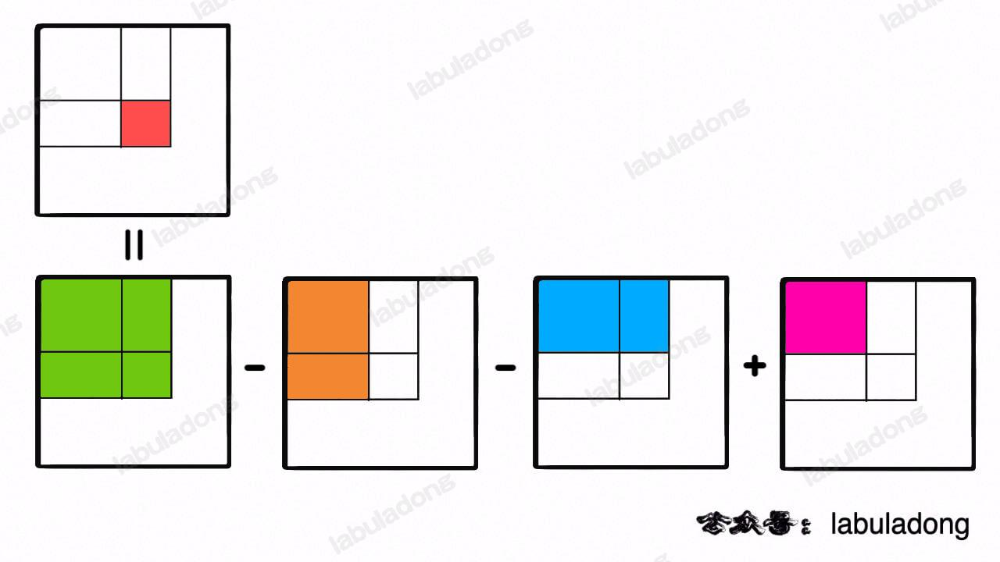
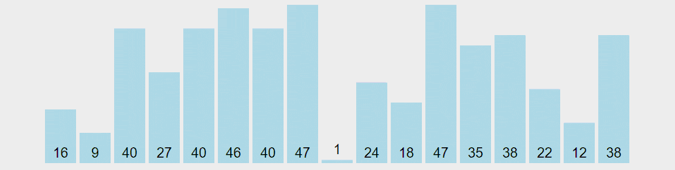
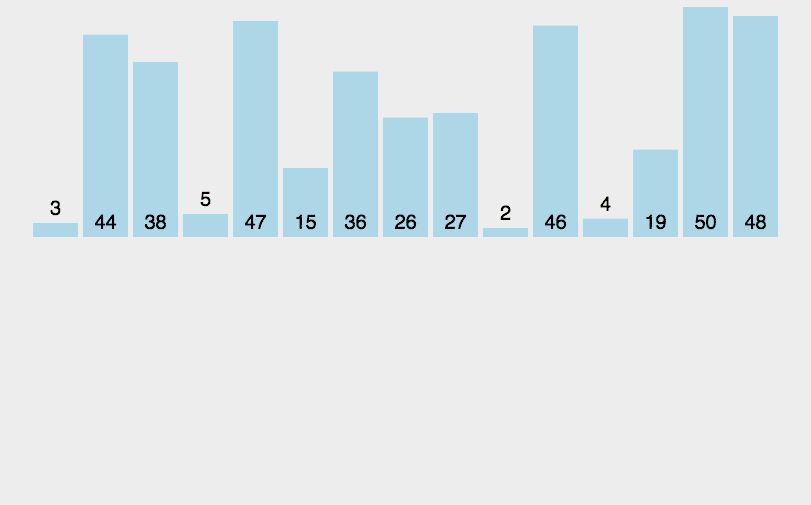
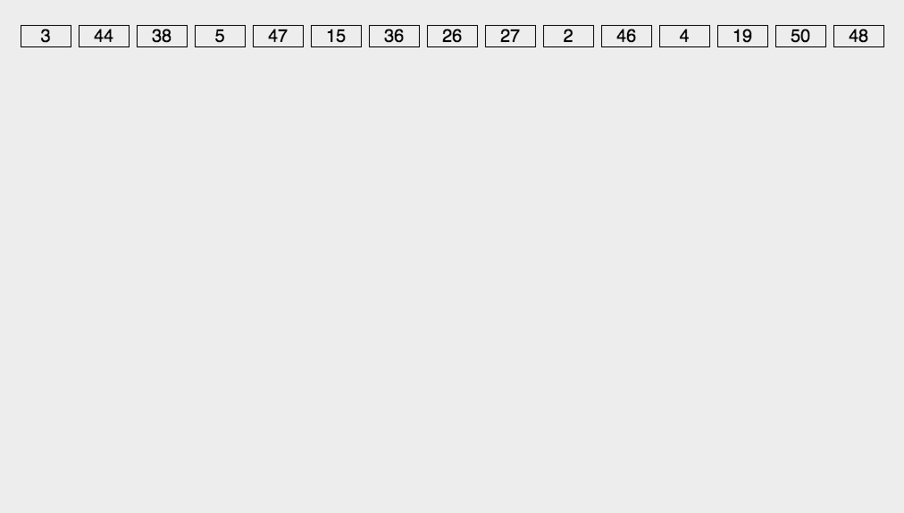

> 摘要：数据结构中，线性结构有数组、字符串、链表、栈和队列、哈希表，非线性结构有堆、树、二叉树、图。手撕算法多为框架，包括常用技巧、十大排序算法、二分查找、分治与递归、动态规划、BFS 框架、DFS框架与回溯、贪心、缓存淘汰算法。基本涵盖[labuladong 的算法小抄](https://github.com/labuladong/fucking-algorithm)、[CodeTop](https://codetop.cc/)频度前40、[剑指 Offer（第 2 版）](https://leetcode.cn/problem-list/xb9nqhhg/)、[LeetCode 热题 HOT 100](https://leetcode.cn/problemset/all/?listId=2cktkvj&page=1&sorting=W3sic29ydE9yZGVyIjoiREVTQ0VORElORyIsIm9yZGVyQnkiOiJTT0xVVElPTl9OVU0ifV0%3D)常见例题。

<!-- more -->

---

## 数据结构

> 由Java数组、String类和Java集合框架实现。
>
> 线性数据结构：数组（字符串）、链表、栈、队列。

### 数组

顺序表，支持随机访问


```
int[] arr = new int[5]; // 声明 + 动态初始化
int[] num = new int[]{1, 2, 3, 5, 8};  // 一般不用
int[] num = {1,2,3,5,8}; // 声明和静态初始化
arr.length; // 长度

List list = new ArrayList();

//与index无关
for(char ch : str) {}
```

##### nSum

nSum：取出数组中n个数， 等于target

- [1. 两数之和](https://leetcode.cn/problems/two-sum/)：也可用 `HashMap<nums[i], i>`。`return new int[]{i, j}; return new int[0];`
- [167. 两数之和 II - 有序数组](https://leetcode.cn/problems/two-sum-ii-input-array-is-sorted/)：两数之和为 `target` 的所有元素对，结果不能出现重复。思路就是**排序 + 双指针**，`sum = nums[l] + nums[r] ，sum > target`则`r--` [ ]；


- [15. 三数之和](https://leetcode.cn/problems/3sum/)：**nSum框架 = 递归 + 2Sum**，`List<List<Integer> > nSubSum = nSum(nums, n-1, i+1, target-nums[i]);`

##### 前缀和

前缀和技巧、累加和：**时间复杂度**降为 `O(1)`。

主要适用场景是：原始数组不被修改的情况下，频繁查询某区间的累加和。

- [303. sumRange 区域和 - 数组不可变](https://leetcode.cn/problems/range-sum-query-immutable/)：`preSums[0] = 0, preSums[right + 1] - preSums[left]`


- [304. 二维区域和 - 矩阵不可变](https://leetcode.cn/problems/range-sum-query-2d-immutable/)：`preSum[i][j]` 记录 matrix 中子矩阵` [0, 0, i-1, j-1]` 的元素累加和



- [5.2 计数排序](#5.2 计数排序)

##### 差分数组

[差分数组](https://labuladong.github.io/algo/2/18/23/)主要适用场景是：频繁对原始数组某区间的元素值进行增减。

`diff` 数组：`diff[i] = nums[i] - nums[i-1]`

对区间 `nums[i..j]` 的元素全部加 3，只需让 `diff[i] += 3`，再让 `diff[j+1] -= 3` 即可


##### 相向双指针

- [nSum](#nSum)

##### 背向双指针

- 基本上都是[回文串](#回文串)
- [344. 原地反转字符数组 O(1) 额外空间](https://leetcode.cn/problems/reverse-string/)：数组，双指针【】

##### 同向双指针

- [剑指 Offer 21. 调整数组顺序使奇数位于前半部分](https://leetcode.cn/problems/diao-zheng-shu-zu-shun-xu-shi-qi-shu-wei-yu-ou-shu-qian-mian-lcof/)
- [88. 合并两个有序数组](https://leetcode.cn/problems/merge-sorted-array/)

##### 快慢双指针

- [26. 删除有序数组中的重复项](https://leetcode.cn/problems/remove-duplicates-from-sorted-array/)：[快慢双指针](#快慢双指针)


##### 有序：[二分查找](#二分查找)

- [4. 寻找两个正序数组的中位数](https://leetcode.cn/problems/median-of-two-sorted-arrays/)：合并，并返回(m+n)/2位置
  - 不合并，用双指针 + 二分查找

##### 二维数组的花式遍历

- [54. 矩阵的螺旋遍历](https://leetcode.cn/problems/spiral-matrix/)【】、[剑指 Offer 29. 顺时针打印矩阵](https://leetcode.cn/problems/shun-shi-zhen-da-yin-ju-zhen-lcof/)：收缩四个边界【】
  - [59. 生成螺旋矩阵 II](https://leetcode.cn/problems/spiral-matrix-ii/)【】
- [48. 顺时针旋转 90 度图像](https://leetcode.cn/problems/rotate-image/)：通过另一条对角线镜像对称矩阵，然后再反转每一行。

### 字符串

##### 回文串

- 数组等能找到前驱的：
  1. **判断**全串是否回文==>可用头尾（相向）双指针向中点遍历；（字母大小写、忽略空格）[9. 回文数](https://leetcode.cn/problems/palindrome-number/)
  2. **获取**最长回文**子串**内容：（遍历字符串，以当前位置作为回文中点，）传入回文中点 `l` 和 `r` ，由回文中点向两侧（背向双指针）扩撒（遍历），`l==r`时长度为奇数。[5. 最长回文子串](https://leetcode.cn/problems/longest-palindromic-substring/)
  3. 根据字符数组 构造回文串
  4. 最长回文子序列：[动态规划](#子序列)
     - 子串：是字符串中连续的一个序列，
     - 子序列：是字符串中保持相对位置（删除某些字符）的字符序列，
     - 如，"bbbb"是字符串"bbbab"的子序列但不是子串。
- 链表：
  - **判断**全串是否回文==>快慢双指针找中点（奇数找中点后一个节点，偶数找后一个中点）（前半部分的尾结点.next），（封装函数）（头插法）反转后半部分链表，比较同向双指针，空间复杂度O(1)。[234. 判断回文链表](https://leetcode.cn/problems/palindrome-linked-list/) 对称链表【】

```
//1.判断
boolean isPalindrome(String s) {
    if (s.length() == 0)	//“”作为回文串
          return true;
    // 头尾一左一右双指针相向而行
    int left = 0, right = s.length() - 1;
    while (left < right) {
    	// 字符不是字母和数字的情况，忽略空格
    	if (!Character.isLetterOrDigit(s.charAt(l))) {
            l++;
          } else if (!Character.isLetterOrDigit(s.charAt(r))) {
            r--;
          } else if (Character.toLowerCase(s.charAt(l)) != Character.toLowerCase(s.charAt(r))) {
          	// 判断二者是否相等，忽略大小写
            return false;
        }
        left++;
        right--;
    }
    return true;
}

//2.获取
if (s.length() < 2)
    return s;
for(int i=0; i<n; i++){
    # 找到以 s[i] 为中心的回文串
    palindrome(s, i, i)
    # 找到以 s[i] 和 s[i+1] 为中心的回文串
    if(i + 1 < n-1)
    	palindrome(s, i, i + 1)
}
// 在 s 中寻找以 s[left] 和 s[right] 为中心的最长回文串
// left == right时，为奇数
String palindrome(String s, int left, int right) {
    // 防止索引越界
    while (left >= 0 && right < s.length()
            && s.charAt(left) == s.charAt(right)) {
        left--;	// 背向双指针，向两边展开
        right++;
    }
    // 返回以 s[初始left] 和 s[初始right] 为中心的、最长回文串[left+1, right)
    return s.substring(left + 1, right);
}

// 用于存放字符
HashSet<Character> hashset = new HashSet<Character>();
```

##### 滑动窗口

> 双指针的一种

左右指针技巧中，把索引**左闭右开**区间 `[left, right)` 称为一个「窗口」。方便边界处理 `[0, 0)`。

算法框架：虽然有嵌套的 while 循环，但依然是 `O(n)`，因为每个元素都只会进入窗口一次，然后被移出窗口一次。

```
/* 滑动窗口算法框架 */
void slidingWindow(string s) {
    //字符最后一次出现的位置，用map记下每个字符的索引，直接进行跳转
    Map<Character, Integer> window = new HashMap<>();
    
    int left = 0, right = 0;
    while (right < s.size()) {
        // ch 是将移入窗口的字符
        char ch = s.charAt(end);
        // 增大窗口
        right++;
        // 进行窗口内数据的一系列更新
        ...

        /*** debug 输出的位置 ***/
        printf("window: [%d, %d)\n", left, right);
        /********************/
        
        // 判断左侧窗口是否要收缩
        while (window needs shrink) {
            // d 是将移出窗口的字符
            char d = s[left];
            // 缩小窗口
            left++;
            // 进行窗口内数据的一系列更新
            ...
        }
    }
}
```

- [3. 无重复字符的最长子串](https://leetcode.cn/problems/longest-substring-without-repeating-characters/)
- [76. 最小覆盖子串](https://leetcode.cn/problems/minimum-window-substring/)【】
- [567. 字符串的排列](https://leetcode.cn/problems/permutation-in-string/)【】
- [438. 找到字符串中所有字母异位词](https://leetcode.cn/problems/find-all-anagrams-in-a-string/)【】

##### 经典例题

- String 类的常用方法

- 统计字符串中每个字符出现的频率
  
  - 出现次数最多字符
  
- [剑指 Offer 50. 第一个未重复的字符](https://leetcode.cn/problems/di-yi-ge-zhi-chu-xian-yi-ci-de-zi-fu-lcof/)
  - 字符串运算
  - 哈希表
  
- 简化复杂 url

- 字符串前n位移动到尾部

- [14. 最长公共前缀](https://leetcode.cn/problems/longest-common-prefix/)：先用Arrays.sort(strs)为数组升序排序，再从前往后对比第一个和最后一个元素的字符【】

- [415. 字符串相加](https://leetcode.cn/problems/add-strings/)：[链表位运算 两数逐位相加](#双指针)【】

  ```
  StringBuffer ans = new StringBuffer();
  while (i >= 0 || j >= 0 || add != 0) {
  	int x = i >= 0 ? num1.charAt(i) - '0' : 0;
  }
  // 计算完以后的答案需要翻转过来
  ans.reverse();
  ```

- [剑指 Offer 05. 替换空格](https://leetcode.cn/problems/ti-huan-kong-ge-lcof/)：常规方法遍历 charAt(i)

```
StringBuffer res = new StringBuffer();
return res.toString();

//将char转为String，并比较
String.valueOf(ch).equals(" ")

//api
str.replaceAll("\\s", "%20");	//模式匹配
str.replace(“ ”， “%20”) 
```

- [14. 最长公共前缀](https://leetcode.cn/problems/longest-common-prefix/)【】
- [剑指 Offer 58 - I. 翻转单词顺序](https://leetcode.cn/problems/fan-zhuan-dan-ci-shun-xu-lcof/)
  - 常规方式：把 `s` 按空格 `split` 成若干单词，然后 `reverse` 这些单词的顺序，最后把这些单词 `join` 成句子。但用了额外的空间。
  - 原地翻转：先将整个字符串 `s` 反转，然后将每个单词分别反转再join()。
    - 用**正则匹配**分割单词，放入String数组，反转数组再join()
- [剑指 Offer 67. 把字符串转换成整数](https://leetcode.cn/problems/ba-zi-fu-chuan-zhuan-huan-cheng-zheng-shu-lcof/)【】
- [剑指 Offer 58 - II. 左旋转字符串](https://leetcode.cn/problems/zuo-xuan-zhuan-zi-fu-chuan-lcof/)

##### KMP 字符串~~模式~~匹配算法

应用了贪心算法。用来解决字符串查找的问题，可在字符串（S）中查找子串（W）、模式串（P）出现的位置。把字符匹配的时间复杂度缩小到 O(m+n) ，而空间复杂度也只有O(m)。因为“暴力搜索”会反复回溯主串，导致效率低下，而KMP算法可利用已部分匹配这个有效信息（部分匹配表），保持主串上的指针不回溯，通过修改子串的指针，让模式串尽量移动到有效的位置。


根据**部分匹配表**（next数组），最后一个匹配字符B（在已匹配的字符串中）对应的"部分匹配值"为2。移动位数 = 已匹配的字符数 - 对应的部分匹配值。

- 前缀：指除了最后一个字符外，字符串的全部连续字符组合；
- 后缀：指除了第一个字符外，字符串的全部连续字符组合。
- 部分匹配值：就是"前缀"和"后缀"的最长共有元素的长度。
- 如"ABCDA"的前缀为[A, AB, ABC, ABCD]，后缀为[BCDA, CDA, DA, A]，共有元素为"A"，长度为1；
- "**AB**CD**AB**"中有两个"AB"，"部分匹配值"就是2（"AB"的长度）。搜索词移动时，第一个"AB"向后移动4位（字符串长度-部分匹配值），就可来到第二个"AB"的位置。
- [字符串匹配的KMP算法 阮一峰](https://www.ruanyifeng.com/blog/2013/05/Knuth%E2%80%93Morris%E2%80%93Pratt_algorithm.html)

### 链表

##### 指针

Java 语言中不存在指针，但可理解为`引用`。

指针丢失：指针没有明确指向。

内存泄漏：结点不判空就操作next域等，导致空指针异常。

##### 头指针 VS 头结点

头结点：在单链表的第一个结点前附加一个结点，称为头结点。

- 头结点的Data域可为空，仅包含 next 域；也可记录表长等信息。

头指针：指向链表的第一个节点，通常用来标识一个链表，如单链表L。

- **若不带头结点**：
  - 头指针指向第一个节点的存储位置；
  - 判空：头指针为`null`（Java区分大小写，且所有关键字都是小写）时表示一个空链表。
- 若带头结点：
  - 头指针指向头结点的存储位置；
  - 判空：头结点的next域为`null`时为空链表。

优点：统一头/非头节点、空/非空链表的操作。

- 第1个位置的插入、删除与其他位置的操作保持一致

```
 //通常在链表头部加入哨兵(作为头结点)，使删除的代码保持一致，不用额外考虑删除第一个节点的情况
 //虚拟头结点技巧，插入 dummy 哑节点，用dummy->next表示真正的头节点，可避免处理头节点为null的边界问题
 ListNode dummy = new ListNode(-1);
 dummy.next = head;
 ....
 return dummy.next;
```

##### 判断边界 / 特殊情况

- 链表为空时，判空；
- 链表只包含一个、两个结点时；
- 在处理头结点和尾结点时。

##### 数组 VS 链表 、ArrayList VS LinkedList

##### 链表快慢双指针

单链表大部分都属于快慢指针

```
// 快慢指针初始化指向 head
ListNode slow = head, fast = head;
```

- [剑指 Offer 22. 查找倒数第k个节点](https://leetcode.cn/problems/lian-biao-zhong-dao-shu-di-kge-jie-dian-lcof/)：即正数第 `n - k + 1` 个结点，但n无法直接得到（计算链表的length、栈），因此用快慢双指针；注意`k>n`时应返回null。

  - [19. 删除倒数第 K 个结点](https://leetcode.cn/problems/remove-nth-node-from-end-of-list/) ：调用查找函数，获取倒数第 `k + 1` 个结点的引用，删除后继结点
  - 虚拟头结点技巧：为了防止空指针，如链表共有 5 个节点，删除倒数第 5 个即第一个节点，需先找到倒数第 6 个节点，但第一个节点前面已没有节点。

  ```
  // 删除倒数第 k 个，要先找倒数第 k + 1 个节点
  ListNode x = findKthFromEnd(dummy, k + 1);
  ```

  [876. 链表的中间结点](https://leetcode.cn/problems/middle-of-the-linked-list/)

- [141. 检测链表中是否有环](https://leetcode.cn/problems/linked-list-cycle/)，[142. 环形链表 II 找环起点](https://leetcode.cn/problems/linked-list-cycle-ii/)（环起点不一定在head）：fast指针在环内，第二次相遇即为环起点

  

- [判断回文链表](#回文串)

- 判断两单链表是否[160. 相交链表](https://leetcode.cn/problems/intersection-of-two-linked-lists/)，并找出交点（第一个公共结点） [剑指 Offer 52. 两链表的第一个公共节点](https://leetcode.cn/problems/liang-ge-lian-biao-de-di-yi-ge-gong-gong-jie-dian-lcof/)

  - 方法一：用 `HashSet` 记录一个链表的所有节点，和另一条链表对比，缺点是需额外空间；
  - **方法二**：让 `p1` 遍历完链表 `A` 之后开始遍历链表 `B`，…，逻辑上拼接两条链表， `p1` 和 `p2` 能同时到达相交节点 `c1`。空间复杂度 `O(1)`

  

  - 方法三：两条链表首尾相连，问题转换成了「寻找环起点」

    

  - 方法四：预先计算两条链表的长度，较长的链表fast指针先走，使p1 和 p2 到达尾部的距离相同，p1 == p2且不为空时即相交

- 循环左移

##### 双指针

- [剑指 Offer 25. 合并两个排序的链表](https://leetcode.cn/problems/he-bing-liang-ge-pai-xu-de-lian-biao-lcof/)：拉链法

  ```
  //虚拟头结点
  ListNode dummy=new ListNode(-1);
  //合并后l1 l2最多只有一个非空，直接将链表末尾指向未合并完的链表
  p.next = (l1==null) ? l2 : l1
  ```

  - [23. 合并K个升序链表](https://leetcode.cn/problems/merge-k-sorted-lists/) ：[第K个元素](#第K个元素)

- 链表位运算
  
  - [2. 逆序链表按位表示整数 两数逐位相加 链表求和](https://leetcode.cn/problems/add-two-numbers/)：carry 进位
  
- [328. 奇偶链表](https://leetcode.cn/problems/odd-even-linked-list/)：odd、even奇偶双指针交替前进

- [42. 接雨水总数](https://leetcode.cn/problems/trapping-rain-water/)：【】


```
water[i] = min(
           # 左边最高的柱子
           max(height[0..i]),
           # 右边最高的柱子
           max(height[i..end])
        ) - height[i]
```

- [148. 排序链表](https://leetcode.cn/problems/sort-list/)：插入排序【】

##### 经典例题

- [206. 反转链表](https://leetcode.cn/problems/reverse-linked-list/)
  1. **头插法**：不申请额外空间，就地反转，空间复杂度O(1)
  2. 反转 => 栈：[剑指 Offer 06. 从尾到头打印链表](https://leetcode.cn/problems/cong-wei-dao-tou-da-yin-lian-biao-lcof/)
  3. 递归：[92. 反转指定区间链表 II](https://leetcode.cn/problems/reverse-linked-list-ii/)【】
     - [25. K 个一组翻转链表](https://leetcode.cn/problems/reverse-nodes-in-k-group/)
     - [92. 反转链表 II 指定区间](https://leetcode.cn/problems/reverse-linked-list-ii/)：【】
       1. 迭代解法很简单，用一个 for 循环即可；
       2. 常用来考察**纯递归**的形式。


- [143. 重排链表](https://leetcode.cn/problems/reorder-list/)：找**链表中点**，**合并**原链表的左半端和**反转**后的右半端【】
- [剑指 Offer 35. 复杂链表的复制 random指针](https://leetcode.cn/problems/fu-za-lian-biao-de-fu-zhi-lcof/)：HashMap + 递归
- ~~奇数位升序，偶数位降序，要求输出全局升序，不用数组~~
- 双向链表

  - **前插**：右下（指向后继）+顺时针
  - 后插：左下+逆时针
  - 删前驱：
- 循环链表
- 双向循环链表

```
/* 迭代遍历单链表 */
for (ListNode p = head; p != null; p = p.next) {
}

/* 递归遍历单链表 */
void traverse(ListNode head) {
    if (head == null) {
        return;
    }
    // 前序位置
    traverse(head.next);
    // 后序位置
    /* 倒序打印链表元素 */
    print(head.val);
}
```

### 栈、队列

##### 栈

栈常用一维数组或链表来实现，

- 用数组实现的栈叫作 顺序栈，
- 用链表实现的栈叫作 **链式栈** 。

```
Deque<Integer> stack = new LinkedList<>();
stack.push(1);
Integer i = stack.pop();

Stack<Character> stack = new Stack<Character>();
```

##### 队列

后端（rear）入队，前端（front）出队；


- 顺序队列（数组实现）：存在“假溢出”的问题，即明明有位置却不能添加。因为front 和 rear 都会持续往后移动，无法返回空出的数组头部。`front==rear` 时队列为空。
  - 循环队列：可解决假溢出和越界问题。判满条件： `(rear+1) % QueueSize == front` 。
- 链式队列（链表实现）


常用于

- 阻塞队列
- 线程池中的请求/任务队列
- Linux 内核进程队列
- 消息队列

##### Deque 双端队列

> 集合框架，用于实现栈和队列。

##### PriorityQueue 优先队列

一种队列，出队顺序按照优先级；常用于找最值，往往用[堆](#堆)来实现。

至少需支持下述操作：

- 插入带优先级的元素（insert_with_priority）
- 取出最高优先级的元素（pull_highest_priority_element）
- 查看最高优先级的元素（peek）：O(1) 

其它可选的操作：

- 清空优先队列
- 调整一个元素的优先级
- 批插入一批元素
- 检查优先级高的一批元素
- 合并多个优先队列

手撕算法典型题包括

- 堆排序
- 带权图的遍历等。

##### 单调栈、单调队列

单调栈：每次新元素入栈后，栈内的元素都保持有序。用途不太广泛，只处理一类典型的问题

- [496. 下一个更大元素 I](https://leetcode.cn/problems/next-greater-element-i/) ：由后往前对比数组元素和栈顶，矮个起开，反正也被挡着了。。。入栈【】
- [316. 去除重复字母](https://leetcode.cn/problems/remove-duplicate-letters/)：也可用哈希表+字符处理？【】

##### 经典例题

- [232. 用栈实现队列 构造、push、pop、peek、isEmpty](https://leetcode.cn/problems/implement-queue-using-stacks/)：s1为空也不必重新倒回；如用两个栈实现浏览器的回退和前进功能。


- [225. 用队列实现栈](https://leetcode.cn/problems/implement-stack-using-queues/)：只需一个队列，把队尾元素前面的所有元素重新塞到队尾，实现pop栈顶


- [20. 判断有效的成对括号](https://leetcode.cn/problems/valid-parentheses/)：双端队列 Deque 实现 Stack + HashMap 存左右括号对应关系、方便查表
  
  - [921. 使括号有效的最少添加](https://leetcode.cn/problems/minimum-add-to-make-parentheses-valid/)、[1541. 平衡括号的最少插入次数](https://leetcode.cn/problems/minimum-insertions-to-balance-a-parentheses-string/)：计算多出的`(`或`)`，通过一个 `need` 变量记录对右括号的需求数，当 `need == -1` 时，意味着遇到一个多余的右括号，显然需插入一个左括号。【】
  - [1614. 计算括号的最大嵌套深度](https://leetcode.cn/problems/maximum-nesting-depth-of-the-parentheses/)、[1111. 根据嵌套深度 分成两个不相交的有效括号字符串](https://leetcode.cn/problems/maximum-nesting-depth-of-two-valid-parentheses-strings/)【】
  
  
  
- 中缀表达式->后缀：根据中序结果构造二叉树，打印后序结果

  - [剑指 Offer 31. 栈的压入、弹出序列](https://leetcode.cn/problems/zhan-de-ya-ru-dan-chu-xu-lie-lcof/)：每次入栈后，循环判断 “栈顶元素 == 弹出序列的当前元素” 是否成立，将符合弹出序列顺序的栈顶元素全部弹出。

- 反转字符串：还可用[背向双指针](#背向双指针)

### 散列表、哈希表

就是通过散列函数把键映射到一个大数组里。

解决散列冲突的方法：

- 拉链法：需要链表特性，操作简单，但需额外的空间存指针；
- 线性探查法：需要数组特性，以便连续寻址，不需指针的存储空间，但操作稍复杂。

### 堆

##### 定义

堆是一种树，任意一个节点的值都>=（或<=）其所有子节点的值。通常用完全二叉树的形式来表示堆。也不一定全都是完全二叉树，如斐波那契堆和二项堆。

##### 堆的用途

用于只关心最值，**多次获取**最大值或最小值，**多次**插入或删除数据时。

##### 优势

相对于有序数组而言，堆的主要优势在于更新（插入或删除）数据效率较高。

- 初始化：都是`O(nlog(n))`
- 查找最大值或最小值： 都是`O(1)`
- 更新（插入或删除）数据： `O(n)`，二分法为 `O(log(n))` + 移动数据 `O(n)` ；堆为`O(log(n))`

##### 堆的分类

- 最大堆：堆中的每一个节点的值都大于等于子树中所有节点的值。
- 最小堆：堆中的每一个节点的值都小于等于子树中所有节点的值。

##### 堆的存储

用数组存储二叉树即节省空间，又方便索引。

- 根结点下标从`0`开始，数组中下标为 `i` 的节点，对应的：
  - 父结点：`(i - 1) / 2`
  - 左子结点：`2 * i + 1`
  - 右子结点：`2 * i + 2`


- 若根结点的序号为1，对于树中任意节点i，其
  - 父结点：`i / 2`
  - 左子节点序号为 `2*i`
  - 右子节点为 `2*i+1`

同样，（二叉）堆可用完全二叉树的形式进行存储。

```
PriorityQueue<Integer> pq = new PriorityQueue<>();
pq.offer(e); //插入堆
int e = pq.poll();  //删除堆顶元素
```

##### 插入元素


1. 将要插入的元素放到数组末尾；
2. 自底向上堆化，将末尾元素上浮（如果父结点比该元素大则交换，直到无法交换）；

##### 删除堆顶元素

删除堆顶元素后，为了保持堆顶元素为最值的性质，需调整堆的结构，称为"**堆化**"，方法分为两种：

- 自底向上堆化，元素从最底部向上移动；出现了“气泡”，导致存储空间的浪费。


- **自顶向下堆化**，元素由最顶部向下移动：
  - 将末尾元素放至堆顶；
  - 将堆顶元素下沉：逐步与左右子节点比较并交换位置（下沉），直到无法交换位置；


##### [堆排序](#3.2 堆排序)

##### 第K个元素

- [215. 数组中的第K个最大元素](https://leetcode.cn/problems/kth-largest-element-in-an-array/)
  - PriorityQueue实现二叉堆，筛选弹出直到留下 k 个元素，堆顶最小元素，即第 k 个最大的元素
  - 也可用快速选择算法，稍微改造了快速排序的算法思路【】
- [23. 合并K个升序链表](https://leetcode.cn/problems/merge-k-sorted-lists/) ：将`k`条链表的头结点加入最小堆（用[PriorityQueue 优先级队列](#PriorityQueue 优先队列)实现）进行节点排序，选取堆顶元素。
  - `pq` 中的元素个数最多是 `k`，一次 `poll` 或 `add` 方法的时间复杂度是 `O(log k)`；所有节点都会被加入和弹出 `pq`，整体是 `O(N log k)`，其中`N` 是所有链表的节点总数。

### 树

##### 基本概念

- 节点的高度 ：该节点到叶子节点的最长路径所包含的边数；
- 树的高度 ：根节点的高度。
- 节点的深度 ：根节点到该节点的路径所包含的边数；
- 树的深度：叶子节点的最大深度。
- 节点的层数 ：节点的深度+1。


```
/* 基本的 N 叉树节点 */
class TreeNode {
    int val;
    TreeNode[] children;
}
```

##### 树、图的遍历

树的 DFS/BFS 遍历算法

```
//多叉树遍历框架
void traverse(TreeNode root) {
	if(root == nul) return;
    for (TreeNode child : root.childern) {
        // 前序位置，在进入节点前的时间点执行的操作
        traverse(child);
        // 后序遍历需要的操作
    }
}
```

##### 经典题目

- Huffman 树
- [236. 二叉树的最近公共祖先](https://leetcode.cn/problems/lowest-common-ancestor-of-a-binary-tree/)
  1. 递归：根据root、p、q的关系递归。[235. 二叉搜索树的最近公共祖先](https://leetcode.cn/problems/lowest-common-ancestor-of-a-binary-search-tree/)【】
  2. 还可转化为[两链表的公共节点](#链表快慢双指针)

### 二叉树

优点：增**删**改查性能都很好
缺点：瘸子

##### 分类

- 满二叉树：二叉树每层（k）的结点数都达到最大值2^(k-1)^，即结点总数是(2^k^) -1。

- 完全二叉树：最后一层若不满则缺少的节点都在右边，其余层都是满的。性质：父结点和子节点的序号有对应关系。


- BST 树、二叉查找、搜索、排序树（Binary Search Tree、ordered binary tree、sorted binary tree）：若不为空，任意节点的值均 > 左子树任意结点、均 < 右子树任意节点，且左右子树都是二叉查找树（即中序遍历为单调递增的二叉树 + 二分查找思想）。压扁了就是有序数组，无重复值。由二叉树的层序遍历扩展而来，常用于求无权图的**最短路径**。

  - 注意不是所有的BST题目都需要递归，有的题目只需要while循环即可；
  - **查找**、插入、删除节点：增删查改均为O（h）复杂度，h为树的高度；
  - 中序遍历
  - 缺点：在插入数据有序的序列，会导致退化成斜树、链表，从而查找、删除、添加时的性能均从O（logN）降低为O（N）。因此引入平衡二叉树。

  

- 平衡二叉树、AVL 树：除了空树，每个节点的左右子树都是一棵平衡二叉树、且高度差的绝对值不超过1。常用实现方法有 **红黑树**、**替罪羊树**、**加权平衡树**、**伸展树** 等。

- 红黑树（自平衡二叉查找树、对称二叉B树）：既有线性表的二分查找、有序，又有链表的增删性能。可在O(log n)时间内完成查找、插入和删除。典型用途是实现关联数组，TreeMap、TreeSet及JDK1.8的HashMap底层都用到红黑树。一种**二叉查找树**，满足：

  - 根、所有叶子（为空、NIL或NULL）节点都是黑色；
  - 每个红节点必须有两个黑子节点。（或者说从每个叶子到根的所有路径上不能有两个连续的红节点）（或不存在两个相邻（父子关系）的红节点）（或红节点的父、子节点均是黑色）
  - 从任一节点到每个叶子的所有简单路径都包含相同数目的黑节点。确保没有一条路径会比其他路径长出两倍。

  

  - [一篇漫画告诉你--什么是红黑树？](https://zhuanlan.zhihu.com/p/78249704)
  - 左旋算法：父节点被自己的**右孩子**取代

  

  - 右旋算法
  - 变色
  - 添加、删除

- B 树 / 多路平衡查找树：用于数据库索引的实现。

- B+ 树：B 树的所有节点存放键和数据，而 B+树只有叶子节点存放 key 和 data，其他内节点只存放 key。

- Trie 树、字典树、前缀树、单词查找树：由二叉树衍生出来，主要用于：处理字符串前缀相关的操作。

##### 二叉树的存储

- 链式存储

- 顺序存储：
  - 根结点的序号为 1
  - 根结点的序号为 0

##### BST二叉查找树/二叉排序树

```
List<List<Integer> > res = new ArrayList<>();

List<List<Integer> > levelTraverse(TreeNode root) {
    if (root == null) {
        return res;
    }
    // root 视为第 0 层
    traverse(root, 0);
    return res;
}

void traverse(TreeNode root, int depth) {
    if (root == null) {
        return;
    }
    // 前序位置，看看是否已经存储 depth 层的节点了
    if (res.size() <= depth) {
        // 第一次进入 depth 层
        res.add(new LinkedList<>());
    }
    // 前序位置，在 depth 层添加 root 节点的值
    res.get(depth).add(root.val);
    traverse(root.left, depth + 1);
    traverse(root.right, depth + 1);
}
```

##### 层序遍历二叉树

- 外部变量 + **迭代遍历**一遍：对应[回溯算法核心框架](#回溯算法框架)，简单易懂

  - [102. 二叉树的层序遍历](https://leetcode.cn/problems/binary-tree-level-order-traversal/)：队列，自左向右列序遍历。可扩展出[BFS 算法框架](#BFS 算法框架)；从上到下打印、 每行中的最大值。

    - [103. 二叉树的锯齿形层序遍历](https://leetcode.cn/problems/binary-tree-zigzag-level-order-traversal/)：奇偶层ArrayList分别用addLast()、addFirst()
    
    ```
    public List<List<Integer> > levelOrderTraverse(TreeNode root) {
            List<List<Integer> > res = new LinkedList<>();
            if (root == null) return res;
            Deque<TreeNode> q = new LinkedList<>();
            q.offer(root);
    
            // 从上到下遍历二叉树的每一层
            while (!q.isEmpty()) {
                int sz = q.size();
                List<Integer> re = new LinkedList<>(); //List new
                // 从左到右遍历每一层的每个节点
                for (int i = 0; i < sz; i++) {
                    TreeNode cur = q.poll(); //	
                    re.add(cur.val); // not offer() push()
                    //奇数层
                    if(0 == res.size()%2) {
                    
                    }
                    // 将下一层节点放入队列
                    if (cur.left != null) {
                        q.offer(cur.left);
                    }
                    if (cur.right != null) {
                        q.offer(cur.right);
                    }
                }
                res.add(re); 
            }
            return res;
        }
    }
    ```

##### 前序/中序/后序遍历二叉树

- [124. 二叉树中的最大路径和](https://leetcode.cn/problems/binary-tree-maximum-path-sum/)：计算单边路径和时顺便计算最大路径和，递归后序遍历【】
- [94. 二叉树的中序遍历](https://leetcode.cn/problems/binary-tree-inorder-traversal/)：动态规划思路【】

在递归函数中，将当前节点**分解**为子问题（子树），通过子树的结果推导出当前节点的结果：对应[动态规划核心框架](#动态规划算法框架)

```
void traverse(TreeNode root) {
    // 前序位置：自顶向下、自左向右遍历node、执行代码；从根节点遍历过来的过程能顺带记录前序位置的信息，如节点的深度；快速排序，对前中后序位置不敏感的代码
    traverse(root.left);
    // 中序位置：主要用在 BST 二叉查找树场景
    traverse(root.right);
    // 后序位置：自底向上遍历node、执行代码；只有后序位置才能通过返回值获取子树的信息，如树的深度/高度、二叉树的最大深度（即根节点到「最远」叶子节点的最长路径上的节点数）、节点的高度；归并排序、大多数和子树有关的、倒序打印单链表、二叉树的最长直径（即任意两个结点间的路径长度，不一定要穿过根结点=左右子树的最大深度之和+1）
}
```

##### 经典题目

- 蛇形输出非完全二叉树

### 图

> 面试笔试很少出现图相关的问题，就算有大多也是简单的遍历问题，基本上可完全照搬多叉树的遍历。
>

##### 基本概念

图（G）由顶点的有穷非空集合（G）和顶点间的边（E）组成，通常表示为：**G(V,E)**。如社交软件上好友关系。

- 无向图和有向图
- 无权图和带权图

树和图的根本区别：树不含环，图可以包含环。树是一种图，即无环连通图，图是多叉树的延伸。如果图没有环，可拉伸成一棵树。

- 度（degree）：每个节点相连的边数。
  - 入度（indegree）：有向图中指向每个节点的边数；
  - 出度（outdegree）：有向图中从每个节点出发的边数。

##### 图的存储/表示方法、具体实现、物理结构


- 邻接矩阵：优点是简单直接（用一个二维数组），快速判断两点间是否连通，可进行矩阵运算，但（图比较稀疏时）会浪费空间。


```
// 邻接矩阵
// graph[x][y] 记录 x 是否有一条指向 y 的边、或边的权重
boolean/int[][] graph;
```

- **邻接表**：比较节省空间，但很多操作效率低，如无法快速判断两个节点是否连通。在常规的算法题中使用更频繁。
  - 在无向图中，邻接表元素个数等于边的条数的两倍；
  - 在有向图中，邻接表元素个数等于边的条数，


```
// 邻接表
// graph[x] = List<Integer> ？存储 x 的所有邻居节点
List<Integer>[] graph;
```

##### 图的搜索、遍历：深度/广度优先搜索

各种搜索问题其实都是树的遍历问题

- [DFS](#DFS 框架)：用**栈**回溯。
- [BFS](#BFS 框架)：把问题抽象成图，每次将当前节点周围的所有节点加入**队列**。

二者最主要的区别是：BFS`depth` 每增加一次，队列中的所有节点都向前迈一步，保证了第一次到达终点时，走的步数是最少的，可在不遍历完整棵树的条件下找到**最短路径**。DFS 实际上是靠递归的堆栈记录走过的路径，把二叉树中所有节点都走完才能对比出**最短路径**。

BFS 空间复杂度比 DFS 大。

图和树最大的区别是，图是可能包含环的。


```
// 记录被遍历过的节点
boolean[] visited;
// 记录从起点到当前节点的路径，用于判断是否成环
boolean[] onPath;

/* 图遍历框架 */
void traverse(Graph graph, int s) {
    if (visited[s]) return;
    visited[s] = true;
    // 做选择：标记节点 s 在路径上
    onPath[s] = true;
    for (int neighbor : graph.neighbors(s)) {
        traverse(graph, neighbor);
    }
    // 撤销选择：节点 s 离开路径
    onPath[s] = false;
}
```

- [797. 所有可能的路径](https://leetcode.cn/problems/all-paths-from-source-to-target/) [剑指 Offer II 110. 所有路径](https://leetcode.cn/problems/bP4bmD/)【】

```
// 记录所有路径
List<List<Integer> > res = new LinkedList<>();

public List<List<Integer> > allPathsSourceTarget(int[][] graph) {
    // 维护递归过程中经过的路径
    LinkedList<Integer> path = new LinkedList<>();
    traverse(graph, 0, path);
    return res;
}

/* 图的遍历框架 */
void traverse(int[][] graph, int s, LinkedList<Integer> path) {
    // 添加节点 s 到路径
    path.addLast(s);

    int n = graph.length;
    if (s == n - 1) {
        // 到达终点
        res.add(new LinkedList<>(path));
        // 可在这直接 return，但要 removeLast 正确维护 path
        // path.removeLast();
        // return;
        // 不 return 也可以，因为图中不包含环，不会出现无限递归
    }

    // 递归每个相邻节点
    for (int v : graph[s]) {
        traverse(graph, v, path);
    }

    // 从路径移出节点 s
    path.removeLast();
}
```

##### 最小生成树 Kruskal 算法

> 经典算法，学有余力可以掌握一下

图的生成树：生成树是包含图中所有顶点的「无环连通子图」。就是在图中找一棵包含图中的所有节点的（无环）树。

[最小生成树（MST）](https://visualgo.net/zh/mst)：权重和最小的生成树。都用了贪心思想。[1584. 连接所有点的最小费用](https://leetcode.cn/problems/min-cost-to-connect-all-points/)

- `Kruskal` 克鲁斯卡尔算法：用到了贪心思想，使权重和尽可能小。对所有边按照权重从小到大排序，从权重最小的边开始，选择合适的边加入 `mst` 集合；如果边的两端点不属于同一集合，则合并，直到所有的点都属于同一个集合为止。另外，用 Union-Find  Disjoin Sets（UFDS）并查集算法，来保证生成树不含环且不是森林：
  - 如果一条边的两个节点是连通的，则会出现环；
  - 如果最后的连通分量总数大于 1，则说明是「森林」。
- - 并查集 Union-Find Disjoin Sets(UFDS)：用来模拟多个不相交集，能在几乎常数时间内确定一个元素属于哪个集、测试两个元素是否属于同一个集、将两个不相交集合并为一个。在`Kruskal`算法中用来寻找无向图中的连接分量。
- `Prim` 普里姆算法：核心是切分定理（将图分为两个不重叠且非空的节点集合），每次都把权重最小的「横切边」拿出来，直到把构成最小生成树的所有边都切出来为止。用 BFS 算法思想 和 `visited` 布尔数组避免成环。

##### 最短路径 Dijkstra 算法

> 经典算法，学有余力可以掌握一下

简单图（有向无向皆可）的最短路径 Dijkstra 迪杰斯特拉算法：注意是长度而不是具体的路径。是 BFS 算法的加强版，都是从二叉树的层序遍历衍生出来的。

##### 经典题目

- 看到依赖问题 ==> 首先想到的就是把问题转化成「有向图」

比较基本且有用的算法，应较熟练地掌握：

- 有向图的环检测、循环依赖判断：[207. 课程表 选修依赖先修](https://leetcode.cn/problems/course-schedule/)[二分图判定算法](https://labuladong.github.io/algo/2/20/49/)，常用邻接表，DFS 算法遍历图的框架 + `visited` 数组

  - DFS 实现
  - BFS 实现

- 拓扑排序（Topological Sorting）：是一个**有向无环图**的所有顶点的线性序列。

  - 每个顶点出现且只出现一次。
  - 若存在一条从顶点 A 到顶点 B 的路径，那么在序列中顶点 A 出现在顶点 B 的前面。

  

  直观说就是，把一幅图「拉平」，且所有箭头方向都是一致的。存在环，则肯定做不到所有箭头方向一致。如返回一个合理的上课顺序，保证开始修每个课程时，前置课程都已修完。实现：

  - DFS 实现（可进一步理解递归）
  - BFS 实现（更简洁）

- 二分图的判定、图论的双色问题：二分图的顶点集可分割为两个互不相交的子集，图中每条边依附的两个顶点都分属于这两个子集，且两个子集内的顶点不相邻。

## 手撕算法

### 算法定义

- 算法工程师（数学算法）：重点在数学建模和调参经验，计算机只是拿来做计算的工具而已；

- 数据结构与算法（计算机算法）：重点是计算机思维，站在计算机的视角，抽象、化简实际问题，用合理的数据结构去解决问题。

> 大部分开发岗位工作中都是基于现成的开发框架做事，不怎么会碰到底层数据结构和算法相关的问题，但技术相关的岗位，数据结构和算法的考察，公认的程序员基本功。

### 常用技巧

- 排序类
- 数组、字符串：**[二分查找](#二分查找)**
  - n数之和：[nSum](#nSum)
  - 子数组的和：[前缀和](#前缀和)
  - 频繁对子数组增减：[差分数组](#差分数组)
  - 双指针：左右（相向、背向）；同向（快慢、同速）
  - 子串：动态规划
- 单链表：
  - 子串：**[快慢双指针](#快慢双指针)**（滑动窗口）
  - 反转链表
- 递归类：
  - 二叉树：
    - **回溯**算法核心框架：遍历一遍二叉树得出答案
    - **动态规划**核心框架：通过分解问题计算出答案
- 非递归类：无遗漏（正确不出错）、无冗余（优化算法的时间、空间复杂度）聪明的穷举。
  - **贪心**：在题目中发现一些规律（专业点叫贪心选择性质），不用完整穷举所有解。
- **分治**：核心依然是大问题分解成子问题，只不过没有重叠子问题

### 时间、空间复杂度

### 排序

- [10-classical-sorting-algorithms](https://github.com/Snailclimb/JavaGuide/blob/main/docs/cs-basics/algorithms/10-classical-sorting-algorithms.md#%E5%9F%BA%E6%95%B0%E6%8E%92%E5%BA%8F-radix-sort)
- [912. 排序数组](https://leetcode.cn/problems/sort-an-array/)

排序算法总结和比较。注意写代码的流畅度。


#### 0. 内置排序函数

```
Arrays.sort(nums);

List<User> list = new ArrayList<User>();
Collections.sort(list);
```

#### 1. 插入排序

#####  ~~1.1 直接插入~~

- 基本思想：从后往前查找插入位置，比待插入元素大的**逐个后移** 哨兵？
- 最易理解
- 性能：n（有序）	n^2^ 	n^2^（逆序） O(1) 稳定：一趟排序后，元素放到最终位置，值相等的元素保持原有的相对顺序

##### ==1.2 折半插入==

- 二分查找，**统一后移**，移动次数不变
- 性能：n^2^  O(1) 稳定


```
int[] binaryInsertSort(int[] nums) {
	int n = nums.size();
	for(int i=1; i<n; ++i) {
		//在已排序序列中二分查找插入位置，相当于在查找区间为[lo, hi]中查找右侧边界
		int lo = 0, hi = i-1;
		int target = nums[i];
		while(lo <= hi) {
			int mid = lo + (hi-lo)/2;
			if(nums[mid] <= target) {
				lo = mid + 1;
			} else if(nums[mid] > target) {
				hi = mid - 1;
			}
		}
		//待插入位置为lo
		int j=i;
		while(j-- > lo) {
			nums[j] = nums[j-1];
		}
		nums[lo] = target;
	}
	return nums;
}
```

##### 1.3 希尔排序

- 基本思想是：先将整个待排序的记录，间隔为步长倍数的位置分为一组（物理上并不相邻，逻辑上通过步长相邻），组内直接插入排序，不断减半步长gap[i]：n/2 -> 1（步长为1即直接插入排序）。
- 分割成为若干组子序列，整个序列中的记录 “基本有序” 时，再对全体记录进行依次直接插入排序。也称为递减增量排序
- **不稳定**


```
public static shellSort(int[] nums) {
	...
	int gap = n/2;
	while(gap > 0) {
		for(int i=gap*1; i<n; ++i) {
            int current = nums[i];	//待插入元素
			int pre = i-gap;	//同组的前一个元素的索引
			while(pre >=0 && nums[pre] > current) {	//&& 
				nums[pre + gap] = nums[pre]; //比当前元素大的在组内向后移动
				pre -= gap;	//
			}
			nums[pre + gap] = current;	//放入待排序元素
		}
		gap /= 2;
	}
	return nums;
}
```

#### 2. 交换排序

##### ==2.1 冒泡排序==

- 基本思想：两两排序（逆序则交换）作为一趟冒泡，未排序元素中最大的向后移，加入已排序元素的左侧。主要是注意 i、j 的起始取值。
- 性能：n	n^2^	n^2^ O(1) 稳定


```
public static bubbleSort(int[] nums) {
	int n = nums.size();
	for(int i=0; i<n; i++) { //表示n次排序
		boolean runSort = false;	//flag 作为一趟冒泡是否发生交换的标志
		for(int j=1; j<n-i; j++) {	//在[1，n-i)范围内冒泡一次
			if(nums[j-1] > nums[j]) { //前面的大于后面的
				swap(nums, j-1, j); //则交换
				runSort = true;
			}
		}
		if(!runSort) {
			break;
		}
	}
	return nums;
}
```

##### ==2.2 快速排序==

- 基本思想：选取基准元素，通过一趟划分（分治法）将序列分隔成两个子序列，使比基准元素小的元素均在其左边，大的均在右侧，对左右两部分**递归**快速排序。
- 平均性能最优 划分最平衡 平均情况最接近最坏情况
- 性能：n^2^ 	nlgn 	n^2^ （最坏情况为划分不对称，如[1,2,3,4,5]，取1作为pivot）  O(nlogn) 递归工作栈：lgn 	n	lgn **不稳定**
- 提高：
  1. 子序列规模较小时用直接插入
  2. 划分尽量对称



```
public static void quickSort(int[] nums, int lo, int hi) {
	if(lo < hi) {
        int pos = partation(nums, lo, hi);	//partation
        quickSort(nums, lo, pos-1);	//-1
        quickSort(nums, pos+1, hi);
     }
}

public static int partition(int[] nums, int lo, int hi) {
	int pivot = nums[lo];  //取最左一位作为基准，not povit
	while(lo < hi) {
		while(lo < hi && nums[hi] >= pivot) {	// >=, not nums[pivot]
			hi--;
		}
		if(lo < hi) {
			nums[lo++] = nums[hi];	//覆盖最左
		}
		
		while(lo < hi && nums[lo] > pivot) {
			lo++;
		}
		if(lo < hi) {
			nums[hi--] = nums[lo];	//
		}
	}
	nums[lo] = pivot;	//lo即为pivot最终放的index
	return lo;
}
```

#### 3. 选择排序

##### 3.1 简单选择排序

- 基本思想：一趟排序查找未排序序列最小的元素，添加在已排序序列的最后
- 代码最简单直观
- 性能：n^2^ O(1)  用于数据规模很小时，不占用额外的内存空间 **不稳定**

```
public static int[] selectSort(int[] nums) {
    int n=nums.size();
    for(int i=0; i<n-1; ++i) {	// n-1 趟
        int  mini = i;
        // 从下一个位置开始查找
        for(int j=i+1; j<n; ++j) {
            if(nums[j] < nums[mini])
                mini = j;	// 记录最小值的index
        }
        // 最小值为当前元素时不移动，这样提高的效率并不高，可省略
        if(mini != i)
            swap(nums,mini,i);
    }
    return nums;
}
```

##### 3.2 [堆排序](https://www.cs.usfca.edu/~galles/visualization/HeapSort.html)

- [基本思想](https://oi-wiki.org/basic/heap-sort/)：
  - **[建大顶堆](https://visualgo.net/zh/heap)**：将无序数组建立为一个[二叉堆](#堆)；对所有非叶节点（len/2 -> 1）自顶向下堆化。对以 len/2 为根的子树**调整堆**， len/2 -> 1（向前遍历）；
  - 交换堆顶和（堆底）末尾元素：
    - 弹出堆顶元素，作为最大值附在无序数组后（有序数组最前）；
    - 将（堆底）末尾元素放至根结点。
  - 维持剩余堆的性质，**向下调整新堆**（即堆化，使该子树成为堆）：交换使非叶结点 >= 左右子结点中的较大值 ；交换后也可能破坏下一级堆的结构，用**循环**反复比较交换子树结点，直到以该结点为根的子树成为堆为止；
  - 将堆顶的元素取出，作为次大值，与数组倒数第二位元素交换，并维持剩余堆的性质；
  - 反复迭代，直到无序数组中的所有元素取出为止。
- 性能：nlgn O(1) **不稳定**

```
public static int[] heapSort(int[] nums) {
	//buildMaxHeap(nums)
	for(int i=n/2-1; i>=0; --i) { //
		adjustHeap(heap, i, n); //从i开始自下而上构建大顶堆
	}
	
	for(int i=n-1; i>0; --i) {//n-1，not n/2-1
		swap(heap, 0, i);	//交换堆顶和堆底
		adjustDownHeap(heap, 0, i-1);	//对无序区间[0,i-2]调整为大顶堆
	}
	return nums;
}

//自上而下调整大顶堆（非递归）while
public static void adjustDownHeap(int[] nums, int root, int n) {
	int child = root*2+1;	//root为parent, 从root的左子节点开始，沿节点较大的子节点向下调整
	while(child < n) {
		if(child+1 < n && nums[child] < nums[child+1]) {	//如果左子结点小于右子结点，注意边界child+1
			child+=1;	//则取右子结点
		}
		if(nums[root] >= nums[child]) {	//如果堆顶结点最大
			break;	//则调整结束，注意
		} else {
			swap(nums, root, child);	//将大者赋给父结点
			root = child;	//递归将大者作为root，继续向下调整
			child = root*2+1;
		}
	}
}

//自上而下调整大顶堆（非递归）for
public static void adjustDownHeap(int[] nums, int root, int n) {
	int x = nums[root];
	for(int i=2*root+1; i<n; i=2*i+1) {	//从root的左子节点开始，沿节点较大的子节点向下调整
		if(i < n-1 && nums[i] < nums[i+1]) {	//如果左子结点小于右子结点
			i+=1;	//则取右子结点
		}
		if(x >= nums[i]) {	//如果堆顶结点最大
			break;	//则调整结束
		} else {
			nums[root] = nums[i];	//将大者赋给父结点
			root = i;	//递归将大者作为root，继续向下调整
		}
	}
	nums[root] = x;	//将堆顶节点放到最终位置
}

//自上而下调整大顶堆（递归）
public static void adjustDownHeap(int[] nums, int root, int n) {
	int left = i*2+1;
	int right = i*2+2;
	if(left < n && nums[i] < nums[left]) {
		swap(nums, i, left);
		adjustHeap(nums, left, n);
	}
	if(right < n && nums[i] < nums[right]) {
		swap(nums, i, right);
		adjustHeap(nums, right, n);
	}
}
```

#### 4. （2-路）归并排序

- 基本思想：将序列看作长度为1的n个有序表，两两归并，直到合并成1个长度为n的有序表。是采用分治法非常典型的应用。
- A 的左右两段分别有序，双指针，辅助数组B=A
- 性能：nlgn O(n) 稳定 需额外的内存空间



```

```

#### 5. 非比较类的排序

非比较排序：不通过比较来决定元素间的相对次序，而是通过确定每个元素之前应有多少个元素来排序。由于可突破基于比较排序的时间下界，以线性时间运行，因此称为**线性时间非比较类排序**。

只要确定每个元素之前的已有的元素个数即可，所有一次遍历即可解决，算法时间复杂度 `O(n)`。但由于需占用空间来确定唯一位置，所以对数据规模和数据分布有一定要求。

##### 5.1 基数排序

- 基本思想：统一正整数长度，对元素中的每一位数字进行排序，从最低位开始排序。
- 多关键字排序 
- 算法步骤
  1. 取得数组中的最大数，及其位数（即为迭代次数 `N`，如：数组中最大数值为 1000，则 `N=4`）；
  2. `A` 为原始数组，从最低位开始取每个位组成 `radix` 数组；
  3. 对 `radix` 进行计数排序（利用计数排序适用于小范围数的特点）；
  4. 将 `radix` 依次赋值给原数组；
  5. 重复 2~4 步骤 `N` 次
- `O(n x k)`，`k` 为数组中元素的最大的位数； 稳定 需额外的内存空间



```
public static int[] radixSort(int[] arr) {
    if (arr.length < 2) {
        return arr;
    }
    int N = 1;
    int maxValue = arr[0];
    for (int element : arr) {
        if (element > maxValue) {
            maxValue = element;
        }
    }
    while (maxValue / 10 != 0) {
        maxValue = maxValue / 10;
        N += 1;
    }
    for (int i = 0; i < N; i++) {
        //初始化
        List<List<Integer> > radix = new ArrayList<>();
        for (int k = 0; k < 10; k++) {
            radix.add(new ArrayList<Integer>());
        }
        
        for (int element : arr) {
            int idx = (element / (int) Math.pow(10, i)) % 10;
            radix.get(idx).add(element);
        }
        
        //赋给原数组
        int idx = 0;
        for (List<Integer> l : radix) {
            for (int n : l) {
                arr[idx++] = n;
            }
        }
    }
    return arr;
}
```

##### 5.2 计数排序

- 计数排序的核心：在于将输入的数据值转化为键存储在额外开辟的数组中。要求输入的数据必须是有确定范围的**整数**。用一个额外的数组 `C`，其中第 `i` 个元素是待排序数组 `A` 中值等于 `i` 的元素的个数，然后根据数组 `C` 来将 `A` 中的元素排到正确的位置。适用于数据范围很小的数组，可用在基数排序中、来排序数据范围很大的数组。

- 算法步骤：

  - 找出最大和最小的元素；
  - 创建新数组 `C`，长度是`max+1`或 `max-min+1`，默认值都为 0；
  - 遍历原数组 A，统计每个值为`j`的元素出现的次数，存入`C[j]`；`j = A[i]`或`j = A[i]-min` 作为 C 的索引，`j` 出现次数作为 `C[j]` 的值；
  - 求每个数出现次数C的 [前缀和](#前缀和)：对所有的计数累加，新元素的值是该元素与前一个元素值的和，即当 `j>1` 时 `C[j] = C[j] + C[j-1]`；
  - 创建结果数组 `R`，长度和原始数组A一样；
  - **从后向前**遍历原始数组 `A` ，利用前缀和，从右至左计算每个数的排名。反向填充结果数组：将 `A[i]` 放在结果数组 `R` 中的`C[j]-1` 位置，`C[j] -= 1`

  

- `n+max` O(k) 稳定 需额外的内存空间

```
public static int[] countingSort(int[] nums) {
	if(n < 2) return nums;
	
	//Arrays.sort(nums);
	int[] extremum = getMinAndMax(nums);
	int min = extremum[0];
	int max = extremum[1];
	
	int len = max - min + 1;	//元素大小的极值差
	//int count[len+1] = 0;
	int[] count = new int[len+1];
	int[] re = new int[n];

	for(int num : nums) {
		int j = num - min;	//优化减小数组c的大小
		count[j] += 1;
	}
	for(int j=1; j<=len; j++) {	//len = count.length-1
		count[j] += count[j-1]; //求前缀和
	}
	for(int i=n-1; i>=0; i--) {
		int j = nums[i] + min - 1;	//-1
		re[i] = count[j];
		count[i+1] -= 1;
	}
	return re;
}

private static int[] getMinAndMax(int[] arr) {
    int maxValue = arr[0];
    int minValue = arr[0];
    for (int i = 0; i < arr.length; i++) {
        if (arr[i] > maxValue) {
            maxValue = arr[i];
        } else if (arr[i] < minValue) {
            minValue = arr[i];
        }
    }
    return new int[] { minValue, maxValue };
}
```

##### 5.3 桶排序

- 桶排序的工作原理：假设输入数据服从均匀分布，将数据分到有限数量的桶里，每个桶再分别排序（有可能用别的排序算法或以递归方式继续用桶排序）。
- 适用于待排序数据值域较大但分布比较均匀的情况。
- 桶排序是计数排序的升级版。利用了函数的映射关系，高效与否的关键在于映射函数的确定。为了更高效：
  1. 在额外空间充足的情况下，尽量增大桶的数量；
  2. 使用的映射函数能将输入的 N 个数据均匀的分配到 K 个桶中；
- 算法步骤
  1. BucketSize，作为每个桶容量；
  2. 把数据依次映射到对应的桶里；
  3. 对每个非空桶排序，可用其它排序方法，也可递归用桶排序；
  4. 从非空桶里把排好序的数据，放回原来的序列中。
- n+k n^2^  n+k `O(k)` 如果用稳定的内层排序（由于每块元素不多，一般用插入排序），且插入桶中时不改变元素间的相对顺序，此时稳定。需额外的内存空间


```
public static List<Integer> bucketSort(List<Integer> arr, int buketSize) {
	int n = arr.size();
	
	if(n < 2 || buketSize == 0) return arr;
	int[] extremum = getMinAndMax(arr);
	int min = extremum[0];
	int max = extremum[1];
	int bucketCnt = (int) Math.floor((max-min) / buketSize) + 1;	//桶个数，向下取整
	
	List<List<Integer> > buckets = new ArrayList<>();
	for(int i=0; i<bucketCnt; i++) {
		buckets.add(new ArrayList<Integer>());	//创建桶
	}
	for(Integer el : arr) {
		int j = (el - min)/bucketSize;	//idx
		buckets.get(j).add(el);	//放进桶里
	}
	
	List<Integer> re = new ArrayList<>();
	//int index = 0;
	for(int i=0; i<buckets.size(); i++) {
		List<Integer> bkt = buckets.get(i);
		if(bkt.size > 1) {
			insertSort(bkt);	//桶内插入排序
		}
		for(Integer k : bkt) {
			re.add(k);	//把排好序的数据，放回原来的序列中
			//index++;
		}
	}
	return re;
}

private static int[] getMinAndMax(List<Integer> arr) {
    int maxValue = arr.get(0);
    int minValue = arr.get(0);
    for (int i : arr) {
        if (i > maxValue) {
            maxValue = i;
        } else if (i < minValue) {
            minValue = i;
        }
    }
    return new int[] { minValue, maxValue };
}
```

#### 6. 外部排序

外归并排序（External merge sort）：读入一些能放在内存内的数据量，在内存中排序后输出为一个顺串（即内部数据有序的临时文件），处理完所有的数据后再进行归并。如，要对900 MB 的数据进行排序，但机器上只有100 MB的可用内存时，按如下操作：

1. 读入100 MB的数据至内存中，用某种内部排序（如[快速排序](#快速排序)、[堆排序](#堆排序)、[归并排序](#归并排序)等）在内存中完成排序。
2. 将排序完成的数据写入磁盘。
3. 读入每个临时文件（顺串）的前10 MB（ = 100 MB / (9块 + 1)）的数据放入内存中的输入缓冲区，最后的10 MB作为输出缓冲区。
4. 执行九路归并算法，将结果输出到输出缓冲区。一旦输出缓冲区满，将缓冲区中的数据写出至目标文件，清空缓冲区。一旦9个输入缓冲区中的一个变空，就从这个缓冲区关联的文件，读入下一个10M数据，除非这个文件已读完。这是“外归并排序”能在主存外完成排序的关键步骤 -- 因为“归并算法”对每一个大块只是顺序地做一轮访问(进行归并)，每个大块不用完全载入主存。

##### 经典例题

- 第k大：一亿条数据选出其中1000个最大的
- 内存 1000M、文件 1G、10个出现次数最多的网址

### 二分查找

```
Arrays.sort(nums);
int index = Arrays.binarySearch(nums, 0, nums.length, target);
```

##### 应用场景

1. 从题目中可抽象出
 - 一个自变量 `x`：取值范围即为搜索区间[left, right];
 - 单调函数`f(x)`：相当于nums[i];
 - 及一个目标值 `target`；

2. 计算满足约束条件 `f(x) == target` 时的 `x` 的值。


如果问题能抽象成上图，就可运用二分搜索算法。

##### 经典例题

- [704. 二分查找](https://leetcode.cn/problems/binary-search/)【】
- [34. 在非递减数组中查找元素的第一个和最后一个位置](https://leetcode.cn/problems/find-first-and-last-position-of-element-in-sorted-array/)
  - [剑指 Offer 53 - I. 在排序数组中统计一个数字出现的次数](https://leetcode.cn/problems/zai-pai-xu-shu-zu-zhong-cha-zhao-shu-zi-lcof/)：`repeatTime = lastPos - firstPos + 1;`
- [剑指 Offer 11. 旋转数组的最小数字](https://leetcode.cn/problems/xuan-zhuan-shu-zu-de-zui-xiao-shu-zi-lcof/)：把数组最开始的若干个元素搬到末尾，target > 前面的数字


- [剑指 Offer 04. 二维递增数组中二分查找](https://leetcode.cn/problems/er-wei-shu-zu-zhong-de-cha-zhao-lcof/)：类似二叉查找树，从左下角开始遍历，比target大则向上row--，小则向右col++；用二分查找效率较低。

##### 二分查找框架

```
// leftBound()
// searchFistPos()
int binarySearch(int[] nums, int target) {
	int n = nums.length;
    if(n <= 0) return -1;
    int left = 0;
    int right = n-1; //查找区间为[left, right]，left == right + 1 时搜索区间 [rigth + 1, right] 为空，故while条件为l <= r
    //int right = n; //查找区间为[left, right)，left == right 时搜索区间 [rigth, right) 为空，故while条件为l < r

	//终止条件是查找区间为[]时
    while(left <= right) {
    	//防溢出，int signed 4byte 32bit ~2^31-1 ~21,4748,3647
        int mid = left + (right - left) / 2;
        int num = nums[mid];
        if (num < target) {
        	//收缩左边界
            left = mid + 1;
        } else if (num > target) {
        	//收缩右边界，搜索区间为[left, mid-1]
            right = mid - 1;
            
            //[left, right)，当 nums[mid] 被检测后，下一步应去 mid 的左侧或右侧区间搜索，即 [left, mid) 或 [mid + 1, right)
            //left = mid + 1; right = mid;
        } else if (num == target) {
            //0.当 nums[mid] == target 时立即返回
            return mid;
            
            //1.找左边界时，收缩右侧边界
    		right = mid - 1;
    		
    		//2.找右边界时，收缩左侧边界
    		left = mid + 1;
        }
    }
    
    // 0.二分查找
    return -1;
    
    // 1.找左边界时，检查 left 是否越界
    if (left >= n || nums[left] != target) return -1;
    return left;
    
    // 2.找右边界时，检查 right 是否越界
    if (right < 0 || nums[right] != target) return -1;
    return right;
}
```

### 分治与递归

##### 分治

分治（Divide and Conquer）：运算表达式优先级问题，其核心依然是大问题分解成子问题，只不过没有重叠子问题

##### 迭代

递归 VS 迭代：都是循环中的一种。

迭代：函数内某段代码实现循环，与普通循环的区别：循环代码中参与运算的变量同时是保存结果的变量，当前保存的结果作为下一次循环计算的初始值。将输出做为输入，再次进行处理。用计数器结束循环。

##### 递归

递归（Recursion）：重复**调用函数自身**实现循环。

- 递推：把复杂问题的求解 推到简单问题的求解;
  - 画出**递归树**，向下生长直到最简单情况，分析算法的复杂度、寻找算法低效的原因。

- 递归出口：必须有一个明确的递归结束条件，满足结束条件时逐层返回来结束
- 回归：当获得最简单的情况后，逐步返回，依次得到复杂的解.

很多情况都是多种循环混合采用，要根据具体需求。

```
//打印缩进和i、j来debug递归
int count = 0;
void printIndent(int n) {
    while(n-- > 0)) {
        System.out.print("\t");
    }
}

int dp(string& ring, int i, string& key, int j) {
    // printIndent(count++);
    // printf("i = %d, j = %d\n", i, j);
    
    if (j == key.size()) {
        // printIndent(--count);
        // printf("return 0\n");
        return 0;
    }
    
    int res = INT_MAX;
    for (int k : charToIndex[key[j]]) {
        res = min(res, dp(ring, j, key, i + 1));
    }
    
    // printIndent(--count);
    // printf("return %d\n", res);
    return res;
}
```

打印递归树：


##### 经典例题

- 二叉树
- 菲波那切数列
- 阶乘
- [对称的二叉树](https://leetcode.cn/problems/dui-cheng-de-er-cha-shu-lcof/)
- 快速排序
- 二分查找
- 汉诺塔

### 动态规划

核心思想：如何聪明地**穷举求最值**。本质上是穷举「状态」，然后在「选择」中选择最优解。

##### 动态规划三要素

- 最优子结构：子问题间必须互相独立、可同时最优，不能互相影响。如要总分最高，则子问题为语文、数学等分别最高。如果语文、数学成绩互相制约、影响，不能同时达到最高，子问题并不独立，无法同时最优。
- 状态转移方程：
  1. 明确 **base case**：直接从最底下、最简单、问题规模最小、已知结果的，开始往上推，直到想要的答案。如 `f(1)` 和 `f(2)`推出`f(20)`
  2. 明确**状态**：原问题和子问题中变化的变量，如目标金额`n`。
  3. 做选择：导致状态产生变化的行为，通过**选择**从一个状态转移到另一个状态。选择需要硬币最少的那个结果。
  4. 定义 `dp` 数组/函数的含义：一般 { key/参数， value/函数返回值 } = { 状态，题目要求计算的量}。如 { 目标金额 `n`，凑出 `n` 所需的最少硬币数量 / 至少需要 `dp[n]` 枚硬币凑出}。
  5. **状态转移方程**：对最后一步，可由已知的**状态**，通过**选择**所有情况（1、2、5元），**转移**到目标状态：
    - 还差1元，dp[n] = dp[n-**1**] + 1;
    - 还差2元， dp[n] = dp[n-**2**] + 1;
    - 还差5元，dp[n] = dp[n-**5**] + 1;
  6. 循环迭代：一般都脱离了递归，由**循环迭代**计算，自底向上进行递推求解。
- 优化递归树，消除**重叠子问题**：通过**递归树**找到**被重复计算的子问题节点**，寻找算法低效的原因。
  - 通过「**剪枝**」，消除巨量冗余（重叠子问题），极大减少了子问题的个数。
  - 分析递归算法的时间复杂度：子问题个数（即递归图中节点总数） X 解决一个子问题需要的时间。
    - 降低时间复杂度：用空间换时间。
  - 降低空间复杂度：如果每次状态转移只需 DP table 中的一部分，可尝试缩小 DP table 的大小，只记录必要的数据。

##### 子序列

- [剑指 Offer II 095. 最长公共子序列](https://leetcode.cn/problems/qJnOS7/)、[1143. 最长公共子序列](https://leetcode.cn/problems/longest-common-subsequence/)
- [516. 最长回文子序列](https://leetcode.cn/problems/longest-palindromic-subsequence/)：在子串 `s[i...j]` 中，最长回文子序列的长度为 `dp[i][j]`


- [剑指 Offer 42. 连续子数组的最大和](https://leetcode.cn/problems/lian-xu-zi-shu-zu-de-zui-da-he-lcof/)、[53. 最大子数组和](https://leetcode.cn/problems/maximum-subarray/)【】
  - [300. 最长递增子序列](https://leetcode.cn/problems/longest-increasing-subsequence/)

##### 子串

- [剑指 Offer 48. 最长不含重复字符的子字符串](https://leetcode.cn/problems/zui-chang-bu-han-zhong-fu-zi-fu-de-zi-zi-fu-chuan-lcof/)：动态规划 （连续）子串！=子序列
- 最短子串：滑动窗口，快慢指针

##### 经典例题

- [剑指 Offer 10- I. 斐波那契数列](https://leetcode.cn/problems/fei-bo-na-qi-shu-lie-lcof/)：
  - 递归：简单，注意0、1、2的情况，但大量的重复计算会导致内存溢出；
  - ~~带「备忘录」、哈希表的递归算法，「自顶向下」进行递归求解。~~
  - 由动态规划的`dp` 数组通过消除递归得到迭代（递推）解法：re0、re1交替前进，注意最值取模
  
- [剑指 Offer 10- II. 青蛙跳台阶、爬楼梯问题](https://leetcode.cn/problems/climbing-stairs/)：【】
  
  - 状态：
  - （最后一次）选择：还差跳1阶；还差2阶；
  - dp数组：{当前阶数，做的选择数、跳到n级台阶的方法个数}
  - 状态转移方程：`dp[n] = dp[n-1]*1 + dp[n-2]*1;`
  - 本质可理解为斐波那契数列：爬到第 `n` 级台阶的方法个数等于爬到 `n - 1` 的方法个数和爬到 `n - 2` 的方法个数之和。
  
- [凑零钱](#动态规划算法框架)、背包问题：最优子结构、如何列出状态转移方程

- 各种玩小游戏

- 二维动态规划：[121. 买卖股票的最佳时机](https://leetcode.cn/problems/best-time-to-buy-and-sell-stock/)、[剑指 Offer 63. 股票的最大利润](https://leetcode.cn/problems/gu-piao-de-zui-da-li-run-lcof/)：`dp[i][k][0 or 1], 0 <= i < n, 1 <= k <= K` n 为天数，k为交易次数（大 K 为交易数上限），0 和 1 代表是否持有股票。

  - [2016. 增量元素之间的最大差值](https://leetcode.cn/problems/maximum-difference-between-increasing-elements/)【】

  ```
  特化到 k = 1 的情况：
  状态转移方程：
  //		   max(今天选择 rest, 今天选择 sell);
  今天没有持有股票，有两种可能，从这两种可能中求最大利润：
  1、昨天没有持有，且截至昨天最大交易次数限制为 k；今天选择 rest，还是没有持有，最大交易次数限制依然为 k。
  2、昨天持有股票，且截至昨天最大交易次数限制为 k；今天选择 sell，没有持有股票了，最大交易次数限制依然为 k。
  dp[i][0] = max(dp[i-1][0], dp[i-1][1] + prices[i]);
  
  今天持有股票，最大交易次数限制为 k，那么对于昨天来说，有两种可能，从这两种可能中求最大利润：
  1、昨天就持有股票，且截至昨天最大交易次数限制为 k；然后今天选择 rest，今天还持有股票，最大交易次数限制依然为 k。
  2、昨天本没有持有，且截至昨天最大交易次数限制为 k - 1；但今天选择 buy，就持有股票了，最大交易次数限制为 k。
  dp[i][1] = max(dp[i-1][1], -prices[i]);//即前一天没有持有股票时、使dp[i-1][0]=0，今天选择买入则利润为-prices[i]
  
  base case：
  dp[0][0] = 0;
  dp[0][1] = -prices[i]; //Integer.MIN_VALUE;负数表示买入
  ```

- 分割问题

- 字符串编辑

- 最小编辑距离

##### 动态规划算法框架

```
// 定义：要凑出金额 n，至少要 dp(coins, n) 个硬币
int dp(int[] coins, int amount) {
    // base case
    if (amount == 0) return 0;
    if (amount < 0) return -1;

    int res = Integer.MAX_VALUE;
    for (int coin : coins) {
        // 计算子问题的结果
        int subProblem = dp(coins, amount - coin);
        // 子问题无解则跳过
        if (subProblem == -1) continue;
        // 在子问题中选择最优解，然后加1，1表示再加一个硬币，面额可能为1、2、5
        res = Math.min(res, subProblem + 1);
    }
    return res == Integer.MAX_VALUE ? -1 : res;
}

int coinChange(int[] coins, int amount) {
    int[] dp = new int[amount + 1];
    // 数组大小为 amount + 1，
    //初始值也为 amount + 1，因为凑成 amount 金额的硬币数最多只可能等于 amount（全用 1 元），所以初始化为 amount + 1 就相当于正无穷，初始化为 Integer.MAX_VALUE的话，dp[i-coin] + 1 会导致整型溢出。
    Arrays.fill(dp, amount + 1);
    dp[0] = 0;
    // 外层 for 循环在遍历所有状态的所有取值
    for (int i = 0; i < dp.length; i++) {
        // 内层 for 循环在求所有选择的最小值
        for (int coin : coins) {
            // 子问题无解，跳过
            if (i - coin < 0) {
                continue;
            }
            dp[i] = Math.min(dp[i], 1 + dp[i - coin]);
        }
    }
    return (dp[amount] == amount + 1) ? -1 : dp[amount];
}
```

### BFS 框架

##### 常见场景

- 本质是在一幅「图」中，找到从起点 `start` 到终点 `target` 的最短距离
- 遍历图（或树）

##### 经典例题

- [最短路径 Dijkstra 算法模板](#最短路径 Dijkstra 算法)：就是改造版 BFS 算法+类似 dp table 的数组。
- [111. 二叉树的最小深度](https://leetcode.cn/problems/minimum-depth-of-binary-tree/)
- [752. 打开转盘锁的最少步数](https://leetcode.cn/problems/open-the-lock/)

##### BFS 算法框架


```
// 计算从起点 start 到终点 target 的最近距离
int BFS(Node start, Node target) {
	int step = 0; // 记录扩散的步数
	if(start == null) {
    	return step;
    }
	// 核心数据结构
    Queue<Node> q = new LinkedList<>();
    // 避免走回头路，一般的二叉树结构没有子节点到父节点的指针，不会走回头路
    Set<Node> visited = new HashSet<>(); 
    
    q.offer(start); // 将起点加入队列
    visited.add(start);

    while(!q.isEmpty()) {
        /* 划重点：更新步数在这里，记录层数；不需记录层数时应？ */
        step++;
        int sz = q.size();
        /* 将当前队列中的所有节点向四周扩散，遍历一层，按层从左到右遍历（二叉）树 */
        for (int i = 0; i < sz; i++) {
            Node cur = q.poll();
            /* 划重点：这里判断是否到达终点 */
            if (cur is target)
                return step;
            /* 将 cur 的相邻节点加入队列 */
            for (Node x : cur.adj()) {
            	//
                if (x not in visited) {
                    q.offer(x);
                    visited.add(x);
                }
            }
        }
    }
    return step;
}
```

### DFS 框架、回溯

> 分类的稍微有点粗糙了，没有细分出回溯/分治来

回溯算法：解决一个回溯问题，实际上就是**多叉决策树**的遍历过程。关键是在前序和后序的位置做一些操作。

其实就是DFS 算法，本质上是一种**暴力穷举算法**。回溯算法是在遍历「树枝」，DFS 算法是在遍历「节点」。

站在**回溯树**的一个节点上，只需思考 3 个问题：

1. 路径：已做出的选择。

2. 选择列表：当前可做的选择。

3. 结束条件：到达决策树底层，无法再做选择的条件。


##### 常见场景

- 图中（有向无向皆可）的符合某种特征（如最长）的路径以及长度
- 排列组合
-  遍历一个图（或树）
- 找出图或树中符合题目要求的全部方案
- 基于树的DFS：需要记住递归写前序中序后序遍历二叉树的模板
- 二叉查找树（BST）

##### 经典例题

- [排列/组合/子集问题](https://labuladong.github.io/algo/4/29/105/)

  - 通过保证元素间的相对顺序不变来防止出现重复的子集。
  - 把根节点作为第 0 层，将每个节点和根节点间树枝上的元素作为该节点的值，那么第 `n` 层的所有节点就是大小为 `n` 的所有子集

  组合/子集树：

  

- 排列

  - [46. 全排列](https://leetcode.cn/problems/permutations/)

- [51. N 皇后](https://leetcode.cn/problems/n-queens/)

- 0-1 背包问题

- [200. 岛屿数量](https://leetcode.cn/problems/number-of-islands/)：将二维矩阵抽象成网状的图，每个节点和周围的四个节点连通，用 DFS 算法把遇到的岛屿「淹了」，避免维护 `visited` 数组。

  - [695. 岛屿的最大面积](https://leetcode.cn/problems/max-area-of-island/)【】

##### 回溯算法框架

```
//result = []
List<List<Integer> > res = new LinkedList<>();

def backtrack(路径track, 选择列表):
    if 满足结束条件:
        result.add(路径)
        return

    for 选择 in 选择列表:
        # 做选择
        将该选择从选择列表移除
    	路径.add(该选择) # 记录路径

        //核心是递归
        backtrack(路径, 选择列表)

        # 可重复做选择的情况，撤销选择
        路径.remove(选择)
		将该选择再加入选择列表
```

### 贪心

贪心思路的本质，如果找不到重复计算，那就通过问题中一些隐藏较深的规律，来减少冗余计算。

每道题都不一样，没有通用解法。

- [134. 加油站](https://leetcode.cn/problems/gas-station/)

  - 数学图像解法：进入站点 `i` 可加 `gas[i]` 的油（绿色），离开站点会损耗 `cost[i]` 的油（红色），那么可把站点和与其相连的路看做一个整体，将 `change[i] = gas[i] - cost[i]` 作为经过站点 `i` 的油量变化值（橙色）。

  

  ​	判断环形数组中是否能找到一个起点 `start`，使从此开始的**累加和**一直>= 0。

  ​	累加和的最低点最有可能作为起点。若`sum(gas[i] - cost[i]) < 0`，即`sum(gas[...]) < sum(cost[...])`，总油量小于总消耗，无法环游所有站点，无解；否则原点即为所求。

  

  - ~~贪心解法~~：如果从 `i` 出发无法走到 `j`，那么 `i` 及 `i, j` 间的所有站点都不可能作为起点。

- [KMP 字符串匹配算法](#KMP 字符串~~模式~~匹配算法)
- [最小生成树 Kruskal 算法](#最小生成树 Kruskal 算法)
- [哈夫曼编码](#树)

### 位运算

### 缓存淘汰算法

#### LRU 算法

Least Recently Used，按访问顺序、优先删除最久未使用的数据。

核心数据结构：哈希链表 `LinkedHashMap`（**双向链表**和哈希表的结合体）

- 链表的有序性使元素维持插入顺序；每次默认从链表尾部添加元素，显然越靠尾部的元素就是最近使用的，越靠头部的元素就是最久未使用的。
  - 双向链表：删除链表节点要得到前驱节点的指针，而双向链表支持直接查找前驱， O(1)。
- 哈希映射的快速访问能力、可在 O(1) 时间访问链表的任意元素。定位到链表中的节点，从而取得对应 `val`、插入和删除。

- [146. 设计LRU 缓存的数据结构并实现get()、put()](https://leetcode.cn/problems/lru-cache/)


#### LFU 算法

按访问频率来淘汰，用一个 `HashMap` 存储访问频率。

- [剑指 Offer II 031. 最近最少使用缓存](https://leetcode.cn/problems/OrIXps/)【】