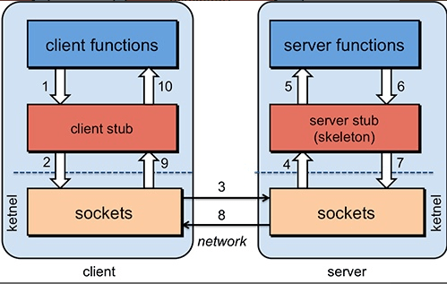

> 摘要：分布式、Spring Cloud 微服务、高并发高性能、高可用。

<!-- more -->

---

## 分布式

分布式或者说 SOA 分布式：不同模块部署在不同服务器上。就是把整个系统拆分成不同的服务、然后放在不同的服务器上减轻单体服务的压力、提高并发量和性能。

- 如电商系统可简单地拆分成订单系统、商品系统、登录系统等，如果某个服务的访问量较大的话、也可同时部署在多台机器上。

### CAP 定理和 BASE 理论

> ACID 是数据库事务完整性的理论，CAP 是分布式系统设计理论，BASE 是 CAP 理论中 AP 方案的延伸。

CAP 定理：对于一个分布式系统来说，（当设计读写操作时），只能同时满足CAP中的两个。

1. Consistency（一致性）：所有节点访问同一份最新的数据副本。
2. Availability（可用性）：非故障的节点在合理的时间内返回合理（不是错误或超时）的响应。
3. Partition Tolerance（分区容错性）：分布式系统出现**网络分区**时，仍能对外提供服务。
   - 网络分区：分布式系统中，因故障（某些网络节点间不再连通），整个网络分成几块区域。
   - （绝大部分时候），网络分区是正常的，即不需保证 P 时，C 和 A 能同时保证。
   - 当发生网络分区时，如果要继续对外提供服务，那么强一致性和可用性只能 2 选 1。即，分区容错性 P 是一定要满足的，在此基础上，只能满足：
     - 可用性 A（**AP架构**，如Cassandra、Eureka尤瑞卡）
       - Eureka 中不存在 Leader 节点，每个节点都是一样的、平等的。保证即使大部分节点挂掉也不会影响正常提供服务，只要有一个节点可用就行，不过这个节点上的数据可能并不是最新的。
     - 或一致性 C（CP架构，如 ZooKeeper、HBase），用于需确保强一致性的场景，如银行；
       - 任何时刻对 ZooKeeper 的读请求都能得到一致性的结果，但不保证每次请求的可用性，如在 Leader 选举过程中或半数以上的机器不可用时，服务就是不可用的。
   - Nacos 支持 CP 和 AP 架构 。
   - 不可能兼顾选择 CA 架构，如：若系统出现分区，某个节点在进行写操作
     - 为了保证 C， 必须要禁止其他节点的读写操作，这和 A 冲突。
     - 为了保证 A，其他节点的读写操作正常的话，和 C 冲突。

BASE核心思想：即使无法做到强一致性，但每个应用都可根据自身业务特点，采用适当的方式来使系统达到最终一致性。即，牺牲数据的一致性来满足系统的高可用性，系统中一部分数据不可用或不一致时，仍需保持系统整体“主要可用”。

来源于对大规模互联网系统分布式实践的总结，本质上是对 CAP 中 AP 方案的延伸和补充：AP 方案只是在系统发生分区时放弃一致性，而不是永远放弃一致性。在分区故障恢复后，系统应达到最终一致性。

- Basically Available（基本可用） ：是指分布式系统在出现不可预知故障时，允许损失部分可用性。
  - 响应时间上的损失：正常情况下，处理用户请求需 0.5s 返回结果，但由于系统出现故障，变为 3 s。
  - 系统功能上的损失：正常情况下，用户可用系统的全部功能，但由于系统访问量剧增，系统的部分非核心功能无法使用。
- Soft-state（软状态） ：允许系统中的数据存在中间状态（CAP 理论中的数据不一致），且不会影响系统的整体可用性，即允许系统在不同节点的数据副本间进行数据同步的过程存在延时。
- Eventually Consistent（最终一致性）：强调的是系统中所有的数据副本、在经过一段时间的同步后，最终能达到一致的状态。本质是保证最终数据能达到一致，而不需实时保证。

最终一致性的具体方式是：

- 读时修复 : 在读取数据时，检测数据的不一致，进行修复。如 Cassandra 的 Read Repair 实现，具体来说，在向 Cassandra 系统查询数据时，如果检测到不同节点的副本数据不一致，系统就自动修复数据。
- **写时修复** : 在写入数据，检测数据的不一致时，进行修复。如 Cassandra 的 Hinted Handoff 实现。具体来说，Cassandra 集群的节点间远程写数据的时候，如果写失败就将数据缓存下来，然后定时重传，修复数据的不一致性。推荐，对性能消耗较低。
- 异步修复 : 最常用的方式，通过定时对账检测副本数据的一致性，并修复。

### Paxos 算法和 Raft 算法

Paxos 算法是一种解决分布式系统一致性的经典算法 ，但非常难理解和实现。不是一致性算法、而是共识算法。

- Basic Paxos 算法： 描述的是多节点间如何就某个值（提案 Value）达成共识。存在 3 个重要的角色：
  1. **提议者（Proposer）**：也叫协调者（coordinator），负责接受客户端发起的提议，然后尝试让接受者接受，同时保证即使多个提议间产生了冲突，算法也能进行下去；
  2. **接受者（Acceptor）**：也叫投票员（voter），负责对提议者的提议投票，同时需记住自己的投票历史；
  3. **学习者（Learner）**：如果有超过半数接受者就某个提议达成了共识，那么学习者就需接受这个提议，作出运算、并将结果返回给客户端。
  
  
  
- Multi-Paxos **思想**： 核心是通过多个 Basic Paxos 实例，就一系列值达成共识。
  - 针对没有恶意节点的情况，Raft 算法、ZAB 协议、 Fast Paxos 算法都是基于 Paxos 算法改进而来；
    - Raft 算法是更易理解和实现的分布式一致性算法，是Multi-Paxos的变种。
    - [Raft 算法解读](https://github.com/Snailclimb/JavaGuide/blob/main/docs/distributed-system/theorem&algorithm&protocol/raft-algorithm.md)
  - 针对存在恶意节点的情况，一般用工作量证明（POW，Proof-of-Work）、权益证明（PoS，Proof-of-Stake ）等**共识算法**。最典型应用就是区块链，需解决的核心问题是 **拜占庭将军问题**。

共识是可容错系统中的一个基本问题：即使面对故障，服务器也可在共享状态上达成一致。

共识算法：允许一组节点像整体一样一起工作，即使其中的一些节点出现故障也能继续工作下去，其正确性主要是源于复制状态机的性质：一组`Server`的状态机计算相同状态的副本，即使有一部分的`Server`宕机了仍能继续运行。

### API 网关

是随着微服务（Microservice）概念兴起的一种架构模式。微服务背景下，一个系统被拆分为多个服务，但每个服务都需要一些重复功能，且没有一个全局的视图来统一管理。

网关：主要用于请求转发、安全认证（身份/权限认证）、协议转换、流量控制、负载均衡、容灾、日志、监控等功能。实际上，主要做了一件事：**请求过滤** 。

常见网关系统：

- Netflix Zuul：主要通过过滤器（类似于 AOP）来过滤请求，实现网关的各种功能。 

- Spring Cloud Gateway：推荐
- Kong ：基于 Nginx 与 Lua 的高性能 Web 平台，内部集成了大量精良的 Lua 库、第三方模块以及大多数的依赖项。用于方便地搭建能处理超高并发、扩展性极高的动态 Web 应用、Web 服务和动态网关。
- APISIX：基于 Nginx 和 etcd 的高性能、云原生、可扩展的网关系统。与传统 API 网关相比，有动态路由和插件热加载，特别适合微服务系统下的 API 管理。并且与 SkyWalking（分布式链路追踪系统）、Zipkin（分布式链路追踪系统）、Prometheus（监控系统） 等 DevOps 生态工具对接都十分方便。
- Shenyu：基于 WebFlux 的可扩展、高性能、响应式网关，Apache 顶级开源项目。
- [百亿规模API网关服务Shepherd的设计与实现](https://tech.meituan.com/2021/05/20/shepherd-api-gateway.html)

### 配置中心

### RPC 框架

RPC（Remote Procedure Call） 即远程过程调用。

优点：通过 RPC 可调用远程计算机上某个服务的方法，像调用本地方法一样简单。

- 两个不同服务器上提供的方法不在同一个内存空间，通过网络编程才能传递参数、接收结果，需考虑底层传输方式（TCP还是UDP）、序列化方式等方面。

##### RPC 原理

1. 客户端（client，服务消费端）：以本地调用的方式调用远程服务；
2. 客户端 Stub（桩） ： 就是代理类。接收到调用后，（序列化）负责将方法、参数等组装成能进行网络传输的消息体：`RpcRequest`；
3. 网络传输 ： 找到远程服务的地址，并将消息发送到服务提供端，执行完后再把返回结果通过网络传输回来。实现方式有多种，如最基本的 Socket、或性能及封装更优秀的 **Netty**（推荐）；
4. 服务端 Stub（桩） ：收到请求后、将消息反序列化为Java对象；根据`RpcRequest`中的类、方法、方法参数等信息调用本地的方法，将执行结果组装成能进行网络传输的消息体，发送至消费方；
5. 服务端（服务提供端） ：接收到消息并将消息反序列化为Java对象:`RpcResponse` ，得到最终结果。

##### Dubbo

是一款国产的 RPC 框架，由阿里开源。不光可调用远程服务，还提供了一些其他开箱即用的功能、如智能负载均衡。

##### Netty

##### gRPC

##### Spring Cloud

##### NIO 框架：非常火

### 分布式中间件

ZooKeeper、Etcd、Consul 等

### 分布式 id

分布式 ID 是分布式系统下的 ID。如，分库后， 数据遍布在不同服务器上的数据库，为不同的数据节点生成全局唯一自增主键。

需满足：

- 全局唯一；
- 高性能： 生成速度快，对本地资源消耗小。
- 高可用：生成分布式 ID 的服务要保证可用性无限接近于 100%。
- 方便易用：拿来即用，使用方便，快速接入。
- 安全：不包含敏感信息。
- 有序递增：可提升数据库写入速度，可能会直接通过 ID 来进行排序。
- 有具体的业务含义：让定位问题及开发更透明化（通过 ID 就能确定是哪个业务）。
- 独立部署：单独有一个发号器服务，专门用来生成分布式 ID。

常见解决方案：

- 数据库主键自增；
- 数据库号段模式；
- NoSQL 方案：Redis、MongoDB。

开源框架：

- UidGenerator(百度)：基于 Snowflake(雪花算法)；
- Leaf(美团)
- Tinyid(滴滴)
- ZooKeeper 这类中间件也可生成唯一 ID

### 分布式事务

分布式事务：指事务的参与者、支持事务的服务器、资源服务器及事务管理器分别位于不同的分布式系统的不同节点上。

简单的说，就是一次大的操作由不同的小操作组成，分布在不同的服务器上，且属于不同的应用。分布式事务需保证这些小操作要么全部成功，要么全部失败。本质上，就是为了保证不同数据库的数据一致性。

### 分布式协调

Zoopkeeper

1. ZooKeeper 可被用作注册中心、分布式锁；
2. ZooKeeper 是 Hadoop 生态系统的一员；
3. 构建 ZooKeeper 集群时，使用的服务器最好是奇数台。

Zoopkeeper：是一个开源的分布式协调服务，设计目标是将复杂且容易出错的分布式一致性服务封装起来，构成一个高效可靠的原语集，并以一系列简单易用的接口提供给用户使用。

另外，ZooKeeper 将数据保存在内存中，在“读”多于“写”（协调服务的典型场景）中尤其地高性能，因为写会导致所有的服务器间同步状态。

特点：

- 顺序一致性： 
- 原子性**：** 
- 单一系统映像 ：
- 可靠性： 

提供了高可用、高性能、稳定的分布式数据一致性解决方案，通常被用于实现诸如分布式锁、命名服务、数据发布/订阅，负载均衡、分布式协调/通知、集群管理、Master 选举和分布式队列等功能。

典型的应用场景：

1. 分布式锁 ： 通过创建唯一节点获得分布式锁，当获得锁的一方执行完相关代码或挂掉后就释放锁。
2. 命名服务 ：通过 ZooKeeper 的顺序节点生成全局唯一 ID。
3. 数据发布/订阅 ：通过 **Watcher 机制** 可很方便地实现数据发布/订阅。当将数据发布到 ZooKeeper 被监听的节点上，其他机器可通过监听 ZooKeeper 上节点的变化来实现配置的动态更新。

### 分布式搜索引擎

ElasticSearch

Solr

## 高并发 / 高性能

### 消息队列

消息队列（Message Queue ）：是存放消息的容器，当需使用消息时，直接从容器中取出消息使用。

##### 带来的好处

1. **异步**：通过异步处理提高系统性能（减少响应所需时间）：如用户提交订单。
2. **削峰**/限流：先将短时间高并发产生的事务消息存储在消息队列中，然后后端服务再慢慢（根据自己的能力）去消费这些消息，避免直接把后端服务打垮；如秒杀、促销活动。
3. **解耦**：降低系统耦合性（提升可扩展性）：发布-订阅模式中，生产者发布消息；消费者订阅主题，从消息队列拉取消息并消费（进行后续处理），不需知道消息来源。

##### 引入 MQ 后缺点

1. 系统可用性降低： 需考虑消息丢失、或 MQ 挂掉等情况；
2. 系统复杂性提高： 需解决消息重复消费、消息传递顺序、分布式事务、消息堆积、消息丢失，需考虑高可用、集群等；
3. 一致性问题：真正消费者没有正确消费消息、导致数据不一致。

##### JMS 消息模型 VS AMQP

**JMS**（JAVA Message Service，Java 消息服务）：JMS 的客户端间可通过 JMS 服务进行异步的消息传输。ActiveMQ 就是基于 JMS 规范实现的。

JMS 的两种**消息模型**：

- 队列模型、点到点（Peer-2-Peer）模型：用**队列**作为消息通信载体；满足生产者与消费者模式，一条消息只能被一个消费者使用，未被消费的消息在队列中保留直到被消费或超时。
- 发布/订阅（Pub/Sub）模型、主题模型：使用**主题**作为消息通信载体，类似于广播模式；
  - 消息的生产者称为发布者（Publisher） ，消息的消费者称为订阅者（Subscriber)），存放消息的容器称为主题（Topic)）。
  - 其中，发布者将消息发送到指定主题中，订阅者需提前订阅主题才能接受特定主题的消息（在一条消息广播后才订阅的用户收不到该条消息）。
  - 对于主题模型的实现每个消息中间件的底层设计都不一样，如 `Kafka` 中的 分区 ，`RocketMQ` 中的 队列，`RabbitMQ` 中的 `Exchange` 。观察者模式。

JMS 定义的五种不同的消息正文格式及调用的消息类型，允许发送并接收一些不同形式的数据，提供现有消息格式的一些级别的兼容性。

- StreamMessage：Java 原始值的数据流
- MapMessage：一套名称-值对
- TextMessage：一个字符串对象
- ObjectMessage：一个序列化的 Java 对象
- BytesMessage：一个字节的数据流

**AMQP**（Advanced Message Queuing Protocol 高级消息队列协议）：提供统一消息服务的应用层标准（二进制应用层协议），面向消息的中间件设计，兼容 JMS。有跨平台、跨语言特性。RabbitMQ 就是基于 AMQP 协议实现的。

#### RabbitMQ

基于 AMQP 协议实现的消息中间件，RabbitMQ 整体上是一个~~生产者与消费者模型~~，主要负责接收、存储和转发消息。默认端口是15672。

##### 消息组成部分

- 消息头：也可称为标签 Label，由一系列的可选属性组成，包括 routing-key（路由键，用来指定这个消息的路由规则，需与交换器类型和绑定键(BindingKey)联合使用才能最终生效）、priority（相对于其他消息的优先权）、delivery-mode（指出该消息可能需持久性存储）等；
-  消息体：也可称为 payLoad，不透明。

##### 生产者与消费者模型

- Producer（消息生产者）、Consumer（消息消费者）：生产者把消息交由 RabbitMQ  后，RabbitMQ 会根据消息头把消息发送给感兴趣的消费者。

- Exchange（交换器）：用来接收生产者发送的消息、并将这些消息路由（分配）给服务器对应的 Queue  中。如果路由不到，会返回给生产者、或直接丢弃 。有4种 Exchange Types（交换器类型），对应着不同的路由（转发消息）策略：
  1. direct（默认）：把消息路由到那些 Bindingkey 与 RoutingKey 完全匹配的 Queue 中。常用在处理有优先级的任务，根据任务的优先级把消息发送到对应的队列，这样可指派更多的资源去处理高优先级的队列。
  2. fanout：把所有（发送到该Exchange的）消息路由到所有与它绑定的Queue中，不需做任何判断操作，所以速度最快。常用来广播消息。
  3. topic：与 direct 类型相似，但匹配规则有些不同
  4. ~~headers~~：不推荐，不依赖于路由键的匹配规则来路由消息，而是根据发送的消息内容中的 headers 属性进行匹配。性能很差，也不实用，基本上不用。
- RabbitMQ 中通过 Binding(绑定) 将 Exchange(交换器) 与 Queue 关联起来，绑定时指定一个 BindingKey(绑定建) ，这样 RabbitMQ 就知道如何正确将消息路由到队列。一个绑定就是基于路由键将交换器和消息队列连接起来的路由规则，所以可将交换器理解成一个由绑定构成的路由表。绑定可是多对多的关系。
- Queue（消息队列)）：用来保存消息直到发送给消费者。是消息的容器，也是消息的终点。一个消息可投入一个或多个队列。消息一直在队列里面，等待消费者连接到这个队列将其取走。 RabbitMQ 的生产者生产消息并最终投递到队列中，消费者可从队列中获取消息并消费。
  - RabbitMQ 中消息只能存储在 **队列** 中，这和 Kafka 这种消息中间件相反。Kafka 将消息存储在 topic 这个逻辑层面，而相对应的队列逻辑只是topic实际存储文件中的位移标识。
  - 多个消费者可订阅同一个队列，队列中的消息会被平均分摊（Round-Robin，即轮询）给多个消费者进行处理，~~而不是每个消费者都收到所有的消息并处理，~~避免消息被重复消费。
  - RabbitMQ 不支持队列层面的广播消费。
- Broker（消息中间件的服务节点）：可简单地看作一个 RabbitMQ服务实例（服务器）。

#### RocketMQ

阿里开源的一个**队列模型**的消息中间件，有高性能、高吞吐量、高可靠、高实时、分布式的特点。

##### 消息模型

`RocketMQ` 通过在一个 `Topic` 中配置多个队列、且每个队列维护每个消费者组的消费位置 实现了主题模式/发布订阅模式 。

- `Producer Group` 生产者组： 代表某一类的生产者，如多个秒杀系统合在一起，一般生产相同的消息。生产消息后指定主题中的某个队列发送消息。
- `Consumer Group` 消费者组： 代表某一类的消费者，如多个短信系统合在一起，一般消费相同的消息。每个消费组在每个队列上维护一个消费位移 。
- `Topic` 主题： 代表一类消息，如订单消息，物流消息等。一个主题中需要维护多个队列，提高并发能力。

##### 技术架构中有四大角色

- `Producer` 、`Consumer`
- `Broker`：主要负责消息的存储、投递和查询及服务高可用保证（用多个 `Broker` 来保证负载均衡）。即，消息队列服务器，生产者生产消息到 `Broker` ，消费者从 `Broker` 拉取消息并消费。一个 `Topic` 分布在多个 `Broker`上，一个 `Broker` 可配置多个 `Topic` ，是多对多的关系。

-  `NameServer` 注册中心：主要提供两个功能：Broker管理 和 路由信息管理 。`Broker` 会将路由表注册到 `NameServer` 中，消费者和生产者就从中获取路由表、然后照着路由表的信息和对应的 `Broker` 进行通信。如`ZooKeeper` 和 `Spring Cloud` 中的 `Eureka` 。

##### 如何解决消费问题

- 顺序消费：将同一语义下的消息放入同一个队列，如用 Hash取模法保证同一个订单在同一个队列中。
  - `RocketMQ` 在主题上是无序的、只有在队列层面才保证有序 。
  - 普通顺序 和 严格顺序
- 重复消费：幂等操作，即任意多次执行所产生的影响均与一次执行的影响相同。具体实现可用：
  - 写入 `Redis`：因为 `Redis` 的 `key` 和 `value` 是天然支持幂等的；
  - 数据库插入法：基于唯一键来保证不会插入重复数据。
- 分布式事务：事务消息加上事务反查机制。
- 消息堆积：指峰值太大导致消息堆积在队列中。限流降级（削峰）
- 回溯消费：指 `Consumer` 已消费成功的消息，由于业务需重新消费。

##### 刷盘机制

在单个结点层面：

- 同步刷盘：需等待一个刷盘成功的 `ACK` ，对 `MQ` 消息可靠性来说是一种不错的保障，但性能上会有较大影响 ，一般适用于金融等特定业务场景；

- 异步刷盘：往往是开启一个线程去异步地执行刷盘操作。采用后台异步线程提交的方式进行， 降低了读写延迟 ，提高了 `MQ` 的性能和吞吐量，一般适用于如发验证码等对于消息保证要求不太高的业务场景。

 `Borker` 主从模式下，主节点返回消息给客户端时是否需同步从节点：

- 同步复制： 也叫 “同步双写”，即，只有消息同步双写到主从节点上时才返回写入成功 ；
- 异步复制： 消息写入主节点后就直接返回写入成功 。

存储机制：

在 `Topic` 中的 队列是以什么样的形式存在？

队列中的消息又是如何进行存储持久化？

#### Kafka

一种分布式的，基于**发布 / 订阅模型**的消息系统；熟悉Redis、Kafka等大数据组件。

Kafka 是一个分布式流式处理平台。流平台有三个关键功能：

1. 消息队列：发布和订阅消息流，类似于消息队列。
2. 容错的持久方式存储记录消息流： Kafka 会把消息持久化到磁盘，有效避免了消息丢失的风险。
3. 流式处理平台： 在消息发布时进行处理，Kafka 提供了一个完整的流式处理类库。

主要有两大应用场景：

1. 消息队列：建立实时流数据管道，以可靠地在系统或应用程序间获取数据。
2. 数据处理：构建实时的流数据处理程序来转换或处理数据流。

##### 消息模型

与RocketMQ 的消息模型基本一样，唯一的区别是没有队列这个概念，对应的是 Partition（分区）。默认端口 9090，producer、consumer 9092？

- Producer、Consumer

- Broker（代理）： 可看作是一个独立的 Kafka 实例。

- Topic

- Partition：属于 Topic 的一部分。一个 Topic 可有多个 Partition ，且同一 Topic 下的 Partition 可分布在不同的 Broker 上，表明一个 Topic 可横跨多个 Broker 。实际上可对应成为消息队列中的队列。

##### 多副本（Replica）机制

分区（Partition）中的多个副本间有一个 leader，其他副本称为 follower。发送的消息会被发送到 leader 副本，然后 follower 副本才能从 leader 中拉取消息进行同步。

##### Zookeeper 在 Kafka 中的作用

1. Broker 注册
2. Topic 注册
3. 负载均衡

##### 消息的消费顺序问题

1. 1 个 Topic 只对应一个 Partition；
2. （推荐）发送消息时指定 key/Partition。

##### 消息丢失问题

- 生产者调用`send`方法发送消息后，可能因网络问题并没有发送过去：为 Producer 的`retries `（重试次数）设置一个合理值，自动重试消息发送；
- 消费者刚拿到消息准备进行真正消费时，突然挂掉，实际上并没有被消费，但 offset 却被自动提交：手动关闭自动提交 offset，每次在真正消费完消息后再手动提交 offset ；
- Kafka 弄丢了消息

##### 消息重复消费问题

服务端侧已消费的数据没有成功提交 offset。

- 消费消息服务做幂等校验，如 Redis 的set、MySQL 的主键等天然的幂等功能。最有效。
- 将`enable.auto.commit`参数设置为 false，关闭自动提交，拉取到消息、手动提交 offset。

### 读写分离

主要是为了将数据库的读和写操作分散到不同的数据库节点上。主服务器负责写，从服务器负责读，主从库间会进行数据同步，通常一主多从。可大幅提高读性能，小幅提高写的性能。因此更适合单机并发读、写少读多请求较多的场景。

##### 主从同步延迟问题

1. 强制将读请求路由到主库处理；如 `Sharding-JDBC`。
2. 延迟读取。

##### 实现读写分离

步骤：

1. 部署多台数据库，选择其中的一台作为主数据库，其他的一台或多台作为从数据库。
2. 主从复制原理：保证主从数据库间的数据实时同步。
3. 将写请求交给主数据库处理，读请求交给从数据库处理。

常用方式：

1. 代理方式：代理层负责分离读写请求，路由到对应的数据库中。提供类似功能的中间件有 MySQL Router（官方）、Atlas（基于 MySQL Proxy）、Maxscale、MyCat。
2. 组件方式：引入第三方组件来帮助读写请求，推荐用 `sharding-jdbc`。

### 分库分表

读写分离：同一个数据库中的表分布在了不同的数据库中。主要应对的是数据库读并发，没有解决数据库存储压力问题。

分库分表：为了解决由于库、表数据量过大导致数据库性能持续下降的问题。

##### 场景

- 单表的数据达到千万级别以上，数据库读写速度较缓慢（分表）。
- 数据库中的数据占用的空间越来越大，备份时间越来越长（分库）。
- 应用的并发量太大（分库）。

##### 带来的问题

- join 操作： 无法使用 join 操作，需手动进行数据封装。如你在一个数据库中查询到数据后，再根据这个数据去另一个数据库中找对应的数据。
- 事务问题：单个操作涉及到多个数据库，数据库自带事务无法满足要求。
- 分布式 id：数据库的自增主键不满足生成的主键唯一。

##### 常见的分库分表工具

- `Sharding-Sphere` 项目：当当，包括 Sharding-JDBC、Sharding-Proxy 和 Sharding-Sidecar；
  - `sharding-jdbc`：推荐首选，是一款轻量级 `Java` 框架，以 `jar` 包形式提供服务，不需做额外运维，且兼容性很好。
- `MyCAT`（基于 Cobar）
- `TSharding`（蘑菇街）
- `Cobar`（阿里巴巴）

### 负载均衡

负载均衡系统：通常用于将任务（如用户请求处理）分配到多个服务器处理以提高网站、应用或数据库的性能和可靠性。

常见的负载均衡系统：

1. DNS 负载均衡：一般用来实现地理级别的均衡。
2. 硬件负载均衡： 通过单独的硬件设备（如 F5 ）来实现负载均衡功能（硬件价格一般很贵）。
3. 软件负载均衡：通过负载均衡软件（如 Nginx ）来实现负载均衡功能。

Ribbon
Feign

## 高可用

高可用：系统在大部分时间（即使发生硬件故障、或系统升级时）都是可用的、可提供服务的。

导致系统不可用的情况：

1. 黑客攻击；
2. 硬件故障，如服务器坏掉。
3. 并发量/用户请求量激增导致整个服务宕掉或部分服务不可用。
4. 代码中的bug导致内存泄漏或其他问题导致程序挂掉。
5. 网站架构某个重要的角色如 Nginx 或数据库突然不可用。
6. 自然灾害或人为破坏。

提高系统可用性的方法：

1. 注重代码质量，测试严格把关：code review 解决内存泄漏、循环依赖。
2. 使用集群：相同的服务部署多份，减少单点故障。
   - 灾备设计
     - 容灾： 在异地建立两个完全相同的系统。当某个地方的系统突然挂掉，整个应用系统可切换到另一个，系统就可正常提供服务。
     - 备份： 所有重要数据多备份几份。
   - 异地多活：将服务部署在异地、且同时对外提供服务。和传统灾备设计最主要区别在于“多活”，即所有站点都是同时在对外提供服务的。为了应对突发状况如火灾、地震等自然或人为灾害。
3. 限流：流量控制（flow control），限制对服务端接口接受请求的频率，防止服务挂掉。对超过限制的请求放弃处理或放到队列中（排队）等待处理。可有效应对突发请求过多。常见限流算法：
   1. 固定窗口计数器算法
   2. 滑动窗口计数器算法
   3. 漏桶算法
   4. 令牌桶算法
4. 降级：当服务器压力剧增的情况下，根据当前业务情况及流量对一些服务和页面有策略的降级，以此释放服务器资源以保证核心任务的正常运行。目的在于应对系统自身的故障。
6. 熔断机制：系统自动收集所依赖服务的资源使用情况和性能指标，当恶化或调用失败次数达到某个阈值时就迅速失败，立即切换依赖其他备用服务。目的在于应对依赖的外部系统或第三方系统的故障。
   - 常用的流量控制和熔断降级框架是 Netflix 的 Hystrix 和 alibaba 的 Sentinel。
7. 超时和重试机制：一旦用户的请求超过某个时间得不到响应、就结束此次请求并抛出异常。尤其适合读取第三方服务时，如 RPC 框架自带。
7. 异步调用：在程序中实现异步，还可使用[消息队列](#消息队列)。
8. 使用缓存：缓存热点数据，存储在内存中，所以速度相当快。
9. 灰度发布： 将服务器集群分成若干部分，每天只发布一部分机器，观察运行稳定没有故障，第二天继续发布一部分机器，持续几天才把整个集群全部发布完毕。期间如果发现问题，只需要回滚已发布的一部分服务器即可。

## 微服务

### SpringCloud

SpringCloud应用也属于SpringBoot应用的一种

