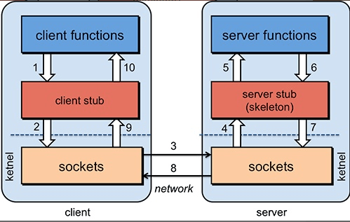
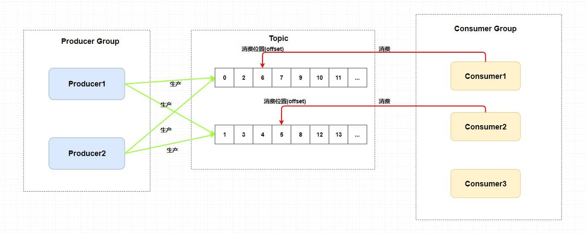

> 摘要：分布式、高并发/高性能、高可用、Spring Cloud 微服务等。
>
> 高并发编程、等各类中间件的常见问题诊断和优化技术。

<!-- more -->

---

## 目录

[TOC]

## 分布式

### 分布式、微服务、中间件

> 没有统一定义，资料上的说法不一致，我的理解是。

#### 分布式

分布式、SOA 分布式：**不同模块**部署在不同服务器上。就是把整个系统**拆分**成不同的服务、然后放在不同的服务器上减轻单体服务的压力、提高并发量和性能。

- 如电商系统可简单地拆分成订单系统、商品系统、登录系统等，如果某个服务的访问量较大的话、也可同时部署在多台机器上。

#### 微服务

微服务：一种软件开发技术- 面向服务的体系结构（SOA）架构样式的一种变体，它提倡将单一应用程序划分成一组小的服务，服务之间互相协调、互相配合，为用户提供最终价值。

每个服务运行在其独立的进程中，服务与服务间采用轻量级的通信机制互相沟通（通常是基于HTTP的RESTful API）。

每个服务都围绕着具体业务进行构建，并且能够独立地部署到生产环境、类生产环境等。

另外，应尽量避免统一的、集中式的服务管理机制，对具体的一个服务务而言，应根据上下文，选择合适的语言、工具对其进行构建。

#### 中间件

> **中间件**、中介层维基：是一类提供系统软件和应用软件之间**连接**、便于软件各部件之间的**沟通**的软件，应用软件可以借助中间件在**不同的技术架构**之间共享信息与资源。中间件位于客户机服务器的操作系统之上，管理着计算资源和网络通信。

**中间件**：是一种应用于**分布式系统**的基础软件，位于应用与操作系统、数据库之间，主要用于解决分布式环境下数据传输、数据访问、应用调度、系统构建和系统集成、流程管理等问题，是分布式环境下支撑应用开发、运行和集成的平台。

- 简单来说：中间件就是一类**为应用软件服务的软件**，应用软件是为用户服务的，用户不会接触或者使用到中间件。
- 中间件：是指介于两个不同系统之间的软件组件，它可以在两个系统之间传递、处理、转换数据，以达到协同工作的目的。

#### 它们的关系是什么样的？

- 分布式和中间件的关系可以简单理解为父与子的关系，分布式是父，中间件是子。
- 微服务和分布式的关系是一种演变关系，以先有鸡还是先有蛋的比喻来说，是先有微服务，再有分布式，很简单，因为分布式用到了微服务这种架构模式。

#### 常见分布式中间件

分布式：

1. API 网关：
2. 配置中心
3. **RPC 框架**：Dubbo、Motan、Thrift、grpc
4. 分布式 ID
5. **分布式事务**
6. 分布式链路追踪
7. 分布式 Session
8. 分布式日志：elasticsearch、logstash、Kibana 、redis、kafka

高并发 & 高性能：

1. **负载均衡**
2. CDN：GSLB 全局负载均衡；
3. **消息队列**：RabbitMQ、RocketMQ、Kafka；
4. 数据库**读写分离、分库分表**。

高可用：

1. 冗余：集群、灾备 & 多活；
2. **限流、降级、熔断**
3. 超时和重试机制

Spring Security 中的：

1. 认证和授权：JWT、OAuth2

### CAP 定理和 BASE 理论

> 分布式理论。
>
> ACID 是数据库事务完整性的理论，CAP 是分布式系统设计理论，BASE 是 CAP 理论中 AP 方案的延伸。

#### CAP 定理

CAP 定理：对于一个分布式系统来说，当设计读写操作时，只能同时满足CAP中的两个。

1. `Consistency`（**一致性**）：数据在多个副本之间能够保持一致。所有节点访问同一份最新的**数据副本**。
2. `Availability`（**可用性**）：每次请求（非故障的节点）在合理的时间内返回**非错**（不是错误或超时）**的响应**。
3. `Partition Tolerance`（**分区容错性**）：分布式系统出现**网络分区**故障时，仍能对外提供（满足一致性和可用性的）服务，除非整个网络环境都发生了故障。


网络分区：分布式系统中，因故障（某些网络节点间不再连通），整个网络分成几块孤立区域。对于**分布式系统**，分区是必然存在的。

- **CA 模型**：（绝大部分时候），网络分区是正常的，即不需保证 P 时，C 和 A 能同时保证。常见应用：
    1. 集群数据库
    2. xFS文件系统
- 当发生**网络分区**时，如果要继续对外提供服务，那么强一致性和可用性只能 2 选 1。即，**分区容错性 P** 是一定要满足的，在此基础上，只能满足其中一个：
    1. 可用性 A（**AP架构**，放弃 C 一致性，如`Cassandra`、`Eureka`尤瑞卡）。
        - 常见应用：Web缓存、DNS。
        - `Eureka` 注册中心中不存在 Leader 节点，**每个节点都是一样的**、平等的。保证即使大部分节点挂掉也不会影响正常提供服务，只要有一个节点可用就行，不过这个节点上的数据可能并**不是最新的**（不保证一致性 C）。
    2. 一致性 C（**CP架构**，放弃 A 可用性，如 `ZooKeeper`、`HBase`），用于需确保强一致性的场景，如银行。
        - 常见应用：分布式数据库、分布式锁。
        - 任何时刻对 `ZooKeeper` 注册中心的**读请求**都能得到一致性的结果，但不保证每次请求的可用性，如在 Leader 选举过程中或半数以上的机器不可用时，服务就是不可用的。

注意：

- 注册中心 `Nacos `同时支持 CP 和 AP 架构 。

##### **不可能兼顾**选择 CA 架构

如：若系统出现分区，某个节点在进行写操作

1. 为了保证一致性 C， 必须要禁止其他节点的**读写操作**，这和可用性 A 冲突。
2. 为了保证可用性 A，其他节点的**读写操作**正常的话，和一致性 C 冲突。

#### BASE 理论

**BASE 核心思想**：即使无法做到强一致性，但每个应用都可根据自身业务特点，采用适当的方式来使系统达到**最终一致性 E**。

- 即，牺牲数据的一致性来满足系统的**高可用性 AP**，系统中一部分数据不可用或不一致时，仍需保持系统整体“主要可用”。
- 来源于对大规模互联网系统分布式实践的总结，本质上是对 CAP 中 **AP 方案的延伸和补充**：AP 方案只是在系统发生分区时放弃一致性，而不是永远放弃一致性。在分区故障恢复后，系统应达到最终一致性。

BASE：

1. `Basically Available`（**BA 基本可用**） ：指分布式系统在出现不可预知故障时，**允许损失部分可用性**。
    - **响应时间**上的损失：正常情况下，处理用户请求需 0.5s 返回结果，但由于系统出现故障，变为 3 s。
    - **系统功能**上的降级：正常情况下，用户可用系统的全部功能，但由于系统访问量剧增，系统的部分**非核心功能**无法使用。
2. `Soft-state`（**S 软状态**） ：允许系统中的数据存在**中间状态**（CAP 理论中的数据不一致），且不会影响系统的整体可用性，即允许系统在不同节点的数据副本间进行数据同步的过程**存在延时**。
3. `Eventually Consistent`（**E 最终一致性**）：强调的是系统中所有的数据副本、在**经过一段时间的同步后**，最终能达到一致的状态。本质是保证最终数据能达到一致，而不需实时保证。

**最终一致性**的具体方式是：

1. **读时修复** : 在读取数据时，检测数据的不一致，进行修复。如 Cassandra 的 Read Repair 实现，具体来说，在向 Cassandra 系统查询数据时，如果检测到不同节点的副本数据不一致，系统就自动修复数据。
2. **写时修复** : 在写入数据，检测数据的不一致时，进行修复。如 Cassandra 的 Hinted Handoff 实现。具体来说，Cassandra 集群的节点间远程写数据的时候，**如果写失败**就将数据缓存下来，然后定时重传，修复数据的不一致性。推荐，对性能消耗较低。
3. **异步修复** : 最常用的方式，通过定时对账检测副本数据的一致性，并修复。

### Paxos 算法和 Raft 算法

> 分布式算法。

#### Basic Paxos 算法

Paxos 算法：**基于消息传递** 且具有 **高效容错特性** 的一致性算法，目前公认的解决 **分布式一致性问题** 最有效的经典算法之一。但非常难理解和实现。不是一致性算法、而是共识算法。

-  描述的是多节点间如何就某个值（提案 Value）达成共识。

Paxos 算法存在 3 个重要的角色：

1. **提议者（Proposer）**：也叫协调者（coordinator），提议者提出提案，用于投票表决。
    - 负责接受**客户端**发起的提议，然后尝试让接受者接受（**达成共识**），同时保证即使多个提议间产生了冲突，算法也能进行下去。
2. **接受者（Acceptor）**：也叫投票员（voter），负责对提议者的提议投票，并接受达成共识的提案。
    - 同时需记住自己的投票历史；向学习者**通知结果**。
3. **学习者（Learner）**：被告知投票的结果，接受达成共识的提案。
    - 如果有超过半数接受者就某个提议达成了共识，那么学习者就需接受这个提议，**处理请求**，作出运算、并将结果返回给客户端。


缺点：假如有多个提议者互不相让，那么就可能导致整个提议的过程进入了死循环。

因此，引入了 Multi Paxos 的算法思想。

#### Multi-Paxos 思想

Multi-Paxos **思想**： 在多个提议者的情况下，选出一个Leader（领导者），由领导者作为唯一的提议者，这样就可以解决提议者冲突的问题。核心是通过多个 Basic Paxos 实例，就一系列值达成共识。

1. 针对没有恶意节点的情况，**Raft 算法**、ZAB 协议、 Fast Paxos 算法都是基于 Paxos 算法改进而来；
    - **Raft 算法**是更易理解和实现的分布式一致性算法，是Multi-Paxos的变种。
2. 针对存在恶意节点的情况，一般用工作量证明（POW，Proof-of-Work）、权益证明（PoS，Proof-of-Stake ）等**共识算法**。最典型应用就是区块链，需解决的核心问题是 **拜占庭将军问题**。
    - 共识是可容错系统中的一个基本问题：即使面对故障，服务器也可在共享状态上达成一致。
    - **共识算法**：允许一组节点像整体一样一起工作，即使其中的一些节点出现故障也能继续工作下去。其正确性主要是源于**复制状态机的性质**：一组`Server`的状态机计算相同状态的副本，即使有一部分的`Server`宕机了仍能继续运行。

#### Raft 算法

`Raft` 是一个 **易于理解的一致性算法**。过程如同选举一样，**参选者** 需要说服 **大多数选民** (Server) 投票给他，一旦选定后就跟随其操作。

- 和 `Paxos` 目标相同，都是为了实现 **一致性** 产生的。`Paxos` 和 `Raft` 的区别在于选举的 **具体过程** 不同。

`Raft` 协议将 `Server` 进程分为三种角色：

1. **Leader（领导者）**：领导者由跟随者投票选出。
2. **Follower（跟随者）**：刚开始没有 **领导者**，所有集群中的 **参与者** 都是 **跟随者**。
3. **Candidate（候选人）**

Raft算法的工作流程：

1. 首先开启一轮大选。在大选期间 **所有跟随者** 都能参与竞选，这时所有跟随者的角色就变成了 **候选人**，民主投票选出领袖后就开始了这届领袖的任期；
2. 然后选举结束，所有除 **领导者** 的 **候选人** 又变回 **跟随者** 服从领导者领导。


[Raft 算法解读](https://github.com/Snailclimb/JavaGuide/blob/main/docs/distributed-system/theorem&algorithm&protocol/raft-algorithm.md)

### API 网关

是随着微服务（Microservice）概念兴起的一种架构模式。微服务背景下，一个系统被**拆分为多个服务**，但每个服务都需要一些重复功能，且没有一个全局的视图来统一管理。

**网关**：主要用于请求转发、安全认证（身份/权限认证）、协议转换、流量控制、负载均衡、容灾、日志、监控等功能。实际上，主要做了一件事：**请求过滤** 。同一入口，统一校验，统一分发。

有哪些**常见的网关系统**？

1. Netflix Zuul：主要通过过滤器（类似于 AOP）来过滤请求，实现网关的各种功能。 

2. Spring Cloud Gateway：推荐
3. Kong ：基于 Nginx 与 Lua 的高性能 Web 平台，内部集成了大量精良的 Lua 库、第三方模块以及大多数的依赖项。用于方便地搭建能处理超高并发、扩展性极高的动态 Web 应用、Web 服务和动态网关。
4. APISIX：基于 Nginx 和 etcd 的高性能、云原生、可扩展的网关系统。与传统 API 网关相比，有动态路由和插件热加载，特别适合微服务系统下的 API 管理。并且与 SkyWalking（分布式链路追踪系统）、Zipkin（分布式链路追踪系统）、Prometheus（监控系统） 等 DevOps 生态工具对接都十分方便。
5. Shenyu：基于 WebFlux 的可扩展、高性能、响应式网关，Apache 顶级开源项目。
6. [百亿规模API网关服务Shepherd的设计与实现](https://tech.meituan.com/2021/05/20/shepherd-api-gateway.html)

### 服务注册与发现

Consul、ZooKeeper、etcd：提供服务注册、发现和配置管理，用于构建微服务架构、服务发现和负载均衡。

### 配置中心

Config

Apollo

Nacos

### RPC 框架

RPC（Remote Procedure Call） 即远程过程调用。

优点：通过 RPC 可调用远程计算机上某个服务的方法，像调用本地方法一样简单。

- 两个不同服务器上提供的方法不在同一个内存空间，通过**网络编程**才能传递参数、接收结果，需考虑底层传输方式（TCP还是UDP）、序列化方式等方面。

#### RPC 原理

1. 客户端（client，服务消费端）：以本地调用的方式调用远程服务；
2. 客户端 Stub（桩） ： 就是代理类。接收到调用后，负责（序列化）将方法、参数等组装成能进行网络传输的消息体：`RpcRequest`；
3. 网络传输 ： 找到远程服务的地址，并将消息发送到**服务提供端**，执行完后再把返回结果通过网络传输回来。实现方式有多种，如最基本的 Socket、或性能及封装更优秀的 **Netty**（推荐）；
4. 服务端 Stub（桩） ：收到请求后、将消息**反序列化**为Java对象；根据`RpcRequest`中的类、方法、方法参数等信息调用本地的方法，将执行结果组装成能进行网络传输的消息体，发送回消费方；
5. 服务端（服务提供端） ：接收到消息并将消息**反序列化**为Java对象:`RpcResponse` ，得到最终结果。



#### Dubbo

是一款国产的 RPC 框架，由阿里开源。不光可调用远程服务，还提供了一些其他开箱即用的功能、如智能负载均衡。

#### Netty

#### gRPC

#### Spring Cloud

#### NIO 框架：非常火


### 分布式 ID

分布式 ID 是分布式系统下的 ID。如，分库后， 数据遍布在不同服务器上的数据库，为不同的数据节点生成**全局唯一**自增主键。

需满足：

- 全局唯一；
- 高性能： 生成速度快，对本地资源消耗小。
- **高可用（Availa’bility）**：生成分布式 ID 的服务要保证可用性无限接近于 100%。
- 方便易用：拿来即用，使用方便，快速接入。
- 安全：不包含敏感信息。
- 有序递增：可提升数据库写入速度，可能会直接通过 ID 来进行排序。
- 有具体的业务含义：让定位问题及开发更透明化（通过 ID 就能确定是哪个业务）。
- 独立部署：单独有一个发号器服务，专门用来生成分布式 ID。

常见解决方案：

- 数据库主键自增；
- 数据库号段模式；
- NoSQL 方案：Redis、MongoDB。

开源框架：

- UidGenerator(百度)：基于 Snowflake(雪花算法)；
- Leaf(美团)
- Tinyid(滴滴)
- ZooKeeper 这类中间件也可生成唯一 ID

### 分布式锁

锁：

- 对于单机多线程，在 Java 中，通常使用 `ReetrantLock` 这类 JDK 自带的 **本地锁** 来控制本地多个线程对本地共享资源的访问。
- 对于分布式系统，通常使用 **分布式锁** 来控制多个服务对共享资源的访问。

一个最基本的**分布式锁**需要满足：

1. **互斥** ：任意一个时刻，锁只能被一个线程持有；
2. **高可用** ：锁服务是高可用的。并且，即使客户端的释放锁的代码逻辑出现问题，锁最终一定还是会被释放，不会影响其他线程对共享资源的访问。

常见的分布式锁实现方案有三种：

1. MySQL 分布式锁
2. ZooKepper 分布式锁
3. Redis 分布式锁。Redis 用的要更多一点。

#### MySQL 分布式锁

MySQL分布式锁如何实现呢？

- 比较简单，就是创建一张锁表，数据库对字段作唯一性约束。

- 加锁的时候，在锁表中增加一条记录即可；释放锁的时候删除记录就行。

- 如果有并发请求同时提交到数据库，数据库会保证只有一个请求能够得到锁。

> 这种属于数据库 IO 操作，效率不高，而且频繁操作会增大数据库的开销，因此这种方式在高并发、高性能的场景中用的不多。

#### ZooKepper 分布式锁

ZooKeeper如何实现分布式锁？

ZooKeeper的数据节点和文件目录类似，例如有一个lock节点，在此节点下建立子节点是可以保证先后顺序的，即便是两个进程同时申请新建节点，也会按照先后顺序建立两个节点。

所以可以用此特性实现分布式锁。

1. 以某个资源为目录，然后这个目录下面的节点就是**需要获取锁的客户端**，每个服务在目录下创建节点，如果它的节点，序号在目录下最小，那么就获取到锁，否则等待。
2. 释放锁，就是删除服务创建的节点。

> ZK实际上是一个比较重的分布式组件，实际上应用没那么多了，所以用ZK实现分布式锁，其实相对也比较少。


#### Redis 分布式锁

> 基于 Redis Redis实现分布式锁，是当前应用最广泛的分布式锁实现方式。

Redis执行命令是**单线程**的，Redis实现分布式锁就是利用这个特性。

- 实现分布式锁最简单的一个命令：`setNx(set if not exist)`，如果不存在则更新：`setNx resourceName value`。

- 加锁了之后如果机器宕机，那这个锁就无法释放，所以需要加入过期时间。而且过期时间需要和setNx同一个原子操作，在Redis2.8之前需要用lua脚本，但是redis2.8之后redis支持nx和ex操作是同一原子操作。

**Redission**：一般生产中都是使用Redission客户端，非常良好地封装了分布式锁的api，而且支持RedLock。

### 分布式事务

分布式事务：指事务的参与者、支持事务的服务器、资源服务器、事务管理器分别位于不同的分布式系统的不同节点上。

- 分布式事务是相对本地事务而言的：
    1. 对于本地事务，利用数据库本身的事务机制，就可以保证事务的ACID特性。
    2. 分布式事务其实就是将对同一库事务的概念扩大到了对多个库的事务。
- 简单的说，就是一次大的操作由不同的**小操作**组成，分布在不同的服务器上，且属于不同的应用。分布式事务需保证这些小操作要么全部成功，要么全部失败。
- 本质上，目的就是为了保证（分布式系统中）不同数据库的数据一致性。

#### 常见实现方案 

1. **2PC** 两阶段提交：思路可以概括为，参与者将操作成败通知协调者，再由协调者根据所有参与者的反馈情况决定各参与者是否要提交操作还是回滚操作。
2. **3PC** 三阶段提交：是 `2PC` 的一种改进版本 ，为解决两阶段提交协议的单点故障和同步阻塞问题。`3PC` 有三个阶段：`CanCommit`，`PreCommit`，`DoCommit`三个阶段
3. **TCC**（`Try Confirm Cancel`）：是两阶段提交的一个变种，针对每个操作，都需要有一个其对应的确认和取消操作，当操作成功时调用确认操作，当操作失败时调用取消操作，类似于二阶段提交，只不过是这里的提交和回滚是针对业务上的，所以基于TCC实现的分布式事务也可以看做是对业务的一种补偿机制。
4. **本地消息表**：核心思想是将分布式事务拆分成本地事务进行处理。
5. **MQ消息事务**：原理是将两个事务通过**消息队列**进行异步解耦。
6. **最大努力通知**：适用于一些对最终一致性实时性要求没那么高的业务，比如支付通知，短信通知。
7. **SEAGA事务** ：设计目标是对业务无侵入，因此它是从业务无侵入的两阶段提交（全局事务）着手，在传统的两阶段上进行改进，他把一个分布式事务理解成一个包含了若干分支事务的全局事务。而全局事务的职责是协调它管理的分支事务达成一致性，要么一起成功提交，要么一起失败回滚。也就是一荣俱荣一损俱损~

详细方案及示意图参考：[分布式八股文（背诵版）](https://mp.weixin.qq.com/s/nLwHEmVGtl-2FDugMqYs3A?poc_token=HMnhnWijFwwTVIChiqnBJATa4Btx4vn1lb4ski9F)

### 分布式协调

Zookeeper：

1. 可被用作注册中心、分布式锁；
2. 是 Hadoop 生态系统的一员；
3. 构建 ZooKeeper 集群时，使用的服务器最好是奇数台。

Zookeeper：是一个开源的分布式协调服务，设计目标是将复杂且容易出错的**分布式一致性**服务**封装**起来，构成一个高效可靠的原语集，并以一系列简单易用的接口提供给用户使用。

另外，ZooKeeper 将数据保存在内存中，在“读”多于“写”（协调服务的典型场景）中尤其地高性能，因为写会导致所有的服务器间同步状态。

特点：

1. 顺序一致性： 
2. 原子性**：** 
3. 单一系统映像 ：
4. 可靠性： 

提供了高可用、高性能、稳定的**分布式数据一致性**解决方案，通常被用于实现诸如分布式锁、命名服务、数据发布/订阅，负载均衡、分布式协调/通知、集群管理、Master 选举和分布式队列等功能。

典型的应用场景：

1. 分布式锁 ： 通过创建唯一节点获得分布式锁，当获得锁的一方执行完相关代码或挂掉后就释放锁。
2. 命名服务 ：通过 ZooKeeper 的顺序节点生成全局唯一 ID。
3. 数据发布/订阅 ：通过 **Watcher 机制** 可很方便地实现数据发布/订阅。当将数据发布到 ZooKeeper 被监听的节点上，其他机器可通过监听 ZooKeeper 上节点的变化来实现配置的动态更新。

### 分布式链路追踪

Zipkin

Sleuth

Skywalking

### 分布式搜索引擎

Elasticsearch

Solr

### 分布式 Session

客户端发送一个请求，经过**负载均衡**后被分配到其中一个服务器，由于不同服务器含有不同的web服务器（如Tomcat），并不能发现之前web服务器保存的session信息，就会再次生成一个JSESSIONID，之前的状态就会丢失。

#### Session 一致性的 4 种解决方案

分布式 Session 一致性的 4 种解决方案：

1. **客户端存储**：直接将信息存储在客户端上的cookie中，客户端通过http协议和服务器进行cookie交互，常用来存储不敏感信息；缺点：
   1. 数据存储在客户端，存在安全隐患；
   2. cookie存储大小、类型存在限制；
   3. 数据存储在cookie中，如果一次请求cookie过大，会给网络增加更大的开销；
2. **session 复制**：对web服务器进行搭建集群。将服务器A的session复制到服务器B，同样将服务器B的session也复制到服务器A。像tomcat等web容器都支持session复制的功能；在**同一个局域网内**，一台服务器的`session`会广播给其他服务器。
   - 存在的问题：服务器多了，并发上来了，session需同步的数据量就大了。
3. **session 绑定**：用`nginx`的**反向代理和负载均衡**；基于nginx的**`ip-hash`策略**，可对客户端和服务器进行绑定，同一个客户端只能访问同一服务器，无论客户端发送多少次请求都被同一个服务器处理；
   - 缺点：易造成**单点故障**，如果有一台服务器宕机，则上面的session信息将丢失；
4. **基于redis存储session**：直接引入依赖，将所有服务器的`session`进行统一管理，可用`redis`等高性能服务器来集中管理session，spring官方提供的`spirng-session`就是这样处理`session`的一致性问题；用的最多。

### 分布式日志

elasticsearch、logstash、Kibana 、redis、kafka


## 高并发 / 高性能

> 高并发、高可用是现在互联网**分布式框架设计**必须要考虑的因素之一。

### 高并发

高并发（`High Con’currency`）：通过设计保证系统能够**同时并行处理很多请求**。

衡量、性能指标有：

1. 响应时间：系统对请求做出响应的时间。指从发出请求开始到收到最后响应数据所需要的时间。**反映系统快慢。**例如系统处理一个HTTP请求需要200ms，这个200ms就是系统的响应时间。~~比如打开一个页面需要1秒，那么这1秒就是响应时间。~~
2. 吞吐量：单位时间内处理的请求数量，通常使用每秒的请求数来衡量。**体现系统处理能力**。 
    1. HTTP请求数（HPS）
    2. 每秒事务数（TPS）
    3. 每秒查询数（**QPS**，Queries Per Second）：每秒响应请求数。在互联网领域，这个指标和吞吐量区分的没有这么明显。
3. 并发用户数：同时承载**正常使用系统功能**的用户数量。例如一个即时通讯系统，同时在线量一定程度上代表了系统的并发用户数。
    - 并发数：系统同时处理的请求数。**反映系统负载。**

> 在没有并发存在的系统中，请求被顺序执行。此时响应时间为吞吐量的倒数。
>
> 例如系统支持的吞吐量为 100 req/s，那么平均响应时间应该为 0.01s。

#### 如何提高并发能力

- 垂直扩展（Scale Up）
    1. **增强单机硬件性能**（优先）：例如：增加CPU核数如32核，升级更好的网卡如万兆，升级更好的硬盘如SSD，扩充硬盘容量如2T，扩充系统内存如128G。
    2. **提升单机架构性能**：例如：使用Cache来减少IO次数，使用异步来增加单服务吞吐量，使用无锁数据结构来减少响应时间。
    3. 总结：管是提升单机硬件性能，还是提升单机架构性能，都有一个致命的不足：单机性能总是有极限的。所以互联网分布式架构设计高并发终极解决方案还是**水平扩展**。
- 水平扩展（Scale Out）
    1. 只要增加服务器数量，就能线性扩充系统性能。水平扩展对系统架构设计是有要求的，难点在于：如何在架构各层进行可水平扩展的设计。

### 高性能

高性能（High Performance）：就是指**程序处理速度快**，所占内存少，cpu占用率低。

> 高并发和高性能是紧密相关的，提高应用的性能，是肯定可以提高系统的并发能力的。

应用性能优化的时候，对于**计算密集型**和**IO密集型**还是有很大差别，需要分开来考虑。

- 增加服务器资源（CPU、内存、服务器数量），绝大部分时候是可以提高应用的并发能力和性能 （前提是应用能够支持多任务并行计算，多服务器分布式计算才行），
- 但也是要避免其中的一些问题，才可以更好的**更有效率**的利用服务器资源。

那么怎么样提高性能呢？

1. 避免因为**IO阻塞**让CPU闲置，导致CPU的浪费。
2. 避免**多线程间增加锁**来保证同步，导致并行系统串行化。
3. 避免创建、销毁、维护太多进程、线程，导致操作系统浪费资源在调度上。
4. 避免分布式系统中多服务器的关联，比如：依赖同一个mysql，程序逻辑中使用**分布式锁**，导致瓶颈在mysql，分布式又变成串行化运算。

### 负载均衡

> 高并发首选方案就是**集群化**部署，一台服务器承载的QPS有限，多台服务器叠加效果就不一样了。
>
> **负载均衡**负责将流量转发到服务器集群。当某个节点故障时，负载均衡器会将用户请求转发到另外的节点上，从而保证所有服务持续可用。

负载均衡：用于将如用户请求**分配**到多个服务器处理，以提高系统整体的**并发处理能力**和可靠性。

负载均衡器运行过程包含两个部分：

1. 根据**负载均衡算法**得到转发的节点；
2. 进行**转发**。

#### 常见的负载均衡算法

常用的负载均衡算法有：轮询、加权轮询、最小连接数、加权最小连接、随机法、源地址哈希法。

1. **随机算法**：把请求随机发送到服务器上。和轮询算法类似。适合**每个服务器的性能差不多**的场景。缺陷：即使是大家权重一样，部分机器在一段时间之内**无法被随机到**。
2. **轮询算法**：把每个请求**轮流发送**到每个服务器上。适合**每个服务器的性能差不多**的场景。
3. **加权轮询**：在轮询的基础上，根据服务器的**性能差异**，为服务器赋予一定的**权值**，性能高的服务器分配更高的权值。
4. **最少连接算法**：将请求发送给**当前最少连接数**的服务器上。解决**每个请求的连接时间**不一样造成的负载不均衡的问题。
5. 最少活跃法：
6. 最快响应时间法：
7. **加权最少连接**：在最少连接的基础上，根据**服务器的性能**为每台服务器分配权重，再根据权重计算出每台服务器**能处理的连接数**。
8. **源地址哈希法**：通过对客户端 IP 计算哈希值之后，再**对服务器数量取模**得到目标服务器的序号。可以保证**同一 IP 的客户端的请求**会转发到同一台服务器上，用来实现**会话粘滞**（Sticky Session）。

##### 随机算法

随机算法（`Random`）：把请求随机发送到服务器上。适合**服务器性能差不多**的场景。

比较明显的缺陷：即使是大家权重一样，部分机器在一段时间之内**无法被随机到**。

**两次随机法**：在随机法的基础上多增加了一次随机，多选出一个服务器。随后再根据两台服务器的负载等情况，从其中选择出一个最合适的服务器。

- 好处是：可以动态地调节后端节点的负载，使其更加均衡。如果只使用一次随机法，可能会导致某些服务器过载，而某些服务器空闲。

##### 轮询

轮询算法（`Round Robin`）：把每个请求**轮流发送**到每个服务器上。

- 该算法比较适合每个服务器的性能差不多的场景，如果有性能存在差异的情况下，那么性能较差的服务器可能无法承担过大的负载（下图的 Server 2）。

下图中，一共有 6 个客户端产生了 6 个请求，这 6 个请求按 (1, 2, 3, 4, 5, 6) 的顺序轮流发送到两个服务器。

- (1, 3, 5) 的请求会被发送到服务器 1，
- (2, 4, 6) 的请求会被发送到服务器 2。

 

##### 加权轮询

加权轮询（`Weighted Round Robbin`）：是在轮询的基础上，根据服务器的**性能差异**，为服务器赋予一定的**权值**，性能高的服务器分配更高的权值。

例如上图中，服务器 1 被赋予的权值为 5，服务器 2 被赋予的权值为 1，那么 (1, 2, 3, 4, 5) 请求会被发送到服务器 1，(6) 请求会被发送到服务器 2。

在加权轮询的基础上，还有进一步改进得到的负载均衡算法，比如**平滑的加权轮训算法**。

##### 最少连接

由于**每个请求的连接时间**不一样，使用轮询或者加权轮询算法的话，可能会让一台服务器当前连接数过大，而另一台服务器的连接过小，造成负载不均衡。

例如下图中，

- (1, 3, 5) 请求会被发送到服务器 1，但是 (1, 3) 很快就断开连接，此时只有 (5) 请求连接服务器 1；
- (2, 4, 6) 请求被发送到服务器 2，只有 (2) 的连接断开，此时 (6, 4) 请求连接服务器 2。该系统继续运行时，服务器 2 会承担过大的负载。

最少连接算法（`least Connections`）：就是将请求发送给**当前最少连接数**的服务器上。

例如下图中，服务器 1 当前连接数最小，那么新到来的请求 6 就会被发送到服务器 1 上。


##### 加权最少连接

加权最少连接（`Weighted Least Connection`）：在最少连接的基础上，根据**服务器的性能**为每台服务器分配权重，再根据权重计算出每台服务器**能处理的连接数**。

##### 最少活跃法

> 和最小连接法类似，但要更科学一些。

最少活跃法：以**活动连接数**为标准，活动连接数可以理解为当前正在处理的请求数。活跃数越低，说明处理能力越强，这样就可以使处理能力强的服务器处理更多请求。相同活跃数的情况下，可以进行加权随机。

##### 最快响应时间法

> 不同于最小连接法和最少活跃法

最快响应时间法：以**响应时间**为标准来选择具体是哪一台服务器处理。客户端会维持每个服务器的响应时间，每次请求挑选响应时间最短的。相同响应时间的情况下，可以进行加权随机。

这种算法可以使得请求被更快处理，但可能会造成**流量过于集中于高性能服务器**的问题。

##### 源地址哈希法

源地址哈希（`IP Hash`）：通过对客户端 IP 计算哈希值之后，再**对服务器数量取模**得到目标服务器的序号。

- 可以保证**同一 IP 的客户端的请求、同一个用户的请求**会转发到同一台服务器上，用来实现**会话粘滞**（Sticky Session）。


一致性 Hash 法：和哈希法类似，一致性 Hash 法也可以让相同参数的请求总是发到同一台服务器处理。

- 不过，它解决了哈希法存在的一些问题。
- 常规哈希法在服务器数量变化时，哈希值会重新落在不同的服务器上。
- 而一致性哈希法的核心思想是：将数据和节点都映射到一个**哈希环**上，然后根据**哈希值的顺序**来确定数据属于哪个节点。
- 当**服务器增加或删除**时，只影响该服务器的哈希，而不会导致整个服务集群的哈希键值重新分布。

##### 目的地址哈希调度

> LVS 中的

#### 负载均衡分类

负载均衡可以简单分为：

1. 服务端负载均衡：
    1. 硬件负载均衡： 通过专门的硬件设备（如 F5 ）来实现（硬件价格一般很贵）。
    2. 软件负载均衡：通过负载均衡软件（如 Nginx ）来实现。比如：LVS 和 Nginx。
2. 客户端负载均衡：主要应用于系统内部的不同的服务之间，可以使用**现成的负载均衡组件**来实现。
    1. 在客户端负载均衡中，客户端会自己维护一份**服务器的地址列表**，发送请求之前，客户端会根据对应的负载均衡算法来选择具体某一台服务器处理请求。
    2. Java 领域主流的微服务框架 Dubbo、Spring Cloud 等都内置了开箱即用的客户端负载均衡实现。
    3. 比较常用的是 Netflix **Ribbon** 和 **Spring Cloud Load Balancer** 就是目前 Java 生态最流行的两个负载均衡组件。
        1. Ribbon 是老牌负载均衡组件，由 Netflix 开发，功能比较全面，支持的负载均衡策略也比较多。（已被弃用）
        2.  Spring Cloud Load Balancer 是 Spring 官方为了取代 Ribbon 而推出的，功能相对更简单一些，支持的负载均衡也少一些。（官方，推荐）

根据 OSI 模型，**服务端**负载均衡还可以分为：

1. 二层负载均衡
2. 三层负载均衡
3. **四层负载均衡**
4. **七层负载均衡**

> 最常见的是四层和七层负载均衡。

简单来说，**四层负载均衡性能很强，七层负载均衡功能更强！** 不过，对于绝大部分业务场景来说，四层负载均衡和七层负载均衡的性能差异基本可以忽略不计的。


#### 转发实现

##### HTTP 重定向

HTTP 重定向负载均衡服务器：使用某种负载均衡算法计算得到服务器的 IP 地址之后，将该地址写入 **HTTP 重定向报文**中，**状态码为 302**。客户端收到重定向报文之后，需要重新向服务器发起请求。

缺点：

- 需要两次请求，因此访问延迟比较高；
- HTTP 负载均衡器处理能力有限，会限制集群的规模。

> 该负载均衡转发的缺点比较明显，实际场景中很少使用它。

##### （七层）DNS 域名解析

在 DNS 解析域名的同时使用负载均衡算法计算服务器 IP 地址。

原理：在 DNS 服务器中为**同一个主机记录**配置多个 IP 地址，这些 IP 地址对应不同的服务器。当用户请求域名的时候，DNS 服务器采用**轮询算法**返回 IP 地址，这样就实现了轮询版负载均衡。

优点：DNS 能够根据**地理位置**进行域名解析，返回**离用户最近的**服务器 IP 地址。

缺点：由于 DNS 具有多级结构，每一级的域名记录都可能被缓存，当下线一台服务器需要修改 DNS 记录时，需要过很长一段时间才能生效。

> 大型网站基本使用了 DNS 做为**第一级**负载均衡手段，然后在内部使用其它方式做第二级负载均衡。

- 也就是说，域名解析的结果为内部的**负载均衡服务器 IP 地址**。


##### （七层）反向代理服务器

> 反向代理服务器位于源服务器前面，用户的请求需要先经过反向代理服务器才能到达源服务器。反向代理可以用来进行缓存、日志记录等，同时也可以用来做为负载均衡服务器。

原理：客户端将请求发送到反向代理服务器，由反向代理服务器去选择目标服务器，**获取数据后**再返回给客户端。

- 对外暴露的是反向代理服务器地址，隐藏了真实服务器 IP 地址。
- 反向代理“代理”的是**目标服务器**，这一个过程对于客户端而言是透明的。
- 客户端不直接请求源服务器，因此源服务器不需要外部 IP 地址，而反向代理需要配置**内部和外部两套 IP 地址**。

优点：与其它功能集成在一起，部署简单。

缺点：所有请求和响应都需要经过反向代理服务器，它可能会成为性能瓶颈。

**Nginx** 就是最常用的反向代理服务器，它可以将接收到的客户端请求以一定的规则（负载均衡策略）均匀地分配到这个服务器集群中所有的服务器上。

> 反向代理负载均衡同样属于七层负载均衡。

**七层负载均衡** 工作在 OSI 模型第七层，即应用层，这一层的主要协议是 **HTTP** 。

- 这一层的负载均衡比四层负载均衡**路由网络请求**的方式更加复杂，它会读取报文的数据部分（比如说我们的 HTTP 部分的报文），然后根据读取到的数据内容（如 URL、Cookie）做出负载均衡决策。
- 也就是说，七层负载均衡器的核心是**报文内容**（如 URL、Cookie）层面的负载均衡，执行第七层负载均衡的设备通常被称为 **反向代理服务器** 。

七层负载均衡比四层负载均衡会消耗更多的性能，不过，也相对更加灵活，能够更加智能地路由网络请求，比如说你可以根据请求的内容进行优化如缓存、压缩、加密。

##### （四层）传输层

**四层负载均衡** 工作在 OSI 模型第四层，即传输层，这一层的主要协议是 **TCP/UDP**，。

- 负载均衡器在这一层能够看到**数据包**里的源端口地址以及目的端口地址，会基于这些信息通过一定的负载均衡算法将数据包转发到后端真实服务器。
- 也就是说，四层负载均衡的核心就是 **IP+端口层面**的负载均衡，不涉及具体的报文内容。

##### （三层）网络层

在操作系统**内核**进程获取**网络数据包**，根据负载均衡算法**计算源服务器的 IP 地址**，并修改请求数据包的目的 IP 地址，最后进行转发。

源服务器返回的**响应**也需要经过负载均衡服务器，通常是让负载均衡服务器同时作为集群的**网关服务器**来实现。

优点：在内核进程中进行处理，性能比较高。

缺点：和反向代理一样，所有的请求和响应都经过负载均衡服务器，会成为性能瓶颈。

##### （二层）链路层

在链路层根据负载均衡算法**计算源服务器的 MAC 地址**，并修改请求数据包的目的 MAC 地址，并进行转发。

- 通过配置源服务器的**虚拟 IP 地址**和负载均衡服务器的 IP 地址一致，从而不需要修改 IP 地址就可以进行转发。
- 也正因为 IP 地址一样，所以源服务器的响应不需要转发回负载均衡服务器，可以**直接转发给客户端**，避免了负载均衡服务器的成为瓶颈。

这是一种**三角传输模式**，被称为**直接路由**。对于提供下载和视频服务的网站来说，直接路由避免了大量的网络传输数据经过负载均衡服务器。

> 这是目前大型网站**使用最广**负载均衡转发方式，在 Linux 平台可以使用的负载均衡服务器为 LVS。

#### LVS 负载均衡服务器

**LVS**（`Linux Virtual Server`）：是一个虚拟的服务器集群系统，可以在UNIX/LINUX平台下实现负载均衡集群功能。LVS不直接处理请求，而是将请求转发至位于它后端真正的服务器realserver上。

1. 通过将客户端请求分发到多个后端真实服务器，提高系统性能和可靠性。
2. LVS支持多种调度算法，如轮询、最少连接、源地址哈希等，用于决定请求的转发方式。
3. 还提供了高可用性的机制，包括热备份和故障自动切换。
4. LVS具有灵活的配置和扩展性，适用于各种网络环境和应用场景。
5. 通过实现负载均衡，LVS能够提供稳定、高效的服务，满足大规模系统的需求。
6. LVS是**四层**，**传输层 tcp/udp**。

业务实战：对于千万级流量的秒杀业务，一台LVS扛不住流量洪峰，通常需要 10 台左右，其上面用DDNS（Dynamic DNS）做域名解析负载均衡。搭配高性能网卡，单台LVS能够提供百万以上并发能力。

> 注意， LVS 负责网络四层协议转发，无法按 HTTP 协议中的**请求路径**做负载均衡，所以还需要 Nginx。

参考：[负载均衡服务-LVS](https://www.cnblogs.com/YinJay/articles/17683044.html)

##### 工作原理

LVS集群负载均衡器接受服务的所有入站客户端计算机请求，并根据调度算法决定哪个集群节点应该处理回复请求。负载均衡器（简称LB）有时也被称为LVS Director（简称Director）。

##### 三种工作模式

1. NAT 模式
2. TUN 模式
3. DR 模式

##### 十种调度算法

当Director调度器收到来自客户端计算机访问它的VIP上的集群服务的入站请求时，Director调度器必须决定哪个集群节点应该处理请求。Director调度器可用于做出该决定的调度方法分成两个基本类别：

- 固定调度方法：rr 轮询，wrr 权重轮循，dh 目的地址哈希调度，sh 源地址哈希调度
- 动态调度算法：wlc 加权最小连接数调度，lc 最小连接数调度，lblc，lblcr，SED，NQ

#### NginX 支持的负载均衡算法

Nginx是一款轻量级的**Web 服务器**/**反向代理服务器**及电子邮件（IMAP/POP3）代理服务器，在BSD-like 协议下发行。

- 其特点是占有内存少，并发能力强，事实上nginx的并发能力在同类型的网页服务器中表现较好。
- 可以使用 nginx 作为高效的 **HTTP 负载均衡器**，将流量分布到多个应用服务器，并通过 nginx 提高 web 应用程序的性能、可扩展性和可靠性。

Nginx 支持以下负载均衡算法：

1. **轮询** - 发送给应用服务器的请求以轮询的方式分发；
2. **最少连接** - 下一个请求被分配给具有最少数量活动连接的服务器；
3. **ip 哈希** - 使用哈希函数确定下一个请求应该选择哪一个服务器（基于客户端的 IP 地址）；

### CDN

> 分布在全国各地，主要用来处理**静态资源**的请求。通过`CDN`的负载均衡系统，智能调度边缘节点提供服务。

**CDN** 全称 `Content Delivery/Distribution Network`，即**内容分发网络** 。简单来讲，`CDN` 就是根据**用户位置**分配**最近**的资源。

关键技术主要：

1. 内容存储：指的是静态资源，比如图片、视频、文档、JS、CSS、HTML。
2. 分发网络技术：指的是将这些**静态资源**分发到位于多个**不同的地理位置**机房中的服务器上，以实现**就近访问**。
    - 进而加快静态资源的访问速度，减轻服务器以及带宽的负担。
    - 比如北京的用户直接访问北京机房的数据。

**边缘节点**：用户在上网的时候不用直接访问源站，而是访问离他“最近的”一个 CDN 节点，其实就是缓存了源站内容的代理服务器。

#### CDN 工作原理

搞懂下面 3 个问题也就搞懂了 CDN 的工作原理：

1. 静态资源是如何被缓存到 CDN 节点中的？**预热、回源、刷新**。
2. 如何找到最合适的 CDN 节点？通过 **GSLB** 找到距离请求地址最近的 CDN 节点。
3. 如何防止静态资源被盗用？可以利用 **Referer 防盗链** + **时间戳防盗链** 。

#### 缓存代理系统、回源

CDN有的**核心能力**有两个，一个是缓存，一个是回源。

##### 缓存系统

缓存系统：是 `CDN`的另一个关键组成部分，会**有选择地缓存**那些**最常用的**那些资源。

其中有两个衡量`CDN`服务质量的重要指标：

- 命中率：用户访问的资源恰好在缓存系统里，可以直接返回给用户，**命中次数**与所有访问次数之比。
- 回源率：缓存里没有，必须用**代理**的方式回**源站**取，**回源次数**与所有访问次数之比。

> 命中率越高越好，回源率越低越好。

缓存系统也可以划分出层次，分成一级缓存节点和二级缓存节点。

- 一级缓存配置高一些，直连源站，二级缓存配置低一些，直连用户。

- 回源的时候**二级缓存只找一级缓存**，一级缓存没有才回源站，可以有效地减少真正的回源。

##### 预热、回源、刷新

**回源**：访问的资源不在 CDN 节点中，CDN 节点将请求**源站**获取资源。

1. **预热**：将源站的资源同步到 CDN 的节点中。用户首次请求资源可以直接从 CDN 节点中取，无需回源。
2. 如果资源有更新的话，可以对其**刷新** ，删除 CDN 节点上缓存的资源，当用户访问对应的资源时直接回源获取最新的资源，并重新缓存。

#### GSLB 全局负载均衡

**GSLB** （Global Server Load Balance，**全局负载均衡**）：是 CDN 的大脑，负责多个 CDN 节点之间**相互协作**。

- 最常用的是**基于 DNS** 的 GSLB。
- GSLB 内部可以看作是 **CDN 专用 DNS 服务器**和负载均衡系统组合。

步骤：

1. 浏览器向 **DNS 服务器**发送域名请求；
2. DNS 服务器根据 **CNAME 别名记录**直接？向 GSLB 发送请求；CNAME 指向`CDN`的全局负载均衡系统 IP 地址；
    1. ~~（CDN 专用）DNS 服务器返回 **CNAME 别名记录**给浏览器，CNAME 指向`CDN`的全局负载均衡系统 IP 地址；~~
    2. ~~浏览器使用 IP 地址请求负载均衡系统进而找到对应的 CDN 节点。~~
3. GSLB （会根据请求的 IP 地址、CDN 节点状态（比如负载情况、性能、响应时间、带宽）等指标来综合判断具体），返回性能最好、最合适的（通常**距离请求地址最近**）的 CDN 节点（**边缘服务器**，真正缓存内容的地方）的地址给浏览器；
4. 浏览器直接访问指定的 CDN 节点。


#### 如何防止资源被盗刷？

为了防止静态资源被盗用，可以利用 **Referer 防盗链** + **时间戳防盗链** 。

1. **Referer 防盗链**：即根据 HTTP 请求的头信息里面的 **Referer 字段**对请求进行限制。可以通过 Referer 字段获取到当前请求页面的**来源页面的网站地址**，确定请求是否来自合法的网站。

    - 不过，如果站点的防盗链配置允许 Referer 为空的话，通过隐藏 Referer，可以直接绕开防盗链。

2. **时间戳防盗链**：安全性更强一些。加密的 URL 具有时效性，过期之后就无法再被允许访问。通常有两个参数：

    1. `wsSecret` 签名字符串：一般是通过对用户设定的加密字符串、请求路径、过期时间通过 MD5 哈希算法取哈希的方式获得。

    2. `wsTime` 过期时间

        ```
        // 时间戳防盗链 URL 示例
        http://cdn.wangsu.com/4/123.mp3? wsSecret=79aead3bd7b5db4adeffb93a010298b5&wsTime=1601026312
        ```

3. 其它：**IP 黑白名单**配置、IP 访问限频配置等机制来防盗刷。

### 消息队列

消息队列（Message Queue / **MQ** ）：是存放消息的容器，当需使用消息时，直接从容器中取出消息使用。

- 参与消息传递的双方称为 **生产者** 和 **消费者** ，生产者负责发送消息，消费者负责处理消息。
- 由于队列 Queue 是一种**先进先出**的数据结构，所以消费消息时也是按照顺序来消费的。

> 操作系统中的进程通信的一种很重要的方式就是消息队列。
>
> 这里提到的消息队列稍微有点区别，更多指的是各个服务以及系统内部各个组件/模块之前的通信，属于一种 **中间件** 。


#### 优点、使用场景

1. 应用**解耦**：如果模块之间不直接进行调用，模块之间耦合度就会很低，那么修改一个模块或者新增一个模块对其它模块的影响会很小，从而实现可扩展性。
    - 通过使用消息队列，一个模块只需要向消息队列中发送消息，其它模块可以选择性地**从消息队列中订阅消息**从而完成调用。
2. 流量**削锋**/限流：在高并发的场景下，如果**短时间有大量的请求到达**会压垮服务器。可以将请求发送到消息队列中，服务器按照其处理能力慢慢**从消息队列中订阅消息**进行处理。
3. **异步处理**：发送者将消息发送给消息队列之后，不需要同步等待消息接收者处理完毕，而是立即返回进行其它操作。消息接收者**从消息队列中订阅消息**之后异步处理。
    - 例如：在注册流程中，用户在填写完注册信息之后就可以完成注册，而将**发送验证邮件**这一消息发送到**消息队列**中。
4. ~~消息通讯~~：消息队列内置了高效的通信机制，可用于消息通讯。如实现点对点消息队列、聊天室等。
5. ~~远程调用~~

#### 缺点、消息消费问题

1. 一致性（`Consistency`）问题：真正消费者没有正确消费消息、导致数据不一致；
2. 系统可用性（`Availability`）降低： 需考虑**消息丢失**、或 MQ 挂掉等情况；
3. 系统复杂性提高： 需解决**消息重复消费**、消息传递顺序、分布式事务、**消息堆积**、**消息丢失**，需考虑高可用、集群等。

##### 如何解决消费问题

1. **消息丢失**：
2. **顺序消费**：将同一语义下的消息放入同一个队列，如用 **Hash 取模法**保证同一订单在同一队列中。
    - `RocketMQ` 在主题上是无序的，只有在队列层面才保证有序；
    - 普通顺序和严格顺序；
3. **重复消费**：**幂等操作**，即任意多次执行所产生的影响均与一次执行的影响相同。具体实现可用：
    1. 写入 `Redis`：因为 `Redis` 的 `key` 和 `value` 是**天然支持幂等**的；
      2. 数据库插入法：基于唯一键来保证不会插入重复数据。
4. **消息堆积**：指峰值太大导致消息堆积在队列中。**限流降级**（削峰）。
5. **高可用性**：
6. **数据一致性、分布式事务**：事务消息加上**事务反查机制**。

##### 消息丢失

一个消息从生产者产生，到被消费者消费，主要经过三个过程。

因此如何保证MQ不丢失消息，可以从这三个阶段阐述：

1. 生产者保证不丢消息：生产者调用`send`方法发送消息后，可能**因网络问题**并没有发送过去。
    1. 采用**同步方式**发送，`send`消息方法返回**成功**状态，就表示消息正常到达了存储端 `Broker`。
    2. 如果send消息**异常**或者返回**非成功**状态，**自动重试**消息发送。
    3. 可以使用**事务消息**，`RocketMQ` 的事务消息机制就是为了保证零丢失来设计的。
2. `Broker` 代理存储端不丢消息：确保消息持久化到磁盘。`RocketMQ` 的**[刷盘机制](#刷盘机制)**。
3. 消费者不丢消息：消费者刚拿到消息准备进行真正消费时，突然挂掉，实际上并没有被消费。解决：消费者执行完业务逻辑，再反馈会Broker说消费成功。

###### RocketMQ 刷盘机制

> 队列中的消息又是如何进行存储持久化？

在单个结点层面：

- **同步刷盘**：生产者消息发过来时，只有**持久化**到磁盘，RocketMQ 的存储端 Broker 才返回一个成功的 `ACK` 。能保证消息不丢失，但是影响了性能。一般适用于**金融**等特定业务场景；

- **异步刷盘**：采用后台**异步线程**提交的方式执行刷盘操作。只要消息写入PageCache 缓存，就返回一个成功的ACK响应。这样提高了MQ的性能，但是如果这时候**机器断电**了，就会丢失消息。一般适用于（如**发验证码**等）对于消息保证要求不太高的业务场景。

 `Borker` 一般是集群部署的，主从模式下，根据主节点返回消息给客户端时是否需**同步从节点**：

- **同步复制**： 也叫 “同步双写”，即，只有主节点和从节点都写入成功，才反馈成功的ack给生产者。 它保证了消息不丢失，但是降低了系统的吞吐量。
- **异步复制**： 只要消息写入主节点成功，就返回成功的ack，它速度快，但是会有性能问题。

##### 保证消息的顺序性

消息的有序性：就是指可以按照消息的**发送顺序**来消费。

- 有些业务对消息的顺序是有要求的，比如，先下单再付款，最后再完成订单。
- 假设生产者先后产生了两条消息，分别是下单消息（M1），付款消息（M2），M1比M2先产生，**如何保证M1比M2先被消费**呢。


保证消息的顺序性的方法：生产者有序存储，消费者有序消费。

- 发送至同一个**MQ服务器**上，发往同一个消费者，且等到M1消费端ACK成功后，M2再发送。
- 比如`Kafka`的**全局有序消息**：生产者发消息时，1个`Topic`只能对应一个`Partition`、一个 `Consumer`，内部单线程消费。发送消息时指定 key/Partition。


##### 消息重复消费、幂等性

消息队列是可能发生重复消费的：

1. 生产端：为保证消息可靠性，可能想MQ重复发送消息，直到拿到成功的ACK。
2. 消费端：消费消息一般是这个流程：拉取消息、业务逻辑处理、提交消费位移。假设业务逻辑处理完，事务提交了，但是需要**更新消费位移**时，消费者挂了，这时候另一个消费者就会拉取到重复的消息。

解决方案：使用**消息幂等性校验**处理重复消息，开启`KafKa`的幂等性功能。

1. 建一个带**唯一业务标记**的本地表，利用**主键**或者**唯一性索引**，每次处理业务，先校验一下。**Redis 的se**t、MySQL 的主键等天然的幂等功能。最有效。
2. 又或者用`redis`缓存下业务标记，将消息生成md5，每次在处理消息之前先查Redis，判断是否已消费。
3. ~~Kafak将`enable.auto.commit`参数设置为 false，关闭自动提交，拉取到消息、手动提交 offset。~~

###### 幂等性

幂等性：一个方法无论被多少次重复执行，所期望的结果和第一次执行所期望的结果保持一致。

- 用在接口上就可以理解为：同一个接口，多次发出同一个请求，请求的结果是一致的。

导致幂等性的原因：

- 用户重复提交、恶意攻击；
- 分布式系统中，为避免数据丢失，采用的超时重试机制；

怎么保证幂等性：

1. insert前先select：在保存数据的接口中，在`insert`前，先根据`requestId`等字段先`select`一下数据。如果该数据已存在，则直接返回，如果不存在，才执行  `insert`操作。
2.  加唯一索引：加唯一索引是个非常简单但很有效的办法，如果重复插入数据的话，就会抛出异常，为了保证幂等性，一般需要捕获这个异常。
3. 加悲观锁：更新逻辑，比如更新用户账户余额，可以加悲观锁，把对应用户的哪一行数据锁住。同一时刻只允许一个请求获得锁，其他请求则等待。这种方式有一个缺点，获取不到锁的请求一般只能报失败，比较难保证接口返回相同值。
4. 加乐观锁：更新逻辑，也可以用乐观锁，性能更好。可以在表中增加一个`timestamp`或者`version`字段，例如`version`:在更新前，先查询一下数据，将version也作为更新的条件，同时也更新version：
5. 建防重表：有时候表中并非所有的场景都不允许产生重复的数据，只有某些特定场景才不允许。这时候，就可以使用防重表的方式。例如消息消费中，创建防重表，存储消息的唯一ID，消费时先去查询是否已经消费，已经消费直接返回成功。
6. 状态机：有些业务表是有状态的，比如订单表中有：1-下单、2-已支付、3-完成、4-撤销等状态，可以通过限制状态的流动来完成幂等。
7. 分布式锁：直接在数据库上加锁的做法性能不够友好，可以使用分布式锁的方式，目前最流行的分布式锁实现是通过Redis，具体实现一般都是使用Redission框架。
8. token机制：请求接口之前，需要先获取一个唯一的token，再带着这个token去完成业务操作，服务端根据这个token是否存在，来判断是否是重复的请求。


###### 可靠性

- 发送端的可靠性：发送端完成操作后一定能将消息成功发送到消息队列中。
- 接收端的可靠性：接收端能够从消息队列成功消费一次消息。

两种实现方法：

- 保证**接收端**处理消息的业务逻辑具有**幂等性**：只要具有幂等性，那么消费多少次消息，最后处理的结果都是一样的。
- 保证消息具有唯一编号，并使用一张日志表来记录已经消费的消息编号。

##### 消息堆积

消息积压：因为生产者的生产速度，远大于消费者的消费速度。

> 导致几百万消息持续积压几小时。

遇到消息积压问题时：

1. **临时紧急扩容消费者**，先保证消息都消费完。
2. **消息迁移 Queue 扩容**，恢复队列中丢失的数据。
3. 再排查是不是有bug产生了，如果是bug需要解决bug。
4. 如果不是bug，可以**优化一下消费的逻辑**：
    1. 比如之前是一条一条消息消费处理的话，可以确认是不是可以优为**批量处理**消息。
    2. 如果还是慢，可以考虑水平扩容，增加Topic的队列数，和消费组机器的数量，提升整体消费能力。
         如果。

##### 高可用

> 消息中间件如何做到高可用？

单机是没有高可用可言的，高可用都是对集群来说的，如kafka的高可用。

- Kafka 的基础集群架构，由多个`broker`组成，每个`broker`都是一个节点。
- 当创建一个`topic`时，它可以划分为多个`partition`，而每个`partition`放一部分数据，分别存在于不同的 broker 上。
- 也就是说，一个 topic 的数据，是分散放在多个机器上的，每个机器就放一部分数据。

 有些伙伴可能有疑问，每个`partition`放一部分数据，如果对应的broker挂了，那这部分数据是不是就丢失了？那还谈什么高可用呢？

- Kafka 0.8 之后，提供了**复制多副本机制**来保证高可用，即每个 partition 的数据都会同步到其它机器上，形成多个副本。
- 然后所有的副本会选举一个 leader 出来，让leader去跟生产和消费者打交道，其他副本都是follower。
- 写数据时，leader 负责把数据同步给所有的follower，读消息时，直接读 leader 上的数据即可。
- 如何保证高可用的？就是假设某个 broker 宕机，这个broker上的partition 在其他机器上都有副本的。如果挂的是leader的broker呢？其他follower会重新选一个leader出来。

##### 如何保证数据一致性，事务消息如何实现

> 存储机制？

一条普通的MQ消息，从产生到被消费，大概流程如下：

1. 生产者产生消息，发送到MQ服务器；
2. MQ服务器收到消息后，将消息持久化到存储系统；
3. MQ服务器返回ACK到生产者；
4. MQ服务器把消息push给消费者；
5. 消费者消费完消息，响应ACK；
6. MQ服务器收到ACK，认为消息消费成功，即在存储中删除消息。


如，订单系统创建完订单后，再发送消息给下游系统。如果订单创建成功，然后消息没有成功发送出去，下游系统就无法感知这个事情，导致**数据不一致**。
**如何保证数据一致性呢？**可以使用**事务消息**加上**事务反查机制**。如 Rocket 中的分布式事务。

事务消息是的实现：

1. 生产者产生消息，发送一条**半事务消息**到MQ服务器；
2. MQ收到消息后，将消息**持久化**到存储系统，这条消息的状态是**待发送**状态；
3. MQ服务器返回ACK确认到生产者，此时MQ不会触发消息推送事件；
4. 生产者执行本地事务；
5. 如果本地事务执行成功，即`commit`执行结果到MQ服务器；如果执行失败，发送`rollback`；
6. 如果是正常的`commit`，MQ服务器更新消息状态为**可发送**；如果是`rollback`，即删除消息；
7. 如果消息状态更新为可发送，则MQ服务器会`push`消息给消费者。
8. 消费者消费完返回ACK；
9. 如果MQ服务器长时间没有收到**生产者**的`commit`或者`rollback`，它会**反查生产者**，然后根据查询到的结果执行最终状态。


#### 消息模型

##### 队列模型

**队列模型**、~~点到点模型（Peer-2-Peer）~~：消息生产者向消息队列中发送了一个消息之后，只能被一个消费者**消费一次**。用**队列**作为消息通信载体。

- 满足生产者与消费者模式，一条消息只能被一个消费者使用，未被消费的消息在队列中保留直到被消费或超时。

- 如，**`RabbitMQ`** 的**生产者与消费者模型**。
- 如：**`RocketMQ`** 中的**队列模型**。

##### 发布/订阅

**发布/订阅**（Pub/Sub）模型、主题模型：消息生产者向频道发送一个消息之后，**多个消费者**可以从该频道订阅到这条消息并消费。使用**主题**作为消息通信载体，类似于广播模式。

- 消息的生产者称为发布者（Publisher） ，消息的消费者称为订阅者（Subscriber)），存放消息的容器称为**主题**（Topic)）。
- 其中，发布者将消息发送到指定主题中，订阅者需提前订阅主题才能接收特定主题的消息（在一条消息广播后才订阅的用户收不到该消息）。
- 对于主题模型的实现，每个消息中间件的底层设计都不一样。
- 如：~~**`RabbitMQ`** 中的 `Exchange`。~~
- 如：**`Kafka`** 中的**发布 / 订阅模型**、分区？  。


发布与订阅模式和**观察者模式**有以下不同：

- 观察者模式中，观察者和主题都**知道对方的存在**；而在发布与订阅模式中，生产者与消费者**不知道对方的存在**，它们之间通过频道进行通信。
- 观察者模式是**同步的**，当事件触发时，主题会调用观察者的方法，然后等待方法返回；而发布与订阅模式是**异步的**，生产者向频道发送一个消息之后，就不需要关心消费者何时去订阅这个消息，可以立即返回。


#### ~~JMS 消息服务~~

**JMS**（JAVA Message Service，Java 消息服务）：JMS 的客户端间可通过 JMS 服务进行**异步**的消息传输。

- ActiveMQ 就是基于 JMS 规范实现的。

JMS 定义的五种**消息正文格式**及调用的消息类型，~~允许发送并接收一些不同形式的数据，提供现有消息格式的一些级别的兼容性~~。

1. StreamMessage：Java 原始值的数据流；
2. MapMessage：一套名称-值对；
3. TextMessage：一个字符串对象；
4. ObjectMessage：一个序列化的 Java 对象；
5. BytesMessage：一个字节的数据流；

##### AMQP

**AMQP**（`Advanced Message Queuing Protocol` **高级消息队列协议**）：提供**统一消息服务**的**应用层**标准（二进制应用层协议），面向消息的中间件设计，兼容 JMS。有跨平台、跨语言特性。

> RabbitMQ 就是基于 AMQP 协议实现的。

#### 消息队列技术选型

> Kafka还是RocketMQ，还是RabbitMQ

- Kafka：单机吞吐量，基于 topic 进行正则匹配，支持大量堆积、顺序消息，天然Leader-Slave，无状态集群，每台服务器既是Master也是Slave，性能稳定性较差。大数据领域实时计算、日志采集等，用Kafka为业内标准。
- RocketMQ：基于topic、messageTag，根据类型和属性正则匹配，支持大量堆积、顺序消息，常用“多对Master-Slave”，开源版需要手动切换从节点变主节点。阿里出品。大型软件公司有能力对rocketMQ进行定制化开发。
- RabbitMQ：支持direct、topic、Headers、fanout四种模式，性能稳定性好。开源，稳定支持、活跃度高，但不是Java开发。中小型软件公司，技术实力较为一般，建议选：
    - 一方面，erlang语言天生具备高并发的特性，而且管理界面用起来十分方便。
    - 代码是开源的，而且社区十分活跃，可以解决开发过程中遇到的bug，这点对于中小型公司来说十分重要。

#### RabbitMQ

**基于 AMQP 协议**实现的消息中间件，RabbitMQ 整体上是一个**生产者与消费者模型**，主要负责接收、存储和转发消息。默认端口是**15672**。

##### 消息组成部分

1. 消息头：也可称为标签 Label，由一系列的可选属性组成，包括
   1. routing-key 路由键：用来指定这个消息的路由规则，需与交换器类型和绑定键 BindingKey 联合使用才能最终生效；
   2. pri’ority：相对于其他消息的优先权；
   3. delivery-mode：指出该消息可能需持久性存储等；
2. 消息体：也可称为 payLoad，不透明。

##### 重要组件

> 生产者与消费者模型
>
> 如何实现路由？


1. `Producer`（消息生产者）、`Consumer`（消息消费者）：生产者把消息交由 RabbitMQ  后，RabbitMQ 会（根据消息头）把消息发送给感兴趣的消费者。
2. `Exchange`（交换器）：用来接收生产者发送的消息、并将这些消息**路由**（分配）给服务器对应的 Queue  中。如果路由不到，会返回给生产者、或直接丢弃 。有**4种 Exchange Types**，对应着不同的**路由**（转发消息）**策略**：
      1. `direct`（默认）：把消息路由到那些 `Bindingkey` 与 `RoutingKey` 完全匹配的 Queue 中。常用在处理**有优先级**的任务，根据**任务的优先级**把消息发送到对应队列，这样可指派更多的资源去处理高优先级的队列。
      2. `topic`：与 direct 类型相似，但匹配规则有些不同。
      3. `fanout`：把所有（发送到该 Exchange 的）消息路由到**所有与它绑定的 Queue** 中，不需做任何判断操作，所以**速度最快**。常用来广播消息。
      4. ~~`headers`~~：不推荐，不依赖于路由键的匹配规则来路由消息，而是根据**发送的消息内容**中的 headers 属性进行匹配。性能很差，也不实用，基本上不用。
3. `Binding`（绑定）：一个绑定就是基于**路由键**将交换器（Exchange）和消息队列（Queue）连接起来的**路由规则**，绑定时指定一个 **BindingKey** ，用于将消息路由到队列，所以可将交换器理解成一个由绑定构成的路由表。绑定可是多对多的关系。
4. **`Queue`（消息队列）**：用来保存消息直到发送给消费者。是消息的容器，~~也是消息的终点~~。 RabbitMQ 的生产者生产消息并最终投递到队列中，消费者可从队列中获取消息并消费。
    1. RabbitMQ 中消息只能存储在 **队列** 中，这和 Kafka 这种消息中间件相反。Kafka 将消息存储在 topic 这个逻辑层面，而相对应的队列逻辑只是 topic 实际存储文件中的位移标识。
    2. 一个消息可投入一个或多个队列。
      3. 多个消费者可**订阅**同一个队列，队列中的消息会被**平均分摊**（Round-Robin，即轮询）给多个消费者进行处理，~~而不是每个消费者都收到所有的消息并处理，~~避免消息被重复消费。
      4. RabbitMQ 不支持队列层面的**广播消费**。
5. `Broker`（消息中间件的服务节点）：可简单地看作一个 RabbitMQ 服务实例（服务器）。

#### RocketMQ

阿里开源的一个**队列模型**的消息中间件，有高性能、高吞吐量、高可靠、高实时、分布式的特点。

##### 消息模型



`RocketMQ` 通过在一个 `Topic` 中**配置多个队列**、且每个队列维护每个消费者组的**消费位置**，实现了主题模式/发布订阅模式 。

1. `Producer Group` 生产者组： 代表某一类的生产者，如多个**秒杀系统**合在一起，一般生产相同的消息。生产消息后指定主题中的某个队列发送消息。
2. `Con'sumer Group` 消费者组： 代表某一类的消费者，如多个**短信系统**合在一起，一般消费相同的消息。每个消费组在每个队列上维护一个**消费位移** 。
3. `Topic` 主题： 代表一类消息，如订单消息，物流消息等。一个主题中需维护多个队列，提高并发能力。

##### 技术架构四大角色


1. `Producer` 、`Consumer`。

2. `Broker` **消息队列服务器**：主要负责消息的存储、投递和查询及服务高可用保证（用多个 `Broker` 来保证负载均衡）。即，生产者生产消息到 `Broker` ，消费者从 `Broker` 拉取消息并消费。一个 `Topic` 分布在多个 `Broker`上，一个 `Broker` 可配置多个 `Topic` ，是多对多的关系。

   

3. `NameServer` 注册中心：主要提供两个功能，Broker 管理和**路由信息管理** 。`Broker` 会将路由表注册到 `NameServer` 中，消费者和生产者就从中获取路由表、然后按照路由表的信息和对应的 `Broker` 进行通信。如`ZooKeeper` 和 `Spring Cloud` 中的 `Eu'reka` 。

##### 存储机制

> 在 `Topic` 中的队列是以什么样的形式存在？

#### Kafka

一种分布式的，基于**发布 / 订阅模型**的消息系统。

Kafka 是一个分布式流式处理平台。流平台有三个关键功能：

1. 发布和订阅消息流，类似于消息队列。
2. 容错的**持久方式**存储记录消息流： Kafka 会把消息持久化到磁盘，有效避免了**消息丢失**的风险。
3. 流式处理平台： 在消息发布时进行处理，Kafka 提供了一个完整的流式处理类库。

主要有两大应用场景：

1. 消息队列：建立实时流数据管道，以便可靠地在系统或应用程序间获取数据。
2. 数据处理：构建实时的流数据处理程序、来转换或处理数据流。

##### 消息模型

与 RocketMQ 的消息模型基本一样，唯一区别是没有队列这个概念，对应的是 `Partition`（分区）。默认端口 **9090**，producer、consumer 9092？

1. Producer、Consumer

2. Broker（代理）： 可看作是一个独立的 Kafka 实例。

3. Topic

4. Partition：属于 Topic 的一部分。一个 Topic 可有多个 Partition ，且同一 Topic 下的 Partition 可分布在不同的 Broker 上，表明一个 Topic 可横跨多个 Broker 。实际上可对应成为消息队列中的队列。

##### 多副本机制

分区（Partition）中的多个副本间有一个 `leader`，其他副本称为 `follower`。发送的消息会被发送到 leader 副本，然后 follower 副本才能从 leader 中拉取消息进行同步。

##### Zookeeper 在 Kafka 中的作用

1. Broker 注册
2. Topic 注册
3. 负载均衡

### 数据库优化

1. **读写分离**：主要是为了将对数据库的读写操作分散到不同的数据库节点上。 这样的话，就能够小幅提升写性能，大幅提升读性能。读写分离基于**主从复制**，MySQL 主从复制是依赖于 **binlog** 。需要尽量避免主从延迟。
2. **分库分表**：
    1. **分库**：就是将数据库中的数据分散到不同的数据库上。
    2. **分表**：就是对单表的数据进行拆分，可以是垂直拆分，也可以是水平拆分。常见的分片算法。
    3. 引入分库分表之后，需要系统解决事务、分布式 id、无法 join 操作问题。
3. **冷热分离**：指根据数据的**访问频率和业务重要性**，将数据分为冷数据和热数据。

### 读写分离

读写分离：主要是为了将数据库的读和写操作**分散到**不同的数据库节点上。部署多台数据库，主服务器负责写，从服务器负责读，主从库间会进行**数据实时同步**（主从复制），通常**一主多从**。

- 读写分离基于**主从复制**，MySQL 主从复制是依赖于 binlog 。
- 优点：可**大幅提高读性能**，小幅提高写的性能。
- 用途：因此更适合**单机并发读**、**写少读多**请求较多的场景。

#### 常用实现方式

1. 代理方式：代理层负责**分离**读写请求，再路由到对应的数据库中。提供类似功能的中间件有 MySQL Router（官方）、Atlas（基于 MySQL Proxy）、Maxscale、MyCat。
2. SDK 组件方式：引入第三方组件来帮助读写请求，**推荐**用 `sharding-jdbc`。

#### 主从复制原理

MySQL 主从复制是依赖于 **binlog 日志文件** 。

- **MySQL binlog**（binary log 二进制日志文件) ：主要记录了 MySQL 数据库中数据的所有变化（数据库执行的所有 **DDL 和 DML 语句**）。
- 因此，根据主库的 MySQL binlog 日志就能够将主库的数据同步到从库中。

主从复制的具体过程：

1. 主库将数据库中数据的变化写入到 binlog；
2. 从库连接主库；
3. 从库会创建一个 **I/O 线程**向主库请求更新的 binlog；
4. 主库会创建一个 binlog dump 线程来发送 binlog ，从库中的 I/O 线程负责接收；
5. 从库的 I/O 线程将接收的 binlog 写入到 relay log 中。
6. 从库的 SQL 线程读取 **relay log** 同步数据到本地（即再执行一遍 SQL ）。

> 当然，除了主从复制之外，binlog 还能帮助我们实现数据恢复。

##### Redis 的主从复制

> 分布式缓存组件 Redis 也是通过主从复制实现的读写分离。

应用场景：电子商务网站上的商品，一般都是一次上传，无数次浏览的，说专业点也就是”多读少写”。

实现原理：

- 一个Redis服务可以有多个该服务的复制品，这个Redis服务称为 **Master 主库**，其它复制称为 Slaves 从库。
- 主库只负责写数据，每次有数据更新都将更新的数据同步到它所有的从库，而从库只负责读数据。

这样一来，就有了两个好处：

1. **读写分离**：不仅可以提高服务器的负载能力，并且可以根据读请求的规模自由增加或者减少从库的数量。
2. 数据被复制成了了好几份，就算有一台机器出现故障，也可以使用其他机器的数据快速恢复。

#### 主从同步延迟

读写分离对于提升数据库的并发非常有效，但是，同时也会引来一个问题：主库和从库的数据**存在延迟**，比如写完主库之后，主库的数据同步到从库是需要时间的，这个时间差就导致了主库和从库的**数据不一致性**问题。这也就是我们经常说的 **主从同步延迟** 。

如何避免主从延迟？

1. 强制将**读请求**路由到主库处理；这种方案虽然会增加主库的压力，但是，实现起来比较简单。如 `Sharding-JDBC`。
2. **延迟读取**。
    1. 方便，这样设计业务流程就会好很多：对于一些对数据比较敏感的场景，可以在完成写请求之后，避免立即进行请求操作。
    2. 比如支付成功之后，跳转到一个支付成功的页面，当你点击返回之后才返回自己的账户。

### 分库分表

读写分离主要应对的是数据库读并发，没有解决数据库**存储压力**问题。通过**分库分表**解决数据库存储压力的问题。

- 为了解决由于库、表**数据量过大**导致数据库性能持续下降的问题。

#### 分库

**分库**：就是将数据库中的数据**分散到**不同的数据库上。

1. **垂直分库**：把单一数据库**按照业务**进行划分。不同的业务使用不同的数据库，进而将一个数据库的压力分担到多个数据库。如：将数据库中的用户表、订单表和商品表分别单独拆分为用户数据库、订单数据库和商品数据库。
2. **水平分库**：把同一个表**按一定规则**拆分到不同的数据库中，每个库可以位于不同的服务器上。解决了单表的存储和性能瓶颈的问题。如：订单表数据量太大，对订单表进行了水平切分，然后将切分后的 2 张订单表分别放在两个不同的数据库。

#### 分表

**分表**：就是对**单表的数据**进行拆分。

1. **垂直分表**：是对数据表**列**的拆分，把一张列比较多的表拆分为多张表。如：可以将用户信息表中的一些列单独抽出来作为一个表。
2. **水平分表**：是对数据表**行**的拆分，把一张行比较多的表拆分为多张表，可以解决单一表数据量过大的问题。如：我们可以将用户信息表拆分成多个用户信息表，这样就可以避免**单一表数据量过大**对性能造成影响。

> 水平拆分只能解决单表数据量大的问题，为了提升性能，我们通常会选择将拆分后的多张表放在不同的数据库中。也就是说，**水平分表**通常和**水平分库**同时出现。

#### 应用场景

1. **单表的数据**达到千万级别以上，数据库读写速度较缓慢（分表）。
2. 数据库中的数据**占用的空间**越来越大，备份时间越来越长（分库）。
3. 应用的**并发量**太大（分库）。

> 不过，分库分表的成本太高，如非必要尽量不要采用。
>
> 而且，并不一定是单表千万级数据量就要分表，毕竟每张表包含的字段不同，它们在不错的性能下能够存放的数据量也不同，还是要具体情况具体分析。

#### 常见的分片算法

分片算法：主要解决了数据被**水平分片**（拆行）之后，数据究竟该存放在哪个表的问题。

常见的分片算法有：

1. **哈希分片**：求指定分片键的哈希，然后根据哈希值确定数据应被放置在哪个表中。哈希分片比较适合随机读写的场景，不太适合经常需要范围查询的场景。哈希分片可以使每个表的数据分布相对均匀，但对动态伸缩（例如新增一个表或者库）不友好。
2. **范围分片**：按照特定的范围区间（比如时间区间、ID 区间）来分配数据，比如 将 `id` 为 `1~299999` 的记录分到第一个表， `300000~599999` 的分到第二个表。范围分片适合需要经常进行范围查找且数据分布均匀的场景，不太适合随机读写的场景（数据未被分散，容易出现热点数据的问题）。
3. **映射表分片**：使用一个单独的表（称为映射表）来存储分片键和分片位置的对应关系。映射表分片策略可以支持任何类型的分片算法，如哈希分片、范围分片等。映射表分片策略是可以灵活地调整分片规则，不需要修改应用程序代码或重新分布数据。不过，这种方式需要维护额外的表，还增加了查询的开销和复杂度。
4. **一致性哈希分片**：将哈希空间组织成一个环形结构，将分片键和节点（数据库或表）都映射到这个环上，然后根据顺时针的规则确定数据或请求应该分配到哪个节点上，解决了传统哈希对动态伸缩不友好的问题。
5. **地理位置分片**：很多 NewSQL 数据库都支持地理位置分片算法，也就是根据地理位置（如城市、地域）来分配数据。
6. **融合算法分片**：灵活组合多种分片算法，比如将哈希分片和范围分片组合。
7. ……

##### 分片键如何选择？

分片键（Sharding Key）：是数据分片的关键字段。分片键的选择非常重要，它关系着数据的分布和查询效率。一般来说，分片键应该具备以下特点：

- 具有共性，即能够覆盖绝大多数的查询场景，尽量减少单次查询所涉及的分片数量，降低数据库压力；
- 具有离散性，即能够将数据均匀地分散到各个分片上，避免数据倾斜和热点问题；
- 具有稳定性，即分片键的值不会发生变化，避免数据迁移和一致性问题；
- 具有扩展性，即能够支持分片的动态增加和减少，避免数据重新分片的开销。

> 实际项目中，分片键很难满足上面提到的所有特点，需要权衡一下。

并且，分片键可以是表中多个字段的组合，例如**取用户 ID 后四位**作为订单 ID 后缀。

#### 带来的问题

同一个数据库中的表分布在了**不同的数据库中**，可能会带来的问题：

1. **join 操作**：导致无法使用 join 操作。这样就导致需要手动进行数据的封装。 
    1. 比如，在一个数据库中查询到一个数据之后，再根据这个数据去另外一个数据库中找对应的数据。
    2. 不过，很多大厂的资深 DBA 都是建议**尽量不要使用 join 操作**。因为 join 的效率低，并且会对分库分表造成影响。对于需要用到 join 操作的地方，可以采用**多次查询业务层**进行数据组装的方法。不过，这种方法需要考虑业务上多次查询的事务性的容忍度。
2. **事务问题**：如果单个操作涉及到多个数据库，那么数据库自带的事务就无法满足我们的要求了。这个时候，就需要引入[分布式事务](#分布式事务)了。

另外，可能会带来的问题：

1. **分布式 id**：分库之后， 数据遍布在不同服务器上的数据库，数据库的自增主键已经没办法满足生成的主键唯一了。如何为不同的数据节点生成**全局唯一主键**呢？这个时候，就需要引入[分布式 ID](#关于分布式 ID)。
2. **跨库聚合查询问题**：分库分表会导致常规聚合查询操作，如 group by，order by 等变得异常复杂。这是因为这些操作需要在多个分片上进行数据汇总和排序，而不是在单个数据库上进行。为了实现这些操作，需要编写复杂的业务代码，或者使用中间件来协调分片间的通信和数据传输。这样会增加开发和维护的成本，以及影响查询的性能和可扩展性。

#### 常见的分库分表工具

1. `Sharding-Sphere` 项目：当当，包括 Sharding-JDBC、Sharding-Proxy 和 Sharding-Sidecar；
    - `sharding-jdbc`：**推荐首选方案**，是一款轻量级 `Java` 框架，以 `jar` 包形式提供服务，不需做额外运维，且兼容性很好。
2. `TSharding`（蘑菇街）
4. `Cobar`（阿里巴巴）
4. `MyCAT`：基于 Cobar

##### 分库分表推荐方案

Apache `ShardingSphere`：是一款分布式的数据库生态系统， 可以将任意数据库**转换为分布式数据库**，并通过数据分片、弹性伸缩、加密等能力对原有数据库进行增强。

- `ShardingSphere` 项目（包括` Sharding-JDBC、Sharding-Proxy 和 Sharding-Sidecar`）是当当捐入 Apache 的，目前主要由京东数科的一些巨佬维护。
- `ShardingSphere` 绝对可以说是**当前分库分表的首选**！`ShardingSphere` 的功能完善，除了支持**读写分离**和**分库分表**，还提供**分布式事务**、数据库治理、影子库、**数据加密和脱敏**等功能。

### ~~冷热分离~~

数据冷热分离：指根据数据的**访问频率和业务重要性**，将数据分为冷数据和热数据，冷数据一般存储在存储在低成本、低性能的介质中，热数据高性能存储介质中。

- 热数据：指经常被访问和修改且需要快速访问的数据，
- 冷数据：指不经常访问，对当前项目价值较低，但需要长期保存的数据。

##### 冷热分离的思想

冷热分离的思想：对数据进行分类，然后分开存储。

可以应用到很多领域和场景中，例如：

- 邮件系统中，可以将近期的比较重要的邮件放在**收件箱**，将比较久远的不太重要的邮件存入**归档**。
- 日常生活中，可以将常用的物品放在显眼的位置，不常用的物品放入储藏室或者阁楼。
- 图书馆中，可以将最受欢迎和最常借阅的图书单独放在一个显眼的区域，将较少借阅的书籍放在不起眼的位置。
- ……

##### 优缺点

- 优点：热数据的查询性能得到优化（用户的绝大部分操作体验会更好）、节约成本（可以冷热数据的不同存储需求，选择对应的数据库类型和硬件配置，比如将热数据放在 SSD 上，将冷数据放在 HDD 上）
- 缺点：系统复杂性和风险增加（需要分离冷热数据，数据错误的风险增加）、统计效率低（统计的时候可能需要用到冷库的数据）。

##### 冷数据如何存储？

冷数据的存储要求主要是容量大，成本低，可靠性高，访问速度可以适当牺牲。

冷数据存储方案：

- 中小厂：直接使用 **MySQL**/PostgreSQL 即可（不改变数据库选型和项目当前使用的数据库保持一致），比如新增一张表来存储某个业务的冷数据、或者使用单独的冷库来存放冷数据（涉及跨库查询，增加了系统复杂性和维护难度）
- 大厂：Hbase（常用）、RocksDB、Doris、Cassandra

如果公司成本预算足的话，也可以直接上 TiDB 这种**分布式关系型数据**库，直接一步到位。

- TiDB 6.0 正式支持数据冷热存储分离，可以降低 SSD 使用成本。
- 使用 TiDB 6.0 的数据放置功能，可以在同一个集群实现海量数据的冷热存储，将新的热数据存入 SSD，历史冷数据存入 HDD。

### ~~池化技术~~

复用单个连接无法承载高并发，如果每次请求都新建连接、关闭连接，考虑到TCP的三次握手、四次挥手，有时间开销浪费。

池化技术的核心：是资源的“预分配”和“循环使用”，常用的池化技术有**线程池、进程池、对象池、内存池、连接池、协程池**。

连接池的几个重要参数：最小连接数、空闲连接数、最大连接数

### ~~流量过滤~~

> 上面讲的是正向方式提升系统QPS，我们也可以逆向思维，做减法，拦截非法请求，将核心能力留给正常业务！

**过滤器**、流量拦截器：将那些非法的、无资格的、优先级低的**恶意流量**（比如黑客攻击、恶意爬虫、黄牛、秒杀器等）过滤掉，减轻系统的并发压力。

- 设计一套自己的规则，对请求进行前置校验（如校验IP、校验请求参数是否合法等），如果不符合要求，直接拒绝，不进行后面的真正的业务逻辑处理。

拦截器分层：

-  网关和 WAF（Web Application Firewall，Web 应用防火墙） 

方法：

1. 封禁攻击者来源 IP
2. 拒绝带有非法参数的请求
3. 按来源 IP 限流
4. 按用户 ID 限流等


## 高可用

高可用（`High Availability`）：通常是指，一个系统经过专门的设计，从而减少**停工时间**（不能提供服务的时间），而保持其服务的**高度可用性**。

- 系统在大部分时间（即使发生硬件故障、或系统升级时）都是可用的、可提供服务的。

举例：

- 全年停机不能超过**31.5秒**，
- 很多公司的高可用目标是**4个9**，也就是99.99%，这就意味着，系统的年停机时间为8.76个小时。
- **6个9的性能**：一直能用的概率为99.9999%
- 百度的搜索首页，是业内公认高可用保障非常出色的系统，甚至人们会通过百度能不能访问来判断“网络的连通性”。

### 如何保障系统的高可用？

> 保证系统高可用，架构设计的核心准则是：集群化（即冗余）。

1. **避免单点**：使用单个服务器，一旦该服务器意外宕机，将导致服务不可用；
2. 使用**集群**：如果有**冗余**备份，一台服务器挂了，还有其他**后备服务器**能够顶上；如[Redis的主从复制](#Redis的主从复制)
3. **心跳机制**：用于**监控**服务器状态，挂了就进行**故障修复**，**自动故障转移**。

#### 导致系统不可用的情况

1. 黑客攻击；
2. 硬件故障，如服务器坏掉。
3. 并发量/用户请求量**激增**导致整个服务宕掉或部分服务不可用。
4. 代码中的**bug**导致内存泄漏或其他问题导致程序挂掉。
5. 网站架构某个重要的角色如 Nginx 或数据库突然不可用。
6. 自然灾害或人为破坏。

### 冗余思想

> 冗余设计是保证系统和数据**高可用**的最常的手段。

**冗余**的思想：

- 对于服务来说，就是**相同的服务部署多份**。如果正在使用的服务突然挂掉的话，系统可以很快切换到备份服务上，大大减少系统的不可用时间，提高系统的**可用性**。
- 对于数据来说，就是**相同的数据备份多份**，这样就可以很简单地提高**数据的安全性**。

冗余思想在**高可用**系统设计中最典型的应用：

- **高可用集群**（High Availability Cluster，简称 HA Cluster） : 同一份服务**部署**两份或者多份，当正在使用的服务**突然挂掉**的话，可以**切换**到另外一台服务，从而保证服务的高可用。
    - 将多台服务器组成集群，使用**负载均衡**（根据每个节点的负载情况）将用户请求转发到集群中合适的节点上，避免单一服务器的负载压力过大导致性能降低。
- **（同城）灾备**：相同服务部署在**同一个城市的不同机房**中。并且，备用服务不处理请求。这样可以避免机房出现意外情况比如停电、火灾。
- **异地灾备**：类似于同城灾备，不同的是，相同服务部署在**异地**的不同机房中（通常距离较远，甚至是在不同的城市或者国家）。
- **同城多活**：类似于同城灾备，不同的是，备用服务可以处理请求、所有站点都是**同时在对外提供服务**的。这样可以充分利用系统资源，提高系统的并发。
- **异地多活** : 类似于同城多活，不同的是，服务部署在**异地**。
- **故障转移**：实现不可用服务**快速且自动地切换**到可用服务，整个过程不需要人为干涉。

> 高可用集群单纯是**服务的冗余**，并没有强调地域。同城灾备、异地灾备、同城多活和异地多活实现了**地域上的冗余**。

### 限流、降级、熔断

> ~~如何保障系统的高可用？~~

**过载保护**：指负载超过**系统的承载能力**时，系统会自动采取保护措施，确保自身不被压垮。

限流的原理跟**熔断**有点类似：都是通过判断某个条件来确定是否执行某个策略。但是又有所区别，

- 限流，则是只处理自己能力范围之内的请求，超量的请求会被限流。
- 熔断触发过载保护，该节点会暂停服务，直到恢复。

降级和熔断的区别：


常用的流量控制和熔断降级框架是 **Netflix 的 Hystrix** 和 alibaba 的 Sentinel。

#### 限流

限流：流量控制（flow control），限制对服务端接口**接受请求的频率**，防止服务挂掉。对超过限制的请求放弃处理或放到队列中（排队）等待处理。可有效应对**突发请求过多**。

##### 常见限流算法主要有：

1. **计数器算法**：（固定窗口）比如要限制 1s 能够通过的请求数，实现的思路就是从第一个请求进来开始计时，在接下来的 1s 内，每个请求进来请求数就+1，超过最大请求数的请求会被拒绝，等到 1s 结束后计数清零，重新开始计数。
    - 有个很大的弊端：比如前 10ms 已经通过了最大的请求数，那么后面的 990ms 的请求只能拒绝，这种现象叫做“**突刺现象**”。
2. **滑动窗口算法**：
3. **漏桶算法**：桶底出水的速度恒定，进水的速度可能快慢不一，但是当进水量大于出水量的时候，水会被装在桶里，不会直接被丢弃；但是桶也是有容量限制的，当桶装满水后溢出的部分还是会被丢弃的。
    1. 算法实现：可以准备一个队列来保存暂时处理不了的请求，然后通过一个线程池定期从队列中获取请求来执行。
4. **令牌桶算法**：令牌桶就是生产访问令牌的一个地方，生产的速度恒定，用户访问的时候当桶中有令牌时就可以访问，否则将触发限流。
    - 实现方案：Guava RateLimiter 限流，是一个谷歌提供的限流，其基于令牌桶算法，比较适用于单实例的系统。

#### 降级

降级：当服务器**压力剧增**的情况下，根据当前**业务情况及流量**对一些服务和页面有策略的降级，以此释放服务器资源以**保证核心任务**的正常运行。目的在于应对**系统自身的故障**。

- 比如**电商大促**，业务在峰值时刻，把商品评价、成交记录等功能临时关掉。弃车保帅，保证创建订单、支付等**核心功能**的正常使用。

#### 熔断

熔断机制：在系统濒临崩溃的时候，立即中断服务，从而保障系统稳定避免崩溃。类似于电器中的“保险丝”。目的在于应对**依赖的外部系统或第三方系统的故障**。

- ~~系统自动收集所依赖服务的资源使用情况和性能指标，当**恶化或调用失败次数**达到某个阈值时就迅速失败，立即切换依赖其他**备用服务**。~~
- 例子：熔断触发条件往往跟系统节点的**承载能力**和服务质量有关，比如 CPU 的使用率超过 90%、请求错误率超过 5%、请求延迟超过 500ms。

### 超时和重试机制

超时机制：一旦用户的请求超过某个时间得不到响应、就结束此次请求并抛出异常。

重试机制：一般配合超时机制一起使用，指的是**多次发送相同的请求**来避免**瞬态故障和偶然性故障**。

- 瞬态故障可以简单理解为某一瞬间系统偶然出现的故障，并不会持久。
- 偶然性故障可以理解为哪些在某些情况下偶尔出现的故障，频率通常较低。

重试的核心思想是：通过消耗服务器的资源来尽可能获得请求更大概率被成功处理。由于瞬态故障和偶然性故障是很少发生的，因此，重试对于服务器的资源消耗几乎是可以被忽略的。

#### 重试幂等

超时和重试机制在实际项目中使用的话，需要注意保证**同一个请求没有被多次执行**。

什么情况下会出现一个请求被多次执行呢？

客户端等待服务端完成请求超时，但此时服务端已经执行了请求，只是由于短暂的网络波动导致响应在发送给客户端的过程中延迟了。

举个例子：用户支付购买某个课程，结果用户支付的请求由于重试的问题导致用户购买同一门课程支付了两次。对于这种情况，我们在执行用户购买课程的请求的时候需要判断一下用户是否已经购买过。这样的话，就不会因为重试的问题导致重复购买了。

### 其它

#### 异步调用

异步调用：在程序中实现异步，还可使用 [消息队列](#消息队列)。

某些流程可以将操作转换为消息，将消息发送到消息队列之后立即返回，之后这个操作会被异步处理。

#### 使用缓存

使用缓存：缓存热点数据，存储在内存中，所以速度相当快。

**高性能缓存**

对一些热点数据每次都从 DB 中读取，会给 DB 带来较大的压力，导致性能大幅下降。所以，需要用缓存来提升**热点数据**的访问性能，比如将活动信息数据在浏览器的缓存中保存一段时间。

缓存根据性能由高到低分为：寄存器、L1缓存、L2缓存，L3缓存，本地内存、分布式缓存。

1. 上层的寄存器、L1 缓存、L2 缓存是位于 **CPU 核内**的高速缓存，访问延迟通常在 10 纳秒以下。
2. L3 缓存是位于 **CPU 核外部但在芯片内部**的共享高速缓存，访问延迟通常在十纳秒左右。高速缓存具有成本高、容量小的特点，容量最大的 L3 缓存通常也只有几十MB。
3. 本地内存是计算机内的**主存储器**。相比 CPU 芯片内部的高速缓存，内存的成本要低很多，容量通常是 GB 级别，访问延迟通常在几十到几百纳秒。
4. 分布式缓存

> 内存和高速缓存都属于掉电易失的存储器，如果机器断电了，这类存储器中的数据就丢失了。

#### 灰度发布

灰度发布： 将服务器集群分成若干部分，每天只发布一部分机器，观察运行稳定没有故障，第二天继续发布一部分机器，持续几天才把整个集群全部发布完毕。期间如果发现问题，只需要回滚已发布的一部分服务器即可。

- 灰度发布和回滚的关系：

#### Netflix


