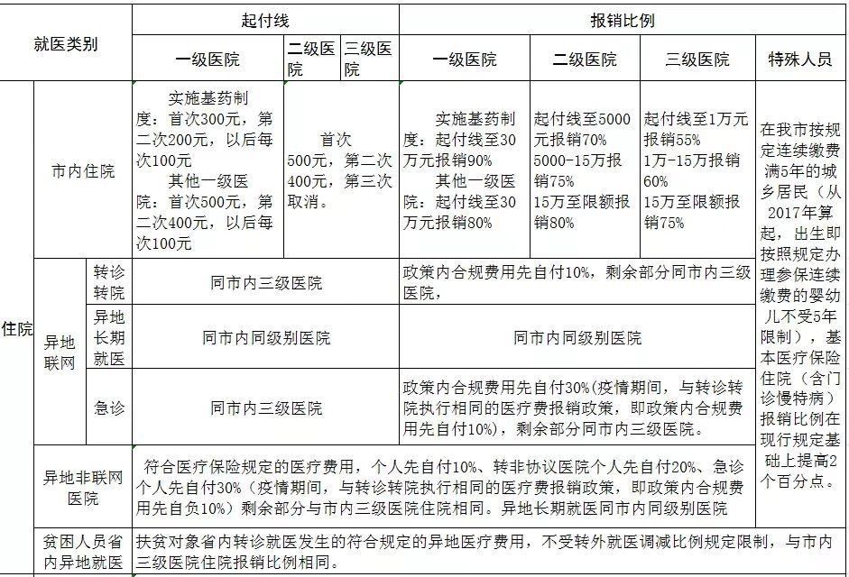
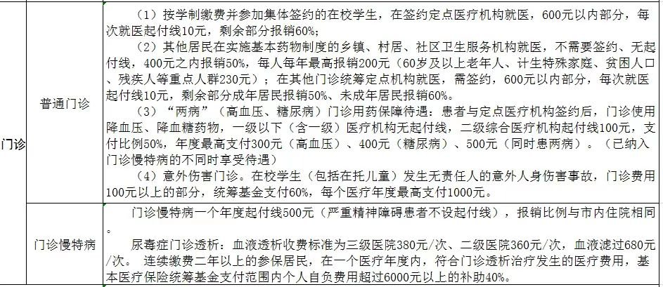
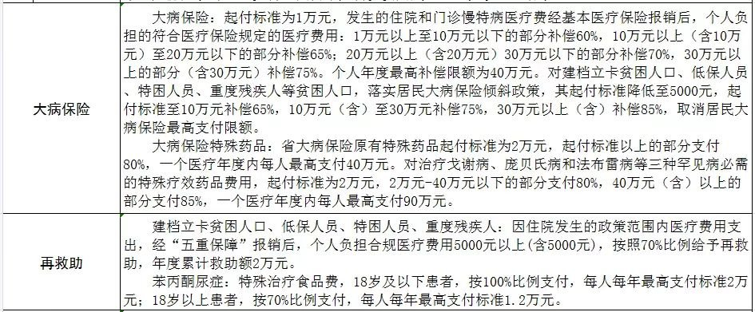

摘要：保险的基础知识、配置策略总结。

<!-- more -->

---

保险的作用是转移风险，对赌未来的风险。

### 保险分类

> 保什么，有什么特点，能解决哪些问题

#### 社会保险：

即通常说的社保，五险一金如养老、医疗、失业、工伤、生育保险，七险三金如长期护理险、团险（意外险、百万医疗险）、个人养老金、商业养老金。本质上所有保险都是各保险公司承包的，只不过有政府信用托底。

#### 商业保险：

- 人身保险：

    1. 医疗险：报销型，一般是对社保报销后、除去免赔额以上的部分，花多少报销多少，主要保障住院报销，与**医保**互为补充；健康告知最严，被拒保、除外承保概率大，会影响后续投保其他产品。预算少的情况下应先配置**长期百万医疗险**，20年长期年保费约30岁500￥、55岁1500￥。
    2. 重疾险：给付型，确诊规定的重大疾病且满足较苛刻条件的、或实施完约定手术就赔，本质是收入损失险，保障患重疾后几年不能工作。30岁50w保额年保费约5000￥。防癌险：只保约定的癌症，除了特殊人群其他不推荐。
    3. 意外险：常见的综合意外险主要保障意外身故、伤残、医疗，其中**意外医疗**免赔额多为100￥，主要保障交通意外、摔伤等。大多为1年期，不分年龄性别，50w保额5w意外医疗约150￥。其他还有交通工具意外险、外出旅游意外险、运动意外险等，很便宜几十块以内。
    4. 寿险：相对套路最少的保险，除了投保人杀害被保人、因犯罪被杀、2年内的自杀，大多是人没了就赔。终身寿险保费贵保额低，推荐定期寿险；30岁30年期年保费约500￥。
    5. 年金险：养老金。

- 财产保险：车险、交强险等，[财险产品查询](http://cxcx.iachina.cn/)；

其它：

- 团体险：公司福利，多为团体住院医疗险、团体意外险。

- 新型互联网保险：能在线上投保、申请理赔；传统型保险：只能线下（销售员、代理人、电话）投保，大多也开始可以通过线上理赔；

按照是否为储蓄型又可分为：

- 储蓄型：有分红，或到期返保额，或终身型附加身故责任（人肯定会死，所以肯定会赔钱，多见于终身重疾险；本质是终身重疾 + 带苛刻条件的终身寿险二合一，出险都是 2赔1）；价格高，不推荐。

- 消费型：不返钱，钱花了就花了。

### 保险公司

选择原则、评价维度：

1. 综合偿付能力充足率 150%、核心偿付能力充足率 100%、风险综合评级 BB 级及以上，各季度平稳；有底气的都会标注在醒目位置，最好高于银保监会每季度公布的[保险业平均偿付能力](https://www.cbirc.gov.cn/cn/view/pages/index/jiansuo.html?keyWords=保险业偿付能力状况表)；[2022年三季度保险公司偿付能力排行榜](https://zhuanlan.zhihu.com/p/585562071)；
2. 消费者权益保护监管评价 B 级及以上，[保险消费投诉率排名](https://www.cbirc.gov.cn/cn/view/pages/index/jiansuo.html?keyWords=保险消费投诉)中公布的投诉总数、单位保单/保额投诉数；
3. 支持在线自助理赔，便捷程度，官网、APP、公众号；
4. 市场份额，保费规模、利润、人员，注册资本、品牌效应；
5. 重大负面新闻。

保险公司的重要信息一般在官网->【公开信息披露】栏都能找到。【产品基本信息/目录】->条款，可在银保监会查到。

保险公司分类：集团下同名的其它子公司，人身保险公司、寿险保险公司、健康保险公司、财产保险公司等，主营产品类型不太相同，也有重合类型的产品。

选保险公司：https://zhuanlan.zhihu.com/p/28193678

### 常见名词

- 投保人：谁买的；被保险人：给谁买的，一般可为自己、父母、配偶、子女；保险人：保险公司；
- 受益人：带身故责任的（如意外身故、寿险），人没了钱给谁；默认为被保险人，会涉及到继承顺序、各种手续等较麻烦；建议指定受益人并分配好份额，如均为100%，则第一顺序受益人身故再由第二顺序受益人继承。
- 保险代理人、经纪人、中介，[保险中介许可证查询](https://xkz.cbirc.gov.cn/zj/)；如各代理APP，慧择、小雨伞、梧桐树等，互联网企业也开始涉足，如微信的腾讯微保、支付宝的蚂蚁保等。
- 投保须知：特别重要，能大致了解限制购买地区、购买额度、除外医院、职业限制等；
- 健康告知：人工核保比智能核保更宽松，拒保有记录，可咨询顾问预核保（打码名字等信息）；责任除外承保：可以买，但会对既往症免除责任；
- 职业告知：意外险限制比较严，一般为1-3类（基本为室内的文职具体可参考，不同公司分类不同）可买，4类以上高风险职业不太好买；
- 花名：不同平台可能不同，如慧择的【e享护-医享无忧长期医疗险】，太平洋健康官方APP中、小雨伞APP中的【蓝医保】都是同一款产品，备案名均为【太平洋健康…个人长期医疗保险（费率可调）（互联网）】，即保险条款的标题，可扫码查验在售状态及条款。也有可能花名相同，实际是不同保险公司的不同产品，如【小米综合意外险】不同年份先后由不同公司承保，所以条款可能也不一样。

#### 参考资料

- 中国保险协会[人身险查询入口](http://www.iachina.cn/art/2017/6/29/art_71_45682.html)，大多数可查到，部分产品不好查。
- 保险公司官方网站、公众号/小程序、APP；
- 评测网站：[深蓝保](https://www.shenlanbao.com/)（已停售产品更新状态较及时，测评重点较全，也偏向引流到与他们有合作的几款产品），按评价表标准，[评测常见保险](https://zhuanlan.zhihu.com/p/461486657)；
- 公众号：保参谋；
- 第三方 APP：保险师（可对比，产品不是很全，部分已停售产品未及时更新状态）、慧择保险网（可线上投保）、小雨伞、梧桐树等；

### 医疗险

保障重大疾病医疗报销，与医保互为补充。约几百元左右，每年保费递增。健康告知严格，建议投保前1-2年尽量不做体检、不开处方。

好医保长期医疗健康告知核保 https://www.zhihu.com/question/400510097

测评 https://zhuanlan.zhihu.com/p/435345221

三大长期医疗险对比 https://m.toutiao.com/article/7116041699918381580/

大致有：

- 惠民保：各城市推出的半官方性质的商业保险，得过癌症也能参保，专属老年人的福利，保费百元左右。
- 百万医疗：
- 小额医疗险：
- 防癌医辽险：只保癌症，治疗全报销，三高、糖尿病、80岁也能买，几百到1000多

关键点：

1. 保额： 自费药、外购药、特需药；
2. 免赔额：百万医疗险1w免赔、+1w以内小额住院医疗险；
3. 医保用药范围：首选不限医保用药，其次选医保内100%报销；医保目录中，甲类，社保100%报销；乙类，社保80%报销；丙类，自费；
4. 无医保版本：鉴于最近 DRG 改革，建议选以无社保身份投保，报销范围和比例都会大有提高，医生用药不受医保限额，可使用原研药、外购药等相对高质量的药物，但保费会贵一些。进阶可升级为中高端医疗险。

外购药/特药保障：选限制少的，主要的坑会隐藏在特药/外购药条款（包括特殊门诊医疗）、免责、特别约定、赔偿原则与赔付比例、续保条件、甚至增值服务约定等等各处，防不胜防。药占比、总额预付制。外购药 https://zhuanlan.zhihu.com/p/476894904

不能报：

- 药品费指定医疗机构二级公立医院、
- 非医院药房、
- 免责条款中医生所执业医院；

非常重要！

1. 续保条件：跟主险捆绑/必选责任/保证续保；需保险公司审核的都不友好，保证健康状况发生变化、出险后仍可续保（承保、条款、费率不加费）；不管保险公司怎么承诺，一年期停售后不再承保。一次性锁定5年！而非“分期付款”。no自动续保、承诺续保。
2. 报销条件：申请审核通过后，需在指定药房购买药品；适应症审核；
3. 不限医保范围。
4. 外购药。

很重要！

1. 器官材料费：对于植入人体的器官材料，如钢钉、人工关节、各种支架、人工心脏瓣膜等，国产和进口价差非常大；移植后产生的排异性治疗费用。都不含器官获取费
2. 恶性肿瘤及重大疾病治疗金：标配，癌症治疗金与住院医疗金独立保额。
3. 全年报销天数：某些疾病等待期很长。

很实用

1. 住院前后的门诊急诊费用
2. 家属交通费、住宿费、陪床费：极少有
3. 救护车费用：每次也要千元左右。

不重要

1. 所在城市有门店的保险公司，用到的概率很高，方便后期父母出险理赔；
2. 保费价格：优先级极低，差别几十元。更应关注责任保障范围。
3. 膳食费、住院津贴

### 重疾险

优先级：https://t.10jqka.com.cn/pid_254574175.shtml

高优先：

- 海外出险：
- 健康告知：
- 重疾理赔条件宽松：统一的6+19种+x
- 保額：基本保額30-50万，一二线大城市，可以到100万
- 保障期限：尽量终身，预算有限则考虑 定期＋终身 的组合；https://mp.weixin.qq.com/s/gxCS8RonHYsmrOk3j5nqrQ
- 轻症/中症：高发重疾对应的早期疾病，可降低理赔门槛，很实用；不同产品差异非常大，优秀的需覆盖高发的 11种；轻症保额独立，不占用重疾保额，或做高轻症保额；

中优先：

- 癌症多次賠：高达70%的理赔都是癌症，且复发率高；有遗传史，解决复发、转移的问题；
- 重疾多次赔：不同种类可赔多次；不分组 > 分组
- 心血管多次赔：适合心血管病家族病史
- 投保人豁免：被保人轻症豁免；夫妻互保。本质是给投保人买了一份保险，保额是主险的保费，保期是主险的缴费期。投保人健康告知为标准体。弄清豁免范围：有的条款仅限意外而不含疾病导致的身故或全残

低优先：

- 身故责任：<300可选，可另外买定寿；加了身故分红返保额，即储蓄型；不加就属于消费型。本质是“寿险+重疾”二合一，出险都是“2赔1”。身故赔保额、保费，是寿险责任；身故退现金价值，是终身险的退保责任；
- 等待期

保障患大病风险，本质是收入损失险；

- 理赔条件苛刻：确诊即赔、达到某种状态一定时间、实施完约定手术；以重疾治疗方式险取代重疾险；
- 没经济条件放弃积极治疗，医学进步导致治疗、确诊方法被淘汰，不赔？
- 老人保费倒挂：交的保费，比赔付的保额还多

合资：
正规翻译机构翻译，当地公证/管理机构公证，中国驻当地使领馆认证（医院、医生资质、完整病历、公证机构、翻译），不需回国二次确诊；批单、补充合同上体现，办理出国告知手续

指定医院、专科医生包括海外：中信保诚、工银安盛、中德安联；
海外理赔：翻译公证认证

- 合资：中荷人寿、同方全球；中意人寿，中英人寿，保诚、友邦、大都会；
- 中资：招商仁和；三峡人寿、弘康人寿、光大永明、大家保险、信泰人寿的部分产品；
    需回国二次确诊：君龙，国联人寿；和泰人寿、国富人寿、海保人寿、瑞华人寿、昆仑健康、百年人寿、复星联合、瑞泰人寿的部分重疾产品。
    https://zhuanlan.zhihu.com/p/36698372

要求：终身，重疾1-2次，无身故或返现金价值，有中轻，50w的保费7000￥以下

### 意外险

保障意外导致的死残，必须是外来的、突发的、非本意、非疾病的；常见的是交通事故；

多款意外险自由组合：

- 综合意外险：活着会遇到的多数意外都保，不贵，普遍几十到几百；
- 专项意外险：只保某一类意外，老便宜了，几块钱的一大把。如：
    - 交通工具意外险、
    - 外出旅游意外险、
    - 运动意外险（骑行、滑雪等）

通常有三项责任：身故、伤残、医疗。

1. 身故：真正保的稳的是寿险，意外仅占死亡的3%；猝死；
2. 伤残：全残一字之差坑死，分级赔付；对于家庭主力，首要伤残额度买高；

  - 10级 100*10%=10万；
  - 截肢一小臂，5级60%，100万保额赔60万，50万保额30万。

3. 医疗：与医疗险互补，最好涵盖医保外用药。老人没法买住院医疗险，意外医疗额度越高越好。老人

  - 不限社保：50万保额约300元，100万600元
  - 常见赔付：交通意外事故、猫爪狗咬打疫苗
  - 其他意外：发生概率高，跌打损伤、摔伤（摔下楼、掉下水道）、高空坠物（被花盆砸）、运动拉伤、骨折（打自费的钢钉）、烧烫伤、触电、电梯事故、游泳溺水、煤气中毒、自然灾害
  - 不赔：无证驾驶、酒驾、中暑、3人以下的食物中毒
  - 住院津贴，非挑选重点，有比没有好？
  - 特罗凯，肺癌靶向治疗药

意外伤害风险总体排名：从大类看，交通类事故占比近33%，排名第一

交通意外：

- 合规电动自行车（有脚踏、不超25km/h），不需驾驶证、上牌行驶证，即使违章，都要赔；共享单车？
- 电动摩托车、四轮低速电动车属于机动车，无行驶证、驾驶证不赔，两证齐全除酒驾外（哪怕违章驾驶发生意外是自己违法在先，像闯红灯、逆行、超载、在禁摩地区驾驶等）都赔；
    机动车交通事故责任强制保险，每年120元，摩托车400元，自愿第三者责任险、意外险、盗抢险、车损险
- 对方全责，由对方车险（责任险）赔付，保险不赔；己方全责；五五开；
- 免责中酒驾和无证的“机动车”改为“机动交通工具”，违章驾驶也是不赔的

路上交警查车出示电子驾照，增驾D照，济南 日照价格，迁入济南

晋级项：

- 不限社保，0免赔，经社保100%、不经社保80%（报自费药，一般较贵，需权衡性价比）；
- 一年期：价格不会随年龄增加，健康要求松；职业1-3不承保离地2米以上的高空作业职业，如拆搭脚手架等；
- 消费型
- 含身故、伤残、医疗，总额度50w+，医疗额度1w+
- 职业1类驾乘险、猝死，或1-3类农民（54岁、健康要求松）
- 住院津贴

淘汰项：

加分项：

- 医疗额度10w
- 150住院津贴；救护车费
- 驾乘机动车50w，节假日翻倍；
- 自行车
- 第三者责任险
- 意外伤残骨折脱臼
- 保费低
- 范围是全球

意外险健康要求：https://www.shenlanbao.com/zhinan/1541964179627540480

有健康要求但无健告：

职业分类表：

### 定期寿险

- 家庭经济支柱；
- 2021年人均预期寿命78.2岁；
- 男比女贵一倍；
- 定期寿险覆盖债务，终身寿险覆盖遗产。

根据家庭经济情况，及自身对家庭的责任（早逝后父母养老金+妻儿生活费+房贷车贷）评估。可多款搭配，注意限额。

- 保额适中：如未来 XX 年的预期收入；
- 保障期限：最好能覆盖自己承担家庭责任最重、对家庭影响最大的时期，定期以20年、**30年**、60岁、70岁为主；根据亲属寿命，推算预期寿命；

### 推荐家庭配置

保险经纪人是如何给自己规划保险的：https://zhuanlan.zhihu.com/p/20273939

1. 新晋家庭顶梁柱（26~35岁）
    主要防范风险：重大疾病、意外伤害、早逝。
    配置方案建议：

- 长期百万医疗险（续保20年）：保障重大疾病医疗报销，鉴于最近 DRG改革，建议选无社保版本。约几百元左右，每年保费递增。健康告知严格，建议投保前1-2年尽量不做体检、不开处方。
- 成人综合意外险（1年期）：主要保障意外医疗，尤其是交通事故。
- 定期寿险：在家庭支柱身故或重大伤残时保障后续家人生活。
- 重疾险：性价比不高，理赔难，优先级最低，建议有余力再配置。

2. 中年（36~50岁）
    主要防范风险：重大疾病、意外伤害、早逝、养老风险
    配置方案建议：

- 长期百万医疗险（续保20年）：保障重大疾病医疗报销。
- 成人综合意外险（1年期）：主要保障意外医疗，尤其是交通事故。
- 定期寿险：保费贵，不建议。
- 重疾险：性价比不高，不建议。

### 需求分析

#### 家庭风险

分析整个家庭的主风险，对风险缺口排序，排序原则有：

- 家庭经济支柱 > 其他成员；
- 身故、伤残＞大病医疗＞意外医疗（交通意外、摔伤）＞收入损失、康复，大致对应寿险、医疗险、意外险、重疾险。
- 车祸哪些保险能赔：https://zhuanlan.zhihu.com/p/190864429
- 房贷车贷、父母养老、孩子抚养。
- 年龄越大，对应保费越贵，检查异常、患病风险越大，同时健康告知越不容易过，所以尽早规划，趁身体健康早点投保。
- 付费咨询问题：家庭保险配置方案点评，投保顺序，条款注意事项；健康告知；

社保：城镇职工社会保险、城镇居民社会保险、城乡居民社会保险（新农合）。

[日照医保报销政策](http://rz.bendibao.com/live/202277/1029.shtm)：住院报销（市内住院和异地住院）、门诊报销（普通门诊和门诊慢特病）、大病保险和再救助。

[医院等级划分](http://www.a-hospital.com/w/%E5%8C%BB%E9%99%A2%E7%AD%89%E7%BA%A7)：共三级十等，每级甲、乙、丙三等，三级增设特等；

- 三级医院：三级特等、三甲等级最高最具权威，市、省人民医院多为三甲；
- 二级医院：县/区人民医院多为二甲、三乙丙，大多数医疗保险都要求在二甲及以上公立医院就诊；乡镇卫生院等；
- 一级医院：社区卫生服务站；

