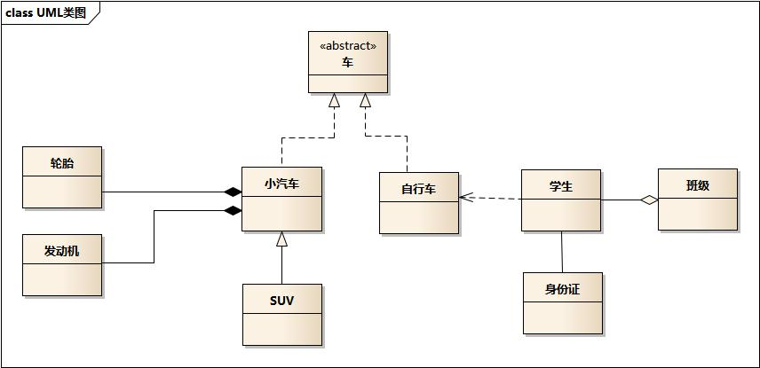

> 摘要：封装、继承、多态，类图关系，S.L.I.O.D 几大设计原则。

<!-- more -->

---

## 目录

[TOC]

## 面向对象

Object Oriented

### 对象

根据 JVM 规范："对象是动态分配的类实例或数组"。实例是内存中的对象。

抽象：指将一类对象的共同特征提取出来构造类，**类是对象（实例）的抽象**。一切皆对象。

```
Student stu1 = new Student("小刘", 22); // 显式创建对象

String str1 = "Hello"; // 隐式创建对象
String str2 = str1 + "Java";

// 匿名对象，对象只用一次，大多用作参数，需区别于单例模式
new Person("张三", 30).tell();
```

面向对象和面向过程的主要区别在于：解决问题的方式不同；

- 面向过程：把解决问题的过程拆成一个个方法并执行；
- **面向对象**：先抽象出对象，用对象执行方法的方式解决问题。一般更易维护、复用、扩展。如[包装类](#包装类)，一切皆对象。

### 面向对象思想

主要包括：

1. 三大特性：封装、继承、多态。
2. UML 类间关系（数据库中）：
    1. 实现关系 `---△` 虚
    2. **泛化**关系 `——△ ` 实
    3. 聚合关系 `——◇` 实
    4. 组合关系 `——◆` **实**
    5. 依赖关系 `---> ` 虚
    6. 关联关系  `——>`  `——`  实
3. 设计原则（设计模式中）S.O.L.I.D
    1. S 单一职责
    2. O 开闭原则
    3. L 里氏替换
    4. I 接口隔离
    5. D 依赖倒转
    6. D 迪米特原则
    7. H 合成/聚合复用

## 一、三大特性

### 封装

定义：利用抽象数据类型将**数据和基于数据的操作**封装在一起，使其构成一个不可分割的独立实体。数据被保护在抽象数据类型的内部，尽可能地**隐藏**内部的细节，只保留一些对外的接口使其与外部发生联系。用户无需关心对象内部的细节，但可以通过对象对外提供的接口来访问该对象。

定义：指把对象的成员变量/属性隐藏在内部，不允许外部对象直接访问，通过（可被外界访问的）public 方法来操作属性。控制对外隐藏和暴露哪些数据。基本单位是类。如 **POJO 类**的 getter/setter 方法。

优点：

- 减少**耦合**：可以独立地开发、测试、优化、使用、理解和修改
- 减轻维护的负担：可以更容易被理解，并且在调试的时候可以不影响其他模块
- 有效地调节性能：可以通过剖析来确定哪些模块影响了系统的性能
- 提高软件的**可重用性**
- 降低了构建大型系统的风险：即使整个系统不可用，但是这些独立的模块却有可能是可用的

### 继承

继承：指子类可**使用**父类的所有属性和方法。子类 is a 父类。

继承的特点：

1. 子类**拥有**父类所有的属性和方法（包括私有属性和私有方法），但无法访问父类中的**私有属性和方法**，仅拥有。

    1. 子类不能继承父类的构造器；
    2. 子类可重写父类的方法；继承应该遵循里氏替换原则，子类对象必须能够替换掉所有父类对象。
    3. 继承后变量和方法的访问顺序：就近原则。

2. **单继承**（不支持多重继承）：程序结构更清晰、便于维护。多重继承会使类型转换、构造方法的调用顺序变复杂，影响性能。

    1. 若支持多重继承：类 C 继承自类 A 和类 B，如果类 A 和 B 都有自定义的成员方法 f()，则调用类 C.f() 会产生二义性；
    2. 通过实现多个接口、间接支持多重继承：接口由于只包含方法定义，不能有方法的实现，类 C 不能直接调用方法，需实现具体的 f() 才能调用，不会产生二义性。

3. 对于父类的包访问权限、成员变量/方法，如果子类和父类在**同一个包**下，则子类能继承，否则子类不能继承；

##### 方法重载 VS 重写

- 重载（overload）：同一个类中，多个同名方法根据不同的传参来执行不同的逻辑处理；
- 重写/覆盖、覆写（override）：子类**继承**父类已有的方法，并重新实现其内部逻辑、功能。遵循两同两小一大。

区别：

0. 方法名都**相同**。
1. 发生范围：重载在同一个类；重写在子类中。
2. 参数列表（类型、个数、顺序） ：重载至少一个不同；重写一定**相同**。
3. 返回值类型、异常：重载可不同（只有返回值不同不算重载）；**两小**：重写子类的返回值类型、异常范围（`RunTimeException`）<= 父类（`Exception`）。
4. 访问修饰符：重载可不同；**一大**：重写，子类访问权限（只能是 `public，而非private`）>= 父类（`protected`），即子类修饰符不能做更严格的限制；
    - 另外父类方法修饰符为 `private/final/static`或构造器时（都不能被继承），子类不能重写，但被 static 修饰的方法能被再次声明。
    - [反射机制](#反射机制)。
5. 发生阶段：重载实现的是**编译时**的多态性（即前绑定）；重写实现的是**运行时**的多态性（即后绑定）。

### 多态

多态：即**一个接口，多个方法**。指多个子类继承并重写父类的同一属性或方法，或多个子类实现接口并覆盖接口中的同一方法，并将父类引用指向子类对象。

```
// 引用的自动类型转换，指存在继承关系的对象类型转换
Animal animal = new Dog(); // 向上转型，把Dog类型转换为Animal类型
animal.run();

// 引用的强制类型转换，编译正常，运行可能报错ClassCastException类型转换异常，建议在强转前判断对象的真实类型
Dog dog = (Dog) animal; // 向下转型，把Animal类型转换为Dog类型
animal.run();

Animal animal = new Cat();
if (animal instanceof Cat) {
    Cat cat = (Cat) animal; // 向下转型
}
```

实现多态有 3 个必要条件：

1. 子类继承父类/实现接口；
2. 方法重写；
3. 父类引用指向子类对象（**向上转型**）或接口的引用变量指向其实现类的实例对象。

分类：

1. 编译时多态：是静态的，主要指**方法重载**。编译后变成不同的方法；
2. 运行时多态：是动态的，即通常所说的多态性。指程序中定义的**对象引用**所指向的**具体类型**在运行期间才确定。
    - 指继承父类和实现接口时，可用父类引用指向子类对象。**引用类型变量**发出的方法调用的到底是哪个类中的方法，必须在程序运行期间才能确定。

特征：

1. 对于方法的调用：编译看左边，运行看右边？
    1. 如果子类重写了父类方法，真正执行的是子类覆盖的方法；
    2. 如果子类没有覆盖父类的方法，执行的是父类的方法。
2. 对于变量：编译、运行都看左边。

优势：

1. 父类作为方法的形参（入参）用来传递对象；
2. 便于类与类间解耦，右边对象可组件化切换，改换业务。

劣势：

1. 编译看左边，不能调用子类独有的方法。

## 二、UML 类图和时序图

#### UML 统一建模语言

> 可视化的、面向对象的、软件开发的工业标准。

在 UML 系统开发中有三个主要模型：

1. 功能模型：从用户的角度展示系统的功能，包括用例图。
2. 对象模型：采用对象，属性，操作，关联等概念展示系统的结构和基础，包括类别图、对象图。
3. 动态模型：展现系统的内部行为。包括序列图，活动图，状态图。

#### 类间关系及 UML 图例



类间关系及对应 UML 图例、Java 表现形式有：
1. **实现关系**：带**空心箭头**的虚线 `---△`。表现为继承抽象类（`<<abstract>>`），用来**实现**一个接口，在 Java 中使用 `implements `关键字。eg：汽车类**实现**车接口。
    - 车为抽象概念（接口），在现实中无法直接用来定义对象，只有指明具体的子类（汽车or自行车），才可用来定义对象。
    - 继承关系为 `is-a`，虚线 `–--`。eg：自行车是车、猫是动物。
2. **泛化关系**：带**空心箭头**的实线 `——△`。表现为继承**非抽象类**，在 Java 中使用 `extends` 关键字。eg：SUV类**继承**汽车类。
3. **聚合关系**：带**空心菱形箭头**的实线 `——◇`。表示整体由部分组成，但是整体和部分不是**强依赖**的，整体不存在了部分还是会存在。eg：学生类**聚合**成班级类。公司和员工属于聚合关系，因为公司没了员工还在。
4. **组合关系**：带**实心菱形箭头**的实线 `——◆`。组合中整体和部分是**强依赖**的，整体不存在了部分也不存在了。eg：轮胎、发动机**组成**汽车。比如公司和部门，公司没了部门就不存在了。
5. **依赖关系**：带箭头的**虚线** `--->`。描述对象在**运行期间**会**调用到**另一个对象。**箭头**指向被调用者，“使用”对方的方法和属性。eg：学生**依赖于**自行车。A 类依赖于 B 类主要有三种表现形式：
    1. B 类是 A 类方法的**局部变量**；
    2. B 类是 A 类方法的**参数**；
    3. B 类向 A 类**发送消息**，从而影响 B 类发生变化。
    4.  注：双向依赖是一种非常糟糕的结构，应保持单向依赖。
6. **关联关系**：**实线** `——`。 表示不同类对象之间有关联，是一种**静态**关系、与**运行过程的状态**无关，在最开始就可以确定。用来定义不同类的对象间静态的、天然的、由常识等因素决定的结构；是一种强关联的关系。
    - 默认不强调方向，表示对象间相互知道，**带箭头的实线** `——>` 表示A知道指向的对象B。通常是以**成员变量**的形式实现。因此也可以用 1 对 1、多对 1、多对多这种关联关系来表示。eg：乘车人和车票、学生和身份证。

#### 时序图

- 在需求分析阶段，如果与系统交互的 User 超过一类并且相关的 UseCase 超过 5 个，使用**用例图**来表达更加清晰的结构化需求。
- 如果某个业务对象的**状态**超过 3 个，使用状态图来表达并且明确状态变化的各个触发条件。
    - 说明：状态图的核心是对象状态，首先明确对象有多少种状态，然后明确两两状态之间是否存在直接转换关系，再明确触发状态转换的条件是什么。 
    - 正例：淘宝订单状态有已下单、待付款、已发货等。比如已下单与已收货这两种状态之间是不可能有直接转换关系的。
- 如果系统中某个功能的调用链路上的涉及对象超过 3 个，使用**时序图**来表达并且明确各调用环节的输入与输出。
- 如果系统中模型类超过 5 个，且存在复杂的依赖关系，使用**类图**来表达并且明确类之间的关系。 
    - 说明：类图像建筑领域的施工图，如果搭平房，可能不需要，但如果建造蚂蚁 Z 空间大楼，肯定需要详细的施工图。
- 如果系统中超过 2 个对象之间存在协作关系，并需要表示复杂的处理流程，使用**活动图**来表示。 
    - 说明：活动图是流程图的扩展，增加了能够体现协作关系的对象泳道，支持表示并发等。

**时序图**：显示对象间交互与协作关系，清晰立体地反映系统的调用纵深链路。按时间顺序排列。

顺序图：显示参与交互的对象及其对象间消息交互的顺序。

包括的建模元素主要有：

1. 系统角色（Actor）：可是人、其他的系统或子系统。
2. 对象（Object）：三种命名方式：对象名和类名、只显示类名表示匿名对象、只显示对象名。
3. 生命线（Lifeline）：表示为从对象图标向下延伸的虚线，表示对象存在的时间。
4. 控制焦点（Focus of control）：表示时间段的符号，在这个时间段内对象将执行相应的操作。用小矩形表示。
5. 消息（Message）：一般分为：
    1. 同步消息=调用消息（Synchronous Message）：消息发送者把控制传递给消息的接收者，**然后停止活动**，等待消息的接收者放弃或返回控制。用来表示同步的意义。
    2. 异步消息（Asynchronous Message）：消息发送者通过消息把信号传递给消息的接收者，**然后继续**自己的活动，不等待接受者返回消息或控制。接收者和发送者是并发工作的。
    3. 返回消息（Return Message）：表示从过程调用返回。
    4. 自关联消息（Self-Message）：  表示方法的自身调用及同对象内的方法调用另一个方法。

## 三、设计原则

S.O.L.I.D

| 简写 |                全拼                 |   中文翻译   |
| :--: | :---------------------------------: | :----------: |
| SRP  | The Single Responsibility Principle | 单一责任原则 |
| OCP  |      The Open Closed Principle      | 开放封闭原则 |
| LSP  |  The Liskov Substitution Principle  | 里氏替换原则 |
| ISP  | The Interface Segregation Principle | 接口分离原则 |
| DIP  | The Dependency Inversion Principle  | 依赖倒置原则 |

简记为 **S.O.L.I.D**：S 单一职责原则、O 开闭原则、L 里氏代换原则、I 接口隔离原则、D迪米特法则。

1. **S 单一职责**：**一个类**只负责一个功能领域中的相应职责。对象应该仅具有一种单一功能。
- 承担的职责越多，复用的可能性越低。当一个职责变化时，可能会影响其他职责的运作。
    - 核心是**解耦**和增强内聚性。确定职责的粒度，得出相对合理的职责分配。
    
2. **O 开闭原则**：类应该是**对扩展**开放，对修改关闭。关键步骤是**抽象化**，实现方法有：
1. 扩展就是添加新功能的意思，因此该原则要求在**添加新功能时**不需要修改代码。
    2. 通过**接口或抽象类**约束扩展，不允许出现在接口或抽象类中不存在的 `public` 方法。即，扩展要添加具体实现，而不是改变已有方法。
    3. **参数类型、引用对象**尽量用接口或抽象类，而不是实现类。能尽量保证抽象层是稳定的。如，用抽象类代替相似内容的 `else if` 分支。
    4. 一般抽象模块设计完成（如接口的方法已经敲定），不允许修改接口或抽象方法的定义。
    5. 符合开闭原则最典型的设计模式是**装饰者模式**，它可以动态地将责任附加到对象上，而不用去修改类的代码。
    
3. **L 里氏替换**：子类对象必须能够完全替换掉所有父类对象。即，**继承**时只扩展新功能，而不要破坏父类原有的功能。
- 程序中的对象应该是可以在不改变程序**正确性**的前提下被它的子类所替换的。
    - 是对开-闭原则的补充，继承就是抽象化的具体实现。子类可继承基类的所有非私有属性或方法。
    
4. **I 接口隔离**：客户端不应依赖它不需要的接口，类间的依赖关系应建立在**最小的接口**上。
- 因此使用**多个专门的接口**比使用单一的总接口要好。
    - 接口在实现时拆分冗余方法，让实现类只依赖自己需要的接口方法。即，接口尽量**细化**，同时接口中的**方法尽量少**。
    
- 设计接口时有可能满足单一职责原则、但不满足接口隔离原则，接口太大时分割。
  
5. **D 依赖倒转**：一个方法应该依赖于抽象而不是一个实例。依赖于抽象接口，不能依赖于具体实现。本质是：**面向接口编程**。
- 高层模块不应该依赖于低层模块，二者都应该依赖于抽象；抽象不应该依赖于细节，细节应该依赖于抽象。
    - 传递参数时或在关联关系中，尽量引用**层次高**的抽象层类，即，用接口和抽象类进行变量、参数、方法返回的类型声明，及数据类型的转换等，而不要用具体类。
    - 依赖注入是该原则的一种实现方式。将具体类的对象通过**依赖注入**的方式注入到其他对象中，如Spring的IoC。
    
6. **D 迪米特法则 / 最少知识**：一个对象应当对其他对象有尽可能少的了解，不和陌生人说话。
- 一个软件实体应当尽可能少的与其他实体发生相互作用。即，一个类不应知道自己操作的类的细节。**类间解耦**。
  
7. **H 合成 / 聚合复用**：尽量使用**对象组合**，而不是通过**继承**达到复用已有功能的目的。即，新对象通过向内部持有对象的委派、达到复用已有功能的目的。称为**"黑箱"复用**。
- 继承复用破坏包装，因为继承将基类的实现细节暴露给派生类，称为"白箱复用"。基类发生改变，会影响所有派生类的实现。
    - 不得已使用继承的话，必须符合**里氏代换**原则。
    
8. 共同封闭原则：一起修改的类，应该组合在一起（同一个包里）。如果必须修改应用程序里的代码，我们希望所有的修改都发生在一个包里（修改关闭），而不是遍布在很多包里。

9. 稳定抽象原则：最稳定的包应该是最抽象的包，不稳定的包应该是具体的包，即包的抽象程度跟它的稳定性成正比。

10. 稳定依赖原则：包之间的依赖关系都应该是稳定方向依赖的，包要依赖的包要比自己更具有稳定性。

## 参考资料

- Java 编程思想
- 敏捷软件开发：原则、模式与实践
- [面向对象编程三大特性 ------ 封装、继承、多态](http://blog.csdn.net/jianyuerensheng/article/details/51602015)
- [看懂 UML 类图和时序图](http://design-patterns.readthedocs.io/zh_CN/latest/read_uml.html#generalization)
- [UML 系列——时序图（顺序图）sequence diagram](http://www.cnblogs.com/wolf-sun/p/UML-Sequence-diagram.html)
- [面向对象设计的 SOLID 原则](http://www.cnblogs.com/shanyou/archive/2009/09/21/1570716.html)
- [设计模式概念和七大原则](https://cloud.tencent.com/developer/article/1650116)
