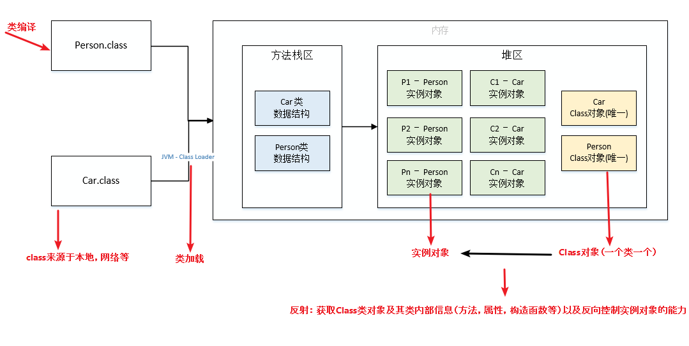

> 摘要：1. 基本语法、常量和变量（final、static 关键字）、数据类型、面向对象（封装、继承、多态、接口）； 2. 异常、泛型、反射、注解； 3. IO和序列化、Socket 网络编程、Stream 流、JDK 新特性； 4. 常用类。

<!-- more -->

[Java基础知识点和答案](https://github.com/gzc426/Java-Interview/blob/master/Java%E5%9F%BA%E7%A1%80%E7%9F%A5%E8%AF%86%E7%82%B9%E5%92%8C%E7%AD%94%E6%A1%88.md)

### 目录

[TOC]

### Java、C++

1. **纯面向对象**的语言（封装、继承、多态）-> **低耦合**的系统，易维护、复用、扩展；C++ **兼容** C，效率高但有面向过程。
    1. **继承**：Java类与类[单继承](#继承)，接口与接口多继承，类可实现多个[接口](#接口)；C++ 类支持多重继承；
    2. **重载**：Java 只支持方法重载；C++ 还支持操作符（++）重载。
2. **JVM**：**跨平台**/平台无关，一次编译到处运行（很好的**可移植性**），**字节码运行机制**，既有编译又有解释；C++为编译型语言，C++11 Windows 下无法[静态初始化数组](#数组)。
3. **JVM**：**自动内存管理**，没有指针（除 `Unsafe` 类），更安全、方便；C++ 要**手动**释放内存，虽然可自由管理内存，但指针易导致：
    1. **野指针**（指向垃圾内存的指针）：没有初始化直接使用而导致野指针；free 或 delete 后没有置为 NULL，当做合法指针使用导致野指针；
    2. **空指针 NPE**；
    3. 内存泄漏。
4. **Java 集合容器**更完善。
5. **多线程**：支持多线程；C++ 没有内置的多线程机制，必须调用 OS 的多线程功能。
6. 支持**网络通信编程**且很方便，支持 Web 应用开发。
7. Java 相对于 C、C++有着丰富的**类库和三方框架**。

### JDK、JRE、JVM 对比

`JDK(Java Development Kit)`，是一种功能齐全的 Java SDK，用于**程序开发者**创建、编译程序。

1. **Java 开发组件**：`javac` 编译器、`jar` 打包工具、`javadoc` 文档生成器、`java-debuger（jdb）`调试工具、`javap -c` 反汇编；
2. `JRE(JAVA Runtime Environment)`：包含**普通用户**运行 Java 程序所需的全部内容。
    1. `JVM(JAVA Virtual Machine)`：是一个用于执行**Java 字节码**的虚拟机**进程**，针对不同系统有特定的实现；实现**一次编译，到处运行**；如 `HopSpot、JRockit、J9Vm`；
    2. 用于**产品环境**的 Java 类库。

Oracle JDK、OpenJDK


## 基本语法

#### 关键字

注意：

- 虽然 `true`、`false`、 `null` 看起来像关键字，但实际上是字面值/量，同样也不可作为标识符。
- 标识符 `var`、`yield` 和 `record` 是**受限标识符**，因为在某些上下文中是不允许的。
- `instanceof` 关键字：若对象为类（或接口、抽象类、父类）的**实例**，则返回 true。


#### 访问控制符

> 见[接口](#接口)新增三个方法。

访问控制符：private、default、protected、public

- `public `: 对所有类可见。
- `protected `: 对**同一包内**的类和所有子类可见。可以访问不同包的、从基类继承的 protected 变量、方法。
    1. **子类与基类在同一包中**：被声明为 protected 的变量、方法和构造器能被同一个包中的任何其他类访问；
    2. **子类与基类不在同一包中**：那么在子类中，子类实例可以访问其**从基类继承**而来的 protected 方法，而不能访问**基类实例**的protected方法。
- `default`（即**默认**，什么也不写）：在同一包内可见（只能访问**同一包中**的子孙类），不使用任何修饰符。
- `private `: 在同一类内可见。

| 修饰符        | 使用对象                         | 当前类 | 同一包内 | 子孙类（不同包）                                             | 其他包 |
| :------------ | -------------------------------- | :----- | :------- | :----------------------------------------------------------- | :----- |
| `public`      | **类、接口**、变量、方法         | Y      | Y        | Y                                                            | Y      |
| `protected`   | 变量、方法，不能修饰类（外部类） | Y      | Y        | Y/N（[说明](https://www.runoob.com/java/java-modifier-types.html#protected-desc)），可以访问从基类继承的 | **No** |
| **`default`** | **类、接口**、变量、方法         | Y      | Y        | **No**                                                       | **No** |
| `private`     | 变量、方法，不能修饰类（外部类） | Y      | **No**   | **No**                                                       | **No** |

## 常量和变量

### 成员变量 VS 局部变量

> 静态成员变量、非静态（实例）成员变量，局部变量（本地变量）

1. **定义**（本质）：
    1. **static 成员变量**属于类，用类名调用，**由类的所有对象共享**，持久驻内存（方法区），下次调用保留原值；
    2. **非 static 成员变量**属于对象，用对象名调用；
    3. 局部变量是在代码块/方法中定义的变量/方法参数。
2. **存储位置**：
    1. static 成员变量属于类（即静态变量/类变量)，存于**方法区**，
    2. （非 static ）成员变量属于对象，存于**堆内存**；
    3. 局部变量属于方法，存于 **VM 栈**中的局部变量表，基本类型变量直接存值，对象存放**引用**，指向堆内存中的对象本身。
3. **默认值**/初始化时机：
    1. 成员变量有默认值，在 JVM **类加载**时自动初始化（如未赋初值则取默认值）（例外：被 final 修饰的成员变量必须显式地赋值）；
    2. 而局部变量（不自动初始化）必须**显式地初始化**，在字节码执行时才会运行方法中的（局部变量）代码。
4. **生命周期**：成员变量与类/对象一致；局部变量与方法一致。
5. **修饰符**：成员变量都可以；局部变量不能被**访问控制修饰符**及 static 修饰，只能被 final 修饰。

```java
public  class DataClass {
    int age; // 成员变量/全局成员变量/实例变量
    static String URL = "hello"; // 静态成员变量
    static final String USER = "admin"; // 静态常量
}
```

### final 关键字

final 核心思想：最终的、**不可修改**的；表示变量值**不可变**、方法**不可覆盖**、类**不可继承**。

#### 一、修饰类

修饰类：不可被继承（没有子类）：

1. final 修饰的类，所有成员方法被隐式指定为 final，（但成员变量不变）；
2. 所有**包装类和 String 类**都是用 final 修饰的；
3. final 不能修饰 abstract，二者互斥、冲突、不能同时存在；

```java
/**
 * 业务逻辑异常 Exception
 */
@Data
@EqualsAndHashCode(callSuper = true)
public final class ServiceException extends RuntimeException {
    
    /**
     * 业务错误码
     * @see ServiceErrorCodeRange
     */
    private Integer code;
    /**
     * 错误提示
     */
    private String message;
}
```

#### 二、修饰方法

修饰方法：不可**重写**，可重载。

作用：

1. 用于防止子类**覆盖**父类方法的实现，保证安全；如：POJO 类的 **setter 方法**，不允许被覆写。
2. 方法被转为**内嵌**，提高执行效率。

private 方法都被隐式指定为 `private [final] `；

- final 也可修饰 private，但无意义。

#### 三、修饰变量

修饰变量：值不可变。 => 成为常量。

> 实质上是常量。JDK1.8 后改为存放在**堆**内存中。

##### 从**变量类型**分类

1. 修饰**基本类型**或 `final String` 类型的变量：使用前必须**有且仅有一次**初始化，初始化后值不可变；
    - 第二次赋值将抛出编译时错误（`Compiler Error: cannot assign a value to final variable`）。
    - 若编译阶段已知其确切值，则会当做**编译期常量**（直接宏替换），存入调用类的**运行时常量池**中（方法区）。
2. 修饰**引用类型**变量：初始化后**引用**不可变（即不能指向另一个对象），但**引用指向的对象的内容**可变。即 [final 数组 / String 类](#常用类) / 集合**内**可添加、删除元素。

##### 从**变量位置**分类

1. 修饰静态成员变量（类变量）=> 即**静态常量**：只可在静态初始化块中/声明时赋初值；作用域是全局，不用创建对象，用类名直接访问；
2. 修饰（实例）成员变量 => 即**成员常量**：只可在**非静态**初始化块中/声明时/**每个构造器中**赋初始值；
3. 修饰局部变量 => 即**局部常量**：使用前赋值，不允许二次赋值。

```Java
// 访问静态常量
HelloWorld.PI;

public class HelloWorld {
    // 修饰静态变量，即静态常量
    public static final double PI = 3.14;
    // 修饰成员变量，即成员常量
    final int Y = 10;
    public static void main(String[] args) {
        // 修饰局部变量，即局部常量
        final double X = 3.3;
    }
}
```

- 在 `foreach` 语句中可用 `final` 声明存储**循环元素**的变量；

- 局部**内部类**和匿名**内部类**只能访问局部常量：因为外部类运行后局部变量会被回收，内部类延长局部变量 copy 的生命周期、用 `final` 保证二者一致。`JDK1.8` 后默认加 final。

### static 关键字

static 修饰的成员属于类，可被类的所有对象共享，加 static 不影响作用域。

- **只保存一份拷贝**，可用类名调用。

#### 一、修饰成员方法（=> 即静态方法、类方法）

不依赖任何对象，在**类加载**时（在方法区）分配内存，可通过类名直接访问；

1. 只能访问类的静态成员（变量或方法）：**因为**非 static 成员在对象实例化前不存在，不能被 static 方法调用；
2. 方法中不能以任何方式**引用 this 和 super**；但反之在非静态方法中可通过 this 访问静态成员；

方便在**没有创建对象**的情况下调用方法/变量，如：

1. Collections 类中的一些方法，如 `Objects.equals()`；
2. Hutool util 工具类中的方法，如 [Math 工具类](#常用类)、[Arrays 工具类](#常用类)的**静态方法**；
3. 单例模式的 `getInstance()`、工厂模式的 `create/build()`、日志 `Logger LOGGER = LoggerFactory.getLogger(Users.class)` 等。

##### **构造器**不是静态方法

1. 定义：（严格意义上）不是方法，只负责初始化；
2. **this**：构造器中可使用this（指向当前对象），而静态方法不依赖任何对象；
3. 调用：构造器只能通过 **new**（或别的构造器）调用，不能通过方法调用。

#### 二、修饰成员变量（=> 即静态变量/类变量）

>  实质上就是全局变量；

目的：作为**共享变量**使用；减少对象的创建；保留**唯一副本**。

1. 定义：**static 成员变量**属于类，用类名调用，**由类的所有对象共享**，持久驻内存（方法区），下次调用保留原值；
2. 存储位置/内存分配：static 成员变量属于类，存于方法区，（非 static ）成员变量属于对象，存于堆内存；
3. 默认值
4. 生命周期：从**类被加载**开始，到类被 GC 彻底回收时。

#### 三、静态代码块

> 执行顺序：静态代码块 --> 非静态代码块 --> 构造器。 

定义在类中（方法外），用于**初始化**静态变量：不管创建多少对象，静态代码块都只执行一次；

- 对于定义在它之后的静态变量，可赋值，但不能访问。如单例模式、定义枚举类。

非静态代码块与构造函数的区别：

- 非静态代码块是对**所有对象**进行统一初始化，而构造函数是给**当前对象**初始化。

#### 四、静态内部类

> static 只能修饰内部类。

非静态内部类在编译完成后会隐含地保存一个引用，**指向**创建它的外部类，但静态内部类没有。意味着：

1. 创建对象**不依赖**外部类创建的**对象**，可直接通过外部类创建；
2. 不能使用任何外部类的非 static 成员变量/方法。

如：`AB-BA` 死锁问题。

静态内部类用于定义 DTO 传参。

```java
@Schema(description = "RPC 服务 - 商品 SKU 更新库存 Request DTO")
@Data
@NoArgsConstructor
@AllArgsConstructor
public class ProductSkuUpdateStockReqDTO {

    @Schema(description = "商品 SKU 数组", requiredMode = Schema.RequiredMode.REQUIRED)
    @NotNull(message = "商品 SKU 不能为空")
    private List<Item> items;

    @Data
    public static class Item {

        @Schema(description = "商品 SKU 编号", requiredMode = Schema.RequiredMode.REQUIRED, example = "1024")
        @NotNull(message = "商品 SKU 编号不能为空")
        private Long id;

        @Schema(description = "库存变化数量", requiredMode = Schema.RequiredMode.REQUIRED, example = "100")
        @NotNull(message = "库存变化数量不能为空")
        private Integer incrCount; // 正数：增加库存；负数：扣减库存

    }
}
```

#### 五、静态导入包

> 1.5 后的新特性， 格式为：`import static`；

可导入某个类中的指定静态资源，不需用类名即可直接调用（类中的）静态成员变量/方法等。

### final VS static 变量

```java
class MyClass {
	// 所有实例共享
    public final double f = Math.random();  // 只有第一次赋值起作用
    public static double s = Math.random(); // 赋值后全局起作用
}

MyClass cls1 = new MyClass();
MyClass cls2 = new MyClass();

cls1.f == cls2.f; // false，两个f值不同
cls1.s == cls2.s; // true， 两个s值相同，实质是同一个值

private static final Logger LOGGER = LoggerFactory.getLogger(UmsAdmin.class);
```

## 数据类型

基本数据类型和引用类型的区别主要在于：

- 基本数据类型是分配在**栈**上的，而引用类型是分配在**堆**上的。

#### 四大类八小类基本数据类型

基本数据类型都是直接存储在内存中的 Java 虚拟机栈上的。

> primitive type，所占空间大小，默认值，取值范围。

基本数据类型对应的[包装类型](#包装类型和常量池缓存机制)。

1. **布尔型** `boolean` 占用大小根据实现 JVM 不同有所差异，官方手册没有明确说明，**逻辑上占1Byte**：
    - 根据《Java虚拟机规范》里的结论，如果**boolean单独使用**、最终被编译为 int 类型，则占**4字节**；如果以**boolean数组**使用、最终会被编码为 **byte 数组**，则占**1字节**；
    - 默认值 false：不能转换成任何数据类型，true != 1；
2. **字符型** `char` 2Byte 'u0000'：0 ~ 65535.
3. 4种**整型**：
   1. `byte` 即字节，1Byte 默认值0：取值范围 `-128~127`；
   2. `short` 2Byte 0：2^15-1 = 32,767；
   3. `int` 4Byte 0：2^31-1 = 2,147,483,647（21亿）；
   4. `long` 8Byte 0L：[BigInteger类](#常用类)。
4. 2种**浮点型**：
   1. `float` 4Byte 0F：
   2. `double` 8Byte 0D：

```java
long price = 12.2L
float price = 12.2F; 
double price = 12.254(D);
```

#### 三类引用数据类型

> reference type

引用类型继承于`Object`类（也是引用类型），都是按照Java里面存储**对象**的内存模型来进行数据存储的：

- “引用”（存放对象在内存堆上的地址）是存储在VM栈上的，而对象本身的值存储在内存堆上的。

用作方法的参数和返回值的类型。

1. 数组
2. 类
3. 接口


### 包装类

包装类（`wrapper class`），箱子；

- 为了方便基本数据类型能和**其它对象**结合在一起使用，
- 如一些常用的集合 `List` 和 `Set` 等要求存放的值必须为对象。

> 都是用 final 修饰，无法继承。

#### 包装类型

[基本数据类型](#四大类八小类基本数据类型)对应的包装类型，及其放入（方法区中运行时）**常量池**的取值：

1. `Boolean`：`TRUE/FALSE` 两个常量，用于表示布尔值 `true 和 false`；
    - `Boolean.TRUE.equals(createReqVO.getDefaultStatus())`
2. **`Character`**：[0, 127]，即7位ASCII码、最大7F Del；
3. `Byte Short **Integer** Long`：[-128, 127]；
4. `Float、Double`：不会进入常量池；
5. `String` 类型：所有**字面量**都会进入[常量池](#数组)；

##### 常量池缓存机制

包装类在常量池的值会**复用**已有对象的缓存数据，可直接用 `==` 判断；其它范围的值，必须全部用 `equals()` 比较。如：

1. 对于 `Integer var = 40` 在 -128 至 127 间的赋值，会自动装箱（转为包装类对象），Integer 对象通过 **`IntegerCache.cache`** 产生，会复用（缓存中的）已有对象；此区间外的所有数据都在**堆**上产生，不复用已有对象。
2. 而通过 new，如 `Integer i2 = new Integer(40)` 会直接**创建新对象**（手动装箱）。

##### 基本数据类型 VS 包装类型

区别：

1. **根本**：一种数据类型；一种引用数据类型（面向对象的**类**），有类的特性（封装、继承、多态等）。
2. **存储位置**：
    1. 基本数据类型定义的变量，用作**局部变量**（直接存放在 VM 栈的局部变量表中，占用空间小），用作 **`static` 成员变量**（存放在方法区），用作**非 `static` 成员变量**（存放在堆中）；
    2. 而用包装类实例化的对象，一律存放在**堆中**。  
3. **默认值**：基本数据类型有默认值（int = 0）且不是 `null`；包装类型若不赋值则为 `null`。
4. 泛型：基本类型不可用于泛型；包装类型可以。

#### 自动装箱/拆箱机制

从 JAVA SE5 开始引入自动装箱/拆箱机制 -> 将基本数据类型当成（对应包装类的）**对象**操作，使二者可方便的相互转换（一种[面向对象](#面向对象)的体现）：

- **装箱**：将基本数据类型 ==> 转换为对应的包装类型；
- **拆箱**：将包装类型 ==> 转换为对应的基本数据类型；

自动拆箱的时机：

1. 将包装类型变量直接**赋值**给对应基本数据类型时；

2. 当要访问包装类对象的**真实数据值**时，如进行数学运算、比较大小、输出对象的值、三目运算符数据类型对齐。

缺点：

- 频繁装箱/拆箱，会严重影响系统的**性能**，应尽量避免不必要的装箱/拆箱操作。
- 自动拆箱可能导致 NPE，需进行 NPE 检查。见下[三目运算符](#数据类型转换)。

    - 手动装箱：`Integer.valueOf(128)`
    - 手动拆箱：`变量.intValue()`

```Java
// 装箱
Integer i1 = new Integer(128); // 手动装箱，基本数据类型 => 堆内存中的包装类对象
Integer i2 = 128; // 自动装箱，调用 Integer.valueOf(128); Double、Float的valueOf()类似

// 比较包装类对象
i1 == i2? // false，比较引用，常量池外的值不复用，两个不同对象的地址不同；若为[-128, 127]，则复用已有对象，地址相同，返回true
i1.equals(i2)? // true，不同对象的值相等

// 拆箱
int i3 = i2.intValue(); // 手动拆箱，包装类对象 => 基本数据类型
int i3 = i2; // 自动拆箱，调用 i2.intValue()/xxxValue()

// 初始值为不可达到的长度，s.length() + 1 也行
int subStrMinLen = Integer.MAX_VALUE;
```

#### 与字符串间的转换

继承自 `Object` 类的方法：

```java
String str = "128"; // 内容为纯数字
Integer i1 = Integer.valueOf(str); // 字符串 => 包装类对象，类似手动装箱
String str = i1.toString();        // 包装类对象 => 字符串

// str 转为int
int i3 = Integer.valueOf(str);   // 字符串 => 包装类对象 =>（自动拆箱）赋值给基本数据类型，（推荐，经典代码）
int i4 = Integer.parserInt(str); // 字符串 => 基本数据类型

/**
  * 获得租户编号，从 header 中
  * 考虑到其它 framework 组件也会使用到租户编号，所以不得不放在 WebFrameworkUtils 统一提供
  * @param request 请求
  * @return 租户编号
  */
public static Long getTenantId(HttpServletRequest request) {
    String tenantId = request.getHeader(HEADER_TENANT_ID);
    return NumberUtil.isNumber(tenantId) ? Long.valueOf(tenantId) : null;
}
```

### 数据类型转换

**自动类型转换**：系统把某种基本类型的值直接赋给另一种基本类型的变量。

  1. ​                   `char => int -> long -> float -> double`；
  2. `byte -> short => int -> long -> float -> double`；

**强制类型转换**：把一个范围大的数值或变量赋给另一个**范围小的**变量。如将 float 类型的变量赋值给 int 变量。

  1. 下转型（down-casting，也称为窄化）会造成精度损失；
  2. 条件表达式（三目运算符）`condition ? 表达式1 : 表达式2 `中，表达式1 和 2 在**类型对齐**时，可能抛出因**自动拆箱**（和强制类型转换）导致 NPE 异常。如表达式 1 或 表达式 2 的值：

        1. 任一个是基本数据类型；
        2. 类型不一致，会**强制拆箱**升级成表示范围更大的那个类型。 

```java
Integer a = 1;
Integer b = 2;
Integer c = null;
Boolean flag = false;
// a*b的结果是int类型，那么c会强制拆箱成int类型，抛出NPE异常 
Integer result = flag ? a * b : c;
```

### 运算符 ==、equals()

都用于比较是否相等。区别：

- 引用相等：指的是**变量指向的内存地址**相等，用 `==` 比较；
- 对象相等：指的是**内存中存放的内容**相等，用 `equals()`比较；

#### 运算符 ==

`==` 比较的是变量指向的内存地址是否相等，即**引用是否相等**。

对于 `==`，因为 Java 只有值传递，所以不管是比较基本数据类型，还是引用数据类型的变量，其本质比较的都是值，只是**引用类型变量**存的值是对象的地址。

1. 用于**基本数据类型**，直接比较其（vm 栈中）存储的值是否相等；
2. 用于**引用类型**，比较两个引用是否指向同一个对象/同一块堆内存地址；
   1. 除非是同一个 `new` 出来的对象，或经过赋值指向同一个对象，或（在字符串常量池中）指向同一块内存地址，才为 true，否则为 false。因为每 new 一次，都会重新开辟堆内存空间。
   2. `null == null`：返回 true，null 既不是对象也不是一种类型，仅是一种特殊的值；
   3. 比较 String 变量：`==` 比较的是内存地址，`equals()` 比较的是值；
   4. 比较对象：`==` 和 `equals()` 比较的都是**内存地址**，没有重写 `equals()` 方法的类都是调用的 Object 的 `equals()` 方法。
3. 表达式（包含算术运算）== 包装类（[触发自动拆箱](#数据类型转换) => 基本数据类型）：比较的是数值。

```java
42 == 42.0? // 42.0下转型（窄化）为 int 42，返回true
```

##### 不能用 `==` **比较大小**的

1. **基本类型**的变量、值 == 引用类型（包装类）的变量、值；不能触发自动拆箱；
2. **boolean 类型**的变量、值 == 其他任意类型的变量、值；
3. 没有**继承关系**的两个引用类型之间：
    - **包装类**之间：如果用，则比较的是变量指向的**引用**/内存地址是否相同，应该用equals() 比较两个对象的内容是否相同；
4. **浮点数**之间：若浮点数之间用 `==` 比较，会有浮点数精度陷阱，不精确；可以设置误差范围，或见 [BigDecimal 类](#常用类)。

#### equals()

`equals()` 用来比较两个对象（内存中）的内容是否相同，即**对象是否相等**。

1. 不能用来比较**两个基本数据类型**的变量，应该用 `==`；
2. 对于引用类型：
    - 若没重写 equals() `==>` equals() 继承自Object类，故每个对象都有 equals()，Object 中默认（直接调用 `==`）对比两个对象的地址是否相等；
    - 多数情况下，重写 equals() `==>` 比较对象存储的内容是否相等。如 **String类、包装类、Date类**等；

```java
Objects.equals(null, "hello"); // 避免空指针异常
```

##### 重写 equals()

> 见 Java 集合框架文档中的 hashCode() VS equals() 部分。

重写 `equals()` 必须重写 `hashCode()`：保证 `equals()` **相同的对象**哈希码也相同。

`equals()` 和 `hashCode()` 同时存在的意义：

  1. `equals()` 保证**可靠**：比较对象（地址或内容）是绝对相等的；
  2. `hashCode()` 保证**性能**：用于获取哈希码（确定该对象在哈希表中的索引位置），通常用来将对象的内存地址转换为整数后返回；
        1. 保证在**最快的时间内**判断两个对象是否相等，可能有误差值；
        2. 同一对象的 hashcode 一定相等，不同对象的也可能相等。

否则违背了【**两个相等的对象**必须有相等的哈希码】这一 Java 关键约定，进而影响散列表、HashMap 等。

1. 因为 Set 存储的是不重复的对象，依据 `hashCode()` 和 `equals()` 进行判断，所以 Set 存储的对象必须覆写这两种方法。
2. String 因为覆写了 `hashCode()` 和 `equals()` 方法，所以可以愉快地将 String 对象作为 key 来使用。

#### String 变量中的应用

[字符串常量池](#包装类型和常量池缓存机制)

```java
String s1 = "ab"; // 将字面量"ab"放到常量池中，并将引用 s1 指向对象；推荐
String s2 = "ab"; // 在常量池查找到"ab"的地址，并赋给s2
s1 == s2? 		// true，s1和s2地址相同
s1.equal(s2)? 	// true，比较字符串的内容

String str1 = new String("ab"); // 在堆内存创建一个新对象，str1 引用指向新对象
String str2 = new String("ab"); // 在堆内存创建另一个新对象，str2 引用指向新对象
str1 == str2? 		// false，非同一对象
str1.equals(str2)? 	// true，对象的内容一样

s1 == str1? 	 // false,s1是常量池中的对象的引用，str1是堆内存中的对象的引用，二者地址不同
s1.equals(str1)? // true，二者内容相同，重写 hashCode()

String str3 = str2; // 引用传递，指向堆内存中的同一对象
str3 == str2? 	// true
str3 == s1? 	// false
str3.equal(s1) 	// true
```


### 数组

#### 用法

1. 声明：只得到一个存放数组的变量，并没有为数组元素分配内存空间；
2. （用 new 关键字）分配内存空间；
3. 初始化；
4. 使用。

```java
int[] arr = new int[5]; // 声明 + 动态初始化，程序员指定数组的长度，由系统初始化每个元素的默认值，此处 int 默认值为0
int[] num = new int[]{1, 2, 3, 5, 8};  // 一般不用
int[] num = {1,2,3,5,8}; // 声明 + 静态初始化，程序员显式指定每个元素的初始值，由系统决定数组的长度

// 三种长度
int n = nums.length;  // 1. 数组的属性
int n = str.length(); // 2. String 对象的方法
// IDEA 的问题提示，工具栏和SonarLint 插件不建议使用显式类型实参
List<Integer> list = new ArrayList<>();
int n = list.size();  // 3. 泛型集合的方法，vector、List等
```

当指定的下标值超出数组的总长度时，会拋出 `ArrayIndexOutOfBoundsException`（数组越界异常）。

因为 Java **类与类间**支持继承，可能产生一个数组里可**存放多种数据类型**的假象。

- 如一个水果数组，元素可是苹果或香蕉（都继承了水果），但元素类型还是水果。

#### 数组、List、ArrayList

1. 数组：大小固定，查找快；
2. List：是接口；
3. ArrayList 类：是 List 的实现类，有序，以一定的顺序保存元素。

#### Array 类和 Arrays 工具类

Array 类：提供**静态方法**，动态创建和访问数组。

```java
int[] data = new int[10]; // 没有进行初始化，默认值为0
Array.set(data, 7, 6);    // 设置data[7]=6
```

Arrays 类：提供**静态方法**，对数组进行操作。定义在 `java.util` 包中，主要实现数组元素的查找，内容填充、排序等。

- 其它工具类见 [常用类](#常用类)。

```java
// 以下静态方法均被 public static 修饰（省略）、均被重载多次，可用于各种类型的数组，如 float[]等
List asList(int[] a) // 将数组转为集合
List list = Arrays.asList(a); // 用法示例

boolean equals(int[] a, int[] a2) // 判断两个数组是否相等
String toString(int[] a) // 用于输出数组信息

void fill(int[] a, int val)  // 将指定内容填充到数组中
int[] copyOf(int[] a, int n) // 拷贝，不改变参数内容，也可用于扩容
int[] copyOfRange(int[] a, int fromIndex, int toIndex) // 拷贝区间

void sort(int[] a) // 排序
// 对排序后的数组[fromIndex, toIndex]范围内进行二分检索。返回搜索值的索引；否则返回 -1
int binarySearch(int[] a, [int fromIndex, int toIndex,] int key) // 数组必须有序
    
Arrays.stream(); // 创建流
```


## 面向对象

> Object Oriented

#### 对象

根据 JVM 规范："对象是**动态分配**的类实例或数组"。实例是内存中的对象。

抽象：指将一类对象的共同特征提取出来构造类，**类是对象（实例）的抽象**。一切皆对象。

```java
Student stu1 = new Student("小刘", 22); // 显式创建对象

String str1 = "Hello"; // 隐式创建对象
String str2 = str1 + "Java";

// 匿名对象，对象只用一次，大多用作参数，需区别于单例模式
new Person("张三", 30).tell();
```

### 面向对象

面向对象和面向过程的主要区别在于：解决问题的方式不同；

- 面向过程：把解决问题的过程拆成一个个方法并执行；
- **面向对象**：先抽象出对象，用**对象执行方法**的方式解决问题。一般更易维护、复用、扩展。如[包装类](#包装类)，一切皆对象。

> 见面向对象思想文档。

面向对象思想主要包括：

1. 三大特性：封装、继承、多态。
2. UML 类间关系（数据库中）：
    1. 实现关系 `---△`
    2. 泛化关系 `——△`
    3. 聚合关系 `——◇`
    4. 组合关系 `——◆`
    5. 依赖关系 `--->`
    6. 关联关系  `——>`  `——` 
3. 设计原则（设计模式中）S.O.L.I.D
    1. S 单一职责
    2. O 开闭原则
    3. L 里氏替换
    4. I 接口**隔离**
    5. D 依赖倒转
    6. ~~D 迪米特原则~~
    7. H 合成/聚合复用

### 封装、继承、多态

#### 封装

定义：利用抽象数据类型将**数据和基于数据的操作**封装在一起，使其构成一个不可分割的独立实体。

- 控制**对外隐藏和暴露**哪些数据：
    1. 指把对象的成员变量/属性隐藏在内部，不允许外部对象直接访问，
    2. 通过（可被外界访问的）public 方法来操作属性。

- 基本单位是类。如 **POJO 类**的 getter/setter 方法。

优点：

- 减少**耦合**：可以独立地开发、测试、优化、使用、理解和修改
- 减轻维护的负担：可以更容易被理解，并且在调试时可以不影响其他模块
- 有效地调节性能：可以通过剖析来确定哪些模块影响了系统的性能
- 提高软件的**可重用性**
- 降低了构建大型系统的风险：即使整个系统不可用，但是这些独立的模块却有可能是可用的

#### 继承

继承：指子类可**使用**父类的所有属性和方法。子类 is a 父类。

继承的特点：

1. 子类**拥有**父类所有的属性和方法（包括私有属性和私有方法），但无法访问父类中的**私有属性和方法**，仅拥有。

    1. 子类不能继承父类的**构造器**；
    2. 子类可**重写**父类的方法；继承应该遵循**里氏替换原则**，子类对象必须能够替换掉所有父类对象。
    3. 继承后变量和方法的**访问顺序**：就近原则。

2. **单继承**（不支持多重继承）：程序结构更清晰、便于维护。多重继承会使类型转换、构造方法的调用顺序变复杂，影响性能。

    1. 若支持多重继承：类 C 继承自类 A 和类 B，如果类 A 和 B 都有自定义的成员方法 f()，则调用类 C.f() 会产生**二义性**；
    2. 通过**实现多个接口**、间接支持多重继承：接口由于**只包含方法定义**，（不能有方法的实现），类 C 不能直接调用方法，需实现具体的 f() 才能调用，不会产生二义性。

3. 对于父类的包访问权限、成员变量/方法，如果子类和父类在**同一个包**下，则子类能继承，否则子类不能继承；

##### 方法重载 VS 重写

- 重载（overload）：同一个类中，多个同名方法（根据**不同的传参**）执行不同的逻辑处理；
- 重写/覆盖、覆写（override）：子类**继承**父类已有的方法，并重新实现其内部逻辑、功能。遵循**两同两小一大**。

区别：

0. 方法名都**相同**。
1. 发生范围：重载在同一个类；重写在**子类**中。
2. 参数列表（类型、个数、顺序） ：重载至少一个不同；重写一定**相同**。
3. 返回值类型、异常：重载可不同（只有**返回值不同**不算重载）；**两小**：重写子类的返回值类型、异常范围（`RunTimeException`）<= 父类（`Exception`）。
4. 访问修饰符：重载可不同；**一大**：重写，子类访问权限（只能是 `public`，而非 `private`）>= 父类（`protected`），即子类修饰符不能做更严格的限制；
    - 另外父类方法修饰符为 `private/final/static`或构造器时（都不能被继承），子类不能重写，但被 static 修饰的方法能被**再次声明**。
    - [反射机制](#反射机制)。
5. 发生阶段：重载实现的是**编译时**的多态性（即前绑定）；重写实现的是**运行时**的多态性（即后绑定）。

##### this、super 关键字

`this` 代表**当前类**对象的引用，指向本对象；`super` 代表对**父类对象**的引用，指向父类对象。

1. 在构造器中，this用于区分（同名）**成员变量与局部变量**；
2. this 调用本类中的其他构造方法、super() 调用父类中的其他构造方法时，必须处于构造器的首行，否则编译器会报错。
3. 在 **static 方法**中，this、super 不可用。

`super` 用于继承，主要用法：

1. `super.成员变量/方法`：用于在**子类**中，调用父类的同名成员变量或方法；
2. `super(param1, ...)`：用于在**子类构造器**（的第一行），**显式地**调用父类构造器；
    1. 若父类有无参构造器，系统会自动调用 `super()`；
    2. 若父类的构造器都带参，则必须用 `super(param1, ...)` 显式调用一次。

#### 多态

多态：即**一个接口，多个方法**。

- 指多个子类**继承并重写**父类的同一属性或方法，
- 或多个子类**实现接口并覆盖**接口中的同一方法，并将父类引用指向子类对象。

```java
// 引用的自动类型转换，指存在继承关系的对象类型转换
Animal animal = new Dog(); // 向上转型，把Dog类型转换为Animal类型
animal.run();

// 引用的强制类型转换，编译正常，运行可能报错ClassCastException类型转换异常，建议在强转前判断对象的真实类型
Dog dog = (Dog) animal; // 向下转型，把Animal类型转换为Dog类型
animal.run();

Animal animal = new Cat();
if (animal instanceof Cat) {
    Cat cat = (Cat) animal; // 向下转型
}
```

##### 3 个必要条件

实现多态有 **3 个必要条件**：

1. 子类继承父类/实现接口；
2. 方法重写；
3. 父类引用指向子类对象（**向上转型**）或接口的引用变量指向其实现类的实例对象。

##### 分类

1. 编译时多态：是静态的，主要指**方法重载**。编译后变成不同的方法；
2. 运行时多态：是动态的，即通常所说的多态性。指程序中定义的**对象引用**所指向的**具体类型**在运行期间才确定。
    - 指继承父类和实现接口时，可用**父类引用**指向子类对象。
    - **引用类型变量**发出的方法调用的到底是哪个类中的方法，必须在程序运行期间才能确定。

##### 特征

1. 对于方法的调用：编译看左边，运行看右边？
    1. 如果子类重写了父类方法，真正执行的是子类覆盖的方法；
    2. 如果子类没有覆盖父类的方法，执行的是父类的方法。
2. 对于变量：编译、运行都看左边。

##### 优缺点

优势：

1. 父类作为方法的**形参**（入参）用来传递对象；
2. 便于类与类间**解耦**，右边对象可组件化切换，改换业务。

劣势：

1. 编译看左边，不能调用子类独有的方法。

### 值传递 VS 引用传递

> Java中没有指针的概念，类似的是引用。

Java 中方法参数的传递方式是**值传递**：

1. **值传递**：将实参的（引用、浅、深）**拷贝副本**传递给 Java 方法的形参；方法对**拷贝副本**的修改不会影响实参值。
    1. 参数是基本类型时：传递的是基本类型的**字面量值的拷贝**，会创建副本；
    2. 参数是引用类型时：传递的是实参（所引用对象在堆中）**地址值的拷贝**（**浅拷贝**？），同样也会创建实参的副本（形参）；
    - 方法可修改引用指向的对象内的属性（状态），但这仍是**按值调用**而非引用调用。
    3. Java 中有三种类型的**对象拷贝**：引用拷贝、浅拷贝 vs 深拷贝。？
2. **引用传递**：实参所引用的对象（在堆中）的**内存地址**传递给方法的形参。
    - 不会创建副本，修改形参将影响实参。
    - 如，C++ 的**指针**。

交换 String 对象的内容：


```java
public class Person {
    private String name;
   // 省略构造函数、Getter/Setter方法
}

public static void swap(Person p1, Person p2) {
    Person temp = p1;
    p1 = p2;
    p2 = temp; // p1、p1仅仅交换了存储的地址，不影响实参存储的地址
}

public static void swapName(Person p1, Person p2) {
    String temp = p1.name;
    p1.name = p2.name;
    p2.name = temp; //交换了p1、p2的属性值，实参内容改变了。浅拷贝？
}

public static void main(String[] args) {
    Person xiaoZhang = new Person("小张");
    Person xiaoLi = new Person("小李");
    
    // 值传递，不影响实参的指向/内容
    swap(xiaoZhang, xiaoLi);
    xiaoZhang.getName(); // 小张
    xiaoLi.getName(); // 小李
    
    //交换了p1、p2的属性值，实参内容改变了
    swaNamep(xiaoZhang, xiaoLi);
    xiaoZhang.getName(); // 小张
    xiaoLi.getName(); // 小李
}
```

#### 引用拷贝、浅拷贝 vs 深拷贝

Java 中有三种类型的对象拷贝：

- 三者在变量、引用的**对象本身**、引用的对象**内部的对象属性**逐次递进地**创建副本**。


##### 引用拷贝

引用拷贝：在**栈中**创建一个**变量副本**，存储原变量所引用的对象（在堆中的）地址，不会创建对象副本。

##### 浅拷贝

浅拷贝（Shallow Copy）：在堆上创建一个原变量所引用的**对象的副本**，可修改对象副本内部的属性：

1. 基本数据类型的变量，直接**拷贝变量值**（创建属性副本）；
2. 引用类型的变量，创建**对象副本**并存储**原内部引用**的地址，不复制内部引用指向的对象本身。即拷贝对象和原对象共用同一个**内部对象**。

实现方法：在当前类中实现 **Clonable 接口**、并**重写** [Object 类](#常用类)的 `protected clone()`，在方法内直接调用父类的 `clone()` 方法，即 `return super.clone()`。


```java
Class Son implements Cloneable {
	String name;
	Father father;
	....
        
	@Override
	protected Son clone() throws CloneNotSupportedException {
		return super.clone();
	}
}

// 浅拷贝时
Father f = new Father("bigFather");
Son s1 = new Son("son1", 13);
s1.father = f;
Son s2 = s1.clone();

s1 == s2? // false，二者地址不同
s1.father == s2.father? // true，二者内的father对象地址相同，为同一个father
s1.name == s2.name? // true
s1.name = "son222"; // 改变s1.name指向的String对象
s1.name == s2.name? // false

// 深拷贝时，地址均不同，均返回false
```

##### 深拷贝

深拷贝（Deep Copy）：深拷贝会**完全复制**整个对象，包括对象所包含的**内部对象**。比浅拷贝速度慢且花销大。为对象内的所有数据均创建副本：

1. 对基本数据类型，直接创建并复制值；
2. 对引用数据类型，创建一个对象副本并复制（new）其内部的成员变量。

通过**序列化**来实现深拷贝：适用于引用数量或层数太多时，原对象写入文件后拷贝给 clone 对象。

- 修改原对象不会影响 clone 对象，因为 clone 对象是从这个媒介读取。

实现方法：在当前类中实现 **Cloneable 接口**并重写 `clone()`，在方法内 **new 一个当前类**的新对象，即 `return new Student(name, subj.getName()); `。


```java
// Father clone()方法
@Override
protected Father clone() throws CloneNotSupportedException {
    return (Father) super.clone();
}
// Son clone()方法

@Override
protected Son clone() throws CloneNotSupportedException {
    Son son = (Son) super.clone(); // 待返回克隆的对象
    son.name = new String(name);
    son.father = father.clone();
    return son;
}

// 地址均不同，均返回false
```

##### 延迟拷贝

延迟拷贝（Lazy Copy）：二者组合

### 接口

接口（interface）是用来被实现的（`implements` 实现类），没有构造器。

1. 类与类单继承；
2. 接口与接口多继承；
3. 类可实现多个接口；

#### 新增三个方法

`JDK1.8` 前接口中只有：

1. 默认为**抽象方法** `public abstract`；
2. 常量。

`JDK1.8` 后新增三个方法：

1. **默认方法**：用 `default` 修饰，即实例方法；
2. **静态方法**：只能用接口名本身调用，不能用子接口/实现类调用；
3. **私有方法**：被私有方法/默认方法调用，只能在本接口中访问。

```java
@FeignClient(name = ApiConstants.NAME)
@Tag(name = "RPC 服务 - 文件")
public interface FileApi {

    String PREFIX = ApiConstants.PREFIX + "/file";

    /**
     * 保存文件，并返回文件的访问路径
     *
     * @param content 文件内容
     * @return 文件路径
     */
    default String createFile(byte[] content) {
        return createFile(content, null, null, null);
    }
	....

    /**
     * 保存文件，并返回文件的访问路径
     *
     * @param content 文件内容
     * @param name 文件名称，允许空
     * @param directory 目录，允许空
     * @param type 文件的 MIME 类型，允许空
     * @return 文件路径
     */
    default String createFile(@NotEmpty(message = "文件内容不能为空") byte[] content,
                              String name, String directory, String type) {
        return createFile(new FileCreateReqDTO().setName(name).setDirectory(directory).setType(type).setContent(content)).getCheckedData();
    }

    @PostMapping(PREFIX + "/create")
    @Operation(summary = "保存文件，并返回文件的访问路径")
    CommonResult<String> createFile(@Valid @RequestBody FileCreateReqDTO createReqDTO);
    
	....
}
```

#### 抽象类

抽象类（abstract class）：包含**抽象方法**的类，不能用来创建对象。

- 抽象方法：只有声明，没有具体的实现。
- 有抽象方法的类必须被声明为抽象类，而抽象类未必要有抽象方法。
- 类继承抽象类或实现接口，要实现所有抽象方法，否则仍需被声明为抽象类。

抽象类的意义（代码复用）：

1. 为了被子类单继承；
2. 模板设计模式（部分实现，部分抽象）。

#### 抽象类 VS 接口

同：

1. 都不能**直接例化**，（但可定义抽象类和接口类型的引用）：（接口的实现类或抽象类的子类）需实现相应的方法后才能被例化。
2. 都可包含抽象方法。
3. 都可有默认实现的方法（Java 8 可用 `default` 关键字在接口中定义默认方法）。

异：

1. 定义：抽象类被设计**用来被继承的**（用于代码复用），接口被设计**用来实现的**。
    - 一个类只能**继承（extends）**一个抽象**类**，但可**实现（implements）**多个接口。
2. 构造器：接口比抽象类更抽象：抽象类可有静态方法、静态代码块、**构造器**；接口中 JDK1.8后可有静态方法，没有构造器。
3. 成员变量：抽象类可定义**成员变量**，默认 default，可在子类中被重新定义，也可被重新赋值；接口中的**成员变量**只能用 `public static finial` 修饰（JDK1.8 后默认为default），实际是**常量**，不能被修改且必须有初始值。
4. 方法：抽象类可有（普通成员）**方法的具体实现**；接口（只有`public abstract`方法定义，）不能有方法的具体实现。
5. 修饰符：抽象类中的方法可用 `private, protected, public` **修饰**；接口只能用 `public`。

### 内部类

1. **静态内部类**：作为外部类的**静态成员**。`public static`，只加载一次，寄生和宿主的关系；只能访问外部类的静态成员。
2. **成员内部类**（实例内部类）：**作为成员对象**的内部类。
    - 可访问（private及以上）外部类的属性和方法。
    - 外部类想访问内部类属性或方法时，必须通过创建的内部类对象访问。外部类也可访问内部类属性。
    - **实例内部类对象属于外部对象，是外部对象实例化的成员变量**；没有静态区，不能定义静态成员，能定义常量；`Outter.Inner o = new Outter().new Inner();`
    - 能访问外部类的静态成员和实例成员。
3. ~~**局部内部类**~~：几乎不用。**方法中的**内部类。只能定义实例成员，不能定义静态成员。访问权限类似局部变量，只能访问外部类的final变量。
4. **匿名内部类**：**没有类名的**局部内部类，只能用一次，只能访问外部类的final变量。new子类时重写父类的抽象方法可省略子类定义，立即返回匿名内部类对象；用于对象回调、创建接口对象来简化代码。

### 可变长参数

- 在方法内部本质是一个**数组**。
- 只允许一个可变参数，只能放在最后。
- 方法重载会优先匹配固定参数的方法，因为固定参数的方法匹配度更高。

```java
public static void method2(String arg1, String... args) {
   // ....
}

sum(1, 2, 4);
sum(new int[] {1, 2, 4});
```

## 异常

[Java异常（Exception）处理及常见异常](http://c.biancheng.net/view/6635.html)

### 异常分类


顶级父类 `java.lang.Throwable`：将异常层层抛给顶层，统一处理。

#### Error

`Error`：程序无法处理的错误，无法通过 catch 捕获，只能尽量避免。发生时 JVM 一般会**终止线程**。

1. `Java Virtual Machine Error`：JVM 运行错误。
2. `OutOfMemoryError`：OOM 内存溢出，见 JVM 文档。
3. `StackOverFlowError`：栈溢出。
4. `NoClassDefFoundError`：类定义错误。
5. `AssertionError`
6. `IOError`

#### Exception

`Exception`：程序本身可处理的异常，可通过 try-catch 捕获。包括：

##### Checked Exception

`checked exception`（编译时、受检查异常）：代码还没运行，编译器就会检查，并要求必须处理的异常；如果不处理，程序就**不能编译通过**。

除了`RuntimeException`及其子类以外都是 `checked exception`。必须要对这段代码 `try...catch`，或 `throws exception`。

1. `IOException`
2. `ClassNotFoundException`：如果 JVM 在[反序列化](#序列化)时找不到该类，则抛出此异常。
3. `SQLException`
4. `InterruptedException`：线程被另一个线程**中断**；
5. `IllegalAccessException`：访问类被拒绝；
6. `NoSuchMethodException`：通过反射机制调用的方法不存在；
7. 及用户自定义的 Exception 异常。

##### Unchecked Exception

`unchecked exceptions`（不受检查异常）：即使不处理也可正常通过编译。

- 包括`RunTimeException` （运行时异常）及其子类；日常开发中经常用到。

###### RunTimeException

> 即通常所说的异常。

1. `NullPointerException(NPE)`：需进行 NPE 检查，使用 JDK8 的 [Optional 类](#常用类)来防止 NPE 问题。可能出现 NPE 的有：
     1. 返回类型为基本数据类型，return 包装数据类型的对象（为 null）时，自动拆箱（找不到对应的 int 类型）可能产生 NPE，如 `public int getXxx() { return Integer 对象; }`；
          1. 条件表达式/**三目运算符**在[类型对齐](#数据类型转换)时；
          2. 所有的 **POJO 类属性**必须使用包装数据类型（没有初值，提醒使用者必须显式地赋值，自己保证 NPE 检查和入库检查），所有的**局部变量**推荐使用基本数据类型。
     2. **数据库查询结果**可能为 null；如，当某一列的值全是 NULL 时， ~~count(col) 的返回结果为 0，~~但 sum(col) 的返回结果为 NULL，解决：`SELECT IF(ISNULL(SUM(col)), 0, SUM(col)) FROM table;`
     3. **集合里的元素**即使 isNotEmpty，取出的数据元素也可能为 null；Map 集合类（`HashMap、CurrentHashMap、HashTable、TreeMap`）的 Key/Value是否允许存储 null 值；
     4. **远程调用**返回对象时，一律要进行空指针判断；
     5. 对于 **Session** 中获取的数据；
     6. **级联（链式）调用** `obj.getA().getB().getC()`，一连串调用；
2. `ArrayIndexOutOfBoundsException`：数组下标越界；
3. `ArrayStoreException`：向**类型不兼容**的数组元素赋值；
4. `ClassCastException`：类型转换异常；
5. `MethodArgumentNotValidException`：**Hibenate Validator** 验证框架 `@Valid` 参数验证失败；
6. ~~`NumberFormateException`~~：字符串转为数字时格式错误；
7. `ArithmeticException`：算数错误；
8. `SecurityException` ：安全错误，如权限不够；
9. `UnsupportedOperationException`：不支持的操作错误，如重复创建同一用户；
10. `RejectedExecutionException`：线程池拒绝策略；

```java
/**
  * 处理所有异常，主要是提供给 Filter 使用
  * 因为 Filter 不走 SpringMVC 的流程，但是我们又需要兜底处理异常，所以这里提供一个全量的异常处理过程，保持逻辑统一。
  * @param request 请求
  * @param ex 异常
  * @return 通用返回
  */
public CommonResult<?> allExceptionHandler(HttpServletRequest request, Throwable ex) {
    if (ex instanceof MissingServletRequestParameterException) {
        return missingServletRequestParameterExceptionHandler((MissingServletRequestParameterException) ex);
    }
    //
    if (ex instanceof MethodArgumentTypeMismatchException) {
        return methodArgumentTypeMismatchExceptionHandler((MethodArgumentTypeMismatchException) ex);
    }
    //
    if (ex instanceof MethodArgumentNotValidException) {
        return methodArgumentNotValidExceptionExceptionHandler((MethodArgumentNotValidException) ex);
    }
    if (ex instanceof BindException) {
        return bindExceptionHandler((BindException) ex);
    }
    if (ex instanceof ConstraintViolationException) {
        return constraintViolationExceptionHandler((ConstraintViolationException) ex);
    }
    //
    if (ex instanceof ValidationException) {
        return validationException((ValidationException) ex);
    }
    if (ex instanceof MaxUploadSizeExceededException) {
        return maxUploadSizeExceededExceptionHandler((MaxUploadSizeExceededException) ex);
    }
    if (ex instanceof NoHandlerFoundException) {
        return noHandlerFoundExceptionHandler((NoHandlerFoundException) ex);
    }
    //
    if (ex instanceof HttpRequestMethodNotSupportedException) {
        return httpRequestMethodNotSupportedExceptionHandler((HttpRequestMethodNotSupportedException) ex);
    }
    if (ex instanceof HttpMediaTypeNotSupportedException) {
        return httpMediaTypeNotSupportedExceptionHandler((HttpMediaTypeNotSupportedException) ex);
    }
    //
    if (ex instanceof ServiceException) {
        return serviceExceptionHandler((ServiceException) ex);
    }
    if (ex instanceof AccessDeniedException) {
        return accessDeniedExceptionHandler(request, (AccessDeniedException) ex);
    }
    // 特殊：如果是 ServiceException 的异常，则直接返回 forlai
    // 例如说：https://gitee.com/zhijiantianya/yudao-cloud/issues/ICSSRM、https://gitee.com/zhijiantianya/yudao-cloud/issues/ICT6FM
    if (ex.getCause() != null && ex.getCause() instanceof ServiceException) {
        return serviceExceptionHandler((ServiceException) ex.getCause());
    }
    return defaultExceptionHandler(request, ex);
}
```

### Throwable 类的常用方法

1. `void printStackTrace()`：在控制台上打印 `Throwable` 对象封装的**异常信息**；
2. `String getMessage()`：返回异常发生时的**简要描述**；
   - `String getLocalizedMessage()`：默认返回`getMessage()`；若用 `Throwable` 的子类覆盖此方法，返回异常对象的本地化信息。
   - `ExceptionUtil.getMessage(e)`
3. `String toString()`：返回异常发生时的详细信息；
4. `ex.getCause()`：返回此异常的**原因**。当原因不存在或未知时，返回 null。

```java
private void buildExceptionLog(ApiErrorLogCreateReqDTO errorLog, HttpServletRequest request, Throwable e) {
    // 处理用户信息
    errorLog.setUserId(WebFrameworkUtils.getLoginUserId(request));
    errorLog.setUserType(WebFrameworkUtils.getLoginUserType(request));
    // 设置异常字段
    errorLog.setExceptionName(e.getClass().getName());
    errorLog.setExceptionMessage(ExceptionUtil.getMessage(e));
    errorLog.setExceptionRootCauseMessage(ExceptionUtil.getRootCauseMessage(e));
    errorLog.setExceptionStackTrace(ExceptionUtil.stacktraceToString(e));
    StackTraceElement[] stackTraceElements = e.getStackTrace();
    Assert.notEmpty(stackTraceElements, "异常 stackTraceElements 不能为空");
    StackTraceElement stackTraceElement = stackTraceElements[0];
    errorLog.setExceptionClassName(stackTraceElement.getClassName());
    errorLog.setExceptionFileName(stackTraceElement.getFileName());
    errorLog.setExceptionMethodName(stackTraceElement.getMethodName());
    errorLog.setExceptionLineNumber(stackTraceElement.getLineNumber());
    // 设置其它字段
    errorLog.setTraceId(TracerUtils.getTraceId());
    errorLog.setApplicationName(applicationName);
    errorLog.setRequestUrl(request.getRequestURI());
    Map<String, Object> requestParams = MapUtil.<String, Object>builder()
        .put("query", ServletUtils.getParamMap(request))
        .put("body", ServletUtils.getBody(request)).build();
    errorLog.setRequestParams(JsonUtils.toJsonString(requestParams));
    errorLog.setRequestMethod(request.getMethod());
    errorLog.setUserAgent(ServletUtils.getUserAgent(request));
    errorLog.setUserIp(ServletUtils.getClientIP(request));
    errorLog.setExceptionTime(LocalDateTime.now());
}
```

### try-catch-finally

**`try` 块**： 用于**捕获异常**。其后可接多个 `catch` 块；如果没有 `catch` 块，则必须跟一个 `finally` 块。

**`catch` 块** ：用于**处理** try 捕获到的异常。

- JVM 在方法栈中查找能处理该类型异常的对象。捕捉异常并处理的**代价**远大于直接抛出。

**`throw` 块**：一般用在方法内部（出现异常的地方），由开发者定义，当程序语句出现问题后，创建异常对象并（立即主动）**抛出异常**（提交给 JVM）。

- `throws`：一般用在**方法声明**上，代表可能会抛出的异常列表。

**`finally` 块**：无论是否捕获或处理异常，语句最终一定执行；当在 `try` 块或 `catch` 块中遇到 `return` 语句时，在**方法返回前**执行。常用于回收、释放资源。

- 以下情况不会执行 `finally` 块，而是直接结束：
    1. 当程序在进入try语句块前就出现异常时；finally 前 JVM 被终止运行；
    2. 当程序在try块中强制退出时，如用 `System.exit(0)`；
    3. 程序所在的线程死亡；
    4. 关闭 CPU；

- 其它情况下，try 块先执行，
    1. 当有异常发生，catch 和 finally 进行处理后程序就结束了；
    2. 当没有异常发生，在执行完 finally 中的代码后，后面代码会继续执行。

- 不要在 finally 语句块中使用 `return`：当 try 和 finally 语句中都有 return 语句时，finally 块中的会覆盖 try/catch 中的。

```java
try {
    System.out.println("1.Try to do something");
    throw new RuntimeException("2.RuntimeException");
} catch (Exception e) {
    System.out.println("3.Catch Exception -> " + e.getMessage());
} finally {
    System.out.println("4.Finally");
}

// 输出：
// 1.Try to do something
// 3.Catch Exception -> 2.RuntimeException
// 4.Finally

try{
} catch (FileNotFoundException e) {
    // 打印异常堆栈
    e.printStackTrace();
} catch (Exception e) {
    e.printStackTrace();
}
```

### try-with-resources

Java 7 之后，面对必须要关闭的资源，应优先使用 `try-with-resources` 而不是`try-finally`。

- 代码更简短、清晰，产生的异常对也更有用。

- 类似于`InputStream`、`OutputStream` 、`Scanner` 、`PrintWriter` 等资源调用`close()`方法来手动关闭。

```java
try (Scanner scanner = new Scanner(new File("test.txt"))) {
    while (scanner.hasNext()) {
        System.out.println(scanner.nextLine());
    }
} catch (FileNotFoundException fnfe) {
    fnfe.printStackTrace();
}
```


## 泛型

泛型（Generics）参数：即参数化类型：<数据类型>。编译器可对泛型参数进行检测，通过泛型参数**指定**传入的对象类型。

- 只是一个占位符，必须在传递类型后才能使用。常用 `E，T，K，V，?（通配符）`表示，用于对象具体类型不确定的情况。
- 泛型没有**继承关系**：虽然 BMW 和 BENZ 都继承了 Car，但 `ArraryList<BMW>` 和`ArraryList<BENZ> ` 与 `ArraryList<Car>`无关。

例如：

1. 自定义接口**通用返回结果** `CommonResult<T>` 通过参数 `T` 可根据具体的返回类型、**动态指定**结果的数据类型；
2. 定义 `Excel` 处理类 `ExcelUtil<T>` 用于动态指定 `Excel` 导出的数据类型；
3. 构建**集合工具类**（参考 `Collections` 中的 `sort`, `binarySearch` 方法）。

### 使用方式

3种使用方式：

1. 泛型类：实现泛型类时再传入真实数据类型；
2. 泛型接口：
   1. 实现泛型接口，不指定类型；
   2. 实现泛型接口，指定类型；
3. 泛型方法；

```java
// 泛型接口
public interface Generator<E> {
	public T method();
}

// 泛型的上下限：
// 泛型通配符<? extends T>来接收返回的数据，此写法的泛型集合不能使用 add 方法；
// 而<? super T>不能使用 get() 方法，两者在接口调用赋值时易出错。
public static void run(ArrayList<? extends Car>) {
}
public static void run(ArrayList<? super Car>) {
}
```

## 反射机制

### 反射

反射：（在**运行期/时**）获取**Class 类对象**及其**类内部详细信息**（成员方法、属性、构造函数等）、及**反向控制**实例对象的能力。

- 将（类/接口的）`.class` 字节码文件**加载进 JVM** （的方法区）时，会（在**堆中**）创建一个对应的 **`java.lang.Class` 对象**，用来映射类中的各种成分。

- 这种**动态获取类信息**及调用对象方法的功能称为Java语言的**反射机制**。
- 反射是线程安全的。



#### 应用场景

多用于**框架**的底层原理，是框架的灵魂。通过反射可在运行时**分析类**及执行类中方法，获取、调用任意一个类的所有属性和方法。

1. Spring/Spring Boot、MyBatis 等**框架**中都大量使用反射机制，框架中**动态代理**的实现也依赖反射；
    - **动态代理机制**：JDK提供的（如 `Proxy.newProxyInstance()` ）没有实现类、但在运行期**动态创建接口对象**的方式。通过 `Proxy` 创建代理对象，然后将接口方法“代理”给 `InvocationHandler` 完成的。
    - MyBatis 通过**反射**创建对象，同时用反射给对象的属性逐一赋值并返回。`<resultMap> ` 元素。
2. **注解**的实现用到反射。
    - 如，Spring 中通过 **`@Component` 注解**声明一个类为 Spring Bean、 通过 **`@Value ` 注解**就读取到配置文件中的值：基于反射分析类，获取到类/属性/方法/参数上的注解，之后就可做进一步的处理。
3. `toString()` 里重写并打印类信息。

#### 优缺点

- 优点 ：代码更灵活；为各种框架提供**开箱即用**的功能提供便利；

- 缺点 ：不安全。如，可无视（发生在编译时的）**泛型参数**的安全检查；**性能**稍差。

### 获取 Class 类对象

获取 Class 对象的方式有：

1. （一般不知道具体类），知道**具体类**的情况下：`类名.class`。Class 对象不会进行**初始化**（不执行静态代码块和静态对象）；

2. `实例对象.getClass()`，继承自 `Object.getClass()`；

3. `Class.forName("类的全限定名")`；

4. ~~通过类加载器`xxxClassLoader.loadClass(类路径？)`。Class 对象不会进行初始化。~~

   ```java
   private static final Logger LOGGER = LoggerFactory.getLogger(UmsAdmin.class);
   
   ClassLoader.getSystemClassLoader().loadClass("cn.javaguide.User");
   ```

### 反射的使用 / 常用类基本操作

可通过以下类调用反射API（[JavaGuide 反射的一些基本操作](https://javaguide.cn/java/basis/reflection.html#%E5%8F%8D%E5%B0%84%E7%9A%84%E4%B8%80%E4%BA%9B%E5%9F%BA%E6%9C%AC%E6%93%8D%E4%BD%9C)）：

#### `Class` 类

`Class` 类：可获得（Class 对象所表示的）**类的属性、方法**，是一个 Java 中的泛型类型。

- 用于封装被加载到 JVM 中的类和接口的信息。

常用方法有：

1. `Class<?> getClass()`：获取**类引用**；
2. `getName()`：获取全限定类名；
    - `getSimpleName()`：获取类名，用于 `toString()` 打印 POJOs 的类名；
3. `newInstance()`：实例化；
4. getPackage()
5. `Class getSuperclass()`：获取父类类型；
6. Class[] getInterfaces()：获取当前类实现的所有接口；

获取构造器、字段和方法：后续再用 `Construct` 类、`Filed` 类、`Method` 类处理。

1. Constructor<?>[] getConstructors()
2. `Fileds[] getFileds()`
    - `Field getField(String name)`：获取公有字段；
    - `getDeclaredFields`：用于获取所有声明的字段，包括公有和私有字段；
3. Method[] getMethods()
    - Method getMethod(String name, Class<?>... parameterTypes)

#### `Construct` 类

`Construct` 类：获取（Class对象所表示的）类的构造方法，可在运行时动态创建对象。

#### `Field` 类

`Field` 类：获取（Class对象所表示的）类的**成员变量**，及对它的（运行时）动态修改权限（包含private）。

1. `setAccessible(true)`：为了调用 **private 方法**而**取消安全检查**；[String 类的定义](#常用类)；
2. `getName()`：返回字段名称，如`"id"`；
3. `getType()`：返回字段类型，也是一个`Class`实例，如，`String.class`；
4. `int getModifiers()`：返回字段的修饰符，不同的bit表示不同的含义。

#### `Method` 类

`Method` 类：获取（Class对象所表示的）类的**成员方法**，可动态调用对象的方法（包含private）。

1. **`Object invoke(Object obj, Object... args)`**：JVM 调用包装在当前 Method 对象obj 中的方法，并传入方法调用的参数 args。
    - 调用静态方法时传入的第一个参数为`null`；
2. `getName()`：返回方法名称，如：`"getScore"`；
3. `getReturnType()`：返回方法返回值类型，也是一个Class实例，如：`String.class`；
4. `getParameterTypes()`：返回方法的参数类型，是一个Class数组，如：`{String.class, int.class}`；
5. `int getModifiers()`：返回方法的修饰符，不同的bit表示不同的含义。 

#### 代码示例

```java
/**
 * 建立和插入关系表操作
 *
 * @param dao       可以操作的dao
 * @param dataList  要插入的数据
 * @param productId 建立关系的id
 */
private void relateAndInsertList(Object dao, List dataList, Long productId) {
    try {
        if (CollectionUtils.isEmpty(dataList)) return;
        for (Object item : dataList) {
            Method setId = item.getClass().getMethod("setId", Long.class);
            setId.invoke(item, (Long) null);
        }
        Method insertList = dao.getClass().getMethod("insertList", List.class);
        insertList.invoke(dao, dataList);
        
        /**
         * 获取指定参数，并对参数进行修改
         */
        Class<?> targetClass = Class.forName("cn.javaguide.User");
        Field field = targetClass.getDeclaredField("value");
        // 为了对类中的参数进行修改，取消安全检查
        field.setAccessible(true); //
        field.set(targetObject, "JavaGuide");
        field.setAccessible(false);
    } catch (Exception e) {
        LOGGER.warn("创建产品出错:{}", e.getMessage());
        throw new RuntimeException(e.getMessage());
    }
}
```

### 执行流程及原理

- 用**软引用** relectionData 缓存 class 信息，避免每次都重新从 JVM 获取带来的开销；
- 当找到需要的方法，会copy一份，而不是用原来的实例，从而保证数据隔离；
- 调度反射方法，最终是由 JVM **执行 `invoke0()`** 执行；

## 注解

`Annotation` （注解）：是 Java5 开始引入的新特性，可看作是一种特殊的注释，本质是继承了 `Annotation` 特殊接口。

- 主要用于修饰类、方法、变量，提供某些信息供程序在编译或运行时使用。

#### 注解解析方法

注解只有被解析后才会生效，常见的解析方法有两种：

1. 编译期直接扫描：编译器在编译代码时，扫描对应的注解并处理。
    - 如 **`@Override` 注解**：编译器在编译时就会检测当前的方法是否重写了父类对应的方法。
2. 运行期通过**反射**处理：框架中自带的注解（如 Spring 框架的 `@Value` 、`@Component`）。

#### 注解分类

JDK 内置注解：

1. 由编译器使用的注解，作用在代码上。如：

   1. `@Override`：检查该方法是否正确实现了覆写；
   2. `@Deprecated`：标记过时（已弃用）方法。如果使用该方法，会报编译警告；
   3. `@SuppressWarnings`：告诉编译器**忽略**此处代码产生的警告；

2. **元注解**：作用在其他注解上的注解，用于定义其它注解（ `@interface` 类型的类）。

   1. `@Target`：标记注解作用在哪种成员上：
      
        ```java
        /** Class, interface (including annotation type), or enum declaration */
        TYPE,
        FIELD, METHOD, PARAMETER,
        CONSTRUCTOR,
        LOCAL_VARIABLE,
        ANNOTATION_TYPE,
        PACKAGE,
        // since 1.8
        TYPE_PARAMETER,
        TYPE_USE
        ```

   2. `@Retention(RetentionPolicy.SOURCE)`：标识注解怎么保存：

      - `SOURCE`：只在源代码中；
      - `CLASS`：编入class文件中；
      - `RUNTIME`：在运行时可通过反射访问。

   3. `@Documented`：标记注解是否包含在用户文档中。

   4. `@Inherited`：标记注解继承于哪个类（默认没有继承于任何父类）。

    ```java
    @Target({ElementType.FIELD, ElementType.TYPE})
    @Retention(RetentionPolicy.SOURCE)
    public @interface Setter {
    }
    ```

3. 从 Java 7 开始，额外添加了 3 个注解：

   1. `@SafeVarargs`： 忽略任何使用**参数**为泛型变量的方法或构造函数调用产生的警告。
   2. `@FunctionalInterface`：Java 8 开始支持，标识**匿名函数**或函数式接口。
   3. `@Repeatable`：Java 8 开始支持，标识注解可在同一个声明上**使用多次**。

4. 在程序运行期能读取的注解。在加载后一直存在于JVM中，最常用。如：

   - `@PostConstruct`标注的方法会在**调用构造方法后**自动被调用（这是 Java 代码读取该注解实现的功能，JVM 并不会识别该注解）。


## I/O 和序列化

### 序列化

目的：**持久化 Java 对象**，将对象存储到文件系统、数据库、内存中，或**通过网络**传输对象；

- 序列化： 将对象（包括对象的类型信息、存储在对象中的数据及其类型）转换成**二进制字节流**的过程；
- 反序列化：在内存中新建对象。如果 JVM 在反序列化时找不到该类，则抛出一个 `ClassNotFoundException` [异常](#异常)。

整个过程都是 **JVM 独立**的：

- 即，在一个平台上序列化的对象可在另一个（完全不同的）平台上反序列化该对象。

序列化和反序列化，对应 OSI 七层协议模型中的**表示层**、属于 TCP/IP 四层模型中**应用层**的一部分：

- 主要就是对应用层的用户数据进行处理转换为**二进制流**。

#### 常见应用场景

1. 将内存中的对象存储到**文件**中时需进行序列化，将对象从文件中读取出来需进行反序列化。
    - 比较常见，如用 **Mybatis 框架**编写持久层 **insert 对象数据**到数据库中时；
    - 将对象存储到**缓存数据库**（如 Redis）时需用到序列化，将对象从缓存数据库中读取出来需反序列化；
2. 对象在进行**网络传输**（如远程方法调用 RPC ）之前需先被序列化，接收到序列化的对象之后进行反序列化。
    - 用 **Socket 套接字**在网络中传送对象时，如用 RPC 协议进行网络通信时；

#### 具体实现

常见序列化协议：

1. 文本类序列化：可读性较好，但性能较差，一般不会选择；`JSON、XML`
    - Jackson 序列化：见 Spring MVC 文档。
2. 基于二进制的序列化协议：
  3. JDK 自带的序列化；
  4. Kryo：推荐；
  5. Protobuf
  6. hessian

JDK 自带序列化的实现：

> 几乎不直接用此方式，主要原因有：
>
> - 不支持**跨语言**调用；
> - 相比于其他序列化框架**性能**更差，序列化后的**字节数组**体积较大，导致传输成本加大。

- 用于序列化和反序列化的类必须**实现 `java.io.Serializable` 接口**：
    - 用于实现 Java 类的序列化操作而提供的一个**语义级别**的接口。没有任何方法或字段，只是用于**标识可序列化的语义**。
- 实现了 Serializable 接口的类可被 ObjectOutputStream 转换为字节流，也可通过 ObjectInputStream 再将其解析为对象。

```java
// CommonResult.java

public class CommonResult<T> implements Serializable {

    public static Integer CODE_SUCCESS = 0;

    private Integer code;
    private String message;
    private T data;
    
    ...
}
```

#### trasient 关键字、`@transient`

作用：**阻止**实例中（用 `trasient` 修饰的）属性序列化；当对象被反序列化时，被 `transient` 修饰的变量值不会**被持久化**和恢复。

对象中如果有属性**不想被序列化**，可以属性前添加关键字 `transient`、或使用 `@transient` 修饰。

1. 一旦变量被transient修饰，变量将不再是对象持久化的一部分，该变量内容在序列化后无法获得访问。
    2. 被transient关键字修饰的**成员变量**不能被序列化，（修饰的对象需实现 Serializable 接口，在反序列化后变量值将会被置成默认值）；
2. 只能修饰**变量**，而不能修饰方法和类、**局部变量**。
3. **静态变量**不管是否被transient修饰，均不能被序列化。
    1. 序列化保存的是**对象状态**，静态变量保存的是**类状态**，不属于任何对象，因此静态变量不**能被序列化**。
    2. 如果反序列化后类中 static 变量还有值，则为当前 JVM 中对应 static 变量的值。

#### serialVersionUID

`serialVersionUID`：适用于JAVA**序列化机制**。简单来说，通过判断类的`serialVersionUID`来验证版本一致。

- 显式地定义 `serialVersionUID`：在**反序列化**时，JVM 会把传来的**字节流**中的 `serialVersionUID` 与本地相应**实体类**的（`serialVersionUID`）进行比较，
    1. 如果相同说明是一致的（认为是同一个类），可以进行反序列化，
    2. 否则会出现反序列化版本一致的异常，即是`InvalidCastException`。
- 序列化类新增属性时，不要修改 `serialVersionUID` 字段，避免反序列失败；如果完全不兼容升级，避免反序列化混乱，需修改。

```java
private static final long serialVersionUID = 1L; 
```

### Java I/O 流

IO 即 `Input/Output`，输入和输出。

- 数据输入到**计算机内存**的过程即输入，反之输出到**外部存储**（如数据库，文件，远程主机）的过程即输出。
- 数据传输过程类似于水流，因此称为 **IO 流**。

IO 流在 Java 中分为输入流和输出流，而根据**数据的处理方式**又分为字节流和字符流。

Java IO 流的  4 个抽象类基类：

1. `InputStream`（字节输入流）：用于从源头（通常是文件）读取数据（字节信息）**到内存中**；
   1. `read()` 方法：返回输入流中下一个字节的数据。
   2. `FileInputStream`：常用的字节输入流对象，指定文件路径，可直接读取单字节数据，也可读取至字节数组中。通常会配合 `BufferedInputStream`。
   3. `BufferedInputStream`（字节缓冲输入流）：不是一个一个字节的读取，而是先将读取到的字节存放在缓存区，并从内部缓冲区中单独读取字节。
       - `BufferedInputStream` 内部维护了一个缓冲区，通过源码可知实际就是一个字节数组。
       - 大幅减少了 IO 次数，提高了读取效率。

2. `OutputStream`（字节输出流）
   
   - `BufferedOutputStream`（字节缓冲输出流）：缓冲流将数据加载至缓冲区，一次性读取/写入多个字节，从而避免**频繁的 IO 操**作，提高流的传输效率。

3. `Reader`（字符输入流）：
   
   - `BufferedReader` （字符缓冲输入流）

4. `Writer`（字符输出流）：
   
   - `BufferedWriter`（字符缓冲输出流）

#### `ObjectInputStream` 类

> 和 `ObjectOutputStream` 类

1. `public final Object writeObject() throws IOException` 方法：序列化一个对象，并发送到输出流；//?
2. `public final Object readObject() throws IOException,  ClassNotFoundException` 方法：从流中取出下一个对象，并反序列化。
    - 返回值为Object，因此需转成合适的数据类型。

```java
Employee e = new Employee();
e.name = "Reyan Ali";
FileOutputStream fileOut = new FileOutputStream("/tmp/employee.ser");
ObjectOutputStream objOut = new ObjectOutputStream(fileOut);
objOut.writeObject(e);
objOut.close();
fileOut.close();

FileInputStream fileIn = new FileInputStream("/tmp/employee.ser");
ObjectInputStream objIn = new ObjectInputStream(fileIn);
e = (Employee) objIn.readObject();
....
```

### ~~Java I/O 中的设计模式~~

1. 装饰器
2. 适配器
3. 工厂模式
4. 观察者模式

### I/O 模型


日常开发过程中接触最多的就是 **磁盘 IO**（读写文件） 和 **网络 IO**（网络请求和响应）。

I/O 模型：

1. 同步阻塞 I/O：应用程序发起 read 调用后，会一直阻塞，直到内核把数据拷贝到用户空间。
   - `BIO(Blocking I/O)`
2. 同步非阻塞 I/O
3. **I/O 多路复用**
   - Redis 单线程模型
   - **NIO** (`Non-blocking/New I/O`)：支持面向缓冲，基于通道的 I/O 操作方法。 用于高负载、高并发的（网络）应用；
       - 见 RPC 框架文档。
4. 信号驱动 I/O 
5. 异步 I/O
   - AIO (`Asynchronous I/O`)

## ~~Socket 网络编程~~

Spring MVC 中的 WebSocket

- 见 WebSocket 文档。

## Stream 流

新增了 `java.util.stream` 包。

Stream（流）是一个（来自**数据源**的）**元素队列**并支持**聚合操作**。流是一种新的**数据处理模型**，可以对数据进行**并行处理**，提高程序的性能。

- **数据源**：流的来源，可以是集合，数组，I/O channel， 产生器generator 等。
- **元素**：是特定类型的对象，形成一个队列。 Java中的Stream并**不会存储元素**，而是按需计算。
- **聚合操作**：类似SQL语句一样的操作， 比如 `filter, map, reduce, find, match, sorted` 等。

Stream 可以执行非常复杂的**查找、过滤和映射数据**等操作。使用Stream API 对集合数据进行操作，就类似于使用 SQL 执行的数据库查询。

- 简而言之，Stream API 提供了一种**高效且易于使用**的**处理数据的方式**。
- 只用简单的调用API函数即可，更方便。可以保证速度、和准确率。
    - 尤其是在算法题中，**For循环**和数据结构的使用会让代码看着很乱。

特点：

1. 不是数据结构，不会保存数据。
2. 不会修改原来的数据源，会将**操作后的数据**保存到另外一个对象中。
3. **惰性求值**：流在中间处理过程中，只是对操作进行了记录，并**不会立即执行**，需要等到**执行终止操作**的时候才会进行实际的计算。

### 操作分类

参考：[玩转 Java8 Stream 流，常用方法，详细用法大合集！ ](https://www.cnblogs.com/ttaylor/p/16173908.html)

- **无状态：** 指元素的处理不受**之前元素**的影响；
- **有状态：** 指该操作只有**拿到所有元素之后**才能继续下去。
- **非短路操作：** 指必须处理**所有元素**才能得到最终结果；
- **短路操作：** 指遇到**某些符合条件的**元素就可以得到最终结果。如 A || B，只要A为true，则无需判断B的结果。


### 创建流

在 Java 8 中，生成流的方法有：

1. 使用`Collection`下的`Stream stream()` 、`parallelStream()`方法：为集合**创建**串行、并行流。
2. 使用 [Arrays](#常用类) 中的`Arrays.stream()`方法：**将数组转换成流**。
3. 使用 Stream 中的**静态方法**：`of()`、`iterate()`、`generate()`。
4. 使用 `BufferedReader.lines() `方法，将每行内容转成流。
5. 使用 `Pattern.splitAsStream() `方法，将字符串分隔成流。

##### Collection 接口的 stream()

```java
List<String> list = new ArrayList<>();
Stream<String> stream = list.stream(); //获取一个顺序流
Stream<String> parallelStream = list.parallelStream(); //获取一个并行流

List<String> strings = Arrays.asList("abc", "", "bc", "efg", "abcd","", "jkl"); 
// 获取空字符串的数量 
long count = strings.parallelStream().filter(string -> string.isEmpty()).count();
```

##### Arrays.stream()

1.  `Array.Stream()`返回的是一个**元素序列**，且支持顺序和并行的聚合操作。
2.  其实可以把它理解为**包装类**。
    - 对于Int来说，元素序列类型为OptionalInt，包装类为Integer，它们在各自的领域各司其职，只不过Int类型和Integer类型可以自动转化。
    - 所以在上面还需要调用getAsInt()函数来进行转化Int类型。

```java
Integer[] nums = new Integer[10];
Stream<Integer> stream = Arrays.stream(nums);
```

##### Stream：`of()`、`iterate()`、`generate()`

```rust
Stream<Integer> stream = Stream.of(1,2,3,4,5,6);
 
Stream<Integer> stream2 = Stream.iterate(0, (x) -> x + 2).limit(6);
stream2.forEach(System.out::println); // 0 2 4 6 8 10
 
Stream<Double> stream3 = Stream.generate(Math::random).limit(2);
stream3.forEach(System.out::println);
```

##### BufferedReader.lines()

```vhdl
BufferedReader reader = new BufferedReader(new FileReader("F:\\test_stream.txt"));
Stream<String> lineStream = reader.lines();
lineStream.forEach(System.out::println);
```

##### Pattern.splitAsStream()

```dart
Pattern pattern = Pattern.compile(",");
Stream<String> stringStream = pattern.splitAsStream("a,b,c,d");
stringStream.forEach(System.out::println);
```

### 流的中间操作

#### 无状态

**无状态：** 指元素的处理不受**之前元素**的影响；

##### filter()

用于通过设置的条件过滤出元素。过滤流中的某些元素。

```java
List<String>strings = Arrays.asList("abc", "", "bc", "efg", "abcd","", "jkl"); 
// 获取空字符串的数量 
long count = strings.stream().filter(string -> string.isEmpty()).count();
```

##### map() 映射

- **map：** 接收**一个函数**作为参数，该函数会被应用到**每个元素**上，并将其**映射**成一个**新的元素**。
- **flatMap：** 接收一个函数作为参数，将流中的每个值都换成另一个流，然后把所有流**连接成一个流**。

map() 用法：将流中的元素**转换**为另外一个流中的元素，转换前后元素个数不变。

- 接收一个**函数式**接口参数，入参有一个T，返回一个Stream流。
- 在日常的开发工作中经常碰到，要处理list中数据的问题。
    - 比如从数据库中查出了很多学生，在内存中找出这些学生中的所有姓名，或把名为“王五”的语文成绩暂时修改为“100”。
    - 在java8中对集合可以进行**流式操作**（fluent style）使上面的处理更简洁。

```java
@Override
public void delResourceListByRole(Long roleId) {
    UmsAdminRoleRelationExample example = new UmsAdminRoleRelationExample();
    example.createCriteria().andRoleIdEqualTo(roleId);
    List<UmsAdminRoleRelation> relationList = adminRoleRelationMapper.selectByExample(example);
    
    if (CollUtil.isNotEmpty(relationList)) {
        String keyPrefix = REDIS_DATABASE + ":" + REDIS_KEY_RESOURCE_LIST + ":";
        // 将keyPrefix + relation.getAdminId()放到list中
        List<String> keys = relationList.stream()
            .map(relation ->  keyPrefix + relation.getAdminId())
            .collect(Collectors.toList()); 
        redisService.del(keys);
    }
}

List<String> list = Arrays.asList("a,b,c", "1,2,3");
 
//将每个元素转成一个新的且不带逗号的元素
Stream<String> s1 = list.stream().map(s -> s.replaceAll(",", ""));
s1.forEach(System.out::println); // abc  123
 
Stream<String> s3 = list.stream().flatMap(s -> {
    //将每个元素转换成一个stream
    String[] split = s.split(",");
    Stream<String> s2 = Arrays.stream(split);
    return s2;
});
s3.forEach(System.out::println); // a b c 1 2 3
```

##### mapToInt()


##### peek()

`peek`：如同于map，能得到流中的每一个元素。

- 但map接收的是一个Function表达式，有返回值；
- 而peek接收的是Consumer表达式，**没有返回值**。

```java
Student s1 = new Student("aa", 10);
Student s2 = new Student("bb", 20);
List<Student> studentList = Arrays.asList(s1, s2);
 
studentList.stream()
        .peek(o -> o.setAge(100))
        .forEach(System.out::println);   
 
//结果：
Student{name='aa', age=100}
Student{name='bb', age=100}            
```

#### 有状态

**有状态：** 指该操作只有**拿到所有元素之后**才能继续下去。

```java
Stream<Integer> stream = Stream.of(6, 4, 6, 7, 3, 9, 8, 10, 12, 14, 14);
Stream<Integer> newStream = stream.filter(s -> s > 5) //6 6 7 9 8 10 12 14 14
        .distinct() //6 7 9 8 10 12 14
        .skip(2) //9 8 10 12 14
        .limit(2); //9 8
newStream.forEach(System.out::println);
```

##### distinct

`distinct`：通过流中元素的 `hashCode()` 和 `equals()` **去除重复元素**。

##### sorted() 排序

- `sorted()`：自然排序，流中元素需实现Compareable接口
- `sorted(Comparator com)`：定制排序，自定义Comparator排序器

sorted 方法用于对流进行排序。

```java
// 对输出的 10 个随机数进行排序
Random random = new Random(); random.ints().limit(10).sorted().forEach(System.out::println);

List<String> list = Arrays.asList("aa", "ff", "dd");
//String 类自身已实现Compareable接口
list.stream().sorted().forEach(System.out::println);// aa dd ff
 
Student s1 = new Student("aa", 10);
Student s2 = new Student("bb", 20);
Student s3 = new Student("aa", 30);
Student s4 = new Student("dd", 40);
List<Student> studentList = Arrays.asList(s1, s2, s3, s4);
 
//自定义排序：先按姓名升序，姓名相同则按年龄升序
studentList.stream().sorted(
        (o1, o2) -> {
            if (o1.getName().equals(o2.getName())) {
                return o1.getAge() - o2.getAge();
            } else {
                return o1.getName().compareTo(o2.getName());
            }
        }
).forEach(System.out::println);
```

##### limit()

limit 方法用于**获取指定数量**的流。 `limit(n)`：获取n个元素。

```java
// 打印出 10 条数据
Random random = new Random();
random.ints().limit(10).forEach(System.out::println);
```

##### skip(n)

`skip(n)`：跳过n元素，配合`limit(n)`可实现分页。

### 流的终止操作


#### 非短路操作

**非短路操作：** 指必须处理**所有元素**才能得到最终结果；

##### forEach()

用来迭代流中的每个数据。

```java
// 输出10个随机数
Random random = new Random();
random.ints().limit(10).forEach(System.out::println);

Collection<String> toMails;
if (CollUtil.isNotEmpty(toMails)) {
    toMails.stream().filter(Validator::isEmail).forEach(toMailSet::add);
}
```

##### toArray()

```java
@AllArgsConstructor
@Getter
public enum UserTypeEnum implements ArrayValuable<Integer> {

    MEMBER(1, "会员"), // 面向 c 端，普通用户
    ADMIN(2, "管理员"); // 面向 b 端，管理后台

    public static final Integer[] ARRAYS = Arrays.stream(values())
        .map(UserTypeEnum::getValue)
        .toArray(Integer[]::new);

    private final Integer value;
    private final String name;
}
```

##### reduce() 规约操作

- `Optional<T> reduce(BinaryOperator<T> accumulator)`：
    1. 第一次执行时，accumulator函数的第一个参数为流中的第一个元素，第二个参数为流中元素的第二个元素；
    2. 第二次执行时，第一个参数为第一次**函数执行的结果**，第二个参数为流中的**第三个元素**；依次类推。
- `T reduce(T identity, BinaryOperator<T> accumulator)`：流程跟上面一样，只是第一次执行时，`accumulator`函数的第一个参数为identity，而第二个参数为流中的第一个元素。
- `<U> U reduce(U identity,BiFunction<U, ? super T, U> accumulator,BinaryOperator<U> combiner)`：
    - 在串行流(stream)中，该方法跟第二个方法一样，即第三个参数combiner不会起作用。
    - 在并行流(parallelStream)中,我们知道流被`fork join`出多个线程进行执行，此时每个线程的执行流程就跟第二个方法`reduce(identity,accumulator)`一样，而第三个参数combiner函数，则是将每个线程的执行结果当成一个新的流，然后使用第一个方法`reduce(accumulator)`流程进行规约。

```kotlin
//经过测试，当元素个数小于24时，并行时线程数等于元素个数，当大于等于24时，并行时线程数为16
List<Integer> list = Arrays.asList(1, 2, 3, 4, 5, 6, 7, 8, 9, 10, 11, 12, 13, 14, 15, 16, 17, 18, 19, 20, 21, 22, 23, 24);
 
Integer v = list.stream().reduce((x1, x2) -> x1 + x2).get();
System.out.println(v);   // 300
 
Integer v1 = list.stream().reduce(10, (x1, x2) -> x1 + x2);
System.out.println(v1);  //310
 
Integer v2 = list.stream().reduce(0,
        (x1, x2) -> {
            System.out.println("stream accumulator: x1:" + x1 + "  x2:" + x2);
            return x1 - x2;
        },
        (x1, x2) -> {
            System.out.println("stream combiner: x1:" + x1 + "  x2:" + x2);
            return x1 * x2;
        });
System.out.println(v2); // -300
 
Integer v3 = list.parallelStream().reduce(0,
        (x1, x2) -> {
            System.out.println("parallelStream accumulator: x1:" + x1 + "  x2:" + x2);
            return x1 - x2;
        },
        (x1, x2) -> {
            System.out.println("parallelStream combiner: x1:" + x1 + "  x2:" + x2);
            return x1 * x2;
        });
System.out.println(v3); //197474048
```

##### collect() 收集

`collect`：接收一个Collector实例，将流中元素**收集成**另外一个数据结构。

###### Collector 接口

`Collector<T, A, R>` 是一个接口，~~有以下5个抽象方法~~：

1. `Supplier<A> supplier()`：创建一个结果容器A

2. `BiConsumer<A, T> accumulator()`：消费型接口，第一个参数为容器A，第二个参数为流中元素T。

3. `BinaryOperator<A> combiner()`：函数接口，该参数的作用跟上一个方法(reduce)中的combiner参数一样，将并行流中各个子进程的运行结果(accumulator函数操作后的容器A)进行合并。

4. `Function<A, R> finisher()`：函数式接口，参数为：容器A，返回类型为：collect方法最终想要的结果R。

5. `Set<Characteristics> characteristics()`：返回一个不可变的Set集合，用来表明该Collector的特征。有以下三个特征：

6. 1. `CONCURRENT`：表示此收集器支持并发。（官方文档还有其他描述，暂时没去探索，故不作过多翻译）
    2. `UNORDERED`：表示该收集操作不会保留流中元素原有的顺序。
    3. `IDENTITY_FINISH`：表示finisher参数只是标识而已，可忽略。

###### Collectors 工具库

> `Collector` 工具库：`Collectors`。Java8引入了流(`Stream`)处理，新类 `java.util.stream.Collectors`。

实现了很多**归约操作**。

- 用于**返回列表或字符串**：
- `Collectors.toList()`：将流转换成**集合**
- `Collectors.toSet()`
- `Collectors.toMap(Student::getName, Student::getAge)`
- `Collectors.joining()`
- **聚合操作**：
    1. `Collectors.counting()`
    2. `Collectors.maxBy(Integer::compare)`
    3. `Collectors.summingInt(Student::getAge)`
    4. `Collectors.averagingDouble(Student::getAge)`
- `Collectors.groupingBy(Student::getAge)`：分组
- `Collectors.partitioningBy(v -> v.getAge() > 10)`：分区
- `Collectors.reducing(Integer::sum)`：规约

```php
Student s1 = new Student("aa", 10, 1);
Student s2 = new Student("bb", 20, 2);
Student s3 = new Student("cc", 10, 3);
List<Student> list = Arrays.asList(s1, s2, s3);
 
//装成list
// Student::getAge ?
List<Integer> ageList = list.stream().map(Student::getAge).collect(Collectors.toList()); // [10, 20, 10]
 
//转成set
Set<Integer> ageSet = list.stream().map(Student::getAge).collect(Collectors.toSet()); // [20, 10]
 
//转成map,注:key不能相同，否则报错
Map<String, Integer> studentMap = list.stream().collect(Collectors.toMap(Student::getName, Student::getAge)); // {cc=10, bb=20, aa=10}
 
//字符串用分隔符连接
String joinName = list.stream().map(Student::getName).collect(Collectors.joining(",", "(", ")")); // (aa,bb,cc)
 
//聚合操作
//1.学生总数
Long count = list.stream().collect(Collectors.counting()); // 3
//2.最大年龄 (最小的minBy同理)
Integer maxAge = list.stream().map(Student::getAge).collect(Collectors.maxBy(Integer::compare)).get(); // 20
//3.所有人的年龄
Integer sumAge = list.stream().collect(Collectors.summingInt(Student::getAge)); // 40
//4.平均年龄
Double averageAge = list.stream().collect(Collectors.averagingDouble(Student::getAge)); // 13.333333333333334

// 带上以上所有方法
DoubleSummaryStatistics statistics = list.stream().collect(Collectors.summarizingDouble(Student::getAge));
System.out.println("count:" + statistics.getCount() + ",max:" + statistics.getMax() + ",sum:" + statistics.getSum() + ",average:" + statistics.getAverage());
 
//分组
Map<Integer, List<Student>> ageMap = list.stream().collect(Collectors.groupingBy(Student::getAge));
//多重分组,先根据类型分再根据年龄分
Map<Integer, Map<Integer, List<Student>>> typeAgeMap = list.stream().collect(Collectors.groupingBy(Student::getType, Collectors.groupingBy(Student::getAge)));
 
//分区
//分成两部分，一部分大于10岁，一部分小于等于10岁
Map<Boolean, List<Student>> partMap = list.stream().collect(Collectors.partitioningBy(v -> v.getAge() > 10));
 
//规约
Integer allAge = list.stream().map(Student::getAge).collect(Collectors.reducing(Integer::sum)).get(); //40
```

###### `Collectors.toList()`

`Collectors.toList()`方法用于将流转换为列表(List)。这个方法在处理数据过滤、映射等操作后，能方便地**收集结果**到列表中。

- 例如，通过filter筛选出大于2的数，然后使用`Collectors.toList()`，可以得到一个新的只包含符合条件的数的列表。这是一个高效且灵活的编程方式。

```typescript
List<String> strings = Arrays.asList("abc", "", "bc", "efg", "abcd","", "jkl");

List<String> filtered = strings.stream().filter(string -> !string.isEmpty()).collect(Collectors.toList());
System.out.println("筛选列表: " + filtered);

String mergedString = strings.stream().filter(string -> !string.isEmpty()).collect(Collectors.joining(", "));
System.out.println("合并字符串: " + mergedString);
```

###### `Collectors.toSet() `

```java
//转为Set
public static <T, U> Set<U> convertSet(Collection<T> from, Function<T, U> func) {
    if (CollUtil.isEmpty(from)) {
        return new HashSet<>();
    }
    //筛选列表，转为set
    return from.stream().map(func).filter(Objects::nonNull).collect(Collectors.toSet());
}
```

##### max()/min()/count() 聚合

- `count`：返回流中元素的总个数。
- `max`：返回流中元素最大值。
- `min`：返回流中元素最小值。

```java
List<Integer> list = Arrays.asList(1, 2, 3, 4, 5);
 
long count = list.stream().count(); //5
Integer max = list.stream().max(Integer::compareTo).get(); //5
Integer min = list.stream().min(Integer::compareTo).get(); //1
```

##### summaryStatistics() 统计

产生统计结果的收集器。主要用于int、double、long等基本类型上，可以用来产生类似如下的统计结果。

```java
List<Integer> numbers = Arrays.asList(3, 2, 2, 3, 7, 3, 5);
 
IntSummaryStatistics stats = numbers.stream().mapToInt((x) -> x).summaryStatistics();
 
System.out.println("列表中最大的数 : " + stats.getMax());
System.out.println("列表中最小的数 : " + stats.getMin());
System.out.println("所有数之和 : " + stats.getSum());
System.out.println("平均数 : " + stats.getAverage());
```

#### 短路操作

**短路操作：** 指遇到**某些符合条件的**元素就可以得到最终结果。如 A || B，只要A为true，则无需判断B的结果。

```java
List<Integer> list = Arrays.asList(1, 2, 3, 4, 5);
 
boolean allMatch = list.stream().allMatch(e -> e > 10); //false
boolean noneMatch = list.stream().noneMatch(e -> e > 10); //true
boolean anyMatch = list.stream().anyMatch(e -> e > 4);  //true
 
Integer findFirst = list.stream().findFirst().get(); //1
Integer findAny = list.stream().findAny().get(); //1
```

##### xxxMatch() 匹配

- `allMatch()`：接收一个 Predicate 函数，当流中**每个元素都符合**该断言时才返回true，否则返回false
- `noneMatch()`：接收一个 Predicate 函数，当流中**每个元素都不符合**该断言时才返回true，否则返回false
- `anyMatch()`：接收一个 Predicate 函数，只要流中**有一个元素满足**该断言则返回true，否则返回false

##### findFirst()/findAny()

- `findFirst`：返回流中**第一个**元素
- `findAny`：返回流中的**任意**元素

##### get()


## JDK1.8 新特性

### 接口

- interface 中的方法可用 `default` 或 `static` 修饰，这样就可有方法体，实现类也不必重写此方法。

### Lambda 表达式

用于：

1. 简化、替代（**函数式接口**的）**匿名内部类**写法；
2. 集合迭代；
3. 方法的引用；
4. 访问变量；

语法格式

```java
(parameters) ->  expression 或
(parameters) -> { statements; }
```

### Stream 流

新增了 `java.util.stream` 包。

Stream（流）是一个来自**数据源**的**元素队列**并支持**聚合操作**。流是一种新的**数据处理模型**，可以对数据进行**并行处理**，提高程序的性能。

### Optional

用于解决 NPE 问题。

### Date-Time API

- 格式化；
- Java 8 前转换都需借助 `SimpleDateFormat` 类，而**Java 8 后**只需 `LocalDate`、`LocalTime`、`LocalDateTime`的 **`of` 或 `parse` 方法**；
- 之前都对应 `Date`；现在 JDBC 时间类型和 Java8 时间类型对应关系是：
  1. `Date` ---> `LocalDate`；
  2. `Time` ---> `LocalTime`；
  3. `Timestamp` ---> `LocalDateTime`。
- 引入 `java.time.ZonedDateTime `来表示**带时区**的时间，可看成是 `LocalDateTime + ZoneId`。


## 常用类

### Collections 类

[Arrays 数组](#数组)

> 详细方法见 **Java 集合框架**文档中。

```java
import java.util.Collections;

//创建可变的列表
Arrays.asList(nums);
int min = (int) Collections.min(Arrays.asList(numbers));

int n = 10;
Collections.nCopies(n, 0);

// 交换 nums[0] 和 nums[1]
Collections.swap(nums, 0, 1);
```

### Object 类

> 类中的方法及作用

如果定义类时并未显式指定父类，则默认继承 `java.lang.Object` 类：

1. `toString()`：默认返回**（带包的）类全名`@`当前对象在堆内存的地址**（类的名字实例的哈希码 16 进制字符串），通常重写来返回对象的内容；如`"org.webtree.www.User@Hello"`。

2. `equals()`：默认比较 2 个对象的**内存地址**是否相等，String 类对该方法进行了重写，用于比较字符串的内容是否相等。

    ```java
    // 方法一：
    @Override
    public boolean equals(Object obj) {
        if (obj instanceof Student) {
       	    Student stu = (Student)obj;
         	return this.name.equals(stu.name); // this.name 无判空
        } else {
         	return false;
        }
    }
    // 方法二：Lombok 插件自动生成
    ```

3. `clone()`：用于创建并返回当前对象的一份拷贝。慎用，默认是[浅拷贝](#多态)，若想实现深拷贝需覆写 clone() 方法实现成员对象的**深度遍历式拷贝**。

4. `finalize()`：实例被**垃圾回收器**回收时触发的操作；当 GC 准备好**释放对象占用空间**时，首先会调用 finalize()，并在下一次垃圾回收动作发生时真正回收对象占用的内存。

```java
// native 方法
// 用于返回当前运行时对象的 Class 对象，使用了 final 关键字修饰，故不允许子类重写。
public final native Class<?> getClass()
// 用于返回对象的哈希码，主要用在哈希表中，如 JDK 中的 HashMap。
public native int hashCode()
```

#### Objects 类

```java
Objects.equals(o1, o2); // 推荐
```

### Character 类

```java
// 字符不是字母和数字的情况，用于忽略空格和标点
if (!Character.isLetterOrDigit(s.charAt(left))) {
  left++;
}
// 判断二者是否相等，忽略大小写
Character.toLowerCase(s.charAt(left));

str = Character.toString(‘c’);
```

### String 类

~~String类有11种构造方法：~~ 

#### String 类定义

String 是用 [private final](#常量和变量) 修饰的**字符数组**保存，**每次都**创建新对象（多了会导致性能降低）。String 类是不可变类，一旦创建，其值不可改变，适用于**不常改变长度**的字符串，`str.length()`。

   1. `private` 修饰符：表示值不会被**外部**修改。其实可通过[反射机制](#反射机制)改变值。
   2. `final`：表示 char 数组的**引用地址**不可变。

二者配合可以保证用 String 类声明的对象的值不可变。

```java
private [final] char value[];

// 通过反射修改String中的字符
String str = “Hello World”; 
// 获取String类中的value字段
Field val = String.class.getDeclaredField(“value”);
// 改变value属性的访问权限
val.setAccessible(true);
// 获取s对象上的属性value数组
char[] value = (char[]) val.get(str);
// 改变value所引用的数组中的第5个字符
value[5] = ‘_’; // 变为 Hello_World

String t = value.toString(); //?
```

**运算符重载**：Java 语言本身并不支持[运算符重载](#多态)，`+` 和 `+=` 是专门为 String 类重载过的运算符，也是 Java 中仅有的两个重载过的运算符。

`String.intern()` 是一个 native（本地）方法，作用是将指定的字符串对象的**引用**保存在**字符串常量池**中，可简单分为两种情况：如果字符串常量池中

1. 保存了对应的字符串对象的引用，直接返回该引用。
2. 没有保存的话，在常量池中创建一个指向该字符串对象的引用并返回。

#### 创建字符串对象的方式

见 [字符串常量池与  equals()](#数组)

```java
String s1 = "ab"; // 将字面量"ab"放到常量池中，并将引用变量 s1 指向常量池中字面量的地址；推荐
String str1 = new String("ab"); // 在堆内存创建一个新对象，a 引用指向新对象

s1 != str1 // s1是常量池中的对象的引用，str1 是堆内存中的对象的引用，二者地址不同
s1.equals(str1) // true，二者内容相同，重写 hashCode()

// 字符数组
char value[] = { ’H‘, ’e‘, ’l‘, ’l‘, ’o‘ };
char[] value = ; // 均可

String str = new String(value); // 用字符数组构造字符串对象
String str = String.valueOf(value);
```

#### String 类不可变的优缺点

**一、好处**：

1. 使 JVM 可实现**字符串常量池**：**复制** String 变量、**new** 同一字面量、不同的（字符串）变量**指向**相同的字面量，都是指向字符串常量池中（同一内存地址的）同一对象。字符串常量池的好处：

    - 可**重复使用**字符串常量，避免每次都重新创建相同对象，节省内存。
    - 不影响**引用该对象的其他变量**；如果字符串是可变的，当某个变量改变值时，其他指向**该内存地址**的变量的值也会改变，不符合常量池设计的初衷。
2. 保证了字符串对象在**多线程**环境下是**线程安全**的。常用字符串来传递数据，如数据库的用户名密码、网络编程中的 IP 和端口。
    - 因为字符串是不可变的，故其值不能被修改；
    - 如果可变，则可通过改变**引用地址指向的值**去修改字符串的值，从而导致安全漏洞。
3. 内存地址不变，而 **hashcode** 由内存地址间接得到，因此保证了 String 对象的 **`hashcode` 的唯一性**：创建 String 时 `hashcode` 就被缓存了，不必每次重新计算，处理速度快，很适合作为 **Map 的键**。

**二、缺点**：每次修改 String 对象都会产生新对象，占用内存。如 String 对象的 `+` **拼接操作**直接生成新常量，并把 String 对象引用指向新常量。

#### final String

字符常量 VS 字符串常量

1. 形式：字符常量 char 是**单引号**引起的一个字符，属于基本类型变量；字符串常量 final String 是**双引号**引起的 0 或若干个字符，属于对象。二者可相互转换。

    ```java
    // char 在 Java 中占两个字节
    char ch = ‘a’;
    String str = “hello”;
      
    // char 和 String 相互转换
    char ch = str.charAt(0);
    str = Character.toString(‘c’);
    str = new Character(‘c’).toString();
    str = “” + ‘c’;
    ```

2. 含义：字符常量相当于一个整型值（ASCII 值），可进行表达式运算；字符串常量代表（该字符串在内存中存放位置的）**地址值**。

3. 占内存大小：[字符常量](#数据类型)只占 2 个字节；字符串常量取决于长度。

`String` VS `final String`

- String str 为变量，虽然 String 类被 final 修饰，但 str 仍为变量；
- final String str 为**编译期常量**；
- [== 比较引用的地址](#数据类型转换)

```java
// 字面量"hello2"是常量，存入字符串常量池中;
// a为变量，指向常量池中字面量的地址
String a = "hello2";

// b为编译期常量，指向常量池中的地址
final String b = "hello";
// c为变量
String c = "hello"; 

// true，b是常量，在编译期间就计算出了b+2=”hello2”，在常量池中找到已有地址，与a相同
a == b + 2;
// false，c是变量，在编译期间不能确定其值，在堆中新建对象”hello”？，+运算得到新变量 “hello2”，二者地址不同
a == c + 2;
```

#### StringBuilder、StringBuffer

Java 提供了两个可变字符串类 `StringBuilder` 和 `StringBuffer`。　　

- 实际上，二者功能基本相似，方法也差不多。都是对**原对象**操作，都用**无 final 修饰**的字符数组保存。对象创建后，**仍可修改值**。
- 不同的是，`StringBuffer` 是**线程安全**的，方法都是 `synchronized` 修饰的，适用于**多线程**在字符串缓冲区中操作大量数据。~~用于多线程使用共享变量的情景~~。
- 而 `StringBuilder` 则没有实现线程安全功能、非线程安全的，所以**性能略高**。适用于**单线程**在字符串缓冲区中操作大量数据。

因此在通常情况下，如果需要创建一个内容可变的字符串对象，则应该优先考虑使用 `StringBuilder` 类。

##### 拼接字符串

`StringBuffer` 就是为了解决**大量拼接字符串时**产生很多**临时对象**问题而提供的一个类。它提供了 `append` 和 `add` 方法，可以将字符串添加到已有序列的末尾或指定位置。~~本质是一个线程安全的可修改的字符序列。~~

在很多情况下字符串拼接操作不需要线程安全，所以可以选择 `StringBuilder`。

1. 通过 `+` 拼接 `String` 对象，实际上是通过创建 `StringBuilder` 调用 `append()` 方法实现的，最后调用 `toString()` 得到一个新 `String` 对象 。
2. `StringBuilder` 重载了 `toString()` ，在调用该类对象时自动返回一个字符串，用 `System.out.println(对象名)` 可打印出来。
3. 在循环内用 `+` 拼接 `String` 对象，会导致创建过多的 `StringBuilder` **临时对象**，造成内存资源浪费。可直接使用 `StringBuilder` 调用 `append()` 方法代替。

```java
// 转为StringBuilder对象
String str = "num is:";
// 1.[X] 通过强制类型转换
StringBuilder strBuilder = (StringBuilder)str;
// 2. 通过构造函数
StringBuilder strBuilder = new StringBuilder(str);
  
for (int i = 0; i < 1000; i++) {
   strBuilder.append(','); // 用`+`会产生大量临时StringBuilder对象
   strBuilder.append(i);
}

// 替换指定下标位置的单个字符；
strBuilder.setCharAt(1, 'X');

return strBuilder.toString();
```

参考：

- [Java String 类](https://www.runoob.com/java/java-string.html)
- [String字符串常用函数](https://blog.csdn.net/CSDN2497242041/article/details/106814072)

#### 常用方法

> 获判转替合，货盘转提盒

##### 获取

1. `int length() `：字符数； 
2. `char charAt(int index)`：返回指定索引处的 `char`；
   
    - 当访问不存在的下标时会发生 `StringIndexOutOfBoundsException`（下标越界异常）；
3. `int indexOf(**int** ch, [int fromIndex])`：从指定位置开始，获取 ch 第一次出现的索引；未找到 ch 则返回 -1；
   - `int indexOf(**String** str, [int fromIndex])`
   
    - `lastIndexOf()`：同 indexOf；
5. `String substring(begin, [end])`：**切片**，截取指定位置 `[begin,end)` 的新**子串**。 
6. `String[] split(String regex, [int limit])`：根据正则匹配**切割/拆分**，需检查最后一个分隔符后有无内容，否则长度不及预期、会有抛出 `IndexOutOfBoundsException` 的风险。
   
     1. regex：正则表达式分隔符。
     2. limit：分割份数。

  ```java
  String str = "a,b,c,,";
  String[] ary = str.split(",");
  // 预期长度为5，其实第4、5个为空，未放入结果数组，实际长度等于 3
  System.out.println(ary.length);
  ```

##### 判断

1. `boolean isEmpty()`: 是否有内容。原理是判断**字符串长度**是否为0；
2. `boolean equals(str)`：判断字符串**内容**是否相同。重写了 `Object` 类中的 `equals()`，只判断字符串内容是否相同；需对当前字符串判空；
    - `boolean equalsIgnoreCase()`：忽略大小写，判断内容是否相同；
3. `boolean contains(str)`: 是否包含子串；
    - 同：`if (str.indexOf(str) != -1)`，区别：后者可获取子串出现的位置。
4. `boolean startsWith(String prefix)`：是否以**指定前缀**开头；
    - `boolean endsWith(String suffix)`；
5. `int compareTo(str)`：比较两字符串的**字典顺序**，基于字符的 Unicode 值。相等返回 0；小于str参数，返回负数。

##### 转换

1. `char[] toCharArray()`：将字符串转成**字符数组**，常用于遍历 `for(char ch : str.toCharArray()){}`
2. `byte[] getBytes()`：将字符串转成**字节数组**；
    - `String(byte[])`：将字节数组转成字符串；
3. `String toUpperCase()`：将字符串全部转成大写；
    - `String toLowerCase()`
4. `static String String.valueOf(int/double)`： 将基本数据类型 int/double 转成字符串；[自动装箱](#与字符串间的转换)。

##### 替换和合并

操作都不是在原有的字符串对象上进行的，而是生成了新的 String 对象，然后将原 String 的变量引用指向新对象。

1. `String replace(char old, char new)`：如果被替换的**字符**不存在，则返回原串；
    1. `String replace(" ","")`：消除字符串的所有空格；
    2. `String trim()`：删除字符串的头尾空白符；
2. `String replaceAll(String regex, String replaceStr)`：用 `replaceStr` 替换所有**正则匹配**到的**子串**。
    - `String replaceFirst(String regex, String replaceStr)`：只替换匹配的第一个子串。
3. `String concat(String str)`: 将 str 拼接到结尾，不能拼接其他类型，二者都不能为 **null**，否则运行时会报空指针异常 NPE（编译时不报错）。
    - `+`：可拼接字符、数字、字符串等数据类型；
4. `String.join(String ",", List<String> wordList)`：**合并 List**，并插入逗号；

### Math 类

1. `abs()`
2. `ceil()`：取上限
3. `floor()`
4. `pow(2, 3)`
5. `round(4.9999)`

### Date / LocalDateTime 类

计算机表示的时间是以整数表示的时间戳存储的，即 Epoch Time，Java使用`long`型来表示以毫秒为单位的时间戳，通过`System.currentTimeMillis()`获取当前时间戳。

Java标准库有两套处理日期和时间的API：

- **旧的**定义：主要包括 `Date`、`Calendar`和`TimeZone`这几个类。位于在`java.util`包里面
- **新的** API：主要包括 `LocalDateTime`、`ZonedDateTime`、`ZoneId`等。是在Java 8引入的，定义在`java.time`这个包里面。

为什么会有新旧两套API呢？

- 因为历史遗留原因，旧的API存在很多问题，所以引入了新的API。
    1. **不能转换时区**
    2. 很难对日期和时间**进行加减**

- 那么能不能跳过旧的API直接用新的API呢？如果涉及到**遗留代码**就不行，因为很多遗留代码仍然使用旧的API，所以目前仍然需要对旧的API有一定了解，很多时候还需要在新旧两种对象之间**进行转换**。

##### Date

`java.util.Date`是用于表示一个日期和时间的对象.

- 注意与`java.sql.Date`区分，后者用在数据库中。
- 如果观察`Date`的源码，可以发现它实际上存储了一个`long`类型的以毫秒表示的时间戳：

基本用法：

```java
import java.util.*;
//import java.util.Date;

// 获取当前时间:
Date date = new Date();
date.getYear() + 1900; // 必须加上1900
date.getMonth() + 1; // 0~11，必须加上1
date.getDate(); // 1~31，不能加1
// 转换为String:
date.toString();
// 转换为GMT时区:
date.toGMTString();
// 转换为本地时区:
date.toLocaleString());

// 以自定义的格式输出
var sdf = new SimpleDateFormat("yyyy-MM-dd HH:mm:ss");
var sdf = new SimpleDateFormat("E MMM dd, yyyy"); //Sun Sep 15, 2019
sdf.format(date);

Data d = new Date();
long ts =  d.getTime(); // 时间戳
// 获取当前毫秒数，而不是 new Date().getTime()
long startTime = System.currentTimeMillis();

SimpleDateFormate sdf = new SimpleDateFormate("yyyy-MM-dd HH:mm:ss EEE a"); //统一为 GMT
String rs = sdf.format(d);
String rs2 = sdf.format(ts);

sdf.parse("2019-09-11");


package cn.hutool.core.date;

Date created = claims.get(CLAIM_KEY_CREATED, Date.class);
Date refreshDate = new Date();
//刷新时间在创建时间的指定时间内
if(refreshDate.after(created) && refreshDate.before(DateUtil.offsetSecond(created,time))){
    return true;
}
```

注意：

- `getYear()`返回的年份必须加上`1900`，
- `getMonth()`返回的月份是`0~11`分别表示``1~12`月，所以要加1，
- `getDate()`返回的日期范围是`1`~`31`，又不能加1。

打印本地时区表示的日期和时间时，不同的计算机可能会有不同的结果。如果想要针对用户的偏好**精确地控制**日期和时间的**格式**，就可以使用`SimpleDateFormat`对一个`Date`进行转换。

- Java的格式化预定义了许多不同的格式，以`MMM`和`E`为例。
- 可以从[JDK文档](https://docs.oracle.com/en/java/javase/21/docs/api/java.base/java/text/SimpleDateFormat.html)查看详细的格式说明。一般来说，字母越长，输出越长。

用预定义的字符串表示格式化：

- yyyy：年
- MM：月
    - `M`：输出`9`
    - `MM`：输出`09`
    - `MMM`：输出`Sep`
    - `MMMM`：输出`September`
- dd: 日
- HH: 小时
- mm: 分钟
- ss: 秒

`Date`对象有几个严重的问题：

1. **不能转换时区**，除了`toGMTString()`可以按`GMT+0:00`输出外，`Date`总是以当前计算机系统的默认时区为基础进行输出。
2. 此外，也很难对日期和时间**进行加减**，计算两个日期相差多少天，计算某个月第一个星期一的日期等。

##### Calendar

`Calendar`可以用于**获取并设置**年、月、日、时、分、秒，和`Date`比，主要多了一个可以做简单的日期和时间**运算**的功能。

基本用法：

```java
import java.util.*;

public class Main {
    public static void main(String[] args) {
        // 获取当前时间:
        Calendar c = Calendar.getInstance(); // 只有一种方式获取
        int y = c.get(Calendar.YEAR);
        int m = 1 + c.get(Calendar.MONTH);
        int d = c.get(Calendar.DAY_OF_MONTH);
        int w = c.get(Calendar.DAY_OF_WEEK);
        int hh = c.get(Calendar.HOUR_OF_DAY);
        int mm = c.get(Calendar.MINUTE);
        int ss = c.get(Calendar.SECOND);
        int ms = c.get(Calendar.MILLISECOND);
        System.out.println(y + "-" + m + "-" + d + " " + w + " " + hh + ":" + mm + ":" + ss + "." + ms);
        
        Calendar calendar = Calendar.getInstance();
        calendar.add(Calendar.YEAR, 71); // after 71 year
        calendar.set(2020, 1, 26);
        calendar.add(Calendar.DATE, daysOfThisYear); // 一年后
    }
}
```

注意到`Calendar`获取年月日这些信息变成了`get(int field)`，

- 返回的年份不必转换，
- **返回的月份**仍然要加1，
- 返回的星期要特别注意，`1`~`7`分别表示**周日**，周一，……，周六。

`Calendar`只有一种方式获取，即`Calendar.getInstance()`，而且一获取到就是当前时间。如果想给它设置成特定的一个日期和时间，就必须先清除所有字段：

```java
import java.text.*;
import java.util.*;


    // 当前时间:
    Calendar c = Calendar.getInstance();
    // 清除所有:
    c.clear();
    // 设置2019年:
    c.set(Calendar.YEAR, 2019);
    // 设置9月:注意8表示9月:
    c.set(Calendar.MONTH, 8);
    // 设置2日:
    c.set(Calendar.DATE, 2);
    // 设置时间:
    c.set(Calendar.HOUR_OF_DAY, 21);
    c.set(Calendar.MINUTE, 22);
    c.set(Calendar.SECOND, 23);
    System.out.println(new SimpleDateFormat("yyyy-MM-dd HH:mm:ss").format(c.getTime()));
    // 2019-09-02 21:22:23

```

利用`Calendar.getTime()`可以将一个`Calendar`对象转换成`Date`对象，然后就可以用`SimpleDateFormat`进行格式化了。

##### TimeZone

与 `Calendar`和`Date`相比，提供了**时区转换**的功能。时区用`TimeZone`对象表示：

```java
import java.util.*;

public class Main {
    public static void main(String[] args) {
        TimeZone tzDefault = TimeZone.getDefault(); // 当前时区
        TimeZone tzGMT9 = TimeZone.getTimeZone("GMT+09:00"); // GMT+9:00时区
        TimeZone tzNY = TimeZone.getTimeZone("America/New_York"); // 纽约时区
        System.out.println(tzDefault.getID()); // Asia/Shanghai
        System.out.println(tzGMT9.getID()); // GMT+09:00
        System.out.println(tzNY.getID()); // America/New_York
    }
}
```

时区的唯一标识是**以字符串表示的ID**，获取指定`TimeZone`对象也是以这个ID为参数获取，`GMT+09:00`、`Asia/Shanghai`都是有效的时区ID。

- 要列出系统支持的所有ID，请使用`TimeZone.getAvailableIDs()`。

有了时区，就可以对指定时间进行转换。例如，下面的例子演示了如何将北京时间`2019-11-20 8:15:00`转换为纽约时间：

```java
import java.text.*;
import java.util.*;

public class Main {
    public static void main(String[] args) {
        // 当前时间:
        Calendar c = Calendar.getInstance();
        // 清除所有:
        c.clear();
        // 设置为北京时区:
        c.setTimeZone(TimeZone.getTimeZone("Asia/Shanghai"));
        // 设置年月日时分秒:
        c.set(2019, 10 /* 11月 */, 20, 8, 15, 0);
        // 显示时间:
        var sdf = new SimpleDateFormat("yyyy-MM-dd HH:mm:ss");
        sdf.setTimeZone(TimeZone.getTimeZone("America/New_York"));
        System.out.println(sdf.format(c.getTime()));
        // 2019-11-19 19:15:00
    }
}
```

可见，利用`Calendar`进行时区转换的步骤是：

1. **清除**所有字段；
2. 设定指定时区；
3. 设定日期和时间；
4. 创建`SimpleDateFormat`并设定目标时区；
5. 格式化获取的`Date`对象（注意`Date`对象无时区信息，时区信息存储在`SimpleDateFormat`中）。

因此，本质上时区转换只能通过`SimpleDateFormat`在显示的时候完成。

`Calendar`也可以对日期和时间进行简单的加减：

```java
import java.text.*;
import java.util.*;

public class Main {
    public static void main(String[] args) {
        // 当前时间:
        Calendar c = Calendar.getInstance();
        // 清除所有:
        c.clear();
        // 设置年月日时分秒:
        c.set(2019, 10 /* 11月 */, 20, 8, 15, 0);
        // 加5天并减去2小时:
        c.add(Calendar.DAY_OF_MONTH, 5);
        c.add(Calendar.HOUR_OF_DAY, -2);
        // 显示时间:
        var sdf = new SimpleDateFormat("yyyy-MM-dd HH:mm:ss");
        Date d = c.getTime();
        System.out.println(sdf.format(d));
        // 2019-11-25 6:15:00
    }
}
```

#### `java.time`

从 Java 8开始，`java.time`包提供了**新的**日期和时间API

其中，本地日期和时间 `LocalDate、LocalTime、LocalDateTime`是新API里的基础对象，绝大多数操作都是围绕这几个对象来进行的：三者都是没有时区、**不可变**、并且**线程安全**的

- LocalDate ： 只含**年月日**的**日期**对象
- LocalTime ：只含**时分秒**的**时间**对象
- LocalDateTime ： 同时含有年月日、时分秒的日期对象

以及一套新的用于取代`SimpleDateFormat`的格式化类型`DateTimeFormatter`。

- `SimpleDateFormat`：是线程不安全的类，一般不定义为 static 变量。如果定义为 static，必须**加锁**，或用 **DateUtils 工具类**。

不同的时区，在同一时刻，本地时间是不同的。

新时间日期API常用、重要对象介绍：

- `ZonedDateTime`：带时区的日期和时间
- `ZoneId`，`ZoneOffset`: 时区ID，用来确定Instant和LocalDateTime互相转换的规则
- `Instant`: 时刻，用来表示时间线上的一个点（瞬时）
- `Clock`: 用于访问当前时刻、日期、时间，用到时区
- `Duration`: 时间间隔，用秒和纳秒表示时间的数量（长短），用于计算两个日期的“时间”间隔
- `Period`: 用于计算两个“日期”间隔

##### 改变及原因

为什么需要 LocalDate、LocalTime、LocalDateTime

1. Date如果不格式化，打印出的日期**可读性差**。`Tue Sep 10 09:34:04 CST 2019`
2. 使用**SimpleDateFormat**对时间进行格式化，是**线程不安全**的。

其它改变：

1. 和旧的API相比，新API严格区分了时刻、本地日期、本地时间和带时区的日期时间，并且，对日期和时间进行**运算**更加方便。
2. 此外，新API修正了旧API不合理的常量设计：
    - Month的范围用1~12表示1月到12月；
    - Week的范围用1~7表示周一到周日。
3. 最后，新API的类型几乎全部是**不变类型**（和String类似），可以放心使用不必担心被修改。

不可变对象：

LocalDate、LocalTime、LocalDateTime、Instant为不可变对象，修改这些对象对象会返回一个**副本**。

- 增加、减少年数、月数、天数等 以LocalDateTime为例。

##### LocalDate

LocalDate是日期处理类，具体API如下：

```java
// 获取当前日期
LocalDate now = LocalDate.now();
// 设置日期
LocalDate localDate = LocalDate.of(2019, 9, 10);
// 获取年
int year = localDate.getYear();     //结果：2019
int year1 = localDate.get(ChronoField.YEAR); //结果：2019
// 获取月
Month month = localDate.getMonth();   // 结果：SEPTEMBER
int month1 = localDate.get(ChronoField.MONTH_OF_YEAR); //结果：9
// 获取日
int day = localDate.getDayOfMonth();   //结果：10
int day1 = localDate.get(ChronoField.DAY_OF_MONTH); // 结果：10
// 获取星期
DayOfWeek dayOfWeek = localDate.getDayOfWeek();   //结果：TUESDAY
int dayOfWeek1 = localDate.get(ChronoField.DAY_OF_WEEK); //结果：2

// 获取今年的天数 365
int daysOfThisYear = LocalDate.now().lengthOfYear(); 
// 获取指定某年的天数
LocalDate.of(2011, 1, 1).lengthOfYear();
```

##### LocalTime

LocalTime是时间处理类，具体API如下：

```java
// 获取当前时间
LocalTime now = LocalTime.now();
// 设置时间
LocalTime localTime = LocalTime.of(13, 51, 10);
//获取小时
int hour = localTime.getHour();    // 结果：13
int hour1 = localTime.get(ChronoField.HOUR_OF_DAY); // 结果：13
//获取分
int minute = localTime.getMinute();  // 结果：51
int minute1 = localTime.get(ChronoField.MINUTE_OF_HOUR); // 结果：51
//获取秒
int second = localTime.getSecond();   // 结果：10
int second1 = localTime.get(ChronoField.SECOND_OF_MINUTE); // 结果：10
```

##### LocalDateTime

LocalDateTime可以设置年月日、时分秒，相当于LocalDate + LocalTime

```java
// 获取当前日期时间
LocalDateTime localDateTime = LocalDateTime.now();

// 设置日期
LocalDateTime localDateTime1 = LocalDateTime.of(2019, Month.SEPTEMBER, 10, 14, 46, 56);
LocalDateTime localDateTime2 = LocalDateTime.of(localDate, localTime); //转换
LocalDateTime localDateTime3 = localDate.atTime(localTime);
LocalDateTime localDateTime4 = localTime.atDate(localDate);

// 获取LocalDate
LocalDate localDate2 = localDateTime.toLocalDate();
// 获取LocalTime
LocalTime localTime2 = localDateTime.toLocalTime();


// LocalDateTime
public class Employee {
    private LocalDateTime createtime;
}
if(employee.getCreatetime().isAfter(LocalDateTime.now())){
	msg += "createtime必须在当前时间之前";flag=true;
}
```

##### Instant

如果只是为了获取秒数或者毫秒数，使用`System.currentTimeMillis()`来得更为方便

```java
// 创建Instant对象
Instant instant = Instant.now();
// 获取秒
long currentSecond = instant.getEpochSecond();
// 获取毫秒
long currentMilli = instant.toEpochMilli();
```

##### Duration

- 用于表示时间间隔或持续时间。主要用于计算两个时间点之间的差异，或者表示一段特定的时间长度。
- 可以精确到纳秒级别。它主要用于处理基于时间的量（小时、分钟、秒和纳秒），而不涉及日期或时区的概念。

```java
/**
     * 支付超时时间
     */
    @NotNull(message = "支付超时时间不能为空")
    private Duration payExpireTime;
```

###### 1. 获取时间值

```java
Duration duration = Duration.ofHours(2).plusMinutes(30);

long hours = duration.toHours();      // 2
long minutes = duration.toMinutes();  // 150
long seconds = duration.getSeconds(); // 9000
int nanos = duration.getNano();      // 0
```

###### 2. 时间运算

```java
Duration d1 = Duration.ofHours(2);
Duration d2 = Duration.ofMinutes(30);

// 加法
Duration sum = d1.plus(d2);  // 2小时30分钟
// 减法
Duration diff = d1.minus(d2); // 1小时30分钟
// 乘法
Duration multiplied = d1.multipliedBy(3); // 6小时
// 除法
Duration divided = d1.dividedBy(2); // 1小时
```

###### 3. 比较操作

```java
Duration d1 = Duration.ofHours(1);
Duration d2 = Duration.ofMinutes(90);

boolean isEqual = d1.equals(d2);      // false
int comparison = d1.compareTo(d2);    // -1 (d1 < d2)
boolean isNegative = d1.isNegative(); // false
boolean isZero = d1.isZero();         // false
```

###### 4. 其他实用方法

```java
Duration duration = Duration.ofMinutes(90);

// 转换为其他单位
long hours = duration.toHours();      // 1
long minutes = duration.toMinutes();  // 90
long seconds = duration.toSeconds();  // 5400
long millis = duration.toMillis();    // 5400000
long nanos = duration.toNanos();      // 5400000000000

// 获取各部分
long secondsPart = duration.getSeconds(); // 5400
int nanoPart = duration.getNano();       // 0
// 取绝对值
Duration absDuration = duration.abs();
// 取负值
Duration negated = duration.negated();
```

#### hutool

见 SSM 框架、SpringMVC 文档。

### BigInteger 类

64 位 long 整型是最大的整数类型，超过这个范围就会有数值溢出的风险；

```java
long l = Long.MAX_VALUE;
l + 1; // -9223372036854775808
l + 1 == Long.MIN_VALUE; // true
```

BigInteger 内部使用 int[] 数组来存储任意大小的整形数据。

```java
//？
```

### BigDecimal 类

作用：为了避免精度丢失，可用 `Big'Decimal` 来进行**浮点数间的运算和比较大小**；

#### 浮点数精度陷阱

二进制无法精确表示浮点数：由于计算机（用**尾数 + 阶码**的编码方式）保存浮点数，二进制**尾数**宽度有限，无限循环的小数存储在计算机时，只能被截断；计算机内存放的值与实际值存在误差，导致浮点数精度陷阱。

- 在Java中float的精度为 7~ 8位有效数字，double精度为：16~17位有效数字
- float和double只能用来做**科学计算**或者是工程计算，存在精度丢失问题，
- 而涉及到较大数据，对精度有严格要求的计算中`BigDecimal`是首选，比如金融、银行业务、涉及到货币的业务上的计算。
- 构造函数：
    - String 构造方法是完全可预知的；
    - 参数类型为double的构造方法的结果有一定的不可预知性，如果传入的参数必须是double类型时，可以通过 `Double.toString(double b)` 方法转换成字符串传入，或者直接使用 `BigDecimal.valueOf(double b) `来进行接收处理。

```java
// 输出1.10000000000888178
// 0.1无法准确的表示为double
BigDecimal a = new BigDecimal(1.1);
```

因此，浮点数间的等值判断，

1. 基本数据类型不能用 `==` 来比较；
2. 包装数据类型不能用 equals 来判断。

[计算机系统基础（四）浮点数](http://kaito-kidd.com/2018/08/08/computer-system-float-point/)

```java
//e.g.1 减法
float a = 1.0F - 0.9F; // 0.100000024，在计算机内4Byte，32bit，1符号位8指数位23有效数字，用"尾数+阶码"的编码方式，二进制无法精确表示大部分的十进制小数
float b = 0.9F - 0.8F; // 0.099999964
a == b？// 预期返回true，实际为false

//e.g.2 累加
float f1 = 0.0f;
for (int i = 0; i < 11; it+) {
    f1 += 0.1f; // 自加11次，输出 1.1000001？，有误差
}
float f2 = 0.1f * 11; // 乘以11，输出 1.1
f1 == f2? // 返回false
```

##### 解决

1. 指定一个误差范围，两个浮点数的差值在此范围内，则认为是相等的。缺点：仍有误差，只是误差较小。

    ```java
    float diff = 1e-6F;
    if (Math.abs(a - b) < diff) {
        System.out.println(”true“); 
    }
    ```

2. 用 `BigDecimal` 类来保存值，再进行浮点数的运算操作。推荐创建 `BigDecimal` 对象的方式：

    1. `BigDecimal(String val)` 构造方法；
    2. `BigDecimal.valueOf(double val)` 静态方法：内部其实执行了 Double 的 toString，按 double 实际能表达的精度对**尾数**进行截断；
    3. `BigDecimal(double)`：存在精度损失风险，在精确计算或值比较的场景中可能会导致业务逻辑异常。

```java
BigDecimal a = new BigDecimal("1.0"); 
BigDecimal b = new BigDecimal("0.9");
BigDecimal c = new BigDecimal("0.8");

BigDecimal x = a.subtract(b); // 0.1，减法
BigDecimal y = b.subtract(c); // 0.1

// 大小比较
x.compareTo(y) // true，只比较值、忽略精度
Objects.equals(x, y) // 会比较值和精度，例如1.0与1.00返回false
```

#### 常见方法

##### 加减乘除

```java
BigDecimal a = new BigDecimal("1.0");
BigDecimal b = new BigDecimal("0.9");

// 加减乘除
a.add(b); // 1.9
a.subtract(b); // 0.1
a.multiply(b); // 0.90
a.divide(b); // 无法除尽，抛出 ArithmeticException 异常
a.divide(b, 2, RoundingMode.HALF_UP); // 1.11，其中 scale 表示要保留几位小数；roundingMode 代表保留规则，不要选择 UNNECESSARY，否则很可能会遇到 ArithmeticException（无法除尽出现无限循环小数的时候）

// 设置保留几位小数及保留规则
BigDecimal c = a.setScale(3, RoundingMode.HALF_DOWN);

BigDecimal.doubleValue(); // 返回double
```

##### 其他方法

```java
//保留小数位（newScale：保留几位小数，roundingMode：舍入模式）
BigDecimal setScale(int newScale, int roundingMode)
//取余运算
BigDecimal remainder(BigDecimal divisor);
//求相反数
BigDecimal negate();
//比较大小（左边比右边数大返回1，相等返回0，比右边小返回-1）
int compareTo(BigDecimal val);

//将BigDecimal对象中的值以整数返回
int intValue() 
double doubleValue()
float floatValue()
long longValue()
String toString()
```

##### 舍入模式

舍入模式（Rounding Mode）：是`BigDecimal`类中的静态变量，包括了八种常见舍入规则，比如四舍五入法、银行家舍入法等。

1. `ROUND_UP`：**正数向上取整，负数向下取整**。向**远离零**的方向舍入。舍弃非零部分，并将非零舍弃部分相邻的一位数字加一
2. `ROUND_DOWN`：向**接近零**的方向舍入。舍弃非零部分，同时不会非零舍弃部分相邻的一位数字加一，采取截取行为。
3. `ROUND_CEILING`：**正负均向上取整**。取右边最近的整数，向**正无穷**的方向舍入。如果为正数，舍入结果同ROUND_UP一致；如果为负数，舍入结果同ROUND_DOWN一致。注意：此模式不会减少数值大小。
4. `ROUND_FLOOR`：取左边最近的正数，向**负无穷**的方向舍入。如果为正数，舍入结果同ROUND_DOWN一致；如果为负数，舍入结果同ROUND_UP一致。注意：此模式不会增加数值大小。
5. `ROUND_HALF_UP`：**四舍五入**。向“最接近”的数字舍入。负数先取绝对值再四舍五入再负数。
6. `ROUND_HALF_DOWN`：**五舍六入**。向“最接近”的数字舍入。负数先取绝对值再五舍六入再负数。 
7. `ROUND_HALF_EVEN`：**银行家舍入法**。向离**零最近**的方向舍入，如果两个方向离零的距离相等，则选择偶数方向。在重复进行一系列计算时，此舍入模式可以将**累加错误**减到最小。
    1. 四舍六入：
    2. 被舍位为5时两种情况：
        1. **五后非零**：如果5后面有非零数字，则无论前面的数字为何，都应进位。`90.501 ≈ 91%`、`90.51 ≈ 91%`
        2. 如果5后面没有数字（或都是零），则需要查看5前面的数字：
            - 五后零前偶：如果**5前面的数字**是偶数，则舍去5。`90.50 ≈ 90%`
            - 五后零前奇：如果5前面的数字是奇数，则进位。`9.50 ≈ 10%`
    3. ~~源码定义：~~
        1. 如果舍弃部分左边的数字奇数，则舍入行为与 `ROUND_HALF_UP` 相同，四舍五入；
        2. 如果为偶数，则舍入行为与 `ROUND_HALF_DOWN `相同，五舍六入。
        3. 被舍位为5时两种情况，如果前一位为奇数，则入位，否则舍去。
8. `ROUND_UNNECESSARY`：断言请求的操作具有精确的结果，因此**不需要舍入**。如果对获得精确结果的操作指定此舍入模式，则抛出ArithmeticException。

### 枚举类

用于信息标志和信息分类，元素为常量对象。

多例模式

继承Enum类

```java
Sex s = Sex.BOY;
s.ordinal();// index
Sex.values();//all values
```

### 正则表达式 Pattern 类

适合做校验

```java
"hello".matches("\\d{4,}");
"he2kele4we".splite("\\d+");
"he2kele4we".replaceAll("\\d+", "/");

Pattern pt = Pattern.compile("\\d+");
Matcher mt = pt.matcher("hjeiji@jhj@".);
while(matcher.find()) {
  matcher.group();
}
```

### System 类

- exit()
- cuurentTimeMilis()
- copyArray()基本不用