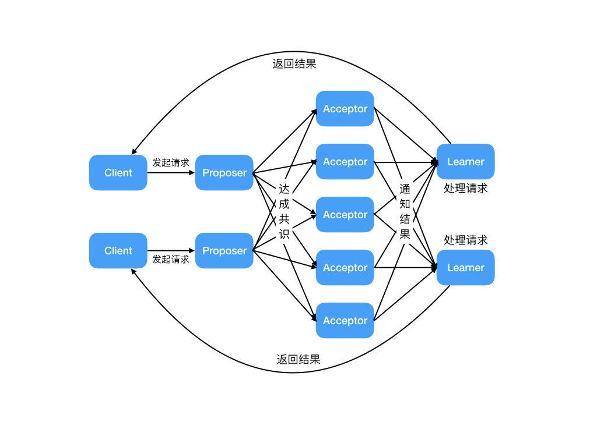

> 摘要：CAP 定理和 BASE 理论，Paxos 算法和 Raft 算法。

<!-- more -->

---

### 目录

[TOC]

## CAP 定理和 BASE 理论

> 分布式系统的最大难点，就是各个节点的状态如何同步。CAP 定理是这方面的基本定理，也是理解分布式系统的起点。
>
> CAP 是分布式系统设计基本定理，BASE 是 CAP 理论中 AP 方案的延伸。
>
> 另外，ACID 是数据库事务完整性的理论。

#### CAP 定理

CAP 定理：对于一个分布式系统来说，当设计读写操作时，只能同时满足CAP中的两个。

1. `Consistency`（**一致性**）：数据在多个副本之间能够保持一致。所有节点访问同一份最新的**数据副本**。
2. `Availability`（**可用性**）：每次请求（非故障的节点）在合理的时间内返回**非错**（不是错误或超时）**的响应**。
3. `Partition Tolerance`（**分区容错性**）：分布式系统出现**网络分区**故障时，仍能对外提供（满足一致性和可用性的）服务，除非整个网络环境都发生了故障。

#### CA 架构

网络分区：分布式系统中，因故障（某些网络节点间不再连通），整个网络分成几块孤立区域。

- （绝大部分时候），没有网络分区（网络分区是正常的），**CA 模型**：即不需保证 P 时，C 和 A 能同时保证。如，集群数据库、xFS文件系统。
- 对于**分布式系统**，分区是必然存在的。当发生**网络分区**时，如果要继续对外提供服务，一定要满足**分区容错性 P**，那么强一致性（`Consistency`）和可用性（`Availability`）只能 2 选 1、只能满足其中一个。如，某个节点在进行写操作：
    1. 为了保证一致性 C， 必须要禁止其他节点的**读写操作**，这和可用性 A 冲突。
    2. 为了保证可用性 A，其他节点的**读写操作**正常的话，和一致性 C 冲突。

#### CP 架构和 AP 架构

1. 一致性 C（**CP 架构**，放弃 A 可用性，如 `ZooKeeper`、`HBase`），用于需确保强一致性的场景，如银行。
    - 常见应用：分布式数据库、分布式锁。
    - 任何时刻对 `ZooKeeper` 注册中心的**读请求**都能得到一致性的结果，但不保证每次请求的可用性，如在 Leader 选举过程中或半数以上的机器不可用时，服务就是不可用的。
2. 可用性 A（**AP 架构**，放弃 C 一致性，如`Cassandra`、`Eureka`尤瑞卡）。
    - 常见应用：Web缓存、DNS。
    - `Eureka` 注册中心中不存在 Leader 节点，**每个节点都是一样的**、平等的。保证即使大部分节点挂掉也不会影响正常提供服务，只要有一个节点可用就行，不过这个节点上的数据可能并**不是最新的**（不保证一致性 C）。
    - 扩展出 BASE 理论。

注意：

- 注册中心 `Nacos `同时支持 CP 和 AP 架构 。

#### BASE 理论

> 分布式事务？

**BASE 核心思想**：即使无法做到强一致性，但每个应用都可根据自身业务特点，采用适当的方式来使系统达到**最终一致性 E**。

- 即，牺牲数据的一致性（`Consistency`）来满足系统的**高可用性**（`Availability`），系统中一部分数据不可用或不一致时，仍需保持系统整体“主要可用”。
- 本质上是对 **AP 方案**的延伸和补充：AP 方案只是在系统发生分区时放弃一致性，而不是永远放弃一致性。在**分区故障**恢复后，系统应达到最终一致性。

BASE：

1. `Basically Available`（**BA 基本可用**） ：指分布式系统在出现不可预知故障时，**允许损失部分可用性**。
    - **响应时间**上的损失：正常情况下，处理用户请求需 0.5s 返回结果，但由于系统出现故障，变为 3 s。
    - **系统功能**上的降级：正常情况下，用户可用系统的全部功能，但由于系统访问量剧增，系统的部分**非核心功能**无法使用。
2. `Soft-state`（**S 软状态**） ：允许系统中的数据存在**中间状态**（CAP 理论中的数据不一致），且不会影响系统的整体可用性，即允许系统在不同节点的数据副本间进行数据同步的过程**存在延时**。
3. `Eventually Consistent`（**E 最终一致性**）：强调的是系统中所有的数据副本、在**经过一段时间的同步后**，最终能达到一致的状态。本质是保证最终数据能达到一致，而不需实时保证。

**最终一致性**的具体方式是：

1. **读时修复** : 在读取数据时，检测数据的不一致，进行修复。如 Cassandra 的 Read Repair 实现，具体来说，在向 Cassandra 系统查询数据时，如果检测到不同节点的副本数据不一致，系统就自动修复数据。
2. **写时修复** : 在写入数据，检测数据的不一致时，进行修复。如 Cassandra 的 Hinted Handoff 实现。具体来说，Cassandra 集群的节点间远程写数据的时候，**如果写失败**就将数据缓存下来，然后定时重传，修复数据的不一致性。推荐，对性能消耗较低。
3. **异步修复** : 最常用的方式，通过定时对账检测副本数据的一致性，并修复。

## Paxos 算法和 Raft 算法

> 分布式算法。

#### Basic Paxos 算法

Paxos 算法：**基于消息传递** 且具有 **高效容错特性** 的一致性算法，目前公认的解决 **分布式一致性问题** 最有效的经典算法之一。

- 但非常难理解和实现。不是一致性算法、而是**共识算法**。

- 描述的是多节点间如何就某个值（提案 Value）达成共识。

Paxos 算法存在 3 个重要的角色：

1. **提议者（Proposer）**：也叫协调者（coordinator），提议者提出提案，用于投票表决。
    - 负责接受**客户端**发起的提议，然后尝试让接受者接受（**达成共识**），同时保证即使多个提议间产生了冲突，算法也能进行下去。
2. **接受者（Acceptor）**：也叫投票员（voter），负责对提议者的提议投票，并接受达成共识的提案。
    - 同时需记住自己的投票历史；向学习者**通知结果**。
3. **学习者（Learner）**：被告知投票的结果，接受达成共识的提案。
    - 如果有超过半数接受者就某个提议达成了共识，那么学习者就需接受这个提议，**处理请求**，作出运算、并将结果返回给客户端。

缺点：假如有多个提议者互不相让，那么就可能导致整个提议的过程进入了**死循环**。

因此，引入了 Multi Paxos 的算法思想。

#### Multi-Paxos 思想

Multi-Paxos **思想**： 在多个提议者的情况下，选出一个Leader（领导者），由领导者作为唯一的提议者，这样就可以解决提议者冲突的问题。核心是通过多个 Basic Paxos 实例，就一系列值达成共识。

1. 针对没有恶意节点的情况，**Raft 算法**、ZAB 协议、 Fast Paxos 算法都是基于 Paxos 算法改进而来；

    - **Raft 算法**是更易理解和实现的分布式一致性算法，是Multi-Paxos的变种。

2. 针对存在恶意节点的情况，一般用工作量证明（POW，`Proof-of-Work`）、权益证明（PoS，`Proof-of-Stake `）等**共识算法**。

    - 共识是可容错系统中的一个基本问题：即使面对故障，服务器也可在共享状态上达成一致。

    - **共识算法**：允许一组节点像整体一样一起工作，即使其中的一些节点出现故障也能继续工作下去。其正确性主要是源于**复制状态机的性质**：一组`Server`的状态机计算相同状态的副本，即使有一部分的`Server`宕机了仍能继续运行。
    - 最典型应用就是区块链，需解决的核心问题是 **拜占庭将军问题**。

#### Raft 算法

`Raft` 是一个 **易于理解的一致性算法**。过程如同选举一样，**参选者** 需要说服 **大多数选民** (Server) 投票给他，一旦选定后就跟随其操作。

- 和 `Paxos` 目标相同，都是为了实现 **一致性** 产生的。`Paxos` 和 `Raft` 的区别在于选举的 **具体过程** 不同。

`Raft` 协议将 `Server` 进程分为三种角色：

1. `Leader`（领导者）：领导者由跟随者投票选出。
2. `Follower`（跟随者）：刚开始没有 **领导者**，所有集群中的 **参与者** 都是 **跟随者**。
3. `Candidate`（候选人）

Raft算法的工作流程：

1. 首先开启一轮大选。在大选期间 **所有跟随者** 都能参与竞选，这时所有跟随者的角色就变成了 **候选人**，民主投票选出领袖后就开始了这届领袖的任期；
2. 然后选举结束，所有除 **领导者** 的 **候选人** 又变回 **跟随者** 服从领导者领导。

参考：[Raft 算法解读](https://github.com/Snailclimb/JavaGuide/blob/main/docs/distributed-system/theorem&algorithm&protocol/raft-algorithm.md)