> 摘要：数据结构中，线性结构有数组、字符串、链表，栈和队列、哈希表，非线性结构有堆、树、二叉树、图。

<!-- more -->

---

## 目录

[TOC]

## 数据结构

> 线性数据结构：数组（字符串）、链表、栈和队列、哈希表；
>
> 非线性结构有：堆、树、二叉树、图。

### 数组

顺序表，支持随机访问。


```
int[] arr = new int[5]; // 声明 + 动态初始化，程序员指定数组长度，由系统初始化每个元素的默认值，此处 int 默认值为0
int[] num = new int[]{1, 2, 3, 5, 8};  // 一般不用，用于刷题返回值
int[] num = {1,2,3,5,8}; // 声明 + 静态初始化，程序员显式指定每个元素的值，由系统决定数组长度

int n = nums.length; // 数组的属性
int n = str.length(); // String 对象的方法

List<Integer> list = new ArrayList<>();
int n = list.size(); // 泛型集合的方法，Vector、List等

// 与index无关的可用for-each
for(char ch : str) {}

// 交换函数，交换数组中两下标位置的元素，必须通过引用来交换，不能直接进行交换
public static void swap(int[] a, int i, int j) {
	int t = a[i];
	a[i] = a[j];
	a[j] = t;
}
public static void main(String[] args) {
    int[] a = { 1, 2, 3, 4, 5 };
    swap(a, 0, 3); // 传入数组的引用，交换下标 0 和 3 位置的数据
    System.out.println(a); // 打印数组的地址，I@1b6d3586
    System.out.println(Arrays.toString(a)); // 打印数组所有元素的真正方法，[4, 2, 3, 1, 5]
}

public static void swap(T[] arr, int i, int j) {
    // Need to add null check and index checks
    List list = Arrays.asList(arr);
    Collections.swap(list, i, j);
    arr = (T[]) list.toArray(); // 刷题返回值，强制类型转换为数组
}
```

##### nSum

nSum：取出数组中 n 个数， 相加之和为 target。

- [1.两数之和 无序数组](https://leetcode.cn/problems/two-sum/)：用 `HashMap<nums[i], i>`。注意`return new int[]{i, j}; return new int[0];`；也可用 `HashMap<target - nums[i], i>`。

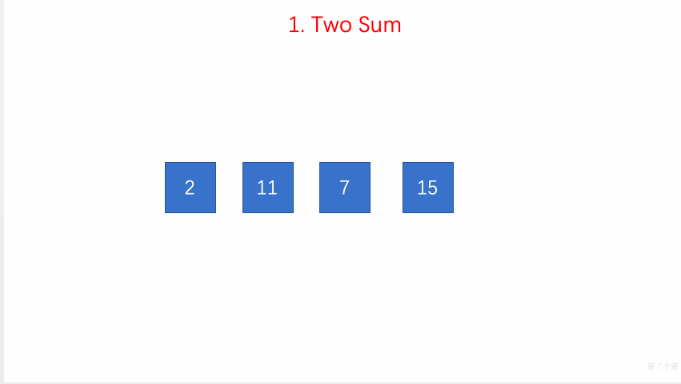

- [167.两数之和 II - 有序数组](https://leetcode.cn/problems/two-sum-ii-input-array-is-sorted/)：两数之和为 `target` 的所有元素对，结果不能出现重复。思路就是**交换排序 + 双指针**，`sum = nums[lo] + nums[hi], 若sum > target 则hi--, 若sum < target 则lo++`；注意跳过重复元素对。

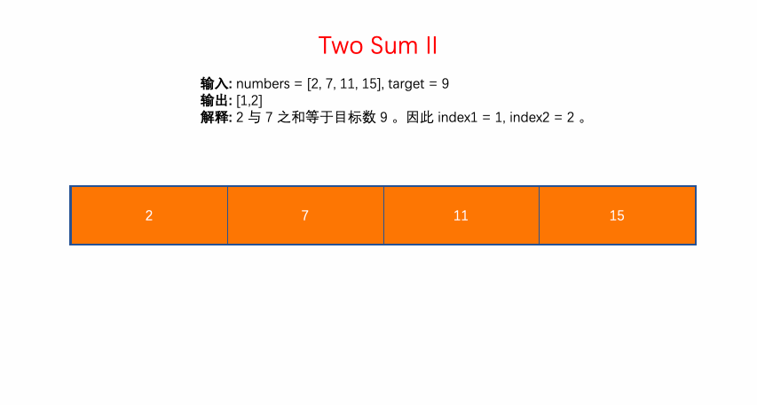

- [15.三数之和](https://leetcode.cn/problems/3sum/)：**nSum框架 = 递归 + 2Sum**，`List<List<Integer> > nSubSum = nSum(nums, n-1, i+1, target-nums[i]);` 表示从 `i+1` 位置开始求 `(n-1)Sum`，加上 `nums[i]` 即为 `nSum` 的结果。

##### 前缀和

前缀和技巧：`preSum[i] = sum(nums[0, ..., i-1])`，表示前 `i-1` 项的累加和。

主要用于：快速计算一个区间内的元素和。

主要适用场景是：不修改原始数组的情况下，**频繁查询**某区间的累加和。时间复杂度降为 `O(1)`。

```
private int[] preSums;

preSums = new int[n + 1];
this.preSums[0] = 0; // 默认为0，可不显式设置
// 构造前缀和
for (int i = 1; i <= n; i++) { // i = 1
	// 表示[0, i-1]位置的累加和
	preSums[i] = preSums[i-1] + nums[i-1]; //注意 i-1
}
```

- [303.sumRange 区域和 - 数组不可变](https://leetcode.cn/problems/range-sum-query-immutable/)：对 `nums[left, ..., right]` 求和，即 `preSums[left+1, ..., right+1]`，通过 `preSums[right+1] - preSums[left]`。


- [304.二维区域和 - 矩阵不可变](https://leetcode.cn/problems/range-sum-query-2d-immutable/)：`preSum[0][0] = 0;` `preSum[i+1][j+1]` 记录 `matrix` 中的子矩阵` [1, 1, i, j]` 的元素累加和，`i, j > 0`。


- [5.1 计数排序](#5.1计数排序)

##### 差分数组

[差分数组](https://labuladong.online/algo/data-structure/diff-array/)主要适用场景是：频繁对原始数组某区间的元素值进行增减。类似环比。

主要用于：快速修改整个区间的元素。

`diff` 数组：`diff[0] = nums[0]`，`diff[i] = nums[i] - nums[i-1]`，表示相邻元素间的差值。

- 恢复到原数组：`nums[i] = nums[i-1] + diff[i]`。
- 对区间 `nums[i..j]` 的元素全部加 3，只需让 `diff[i] += 3`，**再让** `diff[j+1] -= 3` 即可。


##### 有序数组

> 见[二分查找](#二分查找)

##### 二维数组的花式遍历

- [剑指 Offer 04.二维递增数组中二分查找](https://leetcode.cn/problems/er-wei-shu-zu-zhong-de-cha-zhao-lcof/)：从左下角开始遍历，比 `target` 大则向上 `row--`，小则向右 `col++`；用二分查找效率低。类似二叉查找树。
- [54.矩阵的螺旋遍历](https://leetcode.cn/problems/spiral-matrix/)、[剑指 Offer 29. 顺时针打印矩阵](https://leetcode.cn/problems/shun-shi-zhen-da-yin-ju-zhen-lcof/)：收缩四个边界
  - [59.生成螺旋矩阵 II](https://leetcode.cn/problems/spiral-matrix-ii/)【】
- [48.顺时针旋转 90 度图像](https://leetcode.cn/problems/rotate-image/)：沿对角线反转矩阵，再反转每一行。【】

#### 双指针

##### 头尾对向双指针

> 前后相向双指针、[左右指针](#滑动窗口)

- 见 [nSum](#数组)
- 见 [判断全串是否回文](#回文串)
- [344.原地反转字符数组 O(1) 额外空间](https://leetcode.cn/problems/reverse-string/)：数组，双指针 swap()


- [剑指 Offer 21.调整数组顺序使奇数位于前半部分](https://leetcode.cn/problems/diao-zheng-shu-zu-shun-xu-shi-qi-shu-wei-yu-ou-shu-qian-mian-lcof/)：头指针指向第一个偶数，尾指针指向倒数第一个奇数；`while(l < r)`。

##### 背向双指针

- 基本上都是回文串，见 [获取最长回文子串内容](#回文串)

##### 同向双指针

- [88.合并两个有序数组](https://leetcode.cn/problems/merge-sorted-array/)：拉链法，将双指针初始化在数组的尾部，从后向前合并合并到 a1 中，因此不需要新 new 数组，可避免占用多余空间；开始时 a1 的长度即为 `m + n`。用于[归并排序](#4.（2-路）归并排序)。

##### 快慢双指针

- [234.判断回文链表](https://leetcode.cn/problems/palindrome-linked-list/) ：[找链表中点](#回文串)，见回文链表、[链表快慢双指针](#链表快慢双指针)

- [26.**原地**删除有序数组中的重复项](https://leetcode.cn/problems/remove-duplicates-from-sorted-array/)：
  1. ~~快慢指针指向的元素值相等时，就后移快指针；~~
  2. `fast = 1;` 快指针与慢指针值不同时，将快指针的值附到慢指针后 `if(nums[slow] != nums[fast]) nums[++slow] = nums[fast]`（与第一种方法思想不同，实现代码类似）。`slow` 指向结果数组的最后一项，`fast` 指向（后续数组中）不重复的第一项，故要先 `++slow` 。

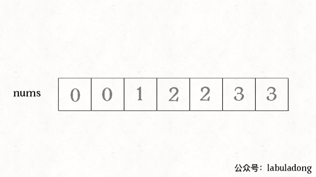

- [27.**原地**移除元素](https://leetcode.cn/problems/remove-element/)：不需单调数组，快指针不为某值时覆盖慢指针。`fast = 0; if(nums[i] != val) nums[slow++] = nums[fast];`
  
  - [283.**原地**移动零](https://leetcode.cn/problems/move-zeroes/)：复用 [27.原地移除元素] 的解法移除所有 0 `int p = removeElement(nums, 0)`，返回 `p` 为移除 0 之后的数组长度；把 p 及其后元素都置为 0，即相当于移动所有 0 到最后。【】
  
  

##### [数组处理滑动窗口](#滑动窗口)

见下字符串中。

##### [二分搜索](#二分查找)

#### 经典例题

- [118.杨辉三角](https://leetcode.cn/problems/pascals-triangle/)：二维 List，输入上一层的元素，生成并返回下一层的元素【】

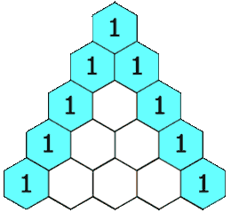

- [349.两个数组的交集](https://leetcode.cn/problems/intersection-of-two-arrays/)：`insert` set 容器 `record` 存储 `a1` 的元素，遍历 `a2` `find` 查找是否有相同的元素，如果有，用 set 容器 `resultSet` 进行存储，用 `iterator` 将 resultSet 转换为 vector 类型。【】

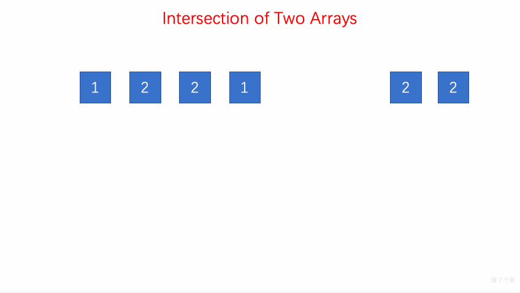


### 字符串

> Java 对字符串的处理较麻烦，见常见类 String 类的常用方法。

##### 回文串

方法一、用数组等能找到**前驱**的数据结构来实现：

1. **判断**全串是否回文 ==> 可用[头尾（对向）双指针](头尾对向双指针)向中点遍历；
    - [9.回文数](https://leetcode.cn/problems/palindrome-number/)：转为字符串，头尾指针同步相向而行，可用一个指针 `i 和 n-i-1` 代替；
    - [125.验证回文串](https://leetcode.cn/problems/valid-palindrome/)：头尾双指针相向而行，忽略字母大小写，用 while 忽略空格、标点；
2. **获取**最长回文**子串**内容：[5.最长回文子串](https://leetcode.cn/problems/longest-palindromic-substring/)
    1. 遍历字符串，获取以 `[i, i]`、`[i, i+1]` 为回文中点的子串；
    2. 判断子串是否回文：传入回文中点 `l` 和 `r` ，向两侧（背向双指针）扩散（遍历判断），`l == r` 时回文子串长度为奇数。
3. ~~根据字符数组构造回文串；~~ 
4. 最长回文子序列：[动态规划](#子序列)
    - 子串：是字符串中连续的一个序列； 
    - [子序列](#子序列)：是字符串中保持相对位置（删除某些字符）的字符序列；
    - 如，`"bbbb"`是字符串`"bbbgb"`的子序列但不是子串。

  ```
  // 1. 判断
  
  // 2. 获取以 s[lo, hi] 为中心的最长回文串，也可用于判断
  String palindrome(String s, int lo, int hi) {
      // 防止索引越界
      while (lo >= 0 && hi < s.length() && s.charAt(lo) == s.charAt(hi)) {
          lo--; // 背向双指针，由中心向两端扩散
          hi++;
      }
      // 返回以 s[初始lo，初始hi] 为中心的、最长回文串[lo+1, hi)
      // lo == hi 时，回文串长度为奇数
      return s.substring(lo + 1, hi);
  }
  ```

方法二、用链表来实现：

  - [链表快慢指针](#链表快慢双指针)技巧
  - **判断**全串是否**回文**：[234.判断回文链表](https://leetcode.cn/problems/palindrome-linked-list/) 对称链表，**经典例题**。

    1. [数组快慢双指针](#快慢双指针)找前半部分链表的尾节点（**链表中点**，奇数找中点前一个节点，偶数找前一个中点）；
    2. 封装函数：（头插法）**反转**后半部分链表；
    3. 遍历短链表（即第二个），比较同向双指针，空间复杂度`O(1)`。
    4. **反转还原**后半部分链表并返回结果。

##### 滑动窗口

左右指针技巧中，把索引**左闭右开**的区间 `[left, right)` 称为一个「窗口」，长度为 `right - left`。方便边界处理， `[0, 0)`中没有元素，`[0, 1)`中有一个元素 0。

滑动窗口：保证每个窗口里字母都是唯一的。双指针的一种，大多与不重复字符有关。

**核心思想**：维护一个左闭右开的窗口，不断滑动，左右指针交替前进（ **不回头** ），更新答案。

- 虽然有嵌套的 while 循环，但时间复杂度依然是 `O(n)`，因为每个元素都只会进入和被移出窗口一次。

滑动窗口**4类经典例题**：

1. [3.无重复字符的最长子串](https://leetcode.cn/problems/longest-substring-without-repeating-characters/)：当 window 内出现重复字符（HashMap 中已有当前字符）时，则调整左边界 `left = Math.max(window.get(ch) + 1, left)`（val 为字符对应的窗口结束位置，`+1`表示被重复字符的右侧）；调整（右移并更新） `right` 边界，更新子串及其长度；`O(N)`

   - [剑指 Offer 48.最长不含重复字符的子字符串](https://leetcode.cn/problems/zui-chang-bu-han-zhong-fu-zi-fu-de-zi-zi-fu-chuan-lcof/)：也可用**动态规划**，但为`N^2`。如 `subDp[i]` 表示 `[0, i]` 区间内最长不含重复字符的子串，`subDp[i] = Math.max(subDp[i-1], longestSub)`，从 i 不断向前遍历可得到 `longestSub` = `(j, i]`，表示以 i 索引位置结尾的不含重复字符的最长子串。

     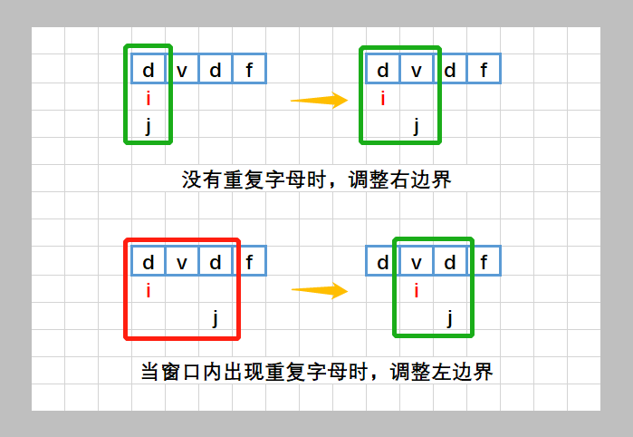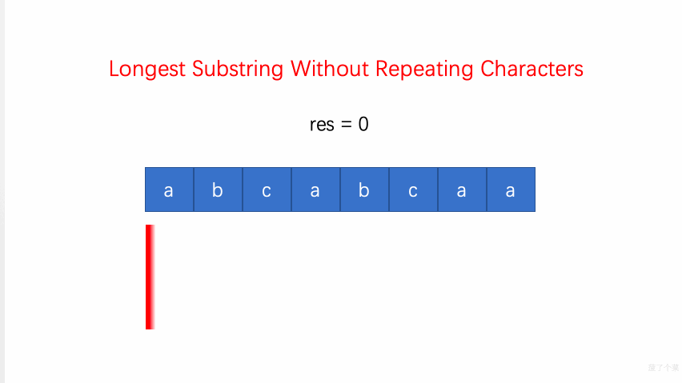

2. 最小窗口：[76.最小覆盖子串](https://leetcode.cn/problems/minimum-window-substring/)：包含`Target`所有字符的、当前字符串`Source`的最短子串；

   - **步骤**：十分**经典**的 `HashMap` 代码

      1. `need` 和 `window` 相当于计数器，分别记录 T 中（需凑齐的）字符数量和窗口中对应字符的出现次数；
      2. 寻找可行解：先不断增加 `right` 指针扩大窗口 `[left, right)`，直到窗口中的字符串符合要求（包含了 `T` 中所有字符）；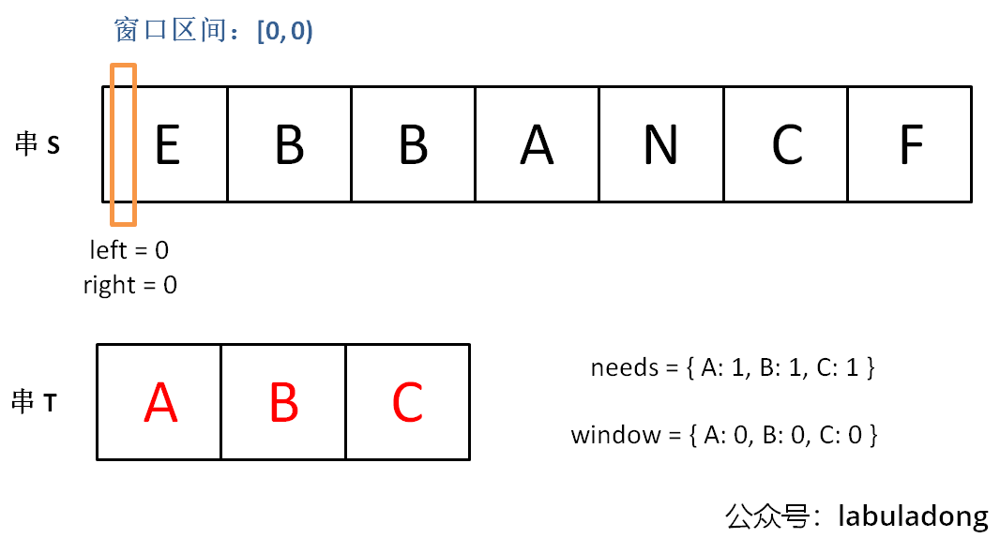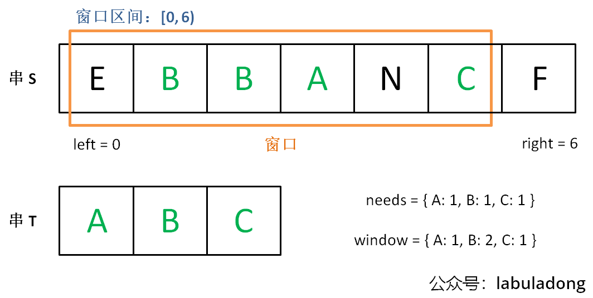
      
      3. 优化可行解：再不断右移 `left` 指针缩小窗口，更新窗口的起始索引及长度，直到窗口不再符合要求（不包含 `T` 中所有字符）。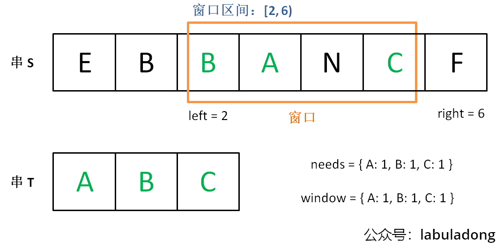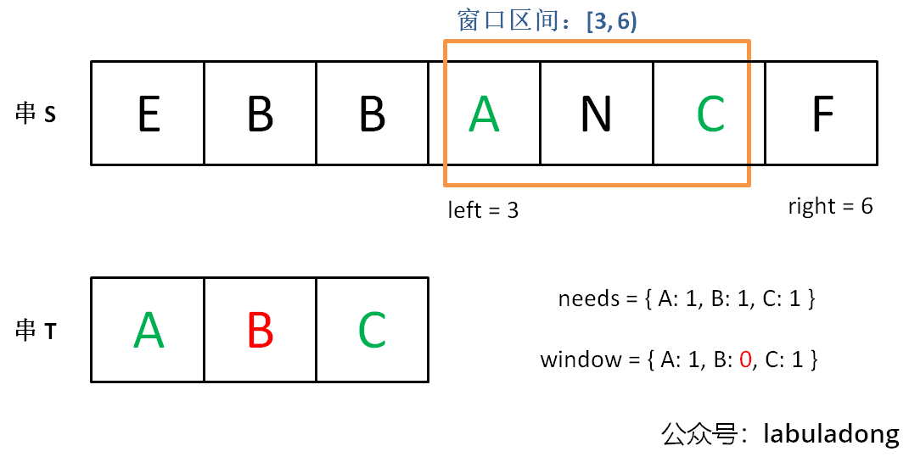

    - [567.字符串的排列](https://leetcode.cn/problems/permutation-in-string/)【】

    - [438.找到字符串中所有字母异位词](https://leetcode.cn/problems/find-all-anagrams-in-a-string/)【】

    - [209.长度最小的子数组](https://leetcode.cn/problems/minimum-size-subarray-sum/)【】
       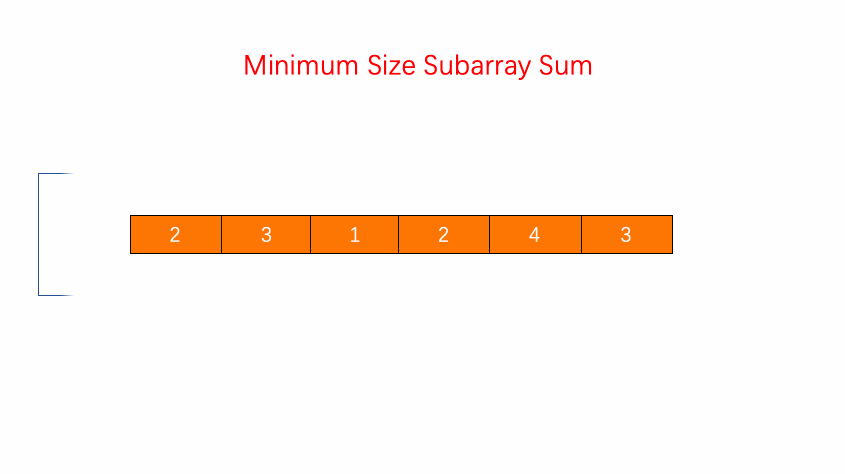

3. [219.存在重复元素 II](https://leetcode.cn/problems/contains-duplicate-ii/)【】

4. [239.滑动窗口中的最大值](https://leetcode.cn/problems/sliding-window-maximum/)【】

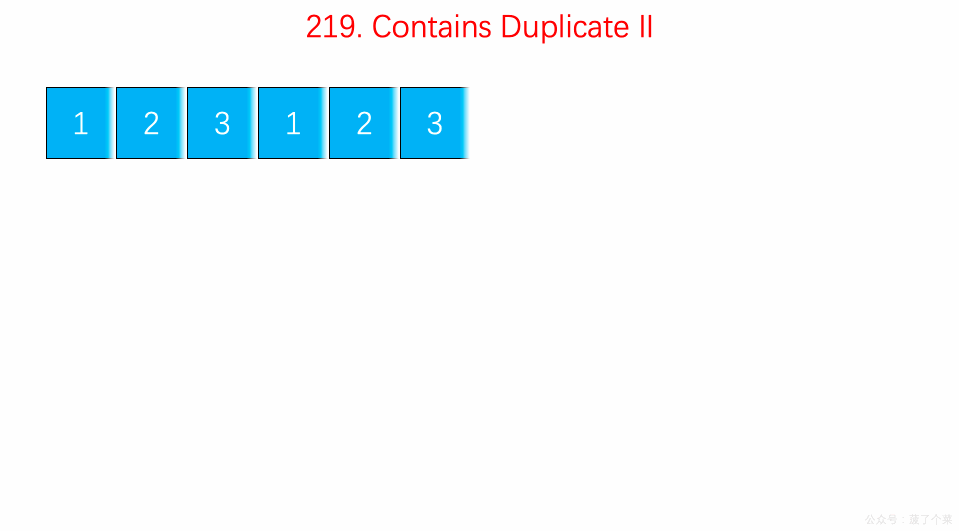

**滑动窗口框架**：

```
/* 滑动窗口算法框架 */
void slidingWindow(string s, string t) {
    // 字符最后一次出现的位置，用map记下每个字符的索引，直接进行跳转
    Map<Character, Integer> window = new HashMap<>();
    // needs 和 window 相当于计数器，分别记录 T 中字符出现次数和窗口中对应字符的出现次数。
    Map<Character, Integer> need = new HashMap<>();
    for (char key : t.toCharArray) { // need.keySet()) {
    	// 不存在则初始化为0，存在则+1
  		need.put(key, map.getOrDefault(key, 0) + 1);
    }
    
    // 表示窗口中满足need条件（包含的T中字符）的个数，valid == need.size 说明窗口已完全覆盖了 T
    int valid = 0;
    for (int left = 0, right = 0; right < n; right++) { // 大多数解法用while，不理解
        // 准备移入窗口的字符
        char inCh = s.charAt(right);
        // 扩大窗口的更新操作
        ...
        // debug 输出窗口的区间位置
        // System.out.printf("[" + left + ", " + right + ")");
        
        // 判断左侧窗口是否要收缩
        while (window 仍满足条件) {
            // 判断是否完全覆盖子串
            // 准备移出窗口的字符
            char outCh = s.charAt(left);
            // 缩小窗口，并更新操作，与扩大对称
            left++;
            ...
        }
    }
}
```

##### 经典例题

- String 类的常用方法：见 String 类；

- 统计字符串中每个字符出现的频率：
  
- 出现次数最多字符
  
- [剑指 Offer 50.第一个未重复的字符](https://leetcode.cn/problems/di-yi-ge-zhi-chu-xian-yi-ci-de-zi-fu-lcof/)
  1. 字符串运算：将所有重复的字符替换为 `""`；
  2. ~~哈希表~~；

- [剑指 Offer 05.替换空格](https://leetcode.cn/problems/ti-huan-kong-ge-lcof/)：常规方法为遍历 `charAt(i)`；

    ```
    StringBuffer res = new StringBuffer();
    return res.toString();

    // 将char转为String，并比较
    String.valueOf(ch).equals(” “)

    str.replaceAll(”\\s“, ”%20“); // 模式匹配
    str.replace(” “， ”%20“);
    ```

- 简化复杂 url

- [14.字符串数组的最长公共前缀](https://leetcode.cn/problems/longest-common-prefix/)：先用 `Arrays.sort(strs)` 为字符串数组升序排序，再从前往后遍历、对比第一个和最后一个字符串的字符。

- [415.字符串相加](https://leetcode.cn/problems/add-strings/)：[链表位运算 两数逐位相加](#链表双指针)【】

  - [剑指 Offer 67.把字符串转换成整数](https://leetcode.cn/problems/ba-zi-fu-chuan-zhuan-huan-cheng-zheng-shu-lcof/)【】

    ```
    StringBuffer ans = new StringBuffer();
    while (i >= 0 || j >= 0 || add != 0) {
  	    int x = (i >= 0) ? num1.charAt(i) - ’0‘ : 0;
    }
    // 答案需翻转
    ans.reverse();
    ```

- [剑指 Offer 58-I.翻转单词顺序](https://leetcode.cn/problems/fan-zhuan-dan-ci-shun-xu-lcof/)
  1. 常规方式：将字符串 `s` 按空格 `split` 成若干单词，然后 `reverse` ，把单词 `join` 成句子。用了额外的空间。
  2. 原地翻转：将字符串 `s` 反转，然后将每个单词分别反转再 `join()`；
  3. 用**正则匹配**分割单词，放入String数组，反转数组再 `join()`。
  
- [剑指 Offer 58-II.左旋转字符串](https://leetcode.cn/problems/zuo-xuan-zhuan-zi-fu-chuan-lcof/)：字符串前 n 位原地移动到尾部；

  1. 切片函数 + 拼接；
  2. `StringBuilder()`，用 i 遍历 `[n, len + n]` ，取余 `i % len`。

##### KMP 字符串~~模式~~匹配算法

“暴力搜索”会反复回溯主串，导致效率低下，而 KMP 算法可利用已遍历部分匹配这个有效信息（部分匹配表），保持主串上的指针不回溯；通过修改子串的指针，让模式串尽量移动到有效的位置。

- 应用了贪心算法。用来解决字符串查找的问题，可在字符串（S）中查找子串（W）、模式串（P）出现的位置。
- 把字符匹配的时间复杂度缩小到 `O(m + n)` ，空间复杂度也只有 `O(m)`。


根据**部分匹配表**（`next` 数组），最后一个匹配字符B（在已匹配的字符串中）对应的"部分匹配值"为2。移动位数 = 已匹配的字符数 - 对应的部分匹配值。

- 前缀：指除了最后一个字符外，字符串的全部连续字符组合；
- 后缀：指除了第一个字符外，字符串的全部连续字符组合。
- 部分匹配值："前缀"和"后缀"的最长共有元素的长度。
  - 如`"ABCDA"`的前缀为`[A, AB, ABC, ABCD]`，后缀为`[BCDA, CDA, DA, A]`，共有元素为`"A"`，长度为1；
- "**AB**CD**AB**"中有两个`"AB"`，"部分匹配值"就是 2（"AB"的长度）。搜索词移动时，第一个`"AB"`向后移动4位（字符串长度-部分匹配值），就可来到第二个"AB"的位置。
- [字符串匹配的KMP算法 阮一峰](https://www.ruanyifeng.com/blog/2013/05/Knuth%E2%80%93Morris%E2%80%93Pratt_algorithm.html)

### 链表

> 数组 VS 链表 、ArrayList VS LinkedList。链表相关的题目套路比较固定，主要是双指针技巧。

#### 头指针 VS 虚拟头结点

指针：Java 语言中不存在指针，但可理解为`引用`。

- 指针丢失：指针没有明确指向。

- 内存泄漏：结点不判空就操作 `next` 域等，导致空指针异常。

头结点：在单链表的第一个结点前附加一个结点，称为头结点。头结点的 `Data` 域可为空，仅包含 `next` 域；也可记录表长等信息。

头指针：指向链表的第一个节点，通常用来标识一个链表，如单链表 `L`。

- **若不带头结点**：
  - 头指针指向第一个节点的存储位置；
  - 判空：头指针为 `null`（Java 区分大小写，且所有关键字都是小写）时表示一个空链表。

- 若带头结点：
  - 头指针指向头结点的存储位置；
  - 判空：头结点的 `next` 域为 `null` 时为空链表。

优点：统一头/非头节点、空/非空链表的操作。

- 第1个节点位置的插入、删除与其他位置的操作保持一致。

```
 // 通常在链表头部加入哨兵(作为头结点)，使删除的代码保持一致，不用额外考虑删除第一个节点的情况
 // 虚拟头结点技巧，插入 dummy 哑节点，用dummy.next表示真正的头节点，可避免处理头节点为null的边界问题
 ListNode dummy = new ListNode(-1);
 dummy.next = head;
 ....
 return dummy.next;
```

判断**边界** / 特殊情况:

1. 链表为空时，判空；
2. 链表只包含一个、两个结点时；
3. 在处理头结点和尾结点时。

#### 链表快慢双指针

单链表大部分都适用[数组快慢双指针](#快慢双指针)技巧。

```
// 快慢指针初始化指向 head
ListNode slow = head, fast = head;
```

1. [剑指 Offer 22.查找倒数第k个节点](https://leetcode.cn/problems/lian-biao-zhong-dao-shu-di-kge-jie-dian-lcof/)：即正数第 `n - k + 1` 个结点，但 `n` 无法直接得到（计算链表的 length、栈），可用快慢双指针；注意 `k > n` 时应返回 `null`。
   - 虚拟头结点技巧：为了防止空指针，如链表共有 5 个节点，删除倒数第 5 个（即正数第一个）节点，需先找到倒数第 6 个节点，但第一个节点前已没有节点。
   - [876.链表的中间结点](https://leetcode.cn/problems/middle-of-the-linked-list/)：慢指针走一步，快指针走两步。`while (fast != null && fast.next != null)`。偶数返回第一个节点。
     
     - [143.重排链表](https://leetcode.cn/problems/reorder-list/)：找**链表中点**，**合并**原链表的左半端和**反转**后的右半端【】；改变链表内部值。
- [19.删除倒数第 K 个结点](https://leetcode.cn/problems/remove-nth-node-from-end-of-list/) ：调用查找函数，获取倒数第 `k + 1` 个结点的引用，删除后继结点；
  
   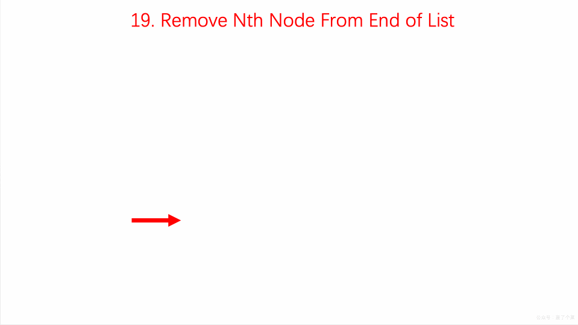
   
      ```
      // 删除倒数第 k 个，要先找倒数第 k + 1 个节点
      ListNode pre = findKthFromEnd(dummy, k + 1);
      ```
   
2. **判断回文链表**：见字符串中的[回文串](#回文串)；

3. [141.检测链表中是否有环](https://leetcode.cn/problems/linked-list-cycle/)：`slow` 和 `fast` 指针相遇即有环；【】
   - [142.环形链表 II 找环起点](https://leetcode.cn/problems/linked-list-cycle-ii/)： 遍历 `fast` 直到链表尾部，`fast` 为 `slow` 的两倍速迟早会追上，`fast、slow` 相遇（位置一定在环内）即跳出循环；无环则 `fast、slow` 将相继到达链表尾部，相遇时均为 `null`；有环则 `fast` 指针在环内， `slow` 以 `head` 为起点重新开始，`fast、slow` 第二次相遇即为环起点；环起点不一定在 `head`；

      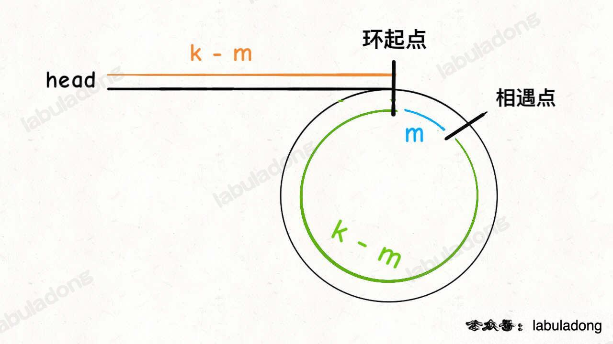

4. [160.相交链表](https://leetcode.cn/problems/intersection-of-two-linked-lists/)：判断两单链表是否相交；【】

   - [剑指 Offer 52.两链表的第一个公共节点](https://leetcode.cn/problems/liang-ge-lian-biao-de-di-yi-ge-gong-gong-jie-dian-lcof/)：找出交点（第一个公共结点）；

      - 方法一：用 `HashSet` 记录一个链表的所有节点，和另一条链表对比，缺点是需额外空间；
      - **方法二**：在逻辑上拼接两条链表，让 `pa` 遍历完链表 `A` 后开始遍历链表 `B`，`if (pa == null) { pa = headB;}`，`pb` 遍历完链表 `B` 后开始遍历链表 `A`，此时二者长度相等，且 `pa` 和 `pb` 能同时到达相交节点 `c`。空间复杂度 `O(1)`。
      - 方法三：两条链表首尾相连，问题转换成了「寻找环起点」。
      - 方法四（常规思路）：预先计算两条链表的长度，较长的链表 `fast` 指针先走，使 `p1` 和 `p2` 到达尾部的距离相同，`p1 == p2` 且不为空时即相交。

     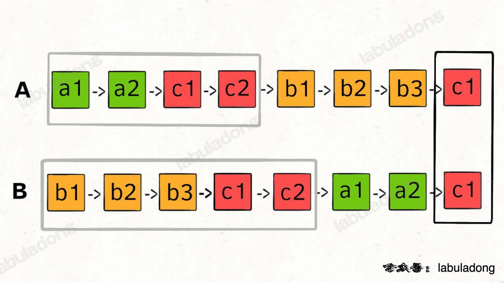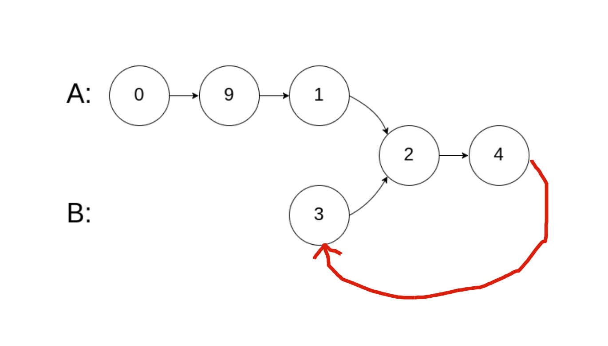

5. 循环左移

#### 链表双指针

- [剑指 Offer 25.合并两个排序的链表](https://leetcode.cn/problems/he-bing-liang-ge-pai-xu-de-lian-biao-lcof/)：拉链法 / 归并法 [（2-路）归并排序](#4.（2-路）归并排序)

   - 23.合并K个升序链表：[第K个元素](#第K个元素)

   ```
   // 虚拟头结点
   ListNode dummy = new ListNode(-1);
   // 合并后l1、l2最多只有一个非空，直接将链表末尾指向未合并完的链表
   p.next = (l1 == null) ? l2 : l1;
   ```

- 链表整数位运算
  
   - [2.逆序链表按位表示整数 两数逐位相加 链表求和](https://leetcode.cn/problems/add-two-numbers/)：carry 表示进位；
   
      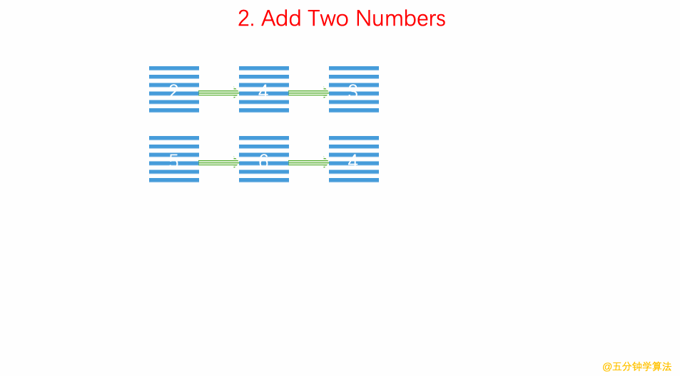
  
- [328.拆分链表的奇偶节点](https://leetcode.cn/problems/odd-even-linked-list/)：`odd、even` 奇偶双指针交替前进；`even.next` 不能为空；`odd.next = evenhead`；

   - [86.按序三等分链表](https://leetcode.cn/problems/partition-list/)【】

   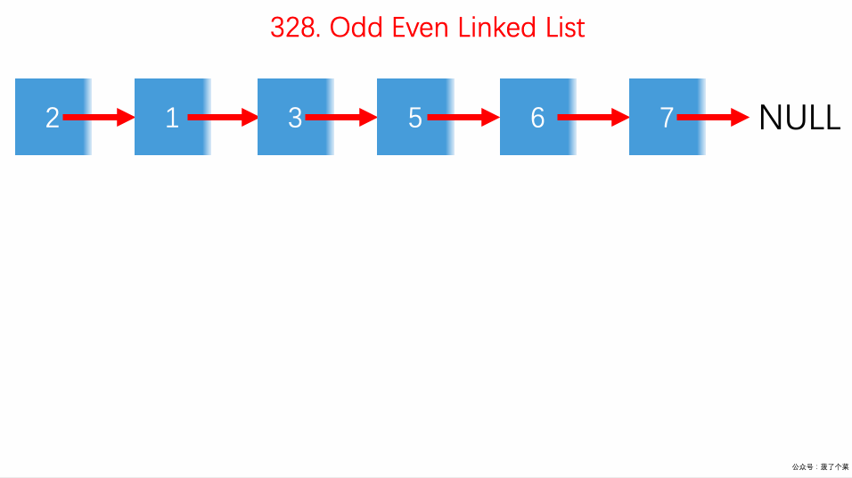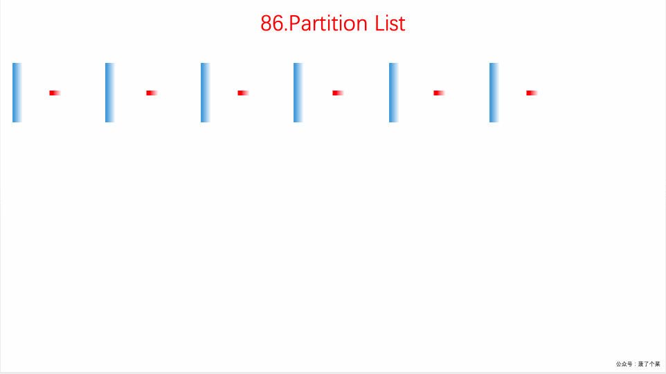

- [148.链表插入排序](https://leetcode.cn/problems/sort-list/)：【】
- [42.接雨水总数](https://leetcode.cn/problems/trapping-rain-water/)：【】

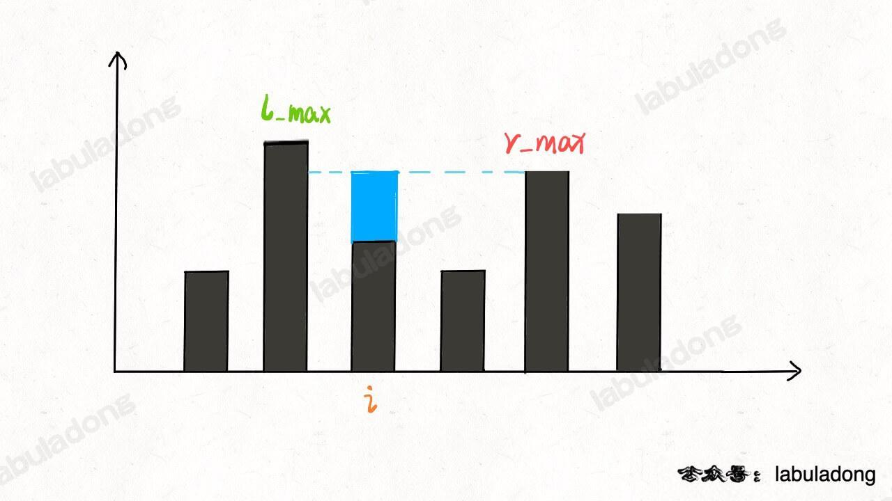

```
water[i] = min(
           # 左边最高的柱子
           max(height[0...i]),
           # 右边最高的柱子
           max(height[i...end])
        ) - height[i]
```

#### 经典例题

- [206.反转链表](https://leetcode.cn/problems/reverse-linked-list/)

  1. **头插法**：不申请额外空间，就地反转，空间复杂度 `O(1)`；
  2. 反转 => 栈：[剑指 Offer 06. 从尾到头打印链表](https://leetcode.cn/problems/cong-wei-dao-tou-da-yin-lian-biao-lcof/)；
  3. 递归：

     - [92.反转链表 II 指定区间](https://leetcode.cn/problems/reverse-linked-list-ii/)：【】
       1. 迭代解法很简单，用一个 for 循环反转链表区间即可；
       2. 常用来考察**纯递归**的形式。
     - [25.K 个一组翻转链表](https://leetcode.cn/problems/reverse-nodes-in-k-group/)：`reverseKNode` **原地反转** `[head, tail)` 区间的元素，递归反转后续链表并连接起来。

       - [24.两两交换链表中的节点](https://leetcode.cn/problems/swap-nodes-in-pairs/)：相当于 `K = 2` 的特殊情况，可用简化的多指针；【】

       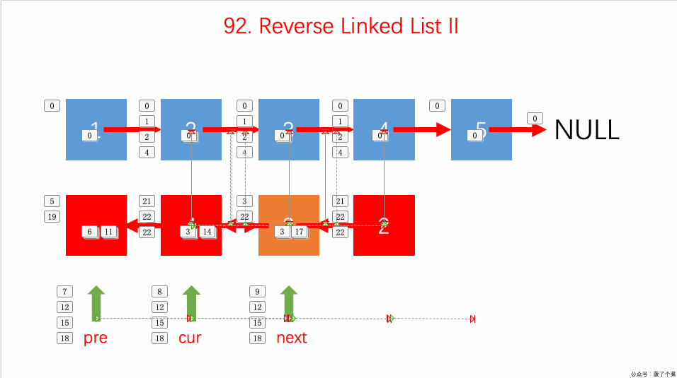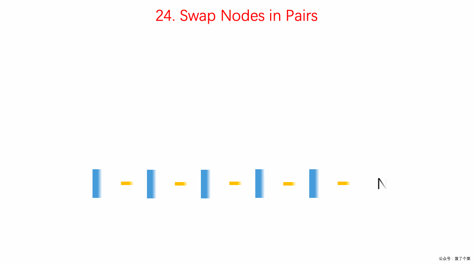

- [剑指 Offer 35.复杂链表的深拷贝 random 指针](https://leetcode.cn/problems/fu-za-lian-biao-de-fu-zhi-lcof/)：

  1. HashMap + 递归；
  2. 第一次遍历复制并后插，第二次复制随机指针并分离链表【】；

    

- [237.删除链表中的特定节点](https://leetcode.cn/problems/delete-node-in-a-linked-list/)：不给头结点，只给要被删除的节点；前后节点交换值，删后继。【】

   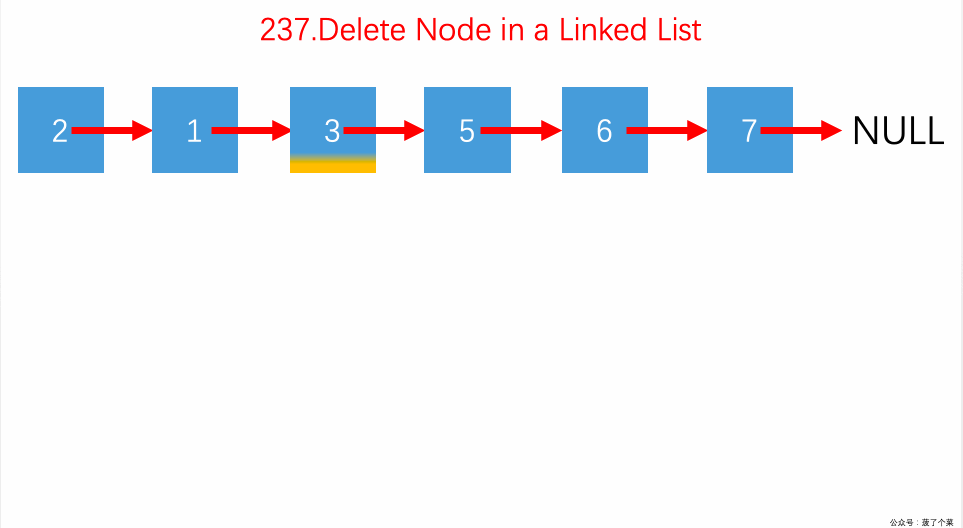


- ~~奇数位升序，偶数位降序，要求输出全局升序，不用数组~~
- 双向链表
- **前插**：右下（指向后继）+ 顺时针
  - 后插：左下 + 逆时针
  - 删前驱：
- 循环链表
- 双向循环链表

```
/* 迭代遍历单链表 */
for (ListNode p = head; p != null; p = p.next) {
}

/* 递归遍历单链表 */
void traverse(ListNode head) {
    if (head == null) {
        return;
    }
    // 前序位置
    traverse(head.next);
    // 后序位置
    /* 倒序打印链表元素 */
    print(head.val);
}
```

#### 跳表

跳表（Skip List）：基于链表实现的有序列表，使得包含n个元素的有序序列的**查找和插入**操作的平均时间复杂度都是 O(logn)，优于数组的 O(n)复杂度。对并发友好。

实现：快速的查询效果是通过维护一个多层次的**链表**（`ConcurrentSkipListMap`）实现的，实现了快速查询效果将平均时间复杂度降到了O(logn)。这是一个典型的用空间换时间数据结构。

缺点：就是“以空间换时间”方式存在一定数据冗余。

应用：**Redis**中的有序集合对象的底层数据结构就使用了跳表。

### 栈、队列

##### 栈

栈常用一维数组或链表来实现：

- 用数组实现的栈叫作 顺序栈，
- 用链表实现的栈叫作 **链式栈** 。

```
Deque<Integer> stack = new LinkedList<>();
stack.push(1);
Integer x = stack.pop();

Stack<Character> stack = new Stack<>();
```

##### 队列

队头（front）出队，队尾（rear）入队；

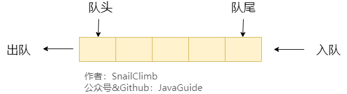

1. 顺序队列（数组实现）：存在“假溢出”的问题（即明明有位置却不能添加）。因为在数组中 `front` 和 `rear` 会持续向后移动，无法返回数组起始位置，数组长度固定，导致数组越界、前端有大段空白。

   - 队列空：`front == rear` ；
   - 队列满：`rear - front == QueueSize`；
   - 循环队列：可解决假溢出和越界问题。

      - 队列空：`front == rear` ，排除队列溢出的情况；
      - 队列满： `(rear + 1) % QueueSize == front`，即 `rear` 在 `front` 前一个位置 。

         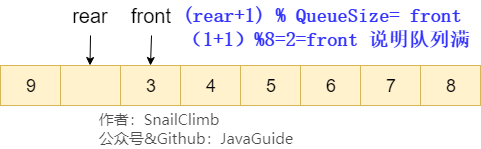
2. 链式队列（链表实现）

常用于：

1. 阻塞队列；
2. 线程池中的请求/任务队列；
3. Linux 内核进程队列；
4. 消息队列；

##### Deque 双端队列

> 集合框架，用于实现栈和队列。

##### PriorityQueue 优先队列

出队顺序按照优先级的队列；常用于找最值，往往用[二叉堆](#堆)来实现。用于有动态添加、删除数据且需获得最值的场景。手撕算法典型题包括：

1. [堆排序](#3.2堆排序)；
2. [第K个元素](#第K个元素)；
3. [带权图的遍历](#图的搜索、遍历)等。

要理解以下关键点：

1. 优先级队列是一种能自动排序的数据结构，增删元素的复杂度是 `O*(log*N)`，底层使用二叉堆实现。
2. 二叉堆是一种拥有特殊性质的完全二叉树。
3. 优先级队列（二叉堆）的核心方法是 `swim, sink`，用来维护二叉堆的性质。

至少需支持下述操作：

1. 插入带优先级的元素（offer/insert_with_priority）；
2. 查看或取出最高优先级的元素（peek、`poll/pull_highest_priority_element`）；

其它可选的操作：

1. 清空优先队列；
2. 调整一个元素的优先级；
3. 批量插入元素；
4. 检查优先级高的一批元素；
5. 合并多个优先队列；

##### 单调栈、单调队列

单调栈：每次新元素入栈后，栈内的元素都保持有序。用途不广，只处理一类典型的问题。

- 用于：快速计算下一个更大/更小元素、上一个更大/更小元素。

单调队列：普通队列 + api，用于快速计算整个队列的最大/最小值。


- [496.下一个更大元素 I](https://leetcode.cn/problems/next-greater-element-i/) ：由后往前对比数组元素和栈顶，逐个弹出，插入目标元素后再逐个入栈【】

##### 经典例题

- [232.用栈实现队列](https://leetcode.cn/problems/implement-queue-using-stacks/)：如用两个栈实现浏览器的回退和前进功能。
  1. `queue()` 构造：new 新栈 `stackIn`（s1）和 `stackOut`（s2）；
  2. 队尾（rear）入队（`push/offer/add`）：`stackIn.push(x)`入栈；
  3. 查看队头（peek）：如果 `stackOut` 为空，则`stackIn` 全部倒入 `stackOut`；栈顶 `top()` 即为队头；
  4. 队头（front）出队（`pop/poll/remove`）：先调用 `peek()` 保证 `stackOut` 非空，`stackOut`出栈；出队结束，`stackIn` 为空也不必重新倒回；
  5. `isEmpty()` 判空：`stackIn` 和 `stackOut` 均为空。

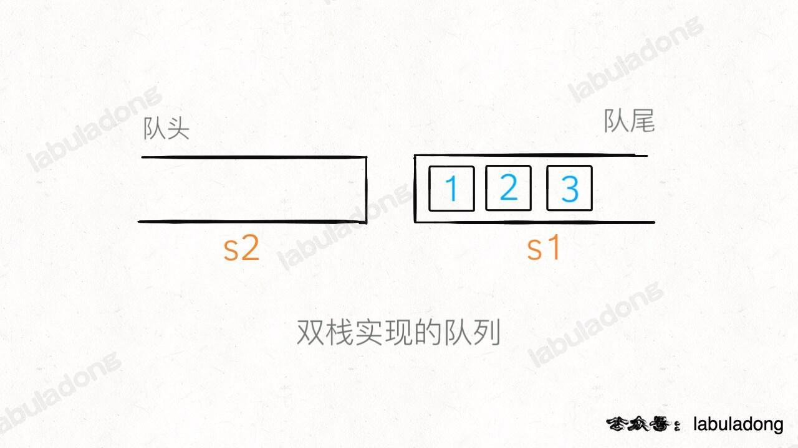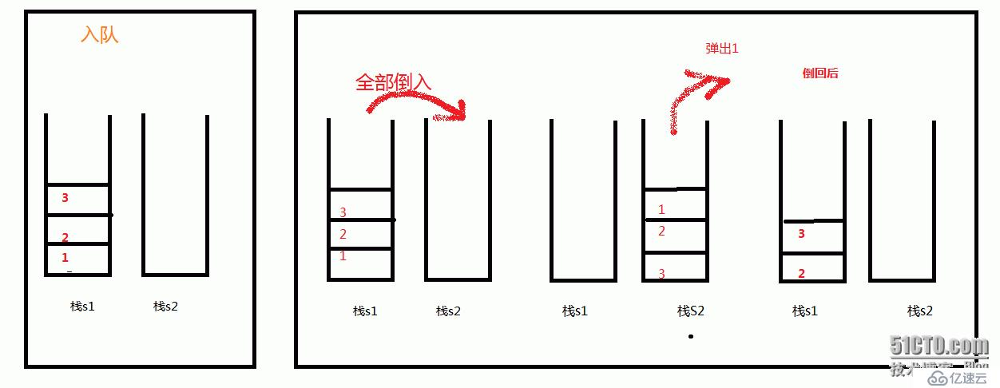

- [225.用队列实现栈](https://leetcode.cn/problems/implement-stack-using-queues/)：只需一个队列；
  1. `stack()`构造：`sz = 0`，重新塞入时用于计数；
  2. `push(x)` 入栈：`queue.offer(x)`入队；或维护 `topElem = x` 栈顶元素，x 是队列的队尾，是栈的栈顶 `topElem`；
  3. `pop()` 弹出栈顶：把队尾元素移到队头（把队尾前的所有元素出队再重新塞到队尾，顶过去），原队尾（现队头）`poll()`出队；或返回 `topElem`，更新 `topElem` 为新队尾元素；
  4. `top()` 查看栈顶：调用 `pop()` 弹出队尾元素（栈顶元素）后恢复（把队尾元素再次塞入队尾），`sz++`；
  5. `isEmpty()` 判空：`queue.isEmpty()`。

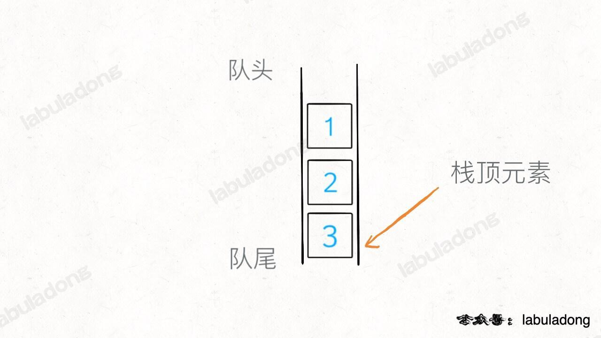

- [20.判断有效的成对括号](https://leetcode.cn/problems/valid-parentheses/)：`Stack` 保存所需的**右**括号 + HashMap 存左右括号对应关系方便查表，若 `ch` 为左括号，则将**对应右括号**入栈，若为右括号，则与栈顶元素对比；
  
  1. [921.使括号有效的最少添加](https://leetcode.cn/problems/minimum-add-to-make-parentheses-valid/)、[1541.平衡括号的最少插入次数](https://leetcode.cn/problems/minimum-insertions-to-balance-a-parentheses-string/)【】：计算多出的 `(` 或 `)`，`need` 变量记录对右括号的需求数，`(` 则 `need++`，`)` 则 `need--`；当 `need == -1` 时，意味着遇到一个多余的右括号，显然需插入一个左括号。
  2. [1614.计算括号的最大嵌套深度](https://leetcode.cn/problems/maximum-nesting-depth-of-the-parentheses/)：`depth++` 时，更新 `maxDep = Math.max(maxDep, depth)`；
  3. [1111.根据嵌套深度 分成两个不相交的有效括号字符串](https://leetcode.cn/problems/maximum-nesting-depth-of-two-valid-parentheses-strings/)：【】
  
  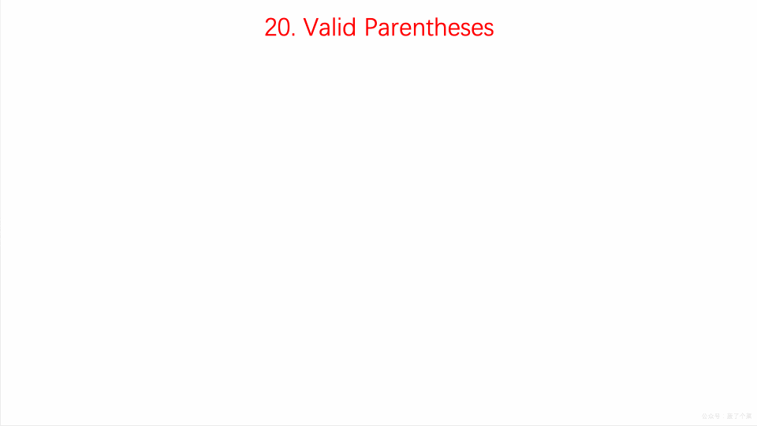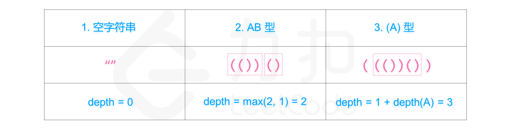
  
- 中缀表达式->后缀：根据中序结果构造二叉树，打印后序结果；

  - [剑指 Offer 31.根据入栈序列、推断弹出序列](https://leetcode.cn/problems/zhan-de-ya-ru-dan-chu-xu-lie-lcof/)：每次入栈后，弹出所有符合**弹出序列顺序**的栈顶元素；
  - [150.逆波兰表达式求值](https://leetcode.cn/problems/evaluate-reverse-polish-notation/)：用栈计算后缀表达式；

  


- [316.去除重复字母](https://leetcode.cn/problems/remove-duplicate-letters/)：【】
  1. `bool[] inStack` 布尔数组保证栈中元素不重复；
  2. 栈保证字符出现的顺序；
  3. 类似单调栈的思路，配合计数器 `count` 不断 pop 掉不符合最小字典序的字符。
- 反转字符串：还可用[背向双指针](#背向双指针)

### 哈希表

> 哈希表和常说的 Map（键值映射）是不是同一个东西？不是。

哈希表、**散列表**（Hash Table）：用于存储**键值对**。

原理：哈希表的本质是**数组 + 哈希函数**。通过**散列函数**把键映射到一个**数组**（散列表）里，得到数组的索引，进而**直接访问**（快速存取）索引位置的值。+ 解决哈希冲突。

- 散列表：存放记录的数组。只不过数组存放的是单一的数据，而哈希表中存放的是键值对。
- 哈希函数（哈希算法、散列函数、映射函数）：
    1. 作用是把任意长度的输入（键 key）转化成固定长度的输出（数组的索引）。
    2. 还要保证索引是合法的：输入相同的 `key`，输出也必须要相同，这样才能保证哈希表的正确性。
- 用于查找。


缺点：

1. 哈希冲突；
2. 最大缺点是：Hash 索引不支持**顺序**和范围查询。hash 表存储的是**无序数据**，范围查找时需遍历，**遍历**比较耗费时间。
3. 将所有的数据文件添加到内存，比较耗费**内存**空间。

#### 哈希冲突与扩容

哈希冲突、哈希碰撞：不同的 key 通过**哈希函数**可能得到**相同的索引值**。

哈希冲突是否可以避免？

- 哈希冲突**不可能避免**，只能在算法层面尽量处理。

- 哈希冲突是一定会出现的，因为这个 `hash` 函数相当于是把一个无穷大的空间映射到了一个有限的索引空间，所以必然会有不同的 `key` 映射到同一个索引上。

解决方法：~~JDK1.8 前 `HashMap` 用链地址法解决，JDK1.8 后 `HashMap` 用**红黑树**（数组 + 二叉树）；~~

1. **拉链法**（纵向延伸思路）：**数组 + 链表**，哈希表的底层数组并不直接存储 `value` 类型，而是存储一个链表，当有多个不同的 `key` 映射到了同一个索引上，这些 `key -> value` 对儿就存储在这个链表中。需**额外的空间**存指针。
2. **开放寻址法**思想（横向延伸思路）：数组特性，如果通过哈希函数**计算出的索引**所对应的空间已经被占用了，就再找一个还没被占用的空间将数据存进去。
    1. **线性探查法**：继续向后一个位置找（连续寻址），直到**找到空闲位置**为止。
    2. 双重哈希法：继续用第二个哈希函数来计算索引，第二个被占用就用第三个，以此类推，直到计算出没被占用的空间对应的索引。
3. 可以通过**哈希表扩容**来减少哈希冲突。


##### 哈希表扩容

**负载因子**、装载因子（load factor）：已插入元素的数量除以数组容量。用于**衡量哈希冲突**的严重程度，也常作为哈希表扩容的**触发条件**，装载因子超过某一**阈值**时就进行扩容。

- 例如在 Java 中，当负载因子超过 0.75 时，系统会将哈希表扩容至原先的 2 倍。

哈希表扩容时：缺点、过程

1. 需将所有键值对从原哈希表**迁移至**新哈希表，非常耗时；
2. 并且由于哈希表**长度改变**，需要（通过哈希函数来）**重新计算**所有键值对的存储位置，这进一步增加了扩容过程的计算开销。

为此，编程语言通常会预留足够大的哈希表容量，防止频繁扩容。

#### 哈希表的性质

##### `key` 是唯一的，`value` 可以重复

哈希表中，不可能出现两个相同的 `key`，而 `value` 是可以重复的。

> 直接类比数组就行

##### 为什么增删查改效率是 O(1)？

- 因为哈希表底层就是操作一个**数组**，其主要的时间复杂度来自于**哈希函数**计算索引和哈希冲突。

- 正常情况下，只要保证哈希函数的复杂度在 O(1)，且合理解决哈希冲突的问题，那么增删查改的复杂度就都是 O(1)。
- 哈希表的增删查改效率**不一定是 O(1)** 。如果使用了错误的 `key` 类型，比如用 `ArrayList` 作为 `key` ，那么哈希表的复杂度就会**退化**成 O*(*N)。

##### 哈希表的遍历顺序可能会变化

哈希表中键的遍历顺序是**无序的**，**不能依赖**哈希表的遍历顺序来编写程序。

两个原因：

1. 由于**哈希函数**对 `key` 进行映射，所以 `key` 在底层 `table` 数组中的分布是随机的，不像数组/链表结构那样有个明确的元素顺序。
2. 因为哈希表在达到**负载因子**时会**扩容**，会导致哈希表底层的**数组容量变化**，哈希函数计算出来的索引也会变化，所以哈希表的遍历顺序也会变化。

##### 一定要用不可变类型作为哈希表的 `key`

> 所谓不可变类型，就是说这个对象一旦创建，它的值就不能再改变了。比如 Java 中的 `String, Integer` 等类型。

- 因为哈希表的主要操作都依赖于哈希函数计算出来的索引，如果 `key` 的哈希值会变化，会导致**键值对意外丢失**，产生严重的 bug。

##### 加强哈希表

- 用链表加强哈希表：LinkedHashMap
- 用数组加强哈希表：ArrayHashMap

#### 经典例题

- [169.求众数：出现次数大于 n/2 的元素](https://leetcode.cn/problems/majority-element/)【】

  1. 哈希表法：`O(n)`；
  2. 摩尔投票法：计数器，计数器为 0 时，假设 nums[i] 就是众数；遇到相同元素则 `++`，遇到不同元素则 `--`，空间`O(1)`【】

  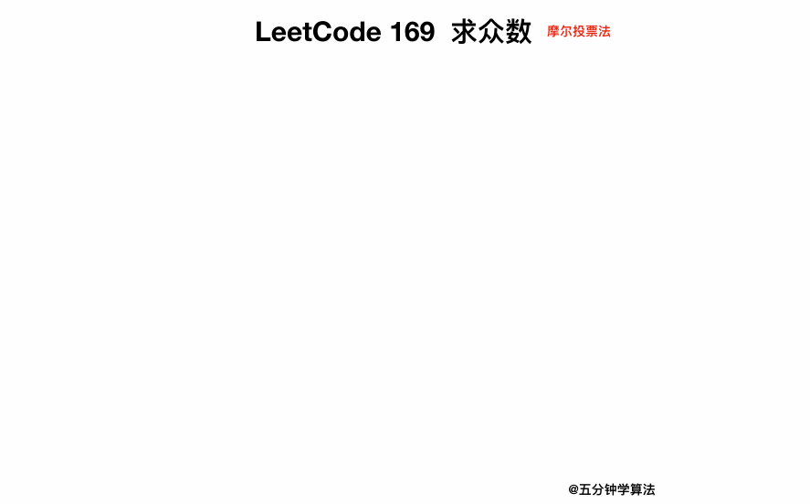

### 堆

##### 定义

堆是一种树，任意一个节点的值都 `>=`（或 `<=`）其所有子节点的值。

- 最大堆
- 最小堆

用途：用于只关心最值：**多次**插入数据或 pop 最值后，再**多次获取**剩余元素的最（最大或最小）值（插入/删除 + 全体排序耗费资源太多）。

- 二叉堆的关键应用是**[Pri’orityQueue 优先级队列](#队列)**。如下面的[23.合并K个升序链表](https://leetcode.cn/problems/merge-k-sorted-lists/)。

##### 优势

相对于有序数组，堆的主要优势在于更新（插入或删除）数据效率较高。

1. 初始化：有序数组用排序算法；堆为`nlg(n)`；
2. 查找最值： 都是`O(1)`；
3. 更新（插入或删除）数据： `O(n)`，二分法为 `lg(n)` + 移动数据 `O(n)` ；堆为`lg(n)`。

##### 堆的存储

通常用**完全二叉树**的形式来表示、存储堆。也不一定全都是完全二叉树，如斐波那契堆和二项堆。

用[数组存储二叉树](#二叉树的存储)既节省空间，又方便索引。

```
PriorityQueue<Integer> pq = new PriorityQueue<>();
pq.offer(e); // 插入堆
int e = pq.poll(); // 删除/弹出堆顶元素
```

##### 插入元素

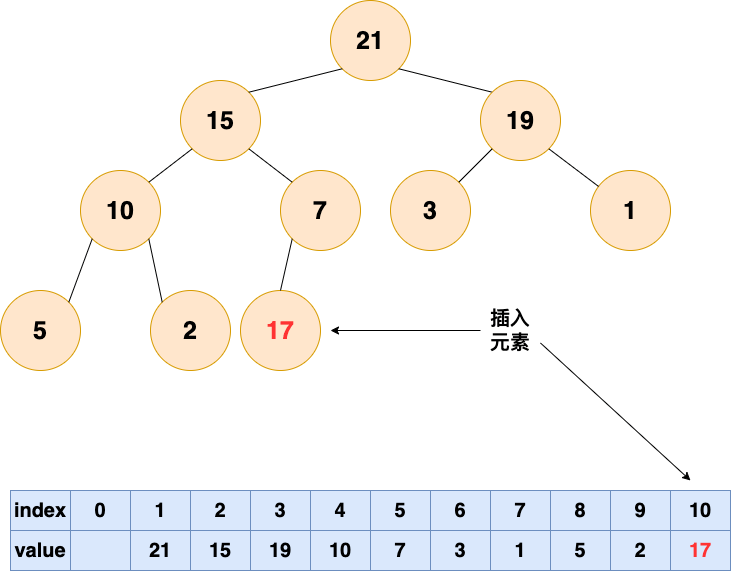

1. 将要插入的元素放到数组末尾；
2. 自底向上堆化，将末尾元素上浮（如果父结点比该元素大则交换，直到无法交换）；

##### 删除堆顶元素

删除（弹出）堆顶元素后，为了保持堆顶元素为最值的性质，需调整堆的结构，称为"**堆化**"。


- 自底向上堆化：子节点接力上浮填补空白；易出现“气泡”，导致存储空间浪费。


- **自顶向下堆化**：不会出现气泡；
  1. 将末尾元素放至堆顶；
  2. 堆顶元素下沉（由最顶部向下移动）：逐步与左右子节点比较并交换位置，直到无法交换位置；


##### [3.2堆排序](#3.2堆排序)

##### 第K个元素

1. [215.数组中的第K个最大元素](https://leetcode.cn/problems/kth-largest-element-in-an-array/)

   - `PriorityQueue`：实现大小为 `k` 的最小（**默认**）堆，
     1. 方式一：弹出堆顶的最小元素再加入新元素，重复此过程，始终留下 `k` 个元素（维持堆的大小为 `k`），堆顶（最小元素）即第 k 大的元素；即 [347] 中的思路；
     2. ~~方式二：全部加入堆中，不断弹出堆顶元素，直到剩下 `k` 个元素；占用额外空间；~~

   - 方式三：快速选择算法，稍微改造了快速排序的算法思路。【】
   - 常规思路：实现最大堆，弹出第 K 个元素；

      ```java
      // 默认创建最小堆，设置大小为k
      PriorityQueue<ListNode> pq = new PriorityQueue<>(k, (a, b) -> {
         return a.val - b.val;
      });
      // 改造为最大堆
      PriorityQueue<Integer> pq = new PriorityQueue<>(k, (a, b) -> (b - a));
   
      PriorityQueue<Integer> pq = new PriorityQueue<>(new Comparator<Integer>() {
         @Override
         public int compare(Integer a, Integer b) {
       	    return map.get(a) - map.get(b);
         }
      });
      ```

2. [347.前 K 个高频元素](https://leetcode.cn/problems/top-k-frequent-elements/)：最小堆，借助 **哈希表** 来建立数字和出现次数的映射，遍历一遍数组统计元素的频率：
   
   1. 维护一个元素数目为 k 的最小堆；
   2. 每次都将新元素与堆顶元素（堆中频率最小的元素）进行比较；
   3. 如果新元素的频率比堆顶元素大，则弹出堆顶端的元素，将新元素添加进堆中；
   4. 最终，堆中的 k 个元素即为前 k 个高频元素。

       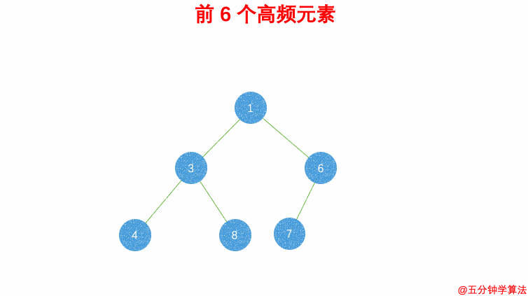

3. [23.合并K个升序链表](https://leetcode.cn/problems/merge-k-sorted-lists/) ：将`k`条链表的头结点加入最小堆（用[PriorityQueue 优先级队列](#队列)实现）进行节点排序，选取堆顶元素；不断将链表的剩余节点加入最小堆。

   - `pq` 中的元素个数最多是 `k`，一次 `poll` 或 `add` 方法的时间复杂度是 `logk`；所有节点都会被加入和弹出 `pq`，整体是 `Nlogk`，其中`N` 是所有链表的节点总数。

   

### 树

#### 基本概念

- 节点的高度 ：该节点到**叶子节点**的最长路径所包含的**边数**；
  - 树的高度 ：根节点的高度。
- 节点的深度 ：**根节点**到该节点的路径所包含的**边数**；
  - 树的深度：叶子节点的最大深度。
- 节点的层数 ：节点的深度+1。

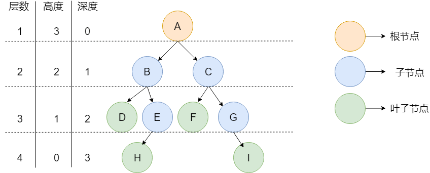

```
/* 基本的 N 叉树节点 */
class TreeNode {
    int val;
    TreeNode[] children;
}
```

#### 树、图的遍历

树的 `DFS/BFS` 遍历算法

```
// 多叉树遍历框架
void traverse(TreeNode root) {
	if (root == null) return;
    for (TreeNode child : root.childern) {
        // 前序位置，在进入节点前执行的操作
        traverse(child);
        // 后序遍历的操作
    }
}
```

#### 经典题目

- [236.二叉树的最近公共祖先](https://leetcode.cn/problems/lowest-common-ancestor-of-a-binary-tree/)
  1. 递归：根据 `root、p、q` 的关系递归；[235.二叉搜索树的最近公共祖先](https://leetcode.cn/problems/lowest-common-ancestor-of-a-binary-search-tree/)【】
  2. 还可转化为 [两链表的公共节点](#链表快慢双指针)；

#### Huffman 霍夫曼树

树中的概念：

- 路径：一条从树中任意节点出发，沿父-子节点连接，达到任意节点的通路（序列）。同一节点至多出现一次 ；至少包含一个节点，且不一定经过根节点。
    - 路径和：路径中各节点值的总和。
    - 单边路径和：从根节点 root 为起点的路径和。
    - 路径长度：路径上分支的数目。
    - 节点的权：为树中的每一个节点赋予的一个非负的值。
- 节点的带权路径长度：从根节点到该节点之间的路径长度与该节点权的乘积。


- **树的带权路径长度**（Weighted Path Length of Tree，**WPL**）：设二叉树具有 N 个带权叶结点，从根结点到各叶结点的**路径长度**与相应叶节点权值的**乘积之和**。
    - 所有叶子节点的带权路径长度之和。

**Huffman树**（霍夫曼树、哈夫曼树、最优二叉树、最优树）：在含有 N 个**带权叶子结点**的**二叉树**中，其中带权路径长度（WPL）最小的二叉树。

- 哈夫曼树中权越大的叶子离根越近。
- 用途：Huffman编码。


##### Huffman树的构建

> 略。

##### Huffman编码

Huffman编码：由Huffman树生成的二进制前缀编码。

前缀编码：即一个字符的编码不是另一个字符编码的前缀。

### 二叉树

优点：增**删**改查性能都很好；

缺点：斜树，瘸子；因此发展出变体满二叉树、完全二叉树。

##### 二叉树核心解题思路

二叉树的习题分为三大部分：

1. 递归，用「遍历」的思维模式解题，即 DFS 算法、**回溯算法**的原型。
2. 递归，用「分解问题」的思维模式解题，即**动态规划**、分治算法的原型。
3. 非递归，用「层序遍历」的思维模式解题，即 BFS 算法的原型。

#### 分类

##### 满二叉树、完全二叉树

满二叉树：二叉树每层（第 k 层，深度为 k-1）的结点数都达到最大值 2^(k-1)^，即结点总数是(2^k^) -1。

完全二叉树：最后一层若不满则缺少的节点都在右边，其余层都是满的。性质：父子节点的序号有对应关系。

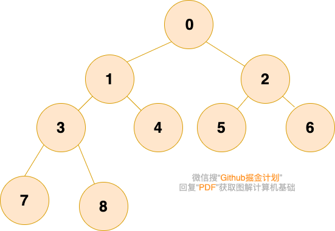

##### BST 二叉查找树、二叉搜索树

**`BST` 树**（`Binary Search Tree、ordered binary tree、sorted binary tree`）：

1. （**左小右大**）若不为空，任意节点的值均 > 左子树任意结点、均 < 右子树任意节点（所有节点的值都不相等），
2. 且左右子树都是二叉查找树（即**中序遍历**为单调递增的二叉树 + 二分查找思想）。

性质：

- 压扁了就是无重复值的有序数组。~~由二叉树的**层序遍历**扩展而来，常用于求无权图的**最短路径**。维护了一组数据的顺序性，得到一个数据的上下界。~~
- **查找**、插入、删除（CRUD）节点：复杂度均为 `O(h+1)`，`h`为树的高度/深度，最好（即**平衡二叉树**）为 `O(lgN)`，最坏（斜树）为 `lgN`；
- 缺点：若插入的是已有序的序列，可能退化成**斜树、链表**，CRUD 的性能均从 `lgN` 降为 `O(N)`；因此引入平衡二叉树。

经典题目：

- 注意不是所有的 BST 题目都需递归，有的只需 `while` 循环即可；
- [108.将升序数组转为高度平衡的二叉搜索树](https://leetcode.cn/problems/convert-sorted-array-to-binary-search-tree/)：在前序位置，取 `mid` 位置的元素构造当前 `root` 节点，递归创建左右子树；【】
    - [109.有序链表转换二叉搜索树](https://leetcode.cn/problems/convert-sorted-list-to-binary-search-tree/)：链表和数组相比一个关键差异是无法通过索引快速访问元素；【】
        1. 把链表转化成数组；
        2. 用双指针获取链表的中点；
        3. 利用中序遍历的特点写出最优化的解法。

##### AVL 平衡二叉树、红黑树

平衡二叉树、`AVL` 树（）：除了空树，每个节点的左右子树都是一棵平衡二叉树、且**高度差**的绝对值不超过1。常用实现方法有 **红黑树**、**替罪羊树**、**加权平衡树**、**伸展树** 等。

**红黑树**（自平衡二叉查找树、对称二叉 `B` 树）：[一篇漫画告诉你--什么是红黑树？](https://zhuanlan.zhihu.com/p/78249704)

- 一种**二叉查找树**，满足：
   1. 根、所有叶子节点（为空、`NIL/null`）都是黑色；
   2. 每个红节点必须有**两个黑子节点**。即：
       1. 红节点的父、子节点均是黑色；
       2. 从每个叶子到根的所有路径上不能有两个连续的红节点；
       3. 不存在两个相邻（父子关系）的红节点；
   3. 从任一节点到每个叶子的所有**简单路径**都包含**相同数目**的黑节点。确保没有一条路径会比其他路径长出两倍。
- 既有线性表的**二分查找、有序**，又有链表的**增删性能**。可在 `O(lgN)` 时间内完成查找、插入和删除。
- 典型用途是实现**关联数组**，`TreeMap、TreeSet` 及 `JDK1.8` 的 `HashMap` 底层都用到红黑树。
- 变色：添加、删除；
- 左旋算法：父节点被自己的**右孩子**取代。

   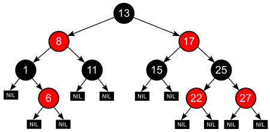

##### B 树 / **多路平衡查找树**

`B+` 树（`B` 树的变形）：用于**数据库索引**的实现。是一种红黑树，也是一种 BST 二分查找树？

`B` 树 VS `B+` 树：

1. 节点：`B` 树的所有节点存放键和数据，而 `B+` 树只有叶子节点存放`key` 和 `data`，其他非叶子节点只存放 `key`。
2. 叶子节点：`B` 树的叶子节点是独立的；`B+` 树的叶子节点有**引用链**指向相邻的叶子节点。
3. 查找：`B` 树的检索相当于对节点的关键字做**二分查找**，可能不到叶子节点就找到；而 `B+` 树的查找是从根节点到叶子节点。

##### 其他二叉树

1. `Trie` 树、字典树、前缀树、单词查找树：由二叉树衍生出来，主要用于处理字符串前缀相关的操作、保存和统计大量的字符串和相关的信息。
2. **线段树**：叶子节点是数组中的元素，非叶子节点就是索引区间（线段）的汇总信息。用于高效解决数组的区间查询和区间动态修改问题。如处理数组区间信息的汇总（求和、最值等）、单点更新、区间更新问题。

3. 树状数组：处理数组的前缀和、单点更新、区间更新问题。

#### 二叉树的存储

- 链式存储
- 顺序存储：用于[堆的存储](#堆的存储)；

    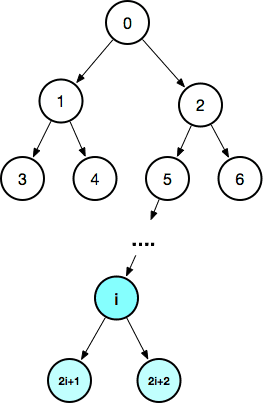

   - 根结点的序号为 0，则下标为 `i` 的节点对应的：
      1. 父结点：`(i - 1) / 2`
      2. 左子结点：`2 * i + 1`
      3. 右子结点：`2 * i + 2`
      4. 非叶节点：`[0, (n-1)/2]`，用于[建堆](#3.2堆排序)；

   - 根结点的序号为 1，对于树中任意节点 `i`，其
      1. 父结点：`i / 2`
      2. 左子节点序号为： `2 * i`
      3. 右子节点为： `2 * i + 1`

##### 代码实现

```
/**
 * Definition for a binary tree node.
 * public class TreeNode {
 *     int val;
 *     TreeNode left;
 *     TreeNode right;
 *     TreeNode() {}
 *     TreeNode(int val) { this.val = val; }
 *     TreeNode(int val, TreeNode left, TreeNode right) {
 *         this.val = val;
 *         this.left = left;
 *         this.right = right;
 *     }
 * }
 */
```

#### 二叉树遍历

##### 层序遍历

外部变量 + **迭代遍历**一遍：对应[回溯算法核心框架](#回溯算法框架)，简单易懂；

- [102.二叉树的层序遍历](https://leetcode.cn/problems/binary-tree-level-order-traversal/)：从上到下用 `while` 遍历每层、并塞入**队列**，自左向右用 `for` 遍历每行、将结果加入 List。可扩展出 [BFS 算法框架](#广度优先搜索常见场景)；
- [111.二叉树的最小深度](https://leetcode.cn/problems/minimum-depth-of-binary-tree/)
  - [103.二叉树的锯齿形层序遍历](https://leetcode.cn/problems/binary-tree-zigzag-level-order-traversal/)：奇偶层 `ArrayList` 分别用 `addLast()、addFirst()`；【】
  - [107.二叉树的自底向上层序遍历 II](https://leetcode.cn/problems/binary-tree-level-order-traversal-ii/)【】
  - 从上到下打印每行中的最大值；
  - [199.二叉树的右视图](https://leetcode.cn/problems/binary-tree-right-side-view/)【】
    1. 用 BFS **层序遍历**算法，从右往左遍历每行，每层 `queue` 的第一个节点就是右视图。
    2. 用 DFS ~~递归遍历~~算法，反过来从右往左遍历每一行，先递归 `root.right` 再递归 `root.left`，同时用 `res` 记录每层的最右侧节点作为右视图。


  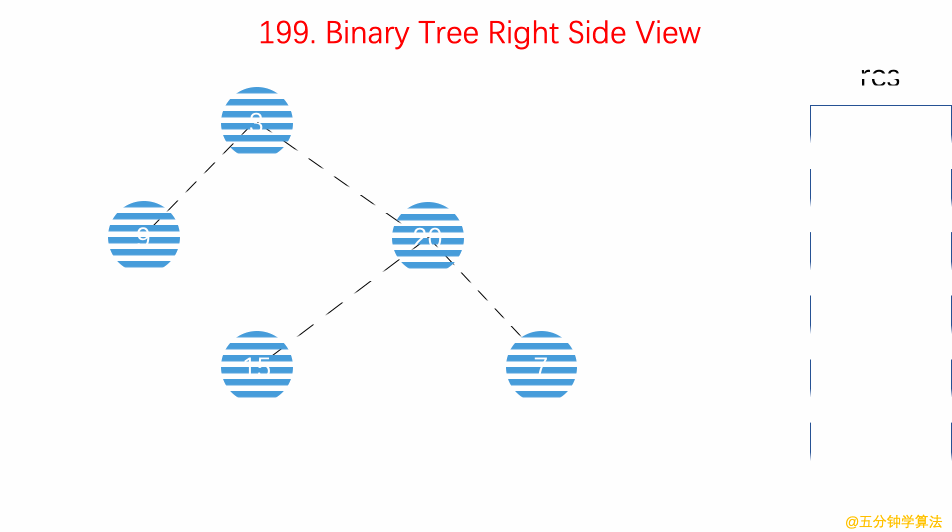

**层序遍历框架**：


  ```
// 层序遍历：1. 非递归用栈实现
public List<List<Integer> > levelOrderTraverse(TreeNode root) {
    // 一维结果
    // List<Integer> res = new LinkedList<>();
    // 二维结果
    List<List<Integer> > res = new LinkedList<>();
    if (root == null) return res;
    Deque<TreeNode> q = new LinkedList<>();
    q.offer(root);
    
    // 从上到下遍历二叉树的每一层
    while (!q.isEmpty()) {
    	// depth++; // 深度，初始化为0
        int sz = q.size();
        List<Integer> re = new LinkedList<>(); // not List new，level，长度可变
        // 右视图从右往左遍历，且保存队头（队列中第0个元素）
        // TreeNode last = q.peek();
        // 从左到右遍历本层的每个节点
        for (int i = 0; i < sz; i++) {
            TreeNode cur = q.poll(); //	
            re.add(cur.val); // not offer() push()
            if (0 == res.size()%2) { // 奇数层
            }
            // 二叉树的最小深度
            if (node.left == null && node.right == null) {
                return depth;
            }
            // 将下一层节点放入队列
            if (cur.left != null) {
                q.offer(cur.left);
            }
            // 从右往左遍历时，right先入队，用于右视图等
            if (cur.right != null) {
                q.offer(cur.right);
            }
        }
        res.add(re);
        // 前插每层的遍历结果，就是自底向上的层序遍历
        //res.addFirst(level);
        // 用于右视图
        //res.add(last.val);
    }
    return res;
}

// 层序遍历：2. 递归实现
List<List<Integer> > res = new ArrayList<>(); // 需用到get()，not LinkedList
List<List<Integer> > levelOrderTraverse(TreeNode root) {
    if (root == null) {
        return res;
    }
    // root 深度为 0，视为第 0 层
    traverse(root, 0);
    return res;
}

void traverse(TreeNode root, int depth) {
    if (root == null) {
        return;
    }
    // 前序位置，判断是否已存储 depth 层的节点
    if (res.size() <= depth) {
        // 第一次进入 depth 层
        res.add(new LinkedList<>());
    }
    // 前序位置，在 depth 层添加 root 节点的值
    res.get(depth).add(root.val);
    traverse(root.left, depth + 1);
    traverse(root.right, depth + 1);
}

//层序遍历：3. 使用自定义 State 类维护每个节点的信息，复杂一些但最灵活，会在图算法或复杂 BFS 算法中见到
class State {
    TreeNode node;
    int depth;

    State(TreeNode node, int depth) {
        this.node = node;
        this.depth = depth;
    }
}

void levelOrderTraverse(TreeNode root) {
    if (root == null) {
        return;
    }
    Queue<State> q = new LinkedList<>();
    // 根节点的路径权重和是 1
    q.offer(new State(root, 1));

    while (!q.isEmpty()) {
        State cur = q.poll();
        // 访问 cur 节点，同时知道它的路径权重和
        System.out.println("depth = " + cur.depth + ", val = " + cur.node.val);

        // 把 cur 的左右子节点加入队列
        if (cur.node.left != null) {
            q.offer(new State(cur.node.left, cur.depth + 1));
        }
        if (cur.node.right != null) {
            q.offer(new State(cur.node.right, cur.depth + 1));
        }
    }
}
  ```

##### 前序/中序/后序遍历

1. [144.二叉树的前序遍历](https://leetcode.cn/problems/binary-tree-preorder-traversal/)：逻辑上用栈，实际在递归的前序位置用**递归栈**；
2. [94.二叉树的中序遍历](https://leetcode.cn/problems/binary-tree-inorder-traversal/)：在递归的中序位置用**递归栈**、不用递归；【】
3. [145.二叉树的后序遍历](https://leetcode.cn/problems/binary-tree-postorder-traversal/)：在递归的后序位置用**递归栈**；【】
   - [124.二叉树中的最大路径和](https://leetcode.cn/problems/binary-tree-maximum-path-sum/)：递归后序遍历时，计算单边路径和、最大路径和【】

     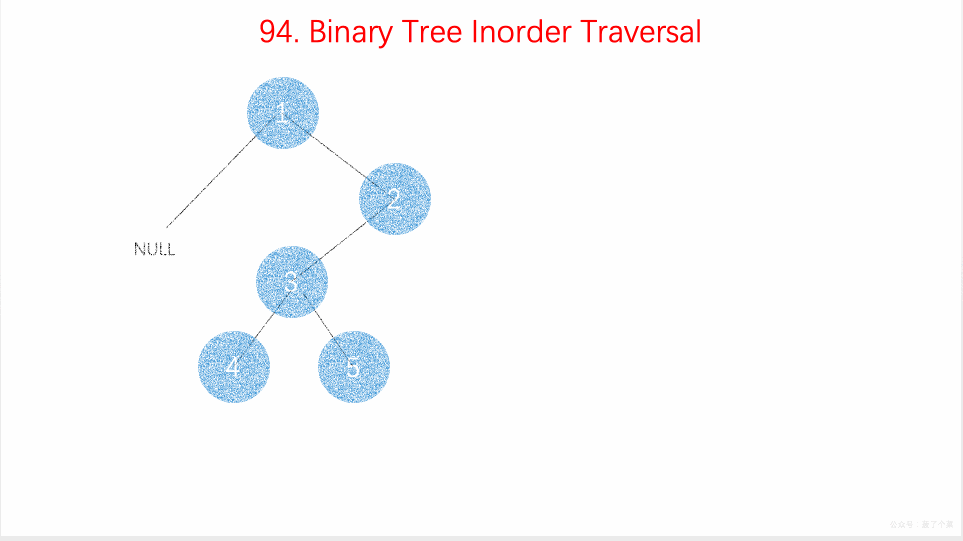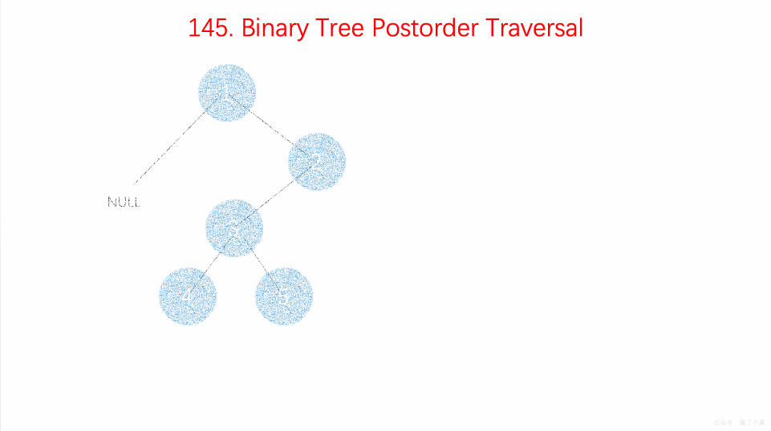

4. [105.根据前序与中序遍历序列构造二叉树](https://leetcode.cn/problems/construct-binary-tree-from-preorder-and-inorder-traversal/)：`inorderValToIdxMap<>` 存储中序序列的值到索引的映射；前序序列 `preorder[preStart, preEnd]` 确定 root 、左子树 + 右子树的范围，再根据中序序列 `inorder[inStart, inEnd]` 确定（划分）左右子树的长度，得到左右子树的前序和中序序列，递归；

   - [106.从中序与后序遍历序列构造二叉树](https://leetcode.cn/problems/construct-binary-tree-from-inorder-and-postorder-traversal/)【】

      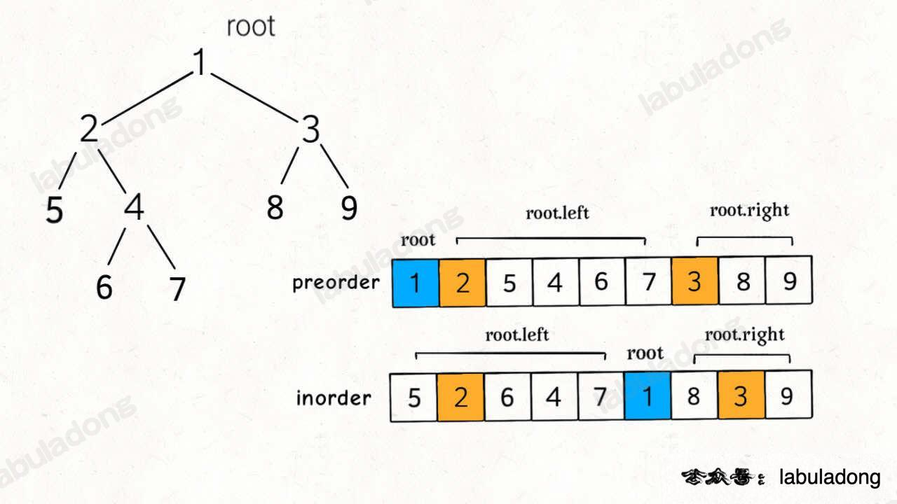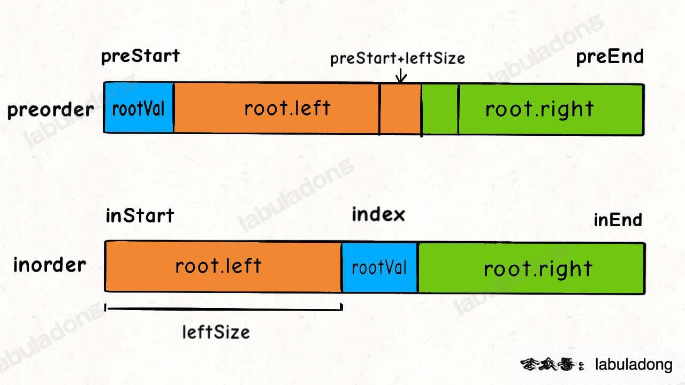

**递归框架**：

在递归函数中，将当前节点**分解**为子问题（子树），通过子树的结果推导出当前节点的结果：对应[动态规划核心框架](#动态规划算法框架)；

```
public List<Integer> preorderTraverse(TreeNode root) {
    List<Integer> res = new LinkedList<>();
    if (root == null) return res;
    
    // 前序位置：自顶向下、自左向右遍历node、执行代码；
    // 从根节点遍历过来的过程能顺带记录前序位置的信息，如节点的深度；
    // 快速排序，对前中后序位置不敏感的代码；
    res.add(root.val);
    res.addAll(preorderTraverse(root.left));
    // 中序位置：主要用在 BST 二叉查找树场景
    res.addAll(preorderTraverse(root.right));
    // 后序位置：自底向上遍历node、执行代码；
    // 只有后序位置才能通过返回值获取子树的信息，如树的深度/高度、二叉树的最大深度（即根节点到「最远」叶子节点的最长路径上的节点数）、节点的高度；
    // 归并排序、大多数和子树有关的、倒序打印单链表、二叉树的最长直径（即任意两个结点间的路径长度，不一定要穿过根结点=左右子树的最大深度之和+1）
    return res;
}
```

##### （非递归不用栈的）中序遍历

用循环/迭代、中序遍历。

利用**线索二叉树**的思想，即不再闲置叶子节点的左右指针，比如**中序**利用**叶子节点右指针**指向前序遍历情况时的后继节点。在当前节点没有左子树、或者第二次访问节点时即为中序结果。

- 此时past的右孩子指向后继节点，所以是第二次访问；
-  代表当前结点的左子树已经访问完毕，所以访问当前结点；
- 然后把指针移到后继或者右子树，并消除多余链接；

递归和迭代两种方式是等价的，区别在于递归的时候隐式地维护了一个栈，而在迭代时需要显式地将这个栈模拟出来。

参考：[二叉树遍历四种必会算法：递归遍历、非递归遍历、既不用递归也不用栈遍历（三种深度优先），层序遍历（广度优先）](https://blog.csdn.net/qq_43252451/article/details/123056671)

难理解，直接背。

```
public List<Integer> inorderTraversal(TreeNode root) {
    // 中序遍历非栈非递归，中序线索
    List<Integer> res = new LinkedList<>();
    TreeNode current = root;
    while(current != null) {
        if(current.left == null) {
            // 当前节点没有左孩子，所以是应该访问的结点
            res.add(current.val);
            // 找右孩子、或者在前面建立的右孩子链接
            current = current.right;
        } else {
            TreeNode past = current.left;
            // past一直到最右下
            while(past.right != null && past.right != current) {
                past = past.right;
            }

            if(past.right == null) {
                // 此时current是past的后继结点，建立链接方便下次找到后继节点
                past.right = current;
                current = current.left;
            } else {
                /*
                此时past的右孩子指向后继节点，所以是第二次访问；
                代表当前结点的左子树已经访问完毕，所以访问当前结点；
                然后把指针移到后继或者右子树，并消除多余链接；
                */
                res.add(current.val);
                past.right = null;
                current = current.right;
            }
        }
    }
    return res;
}
```

#### 经典题目

1. 

### 图

> 面试笔试很少出现图相关的问题，就算有大多也是简单的遍历问题，基本上可完全照搬多叉树的遍历。
>

##### 基本概念

图（G）由顶点的有穷非空集合（V）和顶点间的边（E）组成，通常表示为：**G(V,E)**。如社交软件上好友关系。

- 无向图和有向图；
- 无权图和带权图；

树和图的根本区别：树不含环，图可能含**环**。树是一种图，即无环连通图，图是多叉树的延伸。如果图没有环，可拉伸成一棵树。

- 度（degree）：每个节点相连的边数。
  - 入度（indegree）：有向图中指向每个节点的边数；
  - 出度（outdegree）：有向图中从每个节点出发的边数。

用途：

- 哈希环：用于负载均衡算法中的一致性哈希法。

##### 图的存储

> 表示方法、具体实现、物理结构

- 邻接矩阵：优点是简单直接（用一个二维数组），可快速判断两点间是否连通，可进行矩阵运算，但（图比较稀疏时）会浪费空间。

- **邻接表**：比较节省空间，但很多操作效率低，如无法快速判断两个节点是否连通。在常规的算法题中使用更频繁。
  - 在无向图中，邻接表元素个数等于边数的两倍；
  - 在有向图中，邻接表元素个数等于边的条数；

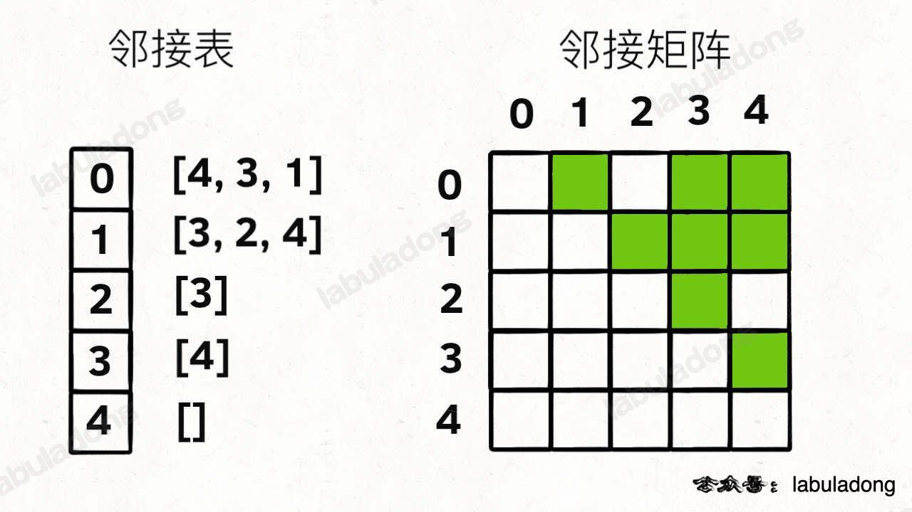

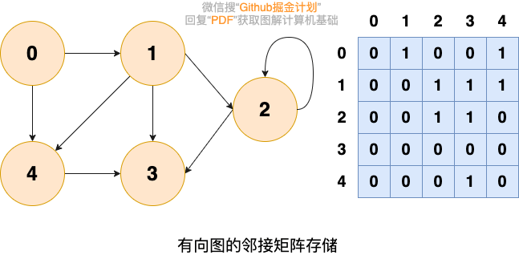 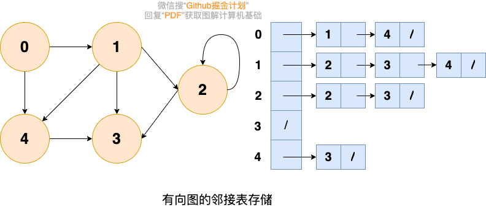 

```
// 邻接矩阵
// graph[x][y] 记录 x 是否有一条指向 y 的边、或边的权重
boolean/int[][] graph;

// 邻接表
// graph[x] = List<Integer> ？存储 x 的所有相邻节点
List<Integer>[] graph;
```

##### 图的搜索、遍历

各种搜索问题其实都是树的遍历问题：

- [DFS 深度优先搜索](#DFS 框架、回溯)：用**栈**回溯；
- [BFS 广度优先搜索](#BFS 框架)：把问题抽象成图，每次将当前节点周围的所有节点加入**队列**。

二者最主要的区别是：

- BFS 的 `depth` 每增加一次，队列中的所有节点都向前迈一步，保证了第一次到达终点时，走的步数是最少的，可在不遍历完整棵树的条件下找到**最短路径**。
- DFS 实际上是靠递归的堆栈记录走过的路径，把二叉树中所有节点都走完才能对比出**最短路径**。

BFS 空间复杂度比 DFS 大。


```
// 记录被遍历过的节点
boolean[] visited;
// 记录从起点到当前节点的路径，用于判断是否成环
boolean[] onPath;

// 图的遍历框架：递归实现
void traverse(Graph graph, int s) { // 节点 s
    if (visited[s]) return;
    visited[s] = true;
    // 做选择：标记节点 s 在路径上
    onPath[s] = true;
    for (int neighbor : graph.neighbors(s)) {
        traverse(graph, neighbor);
    }
    // 撤销选择：节点 s 离开路径
    onPath[s] = false;
}
```

- [797.所有可能的路径](https://leetcode.cn/problems/all-paths-from-source-to-target/)【】
  - [剑指 Offer II 110. 所有路径](https://leetcode.cn/problems/bP4bmD/)【】

```
// 记录所有路径
List<List<Integer> > res = new LinkedList<>();

public List<List<Integer> > allPathsSourceTarget(int[][] graph) {
    // 维护递归过程中经过的路径
    LinkedList<Integer> path = new LinkedList<>();
    traverse(graph, 0, path);
    return res;
}

// 图的遍历框架：非递归实现
void traverse(int[][] graph, int s, LinkedList<Integer> path) {
    // 添加节点 s 到路径
    path.addLast(s);

    int n = graph.length;
    if (s == n - 1) {
        // 到达终点
        res.add(new LinkedList<>(path));
        // 可在这直接 return，但要 removeLast 正确维护 path
        path.removeLast();
        return;
        // 不 return 也可，因为图中不含环，不会出现无限递归
    }
    // 递归每个相邻节点
    for (int v : graph[s]) {
        traverse(graph, v, path);
    }
    // 从路径移出节点 s
    path.removeLast();
}
```

##### Kruskal 最小生成树算法

> 经典算法，学有余力可以掌握一下

图的生成树：生成树是包含图中所有顶点的**无环连通子图**（无环树）。

[最小生成树（MST）](https://visualgo.net/zh/mst)：权重和最小的生成树。都用了贪心思想。[1584.连接所有点的最小费用](https://leetcode.cn/problems/min-cost-to-connect-all-points/)【】

1. `Kruskal` 克鲁斯卡尔算法：用到了贪心思想，使权重和尽可能小。对所有边按照权重从小到大排序，从权重最小的边开始，选择合适的边加入 `mst` 集合；如果边的两端点不属于同一集合，则合并，直到所有的点都属于同一个集合为止。实就是 **Union Find 算法** + 排序。用并查集算法来保证生成树不含环且不是森林：
      1. 如果一条边的两个节点是连通的，则会出现环；
      2. 如果最后的连通分量总数大于 1，则说明是「森林」。
      3. 并查集 Union-Find Disjoin Sets（UFDS）：用于处理不相交集合的动态连接问题。模拟多个不相交集，能在几乎常数时间内确定一个元素属于哪个集、测试两个元素是否属于同一个集、将两个不相交集合并为一个。在`Kruskal`算法中用来寻找无向图中的连接分量。

2. `Prim` 普瑞姆算法：核心是切分定理（将图分为两个不重叠且非空的节点集合），每次都把权重最小的「横切边」拿出来，直到把构成最小生成树的所有边都切出来为止。用 BFS 算法思想 和 `visited` 布尔数组避免成环。

##### Dijkstra 最短路径算法

> ，经典算法，学有余力可以掌握一下。

简单图（有向无向皆可）的最短路径 `Dijkstra` 迪杰斯特拉（戴克斯特拉）算法：注意是长度而不是具体的路径。是 BFS 算法的加强版，都是从二叉树的层序遍历衍生出来。

- 用于计算 OSPF 动态**路由选择**协议。

##### 经典题目

- 看到依赖问题 ==> 首先想到的就是把问题转化成「有向图」

比较基本且有用的算法，应较熟练地掌握：

- 有向图的**环路检测**、循环依赖判断：[207.课程表 选修依赖先修](https://leetcode.cn/problems/course-schedule/)【】、[二分图判定算法](https://labuladong.github.io/algo/2/20/49/)，常用邻接表，DFS 算法遍历图的框架 + `visited` 数组

  - DFS 实现
  - BFS 实现

- 拓扑排序（Topological Sorting）：是一个**有向无环图**所有顶点的线性序列；

  1. 每个顶点出现且只出现一次；
  2. 若存在一条从顶点 A 到顶点 B 的路径，那么在序列中顶点 A 出现在顶点 B 的前面。

    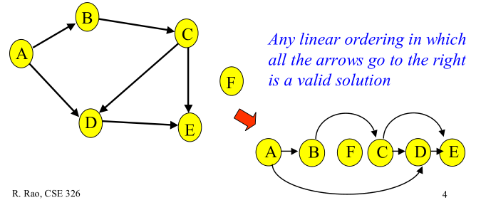

  - 直观说就是，把一幅图「拉平」，且所有箭头方向都是一致的。存在环，则肯定做不到所有箭头方向一致。如返回一个合理的上课顺序，保证开始修每个课程时，前置课程都已修完。实现：

    - DFS 实现（可进一步理解递归）
    - BFS 实现（更简洁）

- **二分图的判定**、图论的双色问题：二分图的顶点集可分割为两个互不相交的子集，图中每条边依附的两个顶点都分属于这两个子集，且两个子集内的顶点不相邻。

- Union Find 算法：`Kruskal` 克鲁斯卡尔算法，最小生成树。

    - 使用并查集操作联通分量。
