> 摘要：手撕算法多为框架，包括常用技巧、十大排序算法、查找、分治与递归、动态规划、贪心、BFS 框架、DFS框架与回溯、缓存淘汰算法。基本涵盖[labuladong 的算法小抄](https://github.com/labuladong/fucking-algorithm)、[CodeTop](https://codetop.cc/)频度前40、[剑指 Offer（第 2 版）](https://leetcode.cn/problem-list/xb9nqhhg/)、[LeetCode 热题 HOT 100](https://leetcode.cn/problemset/all/?listId=2cktkvj&page=1&sorting=W3sic29ydE9yZGVyIjoiREVTQ0VORElORyIsIm9yZGVyQnkiOiJTT0xVVElPTl9OVU0ifV0%3D)常见例题。

<!-- more -->

---

## 目录

[TOC]

## 手撕算法

### 算法定义

- 数据结构：是解决问题的过程中（存放、处理数据）的容器和缓存，是空间换时间思想的体现。
- 算法：是（正确、高效）解决问题的方法：
    - 算法工程师（数学算法）：重点在数学建模和调参经验，计算机只是拿来做计算的工具而已；
    - 数据结构与算法（计算机算法）：重点是计算机思维，站在计算机的视角，抽象、化简实际问题，用合理的数据结构去解决问题。

> 大部分开发岗位工作中都是基于现成的开发框架做事，不怎么会碰到底层数据结构和算法相关的问题，但技术相关的岗位，数据结构和算法的考察，公认的程序员基本功。

### 常用技巧

> 一题多解、多题一解。一句话题解、写题目详解、写总结。

- 排序类
- 数组、字符串：**[二分查找](#二分查找)**
    - n数之和：[nSum](#nSum)
    - 子数组的和：[前缀和](#前缀和)
        - 频繁对子数组增减：[差分数组](#差分数组)
    - 双指针：左右（相向、背向）；同向（快慢、同速）
    - 子串：动态规划
    - 数组元素的取值都在 `[0, n-1]` 范围内：哈希表 `HashMap<Integer, Integer>`
- 单链表：
    - 子串：**[快慢双指针](#快慢双指针)**（滑动窗口）
    - 反转链表
- 三大牛逼算法：回溯、贪心、动态规划（DP）
    - 递归类：
        - 二叉树：
            - **回溯**算法核心框架：遍历一遍二叉树得出答案；
            - **动态规划**核心框架：通过分解问题计算出答案；
    - 非递归类：无遗漏（正确不出错）、无冗余（优化算法的时间、空间复杂度）聪明的穷举。
        - **贪心**：在题目中发现一些规律（专业点叫贪心选择性质），不用完整穷举所有解。
- **分治**：核心依然是大问题分解成子问题，只不过没有重叠子问题

### 时间、空间复杂度

> 分析算法复杂度时，分析的是最坏情况的复杂度。

O(1)、O(n)、O(lgN)。

- 时间复杂度用来衡量一个算法的执行效率，
- 空间复杂度用来衡量算法的内存消耗。

## 排序

> 排序算法总结和比较。注意写代码的流畅度。

- [10-classical-sorting-algorithms](https://github.com/Snailclimb/JavaGuide/blob/main/docs/cs-basics/algorithms/10-classical-sorting-algorithms.md#%E5%9F%BA%E6%95%B0%E6%8E%92%E5%BA%8F-radix-sort)

- [912.排序数组](https://leetcode.cn/problems/sort-an-array/)

可分为：

1. 内部排序：数据记录在内存中进行排序；

    1. 比较类排序：通过比较元素大小来排序；
    2. 非比较类排序（线性时间）：不通过比较、而是通过每个元素**前的元素个数**来排序（决定元素间的相对次序）；

        - 一次遍历即可，可突破基于比较排序的时间下界，以线性时间运行，算法时间复杂度 `O(n)`；
        - 以空间换时间：需占用空间来确定唯一位置，对数据规模和分布有一定要求。

2. 外部排序：数据量很大，内存一次不能容纳全部记录，需访问外部文件（外存）。

稳定性：相同的值经过排序后、相对次序保持不变。

- 四个不稳定的算法：**希快选堆**（1.2、2.2、3.1、3.2）。

- 可能变为不稳定：插冒（1.1、2.1）。

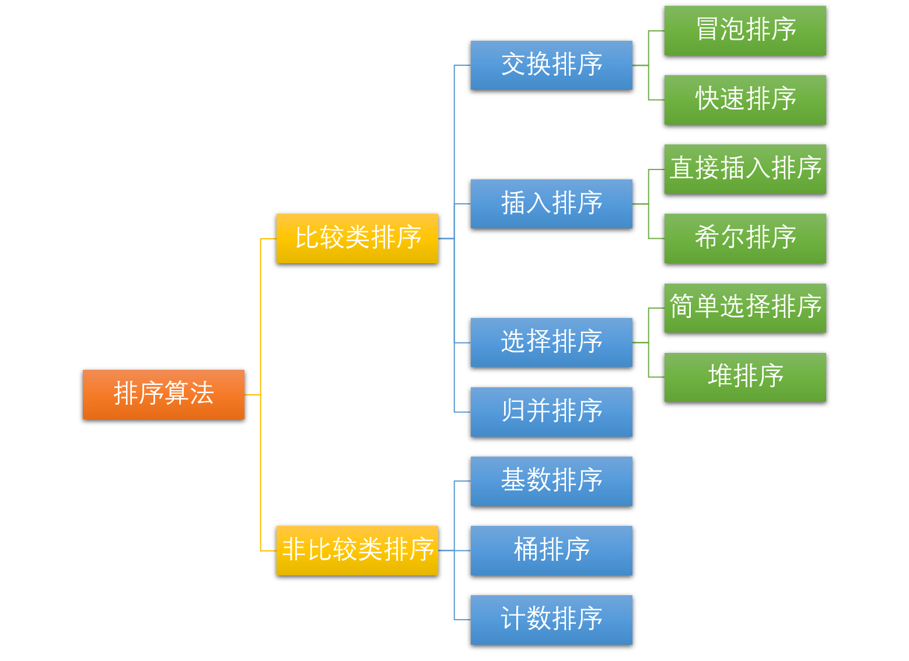

#### 0. 内置排序函数

```java
int[] nums = new int[]{1, 3, 4, 7};
Arrays.sort(nums);

List<User> list = new ArrayList<User>();
Collections.sort(list);
```

#### 1. 插入排序

##### 1.1 插入排序

- 工作原理：（将待排序元素）分为已排序和未排序两部分。相当于**抓牌 + 插牌**的过程：
    1. 抓牌：遍历未排序元素，作为待插入元素；
    2. 插牌：
        1. 直接插入：**由后向前**查找当前元素在已排序元素中的插入位置，将后面的元素**逐个后移**，插入目标位置；
        2. 折半插入：[二分查找](#二分查找框架)插入位置（右边界），统一后移。

- 最易理解
- 性能/复杂度：`n（有序、设置flag表示此趟是否排序）、n^2^、n^2^（逆序）、O(1)`。
- 稳定：**查找右边界（值相等就停止向前查找）时**，值相等的元素保持原来的相对位置（原序）。


```java
public static void directInsertSort(int[] arr) {
    for (int i = 1; i < arr.length; i++) { // 第0个不用排序
        int target = arr[i];
        int j = i - 1;
        for (; j >= 0 && arr[j] > target; j--){ // 防止下界溢出
            arr[j + 1] = arr[j]; // 逐个后移
        }
        // if (j >= 0) {
            arr[j + 1] = target; // j最小为-1，此时待插入元素最小，插入0位置
        //}
    }
}

public static void binaryInsertSort(int[] arr) {
    for (int i = 1; i < n; i++) {
        int target = arr[i];
        // 在已排序序列中二分查找插入位置，相当于在区间[0, i-1]中查找右边界
        int pos = binaryRightBound(arr, 0, i-1, target);
        // 将pos后、[pos, i - 1]内的元素由后往前、统一逐位后移
        for (int j = i - 1; j >= 0 && j >= pos; j--) { // not while, pos = -1
            nums[j + 1] = nums[j];
        }
        // target插入pos位置
        arr[pos] = target; // pos == j + 1 >= 0 
    }
}

// right bound not found, then return min value's index witch greater than target
public static int binaryRightBound(int[] arr, int lo, int hi, int target) {
    while (lo <= hi) { // 同二分查找算法框架
        // 防止数组下标溢出，2^31 - 1
		int mid = lo + (hi-lo)/2;
		// 2.找右边界时，收缩左侧边界
		if (nums[mid] <= target) {
			lo = mid + 1;
		} else if (nums[mid] > target) {
			hi = mid - 1;
		}
	}
    return lo; // [0, -1] return lo=0
}
```

##### 1.2 希尔排序

- 又称缩小增量排序；
- 基本思想：

    1. 将整个待排序的记录，**分成为若干组**子序列，在组内（直接插入）排序；当整个序列中的记录基本有序时，再对全体记录排序；
    2. 间隔为步长（倍数）的位置分为一组（物理上并不相邻，逻辑上通过步长相邻），组内直接插入排序，**不断缩小步长**，通常步长减半 `gap[i]：n/2 -> 1`（步长为 1 即直接插入排序）。

- 复杂度：根据实现方式有所区别，一般认为 `nlogn、nlogn?、n^2^、O(n)`。
- **不稳定**：同组内元素交换位置后，不同组内相等元素的相对位置可能改变。如`[2, 2, 1, 3]`。


```java
public static void shellSort(int[] nums) {
	...
	for (int gap = n/2; gap > 0; gap /= 2) { // 步长减半
		// 分组内进行直接插入排序，逐个分组排序
		for (int i = gap * 1; i < n; i++) {
		    // gap, gap+1, …, gap*2, gap*2+1, …, n
			// 取出各组内第2个元素（总第gap个元素）作为待插入元素；
			// 取出各组内第3个元素（总第gap*2个元素）
            int target = nums[i];
			int pre = i - gap; // 同组的前一个元素的索引
			// 同组内i（当前元素）前的元素直接插入排序
			while (pre >= 0 && nums[pre] > target) { // &&，相当于插入排序中的for逐个后移
				// 比当前元素大的在组内向后移，如第1个覆盖第2个
				nums[pre + gap] = nums[pre];
				pre -= gap;	// 向前迈一个步长
			}
			nums[pre + gap] = target; // 插入待排序元素
		}
	}
}
```

#### 2. 交换排序

##### 2.1 冒泡排序

- 基本思想：在未排序序列 `[0，n-i)` 范围内冒泡一次，相邻元素两两排序（**逆序则交换**）作为一趟冒泡，即最大的元素向后冒泡，加入已排序元素的左侧。注意 i、j 的起始取值。
- 性能：`n、n^2^、n^2^、O(1)`。
- 稳定：交换时，元素相等就停止交换，可保证相对位置不变；（若改成 `arr[j-1] >= arr[j]`），两个相等的记录就会交换位置，则变为**不稳定**。

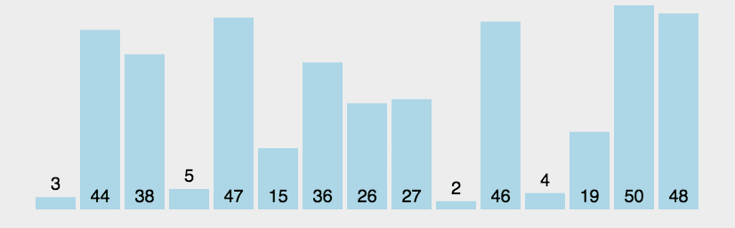

```java
public static void bubbleSort(int[] nums) {
	int n = nums.length;
	for (int i = 0; i < n; i++) { // [0, n)表示n次排序
		boolean runSort = false; // flag 作为一趟冒泡是否发生交换的标志
		for (int j = 1; j < n - i; j++) { // 在[0，n-i)范围内冒泡一次，注意j=1
			if (nums[j-1] > nums[j]) { // 逆序（前面的大于后面的）
				swap(nums, j-1, j); // 则交换
				runSort = true; // not i = n, then break from 2-for
			}
		}
		// 若一次交换也没有发生，则跳出循环
		if (!runSort) {
			break;
		}
	}
}
```

##### 2.2 快速排序

- 又称分区交换排序。
- 基本思想：选取一个基准元素 `pivot`（即划分标杆、枢纽、比较子），通过一趟划分（分治法）将序列分隔成两个子序列：比基准元素小的元素都放在其左侧，大的放在右侧，对左右两部分**递归**。
- 平均性能最优，划分最平衡，平均情况最接近最坏情况。
- 性能：`nlgn、nlgn、n^2^`（最坏情况为划分不对称，如 `[1, 2, 3, 4]`，总是取本区间的最大值 `4` / 最小值 `1` 作为 pivot） 
- 空间：因为快排用递归（调用）实现， 每次函数调用中都用了常数的空间，因此空间复杂度 = **递归（工作栈**的）深度 `Θ(lgn)`；用双指针、后者覆盖前者的方式代替交换函数。
- **不稳定**：待排序数组：`int a[] = {2, 2, 1, 3}`，在选择 pivot 时，把与基准元素相等的元素放在左边还是右边：

    1. 若放在左边，选择第一个 `2` 作为基准时，第二个 `2` 会被放在第一个 `2` 的右边，二者非原序（即不稳定）；
    2. 若放在右边，选择第二个 `2` 作为基准时，第一个 `2` 会被放在第二个 `2` 的右边，二者非原序（即不稳定）；

- 提高：

    1. **子序列规模较小**时用直接插入；
    2. 划分尽量对称；


```java
public static int partation(int[] nums, int lo, int hi) {
	int pivot = nums[lo]; // 取最左一位作为基准，not povit
	while (lo < hi) {
		while (lo < hi && nums[hi] >= pivot) { // >=, not nums[pivot]
			hi--;
		}
		if (lo < hi) {
			nums[lo++] = nums[hi]; // 最左已被作为基准，覆盖最左
		}
		while (lo < hi && nums[lo] < pivot) { // not > or <=
			lo++;
		}
		if (lo < hi) {
			nums[hi--] = nums[lo]; //
		}
	}
	nums[lo] = pivot; // lo即为pivot最终放的index
	return lo;
}

public static void quickSort(int[] nums, int lo, int hi) {
	if (lo < hi) { // 快排和归并都用此方法控制递归深度
        int pos = partation(nums, lo, hi); // partation
        quickSort(nums, lo, pos-1);	// -1
        quickSort(nums, pos+1, hi);
     }
}
```

#### 3. 选择排序

##### 3.1 简单选择排序

- 基本思想：一趟排序中，**选择**未排序序列 `[i+1, n)` 中最小的元素，与未排序序列第一个元素交换，即添加在已排序序列的最后。与冒泡排序的区别是：已排序序列 `[0, i]` 在前面。
- 代码最简单直观。
- 性能：`n^2^、O(1)`  用于数据规模很小时，不占用额外的内存空间。
- **不稳定**：`[2, 2, 1, 3]`，选择最小的 `1`，与第一个`2`交换后，两个`2`的相对顺序改变了。

```java
public static void selectSort(int[] nums) {
    int n = nums.length;
    for (int i = 0; i < n - 1; i++) { // n-2 趟,第n趟无意义
        int mini = i;
        // 从下一个位置开始查找，在[i+1, n)内查找
        for (int j = i + 1; j < n; j++) {
            if (nums[j] < nums[mini]) {
                mini = j; // 记录最小值的index
            }
        }
        // 最小值为未排序序列第一个（当前）元素时不移动；提高的效率并不高，可省略
        if (mini != i) {
            swap(nums, mini, i);
        }
    }
}
```

##### 3.2 堆排序

- [堆排序演示图](https://www.cs.usfca.edu/~galles/visualization/HeapSort.html)；如 `PriorityQueue` 即用堆排序实现；
- [基本思想](https://oi-wiki.org/basic/heap-sort/)：

    1. **[建大顶堆](https://visualgo.net/zh/heap)**：将无序数组建立为一个[二叉堆](#堆)；**从后向前**遍历非叶节点 `i`（堆顶从下标 `0` 开始时，`i = (n-1)/2 -> 0` ），按序逐个加入**堆 `[i, n)`**，即对所有以非叶节点 `i` 为根的子树向下调整堆；
    2. 交换堆顶 `a[0]` 和（堆底）末尾元素 `a[i = n-1->1]`；交换后，**堆范围**为`[0, i), i = n-1->0`，已排序序列为  `[i, n)`：

        1. 弹出堆顶元素，作为最大值附在无序数组后（有序数组最前）；
        2. 将末尾元素放至根结点，堆长度减一 。

    3. 维持剩余堆（`[0, i), i = n-1->0`）的性质，**向下调整新堆**（即自顶向下堆化 `heapify`，使该子树成为堆）：

        1. 交换父结点与左右子结点中的较大值 ；
        2. 交换后可能破坏子堆的结构，可递归也可迭代：沿交换后的子节点向下，交换较大的子节点，直到所有父结点 `>=` 左右子节点（以该结点为根的子树成为堆）为止；
        3. 时间复杂度为 `lgn`；

    4. 遍历无序数组（堆 ` i = n-1->0`），直到其中的所有元素都取出为止： 
        - 将堆顶的元素取出，作为次大值，与数组倒数第二位元素交换，并维持剩余堆的性质。

- 性能：`nlgn、O(1)`。
- **不稳定**：

    1. 在建堆时，关键字相同的两个记录，按序逐个加入并调整堆，相对位置不变，是稳定的；
    2. 但在堆顶与堆尾交换时，排在后面的元素可能被调整到前面，两个相等的记录（在序列中的）**相对位置**可能发生改变，是不稳定的。


```java
public static void heapSort(int[] nums) {
	// buildMaxHeap(nums)
	for (int i = (n-1)/2; i >= 0; i--) { // not n/2 - 1
		adjustDownHeap(heap, i, n); // 自下而上构建大顶堆[i, n)
	}
	for (int i = n-1; i > 0; i--) { // not n/2-1, not >=
		swap(heap, 0, i); // 交换堆顶和堆底
		adjustDownHeap(heap, 0, i); // 维持剩余堆的性质，将[0,i)调整为大顶堆, not i-1
	}
}

// 自上而下调整大顶堆[root, n)（非递归）while
public static void adjustDownHeap(int[] nums, int root, int n) {
	// while 版
	int child = root*2+1; // 沿root节点较大的子节点向下调整
	while (child < n) {
		// 如果左子结点小于右子结点
		if (child + 1 < n && nums[child] < nums[child+1]) { // 注意边界child+1
			child ++; // 则取右子结点
		}
		if (nums[root] >= nums[child]) { // not >, 如果堆顶结点最大
			break; // 则调整结束
		} else {
			swap(nums, root, child); // 将大者与父结点交换
			root = child; // 将大者作为root，继续向下(递归)调整
			child = root*2 + 1;
		}
	}
	
	// for not swap版，教科书写法
	int x = nums[root];
	for (int child = 2*root + 1; child < n; child = child*2 + 1) {
		....
		} else {
			nums[root] = nums[child]; // 将大者赋给父结点
			root = child;
		}
	}
	nums[root] = x;	// 将堆顶节点放到最终位置
}

// 自上而下调整大顶堆（递归）
public static void adjustDownHeap(int[] nums, int root, int n) {
	int left = i*2 + 1;
	int right = i*2 + 2;
	if (left < n && nums[i] < nums[left]) {
		swap(nums, i, left);
		adjustHeap(nums, left, n);
	}
	if (right < n && nums[i] < nums[right]) {
		swap(nums, i, right);
		adjustHeap(nums, right, n);
	}
}
```

#### 4. （2-路）归并排序

- 基本思想：将序列看作长度为 `1` 的 `n` 个有序子序列，**相邻子序列**两两归并，合并为长度为 `2` 的有序子序列，直到合并成长度为 `n` 的1个有序序列。分治法的典型应用。
- 性能：`nlgn、O(n)`，需额外的内存空间；稳定。
- 算法步骤：

    1. 只有一个元素时直接返回，否则将序列分为两个子序列，并**递归**进行归并排序；
    2. 在递归**后序**位置进行**归并**，可使用返回的递归结果：

        1. 设定两个**指针**，分别指向两个已排序子序列的起始位置；
        2. 比较两指针所指向的元素，选择**相对小的元素**放入到归并结果，移动指针到下一位置；直到某一指针达到序列结尾；
        3. 将另一序列剩下的所有元素直接复制到合并序列后。

- 经典例题：
    - [88.合并两个有序数组](#同向双指针)：拉链法，将双指针初始化在数组的尾部，从后向前进行合并，可避免占用多余空间；
    - [剑指 Offer 25.合并两个排序的链表](https://leetcode.cn/problems/he-bing-liang-ge-pai-xu-de-lian-biao-lcof/)：归并法；链表双指针技巧；
    - [315.计算右侧小于当前元素的个数](https://leetcode.cn/problems/count-of-smaller-numbers-after-self/)【】


```java
public static void merge(int[] a, int low, int mid, int high) {
    // int firstStart, int firstEnd, int secondStart, int secondEnd
    //int[] firstCopy = new int(secondEnd - firstStart + 1);
    //for (int i = s1; i < e2; i++) {
        //c[i] = a[i];
    //}
	// 改进：先将原数组a复制出来，结果可直接放进a
	int[] temp = Arrays.copyOfRange(a, low, high + 1); // [lo, hi+1)
	int i = low; // 第一个数组（左半部分）的指针
	int j = mid + 1; // 第二个数组的指针
	int k = low; // 注意下标不从0开始
	// 已排序数组[low, mid] 和 [mid + 1, high]
	while (i <= mid && j <= high) { // &&
		if (temp[i] < temp[j]) {
			a[k++] = temp[i++];
		} else {
			a[k++] = temp[j++];
		}
	}
	// 把第一个数组剩余的数移入原数组
    while (i <= mid) { // [lo, mid], not high
    	a[k++] = temp[i++];
    }
	while (j <= high) { // [mid+1, hi]
    	a[k++] = temp[j++];
    }
}

// 在[lo, hi]排序，初始值为[0, n-1]
public static void mergeSort(int[] a, int low, int high) {
	// low == high 时只有一个元素
	if (low < high) { // not n == 1
		int mid = low + (high - low) / 2;
		// 左边
		mergeSort(a, low, mid); // not mid-1, n/2-1);
		mergeSort(a, mid + 1, high); // not mid
		// 左右归并
		merge(a, low, mid, high);
		// System.out.println(Arrays.toString(a));
	}
}
```

#### 5. 非比较类的排序

##### 5.1 计数排序

- 核心思想：

    - 将输入的数据值 `A[i]` 作为数组 `C` 的下标 `j`，即第 `j` 个元素是待排序数组 `A` 中值等于 `j` 的元素的个数（类似于扑克插牌）；根据 `C` 将 `A` 中的元素**从后向前**排到正确的位置。
    - 适用于数据有确定范围、且范围较小的**整数**数组，可用在基数排序中用来排序数据范围更大的数组。

- 算法步骤：

    1. 找出最大和最小的元素；
    2. 创建新数组 `C`，长度是 `max+1` 或 `max-min+1`，有助于节省新数组占用空间，默认值都为 0；
    3. 遍历原数组 `A`，统计每个值为`j`的元素（`j = nums[i]`或`j = nums[i] - min` ）**出现的次数** `cnt`，存入` count[j] = cnt`；
    4. 求每个数出现次数 `count` 的 [前缀和](#前缀和)：对所有的计数累加，新元素的值是该元素与前一个元素值的和，即当 `j>1` 时 `preCount[j] = count[j] + preCount[j-1]`，此处代码中 `preCount` 仍为 `count`，表示原地求前缀和；
    5. 创建结果数组 `re`，长度和原始数组 `A` 一致；
    6. **从后向前**（配合[前缀和](#前缀和)，不用每次都频繁计算当前元素前面有多少个元素，不用设置专门的变量存储和控制当前元素的剩余个数）遍历原始数组 `A` ，利用前缀和，从右至左计算每个数的排名。反向填充结果数组：将 `nums[i]` 放在结果数组 `re` 中的`preCount[j]-1` 位置，`preCount[j] -= 1`。

    

- `n + max`； `O(k)`，需额外的内存空间；稳定。

```java
public static int[] countingSort(int[] nums) {
	if (n < 2) return nums;
	// Arrays.sort(nums);
	int[] extremum = getMinAndMax(nums);
	int min = extremum[0];
	int max = extremum[1];
	// int min = Collections.min(Arrays.asList(nums));
	
	int len = max - min + 1; // 元素大小的极值差，用于减小数组count的大小
	// int count[len+1] = 0;
	int[] count = new int[len+1];
	int[] re = new int[n];

	for (int num : nums) {
		int j = num - min; // 减去极差
		count[j] += 1; // 初始化数组，（1表示值为j的元素有1个），统计值为j的元素个数
	}
	for (int j = 1; j <= len; j++) { // len = count.length - 1
		count[j] += count[j-1]; // 原数组求前缀和，count[j-1]表示偏移量
	}
	// 关键
	for (int i = n - 1; i >= 0; i--) {
		int j = count[i] + min - 1;	// -1，前缀和是为了求元素在最终结果re的索引j
		re[j] = count[i];
		count[i+1] -= 1; // i+1处元素数量-1
	}
	return re;
}
// 方法一，不好
public static int[] getMinAndMax(int[] arr) {
    int maxValue = arr[0];
    int minValue = arr[0];
    for (int i = 0; i < arr.length; i++) {
        if (arr[i] > maxValue) {
            maxValue = arr[i];
        } else if (arr[i] < minValue) {
            minValue = arr[i];
        }
    }
    return new int[] { minValue, maxValue };
}
// 方法二
public static int[] getMinAndMax(List<Integer> arr) {
    int maxValue = arr.get(0);
    int minValue = arr.get(0);
    for (int i : arr) {
        if (i > maxValue) {
            maxValue = i;
        } else if (i < minValue) {
            minValue = i;
        }
    }
    return new int[] { minValue, maxValue };
}
```

##### 5.2 基数排序

- 又称多关键字排序；
- 基本思想：（统一正整数长度），（从最低位开始）对元素中的**每一位数字**进行排序。最早用于解决卡片排序问题 。
- 算法步骤：

    1. 取数组中的最大值，计算其位数，作为迭代次数 `N`，如：数组中最大值为 1000，则 `N = 4`；
    2. **收集**：从最低位开始取每位数字放入 `radix` 数组；
    3. （利用计数排序适用于小范围数的特点）对 `radix` 进行**计数排序**；
    4. 将 `radix` 依次赋值给原数组；
    5. 重复 `2~4` 步骤 `N` 次。

- 性能：`O(n x k)`，`k` 为数组中元素的最大位数；需额外的内存空间； 稳定。


```java
public static int[] radixSort(int[] arr) {
    if (arr.length < 2) {
        return arr;
    }
    int maxValue = arr[0];
    for (int element : arr) {
        if (element > maxValue) {
            maxValue = element;
        }
    }
    int N = (int)(Math.log10(maxValue) + 1);
    /*
    int N = 0;
    while (maxValue != 0) {
        maxValue /= 10;
        N += 1;
    }
    */
    
    for (int i = 0; i < N; i++) {
        // 第i位初始化
        List<List<Integer> > radix = new ArrayList<>();
        // 第i位有10种取值
        for (int k = 0; k < 10; k++) {
            radix.add(new ArrayList<Integer>());
        }
        // 收集
        for (int element : arr) {
        	// 取第i位的数字
            int idx = (element / (int)Math.pow(10, i) ) % 10;
            radix.get(idx).add(element);
        }
        // 赋给原数组
        int idx = 0;
        for (List<Integer> list : radix) {
            for (int x : list) {
                arr[idx++] = x;
            }
        }
    }
}
```

##### 5.3 桶排序

- 工作原理：（通过映射函数）将**相同范围内的**数据分到同一桶里，每个桶再分别排序（用其它排序算法或递归用桶排序）。
- 适用于待排序数据**值域较大**、但分布较均匀的情况。
- 桶排序是**5.1计数排序**的升级版。利用了函数的映射关系，高效与否的关键在于映射函数。为了更高效：

    1. 在额外空间充足的情况下，尽量增大桶的数量；
    2. 使用的映射函数能将输入的 `N` 个数据均匀的分配到 `K` 个桶中；

- 算法步骤：

    1. `BucketSize`：每个桶的容量；
    2. 把数据依次映射到对应的桶里；
    3. 对每个非空桶排序，可用其它排序方法，也可递归用桶排序；
    4. 从非空桶里把排好序的数据，放回原来的序列中。

- 性能：`n+k、n^2^、n+k`；` O(k)`，需额外的内存空间；
- 如果用稳定的内层排序（由于每块元素不多，一般用插入排序），且插入桶中时不改变元素间的相对顺序，此时稳定。

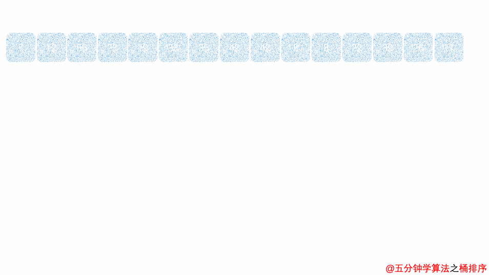

```java
public static List<Integer> bucketSort(List<Integer> arr, int buketSize) {
	int n = arr.length;
	if (n < 2 || buketSize == 0) return arr;
	int[] extremum = getMinAndMax(arr);
	int min = extremum[0];
	int max = extremum[1];
	// 桶个数，向下取整
	int bucketCnt = (int)Math.floor((max-min) / buketSize) + 1;
	
	List<List<Integer> > buckets = new ArrayList<>();
	for (int i = 0; i < bucketCnt; i++) {
		buckets.add(new ArrayList<Integer>()); // 创建桶
	}
	for (Integer el : arr) {
		int j = (el - min)/bucketSize; // idx
		buckets.get(j).add(el);	// 放进桶里
	}
	
	List<Integer> re = new ArrayList<>();
	// int index = 0;
	for (int i = 0; i < buckets.size(); i++) {
		List<Integer> bkt = buckets.get(i);
		if (bkt.size > 1) {
			insertSort(bkt); // 桶内插入排序
		}
		for (Integer k : bkt) {
			re.add(k); // 将排好序的数据，放回原来的序列中
			// index++;
		}
	}
	return re;
}
```

#### 6. 外部排序

**外归并排序**（External merge sort）：读入一些能放在内存内的数据量，在内存中排序后输出为一个顺串（即内部数据有序的**临时文件**），处理完所有的数据后再进行**归并**。如，要对 900 MB 的数据进行排序，但机器上只有100 MB的可用内存时，按如下操作：

1. 读入100 MB的数据至内存中，用某种内部排序（如[快速排序](#快速排序)、[堆排序](#堆排序)、[归并排序](#归并排序)等）在内存中完成排序。将排序完成的数据写入磁盘。
2. 临时文件不用完全载入主存，读入每个**临时文件**（9个顺串）的前10 MB（ = 100 MB / (9块 + 1)）的数据放入内存中的输入缓冲区；剩余的10 MB 作为输出缓冲区。
3. 用 [PriorityQueue 优先队列实现最小堆（类似合并 K 个升序链表）](#第K个元素)，执行九路归并算法，将结果输出到输出缓冲区。满了后将数据写出至目标文件，清空缓冲区。
4. 一旦 9 个输入缓冲区中的一个变空，就从关联的文件再读入10M 数据，直到读完。

##### 经典例题

- 第k大：一亿条数据选出其中1000个最大的；
    - 外部排序 + 堆排序；
- 内存 1000M、文件 1G、10个出现次数最多的网址；

## 查找

#### 顺序查找


#### 二分查找

基本思想：减而治之（减治）思想，逐渐（减半）缩小问题规模。

```java
Arrays.sort(nums);
// 必须有序
int index = Arrays.binarySearch(nums, [0, nums.length,] target);
```

##### 应用场景

1. 有序数组中查找 `target` 的下标；用于折半插入排序、二叉查找树等；
    - 计算满足约束条件 `f(x) == target` 时自变量、下标 `x` 的取值范围（即搜索区间）；
2. 找左、右边界的下标；
3. 对时间复杂度要求 `O(log n)、log(n)`；

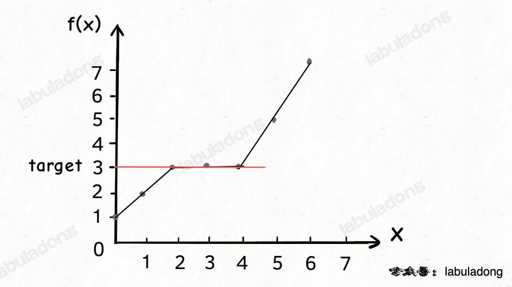

##### 经典例题

- [704.二分查找](https://leetcode.cn/problems/binary-search/)

- [34.在非递减数组中查找元素的第一个和最后一个位置](https://leetcode.cn/problems/find-first-and-last-position-of-element-in-sorted-array/)

    - [35.搜索插入位置](https://leetcode.cn/problems/search-insert-position/)：找左边界，找不到则插入：如 `nums = [2,3,5,7]` 中搜索 `target = 4`，搜索左边界的二分算法返回 `2`；左边界也可理解为：【】
        1. `nums` 中大于等于 `target` 的最小元素索引；
        2. `target` 应在 `nums` 中插入的索引位置；
        3. `nums` 中小于 `target` 的元素个数。
    - [剑指 Offer 53-I.在排序数组中统计一个数字出现的次数](https://leetcode.cn/problems/zai-pai-xu-shu-zu-zhong-cha-zhao-shu-zi-lcof/)：`repeatTime = lastPos - firstPos + 1;`

- [4.寻找两个正序数组的中位数](https://leetcode.cn/problems/median-of-two-sorted-arrays/)：

    - 中位数的定义：
        1. 当 `m1 + m2` 是奇数时，是合并数组的第 `(m1 + m2)/2 + 1`个元素；
        2. 当 `m1 + m2` 是偶数时，是第 `(m1 + m2)/2`和第` (m1 + m2)/2 + 1` 个元素的平均值（/2.0）。
    - 中位数对应的两下标之和是已知的 `k = (m1 + m2)/2`；
    - ~~合并，根据奇偶计算，O(m, n)；~~
    - 不合并，用双指针 + **二分查找**的减治思想：`log(m1 + m2)`；
        - 调用（二分查找）虚拟合并的数组中第 `k` 小的元素：
            1. 分别找出两链表第 `k/2` 大的数，对比，小的表明该数组的前 `k/2` 个数字都不是第 `k` 小数字，可舍弃；
            2. 每次将`k`自减`(j-i) + 1`长度，指向较小值的指针后移`j + 1`位，直到到达中位数的位置（k=1时，返回两数组较小的一个）。如果一个指针已到达数组末尾，则中位数一定在另一数组。
    - [链表中点](#链表快慢双指针)

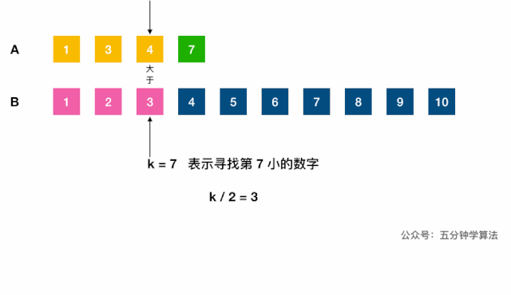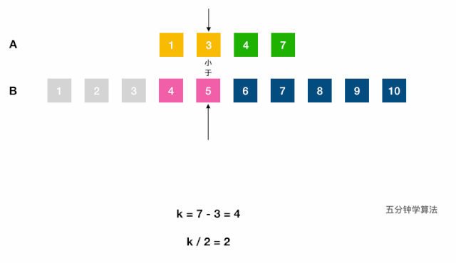

- [剑指 Offer 11.旋转数组的最小数字](https://leetcode.cn/problems/xuan-zhuan-shu-zu-de-zui-xiao-shu-zi-lcof/)：二分查找左边界的变体，把数组最开始的若干个元素搬到末尾，`target` > 前面的数字。`[l, r)`

    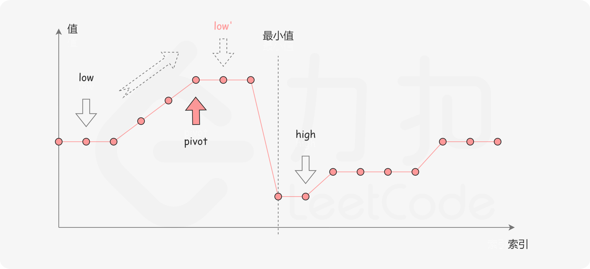

##### 二分查找框架

> 常用 `[begin,end) `表示左闭右开，`[left, right]`、`[from, to]` 表示左闭右闭，范围包括左右端点。

```java
// leftBound()
// searchFistPos()
int binarySearch(int[] nums, int target) {
	int result = -1;
	int n = nums.length;
    if (n <= 0) return -1; //
    int left = 0;
    int right = n-1; // 查找区间为[left, right]，left = right + 1 时搜索区间为空，故while条件为l <= r。推荐。
    // //int right = n; // 查找区间为[left, right)，left = right 时搜索区间为空，故while条件为l < r；不采用

	// 终止条件是查找区间为[]时，表示在区间里只剩下一个元素时仍需继续查找
    while (left <= right) {
    	// 防溢出，int signed 4byte 32bit ~2^31-1 ~21亿，取left = right = 2^31-2
        int mid = left + (right - left) / 2;
        int num = nums[mid];
        // 若中间值小于目标值
        if (num < target) {
        	// 则左边界向右收缩，搜索区间变为[mid + 1, right]
            left = mid + 1;
        } else if (num > target) {
        	// 右边界向左收缩
            right = mid - 1;
            
            // //[left, right)，当 nums[mid] 被检测后，下一步应去 mid 的左侧[left, mid)或右侧区间[mid + 1, right)搜索，不采用
            // //left = mid + 1; right = mid;
        } else {
            // 0.当 nums[mid] == target 时立即返回
            result = mid;
            break;

            // 1.找左边界时，当中间值和目标值相等时，右边界也需向左收缩，最终达到left锁定左边界的目的。
    		right = mid - 1;
    		// 2.找右边界时，收缩左侧边界
    		left = mid + 1;
        }
    }
    // 0.二分查找，未找到
    return result;
    
    // 1.找左边界时，检查 left 是否越界、是否未找到目标值（未找到时left == right+1，查找区间为[]）
    if (left >= n || nums[left] != target) { return -1; }
    return left;
    
    // 2.找右边界时，检查 right 是否越界
    if (right < 0 || nums[right] != target) { return -1; }
    return right;
}
```

####  B 树和 B+ 树

> 见数据结构文档 #二叉树部分、MySQL 文档 #存储引擎部分。

#### 哈希表

> 见数据结构文档。

#### 字符串模式匹配

[KMP 字符串匹配算法](#链表)

## 滑动窗口

> 见字符串中的[滑动窗口](#滑动窗口)


## 分治与递归

#### 分治

分治（Divide and Conquer）：问题分而治之；

1. 分解 ：将（复杂的）原问题分解为结构相同（相似、重叠）的子问题；
2. 解决（触底）：分解到某个容易求解的边界后，进行**递归**求解；
3. 合并（回溯）：将子问题的解合并成原问题的解。

#### 递归

所有递归算法的本质上都是[二叉树的遍历](#前序/中序/后序遍历)。

递归 VS 迭代：都是循环中的一种。

- 迭代：函数内某段代码实现循环，与普通循环的区别：将本次循环的输出作为下次循环的输入；循环代码中参与运算的变量同时是保存结果的变量，作为下一次循环的初始值。

    1. 向下调整**堆**，父子节点交换后，子节点成为新的父节点；
    2. 二分查找中用 `mid` 更新查找区间 `[left, right]`；
    3. 动态规划，状态转移方程中通过做选择从当前状态转移到下一个状态；如，斐波那契数列；

- 递归（Recursion）：重复**调用函数自身**实现循环。还指重复将问题分解为同类的子问题而解决问题的方法。
    1. 递推：把复杂问题的求解**递推**到简单问题的求解；
        - 画出**递归树**，向下生长直到最简单情况，分析算法的复杂度、寻找算法低效的原因。
    2. 递归出口：必须有一个明确的递归结束条件；
    3. 回归：当获得最简单的情况后，逐层返回，依次得到复杂的解。

缺点是：递归层数过多时，会造成**栈溢出**。

打印递归树：

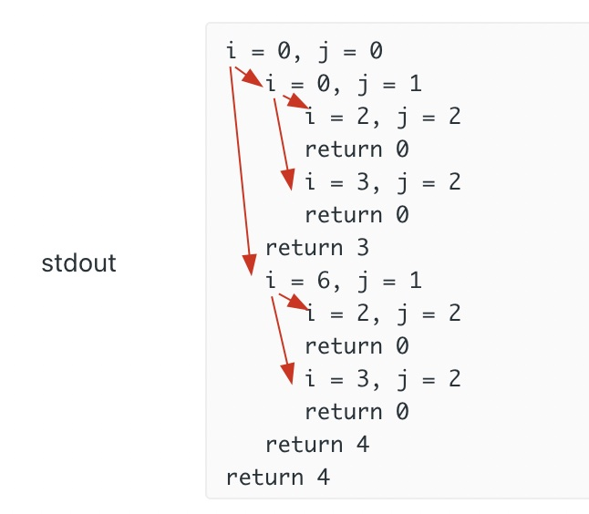

```java
// 打印缩进和i、j来debug递归
int count = 0;
void printIndent(int n) {
    while (n-- > 0)) {
        System.out.print("\t");
    }
}

int dp(string& ring, int i, string& key, int j) {
    // printIndent(count++);
    // printf("i = %d, j = %d\n", i, j);

    if (j == key.size()) {
        // printIndent(--count);
        // printf("return 0\n");
        return 0;
    }
    
    int res = INT_MAX;
    for (int k : charToIndex[key[j]]) {
        res = min(res, dp(ring, j, key, i + 1));
    }
    
    // printIndent(--count);
    // printf("return %d\n", res);
    return res;
}
```

#### 经典例题

- 二叉树
    - [对称的二叉树](https://leetcode.cn/problems/dui-cheng-de-er-cha-shu-lcof/)
- 菲波那切数列
- 阶乘
- 快速排序
- 二分查找
- 汉诺塔

## BFS 框架

BFS 也是一种暴力穷举算法，必须掌握。本质就是二叉树的层序遍历，适合解决最短路径问题。

##### 为什么常用 BFS 寻找最短路径？

##### 为什么常用 DFS 寻找所有路径？


#### 广度优先搜索常见场景

- 本质是在一幅「图或书」中，找到从起点 `start` 到终点 `target` 的最短距离；
- 遍历图（或树）

#### 经典例题

- [最短路径 Dijkstra 算法模板](#布隆过滤器)：就是改造版 BFS 算法 + 类似 dp table 的数组。
- [752.打开转盘锁的最少步数](https://leetcode.cn/problems/open-the-lock/)

#### BFS 算法框架

- [层序遍历](#层序遍历)

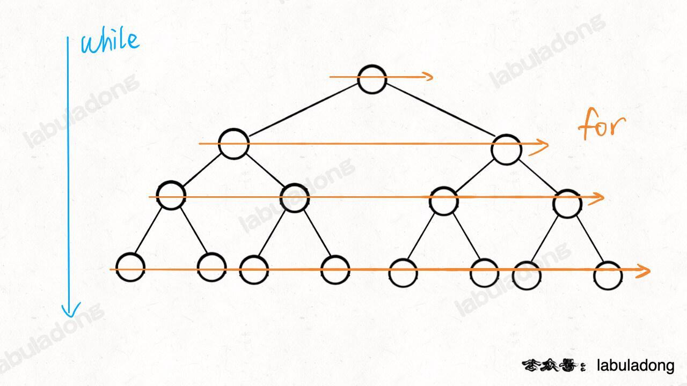

```java
// BFS 遍历树：计算从起点 start 到终点 target 的最近距离
int BFSTree(Node start, Node target) {
	int step = 0; // 记录扩散的步数
	if (start == null) {
    	return step;
    }
	// 核心数据结构
    Queue<Node> q = new LinkedList<>();
    // 图避免走回头路，一般的二叉树结构没有子节点到父节点的指针，不会走回头路
    Set<Node> visited = new HashSet<>(); 
    
    q.offer(start); // 将起点加入队列
    visited.add(start);

    while (!q.isEmpty()) {
        // 划重点：更新步数，记录层数
        step++;
        int sz = q.size();
        // 将当前队列中的所有节点向四周扩散，遍历一层，按层从左到右遍历树
        for (int i = 0; i < sz; i++) {
            Node cur = q.poll();
            // 判断是否到达终点
            if (cur is target)
                return step;
            // 将 cur 的相邻节点加入队列
            for (Node x : cur.adj()) {
                if (x not in visited) {
                    q.offer(x);
                    visited.add(x);
                }
            }
        }
    }
    return step;
}
```

## DFS 框架、回溯

> 分类的稍微有点粗糙了，没有细分出回溯/分治来

- 回溯算法：实际上就是**多叉决策树**的 DFS 遍历，关键是在前序和后序位置做一些操作。本质是：走不通就回头。回溯算法是一种纯粹的暴力穷举算法，**必须掌握**。

- DFS 算法：本质上是一种**暴力穷举算法**，为图论中的概念。回溯算法是在遍历树枝，DFS 算法是在遍历节点。

#### 常见场景

1. 遍历图（或树）；
    - 基于树的 DFS：需要记住递归写前序、中序、后序遍历二叉树的模板；
    - 二叉查找树（BST）；
2. 秒杀所有排列/组合/子集问题；
3. 找出图或树中符合题目要求的全部方案；
    - 图中（有向无向皆可）的符合某种特征（如最长）的路径及长度；

#### 经典例题

- [46.全排列（元素无重不可复选）](https://leetcode.cn/problems/permutations/)：**回溯框架**。
    - [47.全排列 II（元素可重可复选）](https://leetcode.cn/problems/permutations-ii/)【】

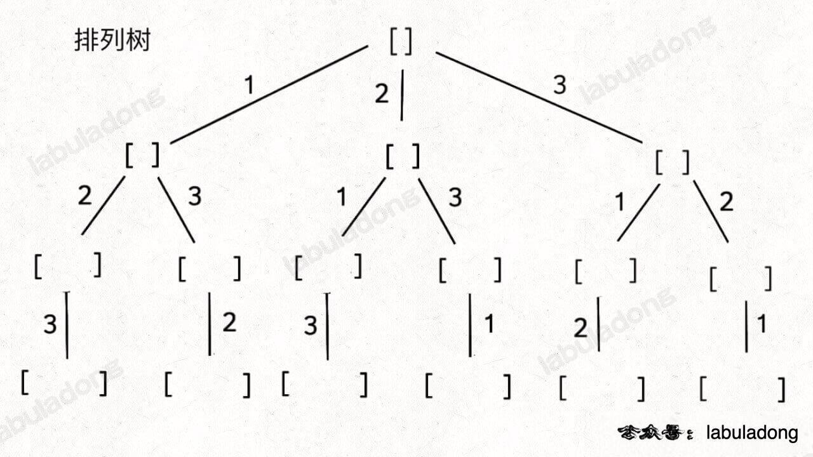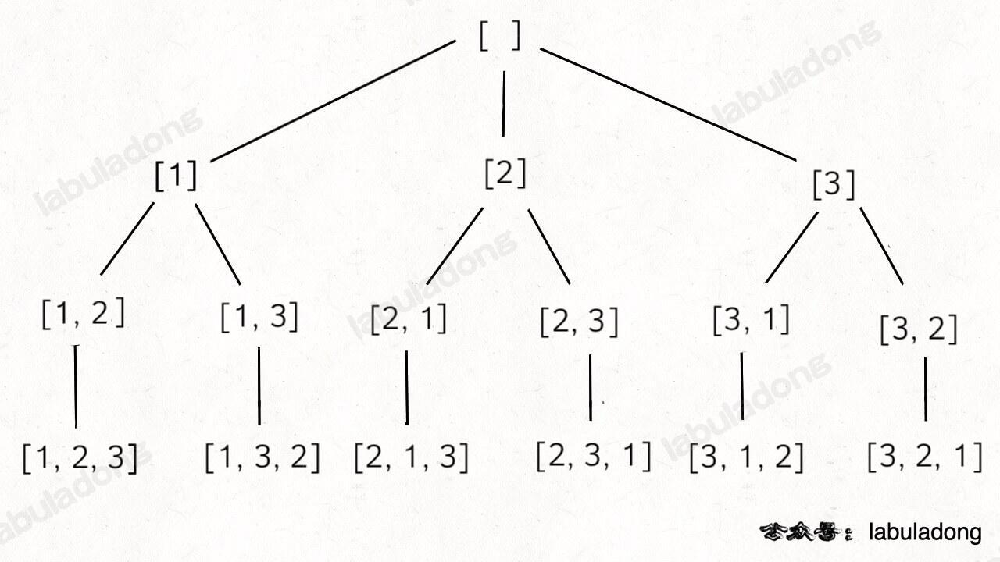

- 元素可重不可复选【】，即 `nums` 中的元素可以存在重复，每个元素最多只能被使用一次。

    以组合为例，如果输入 `nums = [2,5,2,1,2]`，和为 7 的组合应该有两种 `[2,2,2,1]` 和 `[5,2]`。

- 元素无重可复选【】，即 `nums` 中的元素都是唯一的，每个元素可以被使用若干次。以组合为例，如果输入 nums = [2,3,6,7]，和为 7 的组合应该有两种 [2,2,3] 和 [7]。

- [组合/子集问题](https://labuladong.github.io/algo/4/29/105/)

    - 通过保证元素间的相对顺序不变来防止出现重复的子集。
    - 把根节点作为第 0 层，将每个节点和根节点间树枝上的元素作为该节点的值，那么第 `n` 层的所有节点就是大小为 `n` 的所有子集
    - [78.子集（元素无重不可复选）](https://leetcode.cn/problems/subsets/)【】

    组合/子集树：

    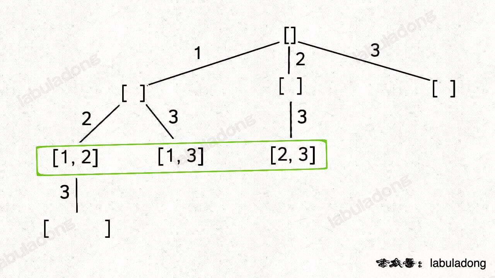

- [51.N 皇后](https://leetcode.cn/problems/n-queens/)：空间换时间【】

- [200.岛屿数量](https://leetcode.cn/problems/number-of-islands/)：将二维矩阵抽象成网状的图，每个节点和周围的四个节点连通，用 DFS 算法把遇到的岛屿「淹了」，避免维护 `visited` 数组。

    - [695.岛屿的最大面积](https://leetcode.cn/problems/max-area-of-island/)【】

#### 回溯算法经典例题

- [967.连续差相同的数字](https://leetcode.cn/problems/numbers-with-same-consecutive-differences/)【】
- [491.递增子序列](https://leetcode.cn/problems/non-decreasing-subsequences/)【】
- [980.不同路径 III](https://leetcode.cn/problems/unique-paths-iii/)【】
- [131.分割回文串](https://leetcode.cn/problems/palindrome-partitioning/)【】
- [93.复原 IP 地址](https://leetcode.cn/problems/restore-ip-addresses/)【】
- [17.电话号码的字母组合](https://leetcode.cn/problems/letter-combinations-of-a-phone-number/)【】
- [79.单词搜索](https://leetcode.cn/problems/word-search/)【】

#### 回溯算法框架

站在**回溯树**的一个节点上，只需思考 3 个问题：

1. 路径：已做出的选择；
2. 选择列表：当前可做的选择；
3. 结束条件：到达决策树底层，无法再做选择时。

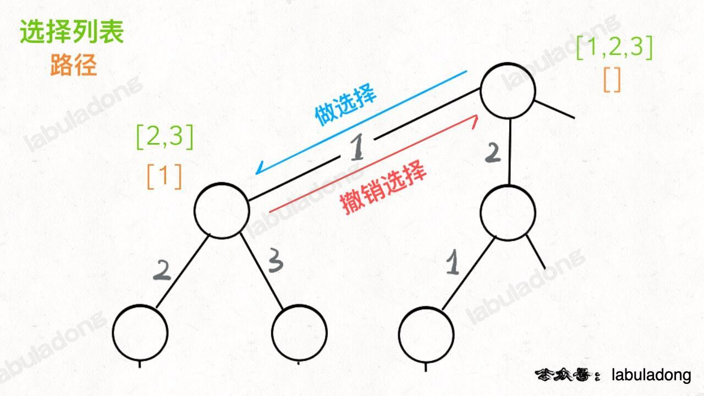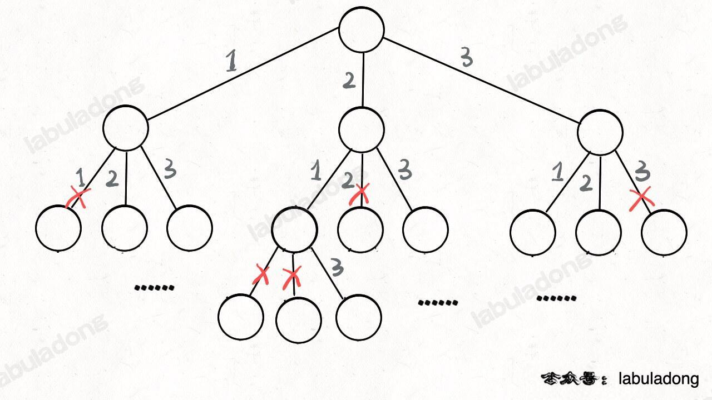

另见[层序遍历](#层序遍历)二叉树

```java
List<List<Integer> > res = new LinkedList<>();

// 排列
public List<List<Integer> > permute(int[] nums) {
	// 一个排列，记录路径
	LinkedList<Integer> track = new LinedList<>();
	// 标记已走过路径中的元素，避免重复使用
	backtrack(nums, track, used);
	return res;
}

// 回溯
private void backtrack(int[] nums, 路径track, 选择列表) {
    if 满足结束条件:
        result.add(路径)
        return

    for 选择 in 选择列表:
        # 做选择
        将该选择从选择列表移除
    	路径.add(该选择) # 记录路径

        // 核心是递归
        backtrack(路径, 选择列表)

        # 可重复做选择的情况，撤销选择
        路径.remove(选择)
		将该选择再加入选择列表
	
	// 组合
        for (int i = start; i < nums.size(); i++) {
        // 做选择
        track.push_back(nums[i]);
        // 回溯
        backtrack(nums, i + 1, track);
        // 撤销选择
        track.pop_back();
    }
}
```

## 贪心

贪心思路：每一步总是选取最优的操作，只看眼前，不考虑以后可能造成的影响。

每道题都不一样，没有通用解法。在有**最优子结构**的问题中尤为有效。

与动态规划的不同：在于对每个子问题的解决方案都做出选择，不能回退。动态规划则会保存以前的运算结果，用于对当前进行选择，有回退功能。

- [134.加油站](https://leetcode.cn/problems/gas-station/)
    - 数学图像解法：进入站点 `i` 可加 `gas[i]` 的油（绿色），离开站点会损耗 `cost[i]` 的油（红色），那么可把站点和与其相连的路看做一个整体，将 `change[i] = gas[i] - cost[i]` 作为经过站点 `i` 的油量变化值（橙色）。
    - 判断环形数组中是否能找到一个起点 `start`，使从此开始的**累加和**一直>= 0。累加和的最低点最有可能作为起点。若`sum(gas[i] - cost[i]) < 0`，即`sum(gas[...]) < sum(cost[...])`，总油量小于总消耗，无法环游所有站点，无解；否则原点即为所求。

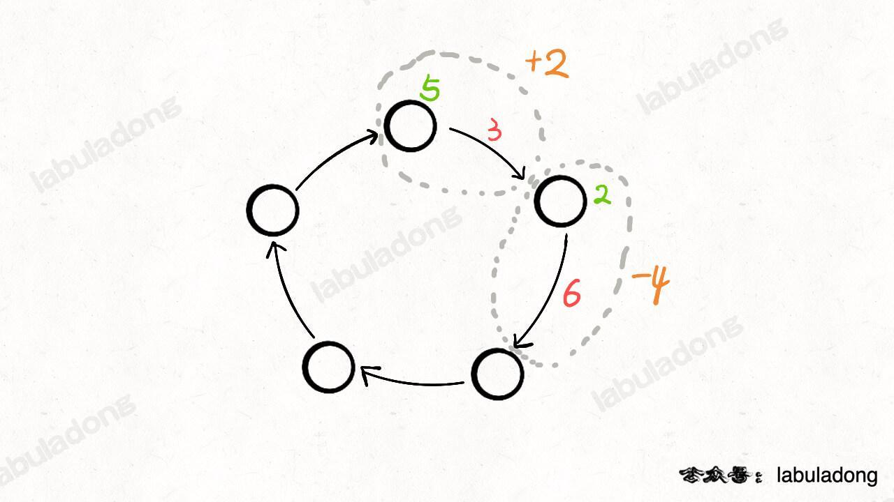  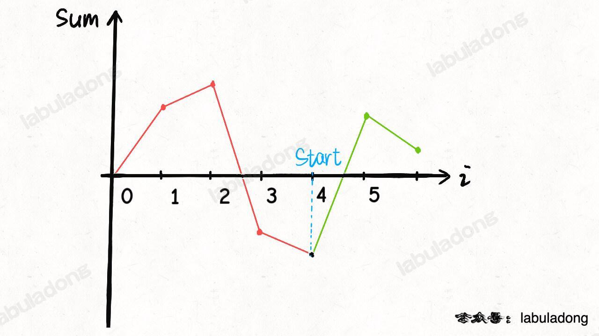

- ~~贪心解法~~：如果从 `i` 出发无法走到 `j`，那么 `i` 及 `i, j` 间的所有站点都不可能作为起点。

- [KMP 字符串匹配算法](#链表)
- [最小生成树 Kruskal 算法](#图的搜索、遍历)
- [哈夫曼编码](#二叉树)

## 动态规划

核心思想：如何聪明地**穷举求最值**。本质上是穷举「状态」，做「选择」找最优解。

动态规划的暴力穷举解法一般是递归形式，优化方法非常固定，要么是添加备忘录，要么是改写成迭代形式。

#### 动态规划三要素

1. **重复子问题**：在计算的过程中，有一些问题会重复计算，必须记住结果；若没有重复子问题，可用「分治法」求解。
2. 最优子结构：子问题间必须互相独立、可同时最优，不能互相影响。如要总分最高，则子问题为语文、数学等分别最高。如果语文、数学成绩互相制约、影响，不能同时达到最高，子问题并不独立，无法同时最优。
3. **状态转移方程**（暴力解）：
    1. 明确 **base case**：直接从~~最底下、~~最简单、问题规模最小~~、已知结果的~~，开始往上推，直到想要的答案。如 `f(1)` 和 `f(2) ` 推出 `f(20)`。
    2. 明确**状态**：记录解决问题到了哪一步，通常是原问题和子问题中随自变量变化的（题目中的）因变量，状态一般作为 `dp` 数组的下标/key ；如目标金额 `n`。
    3. 做选择：导致状态产生变化的行为，通过**选择**从一个状态转移到另一个状态。如，选择了一枚 1、2、5 元的硬币，从而目标金额 `n` 减少了对应的 1、2、5 元。
    4. 定义 `dp` 数组/函数的含义：一般 { key / 参数， value / 函数返回值 } = { 状态，题目要求计算的量/做选择的（最少）次数}。如 { 目标金额 `n`，凑出 `n` 所需的最少硬币数量 / 至少需 `dp[n]` 枚硬币凑出}。
    5. **状态转移方程**：对最后一步，可由已知的**状态**，通过**选择**所有情况（1、2、5元），**转移**到目标状态：
        - 还差1元，dp[n] = dp[n - **1**] + 1;
        - 还差2元，dp[n] = dp[n - **2**] + 1;
        - 还差5元，dp[n] = dp[n - **5**] + 1;
    6. 循环迭代：一般都脱离了递归，由**循环迭代**计算，自底向上进行递推求解。
    7. 优化递归树，消除**重叠子问题**：通过**递归树**找到**被重复计算的子问题节点**，寻找算法低效的原因。
        1. 通过**剪枝**，消除巨量冗余（重叠子问题），极大减少了子问题的个数。
        2. 分析递归算法的时间复杂度：子问题个数（即递归图中节点总数） X 解决一个子问题需要的时间。
            - 降低时间复杂度：用空间换时间。
        3. 降低空间复杂度：如果每次状态转移只需 DP table 中的一部分，可尝试缩小 DP table 的大小，只记录必要的数据。

#### 子序列

> 子序列 != 子串

子序列：不改变剩余字符顺序的情况下，删除某些字符或不删除任何字符形成的一个序列。另外定义见[回文串](#回文串)。

- 双字符串动态规划（大多为二维）

    - [1143.最长公共子序列](https://leetcode.cn/problems/longest-common-subsequence/)： 

        - 定义：`dp[i][j]` 的含义是 `s1[0..i-1]` 和 `s2[0..j-1]` 的 LCS 长度；
        - 目标：`s1[0..m-1]` 和 `s2[0..n-1]` 的 lcs 长度，即 `dp[m][n]`；
        - `base case`: `dp[0][..] = dp[..][0] = 0 `；
        - [剑指 Offer II 095.最长公共子序列](https://leetcode.cn/problems/qJnOS7/)【】

    - [72.最小编辑距离](https://leetcode.cn/problems/edit-distance/)：将 `word1` 转成 `word2` 所使用的最少操作数 。【】

        - 定义 `dp` 数组：`dp[i-1][j-1]` 存储 `s1[0..i]` 和 `s2[0..j]` 的最小编辑距离。`dp` 数组索引至少是 0，所以索引会偏移一位。

        

        

- [516.最长回文子序列](https://leetcode.cn/problems/longest-palindromic-subsequence/)：区间 DP ~~与划分型 DP~~，在子串 `s[i,j]` 中，最长回文子序列的长度为 `dp[i][j]`；上一个可能的状态如下图：

    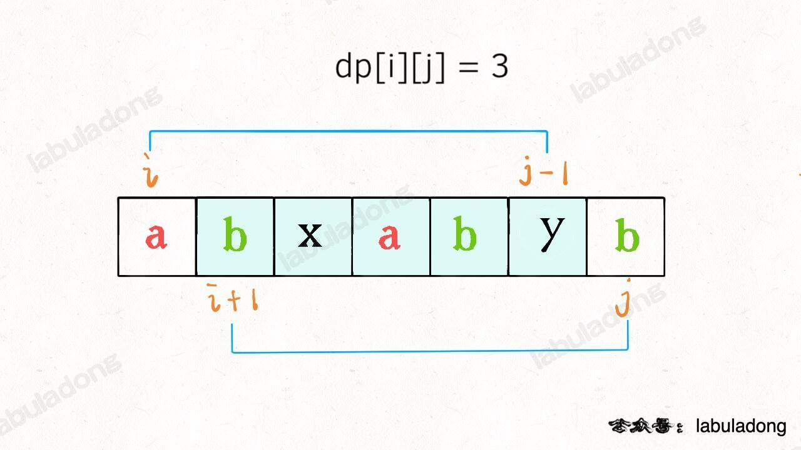

- （一维）[剑指 Offer 42.连续子数组的最大和](https://leetcode.cn/problems/lian-xu-zi-shu-zu-de-zui-da-he-lcof/)、[53.最大子数组和](https://leetcode.cn/problems/maximum-subarray/)【】

    - [300.最长递增子序列](https://leetcode.cn/problems/longest-increasing-subsequence/)：`dp[i] = Math.max(dp[i], dp[j] + 1)`

#### 经典例题

- [剑指 Offer 10-I.斐波那契数列](https://leetcode.cn/problems/fei-bo-na-qi-shu-lie-lcof/)：

    - 递归：简单，注意 `0、1、2` 的情况，但大量的重复计算会导致内存溢出；
    - ~~带「备忘录」、哈希表的递归算法，「自顶向下」进行递归求解。~~
    - 由动态规划的 `dp` 数组通过消除递归得到迭代（递推）解法：（滚动数组）re0、re1交替前进，注意最值取模 `1e9+7`、`10,0000,0007` 防止溢出。

- [剑指 Offer 10-II.青蛙跳台阶、爬楼梯问题](https://leetcode.cn/problems/climbing-stairs/)：重复子问题，滚动数组。

    - 状态：
    - （最后一次）选择：还差跳 1 或 2 阶；
    - dp 数组：{当前阶数，做的选择数、跳到 n 级台阶的方法个数}；
    - 状态转移方程：`dp[n] = dp[n-1]*1 + dp[n-2]*1;`
    - 本质可理解为斐波那契数列：爬到第 `n` 级台阶的方法个数等于爬到 `n-1` 的方法个数和爬到 `n-2` 的方法个数之和。

- [322.零钱兑换](https://leetcode.cn/problems/coin-change/)、[剑指 Offer II 103. 最少的硬币数目](https://leetcode.cn/problems/gaM7Ch/)：见 [动态规划算法框架](#动态规划算法框架)，最优子结构、如何列出状态转移方程【】

- 分割问题：[416.分割等和子集](https://leetcode.cn/problems/partition-equal-subset-sum/)：【】

    - 先对集合求和，得出 `sum`，把问题转化为**背包问题**：背包容量为 `sum / 2` 和 `N` 个物品，每个物品的重量为 `nums[i]`。

    - `dp` 数组的定义：`dp[i][j] = x` 表示，对于前 `i` 个物品，当前背包的容量为 `j` 时，若 `x` 为 `true`，则说明可恰好将背包装满，若 `x` 为 `false`，则说明不能恰好将背包装满。

    - [0-1 背包问题](https://labuladong.github.io/article/wx.html?wx=RXfnhSpVBmVneQjDSUSAVQ)：每个物体只有两种可能的状态（取与不取），对应二进制中的 0 和 1【重要】

    - [2279.装满石头的背包的最大数量](https://leetcode.cn/problems/maximum-bags-with-full-capacity-of-rocks/)【】

        

- 各种玩小游戏

- 二维动态规划：[121.买卖股票的最佳时机](https://leetcode.cn/problems/best-time-to-buy-and-sell-stock/)、[剑指 Offer 63. 股票的最大利润](https://leetcode.cn/problems/gu-piao-de-zui-da-li-run-lcof/)：`dp[i][k][0 or 1]` 表示从第 i 天的这笔交易中获取的最大利润，0 和 1 代表是否持有股票， `0 <= i < n, 1 <= k <= K`，k 为交易次数（大 K 为交易数上限）。

    - [2016.增量元素间的最大差值](https://leetcode.cn/problems/maximum-difference-between-increasing-elements/)【】

    ```java
    特化到 k = 1 买入或卖出一次的情况：
    状态转移方程：max(今天选择 rest, 今天选择 sell);
    
    今天未持有股票，对于昨天来说，有两种可能，从中求最大利润：
    1、昨天未持有，今天选择 rest 休息，仍未持有；
    2、昨天持有，今天选择 sell，未持有股票。
    dp[i][0] = max(dp[i-1][0], dp[i-1][1] + prices[i]);
    
    今天持有股票，有两种可能，从中求最大利润：
    1、昨天就持有股票，今天选择 rest，今天仍持有股票；
    2、昨天本没有持有，但今天选择 buy，持有了股票。
    dp[i][1] = max(dp[i-1][1], -prices[i]);
    // 即前一天没有持有股票时、使dp[i-1][0]=0，今天选择买入则利润为-prices[i]
    
    base case：
    dp[0][0] = 0;
    dp[0][1] = -prices[i]; // Integer.MIN_VALUE;负数表示买入
    ```

#### 动态规划算法框架

##### 递归

```java
// 一、递归（可看做动态规划函数），推荐
int[] dp;
// 返回要凑出金额 amount 至少需要的硬币数
int coinDp(int[] coins, int amount) {
    if (amount < 0) return -1;
    // base case
    if (amount == 0) return 0;
    // 查备忘录，防止重复计算
    if (dp[amount] != dp.length) {
    	return dp[amount];
    }
    
    int res = Integer.MAX_VALUE;
    // 遍历当前状态的所有取值,1、2、5
    for (int coin : coins) {
        // 计算子问题的结果
        // amount - coin表示扣除当前面额，还需凑的金额
        int subProblem = coinChange(coins, amount - coin);
        // 子问题无解则跳过
        if (subProblem == -1) continue;
        // 在子问题中选择最优解，加1表示当前这枚硬币，面额可能为1、2、5
        res = Math.min(res, subProblem + 1);
    }
    // 未正好凑出金额amount，则返回-1，把计算结果存入备忘录
    dp[amount] = (res == Integer.MAX_VALUE) ? -1 : res;
    return dp[amount];
}

int coinChange(int[] coins, int amount) {
    // coins表示硬币面额，可取1、2、5
	dp = new int[amount + 1];
	// dp 数组全都初始化为特殊值
	Arrays.fill(dp, amount + 1);
	return dp(coins, amount);
}
```

##### 动态规划数组

```java
// 二、动态规划数组
int coinChange(int[] coins, int amount) {
    int[] dp = new int[amount + 1];
    // dp 数组全都初始化为特殊值，如 amount + 1，数组大小也为 amount + 1，
    // 因凑成 amount 金额的硬币数最多只可能等于 amount（全用 1 元），永远不可能为 amount + 1;
    // 若初始化为 Integer.MAX_VALUE 的话，dp[i-coin] + 1 会导致整型溢出。
    Arrays.fill(dp, amount + 1);
    
    dp[0] = 0;
    // 遍历所有状态
    for (int i = 0; i < dp.length; i++) {
        // 遍历当前状态的所有取值，1、2、5求所有选择的最小值
        for (int coin : coins) {
            // dp下界溢出，子问题无解，跳过
            if (i - coin < 0) {
                continue;
            }
            dp[i] = Math.min(dp[i], 1 + dp[i - coin]);
        }
    }
    return (dp[amount] == amount + 1) ? -1 : dp[amount];
}
```

## 位运算

- [136.只出现一次的数字](https://leetcode.cn/problems/single-number/)：异或 `^`【】


- [268.丢失的数字](https://leetcode.cn/problems/missing-number/) 【】
    1. 异或法
    2. 求和法

# 算法应用

## 缓存淘汰算法

- 参考：[字节二面挂！面试官追问 Redis 内存淘汰策略 LRU 和传统 LRU 差异，我答懵了](https://mp.weixin.qq.com/s/r9TlYBlWuU74M50J9N0sCQ)

应用：

1. Redis 缓存文档中的 #**缓存淘汰策略**、
2. 操作系统中的 #内存管理 #**页面置换算法**。

#### 总结：本质区别与选择

从本质上看，LRU 和 LFU 的核心差异是**判断`价值`的维度不同**：

- LRU 用**最近是否被使用**衡量价值，适合短期热点；
- LFU 用**使用频率高低**衡量价值，适合长期热点。

在 Redis 中，两者都做了性能优化（近似实现），选择时不用纠结 理论完美性，

1. 先看**业务访问模式**：短期集中访问用 LRU，长期高频访问用 LFU。
2. 如果实在不确定，不妨先试 LRU（实现更简单，兼容性更好），再根据监控数据调整。

### LRU 基础算法

**LRU**（`Least Recently Used`）最近最少使用策略：优先删除、淘汰**最久未使用**的数据，即上次被访问时间**距离现在**最久的数据。

- 可以保证内存中的数据都是**热点数据**（经常被访问的数据），从而保证**缓存命中率**。

- 核心逻辑：**最近没被用过的**，下次也大概率用不上。
- 思路：保留最近使用的，淘汰最近最少使用的。

#### 举例

> 例如：电脑桌面上放着常用的软件图标（微信、IDE），这些是最近常用的；而几个月没打开过的压缩工具，会被你拖到文件夹里。

缓存：

1. 假设缓存容量只有 3，依次存入 A、B、C，此时缓存是 [A,B,C]；
2. 若此时访问 A（A 变成最近使用），缓存顺序变为 `[B,C,A]`
3. 若再存入D（缓存满了），需要淘汰**最近最少使用的 B**，最终缓存是 [C,A,D]

#### 使用场景

LRU 适合**短期高频**场景，比如：

1. **浏览器缓存**：浏览器缓存网页时，会优先淘汰最近最少打开”的页面（比如一周没打开的网页，会被优先清理）；
2. **Redis 默认内存淘汰策略**：Redis 的`allkeys-lru`和`volatile-lru`是基于 LRU 的（实际是 “近似 LRU”，性能更高），适合 “缓存访问具有**短期局部性**” 的场景（比如电商**商品详情页**，用户打开后短时间内可能再次刷新）；
3. **本地缓存基础版**：如果业务中没有突发大量一次性访问，用 LRU 实现本地缓存足够满足需求（比如用 LinkedHashMap 快速开发）。

#### 优缺点

优点：

1. **逻辑简单**：只关注使用时间，**实现成本低**，容易理解
2. **响应快**：插入、删除、查询的时间复杂度可以做到 O (1)（用**链表 + 哈希表**实现）
3. **贴合短期局部性**：很多业务场景中，最近用的数据，确实接下来更可能用（比如刚打开的文档，接下来大概率会继续编辑）。

缺点：

1. **突发访问误淘汰**：如果突然有**大量一次性数据**访问，会把原本常用的缓存挤掉。
    - 比如缓存容量 3，原本缓存 [A,B,C]（A 是高频使用），突然连续访问 D、E、F，此时会淘汰 A、B、C，缓存变成 [D,E,F]；但后续再访问 A 时，A 已经被淘汰，需要重新从数据库加载，导致**缓存命中率**骤降。
2. **不考虑使用频率**：如果 A 每天用 100 次，B 每天用 1 次，但 B 是 1 分钟前刚用，A 是 2 分钟前用，LRU 会优先淘汰 A，这显然不合理（**高频使用**的 A 不该被淘汰）。

#### 实现方案

1. 方案一、基于 **双向链表 + HashMap** 的实现
2. 方案二、基于哈希链表 `LinkedHashMap`的实现（双向链表和哈希表的结合体）

淘汰尾部 or 头部？

##### 基于**双向链表 + HashMap**

1. 访问某个节点时，将其从原来的位置删除，并重新插入到**链表头部**。这样就能保证**链表尾部**存储的就是最近最久未使用的节点，（当**节点数量**大于缓存最大空间时）就**淘汰链表尾部**的节点。
2. 为了使**删除操作**时间复杂度为 O(1)，就不能采用**遍历**的方式找到某个节点。而是用 **HashMap** 存储着 **Key 到节点的映射**，通过 Key 就能以 O(1) 的时间得到节点，然后再以 O(1) 的时间将其从**双向链表**中删除。

`LinkedHashMap`本质是哈希表 + 双向链表，但如果想深入理解 LRU 的实现原理，建议自己手写一个。

- 核心是用哈希表保证 O (1) 查询，用双向链表保证 O (1) 插入、删除（维护访问顺序）。
- 适用于高并发场景和面试。

```java
import java.util.HashMap;
import java.util.Map;

publicclass LRUCache2<K, V> {
    // 双向链表节点：存储key、value，以及前后指针
    staticclass Node<K, V> {
        K key;
        V value;
        Node<K, V> prev;
        Node<K, V> next;

        public Node(K key, V value) {
            this.key = key;
            this.value = value;
        }
    }

    private final int maxCapacity;
    private final Map<K, Node<K, V>> map; // 哈希表：key→Node，O(1)查询
    private final Node<K, V> head; // 虚拟头节点（简化链表操作）
    private final Node<K, V> tail; // 虚拟尾节点

    public LRUCache2(int maxCapacity) {
        this.maxCapacity = maxCapacity;
        this.map = new HashMap<>();
        // 初始化虚拟头尾节点，避免处理null指针
        this.head = new Node<>(null, null);
        this.tail = new Node<>(null, null);
        head.next = tail;
        tail.prev = head;
    }

    // 1. 获取缓存：命中则把节点移到链表头部（标记为最近使用）
    public V get(K key) {
        Node<K, V> node = map.get(key);
        if (node == null) {
            returnnull; // 未命中
        }
        // 移除当前节点
        removeNode(node);
        // 移到头部
        addToHead(node);
        return node.value;
    }

    // 2. 存入缓存：不存在则新增，存在则更新并移到头部；满了则删除尾部节点
    public void put(K key, V value) {
        Node<K, V> node = map.get(key);
        if (node == null) {
            // 新增节点
            Node<K, V> newNode = new Node<>(key, value);
            map.put(key, newNode);
            addToHead(newNode);

            // 缓存满了，删除尾部节点（最近最少使用）
            if (map.size() > maxCapacity) {
                Node<K, V> tailNode = removeTail();
                map.remove(tailNode.key); // 同步删除哈希表中的key
            }
        } else {
            // 更新节点值，并移到头部
            node.value = value;
            removeNode(node);
            addToHead(node);
        }
    }

    // 辅助：把节点添加到链表头部
    private void addToHead(Node<K, V> node) {
        node.prev = head;
        node.next = head.next;
        head.next.prev = node;
        head.next = node;
    }

    // 辅助：移除指定节点
    private void removeNode(Node<K, V> node) {
        node.prev.next = node.next;
        node.next.prev = node.prev;
    }

    // 辅助：移除尾部节点（最近最少使用）
    private Node<K, V> removeTail() {
        Node<K, V> tailNode = tail.prev;
        removeNode(tailNode);
        return tailNode;
    }

    // 测试
    public static void main(String[] args) {
        LRUCache2<Integer, String> cache = new LRUCache2<>(3);
        cache.put(1, "A");
        cache.put(2, "B");
        cache.put(3, "C");
        System.out.println(cache.get(1)); // 输出A，此时1移到头部
        cache.put(4, "D"); // 淘汰3
        System.out.println(cache.get(3)); // 输出null（已被淘汰）
    }
}
```

##### 基于哈希链表 `LinkedHashMap`

> （双向链表和哈希表的结合体）

- Java 的`LinkedHashMap`自带**按访问顺序排序**的功能，只需重写**`removeEldestEntry`方法**，就能实现 LRU 缓存。这是最简洁的实现方式，适合业务中不需要极致性能的场景，快速开发。
- 链表的**有序性**使元素维持插入顺序；每次默认**从链表尾部添加**元素，显然越靠尾部的元素就是最近使用的，越靠头部的元素就是最久未使用的。
    - 双向链表：删除链表节点要得到前驱节点的指针，而双向链表支持直接查找前驱， O(1)。
- 哈希映射的快速访问能力、可在 `O(1)` 时间访问链表的任意元素。定位到链表中的节点，从而取得对应 `val`、插入和删除。
- [146.设计LRU 缓存的数据结构并实现 get()、put()](https://leetcode.cn/problems/lru-cache/)

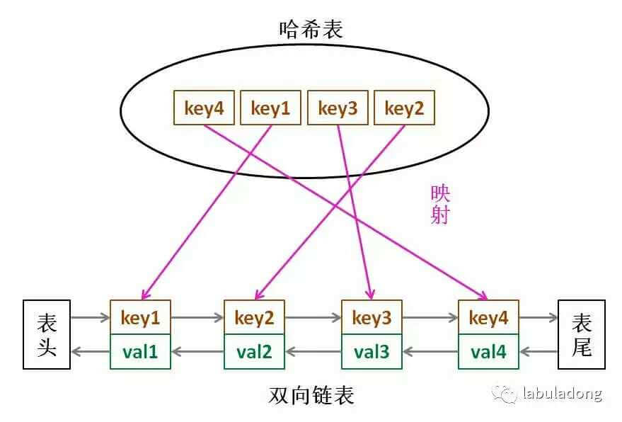

```java
import java.util.LinkedHashMap;
import java.util.Map;

publicclass LRUCache<K, V> extends LinkedHashMap<K, V> {
    // 缓存最大容量
    private final int maxCapacity;

    // 构造函数：accessOrder=true 表示“按访问顺序排序”（核心）
    public LRUCache(int maxCapacity) {
        super(maxCapacity, 0.75f, true);
        this.maxCapacity = maxCapacity;
    }

    // 核心：当缓存大小超过maxCapacity时，自动删除“最老的 entry”（最近最少使用的）
    @Override
    protected boolean removeEldestEntry(Map.Entry<K, V> eldest) {
        return size() > maxCapacity;
    }

    // 测试
    public static void main(String[] args) {
        LRUCache<Integer, String> cache = new LRUCache<>(3);
        cache.put(1, "A");
        cache.put(2, "B");
        cache.put(3, "C");
        System.out.println(cache); // 输出：{1=A, 2=B, 3=C}（插入顺序）

        cache.get(1); // 访问1，1变成最近使用
        System.out.println(cache); // 输出：{2=B, 3=C, 1=A}（按访问顺序排序）

        cache.put(4, "D"); // 缓存满了，淘汰最老的2
        System.out.println(cache); // 输出：{3=C, 1=A, 4=D}
    }
}
```

### LFU 基础算法

**LFU**（`Least Frequently Used`）最不经常使用策略：优先淘汰一段时间内**使用次数最少**的数据。

- 核心逻辑和 LRU 完全不同：**用得少的，下次也大概率用不上**，它关注的是`使用频率`，而不是`使用时间`。
- 按访问频率来淘汰，用一个 `HashMap` 存储访问频率。
- [剑指 Offer II 031.最近最少使用缓存](https://leetcode.cn/problems/OrIXps/)【】

#### 举例

生活例子：

- 手机里的 APP，微信、抖音是高频使用的（每天打开几十次），而指南针是低频使用的（几个月打开一次）。

- 当手机内存不足时，系统会优先卸载指南针这类低频 APP，这就是 LFU 的思路。

缓存：

1. 假设缓存容量 3，初始存入 A（使用 1 次）、B（使用 1 次）、C（使用 1 次），频率都是 1；
2. 访问 A（A 频率变成 2），此时频率：A=2，B=1，C=1；
3. 访问 A（A 频率变成 3），此时频率：A=3，B=1，C=1；
4. 存入 D（缓存满了），需要淘汰 “频率最低” 的 B 或 C（若频率相同，淘汰 “最近最少使用” 的，即 LFU+LRU 结合），最终缓存是 A、C、D（频率分别为 3、1、1）。

#### **优缺点**

优点：

- **更贴合长期高频场景**：能保留使用频率高的数据，即使它不是 最近使用的（比如 A 每天用 100 次，即使 10 分钟前没⽤，也不该被淘汰）；
- **避免突发访问误淘汰**：面对一次性突发访问（比如访问 D、E、F），因为这些数据的频率低，不会把高频的 A、B、C 挤掉，缓存命中率更稳定。

缺点：

- **实现复杂**：需要维护使用频率，还需要处理频率相同的情况（通常结合 LRU），时间复杂度比 LRU 高（插入、删除约 O (log n)）；
- **冷启动问题**：新存入的缓存频率低，容易被淘汰。比如一个新功能的接口，刚开始访问频率低，会被 LFU 优先淘汰，但其实后续会变成高频接口；
- **频率老化问题**：一个数据过去高频，但现在不再使用（比如活动结束后的活动页面），它的高频率会一直占用缓存，导致新的高频数据无法进入。

#### 实现 LFU

> 基于哈希表 + 优先级队列

LFU 的实现比 LRU 复杂，核心需要两个哈希表：

- `cache`：key→Node（存储 value 和使用频率、最后使用时间）；
- `freqMap`：频率→LinkedHashSet（存储该频率下的所有 key，LinkedHashSet 保证**插入顺序**，用于处理频率相同的情况）；
    - 再用一个变量`minFreq`记录当前最小频率，快速找到最该淘汰的 key。

### Redis 中的 LRU 和 LFU

Redis 作为缓存数据库，当内存达到内存`maxmemory`限制时，会触发**内存淘汰策略**，其中`LRU`和`LFU`是最常用的两种。

但 Redis 的实现并非 “严格版”，而是做了性能优化的 “近似版”， 这一点尤其需要注意。

#### **Redis 的 LRU 实现**

Redis 的 LRU 实现：近似 LRU（性能优先）

Redis 没有采用 “双向链表 + 哈希表” 的标准 LRU 实现，因为会增加内存开销和操作复杂度，而是用**随机采样 + 时间戳**实现近似 LRU：

- **核心原理**：每个 key 在内存中记录`lru`字段（最后一次访问的时间戳），当需要淘汰 key 时，Redis 会从所有候选 key 中**随机采样 N 个**（默认 5 个，可通过`maxmemory-samples`配置），然后淘汰这 N 个中`lru`值最小（最久未使用）的 key。
- **为什么近似**：严格 LRU 需要维护全量 key 的访问顺序，在 Redis 高并发场景下会成为性能瓶颈；近似 LRU 通过控制采样数（N 越大越接近严格 LRU，但性能稍差），在 “命中率” 和 “性能” 之间做了平衡。

相关配置：

```yaml
# 淘汰所有key中最久未使用的
maxmemory-policy: allkeys-lru
# 只淘汰设置了过期时间的key中最久未使用的
maxmemory-policy: volatile-lru
# 采样数（默认5，范围3-10）
maxmemory-samples: 5
```

#### **Redis 的 LFU 实现**

Redis 的 LFU 实现，结合频率与时间衰减。

Redis 4.0 引入了 LFU 策略，解决了标准 LFU 的频率老化问题，实现更贴合实际业务：

**核心改进**：

- **频率计数**：用`lfu_count`记录访问频率（但不是简单累加，而是用对数计数：访问次数越多，`lfu_count`增长越慢，避免数值过大）；
- **时间衰减**：用`lfu_decay_time`控制频率衰减（单位分钟），如果 key 在`lfu_decay_time`内没有被访问，`lfu_count`会随时间减少，避免**过去高频但现在不用**的 key 长期占用缓存。
- **淘汰逻辑**：当需要淘汰时，同样随机采样 N 个 key，淘汰`lfu_count`最小的（频率最低）；若频率相同，淘汰**最久未使用**的（结合 LRU 逻辑）。

相关配置：

```yaml
# 淘汰所有key中访问频率最低的
maxmemory-policy: allkeys-lfu
# 只淘汰设置了过期时间的key中访问频率最低的
maxmemory-policy: volatile-lfu
# 频率衰减时间（默认1分钟，0表示不衰减）
lfu-decay-time: 1
# 初始频率（新key的lfu_count，默认5，避免新key被立即淘汰）
lfu-log-factor: 10
```

#### 核心区别

| 维度             | Redis LRU                               | Redis LFU                                               |
| :--------------- | :-------------------------------------- | :------------------------------------------------------ |
| 判断依据         | 最后访问时间（越久未用越可能被淘汰）    | 访问频率（频率越低越可能被淘汰，结合时间衰减）          |
| **适用场景**     | 短期局部性访问（如用户会话、临时数据）  | 长期高频访问（如热点商品、基础配置）                    |
| 应对**突发访问** | 弱（易被一次性访问挤掉常用 key）        | 强（低频的突发访问 key 不会淘汰高频 key）               |
| **冷启动**友好度 | 较好（新 key 只要最近访问就不会被淘汰） | 需配置`lfu-log-factor`（避免新 key 因初始频率低被淘汰） |
| 内存 overhead    | 低（只存时间戳）                        | 稍高（存频率和时间衰减信息）                            |
| **典型业务案例** | 新闻 APP 的**最近浏览**列表             | 电商首页的**热销商品**缓存                              |

#### **怎么选？**

> 看业务访问模式。

**选 LRU**：如果你的缓存访问具有**短期集中性**（比如用户打开一个页面后，短时间内会频繁刷新，但过几天可能再也不看），比如：

1. 会话缓存（用户登录后 1 小时内频繁操作，之后可能下线）；
2. 临时活动页面（活动期间访问集中，活动结束后很少访问）。

**选 LFU**：如果你的缓存访问具有 “长期高频性”（比如某些基础数据每天都被大量访问），比如：

1. 商品类目、地区编码等基础配置数据；
2. 首页 banner、热销榜单等高频访问数据。
3. 排查技巧：可以先开启 Redis 的`INFO stats`监控`keyspace_hits`（缓存命中）和`keyspace_misses`（缓存未命中），如果切换策略后`keyspace_hits`提升，说明更适合当前业务。

## 负载均衡算法

> 见负载均衡文档。

## 限流算法

> 见 限流、降级、熔断文档。

