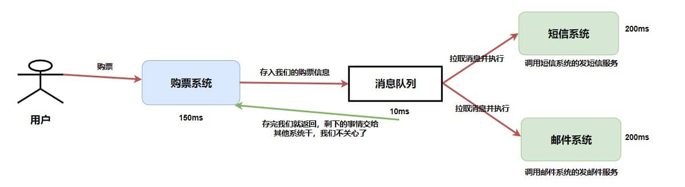

> 摘要：微服务架构中，服务之间**同步调用**是通过 RPC 来实现的，服务间的**异步处理、应用解耦**要通过 MQ 消息队列来实现。

<!-- more -->

---

### 目录

[TOC]

微服务架构中，服务之间**同步调用**是通过 RPC 来实现的，服务间的**异步处理、应用解耦**要通过 MQ 来实现。

- 虽然可以通过**多线程**来实现异步调用，但是不支持**持久化**，可能会造成**消息丢失**，所以一般都集成RabbitMq或者RocketMq。

## 消息队列

消息队列（`Message Queue`，**MQ** ）：是存放消息的容器，当需使用消息时，直接从容器中取出消息使用。

- 参与消息传递的双方称为 **生产者** 和 **消费者** ，生产者负责发送消息，消费者负责处理消息。
- 由于队列 Queue 是一种**先进先出**的数据结构，所以消费消息时也是按照顺序来消费的。

> 操作系统中，**进程通信**的一种很重要的方式就是消息队列。
>
> 微服务中的消息队列稍微有点区别，更多指的是各个服务以及系统内部**各个组件/模块**之间的通信，属于一种 **中间件** 。



### 优点、使用场景

> 你用消息队列做什么？

1. 应用**解耦**：将不同的系统之间、将**核心服务与非核心功能**剥离，显著的降低了系统间的耦合度。当需要对接多个系统，但是又不知道究竟有多少人关心时，就会考虑采用消息队列来通信。
    1. 例如，用消息队列来暴露**退款信息**，退款成功与否。很多下游关心，但是实际上，退款部门根本不关心有谁关心。在不使用消息队列时，就需要一个个循环调用过去。
    2. 用户注册成功之后，给用户发送短信。
    3. 如果模块之间不直接调用，耦合度就会很低，那么**修改或者新增**模块对其它模块的影响会很小，从而实现**可扩展性**。
2. **异步处理**、异步调用：将一个同步流程，利用消息队列来**拆成多个步骤**。这个特性被广泛应用在**事件驱动**之中。
    - 发送者将消息发送给消息队列之后，不需要**同步等待**消息接收者处理完毕，而是立即返回进行其它操作。消息接收者从消息队列中**订阅消息**之后异步处理。
    - 例如：在**注册流程**中，用户在填写完注册信息之后就可以完成注册，而将**发送验证邮件**这一消息发送到消息队列中。
    - 比如，在**退款**时，需要接入风控、多个款项资金转移，这些步骤都是利用消息队列解耦，上一个步骤完成，**发出事件来驱动**执行下一步。
    - RocketMQ 订单分区有序：订单号相同的消息会被先后发送到同一个队列中，消费时，同一个OrderId获取到的肯定是同一个队列。
3. 流量**削锋填谷**：主要是为了应对**短时间有大量的请求到达**，会压垮服务器。
    - 一般来说，数据库只能承受每秒上千的写请求，如果这时突然来了几十万的请求，那么数据库可能就会崩掉。
    - （缓冲的效果）可以将请求发送到消息队列中，服务器按照其处理能力慢慢从消息队列中**订阅、拉取**消息进行处理。与**限流算法**中的**漏桶算法**类似，都是进行削峰填谷。
    - （这是最大的考点，如**电商秒杀**）
4. ~~消息总线~~
5. ~~延时任务~~
6. ~~广播消费：消息推送、缓存同步~~
7. ~~分布式事务~~
8. ~~数据中转枢纽~~

#### 消息总线

所谓总线，就是**像主板里的数据总线一样， 具有数据的传递和交互能力，各方不直接通信，使用总线作为标准通信接口**。

在彩票订单的生命周期里，经过创建，拆分子订单，出票，算奖等诸多环节。
每一个环节都需要不同的服务处理，每个系统都有自己独立的表，业务功能也相对独立。假如每个应用都去修改订单主表的信息，那就会相当混乱了。

因此，公司的架构师设计了**调度中心**的服务，调度中心维护订单的信息，但它不与子服务通讯，而是通过**消息队列**和出票网关，算奖服务等系统传递和交换信息。


消息总线这种架构设计，可以让系统更加解耦，同时也可以让每个系统各司其职。

#### 数据中转枢纽

近10多年来，诸如 KV 存储（HBase）、搜索（ElasticSearch）、流式处理（Storm、Spark、Samza）、时序数据库（OpenTSDB）等专用系统应运而生。这些系统是为单一的目标而产生的，因其简单性使得在商业硬件上构建分布式系统变得更加容易且性价比更高。

通常，同一份数据集需要被注入到多个专用系统内。

例如，当应用日志用于离线日志分析时，搜索单个日志记录同样不可或缺，而构建各自独立的工作流来采集每种类型的数据再导入到各自的专用系统显然不切实际，利用消息队列 Kafka 作为数据中转枢纽，同份数据可以被导入到不同专用系统中。

日志同步主要有三个关键部分：日志采集客户端，Kafka 消息队列以及后端的日志处理应用。

1. 日志采集客户端，负责用户各类应用服务的日志数据采集，以消息方式将日志“批量”“异步”发送Kafka客户端。
    Kafka客户端批量提交和压缩消息，对应用服务的性能影响非常小。
2. Kafka 将日志存储在消息文件中，提供持久化。
3. 日志处理应用，如 Logstash，订阅并消费Kafka中的日志消息，最终供文件搜索服务检索日志，或者由 Kafka 将消息传递给 Hadoop 等其他大数据应用系统化存储与分析。


### 缺点

1. **可用性**降低：引入任何一个中间件，或者多任何一个模块，都会导致可用性降低。（所以这个其实不是MQ的特性，而是所有中间件的特性）。需考虑**消息丢失**、或 MQ 挂掉等情况。
2. 系统**复杂性**提高：分两方面，一方面是消息队列集群**维护**的复杂性，一方面是**代码**的复杂性。
3. **一致性**难保证：引入消息队列往往意味着**本地事务**不可用，那么就容易出现数据一致性的问题。真正消费者没有正确消费消息、导致数据不一致。例如业务成功了，但是消息没发出去。

（升华主题）几乎所有的中间件的引入，都会引起类似的问题。

- 再有就是**消费消息问题**（引入）：需解决消息重复消费、消息传递顺序、分布式事务、消息堆积、消息丢失，需考虑高可用、集群等。

### 消息生产、消费流程

> 存储机制

一条普通的MQ消息，从产生到被消费，大概流程如下：

1. 生产者产生消息，发送到MQ（服务器）；
2. MQ服务器收到消息后，将消息**持久化到**存储系统；
3. MQ服务器返回**ACK**到生产者；
4. ~~MQ服务器把消息push给消费者~~；消费者消费消息；
5. 消费者消费完消息，响应**ACK**；
6. MQ服务器收到ACK，认为消息消费成功，从**存储系统**中删除消息。


## 消息消费问题

### 如何解决六大消费问题

1. **消息丢失**：生产者、消费者用**同步方式**，在生产、消费完消息之后再发送 ACK 确认，`Broker` 代理存储端用 `RocketMQ` 的**[刷盘机制](#RocketMQ 刷盘机制)**，**主从节点**都写入成功，才反馈成功的ack给生产者。
2. **消息堆积**：先排查是不是 bug，然后生产者方面**限流、降级、熔断**（削峰） + 消费者方面紧急扩容、优化消费逻辑等。
3. **重复消费**：用 `Redis `的 set、`MySQL `的**主键**或者唯一性索引做**幂等性**校验。
4. **保证数据一致性**、可靠性：通过 `RocketMQ` 的**分布式事务消息**（加入消息状态，待发送、可发送） + 事务反查机制。
5. **保证顺序消费**：**同一语义**下的消息发送至**同一个 MQ** 服务器、被同一个消费者消费，且等到M1消费端**ACK成功后**，M2再发送。比如`Kafka`的**全局有序消息**、。
6. **保证高可用**：复制多副本机制 + `Kafka` 重新选举 leader。
7. 延时消息：

### 消息丢失

一个消息从生产者产生，到被消费者消费，主要经过三个过程。因此可以从这三个阶段**保证MQ不丢失消息**：

1. **生产者**丢失消息：生产者调用`send`方法发送消息后，可能**因网络问题**并没有发送过去。
    1. 采用**同步方式**发送：发送消息后返回**成功**状态，就表示消息正常到达了存储端 `Broker`；如果发送**异常**或者返回非成功状态，**自动重试**消息发送。
    2. 可以使用事务消息：`RocketMQ` 的**事务消息**机制就是为了保证零丢失来设计的。
2. **`Broker` 代理存储端**丢失消息：确保消息持久化到磁盘。如下，`RocketMQ` 的**[刷盘机制](#刷盘机制)**。Kafka 会把消息持久化到磁盘。
3. **消费者**丢失消息：比如消费者刚拿到消息准备进行**真正消费**时，突然挂掉，实际上并没有被消费。
    - 解决：消费者**执行完业务逻辑**后，再反馈回`Broker`已消费成功。


#### RocketMQ 刷盘机制

> 

### 消息堆积

> 消息重复发送

消息积压：指峰值太大导致消息堆积在队列中。

- 原因是：因为生产者的生产速度，远大于消费者的消费速度。

遇到消息积压问题时：

> ~~先排查是不是有bug产生了，如果是需要解决bug。~~

如果不是bug，可以从几个方面考虑：

1. 生产者方面，控制**生产速率**：不太会倾向于这个；
2. 消费者方面，加快**消费速率**：提升整体消费能力，先保证消息都消费完。
    1. 如果是**突然的**、偶然的积压：

        1. 那么只需要**临时紧急扩容**（增加消费者的数量），增加集群规模。~~比如，**水平扩容**（增加Topic的**队列数**和消费组**机器**的数量）~~。Kafka 的消费者组。
        2. 或者确保突然起来的消息都能在消息中间件上保存起来，不丢失。后续生产者的速率回归正常，消费者可以**逐步消费完**积压的消息。

        - 不过这个只能治标，缓解问题。

    2. 如果是**常态化**的生产者速率大于消费者：那么说明**容量预估**就不对。这时候就要**调整集群规模**，并且增加消费者。典型的就是，`Kafka`增加新的`Partition`。

    3. 提高消费单条消息的效率：**优化消费逻辑**。例如原本同步消费的，可以变成**异步消费**。把耗时的操作从消费的同步过程里面摘出去。

#### Kafka 的消费者组

> 

### 消息重复消费

导致幂等性问题、消息队列发生重复消费的原因：

> 什么情况下会出现一个请求被多次执行呢？

1. 分布式系统中，为避免数据丢失，采用的[超时和重试机制](#超时和重试机制)。
    1. 生产端**重复提交**：生产者等待消费者响应请求**超时**了（消息丢失），重试，可能向MQ重复发送相同的请求（消息），直到拿到成功的ACK。
    2. 消费端：消费消息一般的流程（拉取消息、业务逻辑处理、提交消费位移）都可能出现**超时重复消费**。
        1. 假设服务端已经执行了请求（业务逻辑处理完，事务提交了），但是需要**更新消费位移**时，消费者挂了、或者由于短暂的**网络波动**导致响应（在发送给生产者的过程中）延迟，这时候另一个消费者就会拉取到重复的消息。
        2. ~~举个例子~~：用户支付购买某个课程，由于重试的问题导致支付了两次。在执行用户购买课程的请求时需要**判断用户是否已经购买过**。这样的话，就不会因为重试的问题导致重复购买了。
2. 恶意攻击；

解决方案：使用**幂等性校验**处理重复消息。

### 分布式调用语义

1. 至少一次语义：指消费者**至少消费消息一次**。这意味着存在**重复消费**的可能，解决思路就是**幂等**；
2. ~~至多一次语义~~：指消费者至多消费消息一次。这意味着存在消息没有被消费的可能，
    - 基本上实际中不会考虑采用这种语义，只有在**日志采集**之类的，数据可以部分缺失的场景，才可能考虑这种语义；
3. 恰好一次语义：最严苛的语义，指消息不多不少恰好被消费一次；

绝大多数情况下，我们追求的都是**至少一次**语义：

- 即生产者至少发送一次，可能**重复发送**；
- 消费者至少消费一次，可能**重复消费**（虽然去重了，但是也认为消费了，只不过这个消费啥也没干）。

结合之下，就能发现，只要解决了消费者**重复消费**的问题，那么生产者发送多次，就不再是问题了。 

### 幂等性

> 见分布式事务、分布式 ID 文档。

幂等性：在**计算机中**，指的是一个操作**多次执行的结果**与执行一次的结果相同。

- ~~**方法**的幂等性~~：一个**方法**无论被重复执行多少次，所期望的结果和**第一次执行**所期望的结果保持一致。

- **接口**的幂等性：可以理解为，同一个接口，多次发出同一个请求，请求的结果是一致的。

    - HTTP GET请求：不管发送多少次GET请求，服务器返回的资源状态都是一致的。
    - HTTP POST 方法：用于创建资源，可以类比于`提交信息`，显然一次和多次提交是有副作用，执行效果是不一样的，**不满足幂等性**。

    > 比如：POST 的语义是创建一篇帖子，HTTP 响应中应包含帖子的创建状态以及帖子的 URI。两次相同的POST请求会在服务器端**创建两份资源**，它们具有不同的 URI；所以，POST方法**不具备**幂等性。

#### 应用场景

1. 前端重复提交：提交表单时，如果用户一直重复点击，可能会产生两条一样的数据。
2. 消息重复请求、重复消费：出现网络超时、或者网络丢包，这种情况如果**重试**，可能导致**重复请求**。
    - 需要做好幂等，否则的话，比如转账场景就会出现**转账多转**的情况。
3. 阿里云网盘事件爆发，能够访问到陌生人的图片，那么在幂等上肯定就存在着问题。

#### 幂等如何设计

**唯一请求标识符**（唯一请求 ID）：使用唯一请求 ID（如UUID）来标识每个操作。服务器可以使用这个ID来跟踪和记录请求，确保每个请求只执行一次。

- 一般会生成一个全局性的唯一 id。

##### 全局唯一 ID

系统中一般会搭建一个独立的全局 ID 生成服务，生成的 ID 建议具备以下特性：

- **全局唯一**
- 趋势自增 ，多数关系型数据库使用 BTree 索引，有序的主键可保证写入性能
- 单调自增，可以支持排序需求
- 信息安全，可以防止被外界猜到生成规律
- 含有**时间戳**

##### **全局唯一 id** 生成方式

全局唯一 id 有许多种生成方式：

1. UUID：一般情况下，用 UUID 或数据库自增 ID 基本就可以保证需求。
    - 缺点比较明显，字符串占用的空间比较大，生成的ID过于随机，可读性差，而且没有递增。
2. 分布式 id：经典分布式 id 就是使用**雪花算法**来生成唯一 id。如果要满足更严格的特性，可以使用 `snowflake` 自增 ID 生成算法。
    - Snowflake 雪花算法：是一种生成分布式全局唯一ID的算法，生成的ID称为Snowflake IDs。由Twitter创建，并用于推文的ID。一个Snowflake ID有64位。
3. 还可以使用百度的 Uidgenerator，或者美团的 Leaf。


#### 幂等性的实现方案

怎么保证接口幂等性、幂等性的实现方案：

1. 数据库加**唯一索引**：select + insert + 主键/唯一索引
2. 建防重表
3. Token 令牌机制
4. **更新逻辑**中加锁，比如更新用户账户余额时：
    1. 加**悲观锁**：
    2. 加**乐观锁**：
    3. **分布式锁**：直接在数据库上加锁的**性能**不够友好。目前最流行的实现是通过**Redis**，具体实现一般都是使用**Redission框架**。
5. **状态机**：有些业务表是有状态的，比如订单表中有：**1-下单、2-已支付、3-完成、4-撤销**等状态，可以通过**限制状态的流动**来完成幂等。
6. ~~开启`KafKa`的幂等性功能~~：将`enable.auto.commit`参数设置为 false，**关闭自动提交**，拉取到消息、再手动提交 `offset`。


#### 数据库加**唯一索引**

数据库加**唯一索引**：每次处理前**先判断是否已消费**，已经消费直接返回成功。如果重复插入数据的话，就抛出异常。

具体实现可用：

##### MySQL 数据库

MySQL 数据库的**唯一主键**或者~~唯一性索引~~：基于唯一主键来保证不会**插入**重复数据。
1. 一般来说比较适用于“**插入**”时的幂等性，其能保证一张表中只能存在一条带该唯一主键的记录。
2. 需要注意的是，该主键一般来说并不是使用数据库中**自增主键**，而是使用**分布式 ID** 充当**（全局唯一自增）主键**，这样才能能保证在分布式环境下 ID 的全局唯一性。
   - 利用全局唯一 ID 及数据库主键唯一特性，可以解决重复提交的问题。
   - 而实际上生成这个主键的方式就是：当请求时，生成分布式唯一ID，然后当做主键插入数据库，来保证唯一即可。
      1. [Hutool](https://hutool.cn/docs/#/) 唯一ID工具，`IdUtil.fastSimpleUUID()`等。
      2. Snowflake 雪花算法
3. **`insert`前先`select`**：（Service 接口）保存数据时，在`insert`前，先根据`requestId`等字段先`select`数据。如果该数据已存在，则直接返回，如果不存在，才执行  `insert`操作。
   - 直接 insert：对于相同的 ID 重复插入时，数据库会产生 `result in duplicate entry for key primary` 错误。

###### 交易接口幂等

为了实现交易接口幂等，这样实现：

交易请求过来，先根据请求的**唯一流水号** `reqNo`字段+userId字段，先`select`一下数据库的流水表。

- 如果数据已经存在，就拦截重复请求，直接返回成功；
- 如果数据不存在，就执行`insert`插入。
    - 如果`insert`成功，则直接返回成功，
    - 如果`insert`产生**主键冲突**异常，则捕获异常，开始来做一些补偿处理。


##### ~~Redis~~

写入 **Redis 的 set**：因为 `Redis` 的 `key` 和 `value` 是**天然支持幂等**的；

- 因为只需要处理一次，所以不必采用**分布式锁**的模式，只需将**超时时间**设置得非常非常长。
- 缺点：Redis会有非常多的**无用数据**，而且万一真有消息在 Redis 过期之后又发过来，那还是会有问题。

#### 状态机

状态机：有些业务表是有状态的，比如订单表中有：**1-下单、2-已支付、3-完成、4-撤销**等状态，可以通过**限制状态的流动**来完成幂等。

SQL这么写：

```sql
update transfr_flow set status=2 where biz_seq=‘666’ and status=1;
```

#### 建防重表

很多时候，**业务表唯一流水号**希望后端系统生成，又或者希望**防重功能与业务表分隔**开来，这时候可以单独建一个（带**唯一业务标记**的）防重表。

- 当然防重表也是利用**主键/索引的唯一性**，比如用于存储消息的**全局唯一ID**。
- 如果插入防重表冲突即直接返回成功，如果插入成功，即去处理请求。

#### Token 令牌机制

Token 令牌机制：和 全局唯一ID有点类似，不过增加了一个校验 `Token` 是否有效的逻辑。

一般包括两个请求阶段：

1. 客户端发起请求，申请获取token。
2. 服务端（如用 snowflake 算法）生成**全局唯一的token**，并**保存到redis中**（一般会设置一个过期时间），然后返回给客户端。
3. 客户端带着这个 token，再次发起请求。（去完成业务操作，提交订单时，将该 token 作为参数提交给后端订单系统）
4. 服务端（去redis）**确认token是否存在**（一般用 `redis.del(token)`的方式）：
    1. 如果删除成功说明**存在**，则为第一次提交，放行（处理业务逻辑并返回请求结果）；
    2. 如果删除失败说明不存在，则为第二次提交、表示是重复操作，阻拦该请求（不处理业务逻辑，直接返回结果）。

> 在高并发的环境中，需要注意 token 的获取和删除要使用原子操作。


#### 加锁

**更新逻辑**中加锁，比如更新用户账户余额时：

##### 加**悲观锁**

加悲观锁：把对应用户的**行数据**锁住。同一时刻只允许一个请求获得锁，其他请求则等待。

> 悲观锁：通俗点讲就是**很悲观**，每次去操作数据时，都觉得别人中途会修改，所以每次在拿数据的时候都会上锁。
>
> - 官方点讲就是，**共享资源**每次只给一个线程使用，其它线程阻塞，用完后再把资源转让给其它线程。
>
> - 悲观锁如何控制幂等的呢？就是**加锁**呀，一般配合**事务**来实现。

举个更新订单的业务场景：

> 假设先查出订单，如果查到的是处理中状态，就处理完业务，再然后更新订单状态为完成。
>
> 如果查到订单，并且不是处理中的状态，则直接返回。

整体的伪代码如下：

```sql
begin;  -- 1.开始事务
select * from order where order_id='666' -- 查询订单，判断状态
if（status !=处理中）{
   --非处理中状态，直接返回；
   return ;
}
-- 处理业务逻辑
update order set status='完成' where order_id='666' -- 更新完成
commit; -- 5.提交事务
```

缺点：

1. 获取不到锁的请求一般只能报失败，比较难保证接口返回相同值。
2. 事务过长：
    - 这里面order_id需要是**索引**或**主键**，要锁住这条记录就好。如果不是索引或者主键，会**锁表**的！
    - 悲观锁在同一事务操作过程中，锁住了一行数据。别的请求过来只能**等待**，如果当前事务耗时比较长，就很影响接口性能。所以一般不建议用悲观锁做这个事情。
3. 除了会导致事务过长之外，还会导致大量的**锁循环检测**，导致CPU飙升，一般来说不会利用数据库来**热点数据更新**。

可以采用的方案有：

1. 如果使用的是阿里云的数据库，可以使用到hit机制；
2. Redis+MQ，利用Redis来抗住压力，然后将压力减小，利用MQ来进行消费，然后来对其进行更新；

##### 加**乐观锁**

> 悲观锁有性能问题，可以试下**乐观锁**。
>
> **乐观锁**：在操作数据时,则非常乐观，认为别人不会同时在修改数据，因此乐观锁不会上锁。只是在**执行更新**时判断一下，在此期间别人是否修改了数据。

加乐观锁：性能更好。一般只能适用于执行“**更新操作**”的过程。为了每次执行更新时防止重复更新，确定更新的一定是要更新的内容，

1. 在表中增加一个`version` 字段（**如`update_time`**），记录当前的记录版本，~~充当当前数据的版本标识~~。每次更新记录同时也更新`version`。
2. 在更新前先查询一下数据，`version` 字段值即为**待更新数据**的版本号。
3. 每次对这条数据执行更新时，将该 `version`  版本号带上（作为一个条件）。确认是刚查出的版本号、才执行更新。
    - 这样就能保证更新的幂等，多次更新对结果不会产生影响。
4. 最后更新成功，才可以处理业务逻辑，如果更新失败，默认为重复请求，直接返回。

为什么版本号建议自增的呢？

> 因为乐观锁存在ABA的问题，如果version版本一直是自增的就不会出现ABA的情况。

##### 分布式锁

分布式锁：直接在数据库上加锁的**性能**不够友好。目前最流行的实现是通过**Redis**，具体实现一般都是使用**Redission框架**。

- 分布式锁实现幂等性的逻辑就是：请求过来时，先去尝试获得分布式锁，
    1. 如果获得成功，就执行业务逻辑，
    2. 反之获取失败的话，就舍弃请求直接返回成功。

### 保证可靠性

> 数据一致性，见分布式事务文档

保证至少一次的语义：

- 发送端的可靠性：发送端完成操作后一定能将消息成功发送到消息队列中。
- 接收端的可靠性：接收端能够从消息队列成功消费一次消息。

两种实现方法：

1. 保证**接收端**处理消息的业务逻辑具有**幂等性**：只要具有幂等性，那么消费多少次消息，最后处理的结果都是一样的。
2. 保证消息具有**唯一编号**，并使用一张**日志表**来记录已经消费的消息编号。

#### 保证生产者只会发送消息一次

答案：这个问题可以拆成两个问题：

- 如何保证消息一定发出去了？可以考虑**分布式事务**，或者**重试机制**。
    1. 开启分布式事务需要**消息中间件**的支持。
    2. **超时机制**，核心就是超时处理 + 查询。如果在消息发送时，明确得到了失败的响应，那么可以考虑重试，超过重试次数就需要考虑手动介入。
- 如何确保只发送一次？
    1. 从前面来看，**分布式事务**天然就能保证只发送一次。
    2. 而超时机制，则完全无法保证。

（升华主题）其实我们追求的并不是消息恰好发送一次，而是消息**至少发送一次**，依赖于**消费端的幂等性**来做到**恰好一次语义**。

#### RocketMQ 的事务消息

> 

### 保证消息的顺序性

消息的有序性：指可以按照消息的**发送顺序**来消费。**先发出来的**消息一定比后面发的消息先被消费。

1. 广义上的有序性：A、B两台机器，A机器在实际上先于B机器发出来的消息，那么消费者一定先消费 A机器2的消息。涉及的是**时钟**问题。
2. **一般意义上**的消息顺序：**同一业务**（例如下单），同一主题：先创建订单消息、后支付消息。
    1. 假设生产者先后产生了两条消息，分别是下单消息（M1），付款消息（M2），M1 比 M2 先产生。
    2. 二者可能在不同的 MQ、被不同消费者消费，如何**保证 M1 比 M2 先被消费**呢？
3. ~~部门~~**业务上**的消息顺序：**不同业务**，不同主题：先支付消息、后退款消息。（实际中，支付和退款差不多都是分属两个部门）。


保证消息顺序性的方法：**生产者有序存储，消费者有序消费**。~~一方面是投递的顺序，一方面是消费的顺序。~~

- **同一语义**下的消息发送给**同一个 MQ**（`Partition`）、被**同一个消费者**消费，且等到**M1消费端ACK成功**后，M2再发送。
- 如，用 **Hash 取模法**保证同一订单在同一队列中。
- 带来的问题是：
    1. 要慎重考虑**负载均衡**的问题，否则容易出现一个`Partition`拥挤的问题。
    2. 而且它还限制了，同一个`Partition`只能被一个线程消费，而不能让一个线程取数据、而后提交给线程池消费。

#### `Kafka`的**全局有序消息**

比如`Kafka`的**全局有序消息**：生产者发消息时，1个`Topic`只能对应一个`Partition`（分区）、一个 `Consumer`，内部**单线程消费**。

- 发送消息时指定` key/Partition`。


### 保证高可用性

> 消息中间件如何做到高可用？

单机是没有高可用可言的，高可用都是对集群来说的。

#### Kafka 的复制多副本机制

> 

### ~~延时消息~~

> 如何实现延时消息？

RocketMQ 的延迟消息。

答案：在消息中间件本身不支持延时消息的情况下，大体上有两种思路：

- 第一种思路是消息**延时发送**。生产者知道自己的消息要延时发送，可以考虑先存进**待发消息列表**，而后**定时任务扫描**，到达时间就发送；
- 第二种思路是消息**延时消费**。消费者直接收到一个延时消息，如果还没到**时间点**就自己存着。**定时任务扫描**，到时间就消费。

如果是消费者和生产者**自己存储**延时消息，那么意味着每个人都需要写类似的代码来处理延时消息。所以比较好的是借助一个第三方，而第三方的位置也有两种模式：

1. 第三方位于**消息队列之前**，临时存储一下，后面再投递；
2. 第三方位于某个**特殊主题之后**，生产者统一发到该特殊主题。第三方消费该主题，临时存储，而后到点发送到准确主题；

## 消息模型

### （~~消息~~）队列模型

**队列模型**：用**队列**作为消息通信载体。满足生产者与消费者模式，一条消息只能被一个消费者**消费一次**，未被消费的消息在队列中保留、直到被消费或超时。

- 早期的消息队列是按照”队列”的数据结构来设计的。

- 生产者产生消息，进行**入队**操作，消费者接收消息（就是**出队**操作），存在于服务端的消息容器就称为**消息队列**。

- 如，`RabbitMQ` 的**生产者与消费者模型**。
- 如：`RocketMQ` 中的**队列模型**。


### 发布/订阅模型

**发布/订阅**（Pub/Sub）模型、主题模型：使用**主题**作为消息通信载体，类似于**广播模式**。消息生产者向频道发送一个消息之后，**多个消费者**可以从该频道订阅到这条消息并消费。

- 消息的发送方称为发布者（Publisher），接收方称为订阅者（Subscriber），服务端存放消息的容器称为**主题**（Topic）。
- 发布者发送消息到主题中，然后订阅者需要**先提前订阅主题**，才能接收特定主题的消息，（在一条消息广播后才订阅的用户收不到该消息）。
- 发布订阅也是**兼容**消息队列模型的，如果只有一个订阅者，就是消息队列模型了。
- 对于主题模型的实现，每个消息中间件的底层设计都不一样。
    - 如：~~**`RabbitMQ`** 中的 `Exchange`。~~
    - 如：**`Kafka`** 中的**发布 / 订阅模型**、分区  。


##### 和**观察者模式**的不同

- **观察者模式**中，观察者和主题都**知道对方的存在**；而在发布与订阅模式中，生产者与消费者**不知道对方的存在**，它们之间通过**频道**进行通信。
- 观察者模式是**同步的**，当**事件触发**时，主题会调用观察者的方法，然后等待方法返回；而发布与订阅模式是**异步的**，生产者向频道发送一个消息之后，就不需要关心消费者何时去订阅这个消息，可以立即返回。


## 消息队列技术选型

> Kafka还是RocketMQ、RabbitMQ
>
> 比如说文档全，社区完善，之前用过啥的；

1. `RabbitMQ`：支持`direct、topic、fanout、Headers`四种模式，性能稳定性好。开源，稳定支持、活跃度高，但不是由 Java 开发。**中小型软件公司**，技术实力较为一般，建议选：
    - 一方面，erlang语言天生具备**高并发**的特性，而且管理界面用起来十分方便。
    - 代码是开源的，而且**社区十分活跃**，可以解决开发过程中遇到的bug，这点对于中小型公司来说十分重要。
2. `Kafka`：单机吞吐量，基于 topic 进行正则匹配，支持大量**堆积、顺序消息**，天然 Leader-Slave，无状态集群，每台服务器既是Master也是Slave，性能**稳定性**较差。
    - 为**大数据领域**实时计算、日志采集等的业内标准。
3. `RocketMQ`：基于topic、messageTag，根据类型和属性正则匹配，支持大量堆积、顺序消息，常用“多对Master-Slave”，开源版需要**手动切换**从节点变主节点。阿里出品。
    - **大型软件公司**有能力对rocketMQ进行定制化开发。
4. **ActiveMQ**
5. Redis Stream：

## ActiveMQ

> **ActiveMQ** 就是基于 JMS 规范实现的。

### JMS 消息服务

**JMS**（`JAVA Message Service`，Java 消息服务）：客户端之间可通过 JMS 服务进行**异步**的消息传输。

JMS 定义的五种**消息正文格式**及调用的消息类型：

1. `StreamMessage`：Java 原始值的数据流；
2. `MapMessage`：一套名称-值对；
3. `TextMessage`：一个字符串对象；
4. `ObjectMessage`：一个序列化的 Java 对象；
5. `BytesMessage`：一个字节的数据流；

## Redis Stream

Redis Stream是**Redis 5.0版本**中引入的一种新的数据结构，主要用于高效地处理**流式数据**，特别适用于消息队列、日志记录和实时数据分析等场景。

- 现有的`PUB/SUB`、`BLOCKED LIST`，虽然也可以在简单的场景下作为消息队列来使用，但是`Redis Stream`要完善很多。
- 本质上是在Redis内核上（非Redis Module）实现的一个**消息发布订阅**功能组件。

#### 主要优势

以下是对Redis Stream的 **主要特征：**

1. 持久化存储：Stream中的消息可以被持久化存储，确保数据不会丢失，即使在Redis服务器重启后也能恢复消息。
2. **有序性**：消息按照产生顺序生成消息ID, 被添加到Stream中，并且可以按照指定的条件检索消息，保证了消息的有序性。
    - **数据结构**：是一个由**有序消息**组成的日志数据结构，每个消息都有一个全局唯一的ID，确保消息的**顺序性**和可追踪性。
    - **消息 ID**：由两部分组成，分别是毫秒级**时间戳和序列号**。这种设计确保了消息ID的**单调递增性**，即新消息的ID总是大于旧消息的ID。
    - 消息可回溯：方便补数、特殊数据处理, 以及问题回溯查询。
3. 多播与分组消费：支持多个消费者同时消费同一流中的消息，并且可以将消费者组织成**消费组**，实现消息的分组消费。
    - **消费者组**：支持消费者组的概念，允许多个消费者以组的形式**订阅Stream**，并且每个消息只会被组内的一个消费者处理，避免了消息的**重复消费**。
4. 消息确认机制：消费者可以通过XACK命令确认是否成功消费消息，保证消息至少背消费一次，确保消息不会被**重复处理**。
5. 提供了消息的**主备复制**功能
6. 阻塞读取：消费者可以选择阻塞读取模式，当没有新消息时，消费者会等待直至新消息到达。