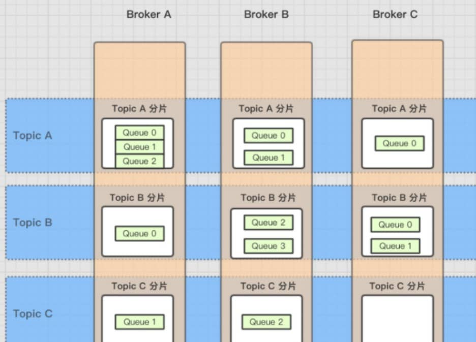

> 摘要：阿里开源的一个**队列模型**的消息中间件，有高性能、高吞吐量、高可靠、高实时、分布式的特点。为了解决 Kafka 的缺点：在**低延迟**和**高可靠性**方面的表现不能满足要求。

<!-- more -->

---

## 目录

[TOC]

## RocketMQ

阿里开源的一个**队列模型**的（分布式）消息中间件，有高性能、（高吞吐量）、**低延时**（~~高实时~~）、**高可靠**的特点。

- 基于高可用分布式集群技术，提供**低延时**的、**高可靠**的消息发布与订阅服务。
- 包括了数据存储、**高可用**（主从同步）、RPC 通信、注册中心、配置中心等方面的知识与代码实现。
- 是阿里巴巴在 2012 年开源的分布式消息中间件，目前已经捐赠给 Apache 软件基金会，是 Apache 的顶级项目。
    - 作为经历过多次阿里巴巴双十一这种“超级工程”的洗礼，并有稳定出色表现的国产中间件，以其**高性能、低延时和高可靠**等特性，近年来已经也被越来越多的国内企业使用。
- 常用用法有：基本消息（消息发送、消费），顺序消息，延时消息，批量消息，过滤消息，消息事务，Logappender 日志，OpenMessaging。
- NameServer 的端口是 **9876**，Broker 的端口是 **10911**，自动主从切换 Controller 端口是 **9878**。dashboard 控制台端口**8082**。

[Apache 官方文档](https://rocketmq.apache.org/zh/docs/)

### 背景

淘宝中间件团队在对 Kafka 做过充分 Review 之后， Kafka 无限消息堆积，高效的持久化速度吸引了我们。

- Kafka 缺点：在**低延迟**和**高可靠性**方面的表现不能满足要求。

- 但是，同时发现这个消息系统**主要定位于**日志传输，对于使用在淘宝**交易、订单、充值**等场景下还有诸多特性不满足，为此我们重新用 Java 语言编写了 RocketMQ ，定位于非日志的**可靠消息传输**（日志场景也 OK）。

目前 RocketMQ 在阿里集团被广泛应用在订单，交易，充值，流计算，消息推送，日志流式处理， binglog 分发等场景。

## ~~开发者指南~~

> 旨在帮助快速了解并使用 Apache RocketMQ

#### 1. 概念和特性

- [概念(Concept)](concept.md)：介绍RocketMQ的基本概念模型。

- [特性(Features)](features.md)：介绍RocketMQ实现的功能特性。 

#### 2. 架构设计

- [架构(Architecture)](architecture.md)：介绍RocketMQ部署架构和技术架构。

- [设计原理(Design)](design.md)：介绍RocketMQ关键机制的设计原理，主要包括**消息存储、通信机制、消息过滤、负载均衡、事务消息**等。

#### 3. 样例

- [样例(Example)](RocketMQ_Example.md) ：介绍RocketMQ的常见用法，包括基本样例、顺序消息样例、延时消息样例、批量消息样例、过滤消息样例、事务消息样例等。

#### 4. 最佳实践

- [最佳实践（Best Practice）](best_practice.md)：介绍RocketMQ的最佳实践，包括生产者、消费者、Broker以及NameServer的最佳实践，**客户端的配置方式**以及JVM和linux的最佳参数配置。
- [消息轨迹指南(Message Trace)](msg_trace/user_guide.md)：介绍RocketMQ消息轨迹的使用方法。
- [权限管理(Auth Management)](acl/user_guide.md)：介绍如何快速部署和使用支持**权限控制**特性的RocketMQ集群。
- [自动主从切换快速开始](controller/quick_start.md)：RocketMQ 5.0
    - [自动主从切换部署升级指南](controller/deploy.md)
- [Proxy 部署指南](proxy/deploy_guide.md)：介绍如何部署Proxy (包括 `Local` 模式和 `Cluster` 模式).

#### 5. 运维管理

- [集群部署(Operation)](operation.md)：介绍单Master模式、多Master模式、多Master多slave模式等RocketMQ集群各种形式的部署方法以及运维工具mqadmin的使用方式。

集群搭建：

在 `conf` 目录下，RocketMQ 提供了多种 Broker 的配置文件：

1. `broker.conf` ：单主，异步刷盘。
2. `2m/` ：双主，异步刷盘。
3. `2m-2s-async/` ：两主两从，**异步复制**，异步刷盘。
4. `2m-2s-sync/` ：两主两从，同步复制，异步刷盘。
5. `dledger/` ：[Dledger 集群](https://github.com/apache/rocketmq/blob/master/docs/cn/dledger/deploy_guide.md)，至少三节点。

#### 6. RocketMQ 5.0 新特性

- [POP消费](https://github.com/apache/rocketmq/wiki/%5BRIP-19%5D-Server-side-rebalance,--lightweight-consumer-client-support)
- [StaticTopic](statictopic/RocketMQ_Static_Topic_Logic_Queue_设计.md)
- [BatchConsumeQueue](https://github.com/apache/rocketmq/wiki/RIP-26-Improve-Batch-Message-Processing-Throughput)
- **[自动主从切换](controller/design.md)**
- [BrokerContainer](BrokerContainer.md)
- [SlaveActingMaster模式](SlaveActingMasterMode.md)
- [Grpc Proxy]()

## 功能特性

### ~~样例代码~~

> 见 RocketMQ 样例文档。

快速入门

**定时消息**

消费重试

消费异常处理机制

广播消费

**顺序消息**

**消息过滤**

**事务消息**

监控端点

更多的配置项信息

接入阿里云的消息队列 RocketMQ

### 总结

1. RocketMQ 提供的高级消息类型：
    1. **顺序消息**：支持消费者按照发送消息的先后顺序获取消息，从而实现业务场景中的顺序处理。
    2. **定时/延时消息**：消息被发送至服务端后，在指定时间后才能被消费。通过设置定时时间，可以实现分布式场景的延时调度触发效果。
    3. **事务消息**：支持在分布式场景下保障消息生产和本地事务的**最终一致性**。
2. 消息过滤：消费者可以通过**订阅**指定**消息标签**对消息进行过滤，确保最终只接收被过滤后的消息合集。过滤规则的计算和匹配在服务端完成。
    - 消息标签（`MessageTag`）：细粒度消息分类属性，可以在**主题**层级之下做消息类型的细分。
3. 消息可靠性
4. 至少一次
5. 消费：
    1. 广播消费
    2. 集群消费
    3. 消息异常处理机制
    4. 消费重试
6. 流量控制
7. 消费者负载均衡
8. 消费进度管理：
    - 消息位点（`MessageQueueOffset`）：消息是按到达服务端的**先后顺序**存储在指定主题的多个队列中，每条消息在队列中都有一个唯一的Long类型坐标，即消息位点。
    - 消费位点（`ConsumerOffset`）：一条消息被某个消费者消费完成后不会立即从队列中删除，RocketMQ 会基于每个**消费者分组**记录消费过的最新一条消息的位点，即消费位点。
    - 重置消费位点：以时间轴为坐标，在消息持久化存储的时间范围内，重新设置消费者分组对已订阅主题的消费进度，设置完成后消费者将接收设定时间点之后，由生产者发送到服务端的消息。
9. 死信队列
10. 消息存储和清理机制
    - 消息堆积：生产者已经将消息发送到服务端，但由于消费者的消费能力有限，未能在短时间内将所有消息正确消费掉，此时在服务端保存着未被消费的消息，该状态即消息堆积。
11. RocketMQ 5.0 开始支持**自动主从切换**的模式。

### 高级消息类型

#### 2 顺序消息

消息有序：指的是一类消息消费时，能按照发送的顺序来消费。

- 例如：一个订单产生了三条消息分别是订单**创建、付款、完成**。消费时要按照这个顺序消费才能有意义，但是同时订单之间是可以并行消费的。
- RocketMQ可以严格的保证消息有序。

顺序消息分为全局顺序消息与分区顺序消息，全局顺序是指某个Topic下的所有消息都要保证顺序；部分顺序消息只要保证每一组消息被顺序消费即可。

- **全局顺序**：对于指定的一个 Topic，**所有消息**按照严格的先入先出（FIFO）的顺序进行发布和消费。
    - 适用场景：**性能要求不高**。
- **分区顺序**：对于指定的一个 Topic，所有消息根据 sharding key （为分区字段）进行区块分区。 **同一个分区内的**消息按照严格的 FIFO 顺序进行发布和消费。 
    - Sharding key 是顺序消息中用来**区分不同分区**的关键字段，和普通消息的 Key 是完全不同的概念。
    - 适用场景：**性能要求高**。

#### 定时 / 延时消息

定时消息（延迟队列）：指消息发送到broker后，不会立即被消费，**等待特定时间投递**给真正的topic。

- broker有配置项messageDelayLevel，默认值为“`1s 5s 10s 30s 1m 2m 3m 4m 5m 6m 7m 8m 9m 10m 20m 30m 1h 2h`”，18个level。也可以配置自定义。
- 注意，messageDelayLevel是broker的属性，不属于某个topic。
- 发消息时，设置delayLevel等级即可：msg.setDelayLevel(level)。

level有以下三种情况：

1. level == 0，消息为非延迟消息
2. 1<=level<=maxLevel，消息延迟特定时间，例如level==1，延迟1s
3. level > maxLevel，则level== maxLevel，例如level==20，延迟2h

定时消息会暂存在名为SCHEDULE_TOPIC_XXXX的topic中，并根据delayTimeLevel存入特定的queue，queueId = delayTimeLevel – 1，

- 即一个queue只存相同延迟的消息，保证具有相同发送延迟的消息能够顺序消费。
- broker会调度地消费SCHEDULE_TOPIC_XXXX，将消息写入真实的topic。

需要注意的是，定时消息会在第一次写入和调度写入真实topic时都会计数，因此发送数量、tps都会变高。

##### 使用

用户在美团 APP 下单，假如**没有立即支付**，进入订单详情会显示倒计时，如果超过支付时间，订单就会被**自动取消**。

非常优雅的方式是：**使用消息队列的延时消息**。

1. 订单服务生成订单后，发送一条**延时消息**到消息队列。
2. 消息队列在消息到达**支付过期时间**时，将消息投递给消费者，
3. 消费者收到消息之后，判断订单状态是否为已支付。假如未支付，则执行取消订单的逻辑。


RocketMQ 4.X 生产者发送延迟消息代码如下：

```java
Message msg = new Message();
msg.setTopic("TopicA");
msg.setTags("Tag");
msg.setBody("this is a delay message".getBytes());
//设置延迟level为5，对应延迟1分钟
msg.setDelayTimeLevel(5);
producer.send(msg);
```

RocketMQ 4.X 版本默认支持 18 个 level 的延迟消息， 通过 broker 端的 messageDelayLevel 配置项确定的。

RocketMQ 5.X 版本支持任意时刻延迟消息，客户端在构造消息时提供了 3 个 API 来指定延迟时间或定时时间。


#### 7 事务消息

> 见 [分布式事务消息](#分布式事务消息)

事务消息（Transactional Message）：指应用本地事务和发送消息操作可以被定义到**全局事务**中，要么同时成功，要么同时失败。

- RocketMQ的事务消息提供类似 `X/Open XA` 的**分布事务**功能，通过事务消息能达到**分布式事务**的最终一致。

### ~~1 订阅与发布~~

- 消息的发布是指某个生产者向某个topic发送消息；
- 消息的订阅是指某个消费者关注了某个topic中带有某些tag的消息，进而从该topic消费数据。

### 3 消息过滤

RocketMQ的消费者可以**根据Tag**进行消息过滤，也支持自定义属性过滤。消息过滤目前是在**Broker端实现**的。

- 优点：减少了对于Consumer无用消息的网络传输，
- 缺点：增加了Broker的负担、而且实现相对复杂。

### 4 消息可靠性

RocketMQ支持消息的高可靠，影响消息可靠性的几种情况：

1. Broker非正常关闭
2. Broker异常Crash
3. OS Crash
4. 机器掉电，但是能立即恢复供电情况
5. 机器无法开机（可能是cpu、主板、内存等关键设备损坏）
6.  磁盘设备损坏

1)、2)、3)、4) 四种情况都属于**硬件资源**可立即恢复情况，RocketMQ在这四种情况下能保证消息不丢，或者丢失少量数据（依赖**刷盘方式**是同步还是异步）。

5)、6)属于**单点故障**，且无法恢复，一旦发生，在此单点上的消息全部丢失。RocketMQ在这两种情况下，通过**异步复制**，可保证99%的消息不丢，但是仍然会有极少量的消息可能丢失。

- 通过**同步双写技术**可以完全避免单点，会影响性能，适合对消息**可靠性要求极高**的场合，例如与Money相关的应用。
- 注：RocketMQ从3.0版本开始支持同步双写。

### 5 至少一次

至少一次(At least Once)指每个消息必须投递一次。Consumer先Pull消息到本地，消费完成后，才向服务器返回ack，如果没有消费一定不会ack消息，所以RocketMQ可以很好的支持此特性。

### ~~消费~~

#### 广播消费

#### 集群消费

#### 消费异常处理机制


### 重试机制

#### 6 回溯消费

回溯消费：指Consumer**已经消费成功**的消息，由于**业务上的需求**需要重新消费。要支持此功能，Broker在向Consumer投递成功消息后，消息仍然需要**保留**。

- 重新消费一般是按照**时间维度**：例如由于Consumer系统故障，恢复后需要重新消费1小时前的数据，那么Broker要提供一种机制，可以按照时间维度来**回退**消费进度。
- RocketMQ支持按照时间**回溯消费**，时间维度精确到毫秒。

#### 9 消息重试

Consumer消费消息失败后，要提供一种重试机制，令消息再消费一次。Consumer消费消息失败通常可以认为有以下几种情况：

1. 由于消息本身的原因，例如**反序列化**失败，消息数据本身无法处理（例如**话费充值**，当前消息的手机号被注销，无法充值）等。
    - 这种错误通常需要跳过这条消息，再消费其它消息，而这条失败的消息即使立刻重试消费，99%也不成功，所以最好提供一种**定时重试**机制，即过10秒后再重试。
2. 由于**依赖的下游应用服务**不可用，例如db连接不可用，外系统网络不可达等。
    - 遇到这种错误，即使跳过当前失败的消息，消费其他消息同样也会报错。这种情况建议**应用sleep 30s**，再消费下一条消息，这样可以减轻Broker重试消息的压力。

RocketMQ会为每个消费组都设置一个Topic名称为“`%RETRY%+consumerGroup`”的**重试队列**（注意，这个Topic的重试队列是**针对消费组**，而不是针对每个Topic设置的），用于暂时保存因为各种异常而导致Consumer端无法消费的消息。

- 考虑到异常恢复起来需要一些时间，会为重试队列设置**多个重试级别**，每个重试级别都有与之对应的**重新投递延时**，重试次数越多投递延时就越大。
- RocketMQ对于**重试消息**的处理是先保存至Topic名称为“`SCHEDULE_TOPIC_XXXX`”的**延迟队列**中，**后台定时任务**按照对应的时间进行Delay后重新保存至“`%RETRY%+consumerGroup`”的重试队列中。

#### 10 消息重投

生产者在发送消息时，**同步消息失败**会重投，异步消息有重试，oneway没有任何保证。消息重投保证消息尽可能发送成功、不丢失，但可能会造成**消息重复**。

- **重复消息**在RocketMQ中是无法避免的问题。
    1. 在一般情况下不会发生，
    2. 当出现消息量大、网络抖动，消息重复就会是大概率事件。
    3. 另外，生产者主动重发、consumer负载变化也会导致重复消息。

如下方法可以设置**消息重试策略**：

1. `retryTimesWhenSendFailed`：**同步**发送失败重投次数，默认为2，因此生产者会最多尝试发送retryTimesWhenSendFailed + 1次。
    - 不会选择上次失败的broker，尝试向其他broker发送，最大程度保证消息不丢。
    - 超过重投次数，抛出异常，由客户端保证消息不丢。
    - 当出现RemotingException、MQClientException和部分MQBrokerException时会重投。
2. `retryTimesWhenSendAsyncFailed`：**异步**发送失败重试次数，异步重试不会选择其他broker，仅在同一个broker上做重试，不保证消息不丢。
3. `retryAnotherBrokerWhenNotStoreOK`：**消息刷盘**（主或备）超时或slave不可用（返回状态非SEND_OK），是否尝试发送到其他broker，默认false。十分重要消息可以开启。

### 11 流量控制

生产者流控，因为broker处理能力达到瓶颈；消费者流控，因为消费能力达到瓶颈。

生产者流控：

1. commitLog文件被锁时间超过`osPageCacheBusyTimeOutMills`时，参数默认为1000ms，返回流控。
2. 如果开启`transientStorePoolEnable == true`，且broker为异步刷盘的主机，且transientStorePool中资源不足，拒绝当前send请求，返回流控。
3. broker每隔10ms检查send请求队列头部请求的等待时间，如果超过`waitTimeMillsInSendQueue`，默认200ms，拒绝当前send请求，返回流控。
4. broker通过拒绝send 请求方式实现流量控制。

注意，生产者流控，不会尝试**消息重投**。

消费者流控：

1. 消费者本地缓存**消息数**超过`pullThresholdForQueue`时，默认1000。
2. 消费者本地缓存**消息大小**超过`pullThresholdSizeForQueue`时，默认100MB。
3. 消费者本地缓存**消息跨度**超过`consumeConcurrentlyMaxSpan`时，默认2000。

消费者流控的结果是降低拉取频率。

### 12 死信队列

死信队列：用于处理无法被正常消费的消息。

1. 当一条消息**初次消费失败**，消息队列会自动进行消息重试；
2. 达到最大重试次数后，若消费依然失败，则表明消费者在正常情况下无法正确地消费该消息。此时，消息队列 不会立刻将消息丢弃，而是将其发送到该消费者对应的**死信队列**中。

RocketMQ将这种正常情况下无法被消费的消息称为**死信消息**（Dead-Letter Message），将存储死信消息的特殊队列称为**死信队列**（Dead-Letter Queue）。

- 在RocketMQ中，可以通过使用**console控制台**对死信队列中的消息进行重发来使得消费者实例再次进行消费。

### ~~监控端点~~

### ~~更多的配置项信息~~

## 消息模型

> RocketMQ 中的消息模型和 Kafaka 类似，把 Kafaka 中的**分区**换成了**队列**。不过虽然消息模型类似，但是实现方式还是有很大差别。

### 消息

消息（`Message`）：是最小数据传输单元。生产者将业务数据的负载和拓展属性包装成消息发送到服务端，服务端按照相关语义将消息投递到消费端进行消费。

- 消息类型（`MessageType`）：按照消息传输特性的不同而定义的分类，用于类型管理和安全校验。
    - 支持的消息类型有**普通消息、顺序消息、事务消息和定时/延时消息**。
    - 从5.0版本开始，支持**强制校验消息类型**，即每个主题Topic只允许发送一种消息类型的消息，这样可以更好的运维和管理生产系统，避免混乱。但同时保证向下兼容4.x版本行为，强制校验功能默认开启。

### 主题模式 / 发布订阅模式

> 技术架构四大角色

`RocketMQ` 通过在一个 `Topic` 中**配置多个队列**、且每个队列**维护**每个消费者组的**消费位置**，实现了**主题模式/发布订阅模式** 。

1. `Producer`（生产者）： 将业务消息按照要求**封装成消息**并发送至服务端。代表某一类的生产者，如多个**秒杀系统**合在一起，一般生产相同的消息。生产消息后指定向**主题中的某个队列**发送消息。
2. `Topic`（主题）： 消息传输和存储的顶层容器，用于标识**同一类业务逻辑**的消息，如**订单消息、物流消息**等。主题通过TopicName来做唯一标识和区分。一个主题中需维护**多个队列**，提高并发能力。
    - 消息队列（`MessageQueue`）：是消息存储和传输的实际容器，也是消息的最小存储单元。主题都是由**多个队列**组成，以此实现队列数量的水平拆分和队列内部的流式存储。队列通过`QueueId`来做唯一标识和区分。
3. `Con'sumer Group`（消费者组）： 承载多个消费行为一致的消费者的负载均衡分组。代表某一类的消费者，如多个**短信系统**合在一起，一般消费相同的消息。每个消费组在每个队列上维护一个**消费位移** 。
    - 和消费者不同，消费者分组并不是运行实体，而是一个逻辑资源。通过消费者分组内初始化多个消费者，实现消费性能的水平扩展以及**高可用**容灾。
    - 消费者（`Consumer`）：用来**接收并处理消息**的运行实体。通**从服务端**获取消息，并将消息转化成业务可理解的信息，供业务逻辑处理。
        - 订阅关系：是消费者获取消息、处理消息的规则和状态配置。由消费者分组**动态注册**到服务端系统，并在后续的消息传输中按照订阅关系定义的过滤规则，进行消息匹配和消费进度维护。




### ~~其它基本概念~~

Apache RocketMQ 中的基本概念：

- 消息视图（`MessageView`）：面向开发视角提供的一种消息只读接口。通过消息视图可以读取**消息内部的多个属性**和负载信息，但是不能对消息本身做任何修改。
- 消息轨迹：在一条消息从生产者发出到消费者接收并处理过程中，由各个相关节点的时间、地点等数据汇聚而成的完整链路信息。
    - 能清晰定位消息从生产者发出，经由服务端，投递给消费者的完整链路，方便定位排查问题。
- 消息索引（`MessageKey`）：面向消息的索引属性。可以快速查找到对应的消息内容。
- 事务检查器（`TransactionChecker`）：生产者用来执行**本地事务检查**和异常事务恢复的监听器。通过业务侧数据的状态来检查和判断事务消息的状态。
- 事务状态（`TransactionResolution`）：事务消息发送过程中，事务提交的状态标识，服务端通过事务状态控制事务消息是否应该提交和投递。
    - 事务状态包括事务提交、事务回滚和事务未决。
- 消费结果（`ConsumeResult`）：PushConsumer 消费监听器处理消息完成后返回的处理结果，用来标识本次消息是否正确处理。
    - 消费结果包含消费成功和消费失败。

## 架构


### 技术架构四大角色


RocketMQ架构上主要分为四部分，如上图所示：

消息模型（`Message Model`）：RocketMQ主要由 Producer、Broker、Consumer 三部分组成，其中Producer 负责生产消息，Consumer 负责消费消息，Broker 负责存储消息。

1. Broker 在实际部署过程中**对应一台服务器**，每个 Broker 可以存储多个Topic的消息，每个Topic的消息也可以**分片**存储于不同的 Broker。
2. Message Queue 用于**存储消息的物理地址**，每个Topic中的消息地址存储于多个 Message Queue 中。
3. ConsumerGroup 由多个Consumer 实例构成。

#### Producer

消息生产者（`Producer`）：负责生产消息，一般由业务系统负责生产消息。一个消息生产者会把业务应用系统里产生的消息发送到broker服务器。

- RocketMQ提供多种发送方式，**同步发送、异步发送、顺序发送、单向发送**。同步和异步方式均需要Broker返回确认信息，单向发送不需要。
- 支持分布式集群方式部署。Producer通过MQ的负载均衡模块选择相应的Broker集群队列进行消息投递，投递的过程支持快速失败并且低延迟。
- 生产者组（`Producer Group`）：同一类Producer的集合，这类Producer发送同一类消息且发送逻辑一致。
    - 如果发送的是**事务消息**且原始生产者在发送之后崩溃，则Broker服务器会联系同一生产者组的其他生产者实例以提交或回溯消费。

#### Consumer

消息消费者（`Consumer`）：负责消费消息，一般是后台系统负责**异步消费**。

- 一个消息消费者会从Broker服务器拉取消息、并将其提供给应用程序。从用户应用的角度而言提供了两种消费形式：支持以push推，pull拉两种模式对消息进行消费。
    1. 拉取式消费（`Pull Consumer`）：应用通常**主动调用**Consumer的拉消息方法从Broker服务器拉消息、主动权由应用控制。一旦获取了批量消息，应用就会启动消费过程。
    2. 推动式消费（`Push Consumer`）：应用不需要主动调用Consumer的拉消息方法，在底层已经封装了拉取的调用逻辑，在用户层面看来是broker把消息**推送过来**的，其实底层还是consumer去broker主动拉取消息。
- 同时也支持集群方式和广播方式的消费。RocketMQ 支持两种消息模式：
    1. 集群消费（`Clustering`）：集群消费模式下，相同Consumer Group的每个Consumer实例平均分摊消息。同一条消息只会被**相同**消费者分组的**一个**消费者所消费。 
    2. 广播消费（`Broadcasting`）：广播消费模式下，相同Consumer Group的每个Consumer实例都接收全量的消息。同一条消息会被**相同**消费者分组的**所有**消费者所消费。
- 提供**实时消息订阅机制**，可以满足大多数用户的需求。
- 支持分布式集群方式部署。即**消费者组**（`Consumer Group`）：同一类Consumer的集合，这类Consumer通常消费同一类消息且消费逻辑一致。
    - 消费者组使得在消息消费方面，实现**负载均衡**和容错的目标变得非常容易。
    - 要注意的是，消费者组的消费者实例必须**订阅完全相同的Topic**。

#### NameServer

**名称服务器**（`Name Server`，注册中心）：是一个非常简单的**Topic路由注册中心**，（其角色类似Dubbo中的zookeeper），支持Broker的动态注册与发现。主要提供两个功能：

1. Broker 管理：接受Broker集群的注册信息并且保存下来作为路由信息的基本数据。然后提供心跳检测机制，检查Broker是否还存活；
2. **路由信息管理** ：充当路由消息的提供者。每个NameServer将保存关于Broker集群的整个路由信息和用于客户端查询的队列信息。然后Producer和Consumer通过NameServer就可以知道整个Broker集群的路由信息（查找各主题相应的Broker IP列表），从而进行消息的投递和消费。
    - NameServer通常也是集群的方式部署，各实例间相互独立、不进行信息通讯。Broker是向每一台NameServer注册自己的路由信息，所以每一个NameServer实例上面都保存一份完整的路由信息。
    - 当某个NameServer因某种原因下线了，Broker仍然可以向其它NameServer同步其路由信息，Producer和Consumer仍然可以动态感知Broker的路由的信息。

#### Broker

代理服务器（`Broker Server`，~~消息（队列）服务器~~）：消息中转角色，负责存储、转发消息。

- 例如说在 RocketMQ 中，Broker 负责接收从生产者发送来的消息并存储、同时为消费者的拉取请求作准备。
- 另外，Broker 也存储消息相关的元数据，包括**消费者组、消费进度偏移和主题和队列消息**等。

- `Broker` 会将**路由表**注册到 `NameServer` 中，消费者和生产者就从中获取**路由表**、然后按照路由表的信息和对应的 `Broker` 进行通信。

- 服务高可用保证（用多个 `Broker` 来保证**负载均衡**）。

其他概念：

1. 主题（`Topic`）：表示一类消息的集合，每个主题包含若干条消息，每条消息只能属于一个主题，是RocketMQ进行消息订阅的基本单位。
    - 一个 `Topic` 分布在多个 `Broker`上，一个 `Broker` 可配置多个 `Topic` ，是多对多的关系。
2. 消息（`Message`）：消息系统所传输信息的物理载体，生产和消费数据的最小单位，每条消息必须属于一个主题。RocketMQ中每个消息拥有唯一的Message ID，且可以携带具有业务标识的Key。系统提供了通过Message ID和Key查询消息的功能。
    - 标签（`Tag`）：为消息设置的标志，用于同一主题下区分不同类型的消息。来自同一业务单元的消息，可以根据不同业务目的在同一主题下设置不同标签。标签能够有效地保持代码的清晰度和连贯性，并优化RocketMQ提供的查询系统。消费者可以根据Tag实现对不同子主题的不同消费逻辑，实现更好的扩展性。
    - 普通顺序消息（`Normal Ordered Message`）：普通顺序消费模式下，消费者通过同一个消息队列（ Topic 分区，称作 Message Queue） 收到的消息是有顺序的，不同消息队列收到的消息则可能是无顺序的。
    - 严格顺序消息（`Strictly Ordered Message`）：严格顺序消息模式下，消费者收到的所有消息均是有顺序的。

~~为了实现这些功能，Broker包含了以下几个重要子模块。~~

1. `Remoting Module`：整个Broker的实体，负责处理来自Client端的请求。
2. `Client Manager`：负责管理客户端(Producer/Consumer)和维护Consumer的Topic订阅信息。
3. `Store Service`：提供方便简单的API接口处理消息存储到物理硬盘和查询功能。
4. `HA Service`：**高可用服务**，提供Master Broker 和 Slave Broker之间的数据同步功能。
5. `Index Service`：根据特定的Message key对投递到Broker的消息进行索引服务，以提供消息的快速查询。


### ~~存储机制~~

> 在 `Topic` 中的队列是以什么样的形式存在？


### 网络部署架构

1. `NameServer`是一个几乎**无状态节点**，可集群部署，节点之间无任何信息同步。
2. `Broker`部署相对复杂：
    - Broker分为Master与Slave，RocketMQ 支持**一主多从**，即一个Master可以对应多个Slave，但是一个Slave只能对应一个Master。
    - Master与Slave 的对应关系通过**指定相同的 BrokerName**、**不同的 BrokerId** 来定义。
        - BrokerId为0表示Master，非0表示Slave。
        - 只有BrokerId=1的从服务器才会参与**消息的读负载**。
    - Master也可以部署多个。每个Broker与`NameServer`集群中的所有节点建立长连接，定时注册Topic信息到所有NameServer。
3. `Producer`**完全无状态**，可集群部署。
    - `Producer` 与`NameServer`集群中的一个节点（随机选择）建立**长连接**，定期从NameServer获取Topic路由信息，并向提供 Topic 服务的Master建立长连接，且定时向 Master **发送心跳**。
4. `Consumer`与`NameServer`集群中的一个节点（随机选择）建立长连接，定期从NameServer获取Topic路由信息，并向提供Topic服务的Master、**Slave**建立长连接，且定时向Master、Slave发送心跳。
    - Consumer既可以从Master订阅消息，也可以从Slave订阅消息。消费者在向Master拉取消息时，Master服务器会根据**拉取偏移量**与最大偏移量的距离（判断是否读老消息，产生读I/O）、以及**从服务器**是否可读等因素，建议下一次是从Master还是Slave拉取。

### 集群工作流程


结合部署架构图，描述**集群工作流程**：

1. 启动 **Namesrv**：起来后监听端口，等待 Broker、Producer、Consumer 连上来，相当于一个路由控制中心。
2. **Broker** 启动，跟所有的 Namesrv 保持长连接，定时**发送心跳包**。
    - 心跳包中，包含当前 Broker 信息（IP+端口等）以及存储所有 Topic 信息。
    - 注册成功后，Namesrv 集群中就有 Topic 跟 Broker 的映射关系。
3. 收发消息前，先**创建 Topic** 。
    - 创建 Topic 时，需要指定该 Topic 要存储在哪些 Broker上。
    - 也可以在发送消息时自动创建Topic。
4. **Producer 启动**并发送消息：
    1. 启动时，先跟 Namesrv 集群中的一台建立**长连接**，并从中获取当前发送的 Topic 准备存在哪些 Broker 上。
    2. 然后跟对应的 Broker 建立长连接，直接向 Broker 发消息。
5. **Consumer 启动**并消费消息：
    1. Consumer 跟 Producer 类似。跟其中一台 Namesrv 建立长连接，获取当前订阅 Topic 存在哪些 Broker 上。
    2. 然后直接跟 Broker 建立连接通道，开始消费消息。

### 实现高可用的原理

#### **1. Producer**

- Producer 自身在应用中，所以**无需考虑**高可用。
- Producer 配置多个 Namesrv 列表，从而保证 Producer 和 **Namesrv 的连接**高可用。并且，会从 Namesrv **定时拉取**最新的 Topic 信息。
- Producer 会和所有 Consumer 直连，在发送消息时，会选择一个 Broker 进行发送。如果发送失败，则会使用另外一个 Broker 。
- Producer 会定时向 Broker **心跳**，证明其存活。而 Broker 会**定时检测**，判断是否有 Producer 异常下线。

#### **2. Consumer**

- Consumer 需要**部署多个节点**，以保证 Consumer 自身的高可用。当相同消费者分组中有新的 Consumer 上线，或者老的 Consumer 下线，会重新分配 Topic 的 Queue 到目前消费分组的 Consumer 们。
- Consumer 配置多个 Namesrv 列表，从而保证 Consumer 和 Namesrv 的连接高可用。并且，会从 Consumer 定时拉取最新的 Topic 信息。
- Consumer 会和所有 Broker 直连，消费相应分配到的 Queue 的消息。如果消费失败，则会发回消息到 Broker 中。
- Consumer 会定时向 Broker 心跳，证明其存活。而 Broker 会定时检测，判断是否有 Consumer 异常下线。

#### **3. Namesrv**

- Namesrv 需要**部署多个节点**，以保证其高可用。
- Namesrv 本身是无状态，**不产生数据的存储**，是通过 Broker 心跳将 Topic 信息同步到 Namesrv 中。
- 多个 Namesrv 之间不会有数据的同步，是通过 Broker **向多个 Namesrv 多写**。

#### **4. Broker**

- 多个 Broker 可以形成一个 Broker 分组。每个 Broker 分组存在一个 Master 和多个 Slave 节点。
    - Master 节点，可提供读和写功能。Slave 节点，可提供读功能。
    - Master 节点会不断发送新的 **CommitLog** 给 Slave节点。Slave 节点不断上报本地的 CommitLog **已经同步到的位置**给 Master 节点。
    - Slave 节点会从 Master 节点拉取**消费进度**、Topic 配置等。
- 多个 Broker 分组，形成 Broker 集群。Broker 集群和集群之间，不存在通信与数据同步。
- Broker 可以配置**同步刷盘或异步刷盘**，根据消息的持久化的可靠性来配置。


## 消息消费问题

1. 消息丢失：
2. 消息堆积：
3. 重复消费：
4. 保证顺序消费：
5. 保证数据一致性：分布式事务消息 + 事务反查机制
6. 保证高可用：

### 消息丢失

1. 生产者：事务消息
2. Broker：刷盘机制
3. 消费者：

#### 刷盘机制

> 队列中的消息是如何进行存储持久化？

在单个结点层面：

- **同步刷盘**：生产者消息发过来时，只有**持久化**到磁盘，**Broker 存储端**（MQ）才返回一个成功的 `ACK` 。
    - 能保证**消息不丢失**，但是影响了性能。
    - 适用于**金融**等特定业务场景。
- ~~**异步刷盘**~~：采用后台**异步线程**提交的方式执行刷盘操作。只要消息**写入PageCache 缓存**，就返回一个成功的**ACK响应**。
    - 提高了MQ的性能，但是如果这时候**机器断电**了，就会丢失消息。
    - 适用于（如**发验证码**等）对于消息保证要求不太高的业务场景。

集群主从模式下：`Borker` 一般是集群部署的，根据主节点返回消息给客户端时是否需要**同步从节点**分类：

- **同步复制**（同步双写）：只有主节点和从节点**都写入成功**，才反馈成功的ack给生产者。 保证了消息不丢失，但是降低了系统的吞吐量。
- **异步复制**： 只要消息写入主节点成功，就返回成功的ack。速度快，但是会有性能问题。

### ~~消息堆积~~

### ~~重复消费~~

### ~~保证顺序消费~~

### 保证数据一致性

分布式事务消息 + 事务反查机制

#### 分布式事务消息

事务消息是的实现：

1. 生产者产生消息，发送一条**半事务消息**到MQ服务器；
2. MQ收到消息后，将消息**持久化**到存储系统，【这条消息的状态是**待发送**状态】；
3. MQ服务器返回ACK确认给生产者，此时MQ不会触发消息推送事件；
4. **事务**：生产者执行业务操作、本地事务；
5. **事务**：如果本地事务执行成功，即`commit`执行结果到MQ服务器；如果执行失败，发送`rollback`；
6. 如果是正常的`commit`，【MQ服务器更新消息状态为**可发送**】；如果是`rollback`，即删除消息；
7. 如果消息状态更新为可发送，则MQ服务器会**`push`消息**给消费者。
8. 消费者消费完返回 ACK 给 MQ；
9. **事务**：如果MQ服务器长时间没有收到**生产者**的`commit`或者`rollback`，它会**反查生产者**，然后根据查询到的结果执行最终状态。


### ~~保证高可用~~

见上 [实现高可用的原理](#实现高可用的原理)


## 安装

#### 启动

```shell
start mqnamesrv.cmd
start mqbroker.cmd -n 127.0.0.1:9876 autoCreateTopicEnable=true
```

#### 问题

- `Please set the ROCKETMQ_HOME variable in your environment!`
    - 解决：修改runserver.sh文件,将71行和76行的Xms和Xmx等改小一点
- 找不到或无法加载主类 `org.apache.rocketmq.namesrv.namesrvstartup`
    - 解决：修改broker的配置文件

## dashboard 控制台

是 RocketMQ 的图形化管理控制台，提供 Broker 集群信息查看，Topic 管理，Producer、Consumer 信息展示，消息查询等等常用功能。

### 安装搭建

下载 rocketmq-dashboard 可视化控制台，并打包 

```shell
mvn clean package -Dmaven.test.skip=true
#cmd进入项目target目录，执行
java -jar rocketmq-dashboard-2.1.0.jar --server.port=8082
#java -jar rocketmq-dashboard-2.1.0.jar --server.port=18001 --rocketmq.config.namsrvAddr=127.0.0.1:9876 > dashboard.log 2>&1 &

#idea maven npm Process exited with an error

netstat -aon|findstr "8082"  	#看端口是否被占用
taskkill -pid 8838 -f   // -t(结束该进程) -f(强制结束该进程以及所有子进程) 

http://127.0.0.1:8082/dashboard/topic.query
```


